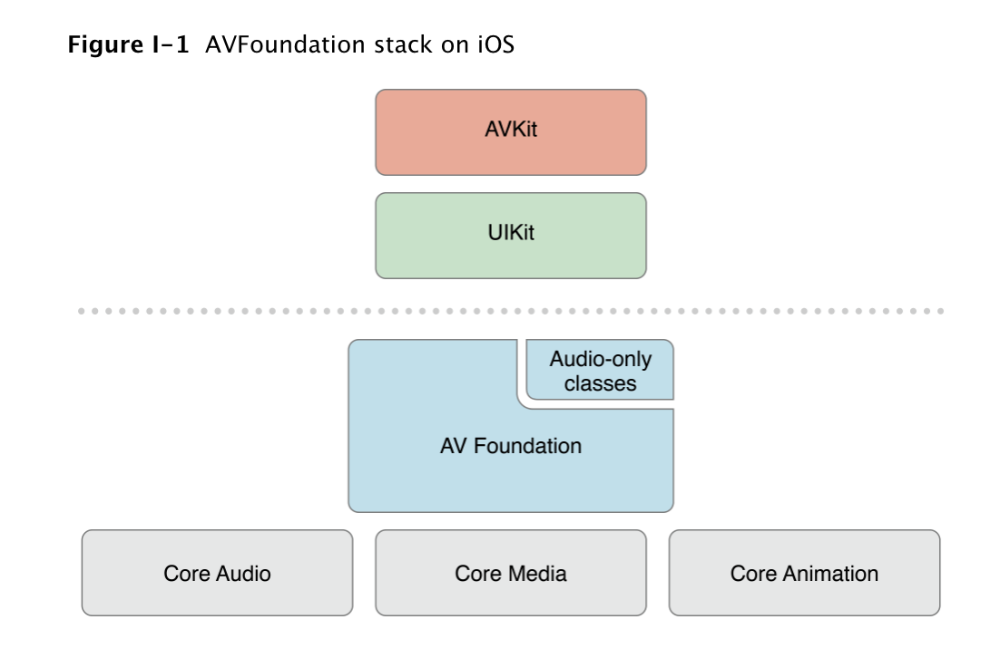
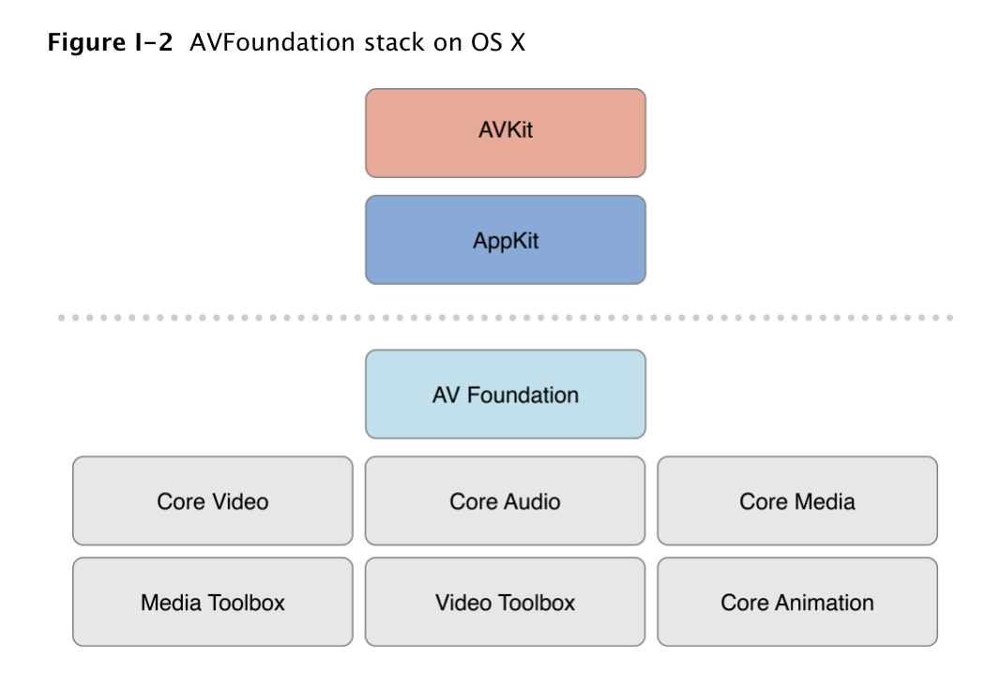
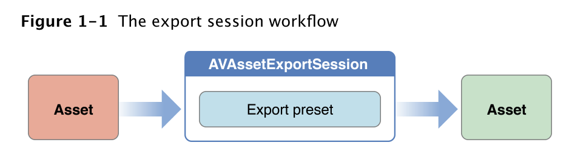
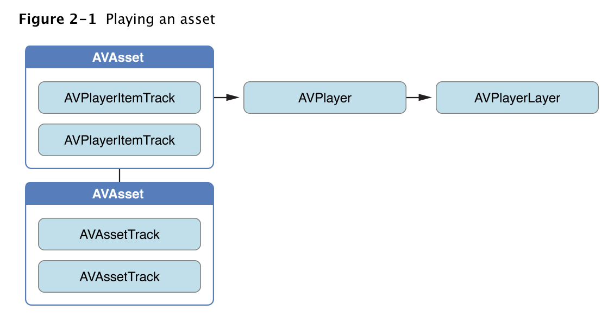
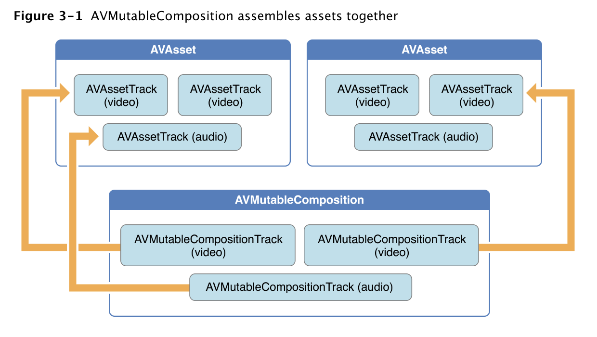
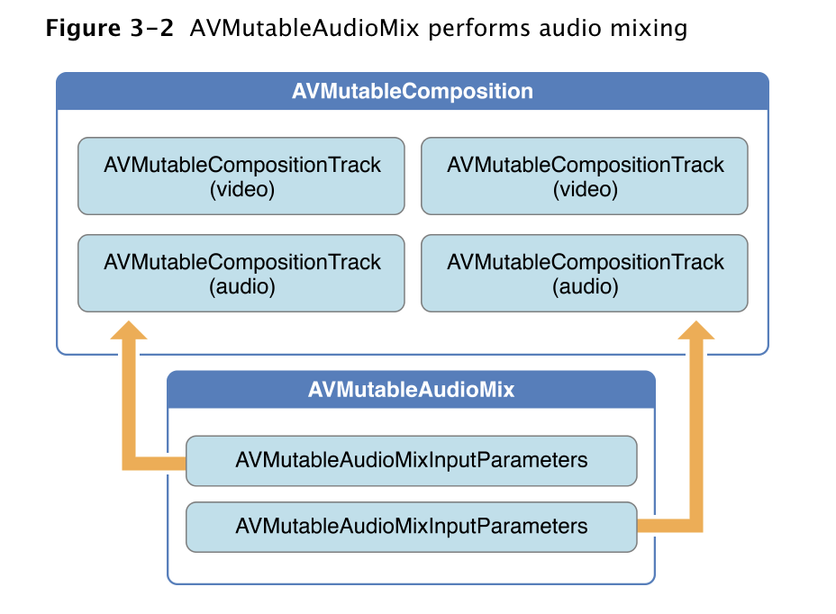
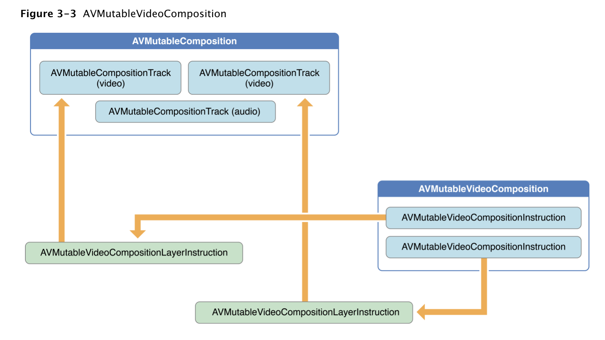
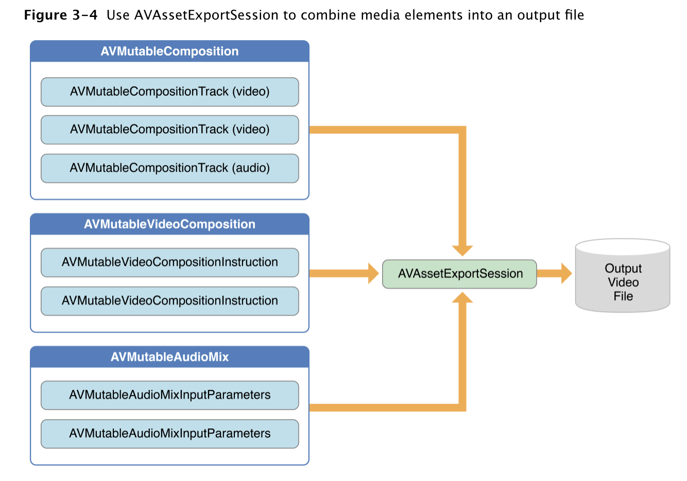

# AVFoundation Programming Guide - AVFoundation 编程指引

翻译自英文完整版 https://developer.apple.com/library/archive/documentation/AudioVideo/Conceptual/AVFoundationPG/Articles/00_Introduction.html#//apple_ref/doc/uid/TP40010188?language=objc

## About AVFoundation - AVFoundation 概述

> AVFoundation is one of several frameworks that you can use to play and create time-based audiovisual media. It provides an Objective-C interface you use to work on a detailed level with time-based audiovisual data. For example, you can use it to examine, create, edit, or reencode media files. You can also get input streams from devices and manipulate video during realtime capture and playback. Figure I-1 shows the architecture on iOS.

AVFoundation 是可以用来播放并且创建基于时间的视听媒体的框架之一。框架提供了一系列 Objective-C 的接口，使用这些接口可以从非常全面的角度处理基于时间的视听媒体数据。例如，你可以用它来检查、创建、编辑或者重新编码媒体文件。甚至可以捕获来自硬件设备的输入流，可以在实时捕捉及播放的视频流中操纵视频数据。图 I-1 描述了其在 iOS 平台上的架构。



> Figure I-2 shows the corresponding media architecture on OS X.

图 I-2 描述了 OS X 平台上媒体相关框架的架构。



> You should typically use the highest-level abstraction available that allows you to perform the tasks you want.
> - If you simply want to play movies, use the AVKit framework.
> - On iOS, to record video when you need only minimal control over format, use the UIKit framework ([UIImagePickerController](https://developer.apple.com/documentation/uikit/uiimagepickercontroller)).
>
> Note, however, that some of the primitive data structures that you use in AV Foundation—including time-related data structures and opaque objects to carry and describe media data—are declared in the Core Media framework.

通常，你应该使用可用的最高级别的抽象框架来完成你想完成的任务。
- 如果只是想简单的播放 movies ，使用 AVKit framework 。
- iOS 平台上，如果只是录制视频，对格式没有格外要求的情况下，使用 UIKit framework 的 [UIImagePickerController](https://developer.apple.com/documentation/uikit/uiimagepickercontroller) 。

需要注意的一点是，AV Foundation 中的一些原始数据结构其实是定义在 Core Media framework 中，这其中包括时间相关的数据结构、承载及描述媒体数据的相关对象。

### At a Glance - 摘要

> There are two facets to the AVFoundation framework—APIs related to video and APIs related just to audio. The older audio-related classes provide easy ways to deal with audio.
>
> - To play sound files, you can use [AVAudioPlayer](https://developer.apple.com/documentation/avfoundation/avaudioplayer).
> - To record audio, you can use [AVAudioRecorder](https://developer.apple.com/documentation/avfoundation/avaudiorecorder).
>
> You can also configure the audio behavior of your application using [AVAudioSession](https://developer.apple.com/documentation/avfoundation/avaudiosession); this is described in [Audio Session Programming Guide](https://developer.apple.com/library/archive/documentation/Audio/Conceptual/AudioSessionProgrammingGuide/Introduction/Introduction.html#//apple_ref/doc/uid/TP40007875).

AVFoundation framework 包含视频相关的 API 及音频相关的 API 。旧的音频相关的类提供了处理音频的简便方式。

- 播放音频文件，可以使用 [AVAudioPlayer](https://developer.apple.com/documentation/avfoundation/avaudioplayer) 。
- 录制音频，可以使用 [AVAudioRecorder](https://developer.apple.com/documentation/avfoundation/avaudiorecorder) 。

你也可以使用 [AVAudioSession](https://developer.apple.com/documentation/avfoundation/avaudiosession) 来配置应用程序的音频行为，[Audio Session Programming Guide](https://developer.apple.com/library/archive/documentation/Audio/Conceptual/AudioSessionProgrammingGuide/Introduction/Introduction.html#//apple_ref/doc/uid/TP40007875) 提供了相关的描述。

#### Representing and Using Media with AVFoundation - 通过 AVFoundation 表示以及使用媒体

> The primary class that the AV Foundation framework uses to represent media is [AVAsset](https://developer.apple.com/documentation/avfoundation/avasset). The design of the framework is largely guided by this representation. Understanding its structure will help you to understand how the framework works. An AVAsset instance is an aggregated representation of a collection of one or more pieces of media data (audio and video tracks). It provides information about the collection as a whole, such as its title, duration, natural presentation size, and so on. AVAsset is not tied to particular data format. AVAsset is the superclass of other classes used to create asset instances from media at a URL (see [Using Assets](https://developer.apple.com/library/archive/documentation/AudioVideo/Conceptual/AVFoundationPG/Articles/01_UsingAssets.html#//apple_ref/doc/uid/TP40010188-CH7-SW1)) and to create new compositions (see [Editing](https://developer.apple.com/library/archive/documentation/AudioVideo/Conceptual/AVFoundationPG/Articles/00_Introduction.html#//apple_ref/doc/uid/TP40010188-CH1-SW1)).

AVFoundation framework 用来表示媒体的最主要的类是 [AVAsset](https://developer.apple.com/documentation/avfoundation/avasset) 。整个框架的设计很大程度上受到这种抽象表示方法的引导。理解它的结构将会有助于理解整个框架是如何工作的。一段或多段媒体数据（音频轨道与视频轨道）构成一个集合，一个 AVAsset 实例就是这样一个集合的汇总表示。AVAsset 实例将整个集合作为一个整体，提供了一些诸如名称、时长、自然呈现大小等的信息。AVAsset 独立于特定的数据格式。通过使用 AVAsset 的子类，可以根据 URL 指定的媒体数据创建 asset 实例（see [Using Assets](https://developer.apple.com/library/archive/documentation/AudioVideo/Conceptual/AVFoundationPG/Articles/01_UsingAssets.html#//apple_ref/doc/uid/TP40010188-CH7-SW1) ），也可以创建新的 compositions（see [Editing](https://developer.apple.com/library/archive/documentation/AudioVideo/Conceptual/AVFoundationPG/Articles/00_Introduction.html#//apple_ref/doc/uid/TP40010188-CH1-SW1) ）。

> Each of the individual pieces of media data in the asset is of a uniform type and called a track. In a typical simple case, one track represents the audio component, and another represents the video component; in a complex composition, however, there may be multiple overlapping tracks of audio and video. Assets may also have metadata.
>
> A vital concept in AV Foundation is that initializing an asset or a track does not necessarily mean that it is ready for use. It may require some time to calculate even the duration of an item (an MP3 file, for example, may not contain summary information). Rather than blocking the current thread while a value is being calculated, you ask for values and get an answer back asynchronously through a callback that you define using a block.
>
> Relevant Chapters: [Using Assets](https://developer.apple.com/library/archive/documentation/AudioVideo/Conceptual/AVFoundationPG/Articles/01_UsingAssets.html#//apple_ref/doc/uid/TP40010188-CH7-SW1), [Time and Media Representations](https://developer.apple.com/library/archive/documentation/AudioVideo/Conceptual/AVFoundationPG/Articles/06_MediaRepresentations.html#//apple_ref/doc/uid/TP40010188-CH2-SW1)

asset 中媒体数据的每个单独的部分都是一个统一的类型，称为一个 track 。典型的简单情况下，其中一个 track 代表音频组件，另一个代表视频组件；然而，在复杂组合的情况下，可能存在多个重叠的音频和视频 track 。Assets 也可能有元数据。

AV Foundation 中一个重要的概念是，初始化一个 asset 或者一个 track 通常并不意味着它已经处于可以使用的状态了。可能需要一些时间去计算某些数据，比如某个 item 的持续时间（例如，一个可能不包含摘要信息的 MP3 文件）。你应该在当前线程发起查询某个值的请求，在 block 实现的异步回调中获取所需要的数据，而不是采用阻塞当前线程的方式。

相关章节：[Using Assets](https://developer.apple.com/library/archive/documentation/AudioVideo/Conceptual/AVFoundationPG/Articles/01_UsingAssets.html#//apple_ref/doc/uid/TP40010188-CH7-SW1)，[Time and Media Representations](https://developer.apple.com/library/archive/documentation/AudioVideo/Conceptual/AVFoundationPG/Articles/06_MediaRepresentations.html#//apple_ref/doc/uid/TP40010188-CH2-SW1)

#### Playback - 播放

> AVFoundation allows you to manage the playback of asset in sophisticated ways. To support this, it separates the presentation state of an asset from the asset itself. This allows you to, for example, play two different segments of the same asset at the same time rendered at different resolutions. The presentation state for an asset is managed by a player item object; the presentation state for each track within an asset is managed by a player item track object. Using the player item and player item tracks you can, for example, set the size at which the visual portion of the item is presented by the player, set the audio mix parameters and video composition settings to be applied during playback, or disable components of the asset during playback.
>
> You play player items using a player object, and direct the output of a player to the Core Animation layer. You can use a player queue to schedule playback of a collection of player items in sequence.
>
> Relevant Chapter: [Playback](https://developer.apple.com/library/archive/documentation/AudioVideo/Conceptual/AVFoundationPG/Articles/02_Playback.html#//apple_ref/doc/uid/TP40010188-CH3-SW1)

AVFoundation 允许用户以多种复杂的方式来管理 asset 的播放。为了支持这一点，框架将 asset 的呈现状态从 asset 自身中分离出来。举个例子，这样的设计允许用户在不同的分辨率下，同时播放同一个 asset 的不同片段。一个 asset 的呈现状态由一个 player item 对象管理；一个 asset 中各个 track 的呈现状态由一个 player item track 对象管理。使用 player item 与 player item tracks ，可以设置播放器呈现 item 的可视区域的大小，可以改变播放过程中的音频混合参数以及视频合成设置，可以在播放过程中禁用 asset 中的组件。

你可以使用一个 player 对象来播放 player items ，并且将该 player 的输出直接输出到 Core Animation layer 上面去。你可以使用一个 player queue 以串行的方式调度一系列 player items 的播放。

相关章节：[Playback](https://developer.apple.com/library/archive/documentation/AudioVideo/Conceptual/AVFoundationPG/Articles/02_Playback.html#//apple_ref/doc/uid/TP40010188-CH3-SW1)

#### Reading, Writing, and Reencoding Assets - 读、写、重编码 Assets

> AVFoundation allows you to create new representations of an asset in several ways. You can simply reencode an existing asset, or—in iOS 4.1 and later—you can perform operations on the contents of an asset and save the result as a new asset.
>
> You use an export session to reencode an existing asset into a format defined by one of a small number of commonly-used presets. If you need more control over the transformation, in iOS 4.1 and later you can use an asset reader and asset writer object in tandem to convert an asset from one representation to another. Using these objects you can, for example, choose which of the tracks you want to be represented in the output file, specify your own output format, or modify the asset during the conversion process.
>
> To produce a visual representation of the waveform, you use an asset reader to read the audio track of an asset.
>
> Relevant Chapter: [Using Assets](https://developer.apple.com/library/archive/documentation/AudioVideo/Conceptual/AVFoundationPG/Articles/01_UsingAssets.html#//apple_ref/doc/uid/TP40010188-CH7-SW1)

AVFoundation 允许你以多种方式创建 asset 的新表现形式。你可以简单地重新编码已经存在的 asset ，除此之外，iOS 4.1 及以后的版本，你可以操作 asset 的内容，然后将结果保存为新的 asset 。

可以使用 export session 将一个已经存在的 asset 重新编码为少数常用预设格式之一。如果需要针对 transformation 进行更多的控制，那么在 iOS 4.1 及更高版本中，可以使用一个 asset reader 对象和一个 asset writer 对象将 asset 从一种表示转换为另一种。例如，使用这些对象，你可以选择最终输出文件中包含哪些想要的 tracks ，指定自己的输出格式，或者在转换过程中修改 asset 。

如果需要生成波形的可视化表示，可以使用一个 asset reader 读取 asset 的音频 track 。

相关章节：[Using Assets](https://developer.apple.com/library/archive/documentation/AudioVideo/Conceptual/AVFoundationPG/Articles/01_UsingAssets.html#//apple_ref/doc/uid/TP40010188-CH7-SW1)

#### Thumbnails - 缩略图

> To create thumbnail images of video presentations, you initialize an instance of AVAssetImageGenerator using the asset from which you want to generate thumbnails. AVAssetImageGenerator uses the default enabled video tracks to generate images.
>
> Relevant Chapter: [Using Assets](https://developer.apple.com/library/archive/documentation/AudioVideo/Conceptual/AVFoundationPG/Articles/01_UsingAssets.html#//apple_ref/doc/uid/TP40010188-CH7-SW1)

要创建视频演示文稿的缩略图图像，使用需要生成缩略图的 asset 初始化一个 AVAssetImageGenerator 实例。AVAssetImageGenerator 使用可用的默认视频 tracks 来生成图像。

相关章节：[Using Assets](https://developer.apple.com/library/archive/documentation/AudioVideo/Conceptual/AVFoundationPG/Articles/01_UsingAssets.html#//apple_ref/doc/uid/TP40010188-CH7-SW1)

#### Editing - 编辑

> AVFoundation uses compositions to create new assets from existing pieces of media (typically, one or more video and audio tracks). You use a mutable composition to add and remove tracks, and adjust their temporal orderings. You can also set the relative volumes and ramping of audio tracks; and set the opacity, and opacity ramps, of video tracks. A composition is an assemblage of pieces of media held in memory. When you export a composition using an export session, it’s collapsed to a file.
>
> You can also create an asset from media such as sample buffers or still images using an asset writer.
>
> Relevant Chapter: [Editing](https://developer.apple.com/library/archive/documentation/AudioVideo/Conceptual/AVFoundationPG/Articles/03_Editing.html#//apple_ref/doc/uid/TP40010188-CH8-SW1)

AVFoundation 使用 compositions 从现有的媒体片段（通常是一个或多个视频和音频 tracks ）创建新的 assets 。你可以使用一个可变的 composition 来添加和移除 tracks ，并调整它们的时间顺序。你也可以设置音频 tracks 的相对音量和波形，设置视频 tracks 的不透明度以及不透明变化趋势。一个 composition 是存储于内存中媒体片段的集合。当你使用 export session 导出一个 composition 时，这个 composition 将会以文件的形式存在。

你也可以使用 asset writer 从诸如 sample buffers 或者静态 images 之类的媒体中创建 asset 。

相关章节：[Editing](https://developer.apple.com/library/archive/documentation/AudioVideo/Conceptual/AVFoundationPG/Articles/03_Editing.html#//apple_ref/doc/uid/TP40010188-CH8-SW1)

#### Still and Video Media Capture - 静态和视频媒体捕捉

> Recording input from cameras and microphones is managed by a capture session. A capture session coordinates the flow of data from input devices to outputs such as a movie file. You can configure multiple inputs and outputs for a single session, even when the session is running. You send messages to the session to start and stop data flow.
>
> In addition, you can use an instance of a preview layer to show the user what a camera is recording.
>
> Relevant Chapter: [Still and Video Media Capture](https://developer.apple.com/library/archive/documentation/AudioVideo/Conceptual/AVFoundationPG/Articles/04_MediaCapture.html#//apple_ref/doc/uid/TP40010188-CH5-SW2)

从相机与麦克风记录输入是由 capture session 管理的。一个 capture session 协调输入设备到输出（如，电影文件）的数据流。即使 session 正在运行，你也可以为单个 session 配置多个输入和输出。发送消息给 session 可以控制数据流的开始和结束。

除此之外，可以使用 preview layer 的实例向用户展示相机正在录制的内容。

相关章节：[Still and Video Media Capture](https://developer.apple.com/library/archive/documentation/AudioVideo/Conceptual/AVFoundationPG/Articles/04_MediaCapture.html#//apple_ref/doc/uid/TP40010188-CH5-SW2)

### Concurrent Programming with AVFoundation - AVFoundation 并发编程

> Callbacks from AVFoundation—invocations of blocks, key-value observers, and notification handlers—are not guaranteed to be made on any particular thread or queue. Instead, AVFoundation invokes these handlers on threads or queues on which it performs its internal tasks.
>
> There are two general guidelines as far as notifications and threading:
>
> - UI related notifications occur on the main thread.
> - Classes or methods that require you create and/or specify a queue will return notifications on that queue.
>
> Beyond those two guidelines (and there are exceptions, which are noted in the reference documentation) you should not assume that a notification will be returned on any specific thread.

AVFoundation 返回的回调不能保证在任何特定的线程或队列中进行，这样的回调包括 blocks 、key-value observers 以及 notification handlers 。相反，AVFoundation 在执行其内部任务的线程或者队列上进行这些回调。

就通知和线程而言，有两条一般性的准则：

- UI 相关的 notifications 发生在主线程。
- 那些需要调用方创建或者指定 queue 的类或方法，相关的 notifications 会在对应的 queue 上执行。

除上面提到的两条准则之外（有一些例外，在参考文档中有说明），你不应该假设 notification 将在任何指定的线程上执行。

> If you’re writing a multithreaded application, you can use the NSThread method [isMainThread](https://developer.apple.com/documentation/foundation/thread/1408455-ismainthread) or [[NSThread currentThread] isEqual:] to test whether the invocation thread is a thread you expect to perform your work on. You can redirect messages to appropriate threads using methods such as [performSelectorOnMainThread:withObject:waitUntilDone:](https://developer.apple.com/documentation/objectivec/nsobject/1414900-performselector) and [performSelector:onThread:withObject:waitUntilDone:modes:](https://developer.apple.com/documentation/objectivec/nsobject/1417922-perform). You could also use [dispatch_async](https://developer.apple.com/documentation/dispatch/1453057-dispatch_async) to “bounce” to your blocks on an appropriate queue, either the main queue for UI tasks or a queue you have up for concurrent operations. For more about concurrent operations, see [Concurrency Programming Guide](https://developer.apple.com/library/archive/documentation/General/Conceptual/ConcurrencyProgrammingGuide/Introduction/Introduction.html#//apple_ref/doc/uid/TP40008091); for more about blocks, see [Blocks Programming Topics](https://developer.apple.com/library/archive/documentation/Cocoa/Conceptual/Blocks/Articles/00_Introduction.html#//apple_ref/doc/uid/TP40007502). The [AVCam-iOS: Using AVFoundation to Capture Images and Movies](https://developer.apple.com/library/archive/samplecode/AVCam/Introduction/Intro.html#//apple_ref/doc/uid/DTS40010112) sample code is considered the primary example for all AVFoundation functionality and can be consulted for examples of thread and queue usage with AVFoundation.

如果你正在开发一款多线程应用，你可以使用 NSThread 的方法 [isMainThread](https://developer.apple.com/documentation/foundation/thread/1408455-ismainthread) 或者 [[NSThread currentThread] isEqual:] 判断当前的调用线程是否是你期待的线程。你可以使用诸如 [performSelectorOnMainThread:withObject:waitUntilDone:](https://developer.apple.com/documentation/objectivec/nsobject/1414900-performselector) 或者 [performSelector:onThread:withObject:waitUntilDone:modes:](https://developer.apple.com/documentation/objectivec/nsobject/1417922-perform) 类似的方法重定向消息到合适的线程。你也可以使用 [dispatch_async](https://developer.apple.com/documentation/dispatch/1453057-dispatch_async) 调度你的 blocks 到合适的 queue ，UI 相关操作调度到 main queue ，并发操作调度到创建的并发 queue 。了解 concurrent operations 的更多信息，可以查阅 [Concurrency Programming Guide](https://developer.apple.com/library/archive/documentation/General/Conceptual/ConcurrencyProgrammingGuide/Introduction/Introduction.html#//apple_ref/doc/uid/TP40008091) ；了解 blocks 的更多知识，查阅 [Blocks Programming Topics](https://developer.apple.com/library/archive/documentation/Cocoa/Conceptual/Blocks/Articles/00_Introduction.html#//apple_ref/doc/uid/TP40007502) 。[AVCam-iOS: Using AVFoundation to Capture Images and Movies](https://developer.apple.com/library/archive/samplecode/AVCam/Introduction/Intro.html#//apple_ref/doc/uid/DTS40010112) 示例代码是使用 AVFoundation 进行功能开发最主要的例子，也可以作为 AVFoundation 并发编程的重要参考。

### Prerequisites - 预备知识

> AVFoundation is an advanced Cocoa framework. To use it effectively, you must have:
>
> - A solid understanding of fundamental Cocoa development tools and techniques
> - A basic grasp of blocks
> - A basic understanding of key-value coding and key-value observing
> - For playback, a basic understanding of Core Animation (see [Core Animation Programming Guide](https://developer.apple.com/library/archive/documentation/Cocoa/Conceptual/CoreAnimation_guide/Introduction/Introduction.html#//apple_ref/doc/uid/TP40004514) or, for basic playback, the [AVKit Framework Reference](https://developer.apple.com/documentation/avkit)) .

AVFoundation 是一个高级的 Cocoa framework 。要想有效地使用它，你必须掌握下面的知识：

- 对基础 Cocoa 开发工具与技术有扎实的理解
- 掌握 blocks 的基本知识
- 对 key-value coding 与 key-value observing 拥有基础的理解
- 播放方面，需要对 Core Animation 具有一个基本的理解（参考 [Core Animation Programming Guide](https://developer.apple.com/library/archive/documentation/Cocoa/Conceptual/CoreAnimation_guide/Introduction/Introduction.html#//apple_ref/doc/uid/TP40004514) 或者 [AVKit Framework Reference](https://developer.apple.com/documentation/avkit) ）。

### See Also - 相关材料

>  There are several AVFoundation examples including two that are key to understanding and implementation Camera capture functionality:
>
> - [AVCam-iOS: Using AVFoundation to Capture Images and Movies](https://developer.apple.com/library/archive/samplecode/AVCam/Introduction/Intro.html#//apple_ref/doc/uid/DTS40010112) is the canonical sample code for implementing any program that uses the camera functionality. It is a complete sample, well documented, and covers the majority of the functionality showing the best practices.
> - [AVCamManual: Extending AVCam to Use Manual Capture API](https://developer.apple.com/library/archive/samplecode/AVCamManual/Introduction/Intro.html#//apple_ref/doc/uid/TP40014578) is the companion application to AVCam. It implements Camera functionality using the manual camera controls. It is also a complete example, well documented, and should be considered the canonical example for creating camera applications that take advantage of manual controls.
> - [RosyWriter](https://developer.apple.com/library/archive/samplecode/RosyWriter/Introduction/Intro.html#//apple_ref/doc/uid/DTS40011110) is an example that demonstrates real time frame processing and in particular how to apply filters to video content. This is a very common developer requirement and this example covers that functionality.
> - [AVLocationPlayer: Using AVFoundation Metadata Reading APIs](https://developer.apple.com/library/archive/samplecode/AVLocationPlayer/Introduction/Intro.html#//apple_ref/doc/uid/TP40014495) demonstrates using the metadata APIs.

以下是几个 AVFoundation 的示例程序，其中的两个示例对理解和实现相机捕捉类似的功能非常有帮助：

- [AVCam-iOS: Using AVFoundation to Capture Images and Movies](https://developer.apple.com/library/archive/samplecode/AVCam/Introduction/Intro.html#//apple_ref/doc/uid/DTS40010112) 是那些需要使用相机功能程序的规范示例代码。是一个完整的示例，文档齐全，并且涵盖了大部分主要的功能。
- [AVCamManual: Extending AVCam to Use Manual Capture API](https://developer.apple.com/library/archive/samplecode/AVCamManual/Introduction/Intro.html#//apple_ref/doc/uid/TP40014578) 是 AVCam 的配套应用。使用手动相机控制实现相机功能。它也是一个完整的例子，文档齐全，应该被认为是创建利用手动控制的相机应用程序的典型示例。
- [RosyWriter](https://developer.apple.com/library/archive/samplecode/RosyWriter/Introduction/Intro.html#//apple_ref/doc/uid/DTS40011110) 是一个演示实时帧处理的示例，特别是如何将滤镜应用于视频内容。这些功能点对开发人员来讲可以说是非常普遍的要求，这个示例程序涵盖了这些功能的实现。
- [AVLocationPlayer: Using AVFoundation Metadata Reading APIs](https://developer.apple.com/library/archive/samplecode/AVLocationPlayer/Introduction/Intro.html#//apple_ref/doc/uid/TP40014495) 演示 metadata APIs 的使用。

## Using Assets - 使用 Assets

> Assets can come from a file or from media in the user’s iPod library or Photo library. When you create an asset object all the information that you might want to retrieve for that item is not immediately available. Once you have a movie asset, you can extract still images from it, transcode it to another format, or trim the contents.

Assets 可以来自文件或者用户 iPod library/Photo library 中的媒体。当你创建一个 asset 对象后，你想要检索的所有该 item 的信息并不是立即可用的。一旦你拥有了一个 movie asset ，你可以从里面提取静态图像、将它转码成另外的格式或者修剪它的内容。

### Creating an Asset Object - 创建 Asset 对象

> To create an asset to represent any resource that you can identify using a URL, you use [AVURLAsset](https://developer.apple.com/documentation/avfoundation/avurlasset). The simplest case is creating an asset from a file:

你可以使用 [AVURLAsset](https://developer.apple.com/documentation/avfoundation/avurlasset) 创建一个 asset 对象来表示可以使用 URL 唯一标识的任何资源。从文件创建一个 asset 是最简单的例子。

```objc
NSURL *url = <#A URL that identifies an audiovisual asset such as a movie file#>;
AVURLAsset *anAsset = [[AVURLAsset alloc] initWithURL:url options:nil];
```

#### Options for Initializing an Asset - 初始化 Asset 的选项

> The AVURLAsset initialization methods take as their second argument an options dictionary. The only key used in the dictionary is [AVURLAssetPreferPreciseDurationAndTimingKey](https://developer.apple.com/documentation/avfoundation/avurlassetpreferprecisedurationandtimingkey). The corresponding value is a Boolean (contained in an NSValue object) that indicates whether the asset should be prepared to indicate a precise duration and provide precise random access by time.
>
> Getting the exact duration of an asset may require significant processing overhead. Using an approximate duration is typically a cheaper operation and sufficient for playback. Thus:
>
> - If you only intend to play the asset, either pass nil instead of a dictionary, or pass a dictionary that contains the AVURLAssetPreferPreciseDurationAndTimingKey key and a corresponding value of NO (contained in an NSValue object).
> - If you want to add the asset to a composition ([AVMutableComposition](https://developer.apple.com/documentation/avfoundation/avmutablecomposition)), you typically need precise random access. Pass a dictionary that contains the AVURLAssetPreferPreciseDurationAndTimingKey key and a corresponding value of YES (contained in an NSValue object—recall that [NSNumber](https://developer.apple.com/library/archive/documentation/LegacyTechnologies/WebObjects/WebObjects_3.5/Reference/Frameworks/ObjC/Foundation/Classes/NSNumber/Description.html#//apple_ref/occ/cl/NSNumber) inherits from NSValue):

AVURLAsset 的初始化方法第二个参数是一个选项字典。该字典中唯一可以使用的 key 是 [AVURLAssetPreferPreciseDurationAndTimingKey](https://developer.apple.com/documentation/avfoundation/avurlassetpreferprecisedurationandtimingkey) 。该 key 相应的值是一个 Boolean 值（包含在 NSValue 对象中），该值指出该 asset 是否应该准备一个表明精确持续时间的值以及是否提供基于时间进行精确随机访问的能力。

获取一个 asset 的精确持续时间可能需要大量的处理开销。使用一个近似的持续时间通常是个更轻量的操作，并且近似的持续时间足以用于播放。因此：

- 如果你只是打算播放这个 asset ，那么，传递 nil 或者传递包含 AVURLAssetPreferPreciseDurationAndTimingKey 键和一个相应的 NO 值（包含在 NSValue 对象中）的字典。
- 如果你想要将 asset 添加到 composition（ [AVMutableComposition](https://developer.apple.com/documentation/avfoundation/avmutablecomposition) ）中，通常你需要精确的随机访问。传递一个包含 AVURLAssetPreferPreciseDurationAndTimingKey 键值和一个相应的 YES 值（包含在一个 NSValue 对象中，回忆下继承于 NSValue 的 [NSNumber](https://developer.apple.com/library/archive/documentation/LegacyTechnologies/WebObjects/WebObjects_3.5/Reference/Frameworks/ObjC/Foundation/Classes/NSNumber/Description.html#//apple_ref/occ/cl/NSNumber) ）的字典。

```objc
NSURL *url = <#A URL that identifies an audiovisual asset such as a movie file#>;
NSDictionary *options = @{ AVURLAssetPreferPreciseDurationAndTimingKey : @YES };
AVURLAsset *anAssetToUseInAComposition = [[AVURLAsset alloc] initWithURL:url options:options];
```

#### Accessing the User’s Assets - 访问用户的 Assets

> To access the assets managed by the iPod library or by the Photos application, you need to get a URL of the asset you want.
>
> - To access the iPod Library, you create an [MPMediaQuery](https://developer.apple.com/documentation/mediaplayer/mpmediaquery) instance to find the item you want, then get its URL using [MPMediaItemPropertyAssetURL](https://developer.apple.com/documentation/mediaplayer/mpmediaitempropertyasseturl).
> For more about the Media Library, see [Multimedia Programming Guide](https://developer.apple.com/library/archive/documentation/AudioVideo/Conceptual/MultimediaPG/Introduction/Introduction.html#//apple_ref/doc/uid/TP40009767).
>
> - To access the assets managed by the Photos application, you use [ALAssetsLibrary](https://developer.apple.com/documentation/assetslibrary/alassetslibrary).
The following example shows how you can get an asset to represent the first video in the Saved Photos Album.

要访问由 iPod library 或者 Photos application 管理的 assets 的话，你需要获取你想要访问 asset 的 URL 。

- 要访问 iPod Library 的话，你需要创建 [MPMediaQuery](https://developer.apple.com/documentation/mediaplayer/mpmediaquery) 的一个实例找到你想访问的 item ，然后使用 [MPMediaItemPropertyAssetURL](https://developer.apple.com/documentation/mediaplayer/mpmediaitempropertyasseturl) 获得它的 URL 。关于 Media Library 的更多信息，查阅 [Multimedia Programming Guide](https://developer.apple.com/library/archive/documentation/AudioVideo/Conceptual/MultimediaPG/Introduction/Introduction.html#//apple_ref/doc/uid/TP40009767) 。
- 要访问 Photos application 管理的 assets 的话，使用 [ALAssetsLibrary](https://developer.apple.com/documentation/assetslibrary/alassetslibrary) 。

下面的例子展示了如何生成一个 asset 以呈现 Saved Photos Album 中的第一个视频。

```objc
ALAssetsLibrary *library = [[ALAssetsLibrary alloc] init];

// Enumerate just the photos and videos group by using ALAssetsGroupSavedPhotos.
[library enumerateGroupsWithTypes:ALAssetsGroupSavedPhotos usingBlock:^(ALAssetsGroup *group, BOOL *stop) {

    // Within the group enumeration block, filter to enumerate just videos.
    [group setAssetsFilter:[ALAssetsFilter allVideos]];
    
    // For this example, we're only interested in the first item.
    [group enumerateAssetsAtIndexes:[NSIndexSet indexSetWithIndex:0]
                            options:0
                         usingBlock:^(ALAsset *alAsset, NSUInteger index, BOOL *innerStop) {

                                // The end of the enumeration is signaled by asset == nil.
                                if (alAsset) {
                                    ALAssetRepresentation *representation = [alAsset defaultRepresentation];
                                    NSURL *url = [representation url];
                                    AVAsset *avAsset = [AVURLAsset URLAssetWithURL:url options:nil];
                                    // Do something interesting with the AV asset.
                                }
    }];
                                                                    }
                                                                    failureBlock: ^(NSError *error) {
                                                                        // Typically you should handle an error more gracefully than this.
                                                                        NSLog(@"No groups");
                                                                    }];
```

### Preparing an Asset for Use - 准备 Asset 以供使用

> Initializing an asset (or track) does not necessarily mean that all the information that you might want to retrieve for that item is immediately available. It may require some time to calculate even the duration of an item (an MP3 file, for example, may not contain summary information). Rather than blocking the current thread while a value is being calculated, you should use the [AVAsynchronousKeyValueLoading](https://developer.apple.com/documentation/avfoundation/avasynchronouskeyvalueloading)  protocol to ask for values and get an answer back later through a completion handler you define using a block. (AVAsset and AVAssetTrack conform to the AVAsynchronousKeyValueLoading protocol.)
>
> You test whether a value is loaded for a property using [statusOfValueForKey:error:](https://developer.apple.com/documentation/avfoundation/avasynchronouskeyvalueloading/1386816-statusofvalueforkey). When an asset is first loaded, the value of most or all of its properties is [AVKeyValueStatusUnknown](https://developer.apple.com/documentation/avfoundation/avkeyvaluestatus/avkeyvaluestatusunknown). To load a value for one or more properties, you invoke [loadValuesAsynchronouslyForKeys:completionHandler:](https://developer.apple.com/documentation/avfoundation/avasynchronouskeyvalueloading/1387321-loadvaluesasynchronouslyforkeys). In the completion handler, you take whatever action is appropriate depending on the property’s status. You should always be prepared for loading to not complete successfully, either because it failed for some reason such as a network-based URL being inaccessible, or because the load was canceled.

初始化一个 asset（或者 track ）并不意味着你想要获取的有关该item的所有信息是立即可用的。可能需要一些时间去计算诸如 item 持续时间（例如，一个 MP3 文件，可能并不包含摘要信息）之类的数据。你应该使用 [AVAsynchronousKeyValueLoading](https://developer.apple.com/documentation/avfoundation/avasynchronouskeyvalueloading) protocol 请求数据，之后通过使用 block 定义的 completion handler 来获取数据，而不是采用阻塞当前线程等待着数据的计算（ AVAsset 和 AVAssetTrack 遵循 AVAsynchronousKeyValueLoading 协议）。

使用 [statusOfValueForKey:error:](https://developer.apple.com/documentation/avfoundation/avasynchronouskeyvalueloading/1386816-statusofvalueforkey) 测试是否某个 property 是否加载了某个值。当一个 asset 首次被加载时，其大部分或者全部 properties 的值均为 [AVKeyValueStatusUnknown](https://developer.apple.com/documentation/avfoundation/avkeyvaluestatus/avkeyvaluestatusunknown) 。调用 [loadValuesAsynchronouslyForKeys:completionHandler:](https://developer.apple.com/documentation/avfoundation/avasynchronouskeyvalueloading/1387321-loadvaluesasynchronouslyforkeys) 来加载一个或者多个 properties 的值。在 completion handler 中，依据 property 的状态采取适当的动作。你应该始终准备好处理加载不完全成功的情形，加载失败可能有很多原因，例如基于网络的 URL 无法访问，或者加载被取消掉。

```objc
NSURL *url = <#A URL that identifies an audiovisual asset such as a movie file#>;
AVURLAsset *anAsset = [[AVURLAsset alloc] initWithURL:url options:nil];
NSArray *keys = @[@"duration"];

[asset loadValuesAsynchronouslyForKeys:keys completionHandler:^() {

    NSError *error = nil;
    AVKeyValueStatus tracksStatus = [asset statusOfValueForKey:@"duration" error:&error];
    switch (tracksStatus) {
        case AVKeyValueStatusLoaded:
             [self updateUserInterfaceForDuration];
             break;
        case AVKeyValueStatusFailed:
             [self reportError:error forAsset:asset];
             break;
        case AVKeyValueStatusCancelled:
             // Do whatever is appropriate for cancelation.
             break;
    }
}];
```

> If you want to prepare an asset for playback, you should load its tracks property. For more about playing assets, see [Playback](https://developer.apple.com/library/archive/documentation/AudioVideo/Conceptual/AVFoundationPG/Articles/02_Playback.html#//apple_ref/doc/uid/TP40010188-CH3-SW1).

如果你想要准备一个 asset 去播放，你应该加载它的 tracks property 。关于播放 assets 的更多信息，参阅 [Playback](https://developer.apple.com/library/archive/documentation/AudioVideo/Conceptual/AVFoundationPG/Articles/02_Playback.html#//apple_ref/doc/uid/TP40010188-CH3-SW1) 。

### Getting Still Images From a Video - 从视频中获取静态图像

> To get still images such as thumbnails from an asset for playback, you use an [AVAssetImageGenerator](https://developer.apple.com/documentation/avfoundation/avassetimagegenerator) object. You initialize an image generator with your asset. Initialization may succeed, though, even if the asset possesses no visual tracks at the time of initialization, so if necessary you should test whether the asset has any tracks with the visual characteristic using [tracksWithMediaCharacteristic:](https://developer.apple.com/documentation/avfoundation/avasset/1389554-tracks).

使用 [AVAssetImageGenerator](https://developer.apple.com/documentation/avfoundation/avassetimagegenerator) 对象从用于播放的 asset 中获取诸如缩略图之类的静态图像。使用 asset 初始化一个 image generator 。即使在初始化时 asset 没有视觉 tracks ，初始化也可能成功，因此如果有必要，你应该使用 [tracksWithMediaCharacteristic:](https://developer.apple.com/documentation/avfoundation/avasset/1389554-tracks) 测试 asset 是否存在任何具有视觉特征的 tracks 。

```objc
AVAsset anAsset = <#Get an asset#>;
if ([[anAsset tracksWithMediaType:AVMediaTypeVideo] count] > 0) {
    AVAssetImageGenerator *imageGenerator =
        [AVAssetImageGenerator assetImageGeneratorWithAsset:anAsset];
        // Implementation continues...
}
```

> You can configure several aspects of the image generator, for example, you can specify the maximum dimensions for the images it generates and the aperture mode using [maximumSize](https://developer.apple.com/documentation/avfoundation/avassetimagegenerator/1387560-maximumsize) and [apertureMode](https://developer.apple.com/documentation/avfoundation/avassetimagegenerator/1389314-aperturemode) respectively.You can then generate a single image at a given time, or a series of images. You must ensure that you keep a strong reference to the image generator until it has generated all the images.

你可以配置 image generator 的多个方面，例如，你可以分别使用 [maximumSize](https://developer.apple.com/documentation/avfoundation/avassetimagegenerator/1387560-maximumsize) 和 [apertureMode](https://developer.apple.com/documentation/avfoundation/avassetimagegenerator/1389314-aperturemode) 指定其生成图像的最大尺寸和光圈模式。你可以生成给定时间点的一副单独图像或者一系列图像。你必须保证在生成完所有图像之前，对 image generator 保持强引用。

#### Generating a Single Image - 生成单幅图像

> You use [copyCGImageAtTime:actualTime:error:](https://developer.apple.com/documentation/avfoundation/avassetimagegenerator/1387303-copycgimageattime) to generate a single image at a specific time. AVFoundation may not be able to produce an image at exactly the time you request, so you can pass as the second argument a pointer to a CMTime that upon return contains the time at which the image was actually generated.

使用 [copyCGImageAtTime:actualTime:error:](https://developer.apple.com/documentation/avfoundation/avassetimagegenerator/1387303-copycgimageattime) 生成指定时间处的单幅图像。AVFoundation 可能无法根据请求的时间点，精确地返回对应时间点的图像，所以你可以将指向 CMTime 的指针作为第二个参数传递过去，当调用返回时，这个结构体将记录所生成的图像所位于的真实时间。

```objc
AVAsset *myAsset = <#An asset#>];
AVAssetImageGenerator *imageGenerator = [[AVAssetImageGenerator alloc] initWithAsset:myAsset];

Float64 durationSeconds = CMTimeGetSeconds([myAsset duration]);
CMTime midpoint = CMTimeMakeWithSeconds(durationSeconds/2.0, 600);
NSError *error;
CMTime actualTime;

CGImageRef halfWayImage = [imageGenerator copyCGImageAtTime:midpoint actualTime:&actualTime error:&error];

if (halfWayImage != NULL) {

    NSString *actualTimeString = (NSString *)CMTimeCopyDescription(NULL, actualTime);
    NSString *requestedTimeString = (NSString *)CMTimeCopyDescription(NULL, midpoint);
    NSLog(@"Got halfWayImage: Asked for %@, got %@", requestedTimeString, actualTimeString);

    // Do something interesting with the image.
    CGImageRelease(halfWayImage);
}
```
#### Generating a Sequence of Images - 生成图像序列

> To generate a series of images, you send the image generator a [generateCGImagesAsynchronouslyForTimes:completionHandler:](https://developer.apple.com/documentation/avfoundation/avassetimagegenerator/1388100-generatecgimagesasynchronously) message. The first argument is an array of [NSValue](https://developer.apple.com/library/archive/documentation/LegacyTechnologies/WebObjects/WebObjects_3.5/Reference/Frameworks/ObjC/Foundation/Classes/NSValue/Description.html#//apple_ref/occ/cl/NSValue) objects, each containing a CMTime structure, specifying the asset times for which you want images to be generated. The second argument is a block that serves as a callback invoked for each image that is generated. The block arguments provide a result constant that tells you whether the image was created successfully or if the operation was canceled, and, as appropriate:
>
> - The image
> - The time for which you requested the image and the actual time for which the image was generated
> - An error object that describes the reason generation failed
>
> In your implementation of the block, check the result constant to determine whether the image was created. In addition, ensure that you keep a strong reference to the image generator until it has finished creating the images.

为了生成一系列图像，你需要向 image generator 发送 [generateCGImagesAsynchronouslyForTimes:completionHandler:](https://developer.apple.com/documentation/avfoundation/avassetimagegenerator/1388100-generatecgimagesasynchronously) 消息。第一个参数是一个元素为 [NSValue](https://developer.apple.com/library/archive/documentation/LegacyTechnologies/WebObjects/WebObjects_3.5/Reference/Frameworks/ObjC/Foundation/Classes/NSValue/Description.html#//apple_ref/occ/cl/NSValue) 的数组，其每个元素包含一个 CMTime 结构体，指定在 asset 的哪些时间点生成所需要的图像。第二个参数是一个 block ，作为每个图像生成的回调。block 参数提供了一个常量，该常量表明图像是否创建成功或者操作是否被取消，block 中参数如下：

- 生成的图像
- 请求图像所在的时间与实际返回图像所在的时间
- 一个error对象描述生成失败的原因

在 block 的实现中，检查回调回来的常量以确定图像是否被创建。此外，确保在完成所有图像的创建之前，对 image generator 保持一个强引用。

```objc
AVAsset *myAsset = <#An asset#>];
// Assume: @property (strong) AVAssetImageGenerator *imageGenerator;
self.imageGenerator = [AVAssetImageGenerator assetImageGeneratorWithAsset:myAsset];

Float64 durationSeconds = CMTimeGetSeconds([myAsset duration]);
CMTime firstThird = CMTimeMakeWithSeconds(durationSeconds/3.0, 600);
CMTime secondThird = CMTimeMakeWithSeconds(durationSeconds*2.0/3.0, 600);
CMTime end = CMTimeMakeWithSeconds(durationSeconds, 600);
NSArray *times = @[NSValue valueWithCMTime:kCMTimeZero],
[NSValue valueWithCMTime:firstThird], [NSValue valueWithCMTime:secondThird],
[NSValue valueWithCMTime:end]];

[imageGenerator generateCGImagesAsynchronouslyForTimes:times
                                     completionHandler:^(CMTime requestedTime, CGImageRef image, CMTime actualTime,
AVAssetImageGeneratorResult result, NSError *error) {

                                NSString *requestedTimeString = (NSString *)
                                        CFBridgingRelease(CMTimeCopyDescription(NULL, requestedTime));
                                NSString *actualTimeString = (NSString *)
                                        CFBridgingRelease(CMTimeCopyDescription(NULL, actualTime));
                                NSLog(@"Requested: %@; actual %@", requestedTimeString, actualTimeString);

                                if (result == AVAssetImageGeneratorSucceeded) {
                                    // Do something interesting with the image.
                                }

                                if (result == AVAssetImageGeneratorFailed) {
                                    NSLog(@"Failed with error: %@", [error localizedDescription]);
                                }
                                if (result == AVAssetImageGeneratorCancelled) {
                                    NSLog(@"Canceled");
                                }
}];
```

> You can cancel the generation of the image sequence by sending the image generator a [cancelAllCGImageGeneration]( https://developer.apple.com/documentation/avfoundation/avassetimagegenerator/1385859-cancelallcgimagegeneration) message.

 发送 [cancelAllCGImageGeneration]( https://developer.apple.com/documentation/avfoundation/avassetimagegenerator/1385859-cancelallcgimagegeneration) 消息给 image generator 可以取消图像序列的生成操作。

### Trimming and Transcoding a Movie - 修剪和转码电影

> You can transcode a movie from one format to another, and trim a movie, using an [AVAssetExportSession](https://developer.apple.com/documentation/avfoundation/avassetexportsession) object. The workflow is shown in Figure 1-1. An export session is a controller object that manages asynchronous export of an asset. You initialize the session using the asset you want to export and the name of a export preset that indicates the export options you want to apply (see [allExportPresets](https://developer.apple.com/documentation/avfoundation/avassetexportsession/1387150-allexportpresets)). You then configure the export session to specify the output URL and file type, and optionally other settings such as the metadata and whether the output should be optimized for network use.

使用 [AVAssetExportSession](https://developer.apple.com/documentation/avfoundation/avassetexportsession) 对象，你可以将电影由一个格式转码成另一个格式，还可以修剪电影。图 1-1 展示了其工作流程。export session 是个管理 asset 异步导出的控制器对象。使用想要导出的 asset 和导出预设格式名称初始化 session 对象，这个导出预设名称表明你想应用的导出选项（见 [allExportPresets](https://developer.apple.com/documentation/avfoundation/avassetexportsession/1387150-allexportpresets) ）。然后，配置 export session 以指定输出 URL 、文件类型以及其他可选的设置项，比如元数据、是否将输出优化以用于网络使用。



> You can check whether you can export a given asset using a given preset using [exportPresetsCompatibleWithAsset:](https://developer.apple.com/documentation/avfoundation/avassetexportsession/1390567-exportpresetscompatiblewithasset) as illustrated in this example:

如下例所示，可以使用 [exportPresetsCompatibleWithAsset:](https://developer.apple.com/documentation/avfoundation/avassetexportsession/1390567-exportpresetscompatiblewithasset) 检查是否可以使用给定的 preset 导出给定的 asset 。

```objc
AVAsset *anAsset = <#Get an asset#>;
NSArray *compatiblePresets = [AVAssetExportSession exportPresetsCompatibleWithAsset:anAsset];
if ([compatiblePresets containsObject:AVAssetExportPresetLowQuality]) {
    AVAssetExportSession *exportSession = [[AVAssetExportSession alloc]
        initWithAsset:anAsset presetName:AVAssetExportPresetLowQuality];
    // Implementation continues.
}
```

> You complete the configuration of the session by providing the output URL (The URL must be a file URL.) AVAssetExportSession can infer the output file type from the URL’s path extension; typically, however, you set it directly using [outputFileType](https://developer.apple.com/documentation/avfoundation/avassetexportsession/1387110-outputfiletype). You can also specify additional properties such as the time range, a limit for the output file length, whether the exported file should be optimized for network use, and a video composition. The following example illustrates how to use the [timeRange](https://developer.apple.com/documentation/avfoundation/avassetexportsession/1388728-timerange) property to trim the movie:

你可以通过提供输出 URL（必须是文件 URL ）来完成 session 的配置。AVAssetExportSession 可以从 URL 的路径扩展名推断出输出文件的类型，然后，你也可以使用 [outputFileType](https://developer.apple.com/documentation/avfoundation/avassetexportsession/1387110-outputfiletype) 直接设置输出文件的类型。你还可以指定其他的属性，比如时间范围、输出文件长度的限制、导出文件是否需要优化以供网络使用以及视频的成分。下面的示例程序演示了如何使用 [timeRange](https://developer.apple.com/documentation/avfoundation/avassetexportsession/1388728-timerange) 属性以修剪 movie 。

```objc
    exportSession.outputURL = <#A file URL#>;
    exportSession.outputFileType = AVFileTypeQuickTimeMovie;

    CMTime start = CMTimeMakeWithSeconds(1.0, 600);
    CMTime duration = CMTimeMakeWithSeconds(3.0, 600);
    CMTimeRange range = CMTimeRangeMake(start, duration);
    exportSession.timeRange = range;
```

> To create the new file, you invoke [exportAsynchronouslyWithCompletionHandler:](https://developer.apple.com/documentation/avfoundation/avassetexportsession/1388005-exportasynchronouslywithcompleti). The completion handler block is called when the export operation finishes; in your implementation of the handler, you should check the session’s [status](https://developer.apple.com/documentation/avfoundation/avassetexportsession/1390528-status) value to determine whether the export was successful, failed, or was canceled:

调用 [exportAsynchronouslyWithCompletionHandler:](https://developer.apple.com/documentation/avfoundation/avassetexportsession/1388005-exportasynchronouslywithcompleti) 可以创建新文件。当导出操作完成之后 completion handler 会被执行，在该回调中，你应该检查 session 的 [status](https://developer.apple.com/documentation/avfoundation/avassetexportsession/1390528-status) 以了解导出是成功还是失败亦或是操作被取消掉了。

```objc
[exportSession exportAsynchronouslyWithCompletionHandler:^{

    switch ([exportSession status]) {
        case AVAssetExportSessionStatusFailed:
            NSLog(@"Export failed: %@", [[exportSession error] localizedDescription]);
            break;
        case AVAssetExportSessionStatusCancelled:
            NSLog(@"Export canceled");
        break;
        default:
            break;
    }
}];
```

> You can cancel the export by sending the session a [cancelExport](https://developer.apple.com/documentation/avfoundation/avassetexportsession/1387794-cancelexport) message.
>
> The export will fail if you try to overwrite an existing file, or write a file outside of the application’s sandbox. It may also fail if:
>
> - There is an incoming phone call
> - Your application is in the background and another application starts playback
>
> In these situations, you should typically inform the user that the export failed, then allow the user to restart the export.

你可以向 session 发送 [cancelExport](https://developer.apple.com/documentation/avfoundation/avassetexportsession/1387794-cancelexport) 消息取消一个导出操作。

如果你试图复写现有文件或者写位于应用程序沙盒之外的文件，导出操作会失败。其他可能导致失败的原因有：

- 导出操作正在进行时，有来电
- 你的应用程序正在后台并且其他应用程序开始播放

遇到以上这些场景，你通常应该通知用户导出失败，并且允许用户重新启动导出操作。

## Playback - 播放

> To control the playback of assets, you use an AVPlayer object. During playback, you can use an [AVPlayerItem](https://developer.apple.com/documentation/avfoundation/avplayeritem) instance to manage the presentation state of an asset as a whole, and an AVPlayerItemTrack object to manage the presentation state of an individual track. To display video, you use an AVPlayerLayer object.

使用 AVPlayer 对象控制 assets 的播放。播放期间，你可以使用 [AVPlayerItem](https://developer.apple.com/documentation/avfoundation/avplayeritem) 实例管理整个 asset 的显示状态，使用 AVPlayerItemTrack 实例管理单独 track 的显示状态。使用 AVPlayerLayer 对象显示视频内容。

### Playing Assets - 播放 Assets

> A player is a controller object that you use to manage playback of an asset, for example starting and stopping playback, and seeking to a particular time. You use an instance of [AVPlayer](https://developer.apple.com/documentation/avfoundation/avplayer) to play a single asset. You can use an [AVQueuePlayer](https://developer.apple.com/documentation/avfoundation/avqueueplayer) object to play a number of items in sequence (AVQueuePlayer is a subclass of AVPlayer). On OS X you have the option of the using the AVKit framework’s AVPlayerView class to play the content back within a view.
>
> A player provides you with information about the state of the playback so, if you need to, you can synchronize your user interface with the player’s state. You typically direct the output of a player to a specialized Core Animation layer (an instance of [AVPlayerLayer](https://developer.apple.com/documentation/avfoundation/avplayerlayer) or [AVSynchronizedLayer](https://developer.apple.com/documentation/avfoundation/avsynchronizedlayer)). To learn more about layers, see Core Animation Programming Guide.
>
> Multiple player layers: You can create many AVPlayerLayer objects from a single AVPlayer instance, but only the most recently created such layer will display any video content onscreen.

player 是一个用来管理 asset 播放的控制器对象，例如，开始与停止播放，定位播放进度到特定的时间。使用一个 [AVPlayer](https://developer.apple.com/documentation/avfoundation/avplayer) 实例去播放单个 asset 。使用一个 [AVQueuePlayer](https://developer.apple.com/documentation/avfoundation/avqueueplayer) 对象按顺序播放多个 item （ AVQueuePlayer 是 AVPlayer 的子类）。在 OS X 上，你可以选择使用 AVKit framework 的 AVPlayerView 呈现内容。

player 向你提供了关于播放状态的信息，所以，如果需要的话，可以根据 player 的状态同步更新你的用户界面。通常将 player 的输出定向到专门的 Core Animation layer （ [AVPlayerLayer](https://developer.apple.com/documentation/avfoundation/avplayerlayer) 的实例或者 [AVSynchronizedLayer](https://developer.apple.com/documentation/avfoundation/avsynchronizedlayer) 的实例）。了解有关 layers 的更多内容，可以查看 Core Animation Programming Guide 。

多个 player layers：从单个 AVPlayer 实例可以创建很多 AVPlayerLayer 对象，但只有最近创建的那个 layer 才会在屏幕上显示视频内容。

> Although ultimately you want to play an asset, you don’t provide assets directly to an AVPlayer object. Instead, you provide an instance of [AVPlayerItem](https://developer.apple.com/documentation/avfoundation/avplayeritem). A player item manages the presentation state of an asset with which it is associated. A player item contains player item tracks—instances of [AVPlayerItemTrack](https://developer.apple.com/documentation/avfoundation/avplayeritemtrack)—that correspond to the tracks in the asset. The relationship between the various objects is shown in Figure 2-1.

虽然最终你想要播放一个 asset ，但你不会直接向 AVPlayer 对象提供 assets 。相反，需要提供一个 [AVPlayerItem](https://developer.apple.com/documentation/avfoundation/avplayeritem) 实例。一个 player item 管理与其关联的 asset 的呈现状态。player item 包含 player item tracks ，其为 [AVPlayerItemTrack](https://developer.apple.com/documentation/avfoundation/avplayeritemtrack) 的实例，对应的是 asset 中的 tracks 。各个对象之间的联系描述在图 2-1 中。



> This abstraction means that you can play a given asset using different players simultaneously, but rendered in different ways by each player. Figure 2-2 shows one possibility, with two different players playing the same asset, with different settings. Using the item tracks, you can, for example, disable a particular track during playback (for example, you might not want to play the sound component).

这样的抽象意味着你可以使用不同的 players 同时播放给定的同一个 asset ，每个 players 以不同的方式进行渲染。图 2-2 展示了一个可能的场景，两个不同的 players 使用不同的设置播放同一个 asset 。使用 item tracks ，你可以在播放过程中禁用某个特定的 track（比如，你可能不想播放声音）。


> You can initialize a player item with an existing asset, or you can initialize a player item directly from a URL so that you can play a resource at a particular location (AVPlayerItem will then create and configure an asset for the resource). As with AVAsset, though, simply initializing a player item doesn’t necessarily mean it’s ready for immediate playback. You can observe (using key-value observing) an item’s [status](https://developer.apple.com/documentation/avfoundation/avplayeritem/1389493-status) property to determine if and when it’s ready to play.

可以使用一个现有的 asset 初始化一个 player item ，或者直接从一个 URL 初始化，这样你就可以播放位于特定位置的资源（ AVPlayerItem 将会为该资源创建并且配置一个 asset ）。与 AVAsset 一样，简单地初始化一个 player item 并不意味着可以立马使用它来进行播放了。你可以观察（使用 key-value observing ） item 的 [status](https://developer.apple.com/documentation/avfoundation/avplayeritem/1389493-status) 属性去决定该 item 是否以及何时准备好播放。

### Handling Different Types of Asset - 处理不同类型的 Asset

> The way you configure an asset for playback may depend on the sort of asset you want to play. Broadly speaking, there are two main types: file-based assets, to which you have random access (such as from a local file, the camera roll, or the Media Library), and stream-based assets (HTTP Live Streaming format).
>
> To load and play a file-based asset. There are several steps to playing a file-based asset:
> 
> - Create an asset using [AVURLAsset](https://developer.apple.com/documentation/avfoundation/avurlasset).
> - Create an instance of AVPlayerItem using the asset.
> - Associate the item with an instance of AVPlayer.
> - Wait until the item’s status property indicates that it’s ready to play (typically you use key-value observing to receive a notification when the status changes).
>
> This approach is illustrated in [Putting It All Together: Playing a Video File Using AVPlayerLayer](https://developer.apple.com/library/archive/documentation/AudioVideo/Conceptual/AVFoundationPG/Articles/02_Playback.html#//apple_ref/doc/uid/TP40010188-CH3-SW2).
> 
> To create and prepare an HTTP live stream for playback. Initialize an instance of AVPlayerItem using the URL. (You cannot directly create an AVAsset instance to represent the media in an HTTP Live Stream.)

配置一个 asset 用于播放的方式可能取决于你要播放的 asset 类型。广义上讲，有两种主要的类型：基于文件的 assets（例如，本地文件，相机胶卷或者媒体库），你可以随机访问；基于 stream 的 assets（ HTTP Live Streming 格式）。

加载并播放基于文件的 asset ，有如下几个步骤：

- 使用 [AVURLAsset](https://developer.apple.com/documentation/avfoundation/avurlasset) 创建一个 asset
- 使用 asset 创建一个 AVPlayerItem 实例
- 将 AVPlayerItem 实例与 AVPlayer 的实例相关联
- 等待直到 item 的 status 属性表明它已准备好播放（通常使用 key-value observing 来接收状态改变的通知）。

该方法说明在 [Putting It All Together: Playing a Video File Using AVPlayerLayer](https://developer.apple.com/library/archive/documentation/AudioVideo/Conceptual/AVFoundationPG/Articles/02_Playback.html#//apple_ref/doc/uid/TP40010188-CH3-SW2) 这里。

为了创建并且准备一个 HTTP live stream 用来进行播放。使用 URL 初始化 AVPlayerItem 的一个实例。（你不能直接创建 AVAsset 实例来代表 HTTP Live Stream 类型的 media ）。

```objc
NSURL *url = [NSURL URLWithString:@"<#Live stream URL#>];
// You may find a test stream at <http://devimages.apple.com/iphone/samples/bipbop/bipbopall.m3u8>.
self.playerItem = [AVPlayerItem playerItemWithURL:url];
[playerItem addObserver:self forKeyPath:@"status" options:0 context:&ItemStatusContext];
self.player = [AVPlayer playerWithPlayerItem:playerItem];
```

> When you associate the player item with a player, it starts to become ready to play. When it is ready to play, the player item creates the AVAsset and AVAssetTrack instances, which you can use to inspect the contents of the live stream.
>
> To get the duration of a streaming item, you can observe the [duration](https://developer.apple.com/documentation/avfoundation/avplayeritem/1389386-duration) property on the player item. When the item becomes ready to play, this property updates to the correct value for the stream.
>
> Note: Using the duration property on the player item requires iOS 4.3 or later. An approach that is compatible with all versions of iOS involves observing the [status](https://developer.apple.com/documentation/avfoundation/avplayeritem/1389493-status) property of the player item. When the status becomes [AVPlayerItemStatusReadyToPlay](https://developer.apple.com/documentation/avfoundation/avplayeritemstatus/avplayeritemstatusreadytoplay), the duration can be fetched with the following line of code:

当你将 player item 与 player 关联后，player item 开始准备好播放。当它准备好播放时，player item 将创建 AVAsset 和 AVAssetTrack 实例，你可以使用它们来检查 live stream 的内容。

获取一个 streaming item 的持续时间，可以 observe 该 player item 的 [duration](https://developer.apple.com/documentation/avfoundation/avplayeritem/1389386-duration) 属性。一旦该 item 准备就绪时，duration 属性的值会更新为该 stream 的正确值。

注意：只有在 iOS 4.3 及之后的版本中才可以使用 player item 的 duration 属性。一种兼容所有 iOS 版本的方法是观察 player item 的 [status](https://developer.apple.com/documentation/avfoundation/avplayeritem/1389493-status) 属性。当 status 变为 [AVPlayerItemStatusReadyToPlay](https://developer.apple.com/documentation/avfoundation/avplayeritemstatus/avplayeritemstatusreadytoplay) ，就可以使用下面的代码来获取到 duration 值。

```objc
[[[[[playerItem tracks] objectAtIndex:0] assetTrack] asset] duration];
```

> If you simply want to play a live stream, you can take a shortcut and create a player directly using the URL use the following code:

如果你想简单地播放一个 live stream ，你可以采用一种快捷方式，参考下面的代码使用 URL 直接创建一个 player 。

```objc
self.player = [AVPlayer playerWithURL:<#Live stream URL#>];
[player addObserver:self forKeyPath:@"status" options:0 context:&PlayerStatusContext];
```

> As with assets and items, initializing the player does not mean it’s ready for playback. You should observe the player’s [status](https://developer.apple.com/documentation/avfoundation/avplayer/1388096-status) property, which changes to [AVPlayerStatusReadyToPlay](https://developer.apple.com/documentation/avfoundation/avplayerstatus/avplayerstatusreadytoplay) when it is ready to play. You can also observe the [currentItem](https://developer.apple.com/documentation/avfoundation/avplayer/1387569-currentitem) property to access the player item created for the stream.
>
> If you don’t know what kind of URL you have, follow these steps:
>
> 1. Try to initialize an AVURLAsset using the URL, then load its tracks key.
> If the tracks load successfully, then you create a player item for the asset.
>
> 2. If 1 fails, create an AVPlayerItem directly from the URL.
> Observe the player’s [status](https://developer.apple.com/documentation/avfoundation/avplayer/1388096-status) property to determine whether it becomes playable.
>
> If either route succeeds, you end up with a player item that you can then associate with a player.

与 assets 与 items 相同的是，初始化 player 并不意味着它已经准备就绪了。你应该 observe 这个 player 的 [status](https://developer.apple.com/documentation/avfoundation/avplayer/1388096-status) 属性，当 player 准备就绪时，该属性值将会更新为 [AVPlayerStatusReadyToPlay](https://developer.apple.com/documentation/avfoundation/avplayerstatus/avplayerstatusreadytoplay) 。你也可以观察 [currentItem](https://developer.apple.com/documentation/avfoundation/avplayer/1387569-currentitem) 属性去访问 stream 对应的 player item 。

如果你不清楚 URL 的类型，按照下面的步骤进行：

1. 试着使用 URL 初始化 AVURLAsset ，然后加载其 tracks 键。如果 tracks 加载成功，接下来为该 asset 创建一个 player item。

2. 如果 1 失败的话，直接使用 URL 创建一个 AVPlayerItem 对象，观察该 player 的 [status](https://developer.apple.com/documentation/avfoundation/avplayer/1388096-status) 属性以决定其是否已经处于可以播放的状态。

如果任何一条路径成功，最终将生成一个 player item ，然后你就可以将其与一个 player 联系起来。

### Playing an Item - 播放 Item

> To start playback, you send a [play](https://developer.apple.com/documentation/avfoundation/avplayer/1386726-play) message to the player.

发送 [play](https://developer.apple.com/documentation/avfoundation/avplayer/1386726-play) 消息到 player 来开始播放。

```objc
- (IBAction)play:sender {
    [player play];
}
```

> In addition to simply playing, you can manage various aspects of the playback, such as the rate and the location of the playhead. You can also monitor the play state of the player; this is useful if you want to, for example, synchronize the user interface to the presentation state of the asset—see [Monitoring Playback](https://developer.apple.com/library/archive/documentation/AudioVideo/Conceptual/AVFoundationPG/Articles/02_Playback.html#//apple_ref/doc/uid/TP40010188-CH3-SW8).

除了简单地进行播放，你可以管理播放的各个方面，比如，你可以管理播放的速度以及 playhead 的开始位置。你也可以监控 player 的播放状态，这是非常有用的，例如你需要根据 asset 的状态同步更新用户界面的显示状态 - 参阅 [Monitoring Playback](https://developer.apple.com/library/archive/documentation/AudioVideo/Conceptual/AVFoundationPG/Articles/02_Playback.html#//apple_ref/doc/uid/TP40010188-CH3-SW8) 。

#### Changing the Playback Rate - 改变播放速率

> You change the rate of playback by setting the player’s [rate](https://developer.apple.com/documentation/avfoundation/avplayer/1388846-rate) property.

通过设置 player 的 [rate](https://developer.apple.com/documentation/avfoundation/avplayer/1388846-rate) 属性来改变播放的速率。

```objc
aPlayer.rate = 0.5;
aPlayer.rate = 2.0;
```

> A value of 1.0 means “play at the natural rate of the current item”. Setting the rate to 0.0 is the same as pausing playback—you can also use [pause](https://developer.apple.com/documentation/avfoundation/avplayer/1387895-pause).
>
> Items that support reverse playback can use the rate property with a negative number to set the reverse playback rate. You determine the type of reverse play that is supported by using the playerItem properties [canPlayReverse](https://developer.apple.com/documentation/avfoundation/avplayeritem/1385591-canplayreverse) (supports a rate value of -1.0), [canPlaySlowReverse](https://developer.apple.com/documentation/avfoundation/avplayeritem/1390598-canplayslowreverse) (supports rates between 0.0 and -1.0) and [canPlayFastReverse](https://developer.apple.com/documentation/avfoundation/avplayeritem/1390493-canplayfastreverse) (supports rate values less than -1.0).

1.0 表示“以当前 item 的自然速率播放”。将 rate 设置为 0.0 与暂停播放的效果是一致的，你也可以使用 [pause](https://developer.apple.com/documentation/avfoundation/avplayer/1387895-pause) 调用来达到同样的目的。

对于支持倒放的 item 可以使用负的 rate 值来设置其倒放的速率。使用 playerItem 的 [canPlayReverse](https://developer.apple.com/documentation/avfoundation/avplayeritem/1385591-canplayreverse)（支持 rate 值为 -1.0）、 [canPlaySlowReverse](https://developer.apple.com/documentation/avfoundation/avplayeritem/1390598-canplayslowreverse)（支持 rate 值介于 0.0 与 -1.0 之间）、 [canPlayFastReverse](https://developer.apple.com/documentation/avfoundation/avplayeritem/1390493-canplayfastreverse)（支持 rate 值小于 -1.0 ）属性确定所支持的倒放类型。

#### Seeking—Repositioning the Playhead - 寻址 - 重新定位 Playhead

> To move the playhead to a particular time, you generally use [seekToTime:](https://developer.apple.com/documentation/avfoundation/avplayer/1385953-seek) as follows:

通常使用 [seekToTime:](https://developer.apple.com/documentation/avfoundation/avplayer/1385953-seek) 移动 playhead 倒指定的时间。

```objc
CMTime fiveSecondsIn = CMTimeMake(5, 1);
[player seekToTime:fiveSecondsIn];
```

> The seekToTime: method, however, is tuned for performance rather than precision. If you need to move the playhead precisely, instead you use [seekToTime:toleranceBefore:toleranceAfter:](https://developer.apple.com/documentation/avfoundation/avplayer/1387741-seektotime) as in the following code fragment:

然而，seekToTime: 方法为了性能而损失了精度。如果你需要精准地移动 playhead ，可以像下面代码片段那样使用 [seekToTime:toleranceBefore:toleranceAfter:](https://developer.apple.com/documentation/avfoundation/avplayer/1387741-seektotime) 。

```objc
CMTime fiveSecondsIn = CMTimeMake(5, 1);
[player seekToTime:fiveSecondsIn toleranceBefore:kCMTimeZero toleranceAfter:kCMTimeZero];
```

> Using a tolerance of zero may require the framework to decode a large amount of data. You should use zero only if you are, for example, writing a sophisticated media editing application that requires precise control.
>
> After playback, the player’s head is set to the end of the item and further invocations of play have no effect. To position the playhead back at the beginning of the item, you can register to receive an [AVPlayerItemDidPlayToEndTimeNotification](https://developer.apple.com/documentation/foundation/nsnotification/name/1386566-avplayeritemdidplaytoendtime) notification from the item. In the notification’s callback method, you invoke seekToTime: with the argument kCMTimeZero.

tolerance 参数传递 0 framework 可能需要解码大量的数据。仅当确实需要的情况下，才应该使用 0 ，比如，编写一个需要精确控制的复杂媒体编辑应用程序时，才应该使用 0 。

播放完毕之后，player 的 head 被设置为 item 的结尾，并且之后再调用 play 将没有任何效果。要想在这种情况下将 playhead 重新定位到该 item 的开始处，你可以注册并接收该 item 发出的 [AVPlayerItemDidPlayToEndTimeNotification](https://developer.apple.com/documentation/foundation/nsnotification/name/1386566-avplayeritemdidplaytoendtime) 通知。在通知的回调方法中，传递 kCMTimeZero 参数调用 seekToTime: 。

```objc
// Register with the notification center after creating the player item.
[[NSNotificationCenter defaultCenter]
    addObserver:self
    selector:@selector(playerItemDidReachEnd:)
    name:AVPlayerItemDidPlayToEndTimeNotification
    object:<#The player item#>];

- (void)playerItemDidReachEnd:(NSNotification *)notification {
    [player seekToTime:kCMTimeZero];
}
```

### Playing Multiple Items - 播放多个 Item

> You can use an [AVQueuePlayer](https://developer.apple.com/documentation/avfoundation/avqueueplayer) object to play a number of items in sequence. The AVQueuePlayer class is a subclass of AVPlayer. You initialize a queue player with an array of player items.

你可以使用 [AVQueuePlayer](https://developer.apple.com/documentation/avfoundation/avqueueplayer) 对象按序播放一系列 item 。AVQueuePlayer 是 AVPlayer 的子类。使用一个 player items 的数组初始化一个 queue player 。

```objc
NSArray *items = <#An array of player items#>;
AVQueuePlayer *queuePlayer = [[AVQueuePlayer alloc] initWithItems:items];
```

> You can then play the queue using [play](https://developer.apple.com/documentation/avfoundation/avplayer/1386726-play), just as you would an AVPlayer object. The queue player plays each item in turn. If you want to skip to the next item, you send the queue player an [advanceToNextItem](https://developer.apple.com/documentation/avfoundation/avqueueplayer/1389318-advancetonextitem) message.
>
> You can modify the queue using [insertItem:afterItem:](https://developer.apple.com/documentation/avfoundation/avqueueplayer/1388543-insertitem), [removeItem:](https://developer.apple.com/documentation/avfoundation/avqueueplayer/1387400-remove), and [removeAllItems](https://developer.apple.com/documentation/avfoundation/avqueueplayer/1385788-removeallitems). When adding a new item, you should typically check whether it can be inserted into the queue, using [canInsertItem:afterItem:](https://developer.apple.com/documentation/avfoundation/avqueueplayer/1387289-caninsertitem). You pass nil as the second argument to test whether the new item can be appended to the queue.

然后，你可以像使用 AVPlayer 对象一样，使用 [play](https://developer.apple.com/documentation/avfoundation/avplayer/1386726-play) 来播放该 queue 中包含的 items 。queue player 依次播放每个 item。如果你想跳到下一个 item ，发送一个 [advanceToNextItem](https://developer.apple.com/documentation/avfoundation/avqueueplayer/1389318-advancetonextitem) 消息给 queue player 。

你可以使用 [insertItem:afterItem:](https://developer.apple.com/documentation/avfoundation/avqueueplayer/1388543-insertitem) 、[removeItem:](https://developer.apple.com/documentation/avfoundation/avqueueplayer/1387400-remove) 、[removeAllItems](https://developer.apple.com/documentation/avfoundation/avqueueplayer/1385788-removeallitems) 来修改 queue 。当你需要增加一个新的 item 到 queue 中时，通常应该使用 [canInsertItem:afterItem:](https://developer.apple.com/documentation/avfoundation/avqueueplayer/1387289-caninsertitem) 检查该 item 是否可以插入到对应的 queue 中。如果你传递 nil 给该调用的第二个参数，可以测试新的 item 是否可以追加到 queue 的末尾。

```objc
AVPlayerItem *anItem = <#Get a player item#>;
if ([queuePlayer canInsertItem:anItem afterItem:nil]) {
    [queuePlayer insertItem:anItem afterItem:nil];
}
```

### Monitoring Playback - 监控播放

> You can monitor a number of aspects of both the presentation state of a player and the player item being played. This is particularly useful for state changes that are not under your direct control. For example:
>
> - If the user uses multitasking to switch to a different application, a player’s [rate](https://developer.apple.com/documentation/avfoundation/avplayer/1388846-rate) property will drop to 0.0.
> - If you are playing remote media, a player item’s [loadedTimeRanges](https://developer.apple.com/documentation/avfoundation/avplayeritem/1389953-loadedtimeranges) and [seekableTimeRanges](https://developer.apple.com/documentation/avfoundation/avplayeritem/1386155-seekabletimeranges) properties will change as more data becomes available.
> These properties tell you what portions of the player item’s timeline are available.
>
> - A player’s [currentItem](https://developer.apple.com/documentation/avfoundation/avplayer/1387569-currentitem) property changes as a player item is created for an HTTP live stream.
> - A player item’s [tracks](https://developer.apple.com/documentation/avfoundation/avplayeritem/1386361-tracks) property may change while playing an HTTP live stream.
> This may happen if the stream offers different encodings for the content; the tracks change if the player switches to a different encoding.
>
> - A player or player item’s [status](https://developer.apple.com/documentation/avfoundation/avplayer/1388096-status) property may change if playback fails for some reason.
> You can use key-value observing to monitor changes to values of these properties.
>
> Important: You should register for KVO change notifications and unregister from KVO change notifications on the main thread. This avoids the possibility of receiving a partial notification if a change is being made on another thread. AV Foundation invokes [observeValueForKeyPath:ofObject:change:context:](https://developer.apple.com/documentation/objectivec/nsobject/1416553-observevalueforkeypath) on the main thread, even if the change operation is made on another thread.

你可以监控 player 呈现状态和正在播放的 player item 的多个方面。这对于不受你直接控制的状态变更特别有用。例如：

- 如果用户切换到另一个应用程序，一个 player 的 [rate](https://developer.apple.com/documentation/avfoundation/avplayer/1388846-rate) 参数将会将为 0.0 。
- 如果你正在播放远程媒体，player item 的 [loadedTimeRanges](https://developer.apple.com/documentation/avfoundation/avplayeritem/1389953-loadedtimeranges) 和 [seekableTimeRanges](https://developer.apple.com/documentation/avfoundation/avplayeritem/1386155-seekabletimeranges) 属性随着更多数据变得可用而发生变化。

这些属性告诉你 player item 的哪些部分 timeline 是可用的。

- HTTP live stream 类型下，用于该类型下的 player item 的创建将会改变 player 的 [currentItem](https://developer.apple.com/documentation/avfoundation/avplayer/1387569-currentitem) 属性。
- 当播放一个 HTTP live stream 时，player item 的 [tracks](https://developer.apple.com/documentation/avfoundation/avplayeritem/1386361-tracks) 属性可能发生改变。

如果 stream 提供了不同编码的内容，上述的情况即有可能发生；如果 player 切换成不同的编码模式 tracks 也会改变。

一个 player 或者 player item 的 [status](https://developer.apple.com/documentation/avfoundation/avplayer/1388096-status) 在由于某些原因播放失败的情况下可能发生改变。

你可以使用 key-value observing 机制监控这些属性值的改变。

重要：你应该在主线程注册和移除 KVO 通知。如果改变发生在子线程，这样做可以避免接收到部分通知的可能性。AVFoundation 在主线程上调用 [observeValueForKeyPath:ofObject:change:context:](https://developer.apple.com/documentation/objectivec/nsobject/1416553-observevalueforkeypath) 即使改变操作发生在其他线程。


#### Responding to a Change in Status - 响应状态的改变

> When a player or player item’s status changes, it emits a key-value observing change notification. If an object is unable to play for some reason (for example, if the media services are reset), the status changes to [AVPlayerStatusFailed](https://developer.apple.com/documentation/avfoundation/avplayer/status/failed) or [AVPlayerItemStatusFailed](https://developer.apple.com/documentation/avfoundation/avplayeritemstatus/avplayeritemstatusfailed) as appropriate. In this situation, the value of the object’s error property is changed to an error object that describes why the object is no longer be able to play.
>
> AV Foundation does not specify what thread that the notification is sent on. If you want to update the user interface, you must make sure that any relevant code is invoked on the main thread. This example uses [dispatch_async](https://developer.apple.com/documentation/dispatch/1453057-dispatch_async) to execute code on the main thread.

当一个 player 或者 player item 的状态改变后，它会发出一个 key-value observing 通知。如果由于某些原因（例如，如果媒体服务重置）导致不能进行播放，状态适当的改变为 [AVPlayerStatusFailed](https://developer.apple.com/documentation/avfoundation/avplayer/status/failed) 或者 [AVPlayerItemStatusFailed](https://developer.apple.com/documentation/avfoundation/avplayeritemstatus/avplayeritemstatusfailed) 。在这种情况下，该对象的 error 属性的值将被更新以描述不能继续播放的原因。

AVFoundation 没有指定发送通知所在的线程。如果你想要更新用户界面，你必须确保任何相关的调用发生在主线程。下面的例子使用 [dispatch_async](https://developer.apple.com/documentation/dispatch/1453057-dispatch_async) 保证代码在主线程上执行。

```objc
- (void)observeValueForKeyPath:(NSString *)keyPath ofObject:(id)object
    change:(NSDictionary *)change context:(void *)context {

    if (context == ) {
        AVPlayer *thePlayer = (AVPlayer *)object;
        if ([thePlayer status] == AVPlayerStatusFailed) {
            NSError *error = [ error];
            // Respond to error: for example, display an alert sheet.
            return;
        }
        // Deal with other status change if appropriate.
    }
    // Deal with other change notifications if appropriate.
    [super observeValueForKeyPath:keyPath ofObject:object
        change:change context:context];
    return;
}
```

#### Tracking Readiness for Visual Display - 为视觉展示做追踪准备

> You can observe an [AVPlayerLayer](https://developer.apple.com/documentation/avfoundation/avplayerlayer) object’s [readyForDisplay](https://developer.apple.com/documentation/avfoundation/avplayerlayer/1389748-isreadyfordisplay) property to be notified when the layer has user-visible content. In particular, you might insert the player layer into the layer tree only when there is something for the user to look at and then perform a transition from.

你可以 observe 一个 [AVPlayerLayer](https://developer.apple.com/documentation/avfoundation/avplayerlayer) 对象的 [readyForDisplay](https://developer.apple.com/documentation/avfoundation/avplayerlayer/1389748-isreadyfordisplay) 属性，当该 layer 有了用户可见的内容时，这个属性会得到通知。特别是，只有在有东西给用户查看然后执行转换时，才可以插入 player layer 到 layer tree 中。

#### Tracking Time - 追踪时间

> To track changes in the position of the playhead in an AVPlayer object, you can use [addPeriodicTimeObserverForInterval:queue:usingBlock:](https://developer.apple.com/documentation/avfoundation/avplayer/1385829-addperiodictimeobserver) or [addBoundaryTimeObserverForTimes:queue:usingBlock:](https://developer.apple.com/documentation/avfoundation/avplayer/1388027-addboundarytimeobserver). You might do this to, for example, update your user interface with information about time elapsed or time remaining, or perform some other user interface synchronization.
>
> - With [addPeriodicTimeObserverForInterval:queue:usingBlock:](https://developer.apple.com/documentation/avfoundation/avplayer/1385829-addperiodictimeobserver), the block you provide is invoked at the interval you specify, if time jumps, and when playback starts or stops.
> - With [addBoundaryTimeObserverForTimes:queue:usingBlock:](https://developer.apple.com/documentation/avfoundation/avplayer/1388027-addboundarytimeobserver), you pass an array of CMTime structures contained in NSValue objects. The block you provide is invoked whenever any of those times is traversed.
> 
> Both of the methods return an opaque object that serves as an observer. You must keep a strong reference to the returned object as long as you want the time observation block to be invoked by the player. You must also balance each invocation of these methods with a corresponding call to [removeTimeObserver:](https://developer.apple.com/documentation/avfoundation/avplayer/1387552-removetimeobserver).
>
> With both of these methods, AV Foundation does not guarantee to invoke your block for every interval or boundary passed. AV Foundation does not invoke a block if execution of a previously invoked block has not completed. You must make sure, therefore, that the work you perform in the block does not overly tax the system.

追踪 AVPlayer 对象中 playhead 位置的改变，可以使用 [addPeriodicTimeObserverForInterval:queue:usingBlock:](https://developer.apple.com/documentation/avfoundation/avplayer/1385829-addperiodictimeobserver) 或者 [addBoundaryTimeObserverForTimes:queue:usingBlock:](https://developer.apple.com/documentation/avfoundation/avplayer/1388027-addboundarytimeobserver) 。例如，你想要根据消耗的时间或者剩余的时间来更新用户界面，或者执行某些其他用户界面的同步操作，你可能都需要使用上面的两个 API 来追踪 playhead 位置的改变。

[addPeriodicTimeObserverForInterval:queue:usingBlock:](https://developer.apple.com/documentation/avfoundation/avplayer/1385829-addperiodictimeobserver) 中你提供的 block ，如果播放正在进行，将按你指定的时间间隔调用，同时，播放开始或者停止的时候，block 也会被调用。

[addBoundaryTimeObserverForTimes:queue:usingBlock:](https://developer.apple.com/documentation/avfoundation/avplayer/1388027-addboundarytimeobserver)，传递一个 CMTime 结构体的数组。播放进度到达该数组指定的任一时间时，block 都将会被调用一次。

这两个方法都返回一个作为观察者的不透明对象。只要你希望 player 调用 time observation block ，就必须对返回的对象保持一个强引用。对于上面两个方法的每次调用，必须存在相应的 [removeTimeObserver:](https://developer.apple.com/documentation/avfoundation/avplayer/1387552-removetimeobserver) 的调用。

上面两个方法，AVFoundation 不保证每次间隔或者通过边界时都能调用你的 block 。如果前一个 block 的执行未完成的话，即使满足时间间隔或者边界条件，AVFoundation 也不会触发 block 的再次调用。因此，你必须确保在 block 中所做的处理不会让系统过载。

```objc
// Assume a property: @property (strong) id playerObserver;

Float64 durationSeconds = CMTimeGetSeconds([<#An asset#> duration]);
CMTime firstThird = CMTimeMakeWithSeconds(durationSeconds/3.0, 1);
CMTime secondThird = CMTimeMakeWithSeconds(durationSeconds*2.0/3.0, 1);
NSArray *times = @[[NSValue valueWithCMTime:firstThird], [NSValue valueWithCMTime:secondThird]];

self.playerObserver = [<#A player#> addBoundaryTimeObserverForTimes:times queue:NULL usingBlock:^{

NSString *timeDescription = (NSString *)
    CFBridgingRelease(CMTimeCopyDescription(NULL, [self.player currentTime]));
NSLog(@"Passed a boundary at %@", timeDescription);
}];
```

#### Reaching the End of an Item - 到达 Item 结尾

> You can register to receive an [AVPlayerItemDidPlayToEndTimeNotification](https://developer.apple.com/documentation/foundation/nsnotification/name/1386566-avplayeritemdidplaytoendtime) notification when a player item has completed playback.

你可以注册 [AVPlayerItemDidPlayToEndTimeNotification](https://developer.apple.com/documentation/foundation/nsnotification/name/1386566-avplayeritemdidplaytoendtime) 通知，当一个 player item 完成播放的时候，可以接收到该通知。

```objc
[[NSNotificationCenter defaultCenter] addObserver:<#The observer, typically self#>
    selector:@selector(<#The selector name#>)
    name:AVPlayerItemDidPlayToEndTimeNotification
    object:<#A player item#>];
```

### Putting It All Together: Playing a Video File Using AVPlayerLayer - 完整流程：使用 AVPlayerLayer 播放一个视频文件

> This brief code example illustrates how you can use an [AVPlayer](https://developer.apple.com/documentation/avfoundation/avplayer) object to play a video file. It shows how to:
>
> - Configure a view to use an AVPlayerLayer layer
> - Create an AVPlayer object
> - Create an AVPlayerItem object for a file-based asset and use key-value observing to observe its status
> - Respond to the item becoming ready to play by enabling a button
> - Play the item and then restore the player’s head to the beginning
>
> Note: To focus on the most relevant code, this example omits several aspects of a complete application, such as memory management and unregistering as an observer (for key-value observing or for the notification center). To use AV Foundation, you are expected to have enough experience with Cocoa to be able to infer the missing pieces.
>
> For a conceptual introduction to playback, skip to [Playing Assets](https://developer.apple.com/library/archive/documentation/AudioVideo/Conceptual/AVFoundationPG/Articles/02_Playback.html#//apple_ref/doc/uid/TP40010188-CH3-SW4).

下面简短的代码示例说明了如何使用一个 [AVPlayer](https://developer.apple.com/documentation/avfoundation/avplayer) 对象播放一个视频文件：

- 使用一个 AVPlayerLayer 配置 view
- 创建一个 AVPlayer 对象
- 对于基于文件的 asset，创建一个 AVPlayerItem 对象，并且使用 key-value observing 观察它的状态
- 当对应的 item 播放准备就绪时，使一个 button 变为可交互状态
- 播放该 item ，然后将该 player 的head 恢复到起始位置

注意：为了着重介绍 AVFoundation 相关的代码，这个例子遗漏了一个完整应用程序的一些方面，比如内存管理与观察者的注销（ key-value observing 或者 notification center）。你应该拥有足够的 Cocoa 相关经验可以推断出缺失的代码片段。

关于 playback 概念性的介绍，跳去看 [Playing Assets](https://developer.apple.com/library/archive/documentation/AudioVideo/Conceptual/AVFoundationPG/Articles/02_Playback.html#//apple_ref/doc/uid/TP40010188-CH3-SW4) 。

#### The Player View - 播放器视图

> To play the visual component of an asset, you need a view containing an [AVPlayerLayer](https://developer.apple.com/documentation/avfoundation/avplayerlayer) layer to which the output of an [AVPlayer](https://developer.apple.com/documentation/avfoundation/avplayer) object can be directed. You can create a simple subclass of [UIView](https://developer.apple.com/documentation/uikit/uiview) to accommodate this:

播放一个 asset 的可视化部分，你需要一个包含 [AVPlayerLayer](https://developer.apple.com/documentation/avfoundation/avplayerlayer) layer 的 view ，AVPlayer 对象的输出可以直接渲染到该 layer 上。你可以创建 [UIView](https://developer.apple.com/documentation/uikit/uiview) 的一个简单子类来容纳 AVPlayer 的输出。

```objc
#import <UIKit/UIKit.h>
#import <AVFoundation/AVFoundation.h>

@interface PlayerView : UIView
@property (nonatomic) AVPlayer *player;
@end

@implementation PlayerView
+ (Class)layerClass {
    return [AVPlayerLayer class];
}
- (AVPlayer*)player {
    return [(AVPlayerLayer *)[self layer] player];
}
- (void)setPlayer:(AVPlayer *)player {
    [(AVPlayerLayer *)[self layer] setPlayer:player];
}
@end
```

#### A Simple View Controller - 一个简单的 View Controller

> Assume you have a simple view controller, declared as follows:

假如你有一个简单的 view controller ，声明如下：

```objc
@class PlayerView;
@interface PlayerViewController : UIViewController

@property (nonatomic) AVPlayer *player;
@property (nonatomic) AVPlayerItem *playerItem;
@property (nonatomic, weak) IBOutlet PlayerView *playerView;
@property (nonatomic, weak) IBOutlet UIButton *playButton;
- (IBAction)loadAssetFromFile:sender;
- (IBAction)play:sender;
- (void)syncUI;
@end
```

> The syncUI method synchronizes the button’s state with the player’s state:

syncUI 方法使用 player 的状态同步更新按钮的状态。

```objc
- (void)syncUI {
    if ((self.player.currentItem != nil) &&
        ([self.player.currentItem status] == AVPlayerItemStatusReadyToPlay)) {
        self.playButton.enabled = YES;
        }
    else {
        self.playButton.enabled = NO;
    }
}
```

> You can invoke syncUI in the view controller’s [viewDidLoad](https://developer.apple.com/documentation/uikit/uiviewcontroller/1621495-viewdidload) method to ensure a consistent user interface when the view is first displayed.

你可以在 view controller 的 [viewDidLoad](https://developer.apple.com/documentation/uikit/uiviewcontroller/1621495-viewdidload) 方法中调用 syncUI 当视图第一次展示的时候确保一致的用户界面。

```objc
- (void)viewDidLoad {
    [super viewDidLoad];
    [self syncUI];
}
```

> The other properties and methods are described in the remaining sections.

其余的属性和方法在剩下的章节中描述。

#### Creating the Asset - 创建 Asset

> You create an asset from a URL using [AVURLAsset](https://developer.apple.com/documentation/avfoundation/avurlasset). (The following example assumes your project contains a suitable video resource.)

使用 [AVURLAsset](https://developer.apple.com/documentation/avfoundation/avurlasset) 根据一个 URL 创建一个 asset。（下面的示例代码假设你的工程包含了一个合适的视频资源）

```objc
- (IBAction)loadAssetFromFile:sender {

NSURL *fileURL = [[NSBundle mainBundle]
    URLForResource:<#@"VideoFileName"#> withExtension:<#@"extension"#>];

AVURLAsset *asset = [AVURLAsset URLAssetWithURL:fileURL options:nil];
NSString *tracksKey = @"tracks";

[asset loadValuesAsynchronouslyForKeys:@[tracksKey] completionHandler:
    ^{
        // The completion block goes here.
    }];
}
```

> In the completion block, you create an instance of [AVPlayerItem](https://developer.apple.com/documentation/avfoundation/avplayeritem) for the asset and set it as the player for the player view. As with creating the asset, simply creating the player item does not mean it’s ready to use. To determine when it’s ready to play, you can observe the item’s status property. You should configure this observing before associating the player item instance with the player itself.
>
> You trigger the player item’s preparation to play when you associate it with the player.

回调 block 中，为这个 asset 创建一个 [AVPlayerItem](https://developer.apple.com/documentation/avfoundation/avplayeritem) 的实例，并且设置该播放器为播放器视图的 player 。就像创建 asset 一样，简单地创建 player item 并不意味着它已经可以被使用。你可以观察该 item 的 status 属性来确定其准备好播放的时间。你应该在将 player item 与 播放器本身关联之前完成对此观察的设置。

当将 player item 与 player 关联之后，就可以触发 player item 的准备工作了。

```objc
// Define this constant for the key-value observation context.
static const NSString *ItemStatusContext;

// Completion handler block.
dispatch_async(dispatch_get_main_queue(),
    ^{
        NSError *error;
        AVKeyValueStatus status = [asset statusOfValueForKey:tracksKey error:&error];

        if (status == AVKeyValueStatusLoaded) {
            self.playerItem = [AVPlayerItem playerItemWithAsset:asset];
            // ensure that this is done before the playerItem is associated with the player
            [self.playerItem addObserver:self forKeyPath:@"status"
                options:NSKeyValueObservingOptionInitial context:&ItemStatusContext];
            [[NSNotificationCenter defaultCenter] addObserver:self
                selector:@selector(playerItemDidReachEnd:)
                name:AVPlayerItemDidPlayToEndTimeNotification
                object:self.playerItem];
            self.player = [AVPlayer playerWithPlayerItem:self.playerItem];
            [self.playerView setPlayer:self.player];
        }
        else {
            // You should deal with the error appropriately.
            NSLog(@"The asset's tracks were not loaded:\n%@", [error localizedDescription]);
        }
    });
```

#### Responding to the Player Item’s Status Change - 响应 Player Item 的状态改变

> When the player item’s status changes, the view controller receives a key-value observing change notification. AV Foundation does not specify what thread that the notification is sent on. If you want to update the user interface, you must make sure that any relevant code is invoked on the main thread. This example uses [dispatch_async](https://developer.apple.com/documentation/dispatch/1453057-dispatch_async) to queue a message on the main thread to synchronize the user interface.

当该 player item 的状态改变之后，view controller 接收到 key-value observing 改变通知。AVFoundation 并不指定通知在哪个线程上进行。如果你希望更新用户界面的话，你必须确保任何与界面相关的代码在主线程上执行。本例子中使用 [dispatch_async](https://developer.apple.com/documentation/dispatch/1453057-dispatch_async) 保证同步用户界面的逻辑在主线程上进行。

```objc
- (void)observeValueForKeyPath:(NSString *)keyPath ofObject:(id)object
        change:(NSDictionary *)change context:(void *)context {

    if (context == &ItemStatusContext) {
        dispatch_async(dispatch_get_main_queue(),
            ^{
                [self syncUI];
            });
        return;
    }
    [super observeValueForKeyPath:keyPath ofObject:object
        change:change context:context];
    return;
}
```

#### Playing the Item - 播放该 Item

> Playing the item involves sending a [play](https://developer.apple.com/documentation/avfoundation/avplayer/1386726-play) message to the player.

向 player 发送一个 [play](https://developer.apple.com/documentation/avfoundation/avplayer/1386726-play) 消息来开始该 item 的播放。

```objc
- (IBAction)play:sender {
    [player play];
}
```

> The item is played only once. After playback, the player’s head is set to the end of the item, and further invocations of the play method will have no effect. To position the playhead back at the beginning of the item, you can register to receive an [AVPlayerItemDidPlayToEndTimeNotification](https://developer.apple.com/documentation/foundation/nsnotification/name/1386566-avplayeritemdidplaytoendtime) from the item. In the notification’s callback method, invoke [seekToTime:](https://developer.apple.com/documentation/avfoundation/avplayeritem/1390153-seektotime) with the argument [kCMTimeZero](https://developer.apple.com/documentation/coremedia/cmtime/1400875-zero).

该 item 只会播放一次。一次播放完成之后，player 的 head 被设置在 item 末尾，所以后续的 play 方法的调用不会有任何效果。你可以注册  [AVPlayerItemDidPlayToEndTimeNotification](https://developer.apple.com/documentation/foundation/nsnotification/name/1386566-avplayeritemdidplaytoendtime) 通知，然后在通知的回调中，传递 [kCMTimeZero](https://developer.apple.com/documentation/coremedia/cmtime/1400875-zero) 参数调用 [seekToTime:](https://developer.apple.com/documentation/avfoundation/avplayeritem/1390153-seektotime) 将 playhead 重置为 item 的开始位置。

```objc
// Register with the notification center after creating the player item.
[[NSNotificationCenter defaultCenter]
    addObserver:self
    selector:@selector(playerItemDidReachEnd:)
    name:AVPlayerItemDidPlayToEndTimeNotification
    object:[self.player currentItem]];

- (void)playerItemDidReachEnd:(NSNotification *)notification {
    [self.player seekToTime:kCMTimeZero];
}
```

## Editing - 编辑

> The AVFoundation framework provides a feature-rich set of classes to facilitate the editing of audio visual assets. At the heart of AVFoundation’s editing API are compositions. A composition is simply a collection of tracks from one or more different media assets. The [AVMutableComposition](https://developer.apple.com/documentation/avfoundation/avmutablecomposition) class provides an interface for inserting and removing tracks, as well as managing their temporal orderings. Figure 3-1 shows how a new composition is pieced together from a combination of existing assets to form a new asset. If all you want to do is merge multiple assets together sequentially into a single file, that is as much detail as you need. If you want to perform any custom audio or video processing on the tracks in your composition, you need to incorporate an audio mix or a video composition, respectively.



> Using the [AVMutableAudioMix](https://developer.apple.com/documentation/avfoundation/avmutableaudiomix) class, you can perform custom audio processing on the audio tracks in your composition, as shown in Figure 3-2. Currently, you can specify a maximum volume or set a volume ramp for an audio track.



> You can use the [AVMutableVideoComposition](https://developer.apple.com/documentation/avfoundation/avmutablevideocomposition) class to work directly with the video tracks in your composition for the purposes of editing, shown in Figure 3-3. With a single video composition, you can specify the desired render size and scale, as well as the frame duration, for the output video. Through a video composition’s instructions (represented by the [AVMutableVideoCompositionInstruction](https://developer.apple.com/documentation/avfoundation/avmutablevideocompositioninstruction) class), you can modify the background color of your video and apply layer instructions. These layer instructions (represented by the [AVMutableVideoCompositionLayerInstruction](https://developer.apple.com/documentation/avfoundation/avmutablevideocompositionlayerinstruction) class) can be used to apply transforms, transform ramps, opacity and opacity ramps to the video tracks within your composition. The video composition class also gives you the ability to introduce effects from the Core Animation framework into your video using the [animationTool](https://developer.apple.com/documentation/avfoundation/avmutablevideocomposition/1390395-animationtool) property.



> To combine your composition with an audio mix and a video composition, you use an [AVAssetExportSession](https://developer.apple.com/documentation/avfoundation/avassetexportsession) object, as shown in Figure 3-4. You initialize the export session with your composition and then simply assign your audio mix and video composition to the [audioMix](https://developer.apple.com/documentation/avfoundation/avassetexportsession/1388155-audiomix) and [videoComposition](https://developer.apple.com/documentation/avfoundation/avassetexportsession/1389477-videocomposition) properties respectively.



### Creating a Composition - 创建一个 Composition

> To create your own composition, you use the [AVMutableComposition](https://developer.apple.com/documentation/avfoundation/avmutablecomposition) class. To add media data to your composition, you must add one or more composition tracks, represented by the [AVMutableCompositionTrack](https://developer.apple.com/documentation/avfoundation/avmutablecompositiontrack) class. The simplest case is creating a mutable composition with one video track and one audio track:

```objc
AVMutableComposition *mutableComposition = [AVMutableComposition composition];
// Create the video composition track.
AVMutableCompositionTrack *mutableCompositionVideoTrack = [mutableComposition addMutableTrackWithMediaType:AVMediaTypeVideo                             preferredTrackID:kCMPersistentTrackID_Invalid];
// Create the audio composition track.
AVMutableCompositionTrack *mutableCompositionAudioTrack = [mutableComposition addMutableTrackWithMediaType:AVMediaTypeAudio preferredTrackID:kCMPersistentTrackID_Invalid];
```

#### Options for Initializing a Composition Track - 初始化 Composition Track 选项

> When adding new tracks to a composition, you must provide both a media type and a track ID. Although audio and video are the most commonly used media types, you can specify other media types as well, such as [AVMediaTypeSubtitle](https://developer.apple.com/documentation/avfoundation/avmediatype/1390709-subtitle) or [AVMediaTypeText](https://developer.apple.com/documentation/avfoundation/avmediatypetext).
>
> Every track associated with some audiovisual data has a unique identifier referred to as a track ID. If you specify [kCMPersistentTrackID_Invalid](https://developer.apple.com/documentation/coremedia/1388099-invalid_track_id_specifier/kcmpersistenttrackid_invalid) as the preferred track ID, a unique identifier is automatically generated for you and associated with the track.

### Adding Audiovisual Data to a Composition - 向 Composition 中添加视听数据

> Once you have a composition with one or more tracks, you can begin adding your media data to the appropriate tracks. To add media data to a composition track, you need access to the [AVAsset](https://developer.apple.com/documentation/avfoundation/avasset) object where the media data is located. You can use the mutable composition track interface to place multiple tracks with the same underlying media type together on the same track. The following example illustrates how to add two different video asset tracks in sequence to the same composition track:

```objc
// You can retrieve AVAssets from a number of places, like the camera roll for example.
AVAsset *videoAsset = <#AVAsset with at least one video track#>;
AVAsset *anotherVideoAsset = <#another AVAsset with at least one video track#>;
// Get the first video track from each asset.
AVAssetTrack *videoAssetTrack = [[videoAsset tracksWithMediaType:AVMediaTypeVideo] objectAtIndex:0];
AVAssetTrack *anotherVideoAssetTrack = [[anotherVideoAsset tracksWithMediaType:AVMediaTypeVideo] objectAtIndex:0];
// Add them both to the composition.
[mutableCompositionVideoTrack insertTimeRange:CMTimeRangeMake(kCMTimeZero,videoAssetTrack.timeRange.duration) ofTrack:videoAssetTrack atTime:kCMTimeZero error:nil];
[mutableCompositionVideoTrack insertTimeRange:CMTimeRangeMake(kCMTimeZero,anotherVideoAssetTrack.timeRange.duration) ofTrack:anotherVideoAssetTrack atTime:videoAssetTrack.timeRange.duration error:nil];
```

#### Retrieving Compatible Composition Tracks - 检索兼容的 Composition Tracks

> Where possible, you should have only one composition track for each media type. This unification of compatible asset tracks leads to a minimal amount of resource usage. When presenting media data serially, you should place any media data of the same type on the same composition track. You can query a mutable composition to find out if there are any composition tracks compatible with your desired asset track:

```objc
AVMutableCompositionTrack *compatibleCompositionTrack = [mutableComposition mutableTrackCompatibleWithTrack:<#the AVAssetTrack you want to insert#>];
    if (compatibleCompositionTrack) {
    // Implementation continues.
    }
```

> Note: Placing multiple video segments on the same composition track can potentially lead to dropping frames in the playback at the transitions between video segments, especially on embedded devices. Choosing the number of composition tracks for your video segments depends entirely on the design of your app and its intended platform.


### Generating a Volume Ramp - 生成一个音量 Ramp

> A single AVMutableAudioMix object can perform custom audio processing on all of the audio tracks in your composition individually. You create an audio mix using the [audioMix](https://developer.apple.com/documentation/avfoundation/avmutableaudiomix/1560973-audiomix) class method, and you use instances of the [AVMutableAudioMixInputParameters](https://developer.apple.com/documentation/avfoundation/avmutableaudiomixinputparameters) class to associate the audio mix with specific tracks within your composition. An audio mix can be used to vary the volume of an audio track. The following example displays how to set a volume ramp on a specific audio track to slowly fade the audio out over the duration of the composition:

```objc
AVMutableAudioMix *mutableAudioMix = [AVMutableAudioMix audioMix];
// Create the audio mix input parameters object.
AVMutableAudioMixInputParameters *mixParameters = [AVMutableAudioMixInputParameters         audioMixInputParametersWithTrack:mutableCompositionAudioTrack];
// Set the volume ramp to slowly fade the audio out over the duration of the composition.
[mixParameters setVolumeRampFromStartVolume:1.f toEndVolume:0.f timeRange:CMTimeRangeMake(kCMTimeZero, mutableComposition.duration)];
// Attach the input parameters to the audio mix.
mutableAudioMix.inputParameters = @[mixParameters];
```

### Performing Custom Video Processing - 执行自定义视频处理

> As with an audio mix, you only need one AVMutableVideoComposition object to perform all of your custom video processing on your composition’s video tracks. Using a video composition, you can directly set the appropriate render size, scale, and frame rate for your composition’s video tracks. For a detailed example of setting appropriate values for these properties, see [Setting the Render Size and Frame Duration](https://developer.apple.com/library/archive/documentation/AudioVideo/Conceptual/AVFoundationPG/Articles/03_Editing.html#//apple_ref/doc/uid/TP40010188-CH8-SW18).


#### Changing the Composition’s Background Color - 改变 Composition 背景色

> All video compositions must also have an array of [AVVideoCompositionInstruction](https://developer.apple.com/documentation/avfoundation/avvideocompositioninstruction) objects containing at least one video composition instruction. You use the [AVMutableVideoCompositionInstruction](https://developer.apple.com/documentation/avfoundation/avmutablevideocompositioninstruction) class to create your own video composition instructions. Using video composition instructions, you can modify the composition’s background color, specify whether post processing is needed or apply layer instructions.
>
> The following example illustrates how to create a video composition instruction that changes the background color to red for the entire composition.

```objc
AVMutableVideoCompositionInstruction *mutableVideoCompositionInstruction = [AVMutableVideoCompositionInstruction videoCompositionInstruction];
mutableVideoCompositionInstruction.timeRange = CMTimeRangeMake(kCMTimeZero, mutableComposition.duration);
mutableVideoCompositionInstruction.backgroundColor = [[UIColor redColor] CGColor];

```

#### Applying Opacity Ramps - 应用透明 Ramps

> Video composition instructions can also be used to apply video composition layer instructions. An [AVMutableVideoCompositionLayerInstruction](https://developer.apple.com/documentation/avfoundation/avmutablevideocompositionlayerinstruction) object can apply transforms, transform ramps, opacity and opacity ramps to a certain video track within a composition. The order of the layer instructions in a video composition instruction’s [layerInstructions](https://developer.apple.com/documentation/avfoundation/avmutablevideocompositioninstruction/1388912-layerinstructions) array determines how video frames from source tracks should be layered and composed for the duration of that composition instruction. The following code fragment shows how to set an opacity ramp to slowly fade out the first video in a composition before transitioning to the second video:

```objc
AVAsset *firstVideoAssetTrack = <#AVAssetTrack representing the first video segment played in the composition#>;
AVAsset *secondVideoAssetTrack = <#AVAssetTrack representing the second video segment played in the composition#>;
// Create the first video composition instruction.
AVMutableVideoCompositionInstruction *firstVideoCompositionInstruction = [AVMutableVideoCompositionInstruction  videoCompositionInstruction];
// Set its time range to span the duration of the first video track.
firstVideoCompositionInstruction.timeRange = CMTimeRangeMake(kCMTimeZero, firstVideoAssetTrack.timeRange.duration);
// Create the layer instruction and associate it with the composition video track.
AVMutableVideoCompositionLayerInstruction *firstVideoLayerInstruction = [AVMutableVideoCompositionLayerInstruction videoCompositionLayerInstructionWithAssetTrack:mutableCompositionVideoTrack];
// Create the opacity ramp to fade out the first video track over its entire duration.
[firstVideoLayerInstruction setOpacityRampFromStartOpacity:1.f toEndOpacity:0.f timeRange:CMTimeRangeMake(kCMTimeZero, firstVideoAssetTrack.timeRange.duration)];
// Create the second video composition instruction so that the second video track isn't transparent.
AVMutableVideoCompositionInstruction *secondVideoCompositionInstruction = [AVMutableVideoCompositionInstruction videoCompositionInstruction];
// Set its time range to span the duration of the second video track.
secondVideoCompositionInstruction.timeRange = CMTimeRangeMake(firstVideoAssetTrack.timeRange.duration, CMTimeAdd(firstVideoAssetTrack.timeRange.duration, secondVideoAssetTrack.timeRange.duration));
// Create the second layer instruction and associate it with the composition video track.
AVMutableVideoCompositionLayerInstruction *secondVideoLayerInstruction = [AVMutableVideoCompositionLayerInstruction videoCompositionLayerInstructionWithAssetTrack:mutableCompositionVideoTrack];
// Attach the first layer instruction to the first video composition instruction.
firstVideoCompositionInstruction.layerInstructions = @[firstVideoLayerInstruction];
// Attach the second layer instruction to the second video composition instruction.
secondVideoCompositionInstruction.layerInstructions = @[secondVideoLayerInstruction];
// Attach both of the video composition instructions to the video composition.
AVMutableVideoComposition *mutableVideoComposition = [AVMutableVideoComposition videoComposition];
mutableVideoComposition.instructions = @[firstVideoCompositionInstruction, secondVideoCompositionInstruction];
```

#### Incorporating Core Animation Effects - 结合 Core Animation 效果

> A video composition can add the power of Core Animation to your composition through the [animationTool](https://developer.apple.com/documentation/avfoundation/avmutablevideocomposition/1390395-animationtool) property. Through this animation tool, you can accomplish tasks such as watermarking video and adding titles or animating overlays. Core Animation can be used in two different ways with video compositions: You can add a Core Animation layer as its own individual composition track, or you can render Core Animation effects (using a Core Animation layer) into the video frames in your composition directly. The following code displays the latter option by adding a watermark to the center of the video:

```objc
CALayer *watermarkLayer = <#CALayer representing your desired watermark image#>;
CALayer *parentLayer = [CALayer layer];
CALayer *videoLayer = [CALayer layer];
parentLayer.frame = CGRectMake(0, 0, mutableVideoComposition.renderSize.width, mutableVideoComposition.renderSize.height);
videoLayer.frame = CGRectMake(0, 0, mutableVideoComposition.renderSize.width, mutableVideoComposition.renderSize.height);
[parentLayer addSublayer:videoLayer];
watermarkLayer.position = CGPointMake(mutableVideoComposition.renderSize.width/2, mutableVideoComposition.renderSize.height/4);
[parentLayer addSublayer:watermarkLayer];
mutableVideoComposition.animationTool = [AVVideoCompositionCoreAnimationTool videoCompositionCoreAnimationToolWithPostProcessingAsVideoLayer:videoLayer inLayer:parentLayer];
```

### Putting It All Together: Combining Multiple Assets and Saving the Result to the Camera Roll - 总结：组合多个 Assets 并且将结果保存至 Camera Roll

> This brief code example illustrates how you can combine two video asset tracks and an audio asset track to create a single video file. It shows how to:
>
> - Create an [AVMutableComposition](https://developer.apple.com/documentation/avfoundation/avmutablecomposition) object and add multiple [AVMutableCompositionTrack](https://developer.apple.com/documentation/avfoundation/avmutablecompositiontrack) objects
> - Add time ranges of [AVAssetTrack](https://developer.apple.com/documentation/avfoundation/avassettrack) objects to compatible composition tracks
> - Check the [preferredTransform](https://developer.apple.com/documentation/avfoundation/avassettrack/1389837-preferredtransform) property of a video asset track to determine the video’s orientation
> - Use [AVMutableVideoCompositionLayerInstruction](https://developer.apple.com/documentation/avfoundation/avmutablevideocompositionlayerinstruction) objects to apply transforms to the video tracks within a composition
> - Set appropriate values for the [renderSize](https://developer.apple.com/documentation/avfoundation/avmutablevideocomposition/1386365-rendersize) and [frameDuration](https://developer.apple.com/documentation/avfoundation/avmutablevideocomposition/1390059-frameduration) properties of a video composition
> - Use a composition in conjunction with a video composition when exporting to a video file
> - Save a video file to the Camera Roll
>
> Note: To focus on the most relevant code, this example omits several aspects of a complete app, such as memory management and error handling. To use AVFoundation, you are expected to have enough experience with Cocoa to infer the missing pieces.


#### Creating the Composition - 创建 Composition

> To piece together tracks from separate assets, you use an AVMutableComposition object. Create the composition and add one audio and one video track.

```objc
AVMutableComposition *mutableComposition = [AVMutableComposition composition];
AVMutableCompositionTrack *videoCompositionTrack = [mutableComposition addMutableTrackWithMediaType:AVMediaTypeVideo preferredTrackID:kCMPersistentTrackID_Invalid];
AVMutableCompositionTrack *audioCompositionTrack = [mutableComposition addMutableTrackWithMediaType:AVMediaTypeAudio preferredTrackID:kCMPersistentTrackID_Invalid];
```

#### Adding the Assets - 添加 Assets

> An empty composition does you no good. Add the two video asset tracks and the audio asset track to the composition.

```objc
AVAssetTrack *firstVideoAssetTrack = [[firstVideoAsset tracksWithMediaType:AVMediaTypeVideo] objectAtIndex:0];
AVAssetTrack *secondVideoAssetTrack = [[secondVideoAsset tracksWithMediaType:AVMediaTypeVideo] objectAtIndex:0];
[videoCompositionTrack insertTimeRange:CMTimeRangeMake(kCMTimeZero, firstVideoAssetTrack.timeRange.duration) ofTrack:firstVideoAssetTrack atTime:kCMTimeZero error:nil];
[videoCompositionTrack insertTimeRange:CMTimeRangeMake(kCMTimeZero, secondVideoAssetTrack.timeRange.duration) ofTrack:secondVideoAssetTrack atTime:firstVideoAssetTrack.timeRange.duration error:nil];
[audioCompositionTrack insertTimeRange:CMTimeRangeMake(kCMTimeZero, CMTimeAdd(firstVideoAssetTrack.timeRange.duration, secondVideoAssetTrack.timeRange.duration)) ofTrack:[[audioAsset tracksWithMediaType:AVMediaTypeAudio] objectAtIndex:0] atTime:kCMTimeZero error:nil];
```

> Note: This assumes that you have two assets that contain at least one video track each and a third asset that contains at least one audio track. The videos can be retrieved from the Camera Roll, and the audio track can be retrieved from the music library or the videos themselves.


#### Checking the Video Orientations - 检查视频方向

> Once you add your video and audio tracks to the composition, you need to ensure that the orientations of both video tracks are correct. By default, all video tracks are assumed to be in landscape mode. If your video track was taken in portrait mode, the video will not be oriented properly when it is exported. Likewise, if you try to combine a video shot in portrait mode with a video shot in landscape mode, the export session will fail to complete.

```objc
BOOL isFirstVideoPortrait = NO;
CGAffineTransform firstTransform = firstVideoAssetTrack.preferredTransform;
// Check the first video track's preferred transform to determine if it was recorded in portrait mode.
if (firstTransform.a == 0 && firstTransform.d == 0 && (firstTransform.b == 1.0 || firstTransform.b == -1.0) && (firstTransform.c == 1.0 || firstTransform.c == -1.0)) {
    isFirstVideoPortrait = YES;
}
BOOL isSecondVideoPortrait = NO;
CGAffineTransform secondTransform = secondVideoAssetTrack.preferredTransform;
// Check the second video track's preferred transform to determine if it was recorded in portrait mode.
if (secondTransform.a == 0 && secondTransform.d == 0 && (secondTransform.b == 1.0 || secondTransform.b == -1.0) && (secondTransform.c == 1.0 || secondTransform.c == -1.0)) {
    isSecondVideoPortrait = YES;
}
if ((isFirstVideoAssetPortrait && !isSecondVideoAssetPortrait) || (!isFirstVideoAssetPortrait && isSecondVideoAssetPortrait)) {
    UIAlertView *incompatibleVideoOrientationAlert = [[UIAlertView alloc] initWithTitle:@"Error!" message:@"Cannot combine a video shot in portrait mode with a video shot in landscape mode." delegate:self cancelButtonTitle:@"Dismiss" otherButtonTitles:nil];
    [incompatibleVideoOrientationAlert show];
    return;
}
```

#### Applying the Video Composition Layer Instructions - 应用视频合成层指令

> Once you know the video segments have compatible orientations, you can apply the necessary layer instructions to each one and add these layer instructions to the video composition.

```objc
AVMutableVideoCompositionInstruction *firstVideoCompositionInstruction = [AVMutableVideoCompositionInstruction videoCompositionInstruction];
// Set the time range of the first instruction to span the duration of the first video track.
firstVideoCompositionInstruction.timeRange = CMTimeRangeMake(kCMTimeZero, firstVideoAssetTrack.timeRange.duration);
AVMutableVideoCompositionInstruction * secondVideoCompositionInstruction = [AVMutableVideoCompositionInstruction videoCompositionInstruction];
// Set the time range of the second instruction to span the duration of the second video track.
secondVideoCompositionInstruction.timeRange = CMTimeRangeMake(firstVideoAssetTrack.timeRange.duration, CMTimeAdd(firstVideoAssetTrack.timeRange.duration, secondVideoAssetTrack.timeRange.duration));
AVMutableVideoCompositionLayerInstruction *firstVideoLayerInstruction = [AVMutableVideoCompositionLayerInstruction videoCompositionLayerInstructionWithAssetTrack:videoCompositionTrack];
// Set the transform of the first layer instruction to the preferred transform of the first video track.
[firstVideoLayerInstruction setTransform:firstTransform atTime:kCMTimeZero];
AVMutableVideoCompositionLayerInstruction *secondVideoLayerInstruction = [AVMutableVideoCompositionLayerInstruction videoCompositionLayerInstructionWithAssetTrack:videoCompositionTrack];
// Set the transform of the second layer instruction to the preferred transform of the second video track.
[secondVideoLayerInstruction setTransform:secondTransform atTime:firstVideoAssetTrack.timeRange.duration];
firstVideoCompositionInstruction.layerInstructions = @[firstVideoLayerInstruction];
secondVideoCompositionInstruction.layerInstructions = @[secondVideoLayerInstruction];
AVMutableVideoComposition *mutableVideoComposition = [AVMutableVideoComposition videoComposition];
mutableVideoComposition.instructions = @[firstVideoCompositionInstruction, secondVideoCompositionInstruction];
```

> All [AVAssetTrack](https://developer.apple.com/documentation/avfoundation/avassettrack) objects have a [preferredTransform](https://developer.apple.com/documentation/avfoundation/avassettrack/1389837-preferredtransform) property that contains the orientation information for that asset track. This transform is applied whenever the asset track is displayed onscreen. In the previous code, the layer instruction’s transform is set to the asset track’s transform so that the video in the new composition displays properly once you adjust its render size.


#### Setting the Render Size and Frame Duration - 设置渲染大小和帧周期

> To complete the video orientation fix, you must adjust the [renderSize](https://developer.apple.com/documentation/avfoundation/avmutablevideocomposition/1386365-rendersize) property accordingly. You should also pick a suitable value for the [frameDuration](https://developer.apple.com/documentation/avfoundation/avmutablevideocomposition/1390059-frameduration) property, such as 1/30th of a second (or 30 frames per second). By default, the [renderScale](https://developer.apple.com/documentation/avfoundation/avmutablevideocomposition/1615787-renderscale) property is set to 1.0, which is appropriate for this composition.

```objc
CGSize naturalSizeFirst, naturalSizeSecond;
// If the first video asset was shot in portrait mode, then so was the second one if we made it here.
if (isFirstVideoAssetPortrait) {
    // Invert the width and height for the video tracks to ensure that they display properly.
    naturalSizeFirst = CGSizeMake(firstVideoAssetTrack.naturalSize.height, firstVideoAssetTrack.naturalSize.width);
    naturalSizeSecond = CGSizeMake(secondVideoAssetTrack.naturalSize.height, secondVideoAssetTrack.naturalSize.width);
}
else {
    // If the videos weren't shot in portrait mode, we can just use their natural sizes.
    naturalSizeFirst = firstVideoAssetTrack.naturalSize;
    naturalSizeSecond = secondVideoAssetTrack.naturalSize;
}
float renderWidth, renderHeight;
// Set the renderWidth and renderHeight to the max of the two videos widths and heights.
if (naturalSizeFirst.width > naturalSizeSecond.width) {
    renderWidth = naturalSizeFirst.width;
}
else {
    renderWidth = naturalSizeSecond.width;
}
if (naturalSizeFirst.height > naturalSizeSecond.height) {
    renderHeight = naturalSizeFirst.height;
}
else {
    renderHeight = naturalSizeSecond.height;
}
mutableVideoComposition.renderSize = CGSizeMake(renderWidth, renderHeight);
// Set the frame duration to an appropriate value (i.e. 30 frames per second for video).
mutableVideoComposition.frameDuration = CMTimeMake(1,30);
```

#### Exporting the Composition and Saving it to the Camera Roll - 导出 Composition 并将之保存至 Camera Roll

> The final step in this process involves exporting the entire composition into a single video file and saving that video to the camera roll. You use an [AVAssetExportSession](https://developer.apple.com/documentation/avfoundation/avassetexportsession) object to create the new video file and you pass to it your desired URL for the output file. You can then use the [ALAssetsLibrary](https://developer.apple.com/documentation/assetslibrary/alassetslibrary) class to save the resulting video file to the Camera Roll.

```
// Create a static date formatter so we only have to initialize it once.
static NSDateFormatter *kDateFormatter;
if (!kDateFormatter) {
    kDateFormatter = [[NSDateFormatter alloc] init];
    kDateFormatter.dateStyle = NSDateFormatterMediumStyle;
    kDateFormatter.timeStyle = NSDateFormatterShortStyle;
}
// Create the export session with the composition and set the preset to the highest quality.
AVAssetExportSession *exporter = [[AVAssetExportSession alloc] initWithAsset:mutableComposition presetName:AVAssetExportPresetHighestQuality];
// Set the desired output URL for the file created by the export process.
exporter.outputURL = [[[[NSFileManager defaultManager] URLForDirectory:NSDocumentDirectory inDomain:NSUserDomainMask    appropriateForURL:nil create:@YES error:nil] URLByAppendingPathComponent:[kDateFormatter stringFromDate:[NSDate date]]] URLByAppendingPathExtension:CFBridgingRelease(UTTypeCopyPreferredTagWithClass((CFStringRef)AVFileTypeQuickTimeMovie, kUTTagClassFilenameExtension))];
// Set the output file type to be a QuickTime movie.
exporter.outputFileType = AVFileTypeQuickTimeMovie;
exporter.shouldOptimizeForNetworkUse = YES;
exporter.videoComposition = mutableVideoComposition;
// Asynchronously export the composition to a video file and save this file to the camera roll once export completes.
[exporter exportAsynchronouslyWithCompletionHandler:^{
    dispatch_async(dispatch_get_main_queue(), ^{
        if (exporter.status == AVAssetExportSessionStatusCompleted) {
            ALAssetsLibrary *assetsLibrary = [[ALAssetsLibrary alloc] init];
            if ([assetsLibrary videoAtPathIsCompatibleWithSavedPhotosAlbum:exporter.outputURL]) {
                [assetsLibrary writeVideoAtPathToSavedPhotosAlbum:exporter.outputURL completionBlock:NULL];
            }
        }
    });
}];
```


