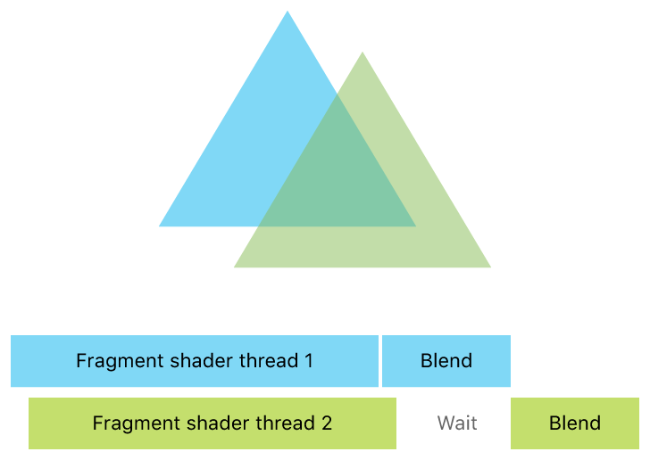
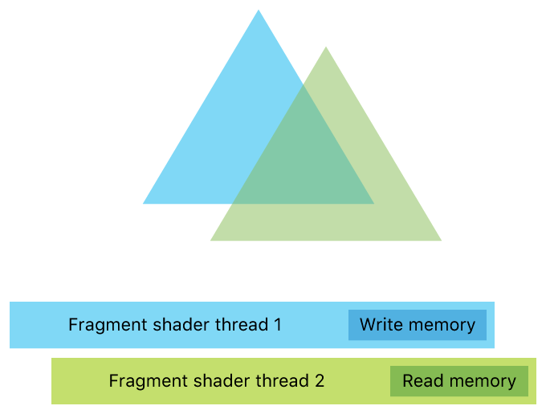
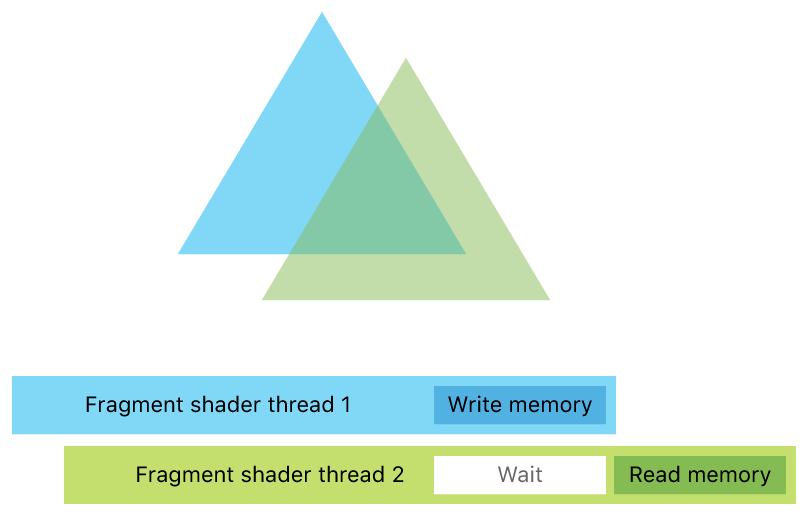
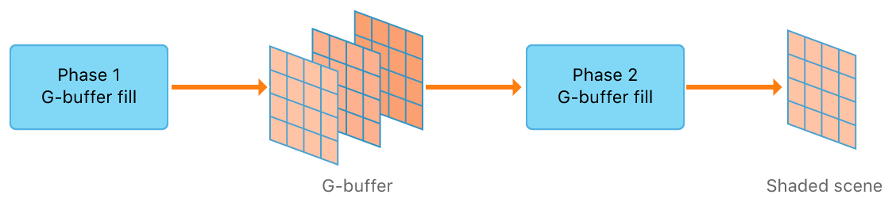
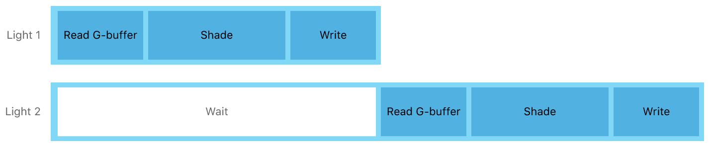
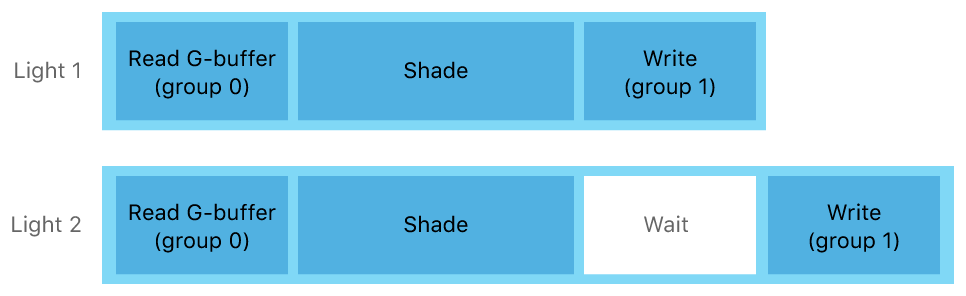

#  About Raster Order Groups

> Learn about precisely controlling the order of parallel fragment shader threads accessing the same pixel coordinates.

了解精确控制访问相同像素坐标的并行片段着色器线程的顺序。

## Overview

> Metal 2 introduces raster order groups that give ordered memory access from fragment shaders and simplify rendering techniques, such as order-independent transparency, dual-layer G-buffers, and voxelization.
>
> Given a scene containing two overlapping triangles, Metal guarantees that blending happens in draw call order, giving the illusion that the triangles are rendered serially. Figure 1 shows a blue triangle partially occluded by a green triangle.
>
> However, behind the scenes, the process is highly parallel; multiple threads are running concurrently, and there’s no guarantee that the fragment shader for the rear triangle has executed before the fragment shader for the front triangle. Figure 1 shows that although the two threads execute concurrently, the blending happens in draw call order.
>
> Figure 1 Blending of two triangles in draw call order

Metal 2 引入了栅格顺序组，可以从片段着色器中进行有序内存访问，并简化渲染技术，例如与顺序无关的透明度，双层 G 缓冲区和体素化。

给定一个包含两个重叠三角形的场景，Metal 保证以绘制调用顺序进行混合，从而产生三角形连续渲染的错觉。图 1 显示了一个被绿色三角形部分遮挡的蓝色三角形。

然而，在幕后，这个过程是高度并行的；多个线程同时运行，并且无法保证后三角形的片段着色器在前三角形的片段着色器之前执行完毕。 图 1 显示尽管两个线程同时执行，但是混合以绘制调用的顺序进行。

图 1 以绘制调用顺序混合两个三角形

> A custom blend function in your fragment shader may need to read the results of the rear triangle’s fragment shader before applying that function based on the front triangle’s fragment. Because of concurrency, this read–modify–write sequence can create a race condition. Figure 2 shows thread 2 attempting to simultaneously read the same memory that thread 1 is writing.
>
> Figure 2 Attempting to simultaneously read and write the same memory

片段着色器中的自定义混合函数可能需要在前三角形片段应用该函数之前读取后三角形片段着色器的结果。由于并发性，此读取 - 修改 - 写入序列会产生竞争条件。图 2 显示了线程 2 试图读取线程 1 正在写入的相同内存。

图 2 试图同时读写相同的内存

## Raster Order Groups for Overcoming Access Conflict - 用于克服访问冲突的光栅顺序组

Raster order groups overcome this access conflict by synchronizing threads that target the same pixel coordinates and sample (if per-sample shading is activated). You implement raster order groups by annotating pointers to memory with an attribute qualifier. Access through those pointers is then done in a per-pixel submission order. The hardware waits for any older fragment shader threads that overlap the current thread to finish before the current thread proceeds.

Figure 3 shows how raster order groups synchronize both threads so that thread 2 waits until the write is complete before attempting to read that piece of memory.

Figure 3 Synchronized threads serially reading and writing the same memory

光栅顺序组通过同步以相同像素坐标和样本为目标的线程（ 如果每个样本着色被激活 ）来克服此访问冲突。你可以通过使用属性限定符注释指向内存的指针来实现栅格顺序组。然后通过每个像素的提交顺序完成对这些指针的访问。硬件在当前线程继续之前等待与当前线程重叠的任何旧片段着色器线程完成。

图 3 显示了栅格顺序组如何同步两个线程，以便线程 2 在尝试读取该内存之前一直等待，直到写入操作完成。

图 3 同步线程串行读取和写入相同的内存

## Extended Raster Order Groups with Metal 2 on A11

> Metal 2 on A11 extends raster order groups with additional capabilities. First, it allows synchronization of individual channels of an imageblock and threadgroup memory. Second, it allows for the creation of multiple order groups, giving you finer-grained synchronization and minimizing how often your threads wait for access.
>
> An example of where the additional capabilities of raster order groups on the A11 graphics processing unit (GPU) improve performance is deferred shading. Traditionally, deferred shading requires two phases. The first phase fills a G-buffer and produces multiple textures. The second phase consumes those textures and calculates the shading results to render the light volumes, as shown in Figure 4.
>
> Figure 4 Deferred shading implemented in two phases

A11 上的 Metal 2 为栅格顺序组扩展了附加功能。首先，它允许同步 imageblock 的各个通道及线程组内存。其次，它允许创建多个顺序组，为你提供更细粒度的同步，并最大限度地减少线程等待访问的频率。

A11 图形处理单元（ GPU ）上的光栅顺序组的附加功能提升性能的典型示例为延迟着色。传统上，延迟着色需要两个阶段。第一阶段填充 G 缓冲区并生成多个纹理。第二阶段消耗这些纹理并计算着色结果以渲染光量，如图 4 所示。

图 4 分两个阶段实现的延迟着色

> Because the intermediate textures are written to and read from device memory, deferred shading is bandwidth intensive. The A11 GPU is able to leverage multiple order groups to coalesce both render phases into one, eliminating the need for the intermediate textures. Furthermore, it can keep the G-buffer in tile-sized chunks that remain in local imageblock memory.
>
> To demonstrate how the A11 GPU’s multiple order groups can improve the performance of deferred shading, Figure 5 shows how a traditional GPU schedules threads for the lighting phase. The thread responsible for the second light must wait for access from prior threads to complete before it can begin. This wait forces the execution of these two threads to run serially, even if the accesses don’t conflict with each other.
>
> Figure 5 Scheduling threads for a deferred shading lighting phase

因为中间纹理被写入设备内存并从设备内存读取，所以延迟着色是带宽密集的。A11 GPU 能够利用多个顺序组将两个渲染阶段合并为一个，从而消除了对中间纹理的需求。此外，G 缓冲区被保持在本地 imageblock 内存的 tile 大小的块中。

为了演示 A11 GPU 的多个顺序组如何提高延迟着色的性能，图 5 显示了传统 GPU 如何为照明阶段调度线程。负责第二个灯的线程在开始其工作之前必须等待先前线程访问完成。即使访问不相互冲突，此等待也会强制这两个线程以串行方式执行。

图 5 为延迟着色照明阶段调度线程

> Figure 6 shows how multiple order groups allow you to run the nonconflicting reads concurrently, with the two threads synchronizing at the end of execution to accumulate the lights. You achieve this by declaring the three G-buffer fields—albedo, normal, and depth—to be in the first group, and the accumulated lighting result to be in the second group. The A11 GPU is able to order the two groups separately, and outstanding writes into the second group don’t require reads in the first group to wait.
>
> Figure 6 Scheduling threads with raster order groups

图 6 显示了多个顺序组如何允许你同时运行非冲突读取，两个线程在执行结束时进行同步以累积灯光。你可以通过将三个 G 缓冲区字段（ 反照率，法线和深度 ）声明为第一组，并将累积的光照结果设置为第二组来实现此目的。A11 GPU 能够分别对两组进行排序，第一组的读取操作不需要等待第二组的写入操作。

图 6 使用栅格顺序组调度线程

> With multiple order groups, more threads are eligible to run concurrently, allowing for more parallelism and improved performance.

使用多个顺序组，更多线程可以同时运行，从而实现更多并行性及更高的性能。
