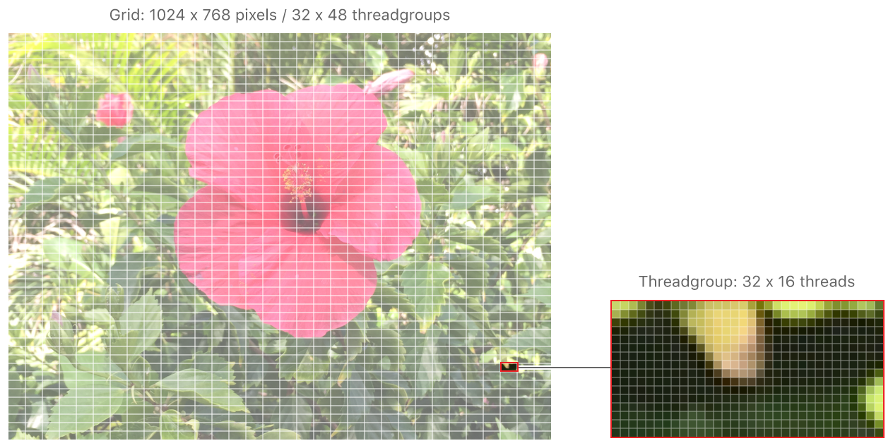
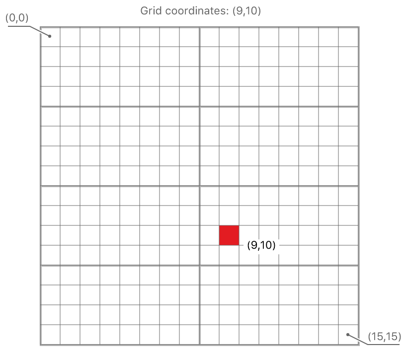
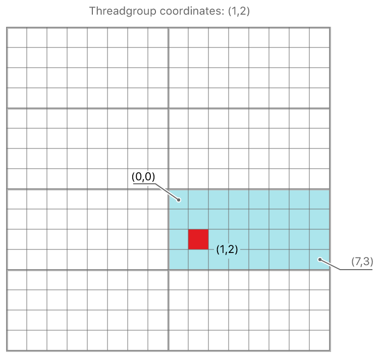
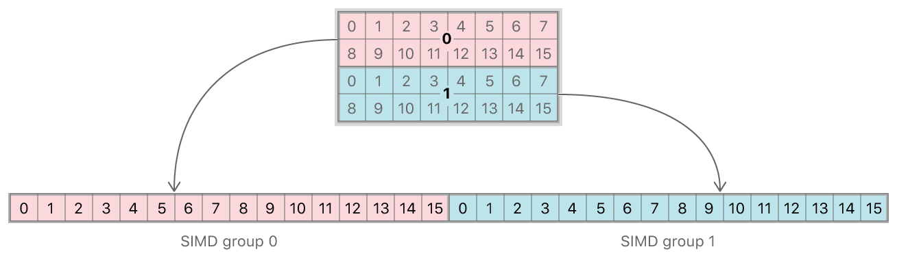
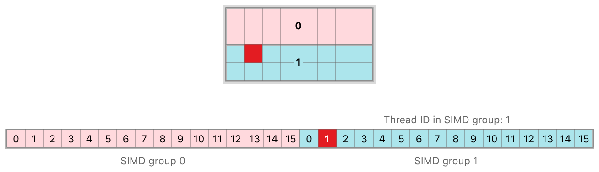

#  About Threads and Threadgroups

> Learn how Metal organizes compute-processing workloads.

了解 Metal 如何组织计算处理工作负载。

## Overview

> Recall from [Hello Compute](https://developer.apple.com/documentation/metal/hello_compute?language=objc) that when you dispatch your compute pass, Metal executes your kernel function over a 1D, 2D, or 3D grid. Each point in the grid represents a single instance of your kernel function, referred to as a thread. For example, in image processing, the grid is typically a 2D matrix of threads—representing the entire image—with each thread corresponding to a single pixel of the image being processed.
>
> Threads are organized into threadgroups that are executed together and can share a common block of memory. While sometimes kernel functions are designed so that threads run independently of each other, it's also common for threads in a threadgroup to collaborate on their working set.

回想一下 [Hello Compute](https://developer.apple.com/documentation/metal/hello_compute?language=objc) ，当你调度计算过程时，Metal 会在 1D，2D 或 3D 网格上执行内核函数。网格中的每个点代表内核函数的单个实例，称为线程。例如，在图像处理中，网格通常是线程的 2D 矩阵 - 表示整个图像 - 每个线程对应于正被处理的图像的单个像素。

线程被组织成一起执行的线程组，并且可以共享公共的内存块。虽然有时内核函数的设计使得线程彼此独立运行，但线程组中的线程在其工作集上进行协作也很常见。

## Identification of Threads by Position in Grid

> Figure 1 shows how an image being processed by a compute kernel is divided into threadgroups and how each threadgroup is composed of individual threads. Each thread processes a single pixel.
>
> Figure 1 A grid divided into threadgroups that are composed of individual threads.

图 1 显示了计算内核处理的图像如何被划分为线程组以及每个线程组如何由各个线程组成。每个线程处理一个像素。

图 1 网格分为由各个线程组成的线程组。



> A thread can be identified by its position in the grid; it's this unique position that allows your kernel function to do something different for each thread. The sample kernel function in [Hello Compute](https://developer.apple.com/documentation/metal/hello_compute?language=objc), below, shows how a thread's position in the grid is passed into the function as a parameter. In this case, the parameter, gid, is a vector representing 2D coordinates and is used to both read from and write to a particular location in a texture.

线程可以通过它在网格中的位置来识别；该独一无二的位置允许你的内核函数为每个线程做一些不同的事情。下面的 [Hello Compute](https://developer.apple.com/documentation/metal/hello_compute?language=objc) 中的示例内核函数展示了线程在网格中的位置是如何作为参数传递给函数。在这种情况下，参数 gid 是表示 2D 坐标的向量，用于读取和写入纹理中的特定位置。

```objc
kernel void
grayscaleKernel(texture2d<half, access::read>  inTexture  [[texture(AAPLTextureIndexInput)]],
texture2d<half, access::write> outTexture [[texture(AAPLTextureIndexOutput)]],
uint2                          gid        [[thread_position_in_grid]])
{
    if((gid.x >= outTexture.get_width()) || (gid.y >= outTexture.get_height()))
    {
        return;
    }
    half4 inColor  = inTexture.read(gid);
    half  gray     = dot(inColor.rgb, kRec709Luma);
    outTexture.write(half4(gray, gray, gray, 1.0), gid);
}
```

> [[thread_position_in_grid]] is an attribute qualifier. Attribute qualifiers, identifiable by their double square-bracket syntax, allow kernel parameters to be bound to resources and built-in variables, in this case the thread's position in the grid to the kernel function.
>
> For example, given a grid of 16 x 16 threads partitioned into 2 x 4 threadgroups of 8 x 4 threads, a single thread (shown in Figure 2 in red) has a position in the grid of (9,10):
>
> Figure 2 The position of a single thread in a 16 x 16 grid.

[[thread_position_in_grid]] 是属性限定符。被双引号标识的属性限定符允许将内核参数绑定到资源和内置变量，线程在网格中的位置传递给内核函数。

例如，给定一个 16 x 16 线程的网格划分为 2 x 4 线程组，每个线程组 8 x 4 线程，单个线程（如图 2 中的红色所示）在网格中的位置为（9, 10）：

图 2 16 x 16 网格中单个线程的位置。



## Identification of Threads by Position in Threadgroup

> A thread's position in its threadgroup is also available as the attribute qualifier [[thread_position_in_threadgroup]], and a threadgroup's position in the grid is available as [[threadgroup_position_in_grid]].
>
> Depending on the shape of the grid, these position attributes are either a scalar value, or a two- or three-element vector. In the case of a 2D grid, position attributes are two-element vectors, with the origin at the top left.
>
> The thread identified in Figure 2 is in the threadgroup with a position in the grid of (1,2), and its position in that threadgroup is (1,2), as shown in Figure 3:
>
> Figure 3 The position of a single thread in a threadgroup.

线程组中线程的位置由属性限定符 [[thread_position_in_threadgroup]] 指定，线程组在网格中的位置由 [[threadgroup_position_in_grid]] 指定。

根据网格的形状，这些位置属性可以是标量值，也可以是两元素或三元素矢量。在 2D 网格的情况下，位置属性是双元素向量，原点位于左上角。

图 2 中标识的线程所在的线程组在网格中的位置为 ( 1, 2 ) ，线程在其线程组内的位置为（1， 2），如图 3 所示：

图 3 线程组中单个线程的位置。



> Using the following code, you can also calculate a thread's position in the grid based on its position in its threadgroup and that threadgroup's size and position in the grid:

使用以下代码，你还可以根据线程在其线程组中的位置以及线程组在网格中的大小和位置来计算线程在网格中的位置：

```objc
kernel void 
myKernel(uint2 threadgroup_position_in_grid   [[ threadgroup_position_in_grid ]],
uint2 thread_position_in_threadgroup [[ thread_position_in_threadgroup ]],
uint2 threads_per_threadgroup        [[ threads_per_threadgroup ]]) 
{

    uint2 thread_position_in_grid = 
    (threadgroup_position_in_grid * threads_per_threadgroup) + 
    thread_position_in_threadgroup;
}
```

## SIMD Groups

> The threads in a threadgroup are further organized into single-instruction, multiple-data (SIMD) groups, also known as warps or wavefronts, that execute concurrently. The threads in a SIMD group execute the same code. Avoid writing code that could cause your kernel function to diverge; that is, to follow different code paths. A typical example of divergence is caused by using an if statement. Even if a single thread in a SIMD group takes a different path from the others, all threads in that group execute both branches, and the execution time for the group is the sum of the execution time of both branches.
>
> The division of threadgroups into SIMD groups is defined by Metal. It remains constant for the duration of a kernel's execution, across dispatches of a given kernel with the same launch parameters, and from one threadgroup to another within the dispatch.
>
> The number of threads in a SIMD group is returned by the [threadExecutionWidth](https://developer.apple.com/documentation/metal/mtlcomputepipelinestate/1414911-threadexecutionwidth?language=objc) of your compute pipeline state object. Attribute qualifiers allow you to access a SIMD group's scalar index within a threadgroup, and a thread's scalar index within a SIMD group:
>
> [[simdgroup_index_in_threadgroup]]
>   The unique scalar index of a SIMD group in its threadgroup, also known as the lane ID.
>
> [[thread_index_in_simdgroup]]
>   The unique scalar index of a thread in its SIMD group.
>
> Although threadgroups can be multidimensional, SIMD groups are 1D. Therefore, a thread's position within a SIMD group is a scalar value for all threadgroup shapes. The SIMD group size remains constant and is unaffected by the threadgroup size.
>
> For example, using the same 16 x 16 grid shown in Figure 2, with a thread execution width of 16, a single 8 x 4 threadgroup consists of 2 SIMD groups. Because a SIMD group contains 16 threads, each SIMD group constitutes 2 rows in the threadgroup:
>
> Figure 4 A threadgroup composed of 2 SIMD groups.

线程组中的线程进一步组织成单指令，多数据（ SIMD ）组，也称为 warp 或 wavefronts ，它们同时执行。SIMD 组中的线程执行相同的代码。避免编写可能导致内核功能发散的代码；也就是说，避免编写遵循不同路径的代码。分歧的典型示例是使用 if 语句引起的。即使 SIMD 组中的一个线程执行与其他线程不同的路径，也会导致该组中的所有线程执行两个分支，并且该组的执行时间是两个分支的执行时间的总和。

线程组到 SIMD 组的划分由 Metal 定义。该划分在内核执行期间保持不变，这包括使用相同启动参数调度某个给定内核，以及调度某个给定内核从一个线程组到另一个线程组，该划分都不会改变。

SIMD 组中的线程数由计算管道状态对象的 threadExecutionWidth 返回。属性限定符允许你访问线程组中 SIMD 组的标量索引，以及 SIMD 组中线程的标量索引：

[[simdgroup_index_in_threadgroup]]
    SIMD 组在其线程组中的唯一标量索引，也称为通道 ID 。

[[thread_index_in_simdgroup]]
    SIMD 组中线程的唯一标量索引。

虽然线程组可以是多维的，但 SIMD 组是 1D 的。因此，不管线程组的形状如何，线程在 SIMD 组中的位置永远都是一个标量值。SIMD 组大小保持不变，不受线程组大小的影响。

例如，使用图 2 中所示的相同 16 x 16 网格，线程执行宽度为 16 ，单个 8 x 4 线程组由 2 个 SIMD 组组成。因为一个 SIMD 组包含 16 个线程，所以每个 SIMD 组由线程组中的 2 行构成：

图 4 由 2 个 SIMD 组组成的线程组。



> The thread shown in red in Figure 5 has a [[simdgroup_index_in_threadgroup]] value of 1 and a [[thread_index_in_simdgroup]] value of 1:
>
> Figure 5 The position of a single thread in a SIMD group.

图 5 中以红色显示的线程的 [[simdgroup_index_in_threadgroup]] 值为 1 ，[[thread_index_in_simdgroup]] 值为 1 ：

图 5 SIMD 组中单个线程的位置。


