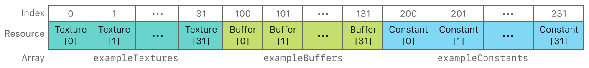

#  Argument Buffers with Arrays and Resource Heaps

> Demonstrates how to define an argument buffer with arrays and reduce CPU overhead by combining argument buffers with resource heaps.

演示如何使用数组定义参数缓冲区，并通过将参数缓冲区与资源堆组合来减少 CPU 开销。

## Overview

> In the [Basic Argument Buffers](https://developer.apple.com/documentation/metal/resource_objects/basic_argument_buffers?language=objc) sample, you learned how to specify, encode, set, and access resources in an argument buffer.
>
> In this sample, you’ll learn how to combine argument buffers with arrays of resources and resource heaps. In particular, you’ll learn how to define an argument buffer structure that contains arrays and how to allocate and use resources from a heap. The sample renders a static quad that uses multiple resources encoded into an argument buffer.

在 [Basic Argument Buffers](https://developer.apple.com/documentation/metal/resource_objects/basic_argument_buffers?language=objc) 示例中，学习了如何在参数缓冲区中指定，编码，设置和访问资源。

在此示例中，你将学习如何将参数缓冲区与资源数组和资源堆组合在一起。特别是，你将学习如何定义包含数组的参数缓冲区结构以及如何从堆中分配和使用资源。该示例使用编码到参数缓冲区中的多个资源来渲染一个静态四边形。

## Arrays of Arguments in the Metal Shading Language

> Arrays can be used as parameters to graphics or compute functions. When a function takes an array as a parameter, the index of the first resource in the array is equal to the base index of the array parameter itself. Thus, each subsequent resource in the array is automatically assigned a subsequent index value, counting incrementally from the base index value.
>
> For example, the following fragment function, exampleFragmentFunction, has a parameter, textureParameters, that’s an array of 10 textures with a base index value of 5.

数组可用作图形或计算函数的参数。当函数将数组作为参数时，数组中第一个资源的索引等于数组参数本身的基索引。因此，数组中的每个后续资源都会自动分配一个后续索引值，从基本索引值开始递增计数。

例如，以下片段函数 exampleFragmentFunction 有一个参数 textureParameters ，它是一个包含 10 个纹理的数组，其基本索引值为 5。

```objc
fragment float4
exampleFragmentFunction(array<texture2d<float>, 10> textureParameters [[ texture(5) ]])
```

> Because textureParameters has a [[ texture(5) ]] attribute qualifier, the corresponding Metal framework method to set this parameter is setFragmentTexture:atIndex:, where the values for index begin at 5. Thus, the texture at array index 0 is set at index number 5, the texture at array index 1 is set at index number 6, and so on. The last texture in the array, at array index 9, is set at index number 14.

因为 textureParameters 具有 [[ texture(5) ]] 属性限定符，所以设置此参数的相应 Metal 框架方法是 setFragmentTexture:atIndex: ，其中 index 的值从 5 开始。因此，数组索引 0 处的纹理设置为索引号 5 ，数组索引 1 处的纹理设置为索引号 6 ，依此类推。数组索引为 9 的数组中的最后一个纹理设置为索引号 14 。

## Define Argument Buffers with Arrays

> Arrays can also be used as elements of an argument buffer structure. In this case, the [[ id(n) ]] attribute qualifier of an argument buffer behaves the same way as the [[ texture(n) ]] attribute qualifier of a function parameter, where n is the base index value of the array. However, you don’t call the setFragmentTexture:atIndex: method, of a MTLRenderCommandEncoder object, to set a texture from the array. Instead, you call the setTexture:atIndex: method, of a MTLArgumentEncoder object, to encode a texture from the array into the argument buffer, where index corresponds to the base index value, n, plus the index of the texture within the array.
>
> The argument buffer in this sample is declared as a FragmentShaderArguments structure, and this is its definition:

数组也可以用作参数缓冲结构体的元素。在这种情况下，参数缓冲区的 [[ id(n) ]] 属性限定符的行为与函数参数的 [[ texture(n) ]] 属性限定符的行为相同，其中 n 是数组的基本索引值。但是，不要调用 MTLRenderCommandEncoder 对象的 setFragmentTexture:atIndex: 方法来设置数组中的纹理。 相反，调用 MTLArgumentEncoder 对象的 setTexture:atIndex: 方法，将数组中的纹理编码到参数缓冲区中，其中 index 对应于基本索引值 n ，加上纹理在数组中的索引。

此示例中的参数缓冲区被声明为 FragmentShaderArguments 结构，这是它的定义：

```objc
typedef struct FragmentShaderArguments {
    array<texture2d<float>, AAPLNumTextureArguments> exampleTextures  [[ id(AAPLArgumentBufferIDExampleTextures)  ]];
    array<device float *,  AAPLNumBufferArguments>   exampleBuffers   [[ id(AAPLArgumentBufferIDExampleBuffers)   ]];
    array<uint32_t, AAPLNumBufferArguments>          exampleConstants [[ id(AAPLArgumentBufferIDExampleConstants) ]];
} FragmentShaderArguments;
```

> Each element of this structure uses the array<T, N> template, which defines the element as an array of a certain type, T, and number of elements, N. This argument buffer contains the following resources:
>
> - exampleTextures, an array of 32 2D textures with a base index value of 0.
>
> - exampleBuffers, an array of 32 float buffers with a base index value of 100.
>
> - exampleConstants, an array of 32 uint32_t constants with a base index value of 200.

此结构的每个元素都使用 array<T, N> 模板，该模版将元素定义为类型为 T 及元素数量为 N 的数组。此参数缓冲区包含以下资源：

- exampleTextures，一个包含 32 个 2D 纹理的数组，其基本索引值为 0 。

- exampleBuffers，一个由 32 个浮点缓冲区组成的数组，其基本索引值为 100 。

- exampleConstants，一个由 32 个 uint32_t 常量组成的数组，其基本索引值为 200 。



## Encode Array Elements into an Argument Buffer

> This sample encodes array elements into an argument buffer by matching the index parameter of each setTexture:atIndex:, setBuffer:offset:atIndex:, and constantDataAtIndex: method call to the element’s corresponding index value, defined by the [[ id(n) ]] attribute qualifier in the argument buffer.

此示例通过匹配每个 setTexture:atIndex: ，setBuffer:offset:atIndex: 和 constantDataAtIndex: 方法调用的 index 参数与元素的相应索引值（由参数缓冲区中的 [[ id(n) ]] 属性限定符定义），将数组元素编码到参数缓冲区中。

```objc
for(uint32_t i = 0; i < AAPLNumTextureArguments; i++)
{
    [argumentEncoder setTexture:_texture[i]
    atIndex:AAPLArgumentBufferIDExampleTextures+i];
}
```

```objc
for(uint32_t i = 0; i < AAPLNumBufferArguments; i++)
{
    [argumentEncoder setBuffer:_dataBuffer[i]
    offset:0
    atIndex:AAPLArgumentBufferIDExampleBuffers+i];

    uint32_t *elementCountAddress =
    [argumentEncoder constantDataAtIndex:AAPLArgumentBufferIDExampleConstants+i];

    *elementCountAddress = (uint32_t)_dataBuffer[i].length / 4;
}
```

## Access Array Elements in an Argument Buffer

> Within a function, accessing elements of an array encoded in an argument buffer is the same as accessing elements of a standard array. In this sample, the exampleTextures, exampleBuffers, and exampleConstants arrays are accessed via the fragmentShaderArgs parameter of the fragmentShader function. Each array element is accessed with the [n] subscript syntax, where n is the index of the element within the array.

在函数内，访问参数缓冲区中编码的数组元素与访问标准数组的元素相同。在此示例中，exampleTextures，exampleBuffers 和exampleConstants 数组通过 fragmentShader 函数的 fragmentShaderArgs 参数进行访问。使用 [n] 下标语法访问每个数组元素，其中 n 是数组中元素的索引。

```objc
for(uint32_t textureToSample = 0; textureToSample < AAPLNumBufferArguments; textureToSample++)
{
    float4 textureValue = fragmentShaderArgs.exampleTextures[textureToSample].sample(textureSampler, in.texCoord);

    color += textureValue;
}
```

> The fragmentShader function contains an if-else condition that evaluates the x component of texCoord to determine which side of the quad the fragment is on. If the fragment is on the left side of the quad, the function samples each texture in the exampleTextures array and adds the sampled values to determine the final output color.
>
> If the fragment is on right side of the quad, the function reads a value from the exampleBuffers array. The function uses the x component of texCoord to determine which buffer to read from and then uses the y component of texCoord to determine where in the buffer to read from. The value in the buffer determines the final output color.

fragmentShader 函数包含 if-else 条件，该条件评估 texCoord 的 x 分量以确定片段所处在四边形的哪一侧。如果片段位于四边形的左侧，则函数会对 exampleTextures 数组中的每个纹理进行采样，并 add 采样值以确定最终输出颜色。

如果片段位于四边形的右侧，则该函数从 exampleBuffers 数组中读取值。该函数使用 texCoord 的 x 分量来确定要读取的缓冲区，然后使用 texCoord 的 y 分量来确定缓冲区中的读取位置。缓冲区中的值确定最终输出颜色。

```objc
// Use texCoord.x to select the buffer to read from
uint32_t bufferToRead = (in.texCoord.x-0.5)*2.0 * (AAPLNumBufferArguments-1);

// Retrieve the number of elements for the selected buffer from
// the array of constants in the argument buffer
uint32_t numElements = fragmentShaderArgs.exampleConstants[bufferToRead];

// Determine the index used to read from the buffer
uint32_t indexToRead = in.texCoord.y * numElements;

// Retrieve the buffer to read from by accessing the array of
// buffers in the argument buffer
device float* buffer = fragmentShaderArgs.exampleBuffers[bufferToRead];

// Read from the buffer and assign the value to the output color
color = buffer[indexToRead];
```

## Combine Argument Buffers with Resource Heaps

> The fragment function accesses 32 textures and 32 buffers via the argument buffer, totaling 64 different resources overall. If memory for each of these resources was allocated individually, despite residing in arrays, Metal would need to validate the memory of 64 individual resources before making these resources accessible to the GPU.
>
> Instead, this sample allocates resources from a MTLHeap object. A heap is a single memory region from which multiple resources can be allocated. Therefore, the sample can make the heap’s entire memory, including the memory of all the resources within the heap, accessible to the GPU by calling the useHeap: method once.
>
> The sample implements a loadResources method that loads the resource data into temporary MTLTexture and MTLBuffer objects. Then, the sample implements a createHeap method that calculates the total size required to store the resource data in the heap and creates the heap itself.

片段函数通过参数缓冲区访问 32 个纹理和 32 个缓冲区，总共 64 个不同的资源。如果每个资源的内存都是单独分配的，Metal 需要验证 64 个独立资源的内存，然后才能使 GPU 访问这些资源，尽管这些单独的资源存在于数组中。

相反，此示例从 MTLHeap 对象分配资源。堆是单个内存区域，可以从中分配多个资源。因此，可以通过调用 useHeap: 方法一次使堆的整个内存（包括堆内所有资源的内存）可供 GPU 访问。

该示例实现了一个 loadResources 方法，该方法将资源数据加载到临时 MTLTexture 和 MTLBuffer 对象中。然后，该示例实现了一个 createHeap 方法，该方法计算将资源数据存储在堆中所需的总大小，并创建堆本身。

```objc
- (void) createHeap
{
    MTLHeapDescriptor *heapDescriptor = [MTLHeapDescriptor new];
    heapDescriptor.storageMode = MTLStorageModePrivate;
    heapDescriptor.size =  0;

    // Build a descriptor for each texture and calculate the size required to store all textures in the heap
    for(uint32_t i = 0; i < AAPLNumTextureArguments; i++)
    {
        // Create a descriptor using the texture's properties
        MTLTextureDescriptor *descriptor = [ArgumentBufferArraysWithHeapsRenderer newDescriptorFromTexture:_texture[i]
        storageMode:heapDescriptor.storageMode];

    // Determine the size required for the heap for the given descriptor
    MTLSizeAndAlign sizeAndAlign = [_device heapTextureSizeAndAlignWithDescriptor:descriptor];

    // Align the size so that more resources will fit in the heap after this texture
    sizeAndAlign.size += (sizeAndAlign.size & (sizeAndAlign.align - 1)) + sizeAndAlign.align;

    // Accumulate the size required to store this texture in the heap
    heapDescriptor.size += sizeAndAlign.size;
    }

    // Calculate the size required to store all buffers in the heap
    for(uint32_t i = 0; i < AAPLNumBufferArguments; i++)
    {
        // Determine the size required for the heap for the given buffer size
        MTLSizeAndAlign sizeAndAlign = [_device heapBufferSizeAndAlignWithLength:_dataBuffer[i].length
        options:MTLResourceStorageModePrivate];

    // Align the size so that more resources will fit in the heap after this buffer
    sizeAndAlign.size +=  (sizeAndAlign.size & (sizeAndAlign.align - 1)) + sizeAndAlign.align;

    // Accumulate the size required to store this buffer in the heap
    heapDescriptor.size += sizeAndAlign.size;
    }

    // Create a heap large enough to store all resources
    _heap = [_device newHeapWithDescriptor:heapDescriptor];
}
```

> The sample implements a moveResourcesToHeap method that creates permanent MTLTexture and MTLBuffer objects allocated from the heap. Then, the method uses a MTLBlitCommandEncoder to copy the resource data from the temporary objects to the permanent objects.

该示例实现了一个 moveResourcesToHeap 方法，该方法创建从堆分配的永久 MTLTexture 和 MTLBuffer 对象。然后，该方法使用 MTLBlitCommandEncoder 将资源数据从临时对象复制到永久对象。

```objc
- (void)moveResourcesToHeap
{
    // Create a command buffer and blit encoder to copy data from the existing resources to
    // the new resources created from the heap
    id <MTLCommandBuffer> commandBuffer = [_commandQueue commandBuffer];
    commandBuffer.label = @"Heap Copy Command Buffer";

    id <MTLBlitCommandEncoder> blitEncoder = commandBuffer.blitCommandEncoder;
    blitEncoder.label = @"Heap Transfer Blit Encoder";

    // Create new textures from the heap and copy the contents of the existing textures to
    // the new textures
    for(uint32_t i = 0; i < AAPLNumTextureArguments; i++)
    {
        // Create a descriptor using the texture's properties
        MTLTextureDescriptor *descriptor = [ArgumentBufferArraysWithHeapsRenderer newDescriptorFromTexture:_texture[i]
        storageMode:_heap.storageMode];

        // Create a texture from the heap
        id<MTLTexture> heapTexture = [_heap newTextureWithDescriptor:descriptor];

        heapTexture.label = _texture[i].label;

        [blitEncoder pushDebugGroup:[NSString stringWithFormat:@"%@ Blits", heapTexture.label]];

        // Blit every slice of every level from the existing texture to the new texture
        MTLRegion region = MTLRegionMake2D(0, 0, _texture[i].width, _texture[i].height);
        for(NSUInteger level = 0; level < _texture[i].mipmapLevelCount;  level++)
        {

            [blitEncoder pushDebugGroup:[NSString stringWithFormat:@"Level %lu Blit", level]];

            for(NSUInteger slice = 0; slice < _texture[i].arrayLength; slice++)
            {
                [blitEncoder copyFromTexture:_texture[i]
                sourceSlice:slice
                sourceLevel:level
                sourceOrigin:region.origin
                sourceSize:region.size
                toTexture:heapTexture
                destinationSlice:slice
                destinationLevel:level
                destinationOrigin:region.origin];
            }
            region.size.width /= 2;
            region.size.height /= 2;
            if(region.size.width == 0) region.size.width = 1;
            if(region.size.height == 0) region.size.height = 1;

            [blitEncoder popDebugGroup];
        }

        [blitEncoder popDebugGroup];

        // Replace the existing texture with the new texture
        _texture[i] = heapTexture;
    }

    // Create new buffers from the heap and copy the contents of existing buffers to the
    // new buffers
    for(uint32_t i = 0; i < AAPLNumBufferArguments; i++)
    {
        // Create a buffer from the heap
        id<MTLBuffer> heapBuffer = [_heap newBufferWithLength:_dataBuffer[i].length
        options:MTLResourceStorageModePrivate];

        heapBuffer.label = _dataBuffer[i].label;

        // Blit contents of the original buffer to the new buffer
        [blitEncoder copyFromBuffer:_dataBuffer[i]
        sourceOffset:0
        toBuffer:heapBuffer
        destinationOffset:0
        size:heapBuffer.length];

        // Replace the existing buffer with the new buffer
        _dataBuffer[i] = heapBuffer;
    }

    [blitEncoder endEncoding];
    [commandBuffer commit];
}
```

> Before using these resources, instead of calling the useResource:usage: method once for each resource, the sample calls the useHeap: method once for the entire heap.

在使用这些资源之前，该示例为整个堆调用 useHeap: 方法一次，而不是为每个资源调用 useResource:usage: 一次。

```objc
#if ENABLE_RESOURCE_HEAP
    // Make a single `useHeap:` call for the entire heap, instead of one
    // `useResource:usage:` call per texture and per buffer
    [renderEncoder useHeap:_heap];
#else
    for(uint32_t i = 0; i < AAPLNumTextureArguments; i++)
    {
        // Indicate to Metal that these textures will be accessed by the GPU and
        // therefore must be mapped to the GPU's address space
        [renderEncoder useResource:_texture[i] usage:MTLResourceUsageSample];
    }

    for(uint32_t i = 0; i < AAPLNumBufferArguments; i++)
    {
        // Indicate to Metal that these buffers will be accessed by the GPU and
        // therefore must be mapped to the GPU's address space
        [renderEncoder useResource:_dataBuffer[i] usage:MTLResourceUsageRead];
    }
#endif
```

## Next Steps

> In this sample, you learned how to combine argument buffers with arrays of resources and resource heaps. In the [Argument Buffers with GPU Encoding](https://developer.apple.com/documentation/metal/resource_objects/argument_buffers_with_gpu_encoding?language=objc) sample, you’ll learn how to encode resources into argument buffers with a graphics or compute function.

在此示例中，你学习了如何将参数缓冲区与资源数组和资源堆组合在一起。在 [Argument Buffers with GPU Encoding](https://developer.apple.com/documentation/metal/resource_objects/argument_buffers_with_gpu_encoding?language=objc) 示例中，你将学习如何使用图形或计算函数将资源编码到参数缓冲区中。

