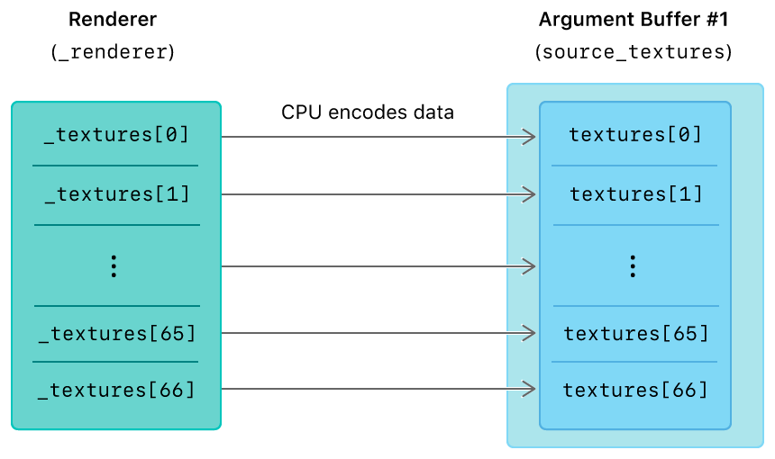
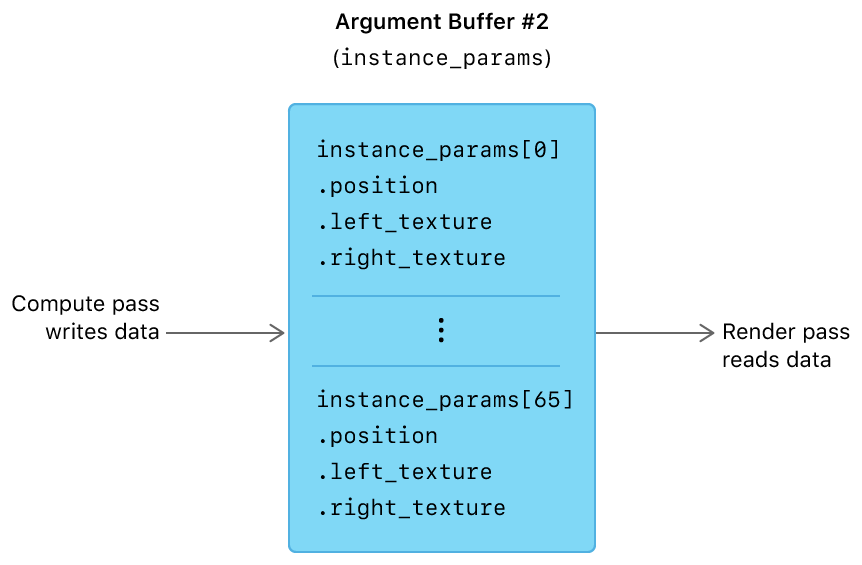

#  Argument Buffers with GPU Encoding

> Demonstrates how to encode an argument buffer with a compute pass and then access its arguments in a subsequent render pass.

演示如何对计算过程的参数缓冲区进行编码，然后在后续渲染过程中访问其参数。

## Overview

> In the [Argument Buffers with Arrays and Resource Heaps](https://developer.apple.com/documentation/metal/resource_objects/argument_buffers_with_arrays_and_resource_heaps?language=objc) sample, you learned how to combine argument buffers with arrays of resources and resource heaps.
>
> In this sample, you’ll learn how to encode resources into argument buffers with a graphics or compute function. In particular, you’ll learn how to write data into an argument buffer from a compute pass and then read that data in a render pass. The sample renders a grid of multiple quad instances with two textures applied to each, where the textures slide from left to right within the quad and move from left to right between quads.

在 [Argument Buffers with Arrays and Resource Heaps](https://developer.apple.com/documentation/metal/resource_objects/argument_buffers_with_arrays_and_resource_heaps?language=objc) 示例中，你学习了如何将参数缓冲区与资源和资源堆组合在一起。

在本示例中，你将学习如何使用图形或计算函数将资源编码为参数缓冲区。特别是，你将学习如何从计算过程中将数据写入参数缓冲区，然后在渲染过程中读取该数据。该示例渲染多个四边形实例的网格，每个实例应用两个纹理，其中纹理在四边形内从左向右滑动，在四边形之间从左向右移动。

## Encode Data into Argument Buffers

> During initialization, the sample encodes data with the CPU into an argument buffer defined by the SourceTextureArguments structure.

在初始化期间，示例使用 CPU 将数据编码到由 SourceTextureArguments 结构定义的参数缓冲区中。

```objc
typedef struct SourceTextureArguments {
    array<texture2d<float>, AAPLNumTextures> textures [[ id(AAPLArgumentBufferIDTextures) ]];
} SourceTextureArguments;
```

> This argument buffer is backed by the _sourceTextures buffer and is accessed via the source_textures variable in the updateInstances function. source_textures contains an array of references to textures loaded by the sample’s renderer.

此参数缓冲区由 _sourceTextures 缓冲区支持，可通过 updateInstances 函数中的 source_textures 变量进行访问。source_textures 包含由样本渲染器加载的纹理的引用数组。



> After initialization, for each frame, the sample encodes data with the GPU into a separate argument buffer defined by the InstanceArguments structure.

在初始化之后，对于每一帧，示例使用 GPU 将数据编码到由 InstanceArguments 结构定义的单独的参数缓冲区中。

```objc
typedef struct InstanceArguments {
    vector_float2    position;
    texture2d<float> left_texture;
    texture2d<float> right_texture;
} InstanceArguments;
```

> This argument buffer is backed by the _instanceParameters buffer and is accessed via the instance_params variable in the updateInstances, vertexShader, and fragmentShader functions. instance_params is an array of structures whose data is populated in a compute pass and then accessed in a render pass via an instanced draw call.

此参数缓冲区由 _instanceParameters 缓冲区支持，可通过 updateInstances ，vertexShader 和 fragmentShader 函数中的 instance_params 变量进行访问。instance_params 是一个结构体数组，其数据在计算过程中填充，然后通过实例化绘制调用在渲染过程中访问。



## Create an Array of Argument Buffer Structures

> The sample defines an InstanceArguments structure into which a compute function, updateInstances, encodes a vector and two textures.

该示例定义了一个 InstanceArguments 结构，包括一个向量和两个纹理，其作为计算函数 updateInstances 的参数。

```objc
typedef struct InstanceArguments {
    vector_float2    position;
    texture2d<float> left_texture;
    texture2d<float> right_texture;
} InstanceArguments;
```

> Previous argument buffer samples used the encodedLength property to directly determine the required size for the MTLBuffer that backs an argument buffer structure. However, this sample needs one instance of this structure for each quad rendered by a subsequent render pass. Therefore, the sample multiplies the value of encodedLength by the total number of instances, which is defined by the value of the AAPLNumInstances constant.

前一个参数缓冲区示例使用 encodedLength 属性直接确定支持参数缓冲区结构的 MTLBuffer 所需的大小。但是，此示例需要为后续渲染过程渲染的每个四边形提供此结构的一个实例。因此，该示例将 encodedLength 的值乘以实例总数，该实例总数由 AAPLNumInstances 常量的值定义。

```objc
NSUInteger instanceParameterLength = instanceParameterEncoder.encodedLength * AAPLNumInstances;

_instanceParameters = [_device newBufferWithLength:instanceParameterLength options:0];
```

> Note - The [[id(n)]] attribute qualifier isn’t necessary to define the InstanceArguments structure in this sample. This qualifier is needed only when arguments are encoded with the CPU via the Metal API, and not when arguments are encoded with the GPU via a graphics or compute function.

注意 - [[id(n)]] 属性限定符不是此示例中定义 InstanceArguments 结构所必需的。仅当通过 Metal API 使用 CPU 对参数进行编码时才需要此限定符，当通过图形或计算函数使用 GPU 对参数进行编码时，是不需要此限定符的。

## Encode an Argument Buffer with a Compute Function

> For each quad to be rendered, the sample executes the updateInstances compute function to determine the quad’s position and textures. The compute pass executed by the sample iterates through the instance_params array and encodes the correct data for each quad. The sample encodes data into instance_params by setting InstanceArguments values in the array element at the instanceID index value.

对于每个要渲染的四边形，示例执行 updateInstances 计算函数以确定四边形的位置和纹理。计算过程遍历 instance_params 数组，并为每个四边形编码正确的数据。该示例通过在 instanceID 索引值处设置数组元素中的 InstanceArguments 值，将数据编码到 instance_params 中。

```objc
device  InstanceArguments & quad_params = instance_params[instanceID];

// Store the position of the quad
quad_params.position = position;

// Select and store the textures to apply to this quad
quad_params.left_texture = source_textures.textures[left_texture_index];
quad_params.right_texture = source_textures.textures[right_texture_index];
```

## Render Instances with an Argument Buffer

> The sample issues an instanced draw call to render the quads while incurring a minimal amount of CPU overhead. Combining this technique with an argument buffer allows the sample to use a unique set of resources for each quad within the same draw call, where each instance draws a single quad.
>
> The sample declares an instanceID variable in both the vertex and fragment function’s signatures. The render pipeline uses instanceID to index into the instance_params array that was previously encoded by the updateInstances compute function.
>
> In the vertex function, instanceID is defined as an argument with the [[instance_id]] attribute qualifier.

该示例发出实例化绘制调用以渲染四边形，同时产生最小量的 CPU 开销。将此技术与参数缓冲区相结合，允许示例在同一个绘制调用中为每个四边形使用一组唯一的资源，其中每个实例绘制一个四边形。

该示例在顶点和片段函数的签名中声明了一个 instanceID 变量。渲染管道使用 instanceID 在 instance_params 数组中索引，其中 instance_params 之前由 updateInstances 计算函数编码。

在顶点函数中，instanceID 被定义为具有 [[instance_id]] 属性限定符的参数。

```objc
vertex RasterizerData
vertexShader(uint                      vertexID        [[ vertex_id ]],
uint                      instanceID      [[ instance_id ]],
device AAPLVertex        *vertices        [[ buffer(AAPLVertexBufferIndexVertices) ]],
device InstanceArguments *instance_params [[ buffer(AAPLVertexBufferIndexInstanceParams) ]],
constant AAPLFrameState  &frame_state     [[ buffer(AAPLVertexBufferIndexFrameState) ]])
```

> The vertex function reads position data from the argument buffer to render the quad in the right place in the drawable.

顶点函数从参数缓冲区中读取位置数据，以在 drawable 中的正确位置渲染四边形。

```objc
float2 quad_position = instance_params[instanceID].position;
```

> The vertex function then passes the instanceID variable to the fragment function, via the RasterizerData structure and the [[stage_in]] attribute qualifier. (In the fragment function, instanceID is accessed via the in argument.)

顶点函数然后通过 RasterizerData 结构和 [[stage_in]] 属性限定符将 instanceID 变量传递给 fragment 函数。（在 fragment 函数中，通过 in 参数访问 instanceID 。）

```objc
fragment float4
fragmentShader(RasterizerData            in              [[ stage_in ]],
device InstanceArguments *instance_params [[ buffer(AAPLFragmentBufferIndexInstanceParams) ]],
constant AAPLFrameState  &frame_state     [[ buffer(AAPLFragmentBufferIndexFrameState) ]])
```

> The fragment function samples from the two textures specified in the argument buffer and then chooses an output sample based on the value of slideFactor.

片段函数从参数缓冲区中指定的两个纹理中进行采样，然后根据 slideFactor 的值选择输出样本。

```objc
texture2d<float> left_texture = instance_params[instanceID].left_texture;
texture2d<float> right_texture = instance_params[instanceID].right_texture;

float4 left_sample = left_texture.sample(texture_sampler, in.tex_coord);
float4 right_sample = right_texture.sample(texture_sampler, in.tex_coord);

if(frame_state.slideFactor < in.tex_coord.x)
{
    output_color = left_sample;
}
else
{
    output_color = right_sample;
}
```

> The fragment function outputs the selected sample. The left texture slides in from the left and the right texture slides out to the right. After the right texture has completely slid off the quad, the sample assigns this texture as the left texture in the next compute pass. Thus, each texture moves from left to right across the grid of quads.

片段功能输出所选样本。左侧纹理从左侧滑入，右侧纹理向右滑出。当右纹理完全滑出四边形之后，示例将此纹理指定为下一个计算过程中的左纹理。因此，每个纹理在四边形网格上从左向右移动。

## Next Steps

> In this sample, you learned how to encode resources into argument buffers with a graphics or compute function. In the [Dynamic Terrain with Argument Buffers](https://developer.apple.com/documentation/metal/resource_objects/dynamic_terrain_with_argument_buffers?language=objc) sample, you’ll learn how to combine several argument buffer techniques to render a dynamic terrain in real time.

在此示例中，你学习了如何使用图形或计算函数将资源编码为参数缓冲区。在带有参数缓冲区的动态地形示例中，你将学习如何组合多种参数缓冲区技术以实时渲染动态地形。
