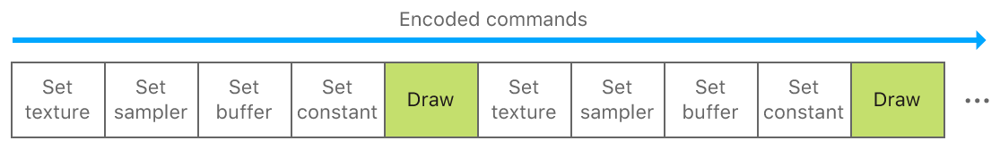

#  Basic Argument Buffers

> Demonstrates how to manage groups of resources with an argument buffer.

演示如何使用参数缓冲区管理资源组。

## Overview

> An argument buffer represents a group of resources that can be collectively assigned as an argument to a graphics or compute function. You use argument buffers to reduce CPU overhead, simplify resource management, and implement GPU-driven pipelines.
>
> In this sample, you’ll learn how to specify, encode, set, and access resources in an argument buffer. In particular, you’ll learn about the advantages of managing groups of resources in an argument buffer instead of individual resources. The sample renders a static quad using a texture, sampler, buffer, and constant encoded into an argument buffer.

参数缓冲区表示一组资源，可以将这些资源作为一个参数整体赋值给图形或计算函数。你可以使用参数缓冲区来减少 CPU 开销，简化资源管理并实现 GPU 驱动的管道。

在此示例中，你将学习如何指定，编码，设置和访问参数缓冲区中的资源。特别是，你将了解在参数缓冲区中管理资源组而不是单个资源的优势。该示例使用由纹理，采样器，缓冲区和常量编码组成的参数缓冲区来渲染静态四边形。

## CPU Overhead and Argument Buffers

> Metal commands are efficient, incurring minimal CPU overhead when apps access the GPU. Each command does incur some overhead, however; to further reduce the amount, use these strategies:
>
> - Do more GPU work with fewer CPU commands.
>
> - Avoid repeating expensive CPU commands.
>
> Metal’s argument buffer feature reduces the number and performance cost of CPU commands in your app’s critical path (for example, in your app’s render loop). An argument buffer allows you to group and encode multiple resources within a single buffer, instead of encoding each resource individually. By using argument buffers, you can shift a significant amount of CPU overhead from your app’s critical path to its initial setup.

Metal 命令是高效的，当应用程序访问 GPU 时，只会产生最小的 CPU 开销。然而，每个命令都会产生一些开销；要进一步降低开销，请使用以下策略：

- 使用更少的 CPU 命令执行更多 GPU 工作。

- 避免重复昂贵的 CPU 命令。

Metal 的参数缓冲区功能可以减少应用程序关键路径中 CPU 命令的数量和性能成本（例如，在应用程序的渲染循环中）。参数缓冲区允许你整合并编码多个资源到单个缓冲区中，而不是单独编码每个资源。通过使用参数缓冲区，你可以将大量的 CPU 开销从应用程序的关键路径转移到其初始设置期间。

## Individual Resources versus Argument Buffers

> Metal apps, particularly games, typically contain multiple 3D objects, each associated with a set of resources such as textures, samplers, buffers, and constants. To render each object, apps encode Metal commands that set these resources as arguments to a graphics function before issuing a draw call.
>
> You set individual resources as arguments by calling MTLRenderCommandEncoder methods such as setVertexBuffer:offset:atIndex: or setFragmentTexture:atIndex: for each resource.

Metal 应用程序，尤其是游戏，通常包含多个 3D 对象，每个对象都与一组资源相关联，如纹理，采样器，缓冲区和常量。为了渲染每个对象，应用程序在发出绘制调用之前，编码 Metal 命令，这些命令将资源作为参数设置给图形函数。

可以通过为每个资源调用 MTLRenderCommandEncoder 方法（如 setVertexBuffer:offset:atIndex: 或 setFragmentTexture:atIndex: ）将各个资源作为参数单独设置。



> Commands that set individual resources can become numerous and expensive, especially for large apps or games. Instead, you can group related resources into an argument buffer and then set that entire buffer as a single argument to a graphics function. This approach greatly reduces CPU overhead and still provides individual GPU access to your resources.
>
> Argument buffers are represented as MTLBuffer objects. Therefore, you set them as arguments by calling MTLRenderCommandEncoder methods such as setVertexBuffer:offset:atIndex: or setFragmentBuffer:offset:atIndex: for each argument buffer.

设置单个资源的命令可能变得繁多且昂贵，尤其是对于大型应用程序或游戏。相反，可以将相关资源组合到单个参数缓冲区中，然后将整个缓冲区设置为图形函数的单个参数。这种方法大大降低了 CPU 开销，并且仍然提供对资源的单独 GPU 访问。

参数缓冲区表示为 MTLBuffer 对象。因此，你可以通过为每个参数缓冲区调用 MTLRenderCommandEncoder 方法（如 setVertexBuffer:offset:atIndex: 或 setFragmentBuffer:offset:atIndex: ）来设置它们。


> Note - To access individual resources in an argument buffer, you must call the useResource:usage: method for each resource that you want to use. For more information, see the “Enable the GPU Memory of Resources in the Argument Buffer” section.

注意 - 要访问参数缓冲区中的各个资源，必须为要使用的每个资源调用 useResource:usage: 方法。有关更多信息，请参阅“Enable the GPU Memory of Resources in the Argument Buffer” 部分。

## Define Argument Buffers

> Argument buffers are defined as custom structures in the Metal Shading Language. Each structure element represents an individual resource, declared as a texture, sampler, buffer, or constant data type. A structure element is also associated with an integer, declared with the [[id(n)]] attribute qualifier, that specifies the index of the individual resource.
>
> The argument buffer in this sample is declared as a FragmentShaderArguments structure and this is its definition:

参数缓冲区在 Metal Shading Language 中定义为自定义结构。每个结构元素表示一个单独的资源，声明为纹理，采样器，缓冲区或常量数据类型。结构体元素还与使用 [[id(n)]] 属性限定符声明的整数相关联，该整数指定单个资源的索引。

此示例中的参数缓冲区被声明为 FragmentShaderArguments 结构体，这是它的定义：

```objc
typedef struct FragmentShaderArguments {
    texture2d<half> exampleTexture  [[ id(AAPLArgumentBufferIDExampleTexture)  ]];
    sampler         exampleSampler  [[ id(AAPLArgumentBufferIDExampleSampler)  ]];
    device float   *exampleBuffer   [[ id(AAPLArgumentBufferIDExampleBuffer)   ]];
    uint32_t        exampleConstant [[ id(AAPLArgumentBufferIDExampleConstant) ]];
} FragmentShaderArguments;
```

> This argument buffer contains the following resources:
>
> - exampleTexture, a 2D texture with an index of 0.
>
> - exampleSampler, a sampler with an index of 1.
>
> - exampleBuffer, a float buffer with an index of 2.
>
> - exampleConstant, a uint32_t constant with an index of 3.
>
> This sample’s fragment function, fragmentShader, uses the argument buffer as a single parameter.

此参数缓冲区包含以下资源：

- exampleTexture，索引为 0 的 2D 纹理。

- exampleSampler，索引为 1 的采样器。

- exampleBuffer，索引为 2 的浮点缓冲区。

- exampleConstant，一个索引为 3 的 uint32_t 常量。

此示例的片段函数 fragmentShader 使用参数缓冲区作为单个参数。

```objc
fragment float4
fragmentShader(       RasterizerData            in                 [[ stage_in ]],
device FragmentShaderArguments & fragmentShaderArgs [[ buffer(AAPLFragmentBufferIndexArguments) ]])
```

> The fragmentShaderArgs parameter is a buffer of type FragmentShaderArguments. When the sample sets a MTLBuffer as an argument to the fragment function, the function interprets the data in the fragmentShaderArgs parameter as an argument buffer with a texture, sampler, buffer, and constant (as defined by the FragmentShaderArguments structure).

fragmentShaderArgs 参数是 FragmentShaderArguments 类型的缓冲区。当示例将 MTLBuffer 设置为片段函数的参数时，该函数将 fragmentShaderArgs 参数中的数据解释为具有纹理，采样器，缓冲区和常量的参数缓冲区（由 FragmentShaderArguments 结构定义）。

## Encode Resources into an Argument Buffer

> Individual resources must be encoded into an argument buffer before the buffer is accessed by a function. This is accomplished by creating a MTLArgumentBufferEncoder from a MTLFunction that uses an argument buffer.
>
> This sample creates a MTLArgumentBufferEncoder from the fragmentShader function, which contains the fragmentShaderArgs parameter.

在函数访问缓冲区之前，必须将各个资源编码到参数缓冲区中。这是通过从使用参数缓冲区的 MTLFunction 创建 MTLArgumentBufferEncoder 来实现的。

此示例从 fragmentShader 函数创建 MTLArgumentBufferEncoder ，该函数包含 fragmentShaderArgs 参数。

```objc
id <MTLFunction> fragmentFunction = [defaultLibrary newFunctionWithName:@"fragmentShader"];

id <MTLArgumentEncoder> argumentEncoder
= [fragmentFunction newArgumentEncoderWithBufferIndex:AAPLFragmentBufferIndexArguments];
```

> The encodedLength property of argumentEncoder determines the size, in bytes, required to contain all the resources in the argument buffer. This sample uses that value to create a new buffer, _fragmentShaderArgumentBuffer, with a length parameter that matches the required size for the argument buffer.

argumentEncoder 的 encodedLength 属性确定包含参数缓冲区中所有资源所需的大小（以字节为单位）。此示例使用该值创建一个新缓冲区 _fragmentShaderArgumentBuffer ，其长度参数与参数缓冲区所需的大小相匹配。

```objc
NSUInteger argumentBufferLength = argumentEncoder.encodedLength;

_fragmentShaderArgumentBuffer = [_device newBufferWithLength:argumentBufferLength options:0];
```

> This sample then calls the setArgumentBuffer:offset: method to specify that _fragmentShaderArgumentBuffer is an argument buffer that resources can be encoded into.

然后，此示例调用 setArgumentBuffer:offset: 方法以指定 _fragmentShaderArgumentBuffer 是可以编码资源的参数缓冲区。

```objc
[argumentEncoder setArgumentBuffer:_fragmentShaderArgumentBuffer offset:0];
```

> This sample encodes individual resources into the argument buffer by:
>
> - Calling specific methods for each resource type, such as setTexture:atIndex:, setSamplerState:atIndex:, and setBuffer:offset:atIndex.
>
> - Matching the value of the index parameter to the value of the [[id(n)]] attribute qualifier declared for each element of the FragmentShaderArguments structure.

此示例通过以下方式将各个资源编码到参数缓冲区中：

- 为每种资源类型调用特定方法，例如 setTexture:atIndex: ，setSamplerState:atIndex: 和 setBuffer:offset:atIndex 。

- 将 index 参数的值与 FragmentShaderArguments 结构体每个元素声明的 [[id(n)]] 属性限定符的值匹配。

```objc
[argumentEncoder setTexture:_texture atIndex:AAPLArgumentBufferIDExampleTexture];
[argumentEncoder setSamplerState:_sampler atIndex:AAPLArgumentBufferIDExampleSampler];
[argumentEncoder setBuffer:_indirectBuffer offset:0 atIndex:AAPLArgumentBufferIDExampleBuffer];
```

> Constants are encoded a bit differently; constant data is embedded directly into the argument buffer, instead of residing in another object that the argument buffer points to. This sample calls the constantDataAtIndex: method to retrieve the address in the argument buffer in which the constant resides. Then, the sample sets the actual value of the constant, bufferElements, at the retrieved address.

常量编码有点不同；常量数据直接嵌入到参数缓冲区中，而不是驻留在参数缓冲区指向的另一个对象中。此示例调用 constantDataAtIndex: 方法以检索常量所在的参数缓冲区中的地址。然后，该示例在检索到的地址处设置常量的实际值 bufferElements。

```objc
uint32_t *numElementsAddress = [argumentEncoder constantDataAtIndex:AAPLArgumentBufferIDExampleConstant];

*numElementsAddress = bufferElements;
```

## Enable the GPU Memory of Resources in the Argument Buffer

> Metal efficiently manages memory accessed by the GPU; before the GPU uses any resource, Metal ensures that the GPU has access to the resource’s memory. Setting resources individually, by calling MTLRenderCommandEncoder methods such as setVertexBuffer:offset:atIndex: or setFragmentTexture:atIndex:, ensures that the resource’s memory is accessible to the GPU.
>
> However, when resources are encoded into an argument buffer, setting the argument buffer doesn’t set each of its resources individually. Metal doesn’t inspect argument buffers to determine which resources are encoded in them (this expensive operation would negate the performance benefits of argument buffers). Therefore, Metal can’t determine what resource’s memory to make accessible to the GPU. Instead, you call the useResource:usage: method to explicitly instruct a MTLRenderCommandEncoder to make a specific resource’s memory accessible to the GPU.
>
> Note - You only need to call the useResource:usage: method once for each resource during the lifetime of a MTLRenderCommandEncoder, even if you use the resource in multiple draw calls. The useResource:usage: method is specific to argument buffers, but calling it is far less expensive than setting each resource individually.

Metal 有效地管理 GPU 访问的内存；在 GPU 使用任何资源之前，Metal 确保 GPU 可以访问资源的内存。通过调用 MTLRenderCommandEncoder 方法（例如 setVertexBuffer:offset:atIndex: 或 setFragmentTexture:atIndex: ）来单独设置资源可确保资源内存可以被 GPU 访问。

但是，当资源编码到参数缓冲区中时，设置参数缓冲区不会单独设置其每个资源。Metal 不检查参数缓冲区以确定在其中编码了哪些资源（这种昂贵的操作会消除参数缓冲区的性能优势）。因此，Metal 无法确定 GPU 可以访问哪些资源的内存。相反，调用 useResource:usage: 方法来显式指示 MTLRenderCommandEncoder 使 GPU 可访问特定资源的内存。

注意 - 只需要在 MTLRenderCommandEncoder 的生命周期内为每个资源调用一次 useResource:usage: 方法，即使在多个绘制调用中使用该资源也是如此。useResource:usage: 方法特定于参数缓冲区，但调用它比单独设置每个资源开销要低得多。

## Set Argument Buffers

> This sample calls the useResource:usage: method for the _texture and _indirectBuffer resources encoded into the argument buffer. These calls specify MTLResourceUsage values that further indicate which GPU operations are performed on each resource (the texture is sampled and the buffer is read in the GPU).

此示例对编码到参数缓冲区中的 _texture 和 _indirectBuffer 资源调用 useResource:usage: 方法。这些调用指定 MTLResourceUsage 值，进一步指示对每个资源执行哪些 GPU 操作（在 GPU 中对纹理进行采样，对缓冲区进行读操作）。

```objc
[renderEncoder useResource:_texture usage:MTLResourceUsageSample];
[renderEncoder useResource:_indirectBuffer usage:MTLResourceUsageRead];
```

> Note - The useResource:usage: method doesn’t apply to samplers or constants because they’re not MTLResource objects.
>
> This sample sets only _fragmentShaderArgumentBuffer as an argument to the fragment function; it doesn’t set the _texture, _indirectBuffer, _sampler, or bufferElements resources individually. This command allows the fragment function to access the argument buffer and its encoded resources.

注意 - useResource:usage: 方法不适用于采样器或常量，因为它们不是 MTLResource 对象。

该示例仅仅设置 _fragmentShaderArgumentBuffer 这一个参数作为片段函数的参数；并没有单独设置 _texture，_indirectBuffer ，_sampler 或 bufferElements 资源。此命令允许 fragment 函数访问参数缓冲区及编码到其中的资源。

```objc
[renderEncoder setFragmentBuffer:_fragmentShaderArgumentBuffer
offset:0
atIndex:AAPLFragmentBufferIndexArguments];
```

## Access the Resources in an Argument Buffer

> Within a function, accessing resources encoded in an argument buffer is similar to accessing individual resources directly. The main difference is that the resources are accessed as elements of the argument buffer structure.
>
> In this sample, argument buffer resources are accessed via the fragmentShaderArgs parameter of the fragmentShader function.

在函数内，访问参数缓冲区中编码的资源类似于直接访问各个资源。主要区别在于资源是作为参数缓冲区结构体的元素访问的。

在此示例中，通过 fragmentShader 函数的 fragmentShaderArgs 参数访问参数缓冲区资源。

```objc
// Get the sampler encoded in the argument buffer
sampler exampleSampler = fragmentShaderArgs.exampleSampler;

// Sample the texture encoded in the argument buffer
half4 textureSample = fragmentShaderArgs.exampleTexture.sample(exampleSampler, in.texCoord);

// Use the fragment position and the constant encoded in the argument buffer to calculate an array index
uint32_t index = (uint32_t)in.position.x % fragmentShaderArgs.exampleConstant;

// Index into the buffer encoded in the argument buffer
float colorScale = fragmentShaderArgs.exampleBuffer[index];
```

> The sample uses all four resources in the argument buffer to produce the final color for each fragment.

该示例使用参数缓冲区中的所有四个资源来生成每个片段的最终颜色。

## Next Steps

> In this sample, you learned how to specify, encode, set, and access resources in an argument buffer. In the [Argument Buffers with Arrays and Resource Heaps](https://developer.apple.com/documentation/metal/resource_objects/argument_buffers_with_arrays_and_resource_heaps?language=objc) sample, you’ll learn how to combine argument buffers with arrays of resources and resource heaps.

在此示例中，学习了如何指定，编码，设置和访问参数缓冲区中的资源。在 [Argument Buffers with Arrays and Resource Heaps](https://developer.apple.com/documentation/metal/resource_objects/argument_buffers_with_arrays_and_resource_heaps?language=objc) 示例中，你将学习如何将带有资源数组的参数缓冲区与资源堆组合在一起。
