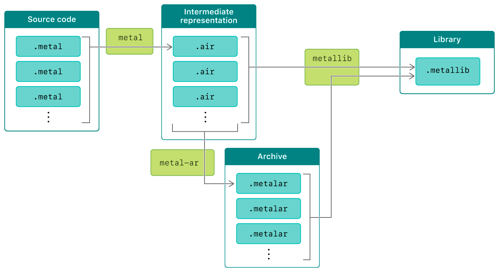

#  Building a Library with Metal's Command-Line Tools

> Use command-line tools to run the Metal compiler toolchain.

使用命令行工具运行 Metal 编译器工具链。

## Overview

> Manually compiling Metal Shading Language source code and building a Metal library without using Xcode involves the following process:
>
> 1. Use the metal tool to compile each .metal file into a single .air file, which stores an intermediate representation of Metal Shading Language source code.
>
> 2. Optionally, use the metal-ar tool to archive several .air files together into a single .metalar file. (The metal-ar tool is similar to the UNIX ar tool.)
>
> 3. Use the metallib tool to build .air or .metalar files into a single .metallib file, which stores the Metal library.

手动编译 Metal Shading Language 源代码并在不使用 Xcode 的情况下构建 Metal 库，涉及以下过程：

1. 使用 Metal 工具将每个 .metal 文件编译为单个 .air 文件，该文件存储 Metal Shading Language 源代码的中间表示。

2. 可选地，使用 metal-ar 工具将多个 .air 文件一起存档到单个 .metalar 文件中。（ metal-ar 工具类似于 UNIX ar 工具。）

3. 使用 metallib 工具将 .air 或 .metalar 文件构建到单个 .metallib 文件中，该文件存储 Metal 库。



## Run Metal's Command-Line Tools

> The following code shows the minimum number of commands that you need to compile and build a single .metal file into a single .metallib file. You can run these commands in the Terminal app and use the -help command to display the available options for each Metal tool. This example uses the macosx SDK, but you can use the iphoneos or appletvos SDK instead.

以下代码显示了将单个 .metal 文件编译并构建到单个 .metallib 文件中所需的最少命令数。你可以在终端应用程序中运行这些命令，并使用 -help 命令显示每个 Metal 工具的可用选项。此示例使用 macosx SDK ，但你可以使用 iphoneos 或 appletvos SDK 。

```objc
xcrun -sdk macosx metal -c MyLibrary.metal -o MyLibrary.air
xcrun -sdk macosx metallib MyLibrary.air -o MyLibrary.metallib
```

## Retrieve and Access a Built Library

> After you've built a library with Metal's command-line tools, add the resulting .metallib file to your Xcode project. Then, at runtime, call the [newLibraryWithFile:error:](https://developer.apple.com/documentation/metal/mtldevice/1433416-newlibrarywithfile?language=objc) method to retrieve and access your library as a [MTLLibrary](https://developer.apple.com/documentation/metal/mtllibrary?language=objc) object.

在使用 Metal 的命令行工具构建库之后，将生成的 .metallib 文件添加到 Xcode 项目中。然后，在运行时，调用 [newLibraryWithFile:error:](https://developer.apple.com/documentation/metal/mtldevice/1433416-newlibrarywithfile?language=objc) 方法来检索和访问由 [MTLLibrary](https://developer.apple.com/documentation/metal/mtllibrary?language=objc) 对象表示的库。

```objc
NSError *libraryError = NULL;
NSString *libraryFile = [[NSBundle mainBundle] pathForResource:@"MyLibrary" ofType:@"metallib"];
id <MTLLibrary> myLibrary = [_device newLibraryWithFile:libraryFile error:&libraryError];
if (!myLibrary) {
    NSLog(@"Library error: %@", libraryError.localizedDescription);
}
```
