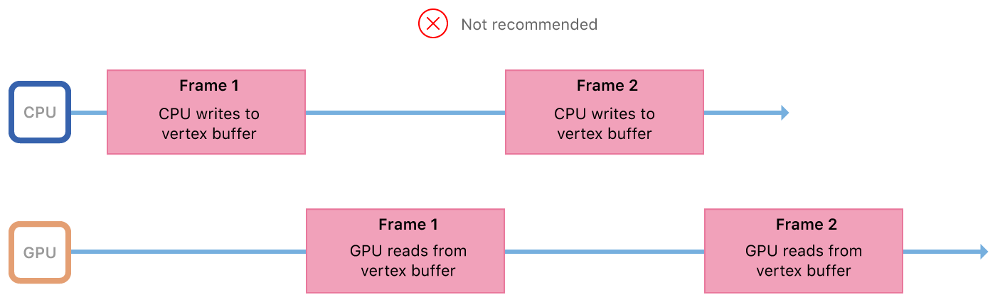
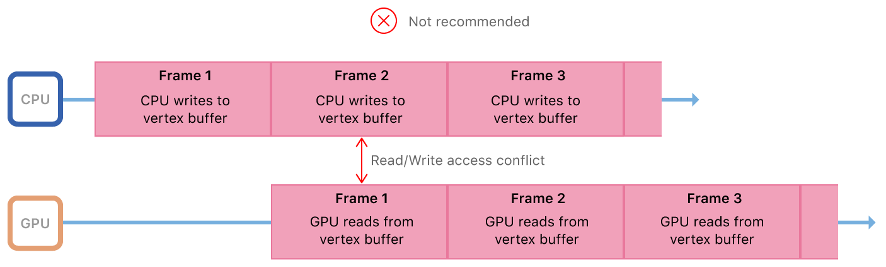
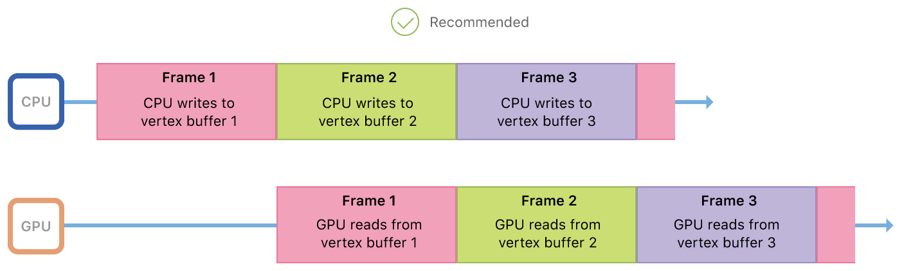

#  CPU and GPU Synchronization

> Demonstrates how to update buffer data and synchronize access between the CPU and GPU.

演示如何更新缓冲区数据并同步 CPU 和 GPU 之间的访问。

## Overview

> In this sample you’ll learn how to properly update and render animated resources that are shared between the CPU and the graphics processing unit (GPU). In particular, you’ll learn how to modify data each frame, avoid data access hazards, and execute CPU and GPU work in parallel.

在此示例中，你将学习如何正确更新和渲染 CPU 与图形处理单元（ GPU ）之间共享的动画资源。特别是，你将学习如何每帧修改数据，避免数据访问危险，并且并行执行 CPU 和 GPU 工作。

## CPU/GPU Parallelism and Shared Resource Access

> The CPU and GPU are separate, asynchronous processors. In a Metal app or game, the CPU encodes commands and the GPU executes commands. This sequence is repeated in every frame, and a full frame’s work is completed when both the CPU and the GPU have finished their work. The CPU and the GPU can work in parallel and don’t need to wait for each other to finish their work. For example, the GPU can execute commands for frame 1 while the CPU encodes commands for frame 2.
>
> This CPU/GPU parallelism has great advantages for your Metal app or game, effectively enabling you to run on two processors at once. However, these processors still work together and usually access the same shared resources, such as vertex buffers or fragment textures. Shared resource access must be handled with care; otherwise, the CPU and GPU might access a shared resource at the same time, resulting in a race condition and corrupted data.
>
> This sample, like most Metal apps or games, renders animated content by updating vertex data in each frame. Consider the following sequence:
>
> 1. The render loop starts a new frame.
>
> 2. The CPU writes new vertex data into the vertex buffer.
>
> 3. The CPU encodes render commands and commits a command buffer.
>
> 4. The GPU begins executing the command buffer.
>
> 5. The GPU reads vertex data from the vertex buffer.
>
> 6. The GPU renders pixels to a drawable.
>
> 7. The render loop completes the frame.
>
> In this sequence, the CPU and GPU both share a single vertex buffer. If the processors wait for each other to finish their work before beginning their own work, there are no access conflicts for the shared vertex buffer. This model avoids access conflicts, but wastes valuable processing time: when one processor is working, the other is idle.

CPU 和 GPU 是独立的异步处理器。在 Metal 应用程序或游戏中，CPU 对命令进行编码，GPU 执行命令。在每帧中重复这样的工作序列，并且当 CPU 和 GPU 都完成其工作时整个帧的工作完成。CPU 和 GPU 可以并行工作，无需等待彼此完成工作。例如，GPU 可以执行第一帧的命令，同时 CPU 对第二帧的命令进行编码。

这种 CPU / GPU 并行性对于你的 Metal 应用程序或游戏具有很大的优势，有效地使你可以同时在两个处理器上运行。但是，这些处理器仍然可以协同工作，并且通常可以访问相同的共享资源，例如顶点缓冲区或片段纹理。必须小心处理共享资源访问；否则，CPU 和 GPU 可能同时访问共享资源，从而导致竞争条件和数据损坏。

与大多数 Metal 应用或游戏一样，此示例通过每帧更新顶点数据来渲染动画内容。请考虑以下顺序：

1. 渲染循环启动新的一帧。

2. CPU 将新的顶点数据写入顶点缓冲区。

3. CPU 对渲染命令进行编码并提交命令缓冲区。

4. GPU 开始执行命令缓冲区。

5. GPU 从顶点缓冲区读取顶点数据。

6. GPU 将像素渲染到 drawable 。

7. 渲染循环完成当前帧。

在此序列中，CPU 和 GPU 共享一个顶点缓冲区。如果处理器在开始自己的工作之前等待彼此完成工作，则共享顶点缓冲区没有访问冲突。此模型避免了访问冲突，但浪费了宝贵的处理实践：当一个处理器正在工作时，另一个处理器处于空闲状态。



> Metal is designed to maximize CPU and GPU parallelism, so these processors should be kept busy and should be working simultaneously. Ideally, the GPU should be reading vertex data for frame 1 while the CPU is writing vertex data for frame 2. However, sharing a single vertex buffer means that the CPU could overwrite the previous frame’s vertex data before the GPU has read it, resulting in unsightly rendering artifacts.

Metal 旨在最大化 CPU 和 GPU 之间的并行性，因此这些处理器应该保持忙碌并且应该同时工作。理想情况下，当 CPU 正在为第二帧写顶点数据时，GPU 应该读取第一帧的顶点数据。但是，共享单个顶点缓冲区意味着 CPU 可以在 GPU 读取之前覆盖前一帧的顶点数据，从而导致难看的渲染结果。



> To reduce processor idle time and avoid access conflicts, vertex data can be shared by using multiple buffers instead of a single buffer. For example, the CPU and GPU can share vertex buffer 1 for frame 1, vertex buffer 2 for frame 2, vertex buffer 3 for frame 3, and so on. In this model, shared vertex data stays consistent throughout each frame and the processors access different vertex buffers simultaneously.

为了减少处理器空闲时间并避免访问冲突，可以使用多个缓冲区而不是单个缓冲区来共享顶点数据。例如，CPU 和 GPU 可以共享第一帧的顶点缓冲区 1 ，第二帧的顶点缓冲区 2 ，第三帧的顶点缓冲区 3 ，等等。在此模型中，共享顶点数据在每帧中保持一致，并且处理器同时访问不同的顶点缓冲区。



## Implement a Triple Buffer Model

> This sample renders hundreds of small quads, also known as sprites. To animate the sprites, the sample updates their positions at the start of each frame and writes them into a vertex buffer. When a frame is complete, the CPU and GPU no longer need the vertex buffer for that frame. Discarding a used vertex buffer and creating a new one for each frame is wasteful. Instead, a more sustainable model can be implemented with a FIFO queue of reusable vertex buffers.
>
> The maximum number of buffers in the queue is defined by the value of MaxBuffersInFlight, set to 3. This constant value defines the maximum number of frames that can be worked on simultaneously by any part of the device; this includes the app, the driver, or the display. The app only works on a frame in the CPU or the GPU, but the OS itself may work on a frame at the driver or display level. Using three buffers gives the device enough leeway to work efficiently and effectively. Too few buffers can result in processor stalls and resource contention, whereas too many buffers can result in increased memory overhead and frame latency.

此示例渲染数百个小四边形，也被称作精灵。为了让精灵动起来，示例会在每帧开始时更新它们的位置，并将它们写入顶点缓冲区。当某一帧完成后，CPU 和 GPU 不再需要该帧的顶点缓冲区。丢弃使用过的顶点缓冲区并为每帧创建一个新的顶点缓冲区是浪费的。相反，使用可重用顶点缓冲区的 FIFO 队列可以实现一个更可持续的模型。

队列中缓冲区的最大数量由 MaxBuffersInFlight 的值定义，设置为 3 。此常量值定义了设备的任何部分可以同时处理的最大帧数；这包括应用程序，驱动程序或显示设备。CPU 和 GPU 工作在一帧上，操作系统本身在驱动程序或显示级别上工作在一帧上。使用三个缓冲区可为设备提供足够的余地，以便高效且有效地工作。缓冲区太少会导致处理器停顿和资源争用，而缓冲区太多会导致内存开销和帧延迟增加。

```objc
for(NSUInteger bufferIndex = 0; bufferIndex < MaxBuffersInFlight; bufferIndex++)
{
    _vertexBuffers[bufferIndex] = [_device newBufferWithLength:spriteVertexBufferSize
        options:MTLResourceStorageModeShared];
}
```

> At the start of the drawInMTKView: render loop, the sample iterates through each of the buffers in the _vertexBuffer array, updating only one buffer per frame. At the end of every third frame, after all three buffers have been used, the sample cycles back to the start of the array and updates the contents of the _vertexBuffer[0] buffer.

在 drawInMTKView: 渲染循环开始时，示例遍历 _vertexBuffer 数组中的每个缓冲区，每帧只更新一个缓冲区。在每三个帧结束时，在所有三个缓冲区使用之后，循环回到数组的开始并更新 _vertexBuffer[0] 缓冲区的内容。

## Manage the Rate of Work

> To avoid overwriting data prematurely, the sample must ensure that the GPU has processed the contents of a buffer before reusing it. Otherwise, the CPU could overwrite the vertex data that was written three frames earlier but has not been read by the GPU yet. This condition occurs when the CPU produces work for the GPU faster than the GPU can complete it.
>
> This sample uses semaphores to wait for full frame completions in case the CPU is running too far ahead of the GPU.

为避免过早覆盖数据，在重新使用缓冲区之前，示例必须确保 GPU 已处理缓冲区的内容。否则，CPU 可能会覆盖早三帧写入但尚未被 GPU 读取的顶点数据。当 CPU 为 GPU 生成工作的速度超过 GPU 完成对应工作的速度时，就会出现这种情况。

此示例使用信号量等待全帧完成，防止 CPU 比 GPU 运行地过于超前。

```objc
_inFlightSemaphore = dispatch_semaphore_create(MaxBuffersInFlight);
```

> At the start of the render loop, the semaphore checks for a proceed or wait signal. If a buffer can be used or reused, the CPU work proceeds; otherwise, it waits until a buffer is available.

在渲染循环开始时，信号量检查进行或等待信号。如果存在缓冲区可以被使用或可以被复用，则 CPU 工作继续进行；否则，CPU 等待可用的缓冲区 。

```objc
dispatch_semaphore_wait(_inFlightSemaphore, DISPATCH_TIME_FOREVER);
```

> The GPU can’t signal the semaphore directly, but it can issue a completion callback to the CPU.

GPU 无法直接发信号通知信号量，但它可以向 CPU 发出完成回调。

```objc
[commandBuffer addCompletedHandler:^(id<MTLCommandBuffer> buffer)
{
    dispatch_semaphore_signal(block_sema);
}];
```

> The addCompletedHandler: method registers a block of code that that is called immediately after the GPU has finished executing a command buffer. This command buffer is the same one that committed a vertex buffer for a frame, so receiving the completion callback indicates that the vertex buffer can be safely reused.

addCompletedHandler: 方法注册一个代码块，当 GPU 完成命令缓冲区的执行之后，该代码块被立即调用。此命令缓冲区与提交顶点缓冲区的命令缓冲区为同一个，因此接收完成回调表示顶点缓冲区可以安全地被重用了。
