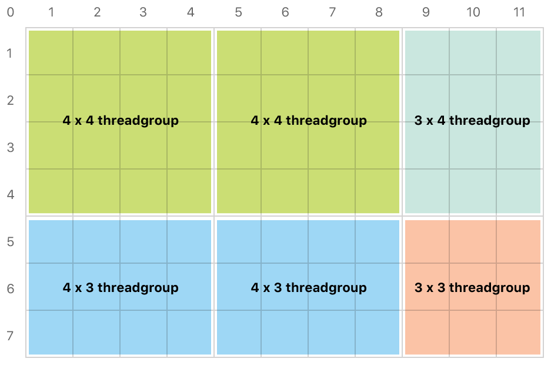
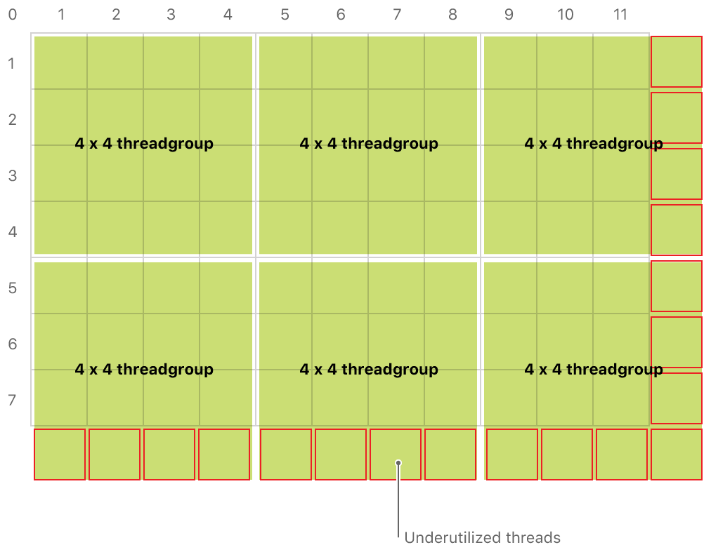

#  Calculating Threadgroup and Grid Sizes

> Calculate the optimum sizes for threadgroups and grids when dispatching compute-processing workloads.

在分派计算处理工作负载时，计算线程组和网格的最佳大小。

## Overview

> In iOS 11 and macOS 10.13 and later, when you're ready to execute your compute kernel code, you need to specify the size of the grid and the number of threads per threadgroup. Metal then calculates the number of threadgroups and provides nonuniform threadgroups if the grid size isn't a multiple of the threadgroup size. This ensures that you have no underutilized threads.
>
> In earlier versions of iOS and macOS, you need to specify the size and number of the threadgroups. Because the grid is composed of uniform threadgroups, it may not match the size of your data, in which case you need to add defensive code to your compute kernel to ensure that it's not executing outside the bounds of the data.

iOS 11 和 macOS 10.13 及更高版本中，当你准备执行计算内核代码时，需要指定网格的大小和每个线程组的线程数。 然后，Metal 会计算线程组的数量，并在网格大小不是线程组大小整数倍的情况下，提供非均匀线程组。这可确保你没有未充分利用的线程。

在 iOS 和 macOS 的早期版本中，你需要指定线程组的大小和数量。由于网格由统一的线程组组成，因此可能与数据大小不匹配，在这种情况下，你需要在计算内核中添加防御性代码，以确保它不在数据范围之外执行。

## Calculate Threads per Threadgroup

> You calculate the number of threads per threadgroup based on two [MTLComputePipelineState](https://developer.apple.com/documentation/metal/mtlcomputepipelinestate?language=objc) properties. One property is [maxTotalThreadsPerThreadgroup](https://developer.apple.com/documentation/metal/mtlcomputepipelinestate/1414927-maxtotalthreadsperthreadgroup?language=objc) (the maximum number of threads that can be in a single threadgroup). The other is [threadExecutionWidth](https://developer.apple.com/documentation/metal/mtlcomputepipelinestate/1414911-threadexecutionwidth?language=objc) (the number of threads scheduled to execute in parallel on the GPU).
>
> The maxTotalThreadsPerThreadgroup property is dependent on the device, the register usage of your compute kernel, and threadgroup memory usage. After a compute pipeline state has been created, its maxTotalThreadsPerThreadgroup value doesn't change, but two pipeline states on the same device may return different values.
>
> The number of threads per threadgroup can't exceed maxTotalThreadsPerThreadgroup. On a device with a maxTotalThreadsPerThreadgroup value of 512 and a threadExecutionWidth of 32, a suitable number of threads per threadgroup is 32 (the thread execution width) x 16 (the total threads per threadgroup divided by the thread execution width). Listing 1 shows an example of defining a threadgroup's dimensions based on the thread execution width and maximum threads per threadgroup.
>
> Listing 1 Calculating threads per threadgroup.

可以根据 [MTLComputePipelineState](https://developer.apple.com/documentation/metal/mtlcomputepipelinestate?language=objc) 的两个属性计算每个线程组的线程数。一个属性是 [maxTotalThreadsPerThreadgroup](https://developer.apple.com/documentation/metal/mtlcomputepipelinestate/1414927-maxtotalthreadsperthreadgroup?language=objc) （单个线程组中最大线程数）。另一个是 [threadExecutionWidth](https://developer.apple.com/documentation/metal/mtlcomputepipelinestate/1414911-threadexecutionwidth?language=objc) （ GPU 上并行执行的线程数）。

maxTotalThreadsPerThreadgroup 属性取决于设备，计算内核的寄存器使用情况以及线程组内存使用情况。在创建计算管道状态后，其 maxTotalThreadsPerThreadgroup 值将不会改变，但同一设备上的两个管道状态可能会返回不同的值。

每个线程组的线程数不能超过 maxTotalThreadsPerThreadgroup 。在 maxTotalThreadsPerThreadgroup 值为 512 且 threadExecutionWidth 为 32 的设备上，每个线程组的合适线程数为 32（线程执行宽度）x 16（每个线程组的总线程数除以线程执行宽度）。清单 1 显示了根据线程执行宽度和每个线程组的最大线程定义线程组维度的示例。

清单 1 计算每个线程组的线程数。

```objc
NSUInteger w = pipelineState.threadExecutionWidth;
NSUInteger h = pipelineState.maxTotalThreadsPerThreadgroup / w;
MTLSize threadsPerThreadgroup = MTLSizeMake(w, h, 1);
```

> Metal is able to calculate how the grid (in this case, an image or texture) can be optimally divided into nonuniform, arbitrarily sized threadgroups. The compute command encoder's [dispatchThreads:threadsPerThreadgroup:](https://developer.apple.com/documentation/metal/mtlcomputecommandencoder/2866532-dispatchthreads?language=objc) method requires the total number of threads—each thread being responsible for a single pixel—and the threadsPerThreadgroup value calculated in Listing 1, as shown in the following example:

Metal 能够计算网格（在这种情况下，图像或纹理）如何被最佳地划分为非均匀的，任意大小的线程组。计算命令编码器的 [dispatchThreads:threadsPerThreadgroup:](https://developer.apple.com/documentation/metal/mtlcomputecommandencoder/2866532-dispatchthreads?language=objc) 方法需要线程的总数 - 每个线程负责一个像素 - 以及清单 1 中计算的 threadsPerThreadgroup 值，如下例所示：

```objc
MTLSize threadsPerGrid = MTLSizeMake(texture.width, texture.height, 1);

[computeCommandEncoder dispatchThreads: threadsPerGrid
threadsPerThreadgroup: threadsPerThreadgroup];
```

> When Metal performs this calculation, it can generate smaller threadgroups along the edges of your grid, as shown below. When compared to uniform threadgroups, this technique simplifies kernel code and improves GPU performance.

当 Metal 执行此计算时，沿网格边缘的情况下，它可以生成较小的线程组，如下所示。与统一线程组相比，此技术简化了内核代码并提高了GPU性能。



## Calculate Threadgroups per Grid

> If you need fine control over the size and number of threadgroups, you can manually calculate how the grid is divided. In your code, ensure that there are sufficient threadgroups to cover the entire image. Here's an example:

如果需要对线程组的大小和数量进行精细控制，则可以手动计算网格的划分方式。在你的代码中，确保有足够的线程组来覆盖整个图像。这是一个例子：

```objc
MTLSize threadgroupsPerGrid = MTLSizeMake((texture.width + w - 1) / w,
(texture.height + h - 1) / h,
1);
```

> Given a texture of 1024 x 768, the code above returns a [MTLSize](https://developer.apple.com/documentation/metal/mtlsize?language=objc) object of 32 x 48 x 1, meaning the texture is divided into 1536 threadgroups, each containing 512 threads, for a total of 786,432 threads. In this case, that number matches the number of pixels in the image, and the entire image is processed with no underutilization of threads. However, this may not always be the case (for example, for an image size of 1920 x 1080). This code, by rounding up, ensures that there are sufficient threads to process the entire image.
>
> With this approach, the grid generated by the threadgroups could be larger than your data. Therefore, your code should exit early if the thread position in the grid is outside the bounds of the data. The following illustration shows how a set of 4 x 4 threadgroups extends over the bounds of a grid, leading to underutilization of threads:

给定 1024 x 768 的纹理，上面的代码返回一个 32 x 48 x 1 的 [MTLSize](https://developer.apple.com/documentation/metal/mtlsize?language=objc) 对象，这意味着纹理被分成 1536 个线程组，每个线程组包含 512 个线程，总共 786,432 个线程。在这种情况下，该数字与图像中的像素数匹配，并且处理整个图像时没有未充分利用的线程。但是，情况可能并非总是如此（例如，对于 1920 x 1080 的图像尺寸）。此代码通过四舍五入，确保有足够的线程来处理整个图像。

使用这种方法，线程组生成的网格可能比你的数据大。因此，如果网格中的线程位置超出数据范围，则代码应提前退出。下图显示了一组 4 x 4 线程组如何在网格边界上扩展，从而导致线程利用不足：



> Listing 4 shows a simple kernel that writes opaque white to each pixel in outputTexture. It begins by comparing the thread position to the bounds of the texture and returns if the position is outside of the texture's extent.
>
> Listing 4 Exiting early when out of bounds.

清单 4 展示了一个简单的内核，它将不透明的白色写入 outputTexture 中的每个像素。它首先将线程位置与纹理边界进行比较，如果位置超出纹理范围，则返回。

清单 4 越界时提早退出

```objc
kernel void
simpleKernelFunction(texture2d<float, access::write> outputTexture [[texture(0)]],
uint2 position [[thread_position_in_grid]]) {

    if (position.x >= outputTexture.get_width() || position.y >= outputTexture.get_height()) {
        return;
    }

    outputTexture.write(float4(1.0), position);
}
```

> Note that this check isn't required with the previous dispatchThreads:threadsPerThreadgroup: technique.
>
> Using the code in Listing 4, the final dispatch would be:

请注意，上面提到的 dispatchThreads:threadsPerThreadgroup: 技术不需要进行此检查。

使用清单 4 中的代码，最终的调度将是：

```objc
[computeCommandEncoder dispatchThreadgroups: threadgroupsPerGrid
threadsPerThreadgroup: threadsPerThreadgroup];
```
