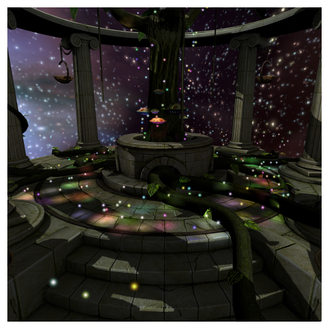
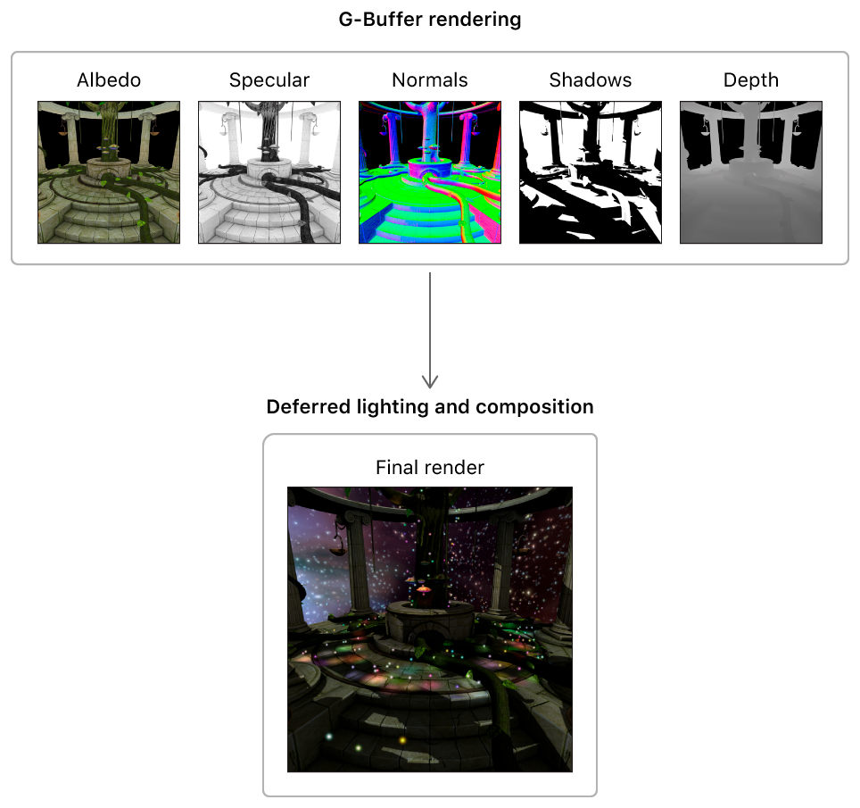
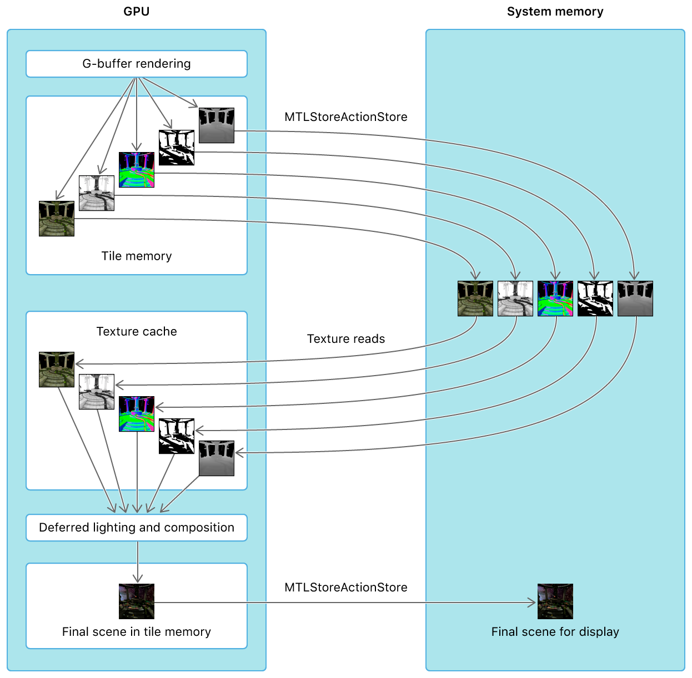
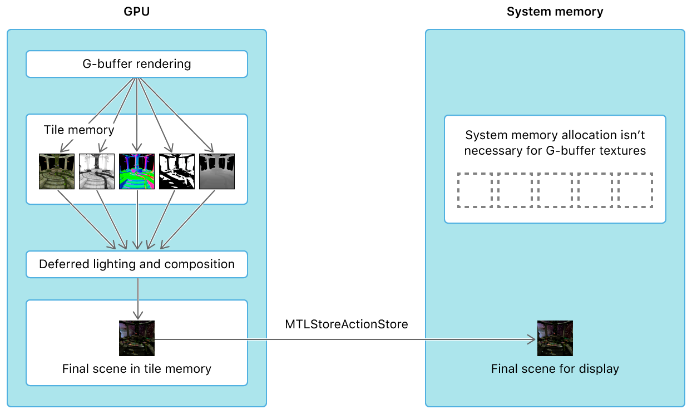

#  Deferred Lighting

> Demonstrates how to implement a deferred lighting renderer that takes advantage of unique Metal features.

演示如何利用 Metal 独特功能实现延迟照明渲染器。

## Overview

> This sample demonstrates a deferred lighting renderer that implements shadows using a shadow map, and culls light volumes using the stencil buffer.

此示例演示了延迟照明渲染器，该渲染器使用阴影贴图实现阴影，并使用模板缓冲区剔除光量。

> Deferred lighting can render a large number of lights more easily than forward lighting. For example, with forward lighting, in a scene with many lights, it’s infeasible for every fragment to calculate the contribution of every light. Complex sorting and binning algorithms must be implemented to limit the calculation of light contributions to only those lights affecting each fragment. With deferred lighting, multiple lights can be applied to the scene with ease.

与前向照明相比，延迟照明可以更容易地渲染大量灯光。例如，对于前向照明，在具有许多光的场景中，每个片段计算每个光的贡献是不可行的。必须实现复杂的排序和分级算法，以限制仅对影响每个片段的那些光的贡献的计算。通过延迟照明，可以轻松地将多个灯光应用于场景。

## Review Important Concepts

> Before you get started with the sample app, review these concepts to better understand key details of a deferred lighting renderer and some unique Metal features.

在开始使用示例应用程序之前，请查看这些概念，以便更好地了解延迟照明渲染器的关键细节以及一些独特的 Metal 功能。

### Traditional Deferred Lighting Renderer

> A traditional deferred lighting renderer is typically separated into two render passes:
>
> - First pass: G-buffer rendering. The renderer draws and transforms the scene’s models, and the fragment function renders the results to a collection of textures known as the geometry buffer or G-buffer. The G-buffer contains material colors from the models, as well as per-fragment normal, shadow, and depth values.
>
> - Second pass: Deferred lighting and composition. The renderer draws each light volume, using the G-buffer data to reconstruct the position of each fragment and apply the lighting calculations. As the lights are drawn, the output of each light is blended on top of the previous light outputs. Finally, the renderer composites other data, such as shadows and directional lighting, onto the scene by executing a full-screen quad or a compute kernel.

传统的延迟光照渲染器通常分为两个渲染过程：

- 过程一：G 缓冲区渲染。渲染器绘制并变换场景的模型，片段函数将结果渲染到称为几何缓冲区或 G 缓冲区的纹理集合。G 缓冲区包含模型中的材质颜色，以及每个片段的法线，阴影和深度值。

- 过程二：延迟照明和组合。渲染器绘制每个光量，使用 G 缓冲区数据重建每个片段的位置并应用光照计算。在绘制灯光时，每个灯光的输出都会混合在之前的灯光输出之上。最后，渲染器将其他数据（例如阴影和平行照明）合成到场景上，通过执行全屏四边形或计算内核将结果渲染到屏幕上。

> Note - macOS GPUs have an immediate mode rendering (IMR) architecture. On IMR GPUs, a deferred lighting renderer can only be implemented with at least two render passes. Therefore, the sample implements a two-pass deferred lighting algorithm for the macOS version of the app.

注意 - macOS GPU 具有立即模式渲染（ IMR ）架构。在 IMR GPU 上，延迟照明渲染器只能使用至少两个渲染过程实现。因此，该示例为应用程序的 macOS 版本实现了双过程延迟照明算法。

### Single-Pass Deferred Lighting on iOS and tvOS GPUs

> iOS and tvOS GPUs have a tile-based deferred rendering (TBDR) architecture, which allows them to render data to tile memory within the GPU. By rendering to tile memory, the device avoids potentially expensive round trips between the GPU and system memory (via a bandwidth-constrained memory bus). Whether a GPU writes tile memory to system memory depends on these configurations:
>
> - The store action of the app’s render command encoders.
>
> - The storage mode of the app’s textures.
>
> When MTLStoreActionStore is set as a store action, output data for the render targets of a render pass is written from tile memory to system memory, where the render targets are backed by textures. If this data is then used for a subsequent render pass, input data from these textures is read from system memory into a texture cache in the GPU. Therefore, a traditional deferred lighting renderer that accesses system memory requires G-buffer data to be stored in system memory between the first and second render passes.

iOS 和 tvOS GPU 具有基于 tile 的延迟渲染（ TBDR ）架构，允许它们将数据渲染到 GPU 内的 tile 内存。通过渲染到 tile 内存，该设备避免了 GPU 和系统内存之间潜在的昂贵的往返（通过带宽受限的存储器总线）开销。GPU 是否将 tile 内存写入系统内存取决于以下配置：

- 应用程序渲染命令编码器的存储操作。

- 应用程序纹理的存储模式。

当存储操作设置为 MTLStoreActionStore 时，渲染过程的渲染目标的输出数据将从 tile 内存写入系统内存，其中渲染目标由纹理支持。如果此数据随后用于后续渲染过程，则来自这些纹理的输入数据从系统内存被读取到 GPU 中的纹理高速缓存中。因此，访问系统内存的传统延迟照明渲染器要求 G 缓冲区数据在第一和第二渲染过程之间存储到系统内存中。

> However, because of their TBDR architecture, iOS and tvOS GPUs can also read data from tile memory at any given time. This allows fragment shaders to read from and perform calculations on render targets in tile memory, before this data is written to tile memory again. This feature allows the sample to avoid storing G-buffer data in system memory between the first and second render passes; thus, a deferred lighting renderer can be implemented with a single render pass.
>
> G-buffer data is produced and consumed exclusively by the GPU, not the CPU, within the single render pass. Therefore, this data isn’t loaded from system memory before the render pass begins, nor is it stored in system memory after the render pass finishes. Instead of reading G-buffer data from a texture in system memory, the lighting fragment functions read data from the G-buffer while it’s still attached to the render pass as a render target. Thus, system memory doesn’t need to be allocated for G-buffer textures, and each of these textures can be declared with a MTLStorageModeMemoryless storage mode.

但是，由于其 TBDR 架构，iOS 和 tvOS GPU 可以在任何给定时间从 tile 内存中读取数据。这允许片段着色器在将此数据再次写入 tile 内存之前从 tile 内存中的渲染目标读取并执行计算。此功能允许示例避免在第一次和第二次渲染过程之间将 G 缓冲区数据存储在系统内存中；因此，延迟的照明渲染器可以用单个渲染过程实现。

G 缓冲区数据由单个渲染过程中的 GPU（而不是 CPU ）专门生成和使用。因此，在渲染过程开始之前，不会从系统内存加载此数据，也不会在渲染过程完成后将其存储在系统内存中。光照片段不是从系统内存中的纹理读取 G 缓冲区数据，而是当 G 缓冲区仍然作为渲染目标附加在渲染过程上期间，从 G 缓冲区读取数据。因此，不需要为 G 缓冲区纹理分配系统内存，并且可以使用 MTLStorageModeMemoryless 存储模式声明这些纹理中的每一个。

> Note - The feature that allows a TBDR GPU to read from attached render targets in a fragment function is also known as programmable blending.

注意 - 允许 TBDR GPU 在片段函数中读取附加渲染目标的功能也称为可编程混合。

### Deferred Lighting with Raster Order Groups

> By default, when a fragment shader writes data to a pixel, the GPU waits until the shader has completely finished writing to that pixel before beginning the execution of another fragment shader for that same pixel.

默认情况下，当片段着色器将数据写入像素时，GPU 会等待着色器完全写入该像素，然后再开始执行该像素的另一个片段着色器。

> Raster order groups allow apps to increase the parallelization of the GPU’s fragment shaders. With raster order groups, a fragment function can separate render targets into different execution groups. This separation allows the GPU to read from and perform calculations on render targets in one group, before a previous instance of a fragment shader has finished writing data to pixels in another group.

光栅顺序组允许应用程序增加 GPU 片段着色器的并行化。对于栅格顺序组，片段函数可以将渲染目标分成不同的执行组。这种分离允许 GPU 在另一个组的前一个片段着色器实例完成像素的写入之前，在属于一个组的渲染目标上进行读取并执行计算。

> In this sample, some lighting fragment functions use these raster order groups:
>
> - Raster order group 0. AAPLLightingROG is used for the render target that contains the results of the lighting calculations.
>
> - Raster order group 1. AAPLGBufferROG is used for the G-buffer data in the lighting function.
>
> These raster order groups allow the GPU to read the G-buffer in a fragment shader and execute the lighting calculations, before the lighting calculations from a previous instance of a fragment shader have finished writing their output data.

在此示例中，某些光照片段函数使用以下栅格顺序组：

- 光栅顺序组 0 。AAPLLightingROG 用于包含光照计算结果的渲染目标。

- 光栅顺序组 1 。AAPLGBufferROG 用于照明功能中的 G 缓冲区数据。

这些栅格顺序组允许 GPU 在片段着色器中读取 G 缓冲区并执行光照计算，然后片段着色器的先前实例完成光照计算并写入其输出数据。
