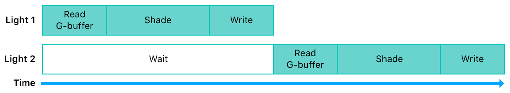
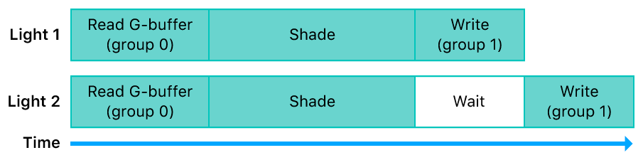
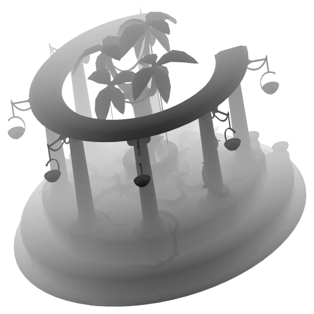
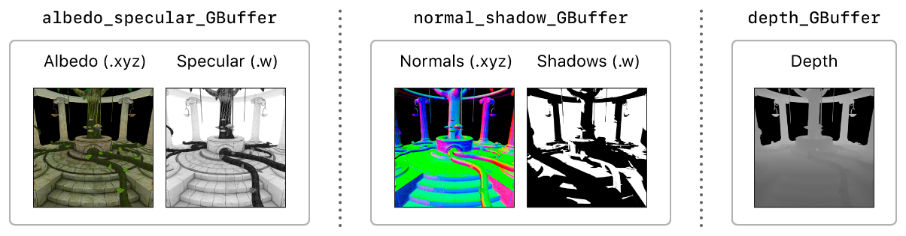
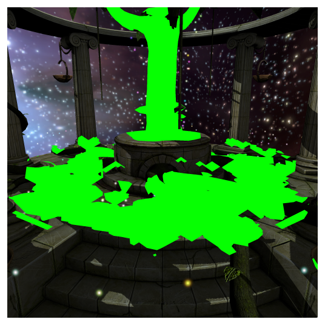
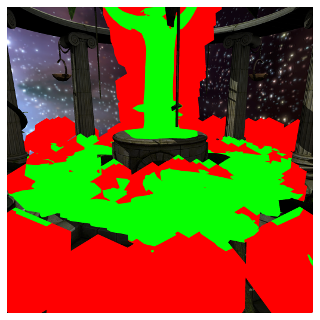

#  Deferred Lighting

> Demonstrates how to implement a deferred lighting renderer that takes advantage of unique Metal features.

演示如何利用 Metal 独特功能实现延迟照明渲染器。

## Overview

> This sample demonstrates a deferred lighting renderer that implements shadows using a shadow map, and culls light volumes using the stencil buffer.

此示例演示了延迟照明渲染器，该渲染器使用阴影贴图实现阴影，并使用模板缓冲区剔除光量。


> Deferred lighting can render a large number of lights more easily than forward lighting. For example, with forward lighting, in a scene with many lights, it’s infeasible for every fragment to calculate the contribution of every light. Complex sorting and binning algorithms must be implemented to limit the calculation of light contributions to only those lights affecting each fragment. With deferred lighting, multiple lights can be applied to the scene with ease.

与前向照明相比，延迟照明可以更容易地渲染大量灯光。例如，对于前向照明，在具有许多光的场景中，每个片段计算每个光的贡献是不可行的。必须实现复杂的排序和分级算法，以限制仅对影响每个片段的那些光的贡献的计算。通过延迟照明，可以轻松地将多个灯光应用于场景。

## Review Important Concepts

> Before you get started with the sample app, review these concepts to better understand key details of a deferred lighting renderer and some unique Metal features.

在开始使用示例应用程序之前，请查看这些概念，以便更好地了解延迟照明渲染器的关键细节以及一些独特的 Metal 功能。

### Traditional Deferred Lighting Renderer

> A traditional deferred lighting renderer is typically separated into two render passes:
>
> - First pass: G-buffer rendering. The renderer draws and transforms the scene’s models, and the fragment function renders the results to a collection of textures known as the geometry buffer or G-buffer. The G-buffer contains material colors from the models, as well as per-fragment normal, shadow, and depth values.
>
> - Second pass: Deferred lighting and composition. The renderer draws each light volume, using the G-buffer data to reconstruct the position of each fragment and apply the lighting calculations. As the lights are drawn, the output of each light is blended on top of the previous light outputs. Finally, the renderer composites other data, such as shadows and directional lighting, onto the scene by executing a full-screen quad or a compute kernel.

传统的延迟光照渲染器通常分为两个渲染过程：

- 过程一：G 缓冲区渲染。渲染器绘制并变换场景的模型，片段函数将结果渲染到称为几何缓冲区或 G 缓冲区的纹理集合。G 缓冲区包含模型中的材质颜色，以及每个片段的法线，阴影和深度值。

- 过程二：延迟照明和组合。渲染器绘制每个光量，使用 G 缓冲区数据重建每个片段的位置并应用光照计算。在绘制灯光时，每个灯光的输出都会混合在之前的灯光输出之上。最后，渲染器将其他数据（例如阴影和平行照明）合成到场景上，通过执行全屏四边形或计算内核将结果渲染到屏幕上。


> Note - macOS GPUs have an immediate mode rendering (IMR) architecture. On IMR GPUs, a deferred lighting renderer can only be implemented with at least two render passes. Therefore, the sample implements a two-pass deferred lighting algorithm for the macOS version of the app.

注意 - macOS GPU 具有立即模式渲染（ IMR ）架构。在 IMR GPU 上，延迟照明渲染器只能使用至少两个渲染过程实现。因此，该示例为应用程序的 macOS 版本实现了双过程延迟照明算法。

### Single-Pass Deferred Lighting on iOS and tvOS GPUs

> iOS and tvOS GPUs have a tile-based deferred rendering (TBDR) architecture, which allows them to render data to tile memory within the GPU. By rendering to tile memory, the device avoids potentially expensive round trips between the GPU and system memory (via a bandwidth-constrained memory bus). Whether a GPU writes tile memory to system memory depends on these configurations:
>
> - The store action of the app’s render command encoders.
>
> - The storage mode of the app’s textures.
>
> When MTLStoreActionStore is set as a store action, output data for the render targets of a render pass is written from tile memory to system memory, where the render targets are backed by textures. If this data is then used for a subsequent render pass, input data from these textures is read from system memory into a texture cache in the GPU. Therefore, a traditional deferred lighting renderer that accesses system memory requires G-buffer data to be stored in system memory between the first and second render passes.

iOS 和 tvOS GPU 具有基于 tile 的延迟渲染（ TBDR ）架构，允许它们将数据渲染到 GPU 内的 tile 内存。通过渲染到 tile 内存，该设备避免了 GPU 和系统内存之间潜在的昂贵的往返（通过带宽受限的存储器总线）开销。GPU 是否将 tile 内存写入系统内存取决于以下配置：

- 应用程序渲染命令编码器的存储操作。

- 应用程序纹理的存储模式。

当存储操作设置为 MTLStoreActionStore 时，渲染过程的渲染目标的输出数据将从 tile 内存写入系统内存，其中渲染目标由纹理支持。如果此数据随后用于后续渲染过程，则来自这些纹理的输入数据从系统内存被读取到 GPU 中的纹理高速缓存中。因此，访问系统内存的传统延迟照明渲染器要求 G 缓冲区数据在第一和第二渲染过程之间存储到系统内存中。


> However, because of their TBDR architecture, iOS and tvOS GPUs can also read data from tile memory at any given time. This allows fragment shaders to read from and perform calculations on render targets in tile memory, before this data is written to tile memory again. This feature allows the sample to avoid storing G-buffer data in system memory between the first and second render passes; thus, a deferred lighting renderer can be implemented with a single render pass.
>
> G-buffer data is produced and consumed exclusively by the GPU, not the CPU, within the single render pass. Therefore, this data isn’t loaded from system memory before the render pass begins, nor is it stored in system memory after the render pass finishes. Instead of reading G-buffer data from a texture in system memory, the lighting fragment functions read data from the G-buffer while it’s still attached to the render pass as a render target. Thus, system memory doesn’t need to be allocated for G-buffer textures, and each of these textures can be declared with a MTLStorageModeMemoryless storage mode.

但是，由于其 TBDR 架构，iOS 和 tvOS GPU 可以在任何给定时间从 tile 内存中读取数据。这允许片段着色器在将此数据再次写入 tile 内存之前从 tile 内存中的渲染目标读取并执行计算。此功能允许示例避免在第一次和第二次渲染过程之间将 G 缓冲区数据存储在系统内存中；因此，延迟的照明渲染器可以用单个渲染过程实现。

G 缓冲区数据由单个渲染过程中的 GPU（而不是 CPU ）专门生成和使用。因此，在渲染过程开始之前，不会从系统内存加载此数据，也不会在渲染过程完成后将其存储在系统内存中。光照片段不是从系统内存中的纹理读取 G 缓冲区数据，而是当 G 缓冲区仍然作为渲染目标附加在渲染过程上期间，从 G 缓冲区读取数据。因此，不需要为 G 缓冲区纹理分配系统内存，并且可以使用 MTLStorageModeMemoryless 存储模式声明这些纹理中的每一个。


> Note - The feature that allows a TBDR GPU to read from attached render targets in a fragment function is also known as programmable blending.

注意 - 允许 TBDR GPU 在片段函数中读取附加渲染目标的功能也称为可编程混合。

### Deferred Lighting with Raster Order Groups

> By default, when a fragment shader writes data to a pixel, the GPU waits until the shader has completely finished writing to that pixel before beginning the execution of another fragment shader for that same pixel.

默认情况下，当片段着色器将数据写入像素时，GPU 会等待着色器完全写入该像素，然后再开始执行该像素的另一个片段着色器。



> Raster order groups allow apps to increase the parallelization of the GPU’s fragment shaders. With raster order groups, a fragment function can separate render targets into different execution groups. This separation allows the GPU to read from and perform calculations on render targets in one group, before a previous instance of a fragment shader has finished writing data to pixels in another group.

光栅顺序组允许应用程序增加 GPU 片段着色器的并行化。对于栅格顺序组，片段函数可以将渲染目标分成不同的执行组。这种分离允许 GPU 在另一个组的前一个片段着色器实例完成像素的写入之前，在属于一个组的渲染目标上进行读取并执行计算。



> In this sample, some lighting fragment functions use these raster order groups:
>
> - Raster order group 0. AAPLLightingROG is used for the render target that contains the results of the lighting calculations.
>
> - Raster order group 1. DeferredLightingBufferROG is used for the G-buffer data in the lighting function.
>
> These raster order groups allow the GPU to read the G-buffer in a fragment shader and execute the lighting calculations, before the lighting calculations from a previous instance of a fragment shader have finished writing their output data.

在此示例中，某些光照片段函数使用以下栅格顺序组：

- 光栅顺序组 0 。AAPLLightingROG 用于包含光照计算结果的渲染目标。

- 光栅顺序组 1 。DeferredLightingBufferROG 用于照明功能中的 G 缓冲区数据。

这些栅格顺序组允许 GPU 在片段着色器中读取 G 缓冲区并执行光照计算，然后片段着色器的先前实例完成光照计算并写入其输出数据。

## Render a Deferred Lighting Frame

> The sample renders each full frame by rendering these stages, in this order:
>
> 1. Shadow map
>
> 2. G-buffer
>
> 3. Directional light
>
> 4. Light mask
>
> 5. Point lights
>
> 6. Skybox
>
> 7. Fairy lights
>
> The sample’s iOS and tvOS renderer produces the G-buffer and performs all subsequent stages in a single render pass. This single-pass implementation is possible due to the TBDR architecture of iOS and tvOS GPUs, which allows a device to read G-buffer data from render targets in tile memory.

该示例通过按以下顺序渲染这些阶段来渲染每个完整帧：

1. 阴影贴图

2. G-缓冲

3. 平行光

4. 光罩

5. 点光源

6. Skybox

7. Fairy lights

示例的 iOS 和 tvOS 渲染器在单个渲染过程中生成 G 缓冲区以及执行所有后续阶段。由于 iOS 和 tvOS GPU 的 TBDR 架构，这种单过程实现是可能的，它允许设备从 tile 存储器中的渲染目标读取 G 缓冲区数据。

```objc
id <MTLRenderCommandEncoder> renderEncoder = [commandBuffer renderCommandEncoderWithDescriptor:_viewRenderPassDescriptor];

[super drawGBuffer:renderEncoder];

[self drawDirectionalLight:renderEncoder];

[super drawPointLightMask:renderEncoder];

[self drawPointLights:renderEncoder];

[super drawSky:renderEncoder];

[super drawFairies:renderEncoder];

[renderEncoder endEncoding];
```

> The sample’s macOS renderer produces the G-buffer in one render pass and then performs all subsequent stages in another render pass. This two-pass implementation is necessary due to the IMR architecture of macOS GPUs, which requires a device to sample G-buffer data from textures in video memory.

示例的 macOS 渲染器在一个渲染过程中生成 G 缓冲区，然后在另一个渲染过程中执行后续所有阶段。由于 macOS  GPU 的 IMR 架构，这种双过程实现是必要的，这需要设备从视频存储器中的纹理中采样 G 缓冲区数据。

```objc
id<MTLRenderCommandEncoder> renderEncoder = [commandBuffer renderCommandEncoderWithDescriptor:_GBufferRenderPassDescriptor];

[super drawGBuffer:renderEncoder];

[renderEncoder endEncoding];
```

```
id<MTLRenderCommandEncoder> renderEncoder = [commandBuffer renderCommandEncoderWithDescriptor:_finalRenderPassDescriptor];

[self drawDirectionalLight:renderEncoder];

[super drawPointLightMask:renderEncoder];

[self drawPointLights:renderEncoder];

[super drawSky:renderEncoder];

[super drawFairies:renderEncoder];

[renderEncoder endEncoding];
```

### Render the Shadow Map

> The sample renders a shadow map for the single directional light in the scene (the sun) by rendering the model from the light’s perspective.

该示例通过从灯光的角度渲染模型，为场景中的单个平行光（太阳）渲染阴影贴图。



> The render pipeline for the shadow map has a vertex function but not a fragment function; therefore, the sample can determine the screen-space depth value written to the shadow map without executing further stages of the render pipeline. (Additionally, because the render pipeline doesn’t have a fragment function, it executes much more quickly than it would if it had one.)

阴影贴图的渲染管道具有顶点函数但不具有片段函数；因此，示例可以确定写入阴影贴图的屏幕空间深度值，而无需执行渲染管线的其他阶段。（另外，因为渲染管道没有片段功能，所以它的执行速度比没有片段功能时要快得多。）

```objc
MTLRenderPipelineDescriptor *renderPipelineDescriptor = [MTLRenderPipelineDescriptor new];
renderPipelineDescriptor.label = @"Shadow Gen";
renderPipelineDescriptor.vertexDescriptor = nil;
renderPipelineDescriptor.vertexFunction = shadowVertexFunction;
renderPipelineDescriptor.fragmentFunction = nil;
renderPipelineDescriptor.depthAttachmentPixelFormat = MTLPixelFormatDepth32Float;

_shadowGenPipelineState = [_device newRenderPipelineStateWithDescriptor:renderPipelineDescriptor
error:&error];
```

> Before drawing geometry for the shadow map, the sample sets a depth bias value to reduce shadow artifacts.

在为阴影贴图绘制几何图形之前，示例设置深度偏差值以减少阴影瑕疵。

```objc
[encoder setDepthBias:0.015 slopeScale:7 clamp:0.02];
```

> Then, in the fragment function of the G-buffer stage, the sample tests whether the fragment is occluded and shadowed.

然后，在 G 缓冲阶段的片段函数中，样本测试片段是否被遮挡和阴影。

```objc
float shadow_sample = shadowMap.sample_compare(shadowSampler, in.shadow_coord.xy, in.shadow_coord.z);
```

> The sample stores the result of the sample_compare function in the w component of the normal_shadow render target.

该示例将 sample_compare 函数的结果存储在 normal_shadow 渲染目标的 w 分量中。

```objc
gBuffer.normal_shadow = half4(eye_normal.xyz, shadow_sample);
```

> In the directional light and point light composition stages, the sample reads the shadow value from the G-buffer and applies it to the fragment.

在平行光和点光合成阶段，示例从 G 缓冲区读取阴影值并将其应用于片段。

### Render the G-Buffer

> The sample’s G-buffer contains these textures:
>
> - albedo_specular_GBuffer, which stores albedo and specular data. Albedo data is stored in the x, y, and z components; specular data is stored in the w component.
>
> - normal_shadow_GBuffer, which stores normal and shadow data. Normal data is stored in the x, y, and z components; shadow data is stored in the w component.
>
> - depth_GBuffer, which stores depth values in eye space.

示例的 G 缓冲区包含以下纹理：

- albedo_specular_GBuffer，用于存储反照率和镜面反射数据。反照率数据存储在 x，y 和 z 分量中；镜面数据存储在 w 分量中。

- normal_shadow_GBuffer，存储法线和阴影数据。法线数据存储在 x，y 和 z 分量中；阴影数据存储在 w 分量中。

- depth_GBuffer，用于存储视空间中的深度值。



> When the sample renders the G-buffer, the iOS and tvOS renderer and the macOS renderer attach all the G-buffer textures as render targets for the render pass. However, because iOS and tvOS devices can both render the G-buffer and read from it in a single render pass, the sample creates the iOS and tvOS textures with a memoryless storage mode, which indicates that system memory isn’t allocated for these textures. Instead, these textures are allocated and populated only in tile memory for the duration of the render pass.
>
> The sample creates the G-buffer textures in the common drawableSizeWillChange:withGBufferStorageMode: method, but the iOS and tvOS renderer sets the storageMode variable to MTLStorageModeMemoryless while the macOS renderer sets it to MTLStorageModePrivate.

当示例渲染 G 缓冲区时，iOS 和 tvOS 渲染器以及 macOS 渲染器将所有 G 缓冲区纹理附加为渲染过程的渲染目标。 但是，由于 iOS 和 tvOS 设备都可以在单个渲染过程中渲染 G 缓冲区并从中读取，因此该示例使用无记忆存储模式创建 iOS 和 tvOS 纹理，这表明并没有为这些纹理分配系统内存。相反，在渲染过程的持续时间内，这些纹理仅在 tile 内存中分配和填充。

该示例在常见的 drawableSizeWillChange:withGBufferStorageMode: 方法中创建 G 缓冲区纹理，但 iOS 和 tvOS 渲染器将 storageMode 变量设置为 MTLStorageModeMemoryless ，而 macOS 渲染器将其设置为 MTLStorageModePrivate 。

```objc
GBufferTextureDesc.storageMode = storageMode;

GBufferTextureDesc.pixelFormat = _albedo_specular_GBufferFormat;
_albedo_specular_GBuffer = [_device newTextureWithDescriptor:GBufferTextureDesc];

GBufferTextureDesc.pixelFormat = _normal_shadow_GBufferFormat;
_normal_shadow_GBuffer = [_device newTextureWithDescriptor:GBufferTextureDesc];

GBufferTextureDesc.pixelFormat = _depth_GBufferFormat;
_depth_GBuffer = [_device newTextureWithDescriptor:GBufferTextureDesc];
```

> For the macOS renderer, after the sample finishes writing data to the G-buffer textures, it calls the endEncoding method to finalize the G-buffer render pass. Because the store action for the render command encoder is set to MTLStoreActionStore, the GPU writes each of the render target textures to video memory when the encoder completes its execution. This allows the sample to read these textures from video memory in the subsequent deferred lighting and composition render pass.
>
> For the iOS and tvOS renderer, after the sample finishes writing data to the G-buffer textures, the sample doesn’t finalize the render command encoder and instead continues to use it for subsequent stages.

对于 macOS 渲染器，在示例完成将数据写入 G 缓冲区纹理后，它会调用 endEncoding 方法来完成 G 缓冲区渲染过程。由于渲染命令编码器的存储操作设置为 MTLStoreActionStore ，因此 GPU 在编码器完成执行时将每个渲染目标纹理写入视频内存。这允许示例在随后的延迟光照和合成渲染过程中从视频内存中读取这些纹理。

对于 iOS 和 tvOS 渲染器，在示例完成将数据写入 G 缓冲区纹理后，示例并没有 finalize 渲染命令编码器，而是继续将其用于后续阶段。

### Apply the Directional Lighting and Shadows

> The sample applies directional lighting and shadows to the drawable that’s destined for the display.
>
> The macOS renderer reads G-buffer data from textures set as arguments to a fragment function.

该示例将平行光和阴影应用于最终显示的 drawable 。

macOS 渲染器从设置为片段函数参数的纹理中读取 G 缓冲区数据。

```objc
fragment half4
deferred_directional_lighting_fragment(QuadInOut               in                      [[ stage_in ]],
constant AAPLUniforms & uniforms                [[ buffer(AAPLBufferIndexUniforms) ]],
texture2d<half>         albedo_specular_GBuffer [[ texture(AAPLRenderTargetAlbedo) ]],
texture2d<half>         normal_shadow_GBuffer   [[ texture(AAPLRenderTargetNormal) ]],
texture2d<float>        depth_GBuffer           [[ texture(AAPLRenderTargetDepth)  ]])
```

> The iOS and tvOS renderer reads G-buffer data from render targets attached to the render pass.

iOS 和 tvOS 渲染器从附加到渲染过程的渲染目标中读取 G 缓冲区数据。

```objc
struct GBufferData
{
    half4 lighting        [[color(AAPLRenderTargetLighting), raster_order_group(AAPLLightingROG)]];
    half4 albedo_specular [[color(AAPLRenderTargetAlbedo),   raster_order_group(DeferredLightingBufferROG)]];
    half4 normal_shadow   [[color(AAPLRenderTargetNormal),   raster_order_group(DeferredLightingBufferROG)]];
    float depth           [[color(AAPLRenderTargetDepth),    raster_order_group(DeferredLightingBufferROG)]];
};
```

```objc
fragment AccumLightBuffer
deferred_directional_lighting_fragment(QuadInOut               in       [[ stage_in ]],
constant AAPLUniforms & uniforms [[ buffer(AAPLBufferIndexUniforms) ]],
GBufferData             GBuffer)
```

> Although these fragment functions have different inputs, they share a common implementation in the deferred_directional_lighting_fragment_common fragment function. This function performs these operations:
>
> - Reconstructs the normals from the G-buffer normal data to calculate the diffuse term.
>
> - Reconstructs the eye space position from the G-buffer depth data to apply specular highlights.
>
> - Uses the G-buffer shadow data to darken the fragment and apply the shadow to the scene.
>
> Because this is the first stage that renders to the drawable, the iOS and tvOS renderer obtains a drawable before the earlier G-buffer stage so that the drawable can be merged with the output of later stages. The macOS renderer, however, delays obtaining a drawable until after the G-buffer stage is completed and before the directional light stage begins. This delay reduces the amount of time that the app holds onto the drawable and thus improves performance.
>
> Note - Because of the state of _directionLightDepthStencilState, the deferred_directional_lighting_fragment function is only executed for fragments that should be lit. This optimization is simple yet important, and saves many fragment shader execution cycles.

虽然这些片段函数具有不同的输入，但它们共享在 deferred_directional_lighting_fragment_common 片段函数中的实现。此函数执行以下操作：

- 从 G 缓冲区法线数据重建法线以计算漫反射项。

- 从 G 缓冲深度数据重建视空间位置以应用镜面高光。

- 使用 G 缓冲区阴影数据使片段变暗并将阴影应用于场景。

因为这是渲染到 drawable 的第一个阶段，iOS 和 tvOS 渲染器在早期 G 缓冲阶段之前获得一个 drawable ，以便 drawable 可以与后面阶段的输出合并。然而，macOS 渲染器延迟获得 drawable 直到 G 缓冲阶段完成之后和平行光阶段开始之前。此延迟减少了应用程序保留在 drawable 上的时间，从而提高了性能。

注意 - 由于 _directionLightDepthStencilState 的状态，deferred_directional_lighting_fragment 函数仅对应该点亮的片段执行。此优化很简单但很重要，并且可以节省很多片段着色器执行周期。

### Cull the Light Volumes

> The sample creates a stencil mask that’s used to avoid executing expensive lighting calculations for many fragments. It creates this stencil mask by using the depth buffer from the G-buffer pass, and the stencil buffer, to track whether a light volume intersects any geometry. (If not, then it isn’t casting light on anything.)
>
> In the drawPointLightMask: implementation, the sample sets the _lightMaskPipelineState render pipeline and encodes an instanced draw call to draw only the back faces of icosahedrons, which encompass the volumes of the point lights. If a fragment within this draw call fails the depth test, this result indicates that the back face of the icosahedron is behind some geometry.

该示例创建了一个模板掩码，用于避免对许多片段执行昂贵的光照计算。通过使用来自 G 缓冲区阶段的深度缓冲区和模板缓冲区来创建此模板掩码，以跟踪光量是否与任何几何体相交。（如果没有，那么它就不会对任何东西施光。）

在 drawPointLightMask: 实现中，该示例设置 _lightMaskPipelineState 渲染管道并对实例化绘制调用进行编码，以仅绘制二十面体的背面，其包含点光源的体积。如果此绘制调用中的片段未通过深度测试，则此结果表明二十面体的背面位于某些几何体后面。

```objc
[renderEncoder setRenderPipelineState:_lightMaskPipelineState];
[renderEncoder setDepthStencilState:_lightMaskDepthStencilState];

[renderEncoder setStencilReferenceValue:128];
[renderEncoder setCullMode:MTLCullModeFront];

[renderEncoder setVertexBuffer:self.uniformBuffers[self.currentBufferIndex] offset:0 atIndex:AAPLBufferIndexUniforms];
[renderEncoder setFragmentBuffer:self.uniformBuffers[self.currentBufferIndex] offset:0 atIndex:AAPLBufferIndexUniforms];
[renderEncoder setVertexBuffer:self.lightsData offset:0 atIndex:AAPLBufferIndexLightsData];
[renderEncoder setVertexBuffer:self.lightPositions[self.currentBufferIndex] offset:0 atIndex:AAPLBufferIndexLightsPosition];

MTKMeshBuffer *vertexBuffer = self.icosahedronMesh.vertexBuffers[AAPLBufferIndexMeshPositions];
[renderEncoder setVertexBuffer:vertexBuffer.buffer offset:vertexBuffer.offset atIndex:AAPLBufferIndexMeshPositions];

MTKSubmesh *icosahedronSubmesh = self.icosahedronMesh.submeshes[0];
[renderEncoder drawIndexedPrimitives:icosahedronSubmesh.primitiveType
indexCount:icosahedronSubmesh.indexCount
indexType:icosahedronSubmesh.indexType
indexBuffer:icosahedronSubmesh.indexBuffer.buffer
indexBufferOffset:icosahedronSubmesh.indexBuffer.offset
instanceCount:AAPLNumLights];
```

> _lightMaskPipelineState doesn’t have a fragment function, so no color data is written from this render pipeline. However, due to the set _lightMaskDepthStencilState depth and stencil state, any fragment that fails the depth test increments the stencil buffer for that fragment. Fragments that contain geometry have a starting depth value of 128, which the sample set in the G-buffer stage. Therefore, any fragment that fails the depth test while _lightMaskDepthStencilState is set increments the depth value to greater than 128. (Because front face culling is enabled, a fragment that fails the depth test and has a value greater than 128 indicates that at least the back half of the icosahedron is behind all geometry.)
>
> In the next draw call, in the drawPointLightsCommon implementation, the sample applies the contribution of the point lights to the drawable. The sample tests whether the front half of the icosahedron is in front of all geometry, which determines if the volume intersects some geometry and thus if the fragment should be lit. The depth and stencil state, _pointLightDepthStencilState, set for this draw call only executes the fragment function if the stencil value for the fragment is greater than the reference value of 128. (Because the stencil test value is set to MTLCompareFunctionLess, the sample passes the test only if the reference value of 128 is less than the value in the stencil buffer.)

_lightMaskPipelineState 没有片段函数，因此此渲染管道不会输出颜色数据。但是，由于设置了 _lightMaskDepthStencilState 深度和模板状态，任何未通过深度测试的片段都会增加该片段的模板缓冲区中对应的值。包含几何体的片段的起始深度值为 128 ，该值是在 G 缓冲阶段设置的。因此，_lightMaskDepthStencilState 时，未通过深度测试的任何片段的深度值被增加到大于 128 。（因为正面剔除已启用，未通过深度测试并且值大于 128 的片段表示至少二十面体的后半部分在所有几何体之后。）

在下一个绘制调用中，在 drawPointLightsCommon 实现中，示例将点光源的贡献应用于 drawable 。该示例测试二十面体的前半部分是否在所有几何体的前面，由这确定该二十面体是否与某些几何体相交，由此得出结论该片段是否应该被点亮。深度和模版状态 _pointLightDepthStencilState 对应的绘制调用仅对那些模版值大于参考值 128 的片段执行片段函数。（因为模板测试值设置为 MTLCompareFunctionLess ，所以仅当参考值 128 小于模板缓冲区中的值时，样本测试才通过。）

```objc
[renderEncoder setDepthStencilState:_pointLightDepthStencilState];

[renderEncoder setStencilReferenceValue:128];
[renderEncoder setCullMode:MTLCullModeBack];

[renderEncoder setVertexBuffer:self.uniformBuffers[self.currentBufferIndex] offset:0 atIndex:AAPLBufferIndexUniforms];
[renderEncoder setVertexBuffer:self.lightsData offset:0 atIndex:AAPLBufferIndexLightsData];
[renderEncoder setVertexBuffer:self.lightPositions[self.currentBufferIndex] offset:0 atIndex:AAPLBufferIndexLightsPosition];

[renderEncoder setFragmentBuffer:self.uniformBuffers[self.currentBufferIndex] offset:0 atIndex:AAPLBufferIndexUniforms];
[renderEncoder setFragmentBuffer:self.lightsData offset:0 atIndex:AAPLBufferIndexLightsData];
[renderEncoder setFragmentBuffer:self.lightPositions[self.currentBufferIndex] offset:0 atIndex:AAPLBufferIndexLightsPosition];

MTKMeshBuffer *vertexBuffer = self.icosahedronMesh.vertexBuffers[AAPLBufferIndexMeshPositions];
[renderEncoder setVertexBuffer:vertexBuffer.buffer offset:vertexBuffer.offset atIndex:AAPLBufferIndexMeshPositions];

MTKSubmesh *icosahedronSubmesh = self.icosahedronMesh.submeshes[0];
[renderEncoder drawIndexedPrimitives:icosahedronSubmesh.primitiveType
indexCount:icosahedronSubmesh.indexCount
indexType:icosahedronSubmesh.indexType
indexBuffer:icosahedronSubmesh.indexBuffer.buffer
indexBufferOffset:icosahedronSubmesh.indexBuffer.offset
instanceCount:AAPLNumLights];
```

> Because the draw call in drawPointLightMask: increments the stencil values for fragments that are behind any geometry, the only fragments for which the sample executes the fragment function are those that meet both of these conditions:
>
> - Fragments whose front face passes the depth test and is in front of some geometry.
>
> - Fragments whose back face fails the depth test and is behind some geometry.
>
> The following diagrams show the difference in fragment coverage between a rendered frame that uses this stencil mask algorithm and another that doesn’t. When the algorithm is enabled, pixels in green are pixels for which the point light fragment function was executed.

因为 drawPointLightMask: 中的绘制调用会增加在任何几何体后面的片段的模板值，所以执行片段函数的片段满足以下两个条件：

- 正面通过深度测试并位于某些几何体前面的片段。

- 背面未通过深度测试且位于某些几何体后面的片段。

下图显示了使用此模板掩码算法的渲染帧与不使用此模板掩码算法的渲染帧之间在片段覆盖上的差异。当启用算法时，绿色像素是执行点光片段函数的像素。



> When the algorithm is disabled, pixels in green and red are pixels for which the point light fragment function was executed.



当禁用该算法时，绿色和红色的像素是执行点光片段函数的像素。

### Render the Skybox and Fairy Lights

> In the final lighting stages, the sample applies much simpler lighting techniques to the scene.
>
> The sample applies depth testing to the skybox, against the temple’s geometry, so the renderer only renders to areas of the drawable that have not been filled by some geometry.

在最后的照明阶段，示例将更简单的照明技术应用于场景。

该示例将深度测试应用于天空盒，与寺庙模型的几何体相对应，因此渲染器仅渲染 drawable 的没有被某些几何体填充的区域。

```objc
[renderEncoder setRenderPipelineState:_skyboxPipelineState];
[renderEncoder setDepthStencilState:_dontWriteDepthStencilState];
[renderEncoder setCullMode:MTLCullModeFront];

[renderEncoder setVertexBuffer:_uniformBuffers[_currentBufferIndex] offset:0 atIndex:AAPLBufferIndexUniforms];
[renderEncoder setFragmentTexture:_skyMap atIndex:AAPLTextureIndexBaseColor];

// Set mesh's vertex buffers
for (NSUInteger bufferIndex = 0; bufferIndex < _skyMesh.vertexBuffers.count; bufferIndex++)
{
__unsafe_unretained MTKMeshBuffer *vertexBuffer = _skyMesh.vertexBuffers[bufferIndex];
if((NSNull*)vertexBuffer != [NSNull null])
{
[renderEncoder setVertexBuffer:vertexBuffer.buffer
offset:vertexBuffer.offset
atIndex:bufferIndex];
}
}

MTKSubmesh *sphereSubmesh = _skyMesh.submeshes[0];
[renderEncoder drawIndexedPrimitives:sphereSubmesh.primitiveType
indexCount:sphereSubmesh.indexCount
indexType:sphereSubmesh.indexType
indexBuffer:sphereSubmesh.indexBuffer.buffer
indexBufferOffset:sphereSubmesh.indexBuffer.offset];
```

> The sample renders fairy lights onto the drawable as 2D circles and uses a texture to determine the alpha blending factors for their fragments.

该示例将 fairy lights 作为 2D 圆圈渲染到 drawable 上，并使用纹理来确定其片段的 alpha 混合因子。

```objc
half4 c = colorMap.sample(linearSampler, float2(in.tex_coord));

half3 fragColor = in.color * c.x;

return half4(fragColor, c.x);
```
