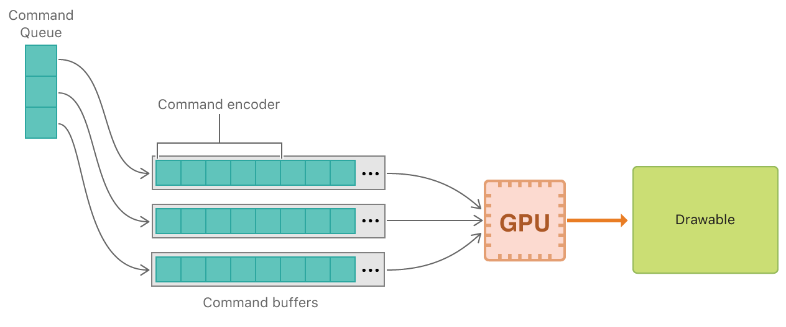

#  Devices and Commands

Demonstrates how to access and interact with the GPU.

演示如何访问 GPU 并与 GPU 交互。

## Overview

> Metal provides low-level, low-overhead access to the graphics processing unit (GPU) of a user’s device, resulting in great apps that use the GPU efficiently. The key to developing such an app is understanding the underlying software and hardware interactions holistically.
>
> In this sample, you’ll learn how to write an app that uses Metal and issues basic rendering commands to the GPU. In particular, you’ll learn how to obtain a Metal device, configure a MetalKit view, create and execute GPU commands, and display rendered content.

Metal 提供对用户设备的图形处理单元（ GPU ）的低级别，低开销访问，从而产生了可有效使用 GPU 的优秀应用程序。开发此类应用程序的关键是从整体上理解底层软件和硬件交互。

在此示例中，你将学习如何编写使用 Metal 的应用程序并向 GPU 发出基本渲染命令。特别是，你将学习如何获取 Metal 设备，配置 MetalKit 视图，创建和执行 GPU 命令以及显示渲染内容。

## The Metal and MetalKit Frameworks

> The sample uses two frameworks to display rendered content: Metal and MetalKit. Metal provides access to the GPU, and MetalKit provides common utilities that make it easier to develop a Metal app. Together they seamlessly integrate with the OS and with other frameworks, so you can focus on GPU programming.
>
> One of MetalKit’s most useful features is the MTKView class, which wraps UIView or NSView objects and configures Metal-specific Core Animation functionality. In particular, a MetalKit view automatically sets up and manages a continuous rendering loop that provides you with a 2D, displayable resource, commonly known as a drawable, for each frame.
>
> Note - You can use Core Animation directly to develop a Metal app, but it’s easier, faster, and more convenient to use MetalKit.

该示例使用两个框架来显示渲染的内容：Metal 和 MetalKit 。Metal 提供对 GPU 的访问，MetalKit 提供了常用的实用程序，可以更轻松地开发 Metal 应用程序。它们与操作系统和其他框架无缝集成，因此你可以专注于 GPU 编程。

MetalKit 最有用的功能之一是 MTKView 类，它包装 UIView 或 NSView 对象并配置特定于 Metal 的 Core Animation 功能。特别是，MetalKit 视图自动设置和管理连续渲染循环，为每帧提供 2D 可显示资源，通常称为可绘制资源。

注意 - 你可以直接使用 Core Animation 开发 Metal 应用程序，但使用 MetalKit 更容易，更快捷，更方便。

## Separate Your Rendering Loop

> When developing a Metal app, it’s often useful to separate your rendering loop into its own class. Using a separate class, you can better manage your initial Metal setup code and per-frame Metal commands. This common architecture is demonstrated by the DevicesAndCommandsRenderer class, which is initialized with a MetalKit view and is assigned as the view’s delegate.

在开发 Metal 应用程序时，将渲染循环分离到自己的类中通常很有用。使用单独的类，你可以更好地管理初始 Metal 设置代码和每帧 Metal 命令。这个通用体系结构由 DevicesAndCommandsRenderer 类演示，该类使用 MetalKit 视图初始化并被指定为该视图的委托。

```objc
_renderer = [[DevicesAndCommandsRenderer alloc] initWithMetalKitView:_view];

if(!_renderer)
{
    NSLog(@"Renderer failed initialization");
    return;
}

_view.delegate = _renderer;
```

## Respond to View Events

> A MTKViewDelegate object implements the mtkView:drawableSizeWillChange: and drawInMTKView: methods. These methods notify your renderer of the MetalKit view’s resizing and drawing events.
>
> - The view calls the mtkView:drawableSizeWillChange: method whenever the window size changes (macOS) or a relayout operation, such as a device orientation change, occurs (iOS and tvOS). You can then respond to the new size of the view and change your rendering resolution, if necessary.
>
> - The view calls the drawInMTKView: method whenever it’s time to render a new frame, as specified by the frame rate (for example, 60 FPS) set on the view’s preferredFramesPerSecond property. This callback is typically the main event that begins the execution of your rendering loop.

MTKViewDelegate 对象实现 mtkView:drawableSizeWillChange: 和 drawInMTKView: 方法。这些方法通知渲染器 MetalKit 视图的大小调整和绘图事件。

- 每当窗口大小发生变化（ macOS ）或重新布局操作发生（ iOS 和 tvOS 设备方向改变）时，视图都会调用 mtkView:drawableSizeWillChange: 方法。然后，你可以根据需要响应视图的新大小并更改渲染分辨率。

- 每当需要渲染新帧时，视图都会调用 drawInMTKView: 方法，这是由视图的 preferredFramesPerSecond 属性决定的帧率（例如，60 FPS ）指定的。此回调通常是开始执行渲染循环的主要事件。

## Metal Command Objects

> A MTLDevice object represents a GPU. Typically, you call the MTLCreateSystemDefaultDevice() method to obtain a single MTLDevice object that represents the default GPU of a device. A MTLDevice object provides information about a GPU, but its main purpose is to create other objects that can interact with the GPU.
>
> The first object all apps need to interact with the GPU is a MTLCommandQueue object.

MTLDevice 对象表示 GPU 。通常，你调用 MTLCreateSystemDefaultDevice() 方法以获取表示设备的默认 GPU 的单个 MTLDevice 对象。MTLDevice 对象提供有关 GPU 的信息，但其主要目的是创建可与 GPU 交互的其他对象。

所有应用程序需要与 GPU 交互的第一个对象是 MTLCommandQueue 对象。

```objc
_commandQueue = [_device newCommandQueue];
```

> You use a MTLCommandQueue object to create and organize MTLCommandBuffer objects, ensuring that they’re sent to the GPU in the correct order.
>
> For every frame, a new MTLCommandBuffer object is created and filled with commands that are executed by the GPU.

你使用 MTLCommandQueue 对象来创建和组织 MTLCommandBuffer 对象，确保它们以正确的顺序发送到 GPU 。

对于每帧，创建一个新的 MTLCommandBuffer 对象并填充由 GPU 执行的命令。

```objc
id<MTLCommandBuffer> commandBuffer = [_commandQueue commandBuffer];
```

> There are many different types of GPUs, each accepting and interpreting commands in their own unique way. A MTLCommandBuffer object coalesces these commands into a single submission, but they must first be encoded in a device-agnostic way using a MTLCommandEncoder object. There are a few different types of MTLCommandEncoder classes, each used to execute different types of tasks on the GPU. This sample demonstrates the use of a MTLRenderCommandEncoder subclass, which specifically encodes rendering commands into a command buffer.
>
> This sample uses a MTLRenderCommandEncoder object to encode GPU commands that render pixels to the MetalKit view’s drawable. To do so, the render command encoder must be specifically associated with this drawable.
>
> To create a MTLRenderCommandEncoder object, you must first create a MTLRenderPassDescriptor object. A MTLRenderPassDescriptor is a lightweight, temporary object with a number of configurable properties that are used by an existing MTLCommandBuffer object to create a new MTLRenderCommandEncoder object. Afterward, the MTLRenderPassDescriptor object is no longer needed.
>
> The following diagram illustrates the relationship between Metal’s command objects. To summarize:
>
> 1. Command buffers are created from a command queue
>
> 2. Command encoders encode commands into command buffers
>
> 3. Command buffers are then committed and sent to the GPU
>
> 4. The GPU executes the commands and renders the results to a drawable

有许多不同类型的 GPU ，每个 GPU 都以自己独特的方式接受和解释命令。MTLCommandBuffer 对象将这些命令合并为单个提交，但必须首先使用 MTLCommandEncoder 对象以与设备无关的方式对它们进行编码。有几种不同类型的 MTLCommandEncoder 类，每种类型用于执行 GPU 上不同类型的任务。此示例演示了如何使用 MTLRenderCommandEncoder 子类，该子类专门将渲染命令编码到命令缓冲区中。

此示例使用 MTLRenderCommandEncoder 对象对 GPU 命令进行编码，这些命令将像素渲染到 MetalKit 视图的 drawable 。为此，渲染命令编码器必须与此 drawable 关联在一起。

要创建 MTLRenderCommandEncoder 对象，必须首先创建 MTLRenderPassDescriptor 对象。MTLRenderPassDescriptor 是一个轻量级临时对象，具有许多可配置属性，已有的 MTLCommandBuffer 对象使用这些属性来创建新的 MTLRenderCommandEncoder 对象。之后，MTLRenderPassDescriptor 对象就不再需要了。

下图说明了 Metal 的命令对象之间的关系。总结一下：

1. 命令缓冲区是从命令队列创建的

2. 命令编码器将命令编码到命令缓冲区中

3. 然后命令缓冲区被提交并发送到 GPU

4. GPU 执行命令并渲染结果到 drawable



## Prepare a Frame

> A MetalKit view creates a new MTLRenderPassDescriptor object for every frame, provided via the currentRenderPassDescriptor property. This render pass descriptor is preconfigured with view-specific properties, some derived from the view’s drawable, and can be used to easily and conveniently create a new MTLRenderCommandEncoder object.

MetalKit 视图为每帧创建一个新的 MTLRenderPassDescriptor 对象，通过 currentRenderPassDescriptor 属性提供。此渲染过程描述符预先配置了特定于视图的属性，一些属性派生自视图的 drawable ，可用于轻松方便地创建新的 MTLRenderCommandEncoder 对象。

```objc
// Obtain a render pass descriptor, generated from the view's drawable
MTLRenderPassDescriptor *renderPassDescriptor = view.currentRenderPassDescriptor;

// If you've successfully obtained a render pass descriptor, you can render to
// the drawable; otherwise you skip any rendering this frame because you have no
// drawable to draw to
if(renderPassDescriptor != nil)
{
    id<MTLRenderCommandEncoder> renderEncoder = [commandBuffer renderCommandEncoderWithDescriptor:renderPassDescriptor];
```

> Commands encoded into this MTLRenderCommandEncoder object render to the view’s drawable. By default, creating a MTLRenderCommandEncoder object implicitly encodes a clear command that the GPU executes before any other rendering commands. The clear command sets the drawable’s pixels to a clear color that’s updated at the start of the rendering loop.

编码到此 MTLRenderCommandEncoder 对象中的命令渲染到视图的 drawable 。默认情况下，创建 MTLRenderCommandEncoder 对象会隐式编码一条 clear 命令，GPU 会在任何其他渲染命令执行之前执行该命令。clear 命令将 drawable 的像素设置为 clear 颜色，该颜色在渲染循环开始时更新。

```objc
Color color = [self makeFancyColor];
view.clearColor = MTLClearColorMake(color.red, color.green, color.blue, color.alpha);
```

## Finalize a Frame

> Typically, Metal apps call many MTLRenderCommandEncoder methods that encode explicit rendering commands into a command buffer. For simplicity, this sample doesn’t actually encode explicit rendering commands; only the implicit clear command is encoded. After creating the MTLRenderCommandEncoder object, the sample simply calls the endEncoding method to indicate that the encoder is finalized.
>
> When the encoder is finalized, the command buffer accepts two final commands: present and commit.
>
> Because the GPU doesn’t draw directly to the screen, it’s prevented from drawing pixels before it has finished executing commands. To avoid a poor user experience resulting from incomplete drawables, you call the presentDrawable: method. This method tells Metal to wait for the GPU to finish rendering to a drawable before presenting it onscreen.

通常，Metal 应用程序调用很多 MTLRenderCommandEncoder 方法，这些方法将显式渲染命令编码到命令缓冲区中。为简单起见，此示例实际上不编码显式渲染命令；只有隐式清除命令被编码。创建 MTLRenderCommandEncoder 对象后，该示例只调用了 endEncoding 方法以指示编码器已完成。

编码器完成后，命令缓冲区接收两个最终命令：present 和 commit 。

由于 GPU 不直接绘制到屏幕上，因此在完成执行命令之前无法绘制像素。为避免因不完整的 drawable 导致的糟糕用户体验，请调用 presentDrawable: 方法。此方法告诉 Metal 在屏幕上显示 drawable 之前等待 GPU 完成对 drawable 的渲染。

```objc
[commandBuffer presentDrawable:view.currentDrawable];
```

> The GPU also doesn’t execute commands immediately. Calls to a MTLRenderCommandEncoder or MTLCommandBuffer object are executed only after the commit method is called. Metal then schedules the command buffer for execution. When the GPU begins execution, the drawable is cleared with a new color. When the GPU completes execution, the rendered drawable is presented onscreen.

GPU 也不会立即执行命令。只有在调用 commit 方法后才会执行对 MTLRenderCommandEncoder 或 MTLCommandBuffer 对象的调用。然后，Metal 会调度命令缓冲区以供执行。GPU 开始执行时，将使用新颜色清除 drawable 。GPU 完成执行后，经过渲染的 drawable 被呈现在屏幕上。

```objc
[commandBuffer commit];
```

## Next Steps

> In this sample, you learned how to write an app that uses Metal and issues basic rendering commands to the GPU.
>
> In the [Hello Triangle](https://developer.apple.com/documentation/metal/hello_triangle?language=objc) sample, you’ll learn how to render basic geometry in Metal.

在此示例中，你学习了如何编写使用 Metal 的应用程序以及如何向 GPU 发出基本渲染命令。

在 [Hello Triangle](https://developer.apple.com/documentation/metal/hello_triangle?language=objc) 示例中，你将学习如何在 Metal 中渲染基本几何体。
