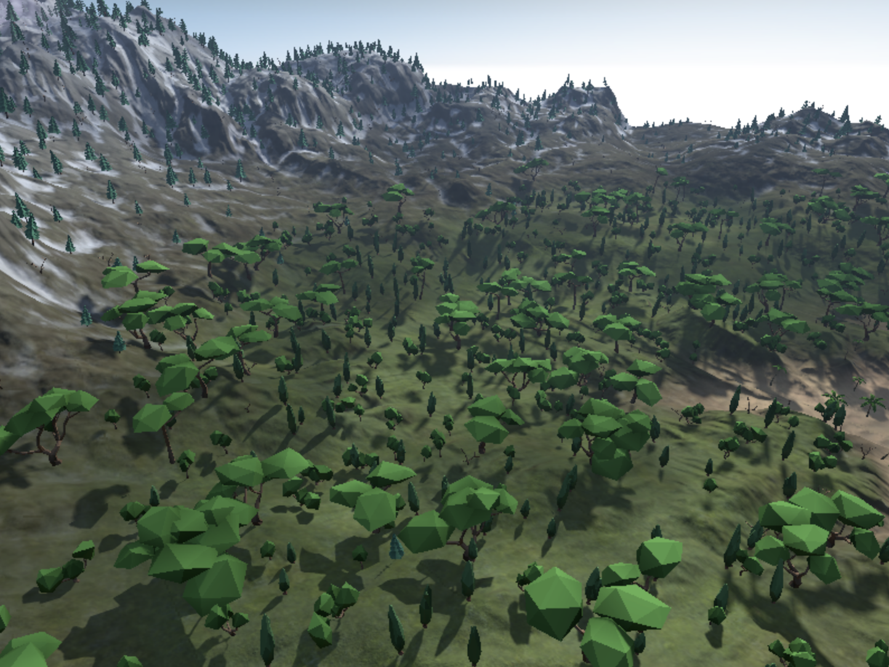

#  Dynamic Terrain with Argument Buffers

> Demonstrates how to use argument buffers to render a dynamic terrain in real time with a GPU-driven pipeline.

演示如何使用参数缓冲区通过 GPU 驱动的管道实时渲染动态地形。

## Overview

> This sample demonstrates dynamic terrain generation on an outdoor landscape, using argument buffers to select terrain materials, vegetation geometry, and particle effects within a GPU-driven pipeline. The sample creates a landscape with visually distinct areas, called habitats, that differ based on the land’s elevation. These are the habitats in the sample, ordered from highest to lowest elevation:
>
> - Snow
>
> - Rock
>
> - Grass
>
> - Sand

此示例演示了室外景观的动态地形生成，使用参数缓冲区在 GPU 驱动的管道中选择地形材质，植被几何体和粒子效果。该样本创建了一个具有视觉上不同区域的景观，称为栖息地，根据土地的海拔不同而不同。这些是示例中的栖息地，从最高海拔到最低海拔排序：

- 雪

- 岩石

- 草

- 砂



> Note - This sample uses argument buffers to avoid the CPU overhead of equivalent features that require commands to be individually encoded and issued on the CPU. For an introduction to argument buffers, see the samples listed in Argument Buffers.

注意 - 此示例使用参数缓冲区来避免需要在 CPU 上单独编码和发出命令的等效功能的 CPU 开销。有关参数缓冲区的介绍，请参阅 Argument Buffers 中列出的示例。

## Respond to Landscape Alterations

> The initial topology of the landscape is determined by a static height map, TerrainHeightMap.png.

景观的初始拓扑由静态高度图 Terrain HeightMap.png 确定。

```objc
_targetHeightmap = CreateTextureWithDevice (device, @"Textures/TerrainHeightMap.png", false, false);
```

> At run time, as you alter the landscape with the provided controls, the sample evaluates the latest topology to determine whether a new habitat should be applied to a new land elevation. If so, the sample updates the argument buffer corresponding to the land with the correct materials and vegetation geometry for the new habitat. The sample renders this new habitat by passing the land elevation value to the EvaluateTerrainAtLocation function.

在运行时，当你使用提供的控件更改格局时，样本会评估最新的拓扑，以确定是否应将新的栖息地应用于新的陆地海拔。如果是这样，样本将更新土地对应的参数缓冲区，其中包含新栖息地的正确材料和植被几何形状。该示例通过将陆地海拔值传递给 EvaluateTerrainAtLocation 函数来渲染此新栖息地。

```objc
static void EvaluateTerrainAtLocation(float2 uv,
float3 worldPosition,
texture2d<float> heightMap,
texture2d<float> normalMap,
texture2d<float> propertiesMap,
constant const TerrainParams& terrainParams,
thread float outHabitat[TerrainHabitatTypeCOUNT],
thread float3 &outNormal)
```

## Define an Argument Buffer for Terrain Habitats

> The sample defines a custom argument buffer structure, TerrainHabitat, that defines the elements of a terrain habitat.

该示例定义了一个自定义参数缓冲区结构 TerrainHabitat ，它定义了地形栖息地的元素。

```objc
struct TerrainHabitat
{
#ifndef METAL
    // This struct should not be instantiated in C++ because it contains textures that aren't visible on the CPU
private:
    TerrainHabitat ();
public:
#endif

    float slopeStrength      IAB_INDEX(TerrainHabitat_MemberIds::slopeStrength);
    float slopeThreshold     IAB_INDEX(TerrainHabitat_MemberIds::slopeThreshold);
    float elevationStrength  IAB_INDEX(TerrainHabitat_MemberIds::elevationStrength);
    float elevationThreshold IAB_INDEX(TerrainHabitat_MemberIds::elevationThreshold);
    float specularPower      IAB_INDEX(TerrainHabitat_MemberIds::specularPower);
    float textureScale       IAB_INDEX(TerrainHabitat_MemberIds::textureScale);
    bool  flipNormal         IAB_INDEX(TerrainHabitat_MemberIds::flipNormal);

struct ParticleProperties
{
    // The fields of this struct must be reflected in TerrainHabitat_MemberIds
    simd::float4    keyTimePoints;
    simd::float4    scaleFactors;
    simd::float4    alphaFactors;
    simd::float4    gravity;
    simd::float4    lightingCoefficients;
    int             doesCollide;
    int             doesRotate;
    int             castShadows;
    int             distanceDependent;
} particleProperties;

#ifdef METAL
    texture2d_array <float,access::sample> diffSpecTextureArray IAB_INDEX(TerrainHabitat_MemberIds::diffSpecTextureArray);
    texture2d_array <float,access::sample> normalTextureArray   IAB_INDEX(TerrainHabitat_MemberIds::normalTextureArray);
#endif
};
```

> Among these elements, elevationStrength and elevationThreshold determine the elevation range in which the habitat is active. Additionally, diffSpecTextureArray and normalTextureArray determine the textures used to render the habitat.
>
> TerrainHabitat is nested within another argument buffer, TerrainParams, that provides a number of slight visual variations for added realism.

在这些元素中，elevationStrength 和 elevationThreshold 确定栖息地活跃的海拔范围。此外，diffSpecTextureArray 和 normalTextureArray 确定用于渲染栖息地的纹理。

TerrainHabitat 嵌套在另一个参数缓冲区 TerrainParams 中，它提供了许多轻微的视觉变化以增加真实感。

```objc
struct TerrainParams
{
    TerrainHabitat habitats [TerrainHabitatTypeCOUNT];
    float ambientOcclusionScale    IAB_INDEX(TerrainParams_MemberIds::ambientOcclusionScale);
    float ambientOcclusionContrast IAB_INDEX(TerrainParams_MemberIds::ambientOcclusionContrast);
    float ambientLightScale        IAB_INDEX(TerrainParams_MemberIds::ambientLightScale);
    float atmosphereScale          IAB_INDEX(TerrainParams_MemberIds::atmosphereScale);
};
```

> TerrainHabitat is the specific argument buffer definition for a terrain habitat. However, because this definition is nested within TerrainParams, the TerrainParams objects are the ones passed along the GPU pipeline.

TerrainHabitat 是地形栖息地的特定参数缓冲区定义。但是，由于此定义嵌套在 TerrainParams 中，因此 TerrainParams 对象是沿 GPU 管道传递的对象。

## Render Terrain

> The sample provides the GPU with the textures corresponding to various habitats. First, the sample calls the useResource:usage: method to indicate which textures are used by the GPU.

该示例为 GPU 提供了与各种栖息地相对应的纹理。首先，该示例调用 useResource:usage: 方法来指示 GPU 使用哪些纹理。

```objc
for (int i = 0; i < _terrainTextures.size(); i++)
{
    [renderEncoder useResource: _terrainTextures[i].diffSpecTextureArray
    usage: MTLResourceUsageSample | MTLResourceUsageRead];
    [renderEncoder useResource: _terrainTextures[i].normalTextureArray
    usage: MTLResourceUsageSample | MTLResourceUsageRead];
}
```

> Then, the sample calls the setFragmentBuffer:offset:atIndex: method to set the argument buffer, terrainParamsBuffer, that contains those textures.

然后，该示例调用 setFragmentBuffer:offset:atIndex: 方法来设置包含这些纹理的参数缓冲区 terrainParamsBuffer 。

```objc
[renderEncoder setFragmentBuffer:_terrainParamsBuffer offset:0 atIndex:_iabBufferIndex_PplTerrainMainView];
```

> The sample accesses the argument buffer in the fragment function, terrain_fragment, to output the correct material for the terrain. First, the sample passes the mat parameter into the fragment function.

该示例在片段函数 terrain_fragment 内访问参数缓冲区，以输出地形的正确材质。首先，示例将 mat 参数传递给片段函数。

```objc
fragment GBufferFragOut terrain_fragment (
const TerrainVertexOut in [[stage_in]],
constant TerrainParams & mat [[buffer(1)]],
constant AAPLUniforms& globalUniforms [[buffer(2)]],
texture2d<float> heightMap [[texture(0)]],
texture2d<float> normalMap [[texture(1)]],
texture2d<float> propertiesMap [[texture(2)]]
)
```

> Then, the sample passes the current land elevation into the EvaluateTerrainAtLocation function, where the fragment samples the texture corresponding to that elevation.

然后，样本将当前土地海拔传递到 EvaluateTerrainAtLocation 函数，在该函数中片段在该海拔对应的纹理上进行采样。

```objc
BrdfProperties curSubLayerBrdf = sample_brdf (
mat.habitats [curLayerIdx].diffSpecTextureArray,
mat.habitats [curLayerIdx].normalTextureArray,
curSubLayerIdx,
mat.habitats [curLayerIdx].textureScale,
mat.habitats [curLayerIdx].specularPower,
mat.habitats [curLayerIdx].flipNormal,
in.worldPosition,
normal,
tangent,
bitangent );
```

## Render Vegetation

> The sample passes the terrainParamsBuffer argument buffer to the vegetation render pass via an instance of AAPLTerrainRenderer. This data determines which type of vegetation to render at a given location. First, the sample calls the setBuffer:offset:atIndex: method to set the argument buffer for the vegetation render pass.

该示例通过 AAPLTerrainRenderer 实例将 terrainParamsBuffer 参数缓冲区传递给植被渲染过程。此数据确定在给定位置呈现的植被类型。首先，该示例调用 setBuffer:offset:atIndex: 方法为植被渲染过程设置参数缓冲区。

```objc
[computeEncoder setBuffer:terrain.terrainParamsBuffer offset:0 atIndex:3];
```

> Then, the sample passes the argument buffer into the EvaluateTerrainAtLocation function, which outputs a habitatPercentages value:

然后，示例将参数缓冲区传递给 EvaluateTerrainAtLocation 函数，该函数输出 habitatPercentages 值：

```objc
EvaluateTerrainAtLocation(uv_pos, world_pos, heightMap,
normalMap, propertiesMap, terrainParams,
habitatPercentages,
worldNormal);
```

> The habitat percentages are processed to select a specific index into the vegetation geometries, determined by the value of pop_idx:

对 habitat percentages 经过处理后，由 pop_idx 值决定在植被几何中选取一个特定的索引：

```objc
pop_idx = rules[rule_index].populationStartIndex + uint((s / rules[rule_index].densityInHabitat * float(rules[rule_index].populationIndexCount)));
```

> Finally, the sample uses this population index to render an instance of a particular vegetation geometry onto the landscape:

最后，该示例使用此 population 索引在景观上渲染特定植被几何的实例：

```objc
vegetationSpawnInstance(pop_idx, world_matrix, float4(world_pos, radius), globalUniforms, instances, indirect);
```

## Render Particles

> The sample passes the terrainParamsBuffer argument buffer to the particle render pass via an instance of AAPLTerrainRenderer. This data determines which type of particles to render at a given location. First, the sample calls the setBuffer:offset:atIndex: method to set the argument buffer for the particles render pass.

该示例通过 AAPLTerrainRenderer 实例将 terrainParamsBuffer 参数缓冲区传递给粒子渲染过程。此数据确定在给定位置呈现的粒子类型。首先，该示例调用 setBuffer:offset:atIndex: 方法为粒子渲染过程设置参数缓冲区。

```objc
[enc setBuffer:[terrain terrainParamsBuffer] offset:0 atIndex:14];
```

> Then, the sample checks the relative percentages of habitat coverage in the altered landscape with the EvaluateTerrainAtLocation function, where the sample passes the 3D position of the particle.

然后，示例使用 EvaluateTerrainAtLocation 函数检查改变的景观中栖息地覆盖的相对百分比，其中样本传递粒子的 3D 位置。

```objc
EvaluateTerrainAtLocation (mouseUvPos, mouseWorldPos, heightMap,
normalMap, propsMap, terrainParams,
habitatPercentages,
worldNormal);
```

> The sample chooses the appropriate habitat by selecting the terrain with the highest percentage of habitat coverage.

示例通过选择栖息地覆盖率最高的地形来选择适当的栖息地。

```objc
float highestLevel = 0.f;
for (uint i = 0; i < TerrainHabitatTypeCOUNT; i++)
{
    if (habitatPercentages [i] > highestLevel)
    {
        highestLevel = habitatPercentages [i];
        habitatIndex = i;
    }
}
```

> Finally, the particle’s corresponding habitat material is retrieved from the argument buffer and set onto the new particle.

最后，从参数缓冲区中检索粒子的相应栖息地材质并将其设置到新粒子上。

```objc
ParticleData data;
data.habitatIndex = habitatIndex;
data.texture = terrainParams.habitats [habitatIndex].diffSpecTextureArray;
```
