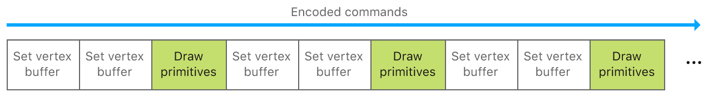
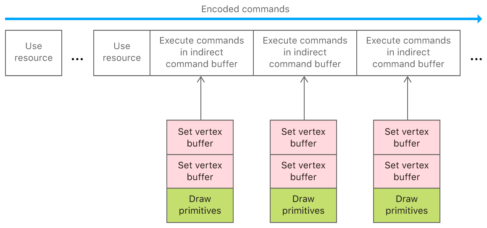
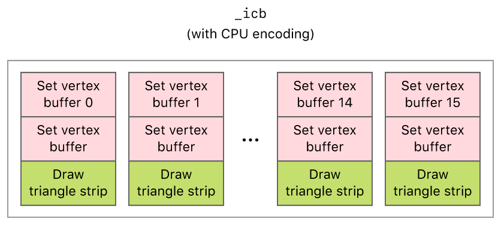

#  Encoding Indirect Command Buffers on the CPU

> Reduce CPU overhead and simplify your command execution by reusing commands.

通过重用命令减少 CPU 开销并简化命令执行。

## Overview

> This sample app provides an introduction to indirect command buffers (ICB), which enable you to store repeated commands for later use. Because Metal discards a normal command buffer and its commands after Metal executes them, use ICBs to save expensive allocation, deallocation, and encoding time for your app’s common instructions. Additionally, you benefit when using ICBs with:
>
> - A reduction in rendering tasks because you execute an ICB with a single call.
>
> - By creating ICBs at initialization, it moves expensive command management out of your app’s critical path at rendering or compute-time.
>
> An example of where ICBs are effective is with a game’s head-up display (HUD), because:
>
> - You render HUDs every frame.
>
> - The appearance of the HUD is usually static across frames.
>
> ICBs are also useful to render static objects in typical 3D scenes. Because encoded commands typically result in lightweight data structures, ICBs are suitable for saving complex draws, too.
>
> This sample demonstrates how to set up an ICB to repeatedly render a series of shapes. While it’s possible to gain even more instruction-parallelism by encoding the ICB on the GPU, this sample encodes an ICB on the CPU for simplicity. See [Encoding Indirect Command Buffers on the GPU](https://developer.apple.com/documentation/metal/advanced_command_setup/encoding_indirect_command_buffers_on_the_gpu?language=objc) for the more advanced usage.

此示例应用程序提供了间接命令缓冲区（ ICB ）的介绍，使你可以存储重复的命令供以后使用。由于 Metal 会丢弃正常的命令缓冲区及其命令，在 Metal 执行它们之后，因此使用 ICB 可以为应用程序的常用指令节省昂贵的分配，释放和编码时间。此外，使用 ICB 时你将受益：

- 由于你通过单个调用执行 ICB ，因此减少了渲染任务。

- 通过在初始化时创建 ICB ，它可以在渲染或计算时将昂贵的命令管理从应用程序的关键路径移除。

ICB 有效的一个例子是游戏的平视显示器（ HUD ），因为：

- 每帧都渲染 HUD 。

- HUD 的显示在不同的帧之间通常是静态的。

ICB 对于典型 3D 场景中静态对象的渲染也很有用。由于编码命令通常会产生轻量级数据结构，因此 ICB 也适用于保存复杂的绘制。

此示例演示如何设置 ICB 以重复渲染一系列形状。虽然通过在 GPU 上编码 ICB 可以获得更大的指令并行性，但为了简单起见，此示例在 CPU 上对 ICB 进行编码。见 [Encoding Indirect Command Buffers on the GPU](https://developer.apple.com/documentation/metal/advanced_command_setup/encoding_indirect_command_buffers_on_the_gpu?language=objc) 以获得更高级的用法。

## Individual Commands Versus Indirect Command Buffers

> Metal apps, particularly games, typically contain multiple render commands, each associated with a set of render states, buffers, and draw calls. To execute these commands for a render pass, apps first encode them into a render command encoder within a command buffer.
>
> You encode individual commands into a render command encoder by calling MTLRenderCommandEncoder methods such as setVertexBuffer:offset:atIndex: or drawPrimitives:vertexStart:vertexCount:vertexCount:instanceCount:baseInstance:.

Metal 应用程序，尤其是游戏，通常包含多个渲染命令，每个命令都与一组渲染状态，缓冲区和绘制调用相关联。要为渲染过程执行这些命令，应用程序首先将它们编码为命令缓冲区内的渲染命令编码器。

可以通过调用 MTLRenderCommandEncoder 方法（例如 setVertexBuffer:offset:atIndex: 或 drawPrimitives:vertexStart:vertexCount:vertexCount:instanceCount:baseInstance: ）将单个命令编码为到渲染命令编码器中。



> Recreating draws that were equivalent to ones you did in a previous queue can be tedious from a coding perspective and non-performant at runtime. Instead, move your repeated draws and their data buffers into an MTLIndirectCommandBuffer object using MTLIndirectRenderCommand, thereby filling the ICB with commands. When you’re ready to use the ICB, encode individual executions of it by calling MTLRenderCommandEnoder’s executeCommandsInBuffer:withRange:.

重新创建与在先前队列中创建的绘制相同的绘制从编码角度来看可能很乏味，并且运行时也是低性能的。相反，使用 MTLIndirectRenderCommand 将重复的绘制及其数据缓冲区移动到 MTLIndirectCommandBuffer 对象中并用命令填充它。当你准备好 ICB 的使用时，通过调用 MTLRenderCommandEnoder 的 executeCommandsInBuffer:withRange: 来编码它的单独执行。



> Note - To access individual buffers referenced by an indirect command buffer, you must call the useResource:usage: method for each buffer that you want to use. For more information, see the “Execute an Indirect Command Buffer” section.

注意 - 要访问间接命令缓冲区引用的个别缓冲区，对于想要使用的每个缓冲区必须调用 useResource:usage: 方法。有关更多信息，请参阅“执行间接命令缓冲区”部分。

## Define Render Commands and Inherited Render State

> For the indirect command buffer, _indirectCommandBuffer, the sample defines render commands that:
>
> 1. Set a vertex buffer using unique vertex data for each mesh
>
> 2. Set another vertex buffer using common transformation data for all meshes
>
> 3. Set another vertex buffer containing an array of parameters for each mesh
>
> 4. Draw the mesh’s triangles
>
> The sample encodes these commands differently for the CPU or the GPU. However, these commands are still encoded into both versions of the indirect command buffer.
>
> The sample also allows _indirectCommandBuffer to inherit the render pipeline state from its parent encoder, renderEncoder. Furthermore, _indirectCommandBuffer implicitly inherits any render state that can’t be encoded into it, such as the cull mode and depth or stencil state for the render pass.

对于间接命令缓冲区 _indirectCommandBuffer ，该示例定义了以下渲染命令：

1. 使用每个 mesh 的独特顶点数据设置顶点缓冲区

2. 使用所有 mesh 的公共转换数据设置另一个顶点缓冲区

3. 设置另一个顶点缓冲区，其中包含每个 mesh 的参数数组

4. 绘制 mesh 三角形

该示例针对 CPU 或 GPU 以不同方式编码这些命令。然而，这些命令仍然被编码到间接命令缓冲区的两个版本中。

该示例还允许 _indirectCommandBuffer 从其父编码器 renderEncoder 继承渲染管道状态。此外， _indirectCommandBuffer 隐式继承任何无法编码到其中的渲染状态，例如渲染过程的剔除模式和深度或模板状态。

## Create an Indirect Command Buffer

> The sample creates _indirectCommandBuffer from a MTLIndirectCommandBufferDescriptor, which defines the features and limits of an indirect command buffer.

该示例从 MTLIndirectCommandBufferDescriptor 创建 _indirectCommandBuffer ，该描述符定义了间接命令缓冲区的功能和限制。

```objc
MTLIndirectCommandBufferDescriptor* icbDescriptor = [MTLIndirectCommandBufferDescriptor new];

// Indicate that the only draw commands will be standard (non-indexed) draw commands.
icbDescriptor.commandTypes = MTLIndirectCommandTypeDraw;

// Indicate that buffers will be set for each command IN the indirect command buffer.
icbDescriptor.inheritBuffers = NO;

// Indicate that a max of 3 buffers will be set for each command.
icbDescriptor.maxVertexBufferBindCount = 3;
icbDescriptor.maxFragmentBufferBindCount = 0;

_indirectCommandBuffer = [_device newIndirectCommandBufferWithDescriptor:icbDescriptor
maxCommandCount:AAPLNumObjects
options:0];
```

> The sample specifies the types of commands, commandTypes, and the maximum number of commands, maxCount, so that Metal reserves enough space in memory for the sample to encode _indirectCommandBuffer successfully (with the CPU or GPU).

该示例指定命令的类型，commandTypes 和最大命令数 maxCount ，以便 Metal 在内存中保留足够的空间来成功编码 _indirectCommandBuffer（使用 CPU 或 GPU ）。

## Encode an Indirect Command Buffer with the CPU

> From the CPU, the sample encodes commands into _indirectCommandBuffer with a MTLIndirectRenderCommand object. For each shape to be rendered, the sample encodes two setVertexBuffer:offset:atIndex: commands and one drawPrimitives:vertexStart:vertexCount:instanceCount:baseInstance: command.

在 CPU 侧，示例使用 MTLIndirectRenderCommand 对象将命令编码到 _indirectCommandBuffer 中。对于要渲染的每个形状，示例编码了两个 setVertexBuffer:offset:atIndex: 命令和一个 drawPrimitives:vertexStart:vertexCount:instanceCount:baseInstance: 命令。

```objc
//  Encode a draw command for each object drawn in the indirect command buffer.
for (int objIndex = 0; objIndex < AAPLNumObjects; objIndex++)
{
    id<MTLIndirectRenderCommand> ICBCommand =
        [_indirectCommandBuffer indirectRenderCommandAtIndex:objIndex];

    [ICBCommand setVertexBuffer:_vertexBuffer[objIndex]
        offset:0
        atIndex:AAPLVertexBufferIndexVertices];

    [ICBCommand setVertexBuffer:_indirectFrameStateBuffer
        offset:0
        atIndex:AAPLVertexBufferIndexFrameState];

    [ICBCommand setVertexBuffer:_objectParameters
        offset:0
        atIndex:AAPLVertexBufferIndexObjectParams];

    const NSUInteger vertexCount = _vertexBuffer[objIndex].length/sizeof(AAPLVertex);

    [ICBCommand drawPrimitives:MTLPrimitiveTypeTriangle
        vertexStart:0
        vertexCount:vertexCount
        instanceCount:1
        baseInstance:objIndex];
}
```

> The sample performs this encoding only once, before encoding any subsequent render commands. _indirectCommandBuffer contains a total of 16 draw calls, one for each shape to be rendered. Each draw call references the same transformation data, _uniformBuffers, but different vertex data, _vertexBuffers[indx]. Although the CPU encodes data only once, the sample issues 16 draw calls per frame.

在对任何后续渲染命令进行编码之前，该示例仅执行此编码一次。_indirectCommandBuffer 总共包含 16 个绘制调用，每个绘制调用对应一个要渲染的形状。每个绘制调用引用相同的转换数据 _uniformBuffers ，但不同的顶点数据 _vertexBuffers[indx] 。 尽管 CPU 仅对数据进行一次编码，但该示例每帧都会发出 16 次绘制调用。



## Update the Data Used by an ICB

> To update data that’s fed to the GPU, you typically cycle through a set of buffers such that the CPU updates one while the GPU reads another (see [CPU and GPU Synchronization](https://developer.apple.com/documentation/metal/advanced_command_setup/cpu_and_gpu_synchronization?language=objc)). You can’t apply that pattern literally with ICBs, however, because you can’t update an ICB’s buffer set after you encode its commands, but you follow a two-step process to blit data updates from the CPU. First, update a single buffer in your dynamic buffer array on the CPU:

要更新提供给 GPU 的数据，通常会循环访问一组缓冲区，以便在 GPU 读取一个缓冲区时 CPU 更新另一个缓冲区（见 [CPU and GPU Synchronization](https://developer.apple.com/documentation/metal/advanced_command_setup/cpu_and_gpu_synchronization?language=objc) ）。但是，你不能将该模式与 ICB 一起应用，因为在对命令进行编码后无法更新 ICB 的缓冲区，但是你需要按照两步过程通过 CPU 进行数据更新。首先，更新 CPU 侧动态缓冲区数组中的单个缓冲区：

```objc
_frameNumber++;

_inFlightIndex = _frameNumber % AAPLMaxBuffersInFlight;

AAPLFrameState * frameState = _frameStateBuffer[_inFlightIndex].contents;
```

> Then, blit the CPU-side buffer set to the location that’s accessible to the ICB (see _indirectFrameStateBuffer):

然后，将 CPU 端缓冲区设置为 ICB 可访问的位置（见 _indirectFrameStateBuffer ）：

```objc
/// Encode blit commands to update the buffer holding the frame state.
id<MTLBlitCommandEncoder> blitEncoder = [commandBuffer blitCommandEncoder];

[blitEncoder copyFromBuffer:_frameStateBuffer[_inFlightIndex] sourceOffset:0
toBuffer:_indirectFrameStateBuffer destinationOffset:0
size:_indirectFrameStateBuffer.length];

[blitEncoder endEncoding];
```

## Execute an Indirect Command Buffer

> The sample calls the executeCommandsInBuffer:withRange: method to execute the commands in _indirectCommandBuffer.

该示例调用 executeCommandsInBuffer:withRange: 方法来执行 _indirectCommandBuffer 中的命令。

```objc
// Draw everything in the indirect command buffer.
[renderEncoder executeCommandsInBuffer:_indirectCommandBuffer withRange:NSMakeRange(0, AAPLNumObjects)];
```

> Similar to the arguments in an argument buffer, the sample calls the useResource:usage: method to indicate that the GPU can access the resources within an indirect command buffer.

与参数缓冲区中的参数类似，该示例调用 useResource:usage: 方法以指示 GPU 可以访问间接命令缓冲区中的资源。

```objc
// Make a useResource call for each buffer needed by the indirect command buffer.
for (int i = 0; i < AAPLNumObjects; i++)
{
    [renderEncoder useResource:_vertexBuffer[i] usage:MTLResourceUsageRead];
}

[renderEncoder useResource:_objectParameters usage:MTLResourceUsageRead];

[renderEncoder useResource:_indirectFrameStateBuffer usage:MTLResourceUsageRead];
```

> The sample continues to execute _indirectCommandBuffer each frame.

该示例每帧继续执行 _indirectCommandBuffer 。
