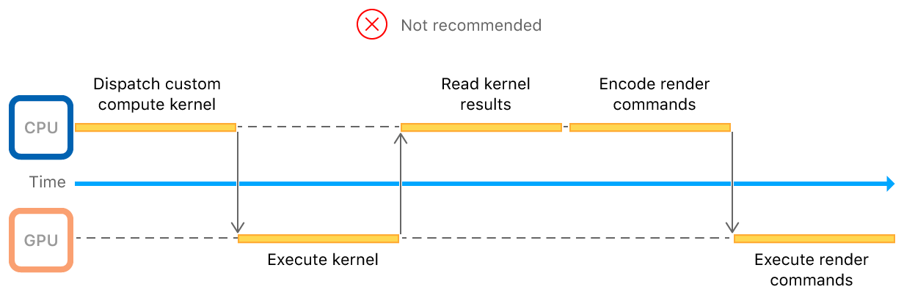

#  Encoding Indirect Command Buffers on the GPU

> Maximize CPU to GPU parallelization by generating render commands on the GPU.

通过在 GPU 上生成渲染命令，最大化 CPU 到 GPU 的并行化。

## Overview

> This sample app demonstrates how to use indirect command buffers (ICB) to issue rendering instructions from the GPU. When you have a rendering algorithm that runs in a compute kernel, use ICBs to generate draw calls based on your algorithm’s results. This sample app uses a compute kernel to cull invisible objects from its rendering submission, thereby generating draw commands for only the objects that are currently visible in the scene.

此示例应用程序演示了如何使用间接命令缓冲区（ ICB ）从 GPU 发出渲染指令。当你有一个在计算内核中运行的渲染算法时，使用 ICB 根据算法的结果生成绘制调用。此示例应用程序使用计算内核从其渲染提交中剔除不可见对象，从而仅为场景中当前可见的对象生成绘图命令。


> Without ICBs, you couldn’t submit rendering commands on the GPU. Instead, the CPU would wait for your compute kernel’s results before generating rendering commands. Then, the GPU would wait for the rendering commands to make it across the CPU to GPU bridge, which amounts to a round trip slow path as seen in the following diagram:

如果没有 ICB ，则无法在 GPU 上提交渲染命令。相反，CPU 会等待计算内核的结果再生成渲染命令。然后，GPU 将等待渲染命令跨越 CPU 到 GPU 之间的桥梁，这相当于往返慢速路径，如下图所示：



> The [Encoding Indirect Command Buffers on the CPU](https://developer.apple.com/documentation/metal/advanced_command_setup/encoding_indirect_command_buffers_on_the_cpu?language=objc) sample code introduces ICBs by creating a single ICB to reuse its commands every frame. So, while the former sample saved expensive command encoding time by reusing commands, this sample uses ICBs to effect a GPU-driven rendering pipeline.

[Encoding Indirect Command Buffers on the CPU](https://developer.apple.com/documentation/metal/advanced_command_setup/encoding_indirect_command_buffers_on_the_cpu?language=objc) 示例代码介绍了通过创建单个 ICB 以便在每帧渲染中重复使用其命令。因此，虽然前一个示例通过重用命令节省了昂贵的命令编码时间，但此示例使用 ICB 来实现 GPU 驱动的渲染管道。

## Define the Data Read by the ICB

> Ideally, you store each mesh in its own buffer but on iOS, kernels running on the GPU are limited to a small number of data buffers they can access per execution. To reduce the number of buffers needed during the ICBs execution, you pack all meshes into a single buffer at varying offsets. Then, use another buffer to store the offset and size of each mesh. The process to do this follows.
>
> At initialization, create the data for each mesh:

理想情况下，将每个 mesh 存储在自己的缓冲区中，但在 iOS 上，GPU 上运行的内核每次执行被限制仅可以访问少量数据缓冲区。要减少 ICB 执行期间所需的缓冲区数量，可以将所有 mesh 打包到单个缓冲区中，那个 mesh 位于不同的偏移处。然后，使用另一个缓冲区来存储每个 mesh 的偏移量和大小。执行此操作的过程如下。

在初始化时，为每个 mesh 创建数据：

```objc
for(int objectIdx = 0; objectIdx < AAPLNumObjects; objectIdx++)
{
    // Choose the parameters to generate a mesh so that each one is unique.
    uint32_t numTeeth = random() % 50 + 3;
    float innerRatio = 0.2 + (random() / (1.0 * RAND_MAX)) * 0.7;
    float toothWidth = 0.1 + (random() / (1.0 * RAND_MAX)) * 0.4;
    float toothSlope = (random() / (1.0 * RAND_MAX)) * 0.2;

    // Create a vertex buffer and initialize it with a unique 2D gear mesh.
    tempMeshes[objectIdx] = [self newGearMeshWithNumTeeth:numTeeth
        innerRatio:innerRatio
        toothWidth:toothWidth
        toothSlope:toothSlope];
}
```

> Count the individual and accumulated mesh sizes and create the container buffer:

计算单个和累积的 mesh 大小并创建容器缓冲区：

```objc
size_t bufferSize = 0;

for(int objectIdx = 0; objectIdx < AAPLNumObjects; objectIdx++)
{
    size_t meshSize = sizeof(AAPLVertex) * tempMeshes[objectIdx].numVerts;
    bufferSize += meshSize;
}

_vertexBuffer = [_device newBufferWithLength:bufferSize options:0];
```

> Finally, insert each mesh into the container buffer while noting its offset and size in the second buffer:

最后，将每个 mesh 插入到容器缓冲区中，同时在第二个缓冲区中记下其偏移量和大小：

```objc
for(int objectIdx = 0; objectIdx < AAPLNumObjects; objectIdx++)
{
    // Store the mesh metadata in the `params` buffer.

    params[objectIdx].numVertices = tempMeshes[objectIdx].numVerts;

    size_t meshSize = sizeof(AAPLVertex) * tempMeshes[objectIdx].numVerts;

    params[objectIdx].startVertex = currentStartVertex;

    // Pack the current mesh data in the combined vertex buffer.

    AAPLVertex* meshStartAddress = ((AAPLVertex*)_vertexBuffer.contents) + currentStartVertex;

    memcpy(meshStartAddress, tempMeshes[objectIdx].vertices, meshSize);

    currentStartVertex += tempMeshes[objectIdx].numVerts;

    free(tempMeshes[objectIdx].vertices);

    // Set the other culling and mesh rendering parameters.

    // Set the position of each object to a unique space in a grid.
    vector_float2 gridPos = (vector_float2){objectIdx % AAPLGridWidth, objectIdx / AAPLGridWidth};
    params[objectIdx].position = gridPos * AAPLObjecDistance;

    params[objectIdx].boundingRadius = AAPLObjectSize / 2.0;
}
```

## Update the Data Read by the ICB Dynamically

> The important techniques shown by this sample not only include issuing draw calls from the GPU, but responding to runtime conditions to execute a select set of draws. By culling non-visible vertices out of the data being fed through the rendering pipeline, you save significant rendering time and effort. To do that, use the same compute kernel that encodes the ICB’s commands to continually update the ICB’s data buffers:

此示例展示的重要技术不仅包括从 GPU 发出绘制调用，还包括响应运行时条件以执行动态选中的一组绘制。通过剔除通过渲染管道输入的数据中的不可见顶点，可以节省大量的渲染时间和精力。为此，使用编码 ICB 命令的相同计算内核来不断更新 ICB 的数据缓冲区：

```objc
// Check whether the object at 'objectIndex' is visible and set draw parameters if so.
//  Otherwise, reset the command so that nothing is done.
kernel void
cullMeshesAndEncodeCommands(uint                          objectIndex   [[ thread_position_in_grid ]],
constant AAPLFrameState      *frame_state   [[ buffer(AAPLKernelBufferIndexFrameState) ]],
device AAPLObjectPerameters  *object_params [[ buffer(AAPLKernelBufferIndexObjectParams)]],
device AAPLVertex            *vertices      [[ buffer(AAPLKernelBufferIndexVertices) ]],
device ICBContainer          *icb_container [[ buffer(AAPLKernelBufferIndexCommandBufferContainer) ]])
{
    float2 worldObjectPostion  = frame_state->translation + object_params[objectIndex].position;
    float2 clipObjectPosition  = frame_state->aspectScale * AAPLViewScale * worldObjectPostion;

    const float rightBounds =  1.0;
    const float leftBounds  = -1.0;
    const float upperBounds =  1.0;
    const float lowerBounds = -1.0;

    bool visible = true;

    // Set the bounding radius in view space.
    const float2 boundingRadius = frame_state->aspectScale * AAPLViewScale * object_params[objectIndex].boundingRadius;

    // Check if the object's bounding circle has moved outside of the view bounds.
    if(clipObjectPosition.x + boundingRadius.x < leftBounds  ||
        clipObjectPosition.x - boundingRadius.x > rightBounds ||
        clipObjectPosition.y + boundingRadius.y < lowerBounds ||
        clipObjectPosition.y - boundingRadius.y > upperBounds)
    {
        visible = false;
    }

    // Get an indirect render commnd object from the ICB given the object's unique index.
    render_command cmd(icb_container->commandBuffer, objectIndex);

    if(visible)
    {
        // Set the buffers and add draw command.
        cmd.set_vertex_buffer(frame_state, AAPLVertexBufferIndexFrameState);
        cmd.set_vertex_buffer(object_params, AAPLVertexBufferIndexObjectParams);
        cmd.set_vertex_buffer(vertices, AAPLVertexBufferIndexVertices);

        cmd.draw_primitives(primitive_type::triangle,
        object_params[objectIndex].startVertex,
        object_params[objectIndex].numVertices, 1,
        objectIndex);
    }
    else
    {
        // Generate an empty command so that the GPU doesn't draw this object.
        cmd.reset();
    }
}
```

> The parallel nature of the GPU partitions the compute task for you, resulting in multiple offscreen meshes getting culled concurrently.

GPU 的并行特性为你划分计算任务，导致多个离屏 mesh 同时被剔除。

## Pass an ICB to a Compute Kernel Using an Argument Buffer

> To get an ICB on the GPU and make it accessible to a compute kernel, you pass it through an argument buffer, as follows:
>
> Define the container argument buffer. It’s a struct that contains one member, the ICB:

要获取 GPU 上的 ICB 并使其可供计算内核访问，通过参数缓冲区来传递该 ICB，如下所示：

定义容器参数缓冲区。它是一个包含一个成员 ICB 的结构：

```objc
// This is the argument buffer that contains the ICB.
typedef struct ICBContainer
{
    command_buffer commandBuffer [[ id(AAPLArgumentBufferIDCommandBuffer) ]];
} ICBContainer;
```

> Encode the ICB into the argument buffer:

将 ICB 编码到参数缓冲区中：

```objc
id<MTLArgumentEncoder> argumentEncoder =
[GPUCommandEncodingKernel newArgumentEncoderWithBufferIndex:AAPLKernelBufferIndexCommandBufferContainer];

_icbArgumentBuffer = [_device newBufferWithLength:argumentEncoder.encodedLength
options:MTLResourceStorageModeShared];

[argumentEncoder setArgumentBuffer:_icbArgumentBuffer offset:0];

[argumentEncoder setIndirectCommandBuffer:_indirectCommandBuffer
atIndex:AAPLArgumentBufferIDCommandBuffer];
```

> Pass the ICB (_indirectCommandBuffer) to the kernel by setting the argument buffer on to the kernel’s compute command encoder:

通过将参数缓冲区设置到内核的计算命令编码器上，实现将 ICB（ _indirectCommandBuffer ）传递给内核：

```objc
[computeEncoder setBuffer:_icbArgumentBuffer offset:0 atIndex:AAPLKernelBufferIndexCommandBufferContainer];
```

> Because the ICB is passed through an argument buffer, standard argument buffer rules apply. Call useResource on the ICB to tell Metal to prepare its use:

因为通过参数缓冲区传递 ICB ，所以需要应用标准参数缓冲区规则。在 ICB 上调用 useResource 告诉 Metal 为它的使用做准备：

```objc
[computeEncoder useResource:_indirectCommandBuffer usage:MTLResourceUsageWrite];
```

## Encode and Optimize ICB Commands

> Encode the ICB’s commands by dispatching the compute kernel:

通过调度计算内核对 ICB 的命令进行编码：

```objc
[computeEncoder dispatchThreads:MTLSizeMake(AAPLNumObjects, 1, 1)
threadsPerThreadgroup:MTLSizeMake(threadExecutionWidth, 1, 1)];
```

> Optimize your ICB commands to remove empty commands or redundant state by calling optimizeIndirectCommandBuffer:withRange::

通过调用 optimizeIndirectCommandBuffer:withRange:: 删除空命令或冗余状态来优化 ICB 命令。

```objc
[blitEncoder optimizeIndirectCommandBuffer:_indirectCommandBuffer
withRange:NSMakeRange(0, AAPLNumObjects)];
```

> This sample optimizes because redundant state results from the kernel setting a buffer for each draw, and encoding empty commands for each invisible object. Optimizing out the empty commands frees up a significant number of blank spaces in the command buffer that Metal would otherwise spend time skipping at runtime.
>
> Note - If you optimize an indirect command buffer, you won’t be able to call executeCommandsInBuffer:withRange: with a range that starts in the optimized region. Instead, specify a range that starts at the beginning of the optimized region and finishes at the end or within the optimized region.

此示例进行了优化，因为内核为每次绘制设置了一个缓冲区，并为每个不可见对象编码空命令，从而产生了冗余状态。优化掉空命令会释放命令缓冲区中的大量空间，否则 Metal 在运行时会花时间跳过这些空命令。

注意 - 如果优化间接命令缓冲区，则无法使用开始于优化过区域的 range 来调用 executeCommandsInBuffer:withRange: 。而是指定一个从优化区域的开头开始，以优化区域内或结束位置为结束的区域。

## Execute the ICB

> Draw the onscreen meshes by calling executeCommandsInBuffer on your render command encoder:

通过在渲染命令编码器上调用 executeCommandsInBuffer 来绘制屏幕上的 meshes ：

```objc
[renderEncoder executeCommandsInBuffer:_indirectCommandBuffer withRange:NSMakeRange(0, AAPLNumObjects)];
```

> While you can encode an ICB’s commands in a compute kernel, you call executeCommandsInBuffer from your host app to encode a single command that contains all of the commands the compute kernel encoded. By doing this, you choose the queue and buffer that the ICB’s commands go into. The time that you call executeIndirectCommandBuffer determines the placement of the ICB’s commands among any other commands you may also encode in the same buffer.

虽然你可以在计算内核中编码 ICB 的命令，你可以从主机应用程序调用 executeCommandsInBuffer 来编码包含计算内核编码的所有命令的单个命令。通过这样做，你可以选择 ICB 命令进入的队列和缓冲区。调用 executeIndirectCommandBuffer 的时间决定了 ICB 命令在包含任何其他命令的缓冲区中的位置。
