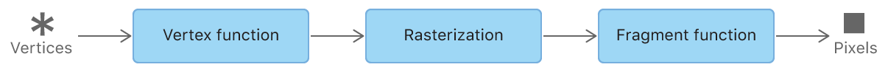
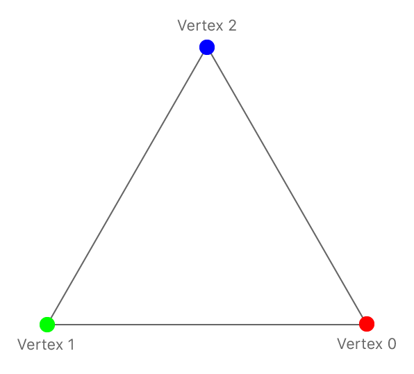
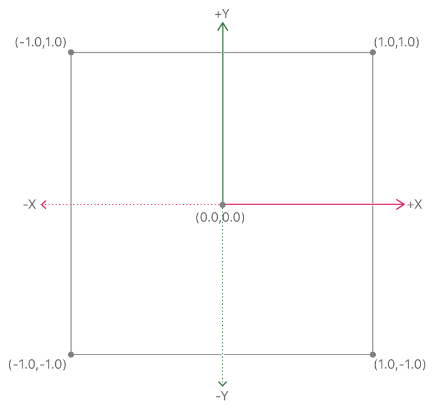
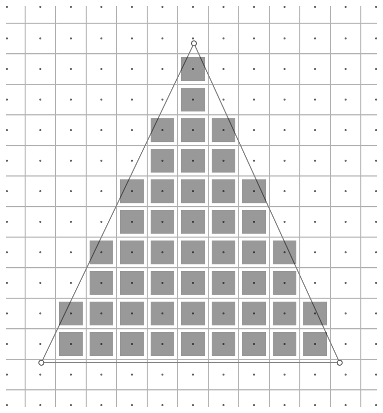
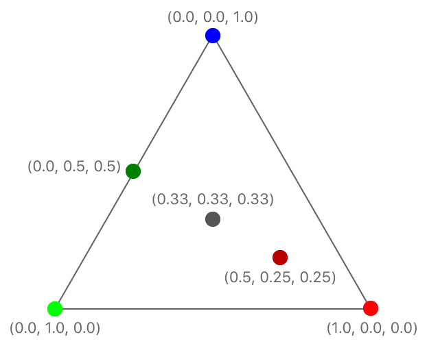

#  Hello Triangle

> Demonstrates how to render a simple 2D triangle.

演示如何渲染简单的 2D 三角形。

## Overview

> In the [Devices and Commands](https://developer.apple.com/documentation/metal/devices_and_commands?language=objc) sample, you learned how to write an app that uses Metal and issues basic rendering commands to the GPU.
>
> In this sample, you’ll learn how to render basic geometry in Metal. In particular, you’ll learn how to work with vertex data and SIMD types, configure the graphics rendering pipeline, write GPU functions, and issue draw calls.

在 [Devices and Commands](https://developer.apple.com/documentation/metal/devices_and_commands?language=objc) 示例中，你学习了如何编写使用 Metal 的应用程序并向 GPU 发出基本渲染命令。

在本示例中，你将学习如何在 Metal 中渲染基本几何体。特别是，你将学习如何使用顶点数据和 SIMD 类型，配置图形渲染管道，编写 GPU 函数以及发出绘制调用。

## The Metal Graphics Rendering Pipeline

> The Metal graphics rendering pipeline is made up of multiple graphics processing unit (GPU) stages, some programmable and some fixed, that execute a draw command. Metal defines the inputs, processes, and outputs of the pipeline as a set of rendering commands applied to certain data. In its most basic form, the pipeline receives vertices as input and renders pixels as output. This sample focuses on the three main stages of the pipeline: the vertex function, the rasterization stage, and the fragment function. The vertex function and fragment function are programmable stages. The rasterization stage is fixed.

Metal 图形渲染管道由多个图形处理单元（ GPU ）阶段组成，其中一些阶段是可编程的，一些是固定的，用于执行绘图命令。Metal 将管道的输入，处理和输出定义为应用于某些数据的渲染命令的集合。在最基本的形式中，管道接收顶点作为输入并将渲染像素作为输出。此示例主要关注管道的三个主要阶段：顶点函数，光栅化阶段和片段函数。顶点函数和片段函数是可编程阶段。光栅化阶段是固定的。



> A MTLRenderPipelineState object represents a graphics-rendering pipeline. Many stages of this pipeline can be configured using a MTLRenderPipelineDescriptor object, which defines a large portion of how Metal processes input vertices into rendered output pixels.

MTLRenderPipelineState 对象表示图形渲染管道。可以使用 MTLRenderPipelineDescriptor 对象配置管道的许多阶段，该对象定义了 Metal 处理输入顶点到渲染输出像素的大部分方式。

### Vertex Data

> A vertex is simply a point in space where two or more lines meet. Typically, vertices are expressed as a collection of Cartesian coordinates that define specific geometry, along with optional data associated with each coordinate.
>
> This sample renders a simple 2D triangle made up of three vertices, with each vertex containing the position and color of a triangle corner.

顶点只是两条或多条线相交的空间中的一个点。通常，顶点表示为定义特定几何的笛卡尔坐标的集合，以及与每个坐标相关联的可选数据。

此示例呈现由三个顶点组成的简单 2D 三角形，每个顶点包含三角形角的位置和颜色。



> Position is a required vertex attribute, whereas color is optional. For this sample, the pipeline uses both vertex attributes to render a colored triangle onto a specific region of a drawable.

Position 是必需的顶点属性，而 color 是可选的。对于此示例，管道使用 position 和 color 这两个顶点属性渲染彩色三角形到 drawable 的特定区域。

### Use SIMD Data Types

> Vertex data is usually loaded from a file that contains 3D model data exported from specialized modeling software. Detailed models may contain thousands of vertices with many attributes, but ultimately they all end up in some form of array that is specially packaged, encoded, and sent to the GPU.
>
> The sample’s triangle defines a 2D position (x, y) and RGBA color (red, green, blue, alpha) for each of its three vertices. This relatively small amount of data is directly hard coded into an array of structures, where each element of the array represents a single vertex. The structure used as the data type for the array elements defines the memory layout of each vertex.
>
> Vertex data, and 3D graphics data in general, is usually defined with vector data types, simplifying common graphics algorithms and GPU processing. This sample uses optimized vector data types provided by the SIMD library to represent the triangle’s vertices. The SIMD library is independent from Metal and MetalKit, but is highly recommended for developing Metal apps, mainly for its convenience and performance benefits.
>
> The triangle’s 2D position components are jointly represented with a vector_float2 SIMD data type, which holds two 32-bit floating-point values. Similarly, the triangle’s RGBA color components are jointly represented with a vector_float4 SIMD data type, which holds four 32-bit floating-point values. Both of these attributes are then combined into a single AAPLVertex structure.

顶点数据通常从包含 3D 模型数据的文件中加载，模型数据从专用建模软件导出。详细模型可能包含数千个具有许多属性的顶点，但最终它们都以某种形式的阵列结束，这些阵列经过特殊打包，编码并发送到 GPU 。

示例中的三角形为其三个顶点中的每一个定义了 2D 位置（ x，y ）和 RGBA 颜色（红色，绿色，蓝色，alpha ）。这种相对少量的数据被直接硬编码到结构数组中，其中数组的每个元素代表单个顶点。用作数组元素数据类型的结构体定义了每个顶点的内存布局。

顶点数据和一般的 3D 图形数据通常用矢量数据类型定义，简化了常见的图形算法和 GPU 处理。此示例使用 SIMD 库提供的优化过的矢量数据类型来表示三角形的顶点。SIMD 库独立于 Metal 和 MetalKit ，但强烈建议用于开发 Metal 应用程序，主要是因为它的便利性和性能优势。

三角形的 2D 位置组件由 vector_float2 SIMD 数据类型共同表示，该类型包含两个 32 位浮点值。类似地，三角形的 RGBA 颜色分量用 vector_float4 SIMD 数据类型联合表示，该数据类型包含四个 32 位浮点值。然后这两个属性组合成单个 AAPLVertex 结构。

```objc
typedef struct
{
    // Positions in pixel space
    // (e.g. a value of 100 indicates 100 pixels from the center)
    vector_float2 position;

    // Floating-point RGBA colors
    vector_float4 color;
} AAPLVertex;
```

> The triangle’s three vertices are directly hard coded into an array of AAPLVertex elements, thus defining the exact attribute values of each vertex.

三角形的三个顶点直接硬编码到 AAPLVertex 元素的数组中，从而定义每个顶点的精确属性值。

```objc
static const AAPLVertex triangleVertices[] =
{
    // 2D positions,    RGBA colors
    { {  250,  -250 }, { 1, 0, 0, 1 } },
    { { -250,  -250 }, { 0, 1, 0, 1 } },
    { {    0,   250 }, { 0, 0, 1, 1 } },
};
```

### Set a Viewport

> A viewport specifies the area of a drawable that Metal renders content to. A viewport is a 3D area with an x and y offset, a width and height, and near and far planes (although these last two aren’t needed here because this sample renders 2D content only).
>
> Assigning a custom viewport for the pipeline requires encoding a MTLViewport structure into a render command encoder by calling the setViewport: method. If a viewport isn’t specified, Metal sets a default viewport with the same size as the drawable used to create the render command encoder.

视口指定 drawable 的一个区域，Metal 将内容渲染到该区域中。视口是具有 x 和 y 偏移，宽度和高度以及近和远平面的 3D 区域（尽管这里不需要最后两个参数，因为此示例仅渲染 2D 内容）。

为管道指定自定义视口需要通过调用 setViewport: 方法将 MTLViewport 结构体编码到渲染命令编码器中。如果未指定视口，Metal 会设置一个默认视口，其大小与用于创建渲染命令编码器的 drawable 相同。

### Write a Vertex Function

> The main task of a vertex function (also known as a vertex shader) is to process incoming vertex data and map each vertex to a position in the viewport. This way, subsequent stages in the pipeline can refer to this viewport position and render pixels to an exact location in the drawable. The vertex function accomplishes this task by translating arbitrary vertex coordinates into normalized device coordinates, also known as clip-space coordinates.
>
> Clip space is a 2D coordinate system that maps the viewport area to a [-1.0, 1.0] range along both the x and y axes. The viewport’s lower-left corner is mapped to (-1.0, -1.0), the upper-right corner is mapped to (1.0, 1.0), and the center is mapped to (0.0, 0.0).

顶点函数（也称为顶点着色器）的主要任务是处理传入的顶点数据并将每个顶点映射到视口中的一个位置。这样，管道中的后续阶段可以引用此视口位置并将像素渲染到 drawable 中的精确位置。顶点函数通过将任意顶点坐标转换为规范化设备坐标（也称为裁剪空间坐标）来完成此任务。

裁剪空间是一个 2D 坐标系，它将视口区域沿 x 轴和 y 轴映射到 [-1.0,1.0] 范围。视口的左下角映射到（-1.0，-1.0），右上角映射到（1.0，1.0），中心映射到（0.0，0.0）。



> A vertex function executes once for each vertex drawn. In this sample, for each frame, three vertices are drawn to make up a triangle. Thus, the vertex function executes three times per frame.
>
> Vertex functions are written in the Metal shading language, which is based on C++ 14. Metal shading language code may seem similar to traditional C/C++ code, but the two are fundamentally different. Traditional C/C++ code is typically executed on the CPU, whereas Metal shading language code is exclusively executed on the GPU. The GPU offers much larger processing bandwidth and can work, in parallel, on a larger number of vertices and fragments. However, it has less memory than a CPU, does not handle control flow operations as efficiently, and generally has higher latency.
>
> The vertex function in this sample is called vertexShader and this is its signature.

顶点函数对于绘制的每个顶点都执行一次。在此示例中，对于每一帧，绘制三个顶点以构成三角形。因此，顶点函数每帧执行三次。

顶点函数是用 Metal 着色语言编写的，它基于 C ++ 14 。Metal 着色语言代码可能看起来类似于传统的 C / C ++ 代码，但两者根本上是不同的。传统的 C / C ++ 代码通常在 CPU 上执行，而 Metal 着色语言代码专门在 GPU 上执行。GPU 提供了更大的处理带宽，并且可以在大量顶点和片段上并行工作。但是，它具有比 CPU 更少的内存，不能有效地处理控制流操作，并且通常具有更高的延迟。

此示例中的顶点函数称为 vertexShader ，这是它的签名。

```objc
vertex RasterizerData
vertexShader(uint vertexID [[vertex_id]],
constant AAPLVertex *vertices [[buffer(AAPLVertexInputIndexVertices)]],
constant vector_uint2 *viewportSizePointer [[buffer(AAPLVertexInputIndexViewportSize)]])
```

#### Declare Vertex Function Parameters

> The first parameter, vertexID, uses the [[vertex_id]] attribute qualifier and holds the index of the vertex currently being executed. When a draw call uses this vertex function, this value begins at 0 and is incremented for each invocation of the vertexShader function. A parameter using the [[vertex_id]] attribute qualifier is typically used to index into an array that contains vertices.
>
> The second parameter, vertices, is the array that contains vertices, with each vertex defined as an AAPLVertex data type. A pointer to this structure defines an array of these vertices.
>
> The third and final parameter, viewportSizePointer, contains the size of the viewport and has a vector_uint2 data type.
>
> Both the vertices and viewportSizePointer parameters use SIMD data types, which are types understood by both C and Metal shading language code. The sample can thus define the AAPLVertex structure in the shared HelloTriangleShaderTypes.h header, included in both the HelloTriangleRenderer.m and HelloTriangleShaders.metal code. Therefore, the shared header ensures that the data type of the triangle’s vertices is the same in the Objective-C declaration (triangleVertices) as it is in the Metal shading language declaration (vertices). Using SIMD data types in your Metal app ensures that memory layouts match exactly across CPU/GPU declarations and facilitates sending vertex data from the CPU to the GPU.
>
> Note - Any changes to the AAPLVertex structure affect both the HelloTriangleRenderer.m and HelloTriangleShaders.metal code equally.
>
> Both the vertices and viewportSizePointer parameters use the [[buffer(index)]] attribute qualifier. The values of AAPLVertexInputIndexVertices and AAPLVertexInputIndexViewportSize are the indices used to identify and set the inputs to the vertex function in both the HelloTriangleRenderer.m and HelloTriangleShaders.metal code.

第一个参数 vertexID 使用 [[vertex_id]] 属性限定符并保存当前正在执行的顶点的索引。当绘制调用使用此顶点函数时，此值从 0 开始，并在每次调用 vertexShader 函数时递增。使用 [[vertex_id]] 属性限定符的参数通常用于索引包含顶点的数组。

第二个参数 vertices 是包含顶点的数组，每个顶点定义为 AAPLVertex 数据类型。指向此结构的指针定义了这些顶点的数组。

第三个也是最后一个参数 viewportSizePointer 包含视口的大小，并具有 vector_uint2 数据类型。

vertices 和 viewportSizePointer 参数都使用 SIMD 数据类型，这些类型是 C 和 Metal 着色语言代码都能理解的类型。因此，示例可以在 HelloTriangleShaderTypes.h 头文件中定义 AAPLVertex 结构，该结构被 HelloTriangleRenderer.m 和 HelloTriangleShaders.metal 文件所包含。因此，共享的头文件确保以 Objective-C 声明的三角形顶点的数据类型（ triangleVertices ）与在 Metal 着色语言中声明（ vertices ）的相同。在 Metal 应用程序中使用 SIMD 数据类型可确保内存布局在 CPU / GPU 声明中完全匹配，并有助于将顶点数据从 CPU 发送到 GPU 。

注意 - 对 AAPLVertex 结构的任何更改都会同等地影响 HelloTriangleRenderer.m 和 HelloTriangleShaders.metal 代码。

vertices 和 viewportSizePointer 参数都使用 [[buffer(index)]] 属性限定符。AAPLVertexInputIndexVertices 和 AAPLVertexInputIndexViewportSize 的值是用于在 HelloTriangleRenderer.m 和 HelloTriangleShaders.metal 代码中标识和设置顶点函数输入的索引。

#### Declare Vertex Function Return Values

> The RasterizerData structure defines the return value of the vertex function.

RasterizerData 结构定义顶点函数的返回值。

```objc
typedef struct
{
    // The [[position]] attribute of this member indicates that this value is the clip space
    // position of the vertex when this structure is returned from the vertex function
    float4 clipSpacePosition [[position]];

    // Since this member does not have a special attribute, the rasterizer interpolates
    // its value with the values of the other triangle vertices and then passes
    // the interpolated value to the fragment shader for each fragment in the triangle
    float4 color;

} RasterizerData;
```

> Vertex functions must return a clip-space position value for each vertex via the [[position]] attribute qualifier, which the clipSpacePosition member uses. When this attribute is declared, the next stage of the pipeline, rasterization, uses the clipSpacePosition values to identify the position of the triangle’s corners and determine which pixels to render.

顶点函数必须通过 clipSpacePosition 成员使用的 [[position]] 属性限定符为返回每个顶点的裁剪空间位置值。声明此属性后，管道的下一个阶段（栅格化）使用 clipSpacePosition 值来标识三角形角的位置，并确定要渲染的像素。

#### Process Vertex Data

> The body of the sample’s vertex function does two things to the input vertices:
>
> - Performs coordinate-system transformations, writing the resulting vertex clip-space position to the out.clipSpacePosition return value.
>
> - Passes the vertex color to the out.color return value.
>
> To get an input vertex, the vertexID parameter is used to index into the vertices array.

示例的顶点函数的主体对输入顶点做两件事：

- 执行坐标转换，将生成的顶点裁剪空间位置写入 out.clipSpacePosition 返回值。

- 将顶点颜色传递给 out.color 返回值。

要获取输入顶点，vertexID 参数用于索引顶点数组。

```objc
float2 pixelSpacePosition = vertices[vertexID].position.xy;
```

> This sample obtains a 2D vertex coordinate from the position member of each vertices element and converts it into a clip-space position written to the out.clipSpacePosition return value. Each vertex input position is defined relative to the number of pixels in the x and y directions from the center of the viewport. Thus, to convert these pixel-space positions to clip-space positions, the vertex function divides by half the viewport size.

此示例从每个顶点元素的位置成员获取 2D 顶点坐标，并将其转换为写入 out.clipSpacePosition 返回值的裁剪空间位置。每个顶点输入位置都是由相对于从视口中心开始的 x 和 y 方向上的像素数定义的。因此，要将这些像素空间位置转换为裁剪空间位置，顶点函数除以视口大小的一半。

```objc
out.clipSpacePosition.xy = pixelSpacePosition / (viewportSize / 2.0);
```

> Finally, the vertex function accesses the color member of each vertices element and passes it along to the out.color return value, without performing any modifications.

最后，顶点函数访问每个顶点元素的颜色成员并将其传递给 out.color 返回值，而不执行任何修改。

```objc
out.color = vertices[vertexID].color;
```

> The contents of the RasterizerData return value are now complete, and the structure is passed along to the next stage in the pipeline.

RasterizerData 返回值的内容现在已完成，该结构将传递到管道中的下一个阶段。

### Rasterization

> After the vertex function executes three times, once for each of the triangle’s vertices, the next stage in the pipeline, rasterization, begins.
>
> Rasterization is the stage in which the pipeline’s rasterizer unit produces fragments. A fragment contains raw prepixel data that’s used to produce the pixels rendered to a drawable. For each complete triangle produced by the vertex function, the rasterizer determines which pixels of the destination drawable are covered by the triangle. It does so by testing whether the center of each pixel in the drawable is the inside the triangle. In the following diagram, only fragments whose pixel center is inside the triangle are produced. These fragments are shown as gray squares.

顶点函数执行三次后（对于每个三角形的顶点执行一次），管道中的下一个阶段，栅格化开始。

光栅化是管道光栅化器单元产生片元的阶段。片段包含用于生成渲染到 drawable 的像素的原始预像素数据。对于每个由顶点函数生成的完整三角形，光栅化器确定目标 drawable 的哪些像素被三角形覆盖。这是通过测试 drawable 中每个像素的中心是否在三角形内部来实现的。在下图中，仅生成像素中心位于三角形内部的片元。这些片元显示为灰色方块。



> Rasterization also determines the values that are sent to the next stage in the pipeline: the fragment function. Earlier in the pipeline, the vertex function output the values of a RasterizerData structure, which contains a clip-space position (clipSpacePosition) and a color (color). The clipSpacePosition member uses the required [[position]] attribute qualifier, indicating that these values are directly used to determine the triangle’s fragment coverage area. The color member doesn’t have an attribute qualifier, indicating that these values should be interpolated across the triangle’s fragments.
>
> The rasterizer passes color values to the fragment function after converting them from per-vertex values to per-fragment values. This conversion uses a fixed interpolation function, which calculates a single weighted color derived from the color values of the triangle’s three vertices. The weights for the interpolation function (also known as barycentric coordinates.) are the relative distances of each vertex position to the center of a fragment. For example:
>
> - If a fragment is exactly in the middle of a triangle, equidistant from each of the triangle’s three vertices, the color of each vertex is weighted by 1/3. In the following diagram, this is shown as the gray fragment (0.33, 0.33, 0.33) in the center of the triangle.
>
> - If a fragment is very close to one vertex and very far from the other two, the color of the close vertex is weighted toward 1 and the color of the far ones is weighted toward 0. In the following diagram, this is shown as the reddish fragment (0.5, 0.25, 0.25) near the bottom-right corner of the triangle.
>
> - If a fragment is on an edge of the triangle, midway between two of the three vertices, the color of each edge-defining vertex is weighted by 1/2 and the color of the nonedge vertex is weighted by 0. In the following diagram, this is shown as the cyan fragment (0.0, 0.5, 0.5) on the left edge of the triangle.

栅格化还确定发送到管道中下一个阶段（片段函数）的值。在管道的早期，顶点函数输出 RasterizerData 结构的值，该结构包含裁剪空间位置（ clipSpacePosition ）和颜色（ color ）。clipSpacePosition 成员使用必须的 [[position]] 属性限定符，指示这些值直接用于确定三角形的片段覆盖区域。颜色成员没有属性限定符，表示这些值应该在三角形的片段之间进行插值。

在将颜色值从每个顶点转换为每个片段的值之后，光栅化器将颜色值传递给片段函数。此转换使用固定插值函数，该函数计算从三角形的三个顶点的颜色值派生的单个加权颜色。插值函数的权重（也称为重心坐标）是每个顶点位置与片段中心的相对距离。例如：

- 如果片段正好位于三角形的中间，与三角形的每个顶点等距，则每个顶点的颜色权重为 1/3 。在下图中，这显示为三角形中心的灰色片段（ 0.33, 0.33, 0.33 ）。

- 如果一个片段离一个顶点很近并且距离另外两个顶点很远，则最近顶点的颜色权重趋近于 1 ，远点的顶点的颜色权重趋近于0 。在下图中，这显示为靠近三角形的右下角的偏红色片段（ 0.5, 0.25, 0.25 ）。

- 如果片段位于三角形的边缘上，位于两个顶点之间，则定义边缘的每个顶点的颜色权重为 1/2 ，非边缘顶点的颜色权重为 0 。在下图中，这显示为三角形左边缘的青色片段（ 0.0 ,0.5 ,0.5 ）。



> Because rasterization is a fixed pipeline stage, its behavior can’t be modified by custom Metal shading language code. After the rasterizer creates a fragment, along with its associated values, the results are passed along to the next stage in the pipeline.

由于光栅化是固定的管道阶段，因此无法通过自定义 Metal 着色语言代码修改其行为。在光栅化器创建片段及其关联值之后，结果将传递到管道中的下一个阶段。

### Write a Fragment Function

> The main task of a fragment function (also known as fragment shader) is to process incoming fragment data and calculate a color value for the drawable’s pixels.
>
> The fragment function in this sample is called fragmentShader and this is its signature.

片段函数（也称为片段着色器）的主要任务是处理传入的片段数据并计算 drawable 像素的颜色值。

此示例中的片段函数称为 fragmentShader ，这是它的签名。

```objc
fragment float4 fragmentShader(RasterizerData in [[stage_in]])
```

> The function has a single parameter, in, that uses the same RasterizerData structure returned by the vertex function. The [[stage_in]] attribute qualifier indicates that this parameter comes from the rasterizer. The function returns a four-component floating-point vector, which contains the final RGBA color value to be rendered to the drawable.
>
> This sample demonstrates a very simple fragment function that returns the interpolated color value from the rasterizer, without further processing. Each fragment renders its interpolated color value to its corresponding pixel in the triangle.

该函数有一个参数 in ，它使用由顶点函数返回的相同 RasterizerData 结构。[[stage_in]] 属性限定符表示此参数来自光栅化器。该函数返回一个四分量浮点向量，其中包含要渲染给 drawable 的最终 RGBA 颜色值。

此示例演示了一个非常简单的片段函数，该函数返回光栅化器的插值颜色值，无需进一步处理。每个片段将其插值颜色值渲染到三角形中的对应像素。

```objc
return in.color;
```

### Obtain Function Libraries and Create a Pipeline

> When building the sample, Xcode compiles the HelloTriangleShaders.metal file along with the Objective-C code. However, Xcode can’t link the vertexShader and fragmentShader functions at build time; instead, the app needs to explicitly link these functions at runtime.
>
> Metal shading language code is compiled in two stages:
>
> - Front-end compilation happens in Xcode at build time. .metal files are compiled from high-level source code into intermediate representation (IR) files.
>
> -  Back-end compilation happens in a physical device at runtime. IR files are then compiled into low-level machine code.
>
> Each GPU family has a different instruction set. As a result, Metal shading language code can only be fully compiled into native GPU code at runtime, by the physical device itself. Front-end compilation reduces some of this compilation overhead by storing IR in a default.metallib file that’s packaged inside the sample’s .app bundle.
>
> The default.metallib file is a library of Metal shading language functions that’s represented by a MTLLibrary object retrieved at runtime by calling the newDefaultLibrary method. From this library, specific functions represented by MTLFunction objects can be retrieved.

在构建示例时，Xcode会编译 HelloTriangleShaders.metal 文件以及 Objective-C 代码。但是，Xcode 无法在构建时链接 vertexShader 和 fragmentShader 函数；相反，应用程序需要在运行时显式链接这些函数。

Metal 着色语言代码分两个阶段编译：

- 前端编译在构建时发生在 Xcode 中。.metal 文件从高级源代码编译为中间表示（ IR ）文件。

- 后端编译在运行时发生在物理设备中。IR 文件被编译为低级机器代码。

每个 GPU 系列都有不同的指令集。因此，Metal 着色语言代码只能在运行时由物理设备本身完全编译为本机 GPU 代码。前端编译通过将 IR 存储在一个 default.metallib 文件中来降低编译开销，.metallib 文件被打包到示例的 .app 包中。

default.metallib 文件是 Metal 着色语言函数库，由运行时通过调用 newDefaultLibrary 方法检索的 MTLLibrary 对象表示。从该库中，可以检索由 MTLFunction 对象表示的特定函数。

```objc
// Load all the shader files with a .metal file extension in the project
id<MTLLibrary> defaultLibrary = [_device newDefaultLibrary];

// Load the vertex function from the library
id<MTLFunction> vertexFunction = [defaultLibrary newFunctionWithName:@"vertexShader"];

// Load the fragment function from the library
id<MTLFunction> fragmentFunction = [defaultLibrary newFunctionWithName:@"fragmentShader"];
```

> These MTLFunction objects are used to create a MTLRenderPipelineState object that represents the graphics-rendering pipeline. Calling the newRenderPipelineStateWithDescriptor:error: method of a MTLDevice object begins the back-end compilation process that links the vertexShader and fragmentShader functions, resulting in a fully compiled pipeline.
>
> A MTLRenderPipelineState object contains additional pipeline settings that are configured by a MTLRenderPipelineDescriptor object. Besides the vertex and fragment functions, this sample also configures the pixelFormat value of the first entry in the colorAttachments array. This sample only renders to a single target, the view’s drawable (colorAttachments[0]), whose pixel format is configured by the view itself (colorPixelFormat). A view’s pixel format defines the memory layout of each of its pixels; Metal must be able to reference this layout when creating the pipeline so that it can properly render the color values produced by the fragment function.

这些 MTLFunction 对象用于创建表示图形渲染管道的 MTLRenderPipelineState 对象。调用 MTLDevice 对象的 newRenderPipelineStateWithDescriptor:error: 方法开始后端编译过程，该过程链接 vertexShader 和 fragmentShader 函数，从而产生完全编译的管道。

MTLRenderPipelineState 对象包含由 MTLRenderPipelineDescriptor 对象配置的其他管道设置。除顶点和片段函数外，此示例还配置 colorAttachments 数组中第一个条目的 pixelFormat 值。此示例仅渲染到单个目标，即视图的drawable（ colorAttachments[0] ），其像素格式由视图本身（ colorPixelFormat ）配置。视图的像素格式定义了每个像素的内存布局；在创建管道时，Metal 必须能够引用此布局，以便它可以正确渲染 fragment 函数生成的颜色值。

```objc
MTLRenderPipelineDescriptor *pipelineStateDescriptor = [[MTLRenderPipelineDescriptor alloc] init];
pipelineStateDescriptor.label = @"Simple Pipeline";
pipelineStateDescriptor.vertexFunction = vertexFunction;
pipelineStateDescriptor.fragmentFunction = fragmentFunction;
pipelineStateDescriptor.colorAttachments[0].pixelFormat = mtkView.colorPixelFormat;

_pipelineState = [_device newRenderPipelineStateWithDescriptor:pipelineStateDescriptor
error:&error];
```

### Send Vertex Data to a Vertex Function

> After the pipeline is created, it can be assigned to a render command encoder. This operation that all subsequent rendering commands will be processed by that specific pipeline.

创建管道后，可以将其分配给渲染命令编码器。此操作指定所有后续渲染命令由指定管道处理。

```objc
[renderEncoder setRenderPipelineState:_pipelineState];
```

> This sample uses the setVertexBytes:length:atIndex: method to send vertex data to a vertex function. As mentioned earlier, the signature of the sample’s vertexShader function has two parameters, vertices and viewportSizePointer, that use the [[buffer(index)]] attribute qualifier. The value of the index parameter in the setVertexBytes:length:atIndex: method maps to the parameter with the same index value in the [[buffer(index)]] attribute qualifier. Thus, calling the setVertexBytes:length:atIndex: method sets specific vertex data for a specific vertex function parameter.
>
> The AAPLVertexInputIndexVertices and AAPLVertexInputIndexViewportSize values are defined in the HelloTriangleShaderTypes.h header shared between the HelloTriangleRenderer.m and HelloTriangleShaders.metal files. The sample uses these values for the index parameter of both the setVertexBytes:length:atIndex: method and the [[buffer(index)]] attribute qualifier corresponding to the same vertex function. Sharing these values across different files makes the sample more robust by reducing potential index mismatches due to hard-coded integers (which could send the wrong data to the wrong parameter).
>
> This sample sends the following vertex data to a vertex function:
>
> - The triangleVertices pointer is sent to the vertices parameter, using the AAPLVertexInputIndexVertices index value
>
> - The _viewportSize pointer is sent to viewportSizePointer parameter, using the AAPLVertexInputIndexViewportSize index value

此示例使用 setVertexBytes:length:atIndex: 方法发送顶点数据到顶点函数。如前所述，vertexShader 函数的声明有两个参数，vertices 和 viewportSizePointer ，它们使用 [[buffer(index)]] 属性限定符。setVertexBytes:length:atIndex: 方法中 index 参数的值映射到 [[buffer(index)]] 属性限定符中具有相同索引值的参数。因此，调用 setVertexBytes:length:atIndex: 方法为特定的顶点函数参数设置特定的顶点数据。

AAPLVertexInputIndexVertices 和 AAPLVertexInputIndexViewportSize 值在 HelloTriangleRenderer.m 和 HelloTriangleShaders.metal 文件之间共享的 HelloTriangleShaderTypes.h 头文件中定义。该示例将这些值用于 setVertexBytes:length:atIndex: 方法的index参数以及对应的相同顶点函数的 [[buffer(index)]] 属性限定符。通过减少由于硬编码整数（可能将错误的数据发送到错误的参数）导致的潜在索引不匹配，在不同文件之间共享这些值使得示例更加健壮。

此示例将以下顶点数据发送到顶点函数：

- 使用 AAPLVertexInputIndexVertices 索引值将 triangleVertices 指针发送到顶点参数

- 使用 AAPLVertexInputIndexViewportSize 索引值将 _viewportSize 指针发送到 viewportSizePointer 参数

```objc
// You send a pointer to the `triangleVertices` array also and indicate its size
// The `AAPLVertexInputIndexVertices` enum value corresponds to the `vertexArray`
// argument in the `vertexShader` function because its buffer attribute also uses
// the `AAPLVertexInputIndexVertices` enum value for its index
[renderEncoder setVertexBytes:triangleVertices
length:sizeof(triangleVertices)
atIndex:AAPLVertexInputIndexVertices];

// You send a pointer to `_viewportSize` and also indicate its size
// The `AAPLVertexInputIndexViewportSize` enum value corresponds to the
// `viewportSizePointer` argument in the `vertexShader` function because its
//  buffer attribute also uses the `AAPLVertexInputIndexViewportSize` enum value
//  for its index
[renderEncoder setVertexBytes:&_viewportSize
length:sizeof(_viewportSize)
atIndex:AAPLVertexInputIndexViewportSize];
```

### Draw the Triangle

> After setting a pipeline and its associated vertex data, issuing a draw call executes the pipeline and draws the sample’s single triangle. The sample encodes a single drawing command into the render command encoder.

Triangles are geometric primitives in Metal that require three vertices to be drawn. Other primitives include lines that require two vertices, or points that require just one vertex. The drawPrimitives:vertexStart:vertexCount: method lets you specify exactly what type of primitive to draw and which vertices, derived from the previously set vertex data, to use. Setting 0 for the vertexStart parameter indicates that drawing should begin with the first vertex in the array of vertices. This means that the first value of the vertex function’s vertexID parameter, which uses the [[vertex_id]] attribute qualifier, will be 0. Setting 3 for the vertexCount parameter indicates that three vertices should be drawn, producing a single triangle. (That is, the vertex function is executed three times with values of 0, 1, and 2 for the vertexID parameter).

设置好管道及其关联的顶点数据后，发出绘制调用会执行管道并绘制示例的单个三角形。该示例将单个绘图命令编码到渲染命令编码器中。

三角形是 Metal 中需要绘制三个顶点的几何图元。其他图元包括需要两个顶点的线，或者只需要一个顶点的点。 drawPrimitives:vertexStart:vertexCount: 方法允许你准确指定要绘制的图元类型以及先前设置的顶点数据派生的哪些顶点需要使用。为 vertexStart 参数设置 0 表示绘图应以顶点数组中的第一个顶点开始。这意味着顶点函数的 vertexID 参数的第一个值（使用 [[vertex_id]] 属性限定符）将为 0 。为 vertexCount 参数设置 3 表示应绘制三个顶点，从而生成一个三角形。（也就是说，对于 vertexID 参数，顶点函数执行三次，值分别为 0 ，1 和 2 ）。

```objc
// Draw the 3 vertices of our triangle
[renderEncoder drawPrimitives:MTLPrimitiveTypeTriangle
vertexStart:0
vertexCount:3];
```

> This call is the last call needed to encode the rendering commands for a single triangle. With the drawing complete, the render loop can end encoding, commit the command buffer, and present the drawable containing the rendered triangle.

此调用是对单个三角形的渲染命令进行编码所需的最后一次调用。绘图完成后，渲染循环可以结束编码，提交命令缓冲区，并呈现包含渲染三角形的 drawable 。

### Next Steps

> In this sample, you learned how to render basic geometry in Metal.
>
> In the [Basic Buffers](https://developer.apple.com/documentation/metal/basic_buffers?language=objc) sample, you’ll learn how to use a vertex buffer to improve your rendering efficiency.

在此示例中，学习了如何在 Metal 中渲染基本几何体。

在 [Basic Buffers](https://developer.apple.com/documentation/metal/basic_buffers?language=objc) 示例中，你将学习如何使用顶点缓冲区来提高渲染效率。
