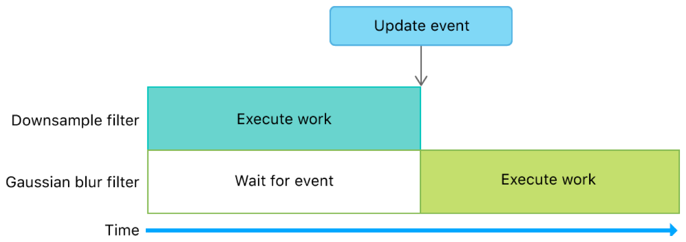
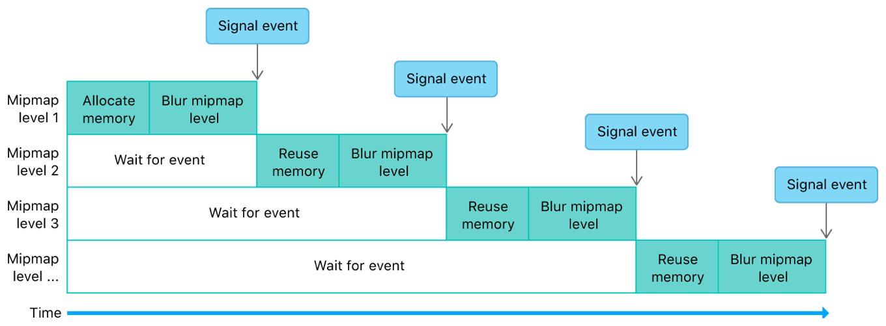
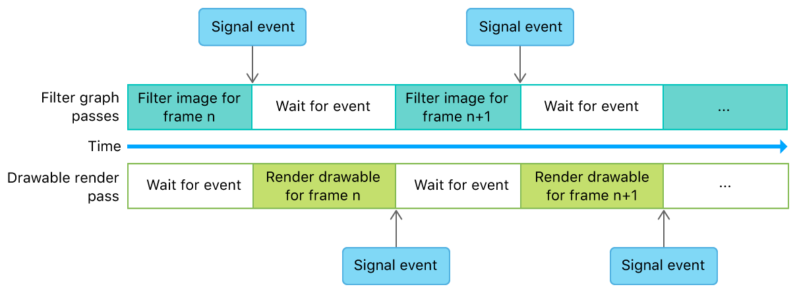

#  Image Filter Graph with Heaps and Events

> Demonstrates how to use heaps and events to optimize a multistage image filter.

演示如何使用堆和事件来优化多级图像过滤器。

## Overview

> This sample demonstrates:
>
> - Using events instead of fences to manage resource dependencies and work synchronization
>
> - Creating heaps for static and dynamic textures
>
> - Using aliasing to reduce the amount of memory used for temporary resources
>
> - Using events to manage dependencies between encoders that produce and consume dynamic textures

此示例演示：

- 使用事件而不是围栏来管理资源依赖性和工作同步

- 为静态和动态纹理创建堆

- 使用别名来减少临时资源的内存占用

- 使用事件来管理生成和使用动态纹理的编码器之间的依赖关系


> This implementation minimizes memory usage in an orderly fashion for a filter graph with a downsample and Gaussian blur filter. For more information, including implementation details about heaps for static and dynamic textures, see [Image Filter Graph with Heaps and Fences](https://developer.apple.com/documentation/metal/resource_objects/image_filter_graph_with_heaps_and_fences?language=objc).

对于使用下采样和高斯模糊滤波器的过滤图，该实现以有序的方式最小化内存占用。有关更多信息，包括有关静态和动态纹理堆的实现详细信息，见  [Image Filter Graph with Heaps and Fences](https://developer.apple.com/documentation/metal/resource_objects/image_filter_graph_with_heaps_and_fences?language=objc) 。

## Compare Events with Fences

> The MTLFence API allows you to specify synchronization points in your app that wait for a workload to complete execution, provided that execution begins before a fence is encountered. However, this synchronization mechanism means that your app can’t wait for a workload to complete execution if the execution begins after a fence is encountered. A fence can wait for workloads that have already begun, but it can’t wait for future workloads.
>
> Fences work well in an image filter graph because each filter in the graph is applied sequentially. You can use a fence to wait for one filter to complete execution before you begin executing another.
>
> In contrast, although the MTLEvent API also allows you to specify similar synchronization points in your app, it allows for more flexibility than the MTLFence API. Unlike fences, events can wait for workloads that have already begun, as well as future workloads. Additionally, events are specified outside command encoder boundaries, not between the encoded commands of a command encoder. Because the event synchronization mechanism is implemented in the command buffer scheduler, events block workloads at the command buffer level within the GPU. Therefore, command buffers on one queue can execute while a command buffer on another queue is blocked by an event.
>
> Events also work well in an image filter graph because they provide the equivalent functionality of fences. However, events are easier to specify and track because their synchronization mechanism is managed with a discrete signal value that increases monotonically. Using this signal value, events insert a strict execution order between command encoder boundaries in the GPU.

MTLFence API 允许你在应用程序中指定同步点，以等待在遇到 fence 之前开始执行的工作负载执行完成。但是，此同步机制意味着如果某项工作在遇到 fence 之后才开始执行，则应用程序无法等待该工作负载完成执行。fence 可以等待已经开始的工作负载，但它不能等待未来的工作负载。

Fences 在图像过滤图中运行良好，因为图中的每个过滤器都是按顺序应用的。在开始执行另一个过滤器之前，可以使用 fence 来等待一个过滤器完成执行。

相比之下，虽然 MTLEvent API 也允许你在应用程序中指定类似的同步点，但它比 MTLFence API 更灵活。与 fences 不同，事件可以等待已经开始的以及未来的工作负载。另外，事件在命令编码器边界之外指定，而不是在命令编码器的编码命令之间指定。由于事件同步机制是在命令缓冲区调度程序中实现的，因此事件会阻止 GPU 内命令缓冲区级别的工作负载。因此，一个队列上的命令缓冲区可以执行，同时另一个队列上的命令缓冲区可以被事件阻止。

事件在图像过滤图中也很有效，因为它们提供了与栅栏等价的功能。但是，事件更容易指定和跟踪，因为它们的同步机制是使用单调增加的离散信号值进行管理的。使用此信号值，事件在 GPU 中的命令编码器边界之间插入严格的执行顺序。

## Implement an Event Wrapper for Synchronization Routines

> The sample wraps the MTLEvent API in the ImageFilteringWithHeapsAndEventsEventWrapper protocol accessed through an AAPLSingleDeviceEventWrapper object. This convenience wrapper encapsulates the main synchronization mechanism, and primarily manages the discrete signal value through the _signalCounter variable.
>
> Note - Because the event’s signal counter is wrapped within AAPLSingleDeviceEventWrapper, it can be used as a bridge between two or more nodes that depend on each other in an execution graph. Without this bridge, the signal counter and the MTLEvent object wouldn’t be tightly paired, and this potential mismatch could lead to synchronization errors in your code (for example, you might use a wrong MTLEvent object for a signal counter, or vice versa). The sample calls the wait: method to wait for a workload to complete execution.

该示例将 MTLEvent API 包装在通过 AAPLSingleDeviceEventWrapper 对象访问的 ImageFilteringWithHeapsAndEventsEventWrapper 协议中。这个便捷包装器封装了主同步机制，主要通过 _signalCounter 变量管理离散信号值。

注意 - 由于事件的信号计数器包含在 AAPLSingleDeviceEventWrapper 中，因此它可以用作执行图中彼此依赖的两个或多个节点之间的桥梁。如果没有此桥接器，信号计数器和 MTLEvent 对象将不会紧密配对，并且这种潜在的不匹配可能会导致代码中出现同步错误（例如，你可能使用错误的 MTLEvent 对象作为信号计数器，反之亦然）。该示例调用 wait: 方法以等待工作负载完成执行。

```objc
- (void) wait:(_Nonnull id <MTLCommandBuffer>)commandBuffer
{
    assert([_event.class conformsToProtocol:@protocol(MTLSharedEvent)] || (commandBuffer.device == _event.device));

    // Wait for the event to be signaled
    [commandBuffer encodeWaitForEvent:_event value:_signalCounter];
}
```

> The sample calls the signal: method to signal that a workload has completed execution. (This method increments the value of _signalCounter.)

该示例调用 signal: 方法来表示工作负载已完成执行。（此方法会增加 _signalCounter 的值。）

```objc
- (void) signal:(_Nonnull id<MTLCommandBuffer>)commandBuffer
{
    assert([_event.class conformsToProtocol:@protocol(MTLSharedEvent)] || (commandBuffer.device == _event.device));

    // Increase the signal counter
    ++_signalCounter;
    // Signal the event
    [commandBuffer encodeSignalEvent:_event value:_signalCounter];
}
```

> Note - You can reimplement this wrapper to support any other type of synchronization primitive, such as MTLSharedEvent, MTLFence, or CPU-side routines.

注意 - 你可以重新实现此包装器以支持任何其他类型的同步原语，例如 MTLSharedEvent ，MTLFence 或 CPU 端例程。

## Manage Dependencies Between Filters

> The sample uses _event to control access to dynamic textures allocated from _scratchHeap and prevent GPU race conditions in the filter graph. The event ensures that operations on dynamic textures are completed before the filter graph begins subsequent operations that depend on the result of previous operations.
>
> At the start of the filter graph, the sample calls the wait: method to ensure that the previous frame has completed execution.

该示例使用 _event 控制对从 _scratchHeap 分配的动态纹理的访问，并防止过滤图形中的 GPU 竞争条件。该事件确保在过滤器图形开始后续操作之前完成对动态纹理的操作，这些后续操作取决于先前操作的结果。

在过滤器图的开头，示例调用 wait: 方法以确保前一帧已完成执行。

```objc
[event wait:commandBuffer];
```

> The first filter, implemented by the sample in AAPLDownsampleFilter, creates a dynamic texture, outTexture, from the heap and allocates enough space for mipmaps.

示例的 AAPLDownsampleFilter 中实现的第一个过滤器从堆创建了一个动态纹理 outTexture ，并为 mipmap 分配了足够的空间。

```objc
MTLTextureDescriptor *textureDescriptor = [MTLTextureDescriptor texture2DDescriptorWithPixelFormat:inTexture.pixelFormat
    width:inTexture.width
    height:inTexture.height
    mipmapped:YES];
textureDescriptor.storageMode = heap.storageMode;
textureDescriptor.usage = MTLTextureUsageShaderWrite | MTLTextureUsageShaderRead;

id <MTLTexture> outTexture = [heap newTextureWithDescriptor:textureDescriptor];
```

> Next, the downsample filter blits a source texture, inTexture, to outTexture and generates the mipmaps. The sample then calls the endEncoding method to finalize the blit pass.

接下来，下采样过滤器将源纹理 inTexture blit 到 outTexture 并生成 mipmap 。然后，该示例调用 endEncoding 方法来完成 blit 过程。

```objc
[blitCommandEncoder copyFromTexture:inTexture
    sourceSlice:0
    sourceLevel:0
    sourceOrigin:(MTLOrigin){ 0, 0, 0 }
    sourceSize:(MTLSize){ inTexture.width, inTexture.height, inTexture.depth }
    toTexture:outTexture
    destinationSlice:0
    destinationLevel:0
    destinationOrigin:(MTLOrigin){ 0, 0, 0}];

[blitCommandEncoder generateMipmapsForTexture:outTexture];

[blitCommandEncoder endEncoding];
```

> Finally, the downsample filter calls the signal: method to indicate that its operations are complete.

最后，下采样过滤器调用 signal: 方法来指示其操作已完成。

```objc
[event signal:commandBuffer];
```

> The second filter, implemented by the sample in AAPLGaussianBlurFilter, calls the wait: method immediately before creating a compute command encoder. This forces the Gaussian blur filter to wait for the downsample filter to complete its work before beginning its own work. A waiting period is necessary because the Gaussian blur filter depends on dynamic texture data generated by the downsample filter. Without the event, the GPU could execute both filters in parallel, and thus read uninitialized dynamic texture data allocated from the heap.

示例的 AAPLGaussianBlurFilter 中实现的第二个过滤器在创建计算命令编码器之前立即调用 wait: 方法。这会强制高斯模糊滤镜在开始自己的工作之前等待下采样滤镜完成其工作。等待时间是必要的，因为高斯模糊滤波器依赖由下采样滤波器生成的动态纹理数据。没有事件的话，GPU 就会并行执行两个过滤器，这会导致读取从堆分配的未初始化的动态纹理数据。

```objc
[event wait:commandBuffer];
```



## Reuse Memory and Manage Dependencies Within a Filter

> The Gaussian blur filter performs a horizontal blur and a vertical blur for each mipmap level of the dynamic texture produced by the downsample filter. For each mipmap level, the sample allocates a temporary texture, intermediaryTexture, from the dynamic textures heap.

高斯模糊滤波器对由下采样滤波器产生的动态纹理的每个 mipmap 级别执行水平模糊和垂直模糊。对于每个 mipmap 级别，该示例从动态纹理堆中分配临时纹理，intermediateTexture 。

```objc
id <MTLTexture> intermediaryTexture = [heap newTextureWithDescriptor:textureDescriptor];
```

> This texture is temporary because it’s used only as an output destination from the horizontal blur and as an input source to the vertical blur. After the sample executes these blurs, the final texture data is stored in outTexture (which is a texture view of inTexture). Therefore, the texture data contained in intermediaryTexture is unused after each mipmap level iteration.

> 此纹理是临时的，因为它仅用作水平模糊的输出目标，并用作垂直模糊的输入源。在执行这些模糊之后，最终的纹理数据存储在 outTexture（这是 inTexture 的纹理视图）中。 因此，在每个 mipmap 级别迭代之后，intermediateTexture 中包含的纹理数据未被使用。

```objc
// Perform horizontal blur using the input texture as an input
// and a view of the mipmap level of input texture as the output

[computeEncoder setComputePipelineState:_horizontalKernel];

[computeEncoder setTexture:inTexture
    atIndex:AAPLBlurTextureIndexInput];

[computeEncoder setTexture:intermediaryTexture
    atIndex:AAPLBlurTextureIndexOutput];

[computeEncoder setBytes:&mipmapLevel
    length:sizeof(mipmapLevel)
    atIndex:AAPLBlurBufferIndexLOD];

[computeEncoder dispatchThreadgroups:threadgroupCount
    threadsPerThreadgroup:threadgroupSize];

// Perform vertical blur using the horizontally blurred texture as an input
// and a view of the mipmap level of the input texture as the output

[computeEncoder setComputePipelineState:_verticalKernel];

[computeEncoder setTexture:intermediaryTexture
    atIndex:AAPLBlurTextureIndexInput];

[computeEncoder setTexture:outTexture
    atIndex:AAPLBlurTextureIndexOutput];

static const uint32_t mipmapLevelZero = 0;
[computeEncoder setBytes:&mipmapLevelZero
    length:sizeof(mipmapLevelZero)
    atIndex:AAPLBlurBufferIndexLOD];

[computeEncoder dispatchThreadgroups:threadgroupCount
    threadsPerThreadgroup:threadgroupSize];
```

> After blurring each mipmap level, the sample calls the endEncoding method to indicate that the compute operations for the given mipmap level are complete.

模糊每个 mipmap 级别后，该示例调用 endEncoding 方法以指示给定 mipmap 级别的计算操作已完成。

```objc
[computeEncoder endEncoding];
```

> Instead of allocating new memory for each mipmap level, the sample reuses the existing memory allocated for intermediaryTexture. After each mipmap level iteration, the sample calls the makeAliasable method to indicate that this memory can be reused by subsequent allocations from the same dynamic textures heap.

该示例重用为 intermediaryTexture 分配的已经存在的内存，而不是为每个 mipmap 级别分配新内存。每次 mipmap 级别迭代之后，该示例调用 makeAliasable 方法以指示此内存可以被后续来自相同动态纹理堆的分配重用。

```objc
[intermediaryTexture makeAliasable];
```

> This memory reuse creates dynamic texture dependencies between mipmap levels. Therefore, after blurring each mipmap level, the sample also calls the signal: method to indicate that the blur operations for the given mipmap level are complete.

这样的内存重用会在 mipmap 级别之间创建动态纹理依赖性。因此，在模糊每个 mipmap 级别之后，示例还调用 signal: 方法来指示给定 mipmap 级别的模糊操作已完成。

```objc
[event signal:commandBuffer];
```

> Because the sample already calls the wait: method to wait for the downsample filter to complete its work, the sample leverages this same call to wait for any previous mipmap levels to complete their work before beginning a new mipmap level iteration.

由于示例已调用 wait: 方法等待下采样过滤器完成其工作，因此该示例利用此相同调用等待任何先前的 mipmap 级别完成其工作，然后再开始新的 mipmap 级别迭代。



## Manage Dependencies Between Frames

> The sample calls the wait: method to wait for the filter graph to complete execution before rendering the filtered image to a drawable.

该示例调用 wait: 方法等待过滤器图形完成执行，然后将过滤后的图像渲染到 drawable 。

```objc
// Wait for the filter graph to complete execution
[_event wait:commandBuffer];

// Obtain a render pass descriptor generated from the view's drawable textures
MTLRenderPassDescriptor* renderPassDescriptor = _view.currentRenderPassDescriptor;
```

> The sample then renders the filtered image and schedules a drawable presentation.

然后，示例渲染过滤后的图像并调度 drawable 的呈现。

```objc
[commandBuffer presentDrawable:_view.currentDrawable];
```

> Finally, the sample calls the signal: method to indicate that the frame has been completed and rendered.

最后，示例调用 signal: 方法来指示帧已渲染完成。

```objc
// Signal event for the frame completion
[_event signal:commandBuffer];

// Finalize rendering for the frame
[commandBuffer commit];
```


