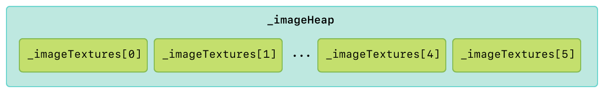
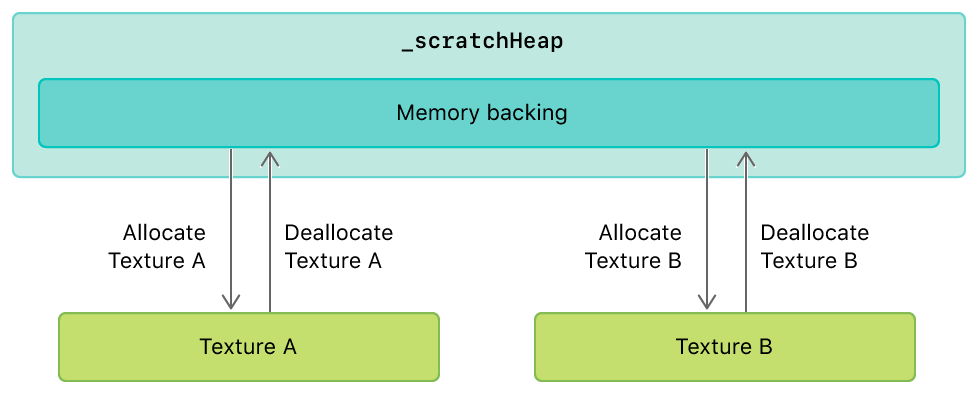
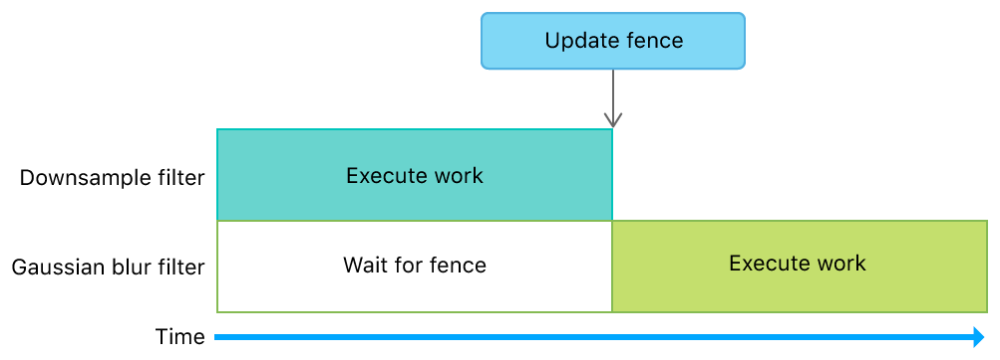
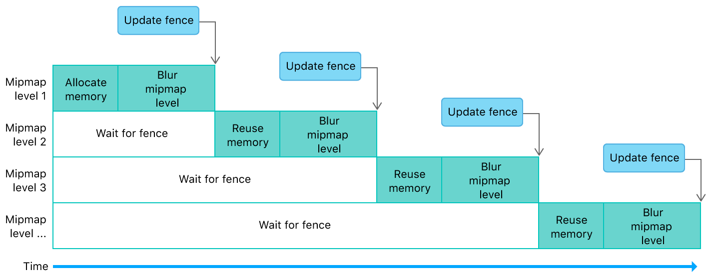

#  Image Filter Graph with Heaps and Fences

> Demonstrates how to use heaps and fences to optimize a multistage image filter.

演示如何使用堆和栅栏来优化多级图像滤镜。

## Overview

> This sample demonstrates:
>
> - Creating heaps for static and dynamic textures
>
> - Using aliasing to reduce the amount of memory used for temporary resources
>
> - Using fences to manage dependencies between encoders that produce and consume dynamic textures
>
> This implementation minimizes memory usage in an orderly fashion for a filter graph with a downsample and a Gaussian blur filter.

此示例演示：

- 为静态和动态纹理创建堆

- 使用别名来减少临时资源的内存占用

- 使用 fence 来管理生成和使用动态纹理的编码器之间的依赖关系

此实现为使用下采样和高斯模糊滤波器的滤镜图以有序的方式最小化内存使用。


## Optimize Resource Allocation and Performance

> Storing textures in a heap gives the sample more control over how resource memory is allocated and accessed. It’s also much faster to allocate resources from a heap than from a device. When resources are allocated from a device, Metal creates and tracks additional state to ensure that the resource memory is allocated, synchronized, and made available throughout the lifetime of any command buffer that needs the given resource. It does so even if the resource itself is destroyed before the command buffer begins execution.
>
> Although Metal also carries out this process for heaps, it doesn’t do so for resources within the heap. Instead, the app must perform explicit fine-grained synchronization when it creates objects from the heap and reuses memory. However, the overall cost of allocating resources from a heap is much lower than that of allocating resources from a device, particularly in the middle of a frame.

在堆中存储纹理使样本能够更好地控制资源内存的分配和访问方式。从堆中分配资源比从设备分配资源要快得多。从设备分配资源时，Metal 会创建并跟踪其他状态，以确保在需要给定资源的任何命令缓冲区的整个生命周期内，对应资源的内存是已分配的，同步的及可用的状态。即使资源本身在命令缓冲区开始执行之前被销毁，这些状态检查也会进行。

虽然 Metal 也为堆执行此过程，但它不会对堆内的资源执行此操作。相反，当应用程序从堆创建对象并重用内存时必须执行显式的细粒度同步。然而，从堆中分配资源的总成本远低于从设备分配资源的成本，特别是在帧间分配资源的时候。

## Create a Heap for Static Textures

> The sample loads image files into an array called _imageTextures. Instead of using _imageTextures directly, the sample uses _imageHeap, from which it allocates static textures. The sample creates a heap large enough to store all the static textures by aggregating their sizes. For each texture in _imageTextures, the sample calls the heapTextureSizeAndAlignWithDescriptor: method to calculate the size and alignment values required to allocate sufficient memory backing for each texture.

该示例将图像文件加载到名为 _imageTextures 的数组中。该示例使用 _imageHeap 而不是直接使用 _imageTextures 从中分配静态纹理。该示例创建了一个足够大的堆，通过聚合它们的大小来存储所有静态纹理。对于 _imageTextures 中的每个纹理，该示例调用 heapTextureSizeAndAlignWithDescriptor: 方法来计算为每个纹理分配足够内存后备所需的大小和对齐值。

```objc
for(uint32_t i = 0; i < AAPLNumImages; i++)
{
// Create a descriptor using the texture's properties
MTLTextureDescriptor *descriptor = [AAPLRenderer newDescriptorFromTexture:_imageTextures[i]
    storageMode:heapDescriptor.storageMode];

// Determine the size needed for the heap from the given descriptor
MTLSizeAndAlign sizeAndAlign = [_device heapTextureSizeAndAlignWithDescriptor:descriptor];

// Align the size so that more resources will fit after this texture
sizeAndAlign.size = alignUp(sizeAndAlign.size, sizeAndAlign.align);

// Accumulate the size required for the heap to hold this texture
heapDescriptor.size += sizeAndAlign.size;
}

// Create a heap large enough to hold all resources
_imageHeap = [_device newHeapWithDescriptor:heapDescriptor];
```

> For each texture in _imageTextures, the sample allocates a new texture, heapTexture, from the heap.

对于 _imageTextures 中的每个纹理，该示例从堆中分配一个新纹理 heapTexture 。

```objc
MTLTextureDescriptor *descriptor = [AAPLRenderer newDescriptorFromTexture:_imageTextures[i]
storageMode:_imageHeap.storageMode];

// Create a texture from the heap
id<MTLTexture> heapTexture = [_imageHeap newTextureWithDescriptor:descriptor];
```

> The sample blits the contents of _imageTextures[i] to heapTexture, and then replaces _imageTextures[i] with heapTexture.

该示例将 _imageTextures[i] 的内容 blits 到 heapTexture ，然后用 heapTexture 替换 _imageTextures[i] 。

```objc
MTLRegion region = MTLRegionMake2D(0, 0, _imageTextures[i].width, _imageTextures[i].height);

for(NSUInteger level = 0; level < _imageTextures[i].mipmapLevelCount;  level++)
{
    for(NSUInteger slice = 0; slice < _imageTextures[i].arrayLength; slice++)
    {
        [blitEncoder copyFromTexture:_imageTextures[i]
            sourceSlice:slice
            sourceLevel:level
            sourceOrigin:region.origin
            sourceSize:region.size
            toTexture:heapTexture
            destinationSlice:slice
            destinationLevel:level
            destinationOrigin:region.origin];
    }

    region.size.width /= 2;
    region.size.height /= 2;
    if(region.size.width == 0) region.size.width = 1;
    if(region.size.height == 0) region.size.height = 1;
}

// Replace the original texture with new texture from the heap
_imageTextures[i] = heapTexture;
```



## Create a Heap for Dynamic Textures

> The sample uses a separate heap, _scratchHeap, from which it allocates dynamic textures with a temporary lifetime. These textures have the same properties of the static texture being filtered in a given frame.

该示例使用单独的堆 _scratchHeap ，从中分配具有临时生命周期的动态纹理。这些纹理具有与给定帧中需要进行滤镜的静态纹理相同的属性。

```objc
id<MTLTexture> inTexture = _imageTextures[_currentImageIndex];

[self createScratchHeap:inTexture];
```

> The sample uses _scratchHeap to quickly allocate temporary textures for the downsample and Gaussian blur filters. Thus, the required size and alignment values for _scratchHeap are equal to the sum of the same required values for each filter.

该示例使用 _scratchHeap 为下采样和高斯模糊滤镜快速分配临时纹理。因此，_scratchHeap 所需的大小和对齐值等于每个过滤器所需的相同值的总和。

```objc
MTLSizeAndAlign downsampleSizeAndAlignRequirement = [_downsample      heapSizeAndAlignWithInputTextureDescriptor:descriptor];
MTLSizeAndAlign gaussianBlurSizeAndAlignRequirement = [_gaussianBlur   heapSizeAndAlignWithInputTextureDescriptor:descriptor];

NSUInteger requiredAlignment = MAX(gaussianBlurSizeAndAlignRequirement.align,  downsampleSizeAndAlignRequirement.align);
NSUInteger gaussianBlurSizeAligned = alignUp(gaussianBlurSizeAndAlignRequirement.size, requiredAlignment);
NSUInteger downsampleSizeAligned = alignUp(downsampleSizeAndAlignRequirement.size, requiredAlignment);
NSUInteger requiredSize = gaussianBlurSizeAligned + downsampleSizeAligned;

if(!_scratchHeap || requiredSize > [_scratchHeap maxAvailableSizeWithAlignment:requiredAlignment])
{
    MTLHeapDescriptor *heapDesc = [[MTLHeapDescriptor alloc] init];

    heapDesc.size        = requiredSize;
    heapDesc.storageMode = heapStorageMode;

    _scratchHeap = [_device newHeapWithDescriptor:heapDesc];
}
```

> Any textures allocated from _scratchHeap can also be deallocated, which allows the sample to reuse that same memory backing to allocate another texture. This memory reuse is known as aliasing.

从 _scratchHeap 分配的任何纹理也可以被释放，这允许样本重用相同的内存后备来分配另一个纹理。此内存重用称为别名。



## Manage Dependencies Between Filters

> The sample uses _fence to control access to dynamic textures allocated from _scratchHeap and prevent GPU race conditions in the filter graph. This fence ensures that operations on dynamic textures are completed before the filter graph begins subsequent operations that depend on the results of previous operations.
>
> The first filter, implemented by the sample in AAPLDownsampleFilter, creates a dynamic texture, outTexture, from the heap and allocates enough space for mipmaps.

该示例使用 _fence 来控制对从 _scratchHeap 分配的动态纹理的访问，并防止过滤器图中的 GPU 竞争条件。该 fence 确保在过滤器图形开始后续操作之前完成对动态纹理的操作，这些后续操作取决于先前操作的结果。

示例 AAPLDownsampleFilter 中实现的第一个过滤器从堆创建动态纹理 outTexture ，并为 mipmap 分配足够的空间。

```objc
MTLTextureDescriptor *textureDescriptor = [MTLTextureDescriptor    texture2DDescriptorWithPixelFormat:inTexture.pixelFormat
width:inTexture.width
height:inTexture.height
mipmapped:YES];
textureDescriptor.storageMode = heap.storageMode;
textureDescriptor.usage = MTLTextureUsageShaderWrite | MTLTextureUsageShaderRead;

id <MTLTexture> outTexture = [heap newTextureWithDescriptor:textureDescriptor];
```

> The downsample filter then blits a source texture, inTexture, to outTexture and generates the mipmaps.

然后，下采样过滤器将源纹理 inTexture blit 到 outTexture 并生成 mipmap 。

```objc
[blitCommandEncoder copyFromTexture:inTexture
    sourceSlice:0
    sourceLevel:0
    sourceOrigin:(MTLOrigin){ 0, 0, 0 }
    sourceSize:(MTLSize){ inTexture.width, inTexture.height, inTexture.depth }
    toTexture:outTexture
    destinationSlice:0
    destinationLevel:0
    destinationOrigin:(MTLOrigin){ 0, 0, 0}];

[blitCommandEncoder generateMipmapsForTexture:outTexture];
```

> Finally, the downsample filter calls the updateFence: and endEncoding methods to indicate that its operations are complete.

最后，下采样过滤器调用 updateFence: 和 endEncoding 方法来指示其操作已完成。

```objc
[blitCommandEncoder updateFence:fence];

[blitCommandEncoder endEncoding];
```

> The second filter, implemented by the sample in AAPLGaussianBlurFilter, calls waitForFence: immediately after creating a compute command encoder. This forces the Gaussian blur filter to wait for the downsample filter to complete its work before beginning its own work. A waiting period is necessary because the Gaussian blur filter depends on dynamic texture data generated by the downsample filter. Without the fence, the GPU could execute both filters in parallel, and thus read uninitialized dynamic texture data allocated from the heap.

示例 AAPLGaussianBlurFilter 中实现的第二个过滤器，在创建计算命令编码器后立即调用 waitForFence: 。这会强制高斯模糊滤镜在开始自己的工作之前等待下采样滤镜完成其工作。等待时间是必要的，因为高斯模糊滤波器依赖于由下采样滤波器生成的动态纹理数据。没有 fence 的话，GPU 会并行执行两个过滤器，进而会导致读取从堆分配的未初始化的动态纹理数据。

```objc
[computeEncoder waitForFence:fence];
```



## Reuse Memory and Manage Dependencies Within a Filter

> The Gaussian blur filter performs a horizontal blur and a vertical blur for each mipmap level of the dynamic texture produced by the downsample filter. For each mipmap level, the sample allocates a temporary texture, intermediaryTexture, from the dynamic textures heap.

高斯模糊滤波器对由下采样滤波器产生的动态纹理的每个 mipmap 级别执行水平模糊和垂直模糊。对于每个 mipmap 级别，该示例从动态纹理堆中分配临时纹理，intermediateTexture 。

```objc
id <MTLTexture> intermediaryTexture = [heap newTextureWithDescriptor:textureDescriptor];
```

> This texture is temporary because it’s used only as an output destination from the horizontal blur and as an input source to the vertical blur. After the sample executes these blurs, the final texture data is stored in outTexture (which is a texture view of inTexture). Therefore, the texture data contained in intermediaryTexture is unused after each mipmap level iteration.

此纹理是临时的，因为它仅用作水平模糊的输出目标，并用作垂直模糊的输入源。执行这些模糊之后，最终的纹理数据存储在outTexture（这是 inTexture 的纹理视图）中。因此，在每个 mipmap 级别迭代之后，intermediateTexture 中包含的纹理数据就不会被使用了。

```objc
// Perform horizontal blur using the input texture as an input
// and a view of the mipmap level of input texture as the output

[computeEncoder setComputePipelineState:_horizontalKernel];

[computeEncoder setTexture:inTexture
atIndex:AAPLBlurTextureIndexInput];

[computeEncoder setTexture:intermediaryTexture
atIndex:AAPLBlurTextureIndexOutput];

[computeEncoder setBytes:&mipmapLevel
length:sizeof(mipmapLevel)
atIndex:AAPLBlurBufferIndexLOD];

[computeEncoder dispatchThreadgroups:threadgroupCount
threadsPerThreadgroup:threadgroupSize];

// Perform vertical blur using the horizontally blurred texture as an input
// and a view of the mipmap level of the input texture as the output

[computeEncoder setComputePipelineState:_verticalKernel];

[computeEncoder setTexture:intermediaryTexture
atIndex:AAPLBlurTextureIndexInput];

[computeEncoder setTexture:outTexture
atIndex:AAPLBlurTextureIndexOutput];

static const uint32_t mipmapLevelZero = 0;
[computeEncoder setBytes:&mipmapLevelZero
length:sizeof(mipmapLevelZero)
atIndex:AAPLBlurBufferIndexLOD];

[computeEncoder dispatchThreadgroups:threadgroupCount
threadsPerThreadgroup:threadgroupSize];
```

> Instead of allocating new memory for each mipmap level, the sample reuses the existing memory allocated for intermediaryTexture. After each mipmap level iteration, the sample calls the makeAliasable method to indicate that this memory can be reused by subsequent allocations from the same dynamic textures heap.

该示例重用为 intermediaryTexture 分配的已经存在的内存，而不是为每个 mipmap 级别分配新内存。每次 mipmap 级别迭代之后，该示例调用 makeAliasable 方法以指示此内存可以被后续来自相同动态纹理堆的分配重用。

```objc
[intermediaryTexture makeAliasable];
```

> This memory reuse creates dynamic texture dependencies between mipmap levels. Therefore, after blurring each mipmap level, the sample calls the updateFence: and endEncoding methods to indicate that the blur operations are complete.

这样的内存重用会在 mipmap 级别之间创建动态纹理依赖性。因此，在模糊每个 mipmap 级别之后，示例调用 updateFence: 和 endEncoding 方法来指示模糊操作已完成。

```objc
[computeEncoder updateFence:fence];

[computeEncoder endEncoding];
```

> Because the sample already calls the waitForFence: method to wait for the downsample filter to complete its work, the sample leverages this same call to wait for any previous mipmap levels to complete their work before beginning a new mipmap level iteration.

由于示例已调用 waitForFence: 方法等待下采样过滤器完成其工作，因此该示例利用此同一调用等待任何先前的 mipmap 级别完成其工作，然后再开始新的 mipmap 级别迭代。


