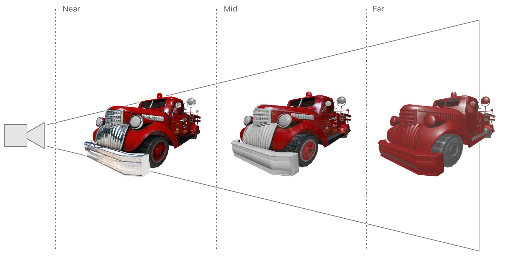

#  LOD with Function Specialization

> Demonstrates how to use specialized functions to select a level of detail based on dynamic conditions.

演示如何使用专用函数根据动态条件选择细节级别。

## Overview

> A high-quality gaming experience has to manage trade-offs between great graphics and great performance. High-quality models look great, but their complexity requires a significant amount of processing power. By increasing or decreasing the level of detail (LOD) of a model, games can selectively manage both graphics and performance.

高品质的游戏体验必须在卓越的图形和卓越的性能之间进行权衡。高质量的模型看起来很棒，但它们的复杂性需要大量的处理能力。 通过增加或减少模型的细节水平（ LOD ），游戏可以选择性地管理图形和性能。


> Instead of selecting a fixed LOD at build time, games can dynamically select between a range of LODs at runtime based on certain model-view conditions. For example, a focal-point foreground model could have a high LOD, whereas a fast-moving background model could have a low LOD.
>
> This sample demonstrates dynamic LOD selection for a fire truck model, based on its distance from the scene’s camera. When the model is closer to the camera, the renderer uses a higher LOD; when the model is further from the camera, the renderer uses a lower LOD.

游戏可以在运行时基于特定的模型视图条件在一系列 LOD 之间动态地选择，而不是在构建时选择固定 LOD 。例如，焦点前景模型可以具有高 LOD ，而快速移动的背景模型可以具有低 LOD 。

此示例演示了消防车模型的动态 LOD 选择，基于其与场景摄像机的距离。当模型离相机较近时，渲染器使用较高的 LOD ；当模型离相机较远时，渲染器使用较低的 LOD 。



## GPU Branch Statements

> Unlike CPU code, graphics processing unit (GPU) branch statements like if and else are very expensive. The massively parallel architecture of GPUs isn’t particularly well suited to handling GPU functions that have many branches. More branches result in more register allocations and thus decrease the number of GPU threads that can execute concurrently. Nevertheless, branch statements are useful programming constructs, particularly for functions that share a lot of code. In fact, a common problem for graphics functions that share code is how to handle a branch condition that differs only between draw calls, not between individual threads executing within a single draw call.
>
> Traditionally, branches that differ between draw calls are mitigated in one of these ways:
>
> - Writing per-branch functions. Each branch is written as a complete and separate function, and the render loop determines which function to use at runtime. This approach greatly increases code duplication because all possible outcomes of each branch condition require their own standalone function. For example, a single if statement requires one function for the true outcome and another function for the false outcome.
>
> - Using preprocessor directives. Instead of using a regular if statement, functions can use the #if preprocessor directive that selectively compiles a function after evaluating its branch conditions. This approach avoids code duplication but reduces the performance benefits of precompiled Metal shading language code. Because the branch conditions can only be evaluated at runtime, the functions can’t be precompiled at build time.
>
> Metal’s function specialization feature reduces branch performance costs, avoids code duplication, and leverages build time compilation. Function specialization allows you to create multiple executable versions of a single source function. You create specialized functions by declaring function constants in your Metal shading language code and setting their values at runtime. Doing so allows the front-end compiler to precompile your source function at build time and the back-end compiler to compile the specialized function at runtime, when the pipeline is created.

与 CPU 代码不同，图形处理单元（ GPU ）分支语句（如 if 和 else ）非常昂贵。GPU 的大规模并行架构不是特别适合处理具有许多分支的 GPU 功能。更多分支导致更多的寄存器分配，从而减少可以并发执行的 GPU 线程的数量。然而，分支语句是有用的编程结构，特别是对于共享大量代码的函数。实际上，共享代码的图形函数的一个常见问题是如何处理仅在绘制调用之间而不是在单个绘制调用中执行的各个线程之间的分支条件。

传统上，绘制调用之间不同的分支可以通过以下方式之一进行缓解：

- 编写每个分支函数。每个分支都写为完整且独立的函数，渲染循环在运行时确定使用哪个函数。这种方法极大地增加了代码重复，因为每个分支条件的所有可能结果都需要它们自己的独立函数。例如，单个 if 语句需要一个函数用于条件 true ，另一个函数用于条件 false 。

- 使用预处理程序指令。函数可以使用 #if 预处理程序指令，而不是使用常规的 if 语句，该指令在评估其分支条件后有选择地编译函数。这种方法避免了代码重复，但降低了预编译的 Metal 着色语言代码的性能优势。由于分支条件只能在运行时进行评估，因此无法在构建时预编译这些函数。

Metal 的函数专用功能可降低分支性能成本，避免代码重复，并利用构建时编译。函数专业化允许你创建单个源函数的多个可执行版本。你可以通过在 Metal 着色语言代码中声明函数常量并在运行时设置它们来创建专用函数。这样做允许前端编译器在构建时预编译源函数，并允许后端编译器在创建管道时在运行时编译专用函数。

## Define Your LOD Selection Criteria

> This sample demonstrates function specialization by creating different render pipelines for different LODs. All of the pipelines share the same source function, but function constants determine LOD-specific paths and inputs for each pipeline. Specifically, the sample demonstrates dynamic LOD selection for a fire truck model, based on its distance from the scene’s camera. When the fire truck is close to the camera, it occupies more pixels on the screen; therefore, the sample uses a high-quality render pipeline. When the fire truck is far from the camera, it occupies fewer pixels on the screen; therefore, the sample uses a low-quality render pipeline.
>
> The fire truck model in this sample uses many types of textures, such as albedo, normal, metallic, roughness, ambient occlusion, and irradiance. It’s too wasteful to sample from each of these textures when the model is far from the camera because the detail provided by the full combination of textures isn’t seen. The sample uses various function constant values to create specialized functions that sample from more or fewer textures, depending on the selected LOD. Additionally, specialized functions that sample from fewer textures also perform less complex computations and result in a faster render pipeline.
>
> The isTexturedProperty:atQualityLevel: method controls whether a material property is set by sampling from a texture or by reading a constant value.

此示例通过为不同的 LOD 创建不同的渲染管道来演示函数特化。所有管道共享相同的源函数，但函数常量确定每个管道的 LOD 特定路径和输入。具体而言，该示例演示了消防车模型的动态 LOD 选择，基于其与场景摄像机的距离。当消防车靠近相机时，它在屏幕上占据更多像素；因此，该示例使用高质量的渲染管道。当消防车离相机很远时，它在屏幕上占用的像素较少；因此，该示例使用低质量的渲染管道。

此示例中的消防车模型使用多种类型的纹理，例如反照率，法线，金属，粗糙度，环境遮挡和辐照度。当模型远离相机时，在每个纹理上都进行采样太浪费了，因为由这些纹理完整组合提供的细节已经看不出来了。该示例使用各种函数常量值来创建从更多或更少纹理中采样的特殊函数，具体取决于所选的 LOD 。此外，从较少纹理中采样的专用函数也执行较不复杂的计算，从而产生更快的渲染管道。

isTexturedProperty:atQualityLevel: 方法控制是通过从纹理采样还是通过读取常量值来设置材质属性。

```objc
+ (BOOL)isTexturedProperty:(AAPLFunctionConstant)propertyIndex atQualityLevel:(AAPLQualityLevel)quality
{
AAPLQualityLevel minLevelForProperty = AAPLQualityLevelHigh;

switch(propertyIndex)
{
    case AAPLFunctionConstantBaseColorMapIndex:
    case AAPLFunctionConstantIrradianceMapIndex:
        minLevelForProperty = AAPLQualityLevelMedium;
        break;
    default:
        break;
}

return quality <= minLevelForProperty;
}
```

## Implement Specialized Functions

> The sample uses six function constants to control the various inputs available to the fragmentLighting fragment function.

该示例使用六个函数常量来控制 fragmentLighting 片段函数可用的各种输入。

```objc
constant bool has_base_color_map        [[ function_constant(AAPLFunctionConstantBaseColorMapIndex) ]];
constant bool has_normal_map            [[ function_constant(AAPLFunctionConstantNormalMapIndex) ]];
constant bool has_metallic_map          [[ function_constant(AAPLFunctionConstantMetallicMapIndex) ]];
constant bool has_roughness_map         [[ function_constant(AAPLFunctionConstantRoughnessMapIndex) ]];
constant bool has_ambient_occlusion_map [[ function_constant(AAPLFunctionConstantAmbientOcclusionMapIndex) ]];
constant bool has_irradiance_map        [[ function_constant(AAPLFunctionConstantIrradianceMapIndex) ]];
```

> The sample also declares a derived function constant, has_any_map, that’s used in the vertexTransform vertex function. This value determines whether the render pipeline requires the vertex function to output a texture coordinate to the ColorInOut.texCoord return value.

该示例还声明了一个派生函数常量 has_any_map ，它在 vertexTransform 顶点函数中使用。此值确定渲染管道是否需要顶点函数将纹理坐标输出到 ColorInOut.texCoord 返回值。

```objc
constant bool has_any_map = (has_base_color_map        ||
has_normal_map            ||
has_metallic_map          ||
has_roughness_map         ||
has_ambient_occlusion_map ||
has_irradiance_map);
```

> When the value of has_any_map is false, the vertex function does not write a value to the texCoord member.

当 has_any_map 的值为 false 时，顶点函数不会将值写入 texCoord 成员。

```objc
if (has_any_map)
{
    out.texCoord = in.texCoord;
}
```

> The function constants control the source of a parameter to the lighting computation in the calculateParameters() function. When you use the [[function_constant(index)]] attribute, this function can determine whether it should sample from a texture. The function only samples from a texture if the attribute indicates that a texture parameter is present; otherwise, it reads a uniform value from the materialUniforms buffer.

函数常量控制 calculateParameters() 函数中的关照计算的参数源。使用 [[function_constant(index)]] 属性时，此函数可以确定是否应从纹理中进行采样。如果属性指示存在纹理参数，则该函数仅从纹理中采样；否则，它从 materialUniforms 缓冲区读取一个 uniform 值。

```objc
LightingParameters calculateParameters(ColorInOut in,
constant AAPLUniforms         & uniforms,
constant AAPLMaterialUniforms & materialUniforms,
texture2d<float>   baseColorMap        [[ function_constant(has_base_color_map) ]],
texture2d<float>   normalMap           [[ function_constant(has_normal_map) ]],
texture2d<float>   metallicMap         [[ function_constant(has_metallic_map) ]],
texture2d<float>   roughnessMap        [[ function_constant(has_roughness_map) ]],
texture2d<float>   ambientOcclusionMap [[ function_constant(has_ambient_occlusion_map) ]],
texturecube<float> irradianceMap       [[ function_constant(has_irradiance_map) ]])
```

> The corresponding inputs to the fragment function also use the same function constants.

片段函数的相应输入也使用相同的函数常量。

```objc
fragment float4
fragmentLighting(ColorInOut in [[stage_in]],
constant AAPLUniforms         & uniforms         [[ buffer(AAPLBufferIndexUniforms) ]],
constant AAPLMaterialUniforms & materialUniforms [[ buffer(AAPLBufferIndexMaterialUniforms) ]],
texture2d<float>   baseColorMap         [[ texture(AAPLTextureIndexBaseColor),        function_constant(has_base_color_map) ]],
texture2d<float>   normalMap            [[ texture(AAPLTextureIndexNormal),           function_constant(has_normal_map) ]],
texture2d<float>   metallicMap          [[ texture(AAPLTextureIndexMetallic),         function_constant(has_metallic_map) ]],
texture2d<float>   roughnessMap         [[ texture(AAPLTextureIndexRoughness),        function_constant(has_roughness_map) ]],
texture2d<float>   ambientOcclusionMap  [[ texture(AAPLTextureIndexAmbientOcclusion), function_constant(has_ambient_occlusion_map) ]],
texturecube<float> irradianceMap        [[ texture(AAPLTextureIndexIrradianceMap),    function_constant(has_irradiance_map)]])
```

## Create Different Pipelines

> This sample uses three different MTLRenderPipelineState objects, each representing a different LOD. Specializing functions and building pipelines is expensive, so the sample performs these tasks asynchronously before starting the render loop. When the AAPLRenderer object is initialized, each LOD pipeline is created asynchronously by using dispatch groups, completion handlers, and notification blocks.
>
> The sample creates six specialized functions overall: one vertex and one fragment function for each of the three LODs. This task is monitored by the specializationGroup dispatch group, and each function is specialized by calling the newFunctionWithName:constantValues:completionHandler: method.

此示例使用三个不同的 MTLRenderPipelineState 对象，每个对象代表不同的 LOD 。函数专门化和管道构建是很昂贵的，因此示例在启动渲染循环之前异步执行这些任务。当 AAPLRenderer 对象被初始化时，通过使用调度组，完成处理程序和通知块异步地创建每个 LOD 管道。

该示例总共创建了六个专用函数：三个 LOD 中的每个都有一个顶点和一个片段函数。此任务由 specializationGroup 调度组监视，并且每个函数都通过调用 newFunctionWithName:constantValues:completionHandler: 方法来专门化。

```objc
for (uint qualityLevel = 0; qualityLevel < AAPLNumQualityLevels; qualityLevel++)
{
    dispatch_group_enter(specializationGroup);

    MTLFunctionConstantValues* constantValues = [self functionConstantsForQualityLevel:qualityLevel];

    [defaultLibrary newFunctionWithName:@"fragmentLighting" constantValues:constantValues
    completionHandler:^(id<MTLFunction> newFunction, NSError *error )
        {
            if (!newFunction)
            {
                NSLog(@"Failed to specialize function, error %@", error);
            }

            self->_fragmentFunctions[qualityLevel] = newFunction;
            dispatch_group_leave(specializationGroup);
    }];

    dispatch_group_enter(specializationGroup);

    [defaultLibrary newFunctionWithName:@"vertexTransform" constantValues:constantValues
    completionHandler:^(id<MTLFunction> newFunction, NSError *error )
    {
        if (!newFunction)
        {
            NSLog(@"Failed to specialize function, error %@", error);
        }

        self->_vertexFunctions[qualityLevel] = newFunction;
        dispatch_group_leave(specializationGroup);
    }];
}
```

> The notifyBlock block builds the three render pipelines. This task is monitored by the _pipelineCreationGroup dispatch group, and each pipeline is built by calling the newRenderPipelineStateWithDescriptor:completionHandler: method.

notifyBlock 块构建三个渲染管道。此任务由 _pipelineCreationGroup 调度组监视，并且每个管道都是通过调用 newRenderPipelineStateWithDescriptor:completionHandler: 方法构建的。

```objc
dispatch_group_enter(_pipelineCreationGroup);

void (^notifyBlock)(void) = ^void()
{
    const id<MTLDevice> device  = self->_device;
    const dispatch_group_t pipelineCreationGroup = self->_pipelineCreationGroup;

    MTLRenderPipelineDescriptor *pipelineStateDescriptors[AAPLNumQualityLevels];

    dispatch_group_wait(specializationGroup, DISPATCH_TIME_FOREVER);

    for (uint qualityLevel = 0; qualityLevel < AAPLNumQualityLevels; qualityLevel++)
    {
        dispatch_group_enter(pipelineCreationGroup);

        pipelineStateDescriptors[qualityLevel] = [pipelineStateDescriptor copy];
        pipelineStateDescriptors[qualityLevel].fragmentFunction = self->_fragmentFunctions[qualityLevel];
        pipelineStateDescriptors[qualityLevel].vertexFunction = self->_vertexFunctions[qualityLevel];

        [device newRenderPipelineStateWithDescriptor:pipelineStateDescriptors[qualityLevel]
        completionHandler:^(id<MTLRenderPipelineState> newPipelineState, NSError *error )
        {
            if (!newPipelineState)
                NSLog(@"Failed to create pipeline state, error %@", error);

            self->_pipelineStates[qualityLevel] = newPipelineState;
            dispatch_group_leave(pipelineCreationGroup);
        }];
    }

    dispatch_group_leave(pipelineCreationGroup);
};

dispatch_group_notify(specializationGroup, pipelineQueue, notifyBlock);
```

## Render with a Specific LOD

> At the beginning of the render loop, for each frame, the sample calls the _calculateQualityAtDistance: method to update the _currentQualityLevel value. This value defines the LOD for the frame based on the distance between the model and the camera. The _calculateQualityAtDistance: method also sets a _globalMapWeight value that creates a smooth transition between LOD boundaries.

在渲染循环的开始，对于每帧，该示例调用 _calculateQualityAtDistance: 方法来更新 _currentQualityLevel 值。此值根据模型和相机之间的距离为帧定义 LOD 。_calculateQualityAtDistance: 方法还设置 _globalMapWeight 值，以在 LOD 边界之间创建平滑过渡。

```objc
- (void)calculateQualityAtDistance:(float)distance
{
    static const float MediumQualityDepth     = 150.f;
    static const float LowQualityDepth        = 650.f;
    static const float TransitionDepthAmount  = 50.f;

    assert(distance >= 0.0f);
    if (distance < MediumQualityDepth)
    {
        static const float TransitionDepth = MediumQualityDepth - TransitionDepthAmount;
        if(distance > TransitionDepth)
        {
            _globalMapWeight = distance - TransitionDepth;
            _globalMapWeight /= TransitionDepthAmount;
            _globalMapWeight = 1.0 - _globalMapWeight;
        }
        else
        {
            _globalMapWeight = 1.0;
        }
        _currentQualityLevel = AAPLQualityLevelHigh;
    }
    else if (distance < LowQualityDepth)
    {
        static const float TransitionDepth = LowQualityDepth - TransitionDepthAmount;
        if(distance > TransitionDepth)
        {
            _globalMapWeight = distance - (TransitionDepth);
            _globalMapWeight /= TransitionDepthAmount;
            _globalMapWeight = 1.0 - _globalMapWeight;
        }
        else
        {
            _globalMapWeight = 1.0;
        }
        _currentQualityLevel = AAPLQualityLevelMedium;
    }
    else
    {
        _currentQualityLevel = AAPLQualityLevelLow;
        _globalMapWeight = 0.0;
    }
}
```

> The updated _currentQualityLevel value is used to set the corresponding MTLRenderPipelineState object for the frame.

更新的 _currentQualityLevel 值用于为帧设置相应的 MTLRenderPipelineState 对象。

```objc
[renderEncoder setRenderPipelineState:_pipelineStates[_currentQualityLevel]];
```

> The updated _globalMapWeight value is used to interpolate between quality levels and prevent abrupt LOD transitions.

更新后的 _globalMapWeight 值用于在质量级别之间进行插值，并防止突兀的 LOD 转换。

```objc
[submesh computeTextureWeightsForQualityLevel:_currentQualityLevel
withGlobalMapWeight:_globalMapWeight];
```

> Finally, the render loop draws each submesh in the model with the specific LOD pipeline.

最后，渲染循环使用特定的 LOD 管道绘制模型中的每个子网格。

```objc
[renderEncoder drawIndexedPrimitives:metalKitSubmesh.primitiveType
indexCount:metalKitSubmesh.indexCount
indexType:metalKitSubmesh.indexType
indexBuffer:metalKitSubmesh.indexBuffer.buffer
indexBufferOffset:metalKitSubmesh.indexBuffer.offset];
```
