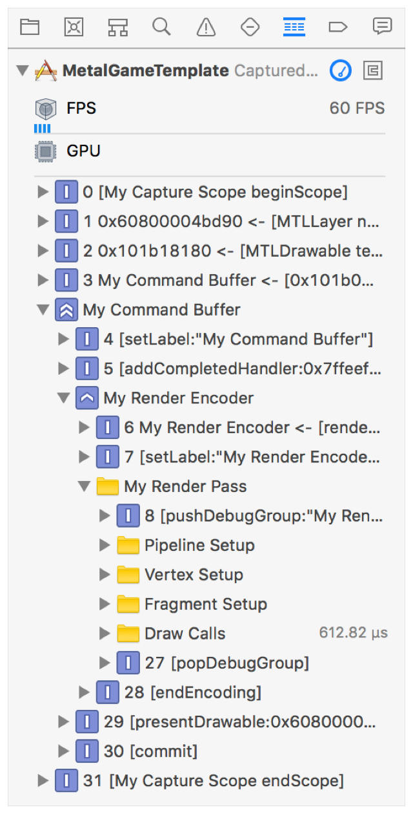

#  Labeling Metal Objects and Commands

> Assign meaningful labels to your Metal objects and commands so you can easily identify them in the call list of a captured frame.

为 Metal 对象和命令分配有意义的标签，以便你可以在捕获的帧的调用列表中轻松识别它们。

## Overview

> Object and command labels are useful identifiers at runtime or when profiling and debugging your app using any Metal tool.
>
> Note - The properties and methods described here don't affect the graphics rendering or compute processing behavior of your app.

对象和命令标签在运行时或使用任何 Metal 工具分析和调试应用程序时都是有用的标识符。

注意 - 此处描述的属性和方法不会影响应用程序的图形渲染或计算处理行为。

## Label Objects

> Many Metal objects provide a label property that you can assign a meaningful string to. These labels appear in the Metal tools, allowing you to easily identify specific objects.
>
> Additionally, the [addDebugMarker:range:](https://developer.apple.com/documentation/metal/mtlbuffer/1779576-adddebugmarker?language=objc) method allows you to easily mark and identify specific data ranges within a [MTLBuffer](https://developer.apple.com/documentation/metal/mtlbuffer?language=objc).

许多 Metal 对象都提供了一个 label 属性，你可以为其指定有意义的字符串。这些标签出现在 Metal 工具中，使你可以轻松识别特定对象。

此外，[addDebugMarker:range:](https://developer.apple.com/documentation/metal/mtlbuffer/1779576-adddebugmarker?language=objc) 方法允许你轻松标记 [MTLBuffer](https://developer.apple.com/documentation/metal/mtlbuffer?language=objc) 中的特定数据范围。

## Label Commands

> Command buffers and command encoders provide the following methods that allow you to easily identify specific groups of Metal commands in your app:
>
> - MTLCommandBuffer. [pushDebugGroup:](https://developer.apple.com/documentation/metal/mtlcommandbuffer/2869550-pushdebuggroup?language=objc), [popDebugGroup](https://developer.apple.com/documentation/metal/mtlcommandbuffer/2869549-popdebuggroup?language=objc).
>
> - MTLCommandEncoder. [pushDebugGroup:](https://developer.apple.com/documentation/metal/mtlcommandencoder/1458041-pushdebuggroup?language=objc), [popDebugGroup](https://developer.apple.com/documentation/metal/mtlcommandencoder/1458040-popdebuggroup?language=objc), [insertDebugSignpost:](https://developer.apple.com/documentation/metal/mtlcommandencoder/1458034-insertdebugsignpost?language=objc).
>
> Use these methods to simplify your app development process, particularly for tasks that use many Metal commands per buffer or encoder.
>
> Debug groups are pushed and popped onto unique stacks that exist only within the lifetime of their associated [MTLCommandBuffer](https://developer.apple.com/documentation/metal/mtlcommandbuffer?language=objc) or [MTLCommandEncoder](https://developer.apple.com/documentation/metal/mtlcommandencoder?language=objc). You can nest debug groups by pushing multiple groups onto the stack before popping previous groups from the stack.
>
> The following example demonstrates how to push and pop multiple debug groups.

命令缓冲区和命令编码器提供以下方法，使你可以轻松标识应用程序中特定的 Metal 命令组：

- MTLCommandBuffer。[pushDebugGroup:](https://developer.apple.com/documentation/metal/mtlcommandbuffer/2869550-pushdebuggroup?language=objc) ，[popDebugGroup](https://developer.apple.com/documentation/metal/mtlcommandbuffer/2869549-popdebuggroup?language=objc) 。

- MTLCommandEncoder。[pushDebugGroup:](https://developer.apple.com/documentation/metal/mtlcommandencoder/1458041-pushdebuggroup?language=objc) ，[popDebugGroup](https://developer.apple.com/documentation/metal/mtlcommandencoder/1458040-popdebuggroup?language=objc) ，[insertDebugSignpost:](https://developer.apple.com/documentation/metal/mtlcommandencoder/1458034-insertdebugsignpost?language=objc) 。

使用这些方法可以简化应用程序开发过程，尤其是对于每个缓冲区或编码器使用许多 Metal 命令的任务。

存在与 [MTLCommandBuffer](https://developer.apple.com/documentation/metal/mtlcommandbuffer?language=objc) 或 [MTLCommandEncoder](https://developer.apple.com/documentation/metal/mtlcommandencoder?language=objc) 关联的唯一堆栈，该堆栈只存在于关联对象的生命周期中，可以将调试组在该堆栈上进行 push 和 pop 操作。可以通过在 pop 之前组之前 push 多个组到堆栈上来嵌套调试组。

以下示例演示如何 push 和 pop 多个调试组。

```objc
id<MTLRenderCommandEncoder> renderEncoder = [commandBuffer renderCommandEncoderWithDescriptor:renderPassDescriptor];
renderEncoder.label = @"My Render Encoder";
[renderEncoder pushDebugGroup:@"My Render Pass"];

[renderEncoder pushDebugGroup:@"Pipeline Setup"];
// Render pipeline commands
[renderEncoder popDebugGroup]; // Pops "Pipeline Setup"

[renderEncoder pushDebugGroup:@"Vertex Setup"];
// Vertex function commands
[renderEncoder popDebugGroup]; // Pops "Vertex Setup"

[renderEncoder pushDebugGroup:@"Fragment Setup"];
// Fragment function commands
[renderEncoder popDebugGroup]; // Pops "Fragment Setup"

[renderEncoder pushDebugGroup:@"Draw Calls"];
// Drawing commands
[renderEncoder popDebugGroup]; // Pops "Draw Calls"

[renderEncoder popDebugGroup]; // Pops "My Render Pass"
[renderEncoder endEncoding];
```

> The following illustration shows how the debug groups appear in Xcode's debug navigator after performing a GPU capture.

下图显示了执行 GPU 捕获后调试组在 Xcode 的调试导航器中的显示方式。


