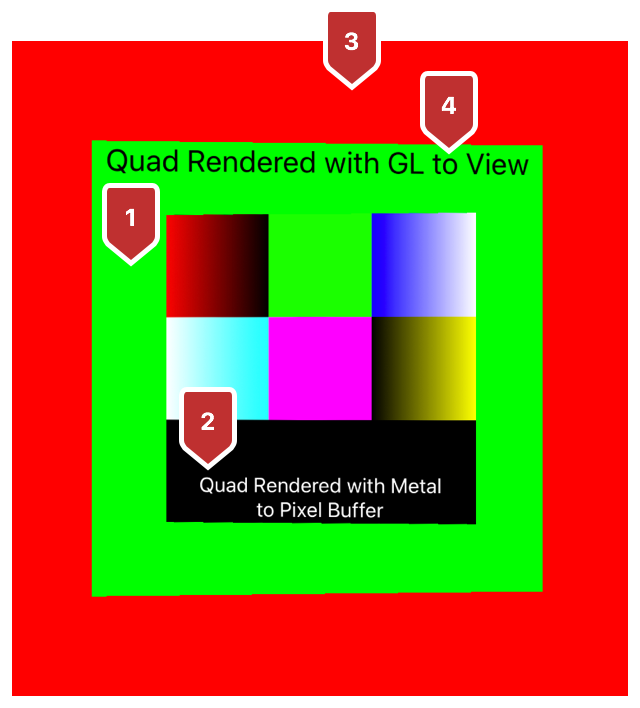
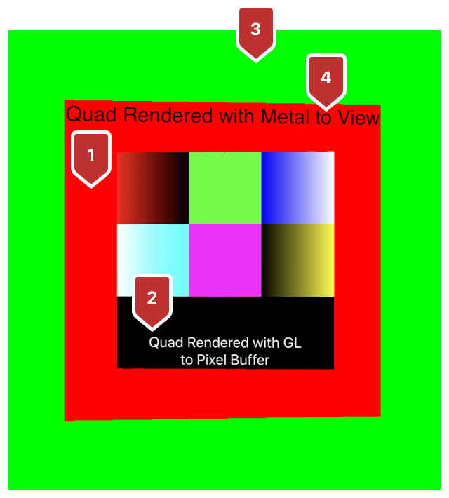

#  Mixing Metal and OpenGL Rendering in a View

> Draw with Metal and OpenGL in the same view using an interoperable texture.

使用可互操作的纹理在同一视图中使用 Metal 和 OpenGL 绘图。

## Overview

> If you’re developing a new app and migrating legacy OpenGL code to Metal, interoperable textures make it easy for you to see the results live as you go.
>
> You can render Metal or OpenGL content into either view by initializing a [CVPixelBuffer](https://developer.apple.com/documentation/corevideo/cvpixelbuffer?language=objc) that operates as an interoperable texture. When you enable the pixel buffer’s Metal and OpenGL compatibility flags, the textures are capable of being drawn to—and presented by—either rendering technology.
>
> If you’re working with an app you’ve already deployed, the interoperable textures give you the option of incrementally releasing updates throughout the porting process.

如果你正在开发一个新的应用程序并将传统的 OpenGL 代码迁移到 Metal ，可互操作的纹理使你可以轻松地实时查看结果。

你可以通过初始化作为可互操作纹理的 [CVPixelBuffer](https://developer.apple.com/documentation/corevideo/cvpixelbuffer?language=objc) ，将 Metal 或 OpenGL 内容渲染到任一视图中。当启用像素缓冲区的 Metal 和 OpenGL 兼容性标记时，纹理可以通过任一渲染技术绘制并呈现。

如果你正在使用已经部署的应用程序，则可互操作的纹理可让你选择在整个移植过程中逐步释放更新。

## Select a Compatible Pixel Format

> To create an interoperable texture, select a Core Video pixel format, a Metal pixel format, and an OpenGL internal format that are compatible with each other. This sample provides you with a table preloaded with compatible options, and selects one based on the desired Metal pixel format:

要创建可互操作的纹理，请选择彼此兼容的 Core Video 像素格式，Metal 像素格式和 OpenGL 内部格式。此示例为你提供了预先加载了兼容选项的表，并根据所需的 Metal 像素格式选择一个：

```objc
for(int i = 0; i < AAPLNumInteropFormats; i++) {
    if(pixelFormat == AAPLInteropFormatTable[i].mtlFormat) {
        return &AAPLInteropFormatTable[i];
    }
}
```

## Create an Interoperable Texture

> Use a CVPixelBuffer as an interoperable texture to get a shared memory backing that’s synchronized across both renderers. To create the CVPixelBuffer, provide your Core Video pixel format and enable OpenGL and Metal compatibility:

使用 CVPixelBuffer 作为可互操作的纹理，以获得在两个渲染器之间同步的共享内存支持。要创建 CVPixelBuffer ，提供 Core Video 像素格式并启用 OpenGL 和 Metal 兼容性：

```objc
NSDictionary* cvBufferProperties = @{
(__bridge NSString*)kCVPixelBufferOpenGLCompatibilityKey : @YES,
(__bridge NSString*)kCVPixelBufferMetalCompatibilityKey : @YES,
};
CVReturn cvret = CVPixelBufferCreate(kCFAllocatorDefault,
size.width, size.height,
_formatInfo->cvPixelFormat,
(__bridge CFDictionaryRef)cvBufferProperties,
&_CVPixelBuffer);
```

## For macOS, Create an OpenGL Texture from the Pixel Buffer

> Start by creating an OpenGL Core Video texture cache from the pixel buffer:

首先从像素缓冲区创建 OpenGL Core Video 纹理缓存：

```objc
cvret  = CVOpenGLTextureCacheCreate(
kCFAllocatorDefault,
nil,
_openGLContext.CGLContextObj,
_CGLPixelFormat,
nil,
&_CVGLTextureCache);
```

> Then, create a CVPixelBuffer-backed OpenGL texture image from the texture cache:

然后，从纹理缓存创建一个支持 CVPixelBuffer 的 OpenGL 纹理图像：

```objc
cvret = CVOpenGLTextureCacheCreateTextureFromImage(
kCFAllocatorDefault,
_CVGLTextureCache,
_CVPixelBuffer,
nil,
&_CVGLTexture);
```

> Finally, get an OpenGL texture name from the CVPixelBuffer-backed OpenGL texture image:

最后，从 CVPixelBuffer 支持的 OpenGL 纹理图像中获取 OpenGL 纹理名称：

```objc
_openGLTexture = CVOpenGLTextureGetName(_CVGLTexture);
```

## For iOS, Create an OpenGL ES Texture from the Pixel Buffer

> Start by creating an OpenGL ES Core Video texture cache from the pixel buffer:

首先从像素缓冲区创建 OpenGL ES Core Video 纹理缓存：

```objc
cvret = CVOpenGLESTextureCacheCreate(kCFAllocatorDefault,
nil,
_openGLContext,
nil,
&_CVGLTextureCache);
```

> Then, create a CVPixelBuffer-backed OpenGL ES texture image from the texture cache:

然后，从纹理缓存中创建一个支持 CVPixelBuffer 的 OpenGL ES 纹理图像：

```objc
cvret = CVOpenGLESTextureCacheCreateTextureFromImage(kCFAllocatorDefault,
_CVGLTextureCache,
_CVPixelBuffer,
nil,
GL_TEXTURE_2D,
_formatInfo->glInternalFormat,
_size.width, _size.height,
_formatInfo->glFormat,
_formatInfo->glType,
0,
&_CVGLTexture);
```

> Finally, get an OpenGL ES texture name from the CVPixelBuffer-backed OpenGL ES texture image:

最后，从支持 CVPixelBuffer 的 OpenGL ES 纹理图像中获取 OpenGL ES 纹理名称：

```objc
_openGLTexture = CVOpenGLESTextureGetName(_CVGLTexture);
```

## Create a Metal Texture from the Pixel Buffer

> Start by instantiating a Metal texture cache as follows:

首先实例化 Metal 纹理缓存，如下所示：

```objc
cvret = CVMetalTextureCacheCreate(
kCFAllocatorDefault,
nil,
_metalDevice,
nil,
&_CVMTLTextureCache);
```

> Then, create a CVPixelBuffer-backed Metal texture image from the texture cache:

然后，从纹理缓存中创建一个支持 CVPixelBuffer 的 Metal 纹理图像：

```objc
cvret = CVMetalTextureCacheCreateTextureFromImage(
kCFAllocatorDefault,
_CVMTLTextureCache,
_CVPixelBuffer, nil,
_formatInfo->mtlFormat,
_size.width, _size.height,
0,
&_CVMTLTexture);
```

> Finally, get a Metal texture using the Core Video Metal texture reference:

最后，使用 Core Video Metal 纹理引用获取 Metal 纹理：

```objc
_metalTexture = CVMetalTextureGetTexture(_CVMTLTexture);
```

## In an OpenGL View, Draw Metal Content

> When porting your app, statement by statement, begin by using Metal to render into an interoperable pixel buffer that OpenGL can draw. Each item in the following list describes the corresponding numbered area in the figure that follows:
>
> 1. Metal clears the interoperable texture by applying a green color.
>
> 2. Metal renders a quad with white text and color swatch onto the interoperable texture.
>
> 3. OpenGL clears the background by applying a red color.
>
> 4. OpenGL renders a quad with black text and the interoperable texture.

在逐语句移植应用程序时，首先使用 Metal 渲染到 OpenGL 可以绘制的可互操作的像素缓冲区中。以下列表中的每一项描述了下图中对应的编号区域：

1. Metal 通过应用绿色来 clears 可互操作的纹理。

2. Metal 将带有白色文本和颜色样本的四边形渲染到可互操作的纹理上。

3. OpenGL 通过应用红色来 clears 背景。

4. OpenGL 渲染带有黑色文本和可互操作纹理的四边形。



## In a Metal View, Draw OpenGL Content

> Draw OpenGL content into a Metal view when you’re ready to use Metal but have some legacy OpenGL code that you intend to port incrementally. Each item in the following list describes the corresponding numbered area in the figure that follows:
>
> 1. OpenGL clears the interoperable texture by applying a red color.
>
> 2. OpenGL renders a quad with white text and color swatch onto the interoperable texture.
>
> 3. Metal clears the background by applying a green color.
>
> 4. Metal renders a quad with black text and the interoperable texture.

当你准备好使用 Metal 但仍有一些你打算逐步移植的旧 OpenGL 代码时，将 OpenGL 内容绘制到 Metal 视图中。以下列表中的每一项描述了下图中对应的编号区域：

1. OpenGL 通过应用红色来清除可互操作的纹理。

2. OpenGL 将带有白色文本和颜色样本的四边形渲染到可互操作的纹理上。

3. Metal 通过应用绿色来清除背景。

4. Metal 使用黑色文本和可互操作的纹理渲染四边形。


