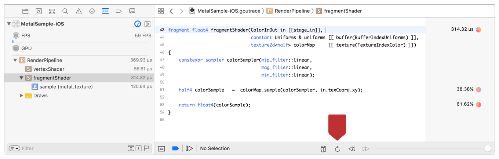

#  Optimizing Performance with the Shader Profiler

> View the elapsed execution time of individual statements in your shader to understand where it spends the most time.

查看着色器中各个语句的已用执行时间，以了解花费最多时间的位置。

## Overview

> Using the Shader Profiler, you can prioritize your optimization efforts by reducing the time taken by your longest running shader statements. The shader profiler helps you optimize your shader by showing you how long each statement took to complete. On devices with a Family 4 or later GPU, a pie chart details which GPU activity your shader does most, which provides additional hints about improving performance. With the Update Shaders feature, you can change your shader source code live and quickly see how well your shader performs after the change.

使用 Shader Profiler ，你可以通过减少运行时间最长的着色器语句所花费的时间来确定优化工作的优先级。着色器分析器通过显示每个语句完成的时间来帮助你优化着色器。在具有 Family 4 或更高版本 GPU 的设备上，饼图会详细说明着色器进行最多的 GPU 操作，这提供了有关提高性能的其他提示。使用“Update Shaders”功能，可以实时更改着色器源代码，并快速查看着色器在更改后的性能表现。

## Set Up Your Project to Enable the Shader Profiler

> To use the shader profiler on your project, set up the .metallib file to allow for debugging:
>
> 1. In Xcode, navigate to your project's build settings.
>
> 2. For the Debug build configuration, set "Produce debugging information" to "Yes, include source code."
>
>Important - Because App Store apps cannot contain debugging information, set "Produce debugging information" to "No" for the Release build configuration.
>
> Use the shader profiler within a captured Metal frame. Most commonly, you capture a Metal frame by clicking the camera button on Xcode's debug bar as covered in [Performing a GPU Capture from the Debug Bar](https://developer.apple.com/documentation/metal/tools_profiling_and_debugging/metal_gpu_capture/performing_a_gpu_capture_from_the_debug_bar?language=objc). For more ways to capture a Metal frame, see [Metal GPU Capture](https://developer.apple.com/documentation/metal/tools_profiling_and_debugging/metal_gpu_capture?language=objc).
>
> From the captured frame, open the shader profiler using the steps in Figure 1:
>
> 1. In the Debug navigator, choose View Frame By Performance.
>
> 2. View your render pipelines populated in the list.
>
> 3. Observe the amount of time each one took during the frame.
>
> Figure 1 Viewing a frame by performance

要在项目中使用着色器分析器，请设置 .metallib 文件以允许调试：

1. 在 Xcode 中，导航到项目的 build settings 。

2. “Debug build configuration”项中，将“Produce debugging information”设置为“Yes, include source code”。

重要 - 由于 App Store 应用程序不能包含调试信息，因此对于“Release build configuration”，请将“Produce debugging information”设置为“No”。

在捕获的 Metal 帧内使用着色器分析器。最常见的是，通过单击 Xcode 调试栏上的相机按钮捕获 Metal 帧，如 [Performing a GPU Capture from the Debug Bar](https://developer.apple.com/documentation/metal/tools_profiling_and_debugging/metal_gpu_capture/performing_a_gpu_capture_from_the_debug_bar?language=objc) 中所述。有关捕获 Metal 帧的更多方法，请参阅 [Metal GPU Capture](https://developer.apple.com/documentation/metal/tools_profiling_and_debugging/metal_gpu_capture?language=objc) 。

从捕获的帧中，使用图 1 中的步骤打开着色器分析器：

1. 在“Debug”导航器中，选择“View Frame By Performance”。

2. 查看列表中填充的渲染管道。

3. 观察每个渲染管道在帧期间所花费的时间。

图 1 Viewing a frame by performance

> Click the disclosure triangle to expand a shader and see the time taken by any inline functions it called. Figure 2 shows that the inline function sample took about 134 microseconds (about 42%) of the total time taken by fragmentShader (about 318 microseconds).
>
> Figure 2 Examining the cost of a shader's inline function calls

单击显示三角形以展开着色器，并查看其调用的任何内联函数所用的时间。图 2 显示内联函数 sample 花费了大概 134 微秒， fragmentShader 所花费的总时间为 318 微秒，sample 函数约占 42% 。

图 2 检查着色器的内联函数调用的开销

## Profile a Shader

> Profile a shader using the following steps, and as annotated in Figure 3:
>
> 1. Expand the render pipeline.
>
> 2. Select the shader you want to profile.
>
> 3. View the shader source code in the center pane with the function entry point highlighted.
>
> 4. Examine the times and percentages column.
>
> Figure 3 Profiling a shader

使用以下步骤分析着色器，如图 3 中所示：

1. 展开渲染管道。

2. 选择要分析的着色器。

3. 在中心窗格中查看着色器源代码，并突出显示函数入口点。

4. 检查时间和百分比列。

图 3 分析着色器

> Because profiling is for performance tuning, most often you'll inspect the render pipeline and shader that took the longest to complete.
>
> In the times and percentages column, the time marking the function entry point is the shader's total elapsed time. Inside of the shader function, a percentage marks each statement and indicates what time (as a percent) of the elapsed time that statement took.

因为分析是用于性能调优的，所以通常会检查完成时间最长的渲染管道和着色器。

在时间和百分比列中，函数入口点处标记的时间是着色器的总耗用时间。在着色器函数内部，百分比标记每个语句并指示该语句所用时间（以百分比表示）。

## Interpret the GPU Activity Metrics

> Next to the percentage of time taken, a pie chart details which activity the GPU is doing most during the statement.
>
> Important - The pie chart requires a device with Family 4 or later GPU. See [About GPU Family 4](https://developer.apple.com/documentation/metal/mtldevice/ios_and_tvos_devices/about_gpu_family_4?language=objc) for more information.
>
> Place your mouse pointer over the dot to bring up the pie chart, as shown in Figure 4.
>
> Figure 4 GPU activity pie chart

在所占用的时间百分比旁边，饼图详细说明了 GPU 在语句期间执行最多的活动。

重要 - 饼图需要具有 Family 4 或更高版本 GPU 的设备。有关更多信息，见 [About GPU Family 4](https://developer.apple.com/documentation/metal/mtldevice/ios_and_tvos_devices/about_gpu_family_4?language=objc) 。

将鼠标指针放在点上以显示饼图，如图 4 所示。

图 4 GPU 活动饼图

> A high percentage in one GPU activity can indicate a performance bottleneck, and an opportunity for optimization. See the following explanations based on state:
>
> Table 1 Explanations for GPU activity

一个 GPU 活动中的高百分比可以表明性能瓶颈，并且是优化的机会。请参阅以下有关状态的解释：

表格 1 GPU 活动的解释

## Update Shaders Live

> After making a change to a shader you can apply the update live using the Update Shaders button highlighted in Figure 5.
>
> Figure 5 Using the Update Shaders feature

在对着色器进行更改后，可以使用图 5 中突出显示的“Update Shaders”按钮实时应用更新。

图 5 使用“Update Shaders”功能

GPU activity | Explanation
:------------ | :-------------
ALU | Time spent in the GPU's arithmetic logic unit. Changing floats to half floats where possible is one way to reduce time spent in the ALU. Another is to minimize complex instructions, like sqrt, sin, cos, recip, and so on.
Memory | Time spent waiting for access to your app's buffers or texture memory. You can shorten this time by down-sampling textures, or, if you're not spending much time in Memory, you could improve your texture resolution instead.
Control Flow | Time spent in conditional, increment, or jump instructions as a result of branches or loops in your shader. Use a constant interation count to minimize Control Flow time for loops because the Metal compiler can generate optimized code in those cases.
Synchronization | Time spent waiting for a required resource or event before execution could begin. Synchronization types are described below.
Synchronization (wait memory) | Waiting for dependent memory accesses issued in prior instructions, such as texture sampling or buffer read/write.
Synchronization (wait pixel) | Waiting for underlapping pixels to release resources. In addition to color attachments, pixels could be from depth or stencil buffers or user-defined resources. Blending is a common cause of pixel waiting. Use raster order groups to reduce time spent waiting for pixels.
Synchronization (barrier) | The thread reached a barrier and waits for remaining threads in the same group to arrive at the barrier before proceeding.
Synchronization (atomics) | Time spent on atomic instructions.

GPU 活动 | 说明
:------------ | :-------------
ALU | 在 GPU 的算术逻辑单元中花费的时间。改变浮点数为半浮点数可能是减少在 ALU 中花费时间的一种方式。另一种方式是减少复杂指令的使用，比如 sqrt，sin，cos，recip 等。
Memory | 等待访问应用程序缓冲区或纹理内存所花费的时间。可以通过下采样纹理来缩短此时间，或者，如果你没有在 Memory 这一项中花费太多时间，则可以提升纹理分辨率。
Control Flow | 由着色器中的分支或循环导致的条件，增量或跳转指令花费的时间。使用常量 interation 计数可以最小化循环的控制流时间，因为 Metal 编译器可以在这些情况下生成优化代码。
Synchronization | 在开始执行之前等待所需资源或事件所花费的时间。同步类型如下所述。
Synchronization (wait memory) | 等待先前指令中发出的存储器依赖访问，例如纹理采样或缓冲器读/写。
Synchronization (wait pixel)  | 等待重叠像素以释放资源。除了颜色附件，也可以是来自深度或模板缓冲区或用户定义的资源中的像素。混合是像素等待的常见原因。使用栅格顺序组可减少等待像素所花费的时间。
Synchronization (barrier) | 线程到达 barrier ，并在进一步处理之前等待同一组中的剩余线程到达 barrier 。
Synchronization (atomics) | 花在原子指令上的时间。

> The Update Shaders button applies the source code changes you make to the same captured Metal frame. The updates reflect as follows:
>
> - The application window is redrawn.
>
> - Elapsed time and percentage metrics are recalculated.
>
> - Attachments in the Assistant Editor are redrawn.
>
> Because Updating Shaders maintains your view in the captured Metal frame, you can easily make successive changes to your shader source code for iterative optimization.

“Update Shaders”按钮将你对源代码所做的更改应用到相同的捕获的 Metal 帧上。更新反映如下：

- 重新绘制应用程序窗口。

- 重新计算流逝的时间和百分比指标。

- 重新绘制 Assistant Editor 中的附件。

由于 Updating Shaders 在捕获的 Metal 帧中保留视图，因此可以轻松地对着色器源代码进行连续更改，以进行迭代优化。
