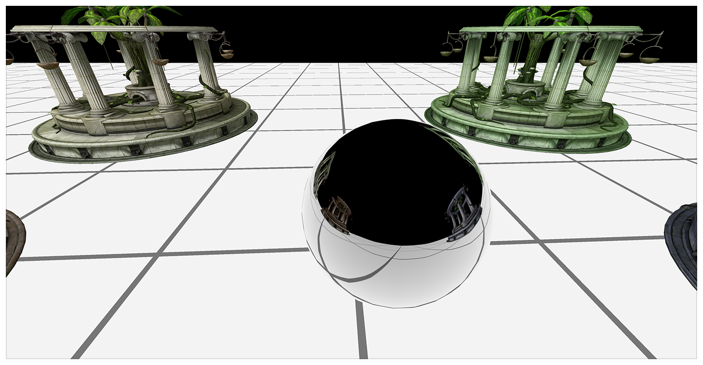
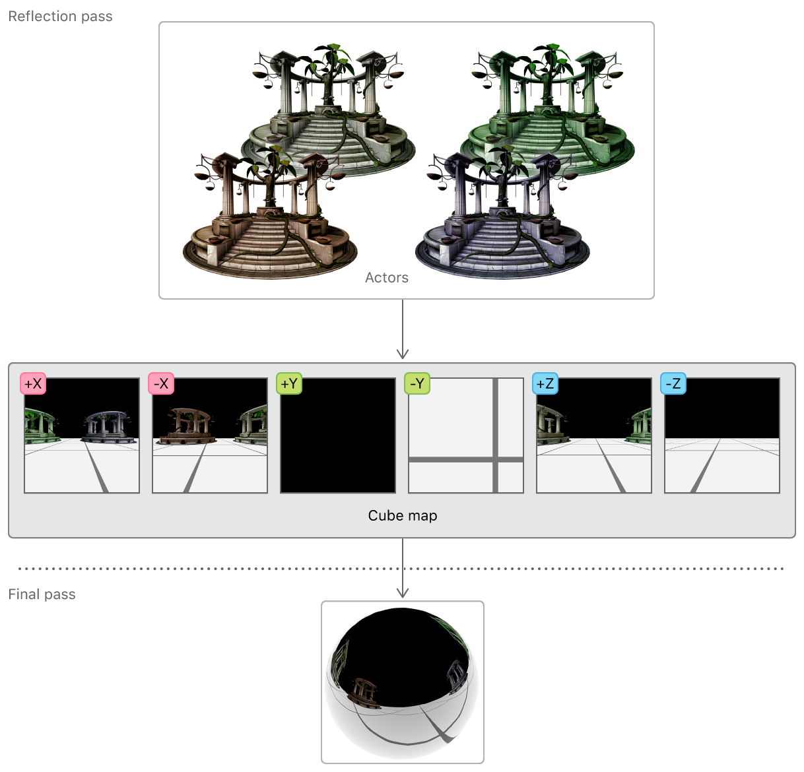
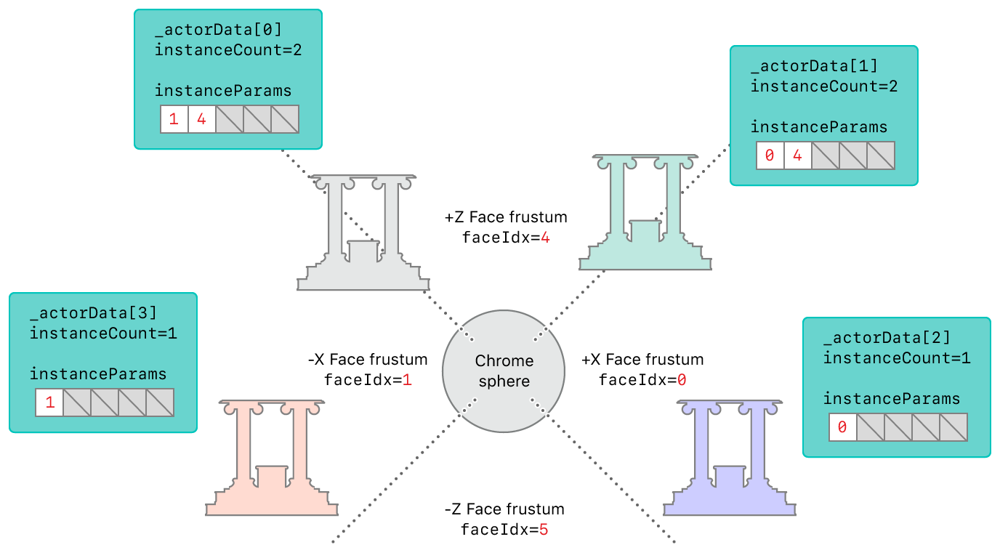
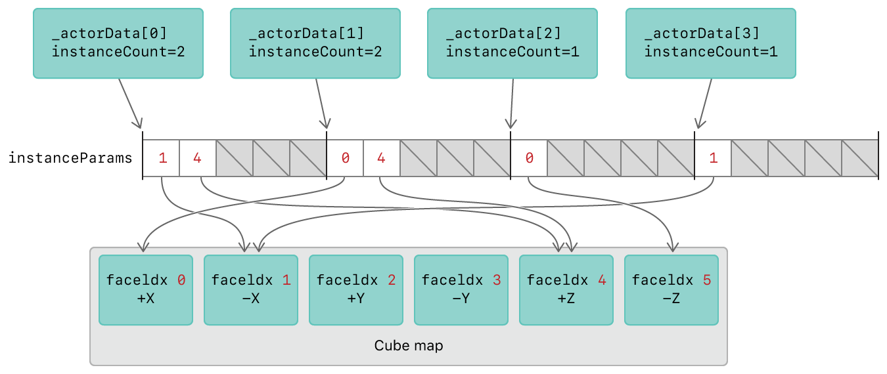

#  Reflections with Layer Selection

> Demonstrates how to use layer selection to reduce the number of render passes needed for a reflective object.

演示如何使用图层选择来减少反射对象所需的渲染过程的数量。

## Overview

> This sample demonstrates dynamic reflections on a chrome sphere, using layer selection to render the frame in two passes. The first pass renders the environment onto the cube map. The second pass renders the environment reflections onto the sphere; it renders additional actors in the scene; and it renders the environment itself.

此示例演示了铬球上的动态反射，使用图层选择使用两个过程渲染帧。第一个过程将环境渲染到立方体贴图上。第二个过程将环境反射渲染到球体上；它渲染场景中的其他对象；并渲染环境本身。



> You can implement an object that reflects its environment by sampling its reflections from a cube map of the environment. A cube map is a single texture composed of six 2D texture layers arranged in the shape of a cube. The reflections vary based on the positions of other objects in the environment, so each of the cube map’s six faces must be rendered dynamically in every frame. This would normally require six separate render passes, one for each face, but Metal allows you to render an entire cube map in a single pass.

你可以通过从环境的立方体贴图中采样其反射数据来实现反射环境的对象。立方体贴图是由以立方体形状排列的六个 2D 纹理层组成的单个纹理。反射根据环境中其他对象的位置而变化，因此立方体贴图的六个面必须在每帧中动态渲染。这通常需要六个单独的渲染过程，每个面对应一个过程，但 Metal 允许你在一个过程中渲染整个立方体贴图。



## Separate the Scene

> A cube map is represented as a render target array with six layers, one for each of its faces. The [[render_target_array_index]] attribute qualifier, specified for a structure member of a vertex function return value, identifies each array layer separately. This layer selection feature allows the sample to decide which part of the environment gets rendered to which cube map face.
>
> An AAPLActorData object represents an actor in the scene. In this sample, each actor is a temple model with the same mesh data but a different diffuse color. These actors sit on the XZ-plane; they’re always reflected in the X or Z direction relative to the sphere and could be rendered to any of the +X, -X, +Z, or -Z faces of the cube map.

立方体贴图表示为具有六个图层的渲染目标数组，每个图层对应一个面。为顶点函数返回值的结构成员指定的 [[render_target_array_index]] 属性限定符分别标识每个数组层。此图层选择功能允许样本决定将环境的哪个部分渲染到立方体的哪个贴图面。

AAPLActorData 对象表示场景中的 actor 。在此示例中，每个 actor 都是具有相同网格数据但具有不同漫反射颜色的 temple 模型。这些 actor 坐落在 XZ 平面上；它们总是相对于球体在 X 或 Z 方向上反射，并且可以渲染到立方体贴图的任何 +X ，-X ，+Z 或 -Z 面。

## Perform Culling Tests for the Reflection Pass

> Before rendering to the cube map, it’s useful to know which faces each actor should be rendered to. Determining this information involves a procedure known as a culling test, and it’s performed on each actor for each cube map face.
>
> At the start of every frame, for each cube map face, a view matrix is calculated and the view’s frustum is stored in the culler_probe array.

在渲染到立方体贴图之前，了解每个 actor 应该渲染到哪个面是很有用的。确定此信息涉及称为剔除测试的过程，对于立方体贴图的每个面在每个 actor 上都要执行此操作。

在每帧的开始处，对于每个立方体贴图面，计算视图矩阵并且视图的截锥体存储在 culler_probe 阵列中。

```objc
// 1) Get the view matrix for the face given the sphere's updated position
viewMatrix[i] = _cameraReflection.GetViewMatrixForFace_LH (i);

// 2) Calculate the planes bounding the frustum using the updated view matrix
//    You use these planes later to test whether an actor's bounding sphere
//    intersects with the frustum, and is therefore visible in this face's viewport
culler_probe[i].Reset_LH (viewMatrix [i], _cameraReflection);
```

> These culler probes test the intersection between an actor and the viewing frustum of each cube map face. The test results determine how many faces the actor is rendered to (instanceCount) in the reflection pass, and which faces (instanceParams) it’s rendered to.

这些 culler 探测器测试 actor 和每个立方体贴图面的视锥体之间是否相交。测试结果确定 actor 在反射过程中渲染到多少个面（ instanceCount ）上，以及要渲染到哪些面（ instanceParams ）上。

```objc
if (_actorData[actorIdx].passFlags & EPassFlags::Reflection)
{
    int instanceCount = 0;
    for (int faceIdx = 0; faceIdx < 6; faceIdx++)
    {
        // Check if the actor is visible in the current probe face
        if (culler_probe [faceIdx].Intersects (_actorData[actorIdx].modelPosition.xyz, _actorData[actorIdx].bSphere))
        {
            // Add this face index to the the list of faces for this actor
            InstanceParams instanceParams = {(ushort)faceIdx};
            instanceParams_reflection [MaxVisibleFaces * actorIdx + instanceCount].viewportIndex = instanceParams.viewportIndex;
            instanceCount++;
    }
}
_actorData[actorIdx].instanceCountInReflection = instanceCount;
}
```

> The following diagram shows the results of the culling tests performed on the temple actors, based on their positions relative to the reflective sphere. Because _actorData[0] and actorData[1] bisect two viewing frustums, their instanceCount property is set to 2, and there are two elements in their instanceParams array. (This array contains the cube map face indices of the viewing frustums that the actors intersect.)

下图显示了在 temple actors 上执行剔除测试的结果，测试根据 actors 相对于反射球的位置。因为 _actorData[0] 和 actorData[1] 将两个视锥体平分，所以它们的 instanceCount 属性设置为 2 ，并且它们的 instanceParams 数组中有两个元素。（此数组包含 actors 相交的视锥体的立方体贴图面索引。）



## Configure Render Targets for the Reflection Pass

> The render target for the reflection pass is a cube map. The sample configures the render target by using a MTLRenderPassDescriptor object with a color render target, a depth render target, and six layers. The renderTargetArrayLength property sets the number of cube map faces and allows the render pipeline to render into any or all of them.

反射过程的渲染目标是立方体贴图。该示例通过使用带有颜色渲染目标，深度渲染目标和六个图层的 MTLRenderPassDescriptor 对象来配置渲染目标。renderTargetArrayLength 属性设置立方体贴图面的数量，并允许渲染管道渲染到其中的任何一个或全部面中。

```objc
reflectionPassDesc.colorAttachments[0].texture    = _reflectionCubeMap;
reflectionPassDesc.depthAttachment.texture        = _reflectionCubeMapDepth;
reflectionPassDesc.renderTargetArrayLength        = 6;
```

## Issue Draw Calls for the Reflection Pass

> The drawActors:pass: method sets up the graphics rendering state for each actor. Actors are only drawn if they are visible in any of the six cube map faces, determined by the visibleVpCount value (accessed through the instanceCountInReflection property). The value of visibleVpCount determines the number of instances for the instanced draw call.

drawActors:pass: 方法为每个 actor 设置图形渲染状态。只有在六个立方体贴图面中的任何一个中可见时，才会绘制 Actor ，由 visibleVpCount 值（通过 instanceCountInReflection 属性访问）确定。visibleVpCount 的值确定实例化绘制调用的实例数。

```objc
[renderEncoder drawIndexedPrimitives: metalKitSubmesh.primitiveType
indexCount: metalKitSubmesh.indexCount
indexType: metalKitSubmesh.indexType
indexBuffer: metalKitSubmesh.indexBuffer.buffer
indexBufferOffset: metalKitSubmesh.indexBuffer.offset
instanceCount: visibleVpCount
baseVertex: 0
baseInstance: actorIdx * MaxVisibleFaces];
```

> In this draw call, the sample sets the baseInstance parameter to the value of actorIdx * 5. This setting is important because it tells the vertex function how to select the appropriate render target layer for each instance.

在此绘制调用中，示例将 baseInstance 参数设置为 actorIdx * 5 的值。此设置很重要，因为它告诉顶点函数如何为每个实例选择适当的渲染目标图层。

## Render the Reflection Pass

> In the vertexTransform vertex function, the instanceParams argument points to the buffer that contains the cube map faces that each actor should be rendered to. The instanceId value indexes into the instanceParams array.

在 vertexTransform 顶点函数中，instanceParams 参数指向包含每个 actor 应渲染到的立方体贴图面的缓冲区。instanceId 值在 instanceParams 数组中索引。

```objc
vertex ColorInOut vertexTransform (         Vertex          in               [[ stage_in ]],
uint            instanceId       [[ instance_id ]],
device   InstanceParams* instanceParams   [[ buffer (BufferIndexInstanceParams) ]],
device   ActorParams&    actorParams      [[ buffer (BufferIndexActorParams)    ]],
constant ViewportParams* viewportParams   [[ buffer (BufferIndexViewportParams) ]] )
```

> The output structure of the vertex function, ColorInOut, contains the face member that uses the [[render_target_array_index]] attribute qualifier. The return value of face determines the cube map face that the render pipeline should render to.

顶点函数的输出结构 ColorInOut 包含使用 [[render_target_array_index]] 属性限定符的 face 成员。face 的返回值确定渲染管道应渲染到的立方体贴图面。

```objc
typedef struct
{
    float4 position [[position]];
    float2 texCoord;

    half3  worldPos;
    half3  tangent;
    half3  bitangent;
    half3  normal;
    uint   face [[render_target_array_index]];
} ColorInOut;
```

> Because the value of the draw call’s baseInstance parameter is set to actorIdx * 5, the instanceId value of the first instance drawn in the draw call is equal to this value. Each subsequent rendering of an instance increments the instanceId value by 1. The instanceParams array has five slots for each actor because an actor can be visible in up to five cube map faces. As a result, the instanceParams[instanceId] element always contains one of the face indices in which the actor is visible. Therefore, the sample uses this value to select a valid render target layer.

因为 draw 调用的 baseInstance 参数的值设置为 actorIdx * 5 ，所以在 draw 调用中绘制的第一个实例的 instanceId 值等于该值。实例的每个后续渲染都将 instanceId 值递增 1 。instanceParams 数组为每个 actor 提供五个槽，因为 actor 最多可以在五个立方体贴图面中可见。因此，instanceParams [instanceId] 元素始终包含 actor 可见的面部索引之一。 因此，该示例使用此值来选择有效的渲染目标图层。

```objc
out.face = instanceParams[instanceId].viewportIndex;
```

> In summary, to render each actor to the reflective cube map, the sample issues an instanced draw call for the actor. The vertex function uses the built-in instanceId variable to index into the instanceParams array that contains the index of the cube map face that the instance should be rendered to. Therefore, the vertex function sets this face index in the face return value member, which uses the [[render_target_array_index]] attribute qualifier. This ensures that each actor is rendered to each cube map face it should appear in.

总之，为了将每个 actor 渲染到反射立方体贴图，该示例为 actor 发出一个实例化绘制调用。顶点函数使用内置的 instanceId 变量来索引 instanceParams 数组，该数组包含实例应该渲染到的立方体贴图面的索引。因此，顶点函数在面返回值成员中设置此面部索引，该成员使用 [[render_target_array_index]] 属性限定符。这可以确保每个 actor 被渲染到其应该出现在的每个立方体贴图面上。



## Perform Culling Tests for the Final Pass

> The sample performs similar view updates for the main camera in the final pass. At the start of every frame, a view matrix is calculated and the view’s frustum is stored in the culler_final variable.

该示例在最后 pass 中对主摄像机执行类似的视图更新。在每帧的开始处，计算视图矩阵，并且视图的平截头体存储在 culler_final 变量中。

```objc
_cameraFinal.target   = SceneCenter;

_cameraFinal.rotation = fmod ((_cameraFinal.rotation + CameraRotationSpeed), M_PI*2.f);
matrix_float3x3 rotationMatrix = matrix3x3_rotation (_cameraFinal.rotation,  CameraRotationAxis);

_cameraFinal.position = SceneCenter;
_cameraFinal.position += matrix_multiply (rotationMatrix, CameraDistanceFromCenter);

const matrix_float4x4 viewMatrix       = _cameraFinal.GetViewMatrix();
const matrix_float4x4 projectionMatrix = _cameraFinal.GetProjectionMatrix_LH();

culler_final.Reset_LH (viewMatrix, _cameraFinal);

ViewportParams *viewportBuffer = (ViewportParams *)_viewportsParamsBuffers_final[_uniformBufferIndex].contents;
viewportBuffer[0].cameraPos            = _cameraFinal.position;
viewportBuffer[0].viewProjectionMatrix = matrix_multiply (projectionMatrix, viewMatrix);
```

> This final culler probe is used to test the intersection between an actor and the viewing frustum of the camera. The test result simply determines whether or not each actor is visible in the final pass.

这个最终的剔除探测器用于测试 actor 和摄像机的视锥体之间的交叉点。测试结果确定每个 actor 在最后 pass 中是否可见。

```objc
if (culler_final.Intersects (_actorData[actorIdx].modelPosition.xyz, _actorData[actorIdx].bSphere))
{
    _actorData[actorIdx].visibleInFinal = YES;
}
else
{
    _actorData[actorIdx].visibleInFinal = NO;
}
```

## Configure Render Targets for the Final Pass

> The render target for the final pass is the view’s drawable, a displayable resource obtained by accessing the view’s currentRenderPassDescriptor property. However, you must not access this property prematurely because it implicitly retrieves a drawable. Drawables are expensive system resources created and maintained by the Core Animation framework. You should always hold a drawable as briefly as possible to avoid resource stalls. In this sample, a drawable is acquired just before the final render pass is encoded.

最终 pass 的渲染目标是视图的 drawable ，它是通过访问视图的 currentRenderPassDescriptor 属性获得的可显示资源。但是，你不能过早访问此属性，因为它隐式检索 drawable 。 Drawable 是由 Core Animation 框架创建和维护的昂贵系统资源。你应该总是尽可能简短地保持一个 drawable ，以避免资源停滞。在此示例中，仅在编码最终渲染过程之前获取 drawable 。

```objc
MTLRenderPassDescriptor* finalPassDescriptor = view.currentRenderPassDescriptor;

if(finalPassDescriptor != nil)
{
    finalPassDescriptor.renderTargetArrayLength = 1;
    id<MTLRenderCommandEncoder> renderEncoder =
    [commandBuffer renderCommandEncoderWithDescriptor:finalPassDescriptor];
    renderEncoder.label = @"FinalPass";

    [self drawActors: renderEncoder pass: EPassFlags::Final];

    [renderEncoder endEncoding];
}
```

## Issue Draw Calls for the Final Pass

> The drawActors:pass: method sets up the graphics rendering state for each actor. Actors are only drawn if they are visible to the main camera, as determined by the visibleVpCount value (accessed through the visibleInFinal property).
>
> Because each actor is drawn only once in the final pass, the instanceCount parameter is always set to 1 and the baseInstance parameter is always set to 0.

drawActors:pass: 方法为每个 actor 设置图形渲染状态。Actors 仅在相对主摄像机可见的情况下才会被绘制，由 visibleVpCount 值（通过 visibleInFinal 属性访问）确定。

因为每个 actor 在最后 pass 中只绘制一次，所以 instanceCount 参数始终设置为 1 ，baseInstance 参数始终设置为 0 。

## Render the Final Pass

> The final pass renders the final frame directly to the view’s drawable, which is then presented onscreen.

最后的 pass 将最终帧直接渲染到视图的 drawable ，然后 drawable 被显示到屏幕上。
