#  Resolving Shader Issues with the Shader Debugger

> Step through shader execution with the ability to inspect variable values and update shader code in place.

单步着色器执行，能够检查变量值并更新着色器代码。

## Overview

> The Metal shader debugger brings common debugger features to your shader development, like stepping through execution, variable inspection, and the ability to edit code and update the results live. The variable views expose issues as they occur by allowing you to visually confirm the results of each statement. Combining that with the ability to step through execution, like loops, can easily show you how well your algorithm is working. With the Update Shaders feature, you can change your shader source code live and quickly see the results of your changes.

Metal Shader 调试器为着色器开发带来了常见的调试器功能，例如逐步执行，变量检查以及编辑代码和实时更新结果的功能。变量视图允许你直观地确认每个语句的结果，从而在问题发生时将问题暴露出来。将其与逐步执行的能力（如循环）相结合，可以轻松向你显示算法的运行情况。使用“Update Shaders”功能，可以实时更改着色器源代码，并快速查看更改结果。

## Set Up Your Project to Enable the Shader Debugger

> To use the shader debugger on your project, set up the .metallib file to allow for debugging:
>
> 1. In Xcode, navigate to your project's build settings.
>
> 2. For the Debug build configuration, set "Produce debugging information" to "Yes, include source code."
>
> Important - Because App Store apps cannot contain debugging information, set "Produce debugging information" to "No" for the Release build configuration.
>
> Use the shader debugger within a captured Metal frame. Most commonly, you capture a Metal frame by clicking the camera button on Xcode's debug bar as covered in [Performing a GPU Capture from the Debug Bar](https://developer.apple.com/documentation/metal/tools_profiling_and_debugging/metal_gpu_capture/performing_a_gpu_capture_from_the_debug_bar?language=objc). For more ways to capture a Metal frame, see [Metal GPU Capture](https://developer.apple.com/documentation/metal/tools_profiling_and_debugging/metal_gpu_capture?language=objc).
>
> From the captured frame, display the call history using the steps hightlighted in Figure 1:
>
> 1. Enable the Debug navigator.
>
> 2. Choose View Frame By Call.
>
> Figure 1 Viewing the frame by call

要在项目中使用着色器调试器，请设置 .metallib 文件以允许调试：

1. 在 Xcode 中，导航到项目的 build settings 。

2. “Debug build configuration”项中，将“Produce debugging information”设置为“Yes, include source code”。

重要 - 由于 App Store 应用程序不能包含调试信息，因此对于“Release build configuration”，请将“Produce debugging information”设置为“No”。

在捕获的 Metal 帧内使用着色器调试器。最常见的是，通过单击 Xcode 调试栏上的相机按钮捕获 Metal 帧，如 [Performing a GPU Capture from the Debug Bar](https://developer.apple.com/documentation/metal/tools_profiling_and_debugging/metal_gpu_capture/performing_a_gpu_capture_from_the_debug_bar?language=objc) 中所述。有关捕获 Metal 帧的更多方法，请参阅 [Metal GPU Capture](https://developer.apple.com/documentation/metal/tools_profiling_and_debugging/metal_gpu_capture?language=objc) 。

从捕获的帧中，使用图 1 中的高亮步骤显示调用历史：

1. 启用“Debug”导航器。

2. 选择“View Frame By Call”。

图 1 Viewing the frame by call

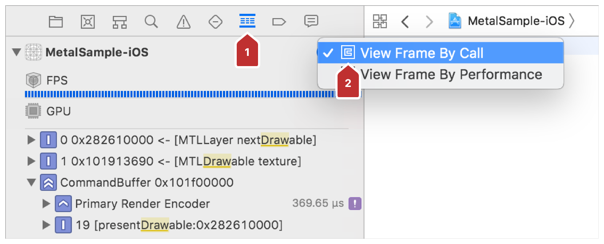

> Note - Unlike with a conventional debugger, you cannot set breakpoints on code running on the GPU (shader conditions), but you can trigger the Metal capture in code running on the CPU (regular app code) using the steps in [Performing a GPU Capture from a Breakpoint](https://developer.apple.com/documentation/metal/tools_profiling_and_debugging/metal_gpu_capture/performing_a_gpu_capture_from_a_breakpoint?language=objc). Another approach is to capture CPU-run code programmatically using the steps in [Performing a GPU Capture Programmatically](https://developer.apple.com/documentation/metal/tools_profiling_and_debugging/metal_gpu_capture/performing_a_gpu_capture_programmatically?language=objc).

注意 - 与传统调试器不同，无法在 GPU 上运行的代码上设置断点（着色器条件），但可以使用 [Performing a GPU Capture from a Breakpoint](https://developer.apple.com/documentation/metal/tools_profiling_and_debugging/metal_gpu_capture/performing_a_gpu_capture_from_a_breakpoint?language=objc) 中的步骤在 CPU 上运行的代码中触发 Metal 捕获（常规应用程序代码）。另一种方法是使用 [Performing a GPU Capture Programmatically](https://developer.apple.com/documentation/metal/tools_profiling_and_debugging/metal_gpu_capture/performing_a_gpu_capture_programmatically?language=objc) 中的步骤以编程方式捕获 CPU 运行代码。

## Open a Vertex Function for Debugging

> To debug a vertex function, use the highlighted steps in Figure 2:
>
> 1. Expand your command buffer in the call list.
>
> 2. Filter the call list by function name by entering draw in the filter field.
>
> 3. Select the draw call that shades the primitive you want to debug.
>
> 4. Double-click Geometry to open the geometry viewer.
>
> Figure 2 Opening the geometry viewer to debug a vertex function

要调试顶点函数，请使用图 2 中突出显示的步骤：

1. 在调用列表中展开命令缓冲区。

2. 通过在过滤器字段中输入 draw 来按函数名称过滤调用列表。

3. 选择为你想要调试的图元进行着色的绘制调用。

4. 双击“Geometry”以打开几何体查看器。

图 2 打开几何查看器以调试顶点函数

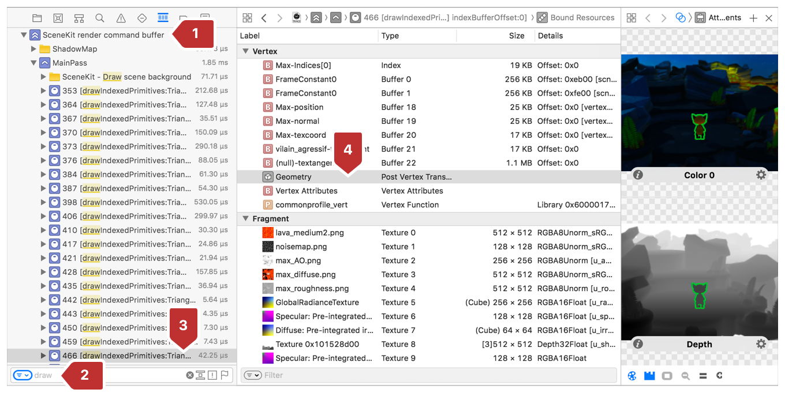

> The geometry viewer is displayed in Xcode's center pane, as seen in Figure 3. To open the shader debugger for this vertex function, use these steps:
>
> 1. Select a primitive to debug.
>
> 2. Click Debug.
>
> Figure 3 Debugging a vertex primitive

几何查看器显示在 Xcode 的中心窗格中，如图 3 所示。要打开此顶点函数的着色器调试器，请使用以下步骤：

1. 选择要调试的基元。

2. 单击 Debug 。

图 3 调试顶点基元

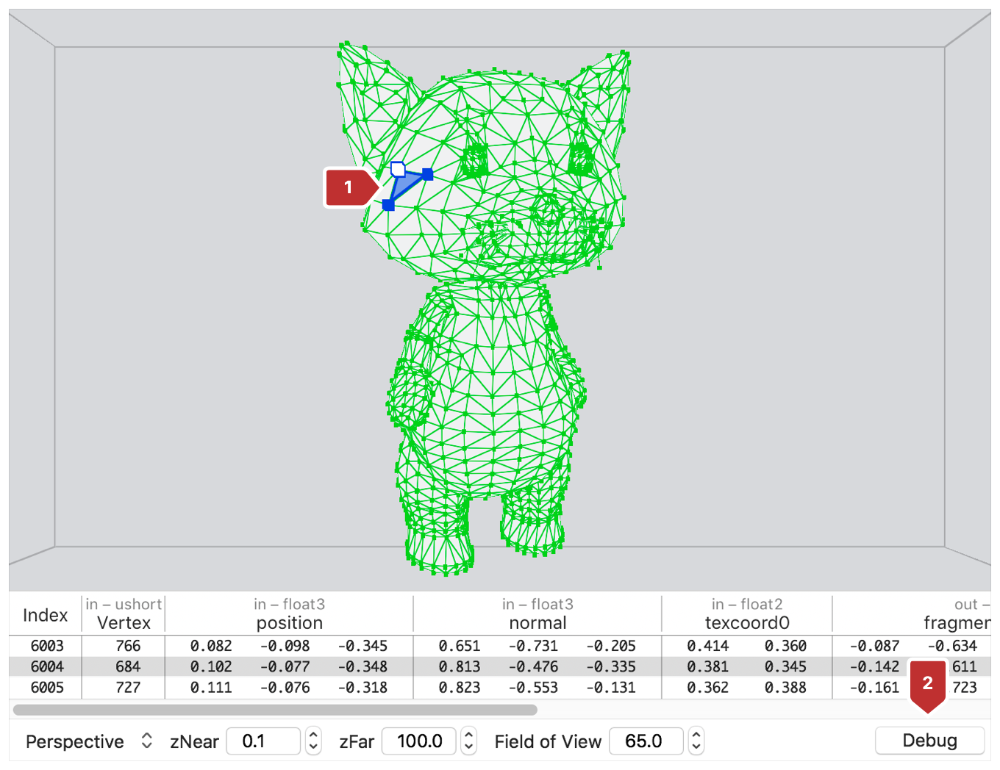

> The vertex function is then shown in Xcode's center pane with the parameter and variable displays populated with the values of the selected primitive. The Region of Interest (ROI), highlighted at left in Figure 4, contains all of the vertex function's statements, and the debugger has its execution playhead set to the function's entry point.
>
> Figure 4 Controlling the execution playhead with the ROI list

然后顶点函数显示在 Xcode 的中心窗格中，由选中图元值填充的参数和变量也显示在其中。图 4 左侧突出显示的感兴趣区域（ ROI ）包含所有顶点函数的语句，调试器将其执行播放头设置为函数的入口点。

图 4 使用 ROI 列表控制执行播放头

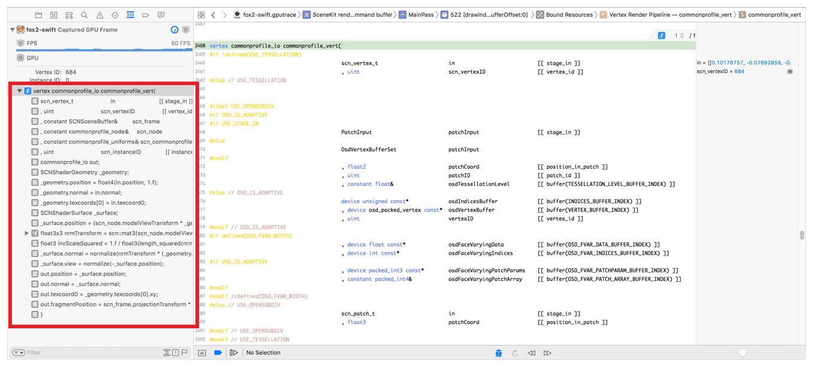

## Open a Fragment Function for Debugging

> To debug a fragment function, use the highlighted steps in Figure 5:
>
> 1. Expand your command buffer in the call list.
>
> 2. Filter the call list by function name by entering draw in the filter field.
>
> 3. Expand the draw call that runs the fragment function you want to debug.
>
> 4. Select Attachments for the draw.
>
> Figure 5 Selecting the draw's attachments

要调试片段函数，请使用图 5 中突出显示的步骤：

1. 在调用列表中展开命令缓冲区。

2. 通过在过滤器字段中输入 draw 来按函数名称过滤调用列表。

3. 展开运行要调试片段函数的绘制调用。

4. 选择绘图的附件。

图 5 选择绘图的附件

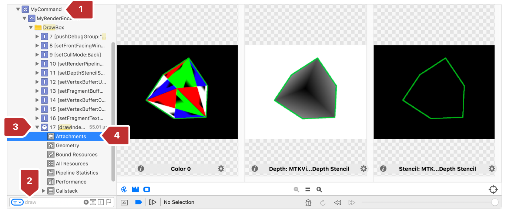

> The draw call's attachments show in Xcode's center pane. To open the shader debugger for this fragment function, do the steps highlighted in Figure 6:
>
> 1. Click Inspect Pixels.
> 
2. Click an area inside one of the attachments and pan the mouse to the fragment you want to debug. Optionally, use the arrow keys to move the magnifying glass in single-pixel increments.
>
3. Click Debug to open the fragment function.
>
> Figure 6 Choosing a fragment to debug

绘图调用的附件显示在 Xcode 的中心窗格中。要打开此片段函数的着色器调试器，请执行图 6 中突出显示的步骤：

1. 单击“Inspect Pixels”。

2. 单击其中一个附件中的某个区域，然后将鼠标平移到要调试的片段。（可选）使用箭头键以单像素增量移动放大镜。

3. 单击“Debug”以打开片段函数。

图 6 选择要调试的片段

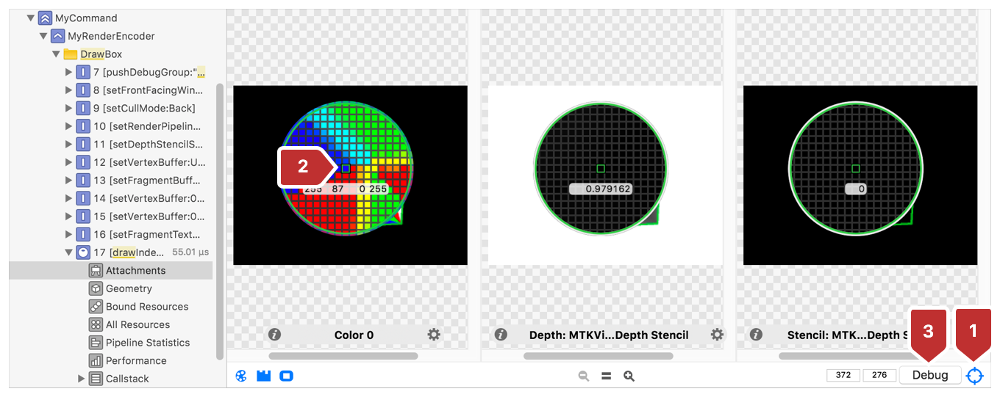

> The fragment function is shown in Xcode's center pane as seen in Figure 7. The parameter and variable displays are populated with the values of the selected fragment, at right in Figure 7. Click to expand the ROI, highlighted at left, to list the fragment function's statements. In the center pane, observe the debugger's execution playhead set to the function's entry point.
>
> Figure 7 A fragment function open in the shader debugger

片段函数显示在 Xcode 的中心窗格中，如图 7 所示。填充了所选片段值的参数和变量显示在图 7 右侧所示的位置。单击以展开左侧突出显示的 ROI ，以列出片段函数的语句。在中心窗格中，调试器的执行头设置为函数的入口点。

图 7 在着色器调试器中打开的片段函数

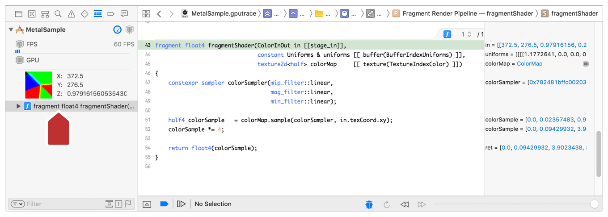

## Step Through the Code in the Debugger

> Step through code in the debugger using the following steps, and as annotated in Figure 8:
>
> 1. Select a statement in the ROI list.
>
> 2. The execution playhead moves to the corresponding line in Xcode's center pane.
>
> Figure 8 Stepping through code in the debugger

使用以下步骤在调试器中单步调试代码，如图 8 中所示：

1. 在 ROI 列表中选择一个语句。

2. 执行播放头移动到 Xcode 中心窗格中的相应行。

图 8 调试器中单步执行代码

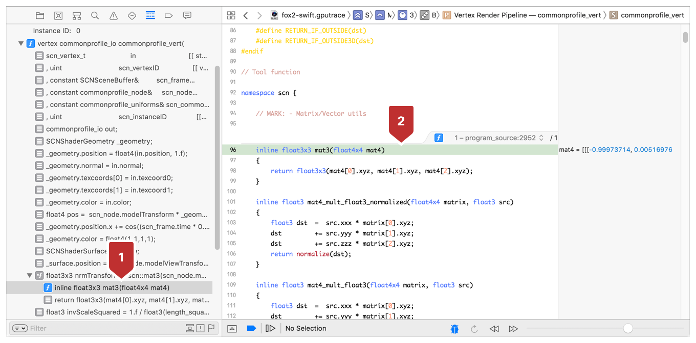

> Inside of the ROI list, use the arrow keys to move control location:
>
> Table 1 Controlling debugger stepping with arrow keys

在 ROI 列表内，使用箭头键移动控制位置：

表格 1 使用箭头键控制调试器步进

Arrow key | Stepping direction
:------------: | :-------------:
Down arrow | Step forward
Right arrow | Step in
Left arrow | Step out
Up arrow | Step backward

> A statement's source code must be present in the file to support stepping in, as illustrated with the float3x3 function in . Unlike a conventional debugger, the shader debugger allows you to step backward in execution or even select an arbitrary statement. Changing the location of the execution playhead can affect the values of variables displayed onscreen because they represent the state of the frame's data at that point in time. This is particularly helpful when stepping through loop iterations in shader source code.

语句的源代码必须存在于文件中以支持单步，如 float3x3 函数所示。与传统的调试器不同，着色器调试器允许你在执行中后退，甚至可以选择任意语句。更改执行播放头的位置会影响屏幕上显示的变量值，因为它们表示该时间点帧数据的状态。这在单步调试着色器源代码中的循环迭代时尤其有用。

## Inspect Variable Properties

> To inspect a shader's variables, follow the steps as annotated in Figure 9:
>
> 1. Click the gray block to the right of a variable at right in Figure 9.
>
> 2. See the variable inspection panel shown below the corresponding statement in the shader source code view.
>
> Figure 9 Inspecting variable values in the shader debugger

要检查着色器的变量，请按照图 9 中的步骤操作：

1. 单击图 9 右侧变量右侧的灰色块。

2. 见着色器源代码视图中相应语句下方显示的变量检查面板。

图 9 检查着色器调试器中的变量值

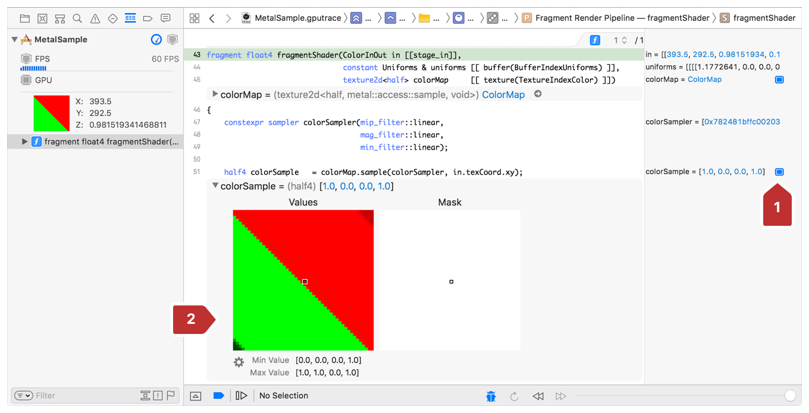

> You can expand nested properties in the variable inspection panel, as seen in Figure 10. Nested properties of the uniforms argument are displayed: the columns of both the projectionMatrix and modelViewMatrix.
>
> Figure 10 Inspecting nested properties in the variable values view

可以在变量检查面板中展开嵌套属性，如图 10 所示。uniforms 参数的嵌套属性：projectionMatrix 和 modelViewMatrix 的列。

图 10 变量值视图中检查嵌套属性

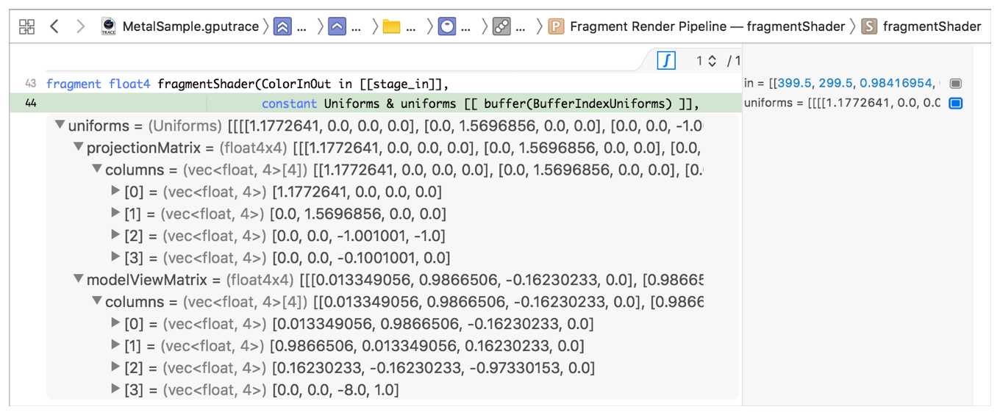

> Watch a variable change over time by expanding the inspection panel across its subsequent modifications. Figure 11 highlights how visualizing over time can identify problems that could otherwise go undetected if you simply review code or numeric variable values:
>
> 1. Expand a color sample to see its texture.
>
> 2. Expand the variables view for the color sample's next modification to see how it's changed.
>
> Figure 11 Inspecting two statements relating to the same variable

通过展开检查面板以覆盖变量的后续修改，观察变量随时间的变化。图 11 突出显示了通过可视化地查看变量随时间的变化是如何定位到那些可能单纯依靠简单地复查代码或数值变量值而无法检测到的问题的：

1. 展开颜色样本以查看其纹理。

2. 展开颜色样本的下一个修改的变量视图，以查看它是如何更改的。

图 11 检查同一变量相关的两条语句

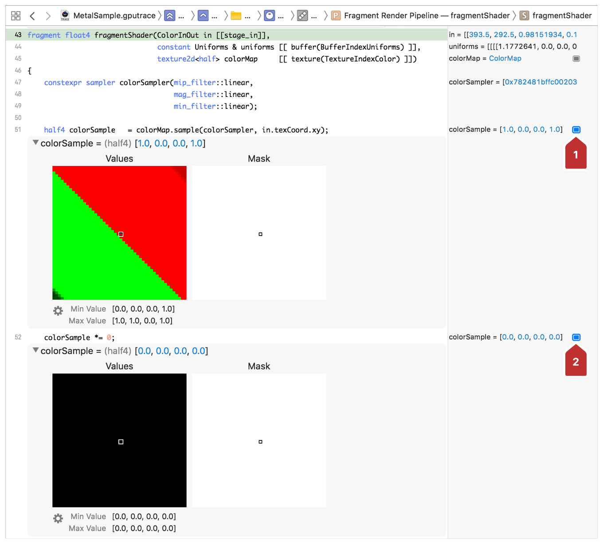

> The numeric values [0, 0, 0, 0] are a clear indication that you have a blank color sample, but the visualization of variable textures can be helpful in cases where the numeric data isn't as immediately telling of the cause of an issue.

数值 [0, 0, 0, 0] 清楚地表明你拥有一个空白颜色样本，但在数值数据不能立即告知原因的情况下，可变纹理的可视化可能会有所帮助。

## Update Shaders Live

> After making a change to a shader you can apply the update live using the Update Shaders button highlighted in Figure 12.
>
> Figure 12 Updating shaders

着色器代码更改后，可以使用图 12 中突出显示的“Update Shaders”按钮实时应用更新。

图 12 更新着色器

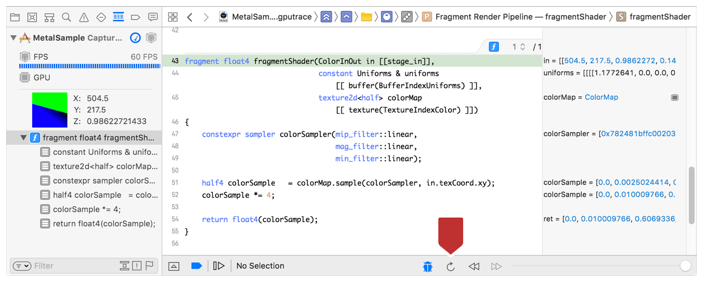

> The Update Shaders button applies the source code changes you make to the same captured Metal frame. Updating the shader:
>
> - Redraws the application window.
>
> - Updates variable views to show their new values.
>
> - Redraws Attachments in the Assistant Editor.
>
> Because Updating Shaders maintains your place in the captured Metal frame, you can easily make successive changes to shader source code for either debugging or development purposes.

“Update Shaders”按钮将你对源代码所做的更改应用到相同的捕获的 Metal 帧上。更新着色器：

- 重绘应用程序窗口。

- 更新变量视图以显示其新值。

- 重绘 Assistant Editor 中的附件。

由于 Updating Shaders 在捕获的 Metal 帧中保留位置，因此可以轻松地对着色器源代码进行连续更改，以进行调试或开发。
