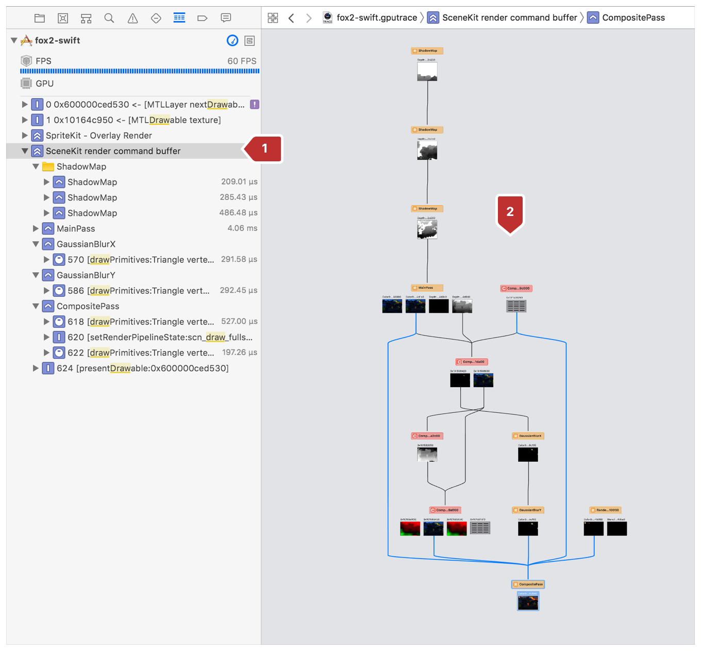
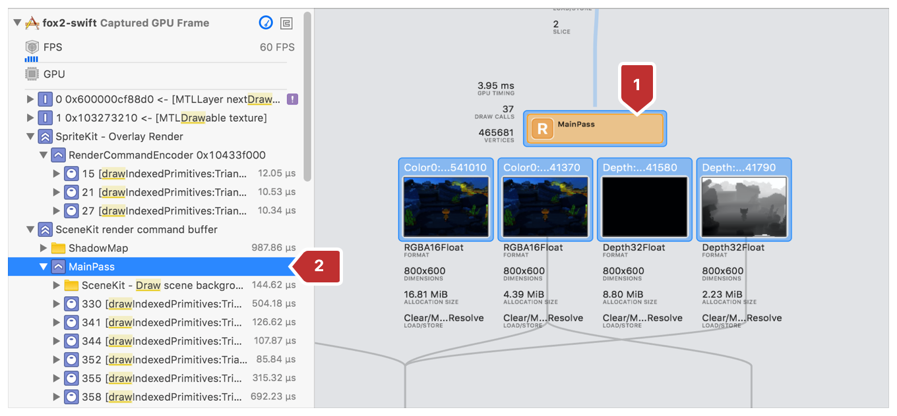
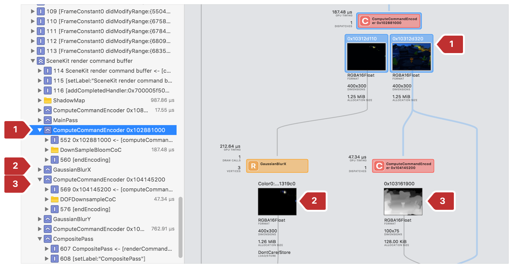

#  Seeing a Frame's Render Passes with the Dependency Viewer

> View your render passes as a flow chart and inspect individual resource dependencies to understand which commands wait on others to complete.

以流程图的形式查看渲染过程并检查各个资源依赖关系，以了解哪些命令等待其他命令完成。

## Overview

> To support Metal's multipass rendering system, use the dependency viewer to analyze frame calls and inspect your app's render passes. The dependency viewer provides a graph-based alternative to viewing your frame's instructions with the call list. Being a tree-based graph, the dependency viewer enables you to easily spot discrepancies in resource contention or identify extraneous render passes.

要支持 Metal 的多过程渲染系统，使用依赖关系查看器分析帧调用并检查应用程序的渲染过程。依赖关系查看器提供了一个基于图形的替代方法，可以使用调用列表查看帧指令。作为基于树的图形界面，依赖关系查看器使你可以轻松发现资源争用中的差异或识别无关的渲染过程。

## Open the Dependency Viewer

> Access the dependency viewer within a captured Metal frame. Most commonly, you capture a Metal frame by clicking the camera button on Xcode's debug bar as covered in [Performing a GPU Capture from the Debug Bar](https://developer.apple.com/documentation/metal/tools_profiling_and_debugging/metal_gpu_capture/performing_a_gpu_capture_from_the_debug_bar?language=objc). For more ways to capture a Metal frame, see [Metal GPU Capture](https://developer.apple.com/documentation/metal/tools_profiling_and_debugging/metal_gpu_capture?language=objc).
>
> From the captured frame, display the call list using the steps hightlighted in :
>
> 1. Enable the Debug navigator.
>
> 2. Choose View Frame By Call.
>
> Figure 1 Viewing your frame by call

访问捕获的 Metal 帧中的依赖项查看器。最常见的是，通过单击 Xcode 调试栏上的相机按钮捕获 Metal 帧，如  [Performing a GPU Capture from the Debug Bar](https://developer.apple.com/documentation/metal/tools_profiling_and_debugging/metal_gpu_capture/performing_a_gpu_capture_from_the_debug_bar?language=objc) 中所述。有关捕获 Metal 帧的更多方法，见 [Metal GPU Capture](https://developer.apple.com/documentation/metal/tools_profiling_and_debugging/metal_gpu_capture?language=objc) 。

从捕获的帧中，使用以下步骤显示调用列表：

1. 启用“调试”导航器。

2. 选择“View Frame By Call”。

图 1 通过调用查看帧

> Next, display the dependency viewer, as shown in Figure 2:
>
> 1. Select your command buffer in the call list.
>
> 2. Observe the dependency viewer in Xcode's center pane.
>
> Figure 2 Examining the dependency viewer

接下来，显示依赖查看器，如图 2 所示：

1. 在调用列表中选择你的命令缓冲区。

2. 观察 Xcode 中心窗格中的依赖关系查看器。

图 2 检查依赖关系查看器

## Inspect Your Render Passes

> Use the dependency viewer to validate your app's render passes as a structured hierarchical flowchart. Because the dependency viewer can easily show multiple dependencies, it provides more information than viewing your frame in the call list alone.
>
> The call list and dependency viewer are different ways to view the same general information, so the corresponding entry in the call list is selected automatically when you choose a render pass in the dependency viewer. See these steps highlighted in Figure 3:
>
> 1. Click a render pass.
>
> 2. See its corresponding entry selected automatically in the call list at left.
>
> Figure 3 A render pass selected in the call list and dependency viewer

使用依赖关系查看器将应用程序的渲染过程验证为结构化分层流程图。由于依赖关系查看器可以轻松显示多个依赖关系，因此它提供的信息比仅在调用列表中查看帧提供的信息更多。

调用列表和依赖关系查看器是查看相同信息的不同方式，因此当你在依赖关系查看器中选择渲染过程时，将自动选择调用列表中的相应条目。请参阅图 3 中突出显示的这些步骤：

1. 单击渲染过程。

2. 查看左侧调用列表中自动选择的相应条目。

图 3 在调用列表和依赖关系查看器中选中的渲染过程

> Visually check your render passes for completeness and conciseness. One of the benefits of the dependency viewer's visual layout is the ability to easily identify redundant or extraneous render passes that could otherwise go unnoticed in the code or call list.

目测渲染过程的完整性和简洁性。依赖查看器的可视化布局的一个好处是能够轻松识别冗余或无关的渲染过程，这些过程可能会在代码或调用列表中被忽略。

## Understand Your Render Pass Dependencies

> See your first render passes at the top of the graph, and subsequent render passes flowing downward chronologically. For each pass in the graph, the layout, lines, and connections indicate dependencies. A pass whose line flows up to another render pass is one that depends on the completion of that pass before it can be scheduled for execution.
>
> For example, observe in Figure 4, two passes that depend on the completion of the DownSampleBloomCOC compute pass (1):
>
> - A blur pass (2)
>
> - A compute pass (3)
>
> Figure 4 Render passes, at right, match the number of their entry in the call list at left

查看图表顶部的第一个渲染过程，随后的渲染过程按时间顺序向下流动。对于图中的每个过程，布局，线和连接都表示依赖关系。线路流向另一个渲染过程的过程是依赖于该过程完成的过程，然后才能调度执行。

例如，在图 4 中观察，依赖于 DownSampleBloomCOC 计算过程（1）完成的两个过程为：

- 模糊过程（2）

- 计算过程（3）

图 4 右侧的渲染过程匹配左侧调用列表中的条目数量

