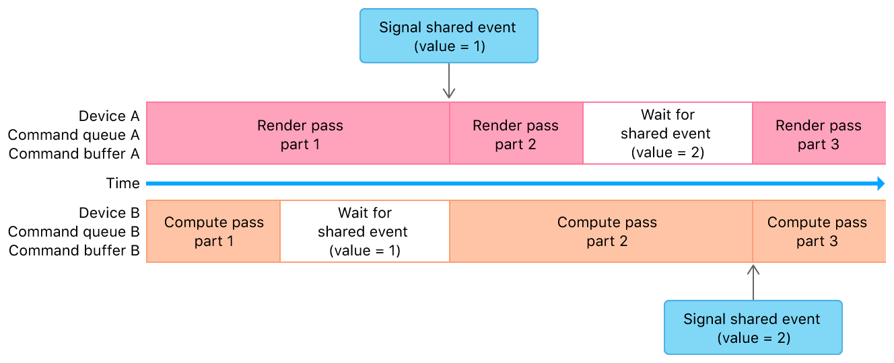

#  Synchronizing Events Across Multiple Devices

> Use shareable events to synchronize your app's work across multiple devices.

使用可共享事件在多个设备上同步应用的工作。

## Overview

> Use shareable events to specify synchronization points in your app that signal or wait for specific command completion across multiple devices. Use [MTLSharedEvent](https://developer.apple.com/documentation/metal/mtlsharedevent?language=objc) and [MTLCommandBuffer](https://developer.apple.com/documentation/metal/mtlcommandbuffer?language=objc) to specify these points across multiple command queues created from different devices.
>
> Note - You can't use [MTLEvent](https://developer.apple.com/documentation/metal/mtlevent?language=objc) to synchronize events across multiple devices.

使用可共享事件在应用程序中指定同步点，以指示或等待跨多个设备的特定命令完成。使用 [MTLSharedEvent](https://developer.apple.com/documentation/metal/mtlsharedevent?language=objc) 和 [MTLCommandBuffer](https://developer.apple.com/documentation/metal/mtlcommandbuffer?language=objc) 在从不同设备创建的多个命令队列中指定这些同步点。

注意 - 你无法使用 [MTLEvent](https://developer.apple.com/documentation/metal/mtlevent?language=objc) 在多个设备之间同步事件。

## Encode Synchronization Events Across Multiple Devices

> Call the [encodeWaitForEvent:value:](https://developer.apple.com/documentation/metal/mtlcommandbuffer/2966543-encodewaitforevent?language=objc) method to encode a command that waits for a specific value to be signaled for a specific event. Until you signal this value, all future commands in the command queue are blocked. Call the [encodeSignalEvent:value:](https://developer.apple.com/documentation/metal/mtlcommandbuffer/2966542-encodesignalevent?language=objc) method to encode a command that signals the event with the expected value. When the GPU executes this command from an unblocked command queue on another device, the blocked command queue continues its execution.
>
> The following illustration and code show a shareable event that synchronizes graphics rendering on one device with compute processing on another.

调用 [encodeWaitForEvent:value:](https://developer.apple.com/documentation/metal/mtlcommandbuffer/2966543-encodewaitforevent?language=objc) 方法对一个命令进行编码，该命令等待特定事件到达特定值。在发出此值之前，命令队列中的所有后续命令都将被阻止。调用 [encodeSignalEvent:value:](https://developer.apple.com/documentation/metal/mtlcommandbuffer/2966542-encodesignalevent?language=objc) 方法对一个命令进行编码，该命令使用期望的值发出信号。当 GPU 从另一个设备上的未阻塞命令队列执行此命令时，阻塞的命令队列继续执行。

下图和代码显示了一个可共享的事件，该事件同步一个设备上的图形渲染与另一个设备上的计算处理。



```objc
- (void)setupMultipleDeviceEvent
{
    // Shareable event
    _sharedEvent = [_deviceA newSharedEvent];

    // Built-in GPU command queue
    _commandQueueA = [_deviceA newCommandQueue];

    // External GPU command queue
    _commandQueueB = [_deviceB newCommandQueue];
}

- (void)renderFrame
{
    // Device A (Graphics Rendering)
    id<MTLCommandBuffer> commandBufferA = [_commandQueueA commandBuffer];
    /* Encode render pass part 1 */
    [commandBufferA encodeSignalEvent:_sharedEvent value:1];
    /* Encode render pass part 2 */
    [commandBufferA encodeWaitForEvent:_sharedEvent value:2];
    /* Encode render pass part 3 */
    [commandBufferA commit];

    // Device B (Compute Processing)
    id<MTLCommandBuffer> commandBufferB = [_commandQueueB commandBuffer];
    /* Encode compute pass part 1 */
    [commandBufferB encodeWaitForEvent:_sharedEvent value:1];
    /* Encode compute pass part 2 */
    [commandBufferB encodeSignalEvent:_sharedEvent value:2];
    /* Encode compute pass part 3 */
    [commandBufferB commit];
}
```
