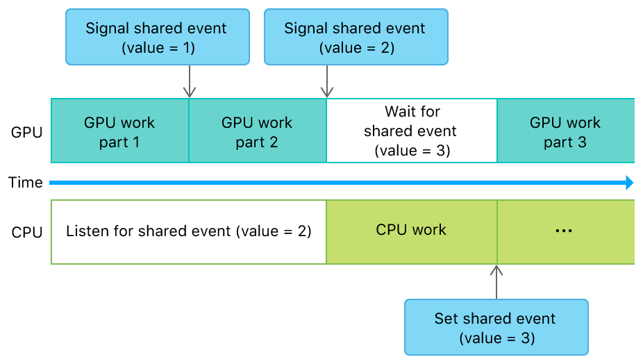

#  Synchronizing Events Between a GPU and the CPU

> Use shareable events to synchronize your app's work between a GPU and the CPU.

使用可共享事件来同步应用程序在 GPU 和 CPU 之间的工作。

## Overview

> Use shareable events to specify synchronization points in your app that signal, wait for, set, or listen for specific work completion between a GPU and the CPU. Use [MTLSharedEvent](https://developer.apple.com/documentation/metal/mtlsharedevent?language=objc), [MTLSharedEventListener](https://developer.apple.com/documentation/metal/mtlsharedeventlistener?language=objc), and [MTLCommandBuffer](https://developer.apple.com/documentation/metal/mtlcommandbuffer?language=objc) to specify these points in a command queue or a dispatch queue.

使用可共享事件在应用程序中指定同步点，以指示，等待，设置或侦听 GPU 与 CPU 之间的特定工作完成情况。使用 [MTLSharedEvent](https://developer.apple.com/documentation/metal/mtlsharedevent?language=objc)， [MTLSharedEventListener](https://developer.apple.com/documentation/metal/mtlsharedeventlistener?language=objc) 和 [MTLCommandBuffer](https://developer.apple.com/documentation/metal/mtlcommandbuffer?language=objc) 在命令队列或调度队列中指定这些点。

## Encode Synchronization Events Between a GPU and the CPU

> Call the [notifyListener:atValue:block:](https://developer.apple.com/documentation/metal/mtlsharedevent/2966574-notifylistener?language=objc) method to register a notification handler for the CPU that listens for a specific value to be signaled for a specific event. While listening for this value, the CPU continues executing its other tasks as it normally would. Call the [encodeSignalEvent:value:](https://developer.apple.com/documentation/metal/mtlcommandbuffer/2966542-encodesignalevent?language=objc) method to encode a command for the GPU that signals the event with the expected value. When the GPU executes this command, the notification handler executes the block of code that you provided.
>
> Call the [encodeWaitForEvent:value:](https://developer.apple.com/documentation/metal/mtlcommandbuffer/2966543-encodewaitforevent?language=objc) method to encode a command for the GPU that waits for a specific value to be signaled for a specific event. Until you signal this value, all future commands in the command queue are blocked. Set the expected value on the [signaledValue](https://developer.apple.com/documentation/metal/mtlsharedevent/2966575-signaledvalue?language=objc) property to signal the event from the CPU. This action allows the blocked command queue to continue its execution.
>
> The following illustration and code show a shareable event that synchronizes GPU work and CPU work.

调用 [notifyListener:atValue:block:](https://developer.apple.com/documentation/metal/mtlsharedevent/2966574-notifylistener?language=objc) 方法为 CPU 注册通知处理程序，该处理程序侦听特定事件发出的特定值。在侦听此值时，CPU 会像往常一样继续执行其他任务。调用 [encodeSignalEvent:value:](https://developer.apple.com/documentation/metal/mtlcommandbuffer/2966542-encodesignalevent?language=objc) 方法对 GPU 的命令进行编码，该命令发出具有指定值的事件。当 GPU 执行此命令时，通知处理程序将执行你提供的代码块。

调用 [encodeWaitForEvent:value:](https://developer.apple.com/documentation/metal/mtlcommandbuffer/2966543-encodewaitforevent?language=objc) 方法对 GPU 的命令进行编码，该命令等待特定事件的特定值的信号发出。在发出此值之前，命令队列中的所有后续命令都将被阻止。为 [signaledValue](https://developer.apple.com/documentation/metal/mtlsharedevent/2966575-signaledvalue?language=objc) 属性设置期望的值从 CPU 侧发出事件。此操作可以使阻塞的命令队列继续其执行。

以下插图和代码显示了一个可共享的事件，可以同步 GPU 工作和 CPU 工作。



```objc
- (void)setupGPUCPUEvent
{
    // Shareable event
    _sharedEvent = [_device newSharedEvent];

    // Shareable event listener
    dispatch_queue_t myQueue = dispatch_queue_create("com.example.apple-samplecode.MyQueue", NULL);
    _sharedEventListener = [[MTLSharedEventListener alloc] initWithDispatchQueue:myQueue];
}

- (void)renderFrame
{
    // Register CPU work
    [_sharedEvent notifyListener:_sharedEventListener
                         atValue:2
                         block:^(id<MTLSharedEvent> sharedEvent, uint64_t value) {
                            /* Do CPU work */
                            sharedEvent.signaledValue = 3;
    }];

    // Encode GPU work
    id<MTLCommandBuffer> commandBuffer = [_commandQueue commandBuffer];
    /* Encode GPU work part 1 */
    [commandBuffer encodeSignalEvent:_sharedEvent value:1];
    /* Encode GPU work part 2 */
    [commandBuffer encodeSignalEvent:_sharedEvent value:2];
    [commandBuffer encodeWaitForEvent:_sharedEvent value:3];
    /* Encode GPU work part 3 */
    [commandBuffer commit];
}
```
