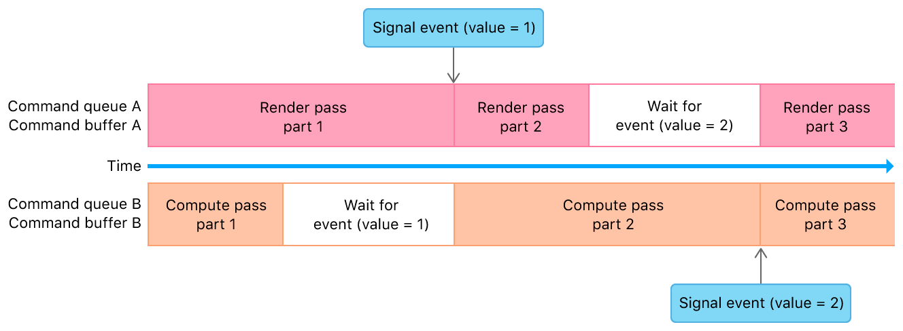

#  Synchronizing Events Within a Single Device

> Use nonshareable events to synchronize your app's work within a single device.

使用不可共享的事件在单个设备中同步应用的工作。

## Overview

> Use nonshareable events to specify synchronization points in your app that signal or wait for specific command completion within a single device. Use [MTLEvent](https://developer.apple.com/documentation/metal/mtlevent?language=objc) and [MTLCommandBuffer](https://developer.apple.com/documentation/metal/mtlcommandbuffer?language=objc) to specify these points across multiple command queues created from the same device.

Note - Don't use [MTLSharedEvent](https://developer.apple.com/documentation/metal/mtlsharedevent?language=objc) to synchronize events within a single device.

使用不可共享事件在应用程序中指定同步点，以指示或等待单个设备中的特定命令的完成。使用[MTLEvent](https://developer.apple.com/documentation/metal/mtlevent?language=objc) 和 [MTLCommandBuffer](https://developer.apple.com/documentation/metal/mtlcommandbuffer?language=objc) 在从同一设备创建的多个命令队列中指定这些点。

注意 - 不要使用 [MTLSharedEvent](https://developer.apple.com/documentation/metal/mtlsharedevent?language=objc) 来同步单个设备中的事件。

## Encode Synchronization Events Within a Single Device

> Call the [encodeWaitForEvent:value:](https://developer.apple.com/documentation/metal/mtlcommandbuffer/2966543-encodewaitforevent?language=objc) method to encode a command that waits for a specific value to be signaled for a specific event. Until the GPU signals this value, all future commands in the command queue are blocked. Call the [encodeSignalEvent:value:](https://developer.apple.com/documentation/metal/mtlcommandbuffer/2966542-encodesignalevent?language=objc) method to encode a command that signals the event with the expected value. When the GPU executes this command from an unblocked command queue, the blocked command queue continues its execution.
>
> The following illustration and code show a nonshareable event that synchronizes graphics rendering on one command queue with compute processing on another.

调用 [encodeWaitForEvent:value:](https://developer.apple.com/documentation/metal/mtlcommandbuffer/2966543-encodewaitforevent?language=objc) 方法对一个命令进行编码，该命令等待特定事件到达特定值。在 GPU 发出此信号之前，命令队列中的所有后续命令都将被阻止。调用 [encodeSignalEvent:value:](https://developer.apple.com/documentation/metal/mtlcommandbuffer/2966542-encodesignalevent?language=objc) 方法对一个命令进行编码，该命令使用期望的值发出信号。当 GPU 从未阻塞的命令队列执行此命令时，阻塞的命令队列继续执行。

下图和代码显示了一个不可共享的事件，该事件同步一个命令队列上的图形渲染与另一个命令队列上的计算处理。



```objc
- (void)setupSingleDeviceEvent
{
    // Nonshareable event
    _event = [_device newEvent];
    
    // Command queues
    _commandQueueA = [_device newCommandQueue];
    _commandQueueB = [_device newCommandQueue];
}

- (void)renderFrame
{
    // Command Queue A (Graphics Rendering)
    id<MTLCommandBuffer> commandBufferA = [_commandQueueA commandBuffer];
    /* Encode render pass part 1 */
    [commandBufferA encodeSignalEvent:_event value:1];
    /* Encode render pass part 2 */
    [commandBufferA encodeWaitForEvent:_event value:2];
    /* Encode render pass part 3 */
    [commandBufferA commit];

    // Command Queue B (Compute Processing)
    id<MTLCommandBuffer> commandBufferB = [_commandQueueB commandBuffer];
    /* Encode compute pass part 1 */
    [commandBufferB encodeWaitForEvent:_event value:1];
    /* Encode compute pass part 2 */
    [commandBufferB encodeSignalEvent:_event value:2];
    /* Encode compute pass part 3 */
    [commandBufferB commit];
}
```
