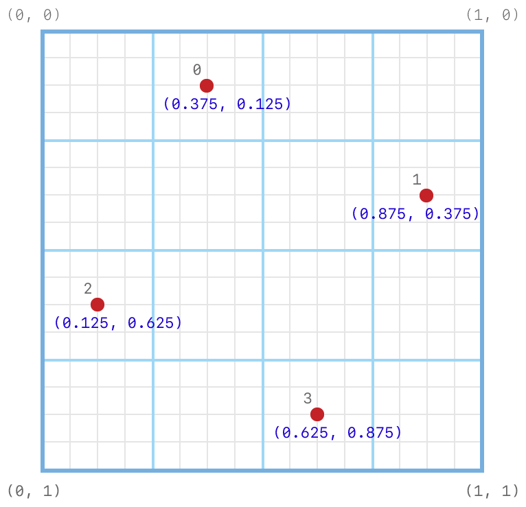
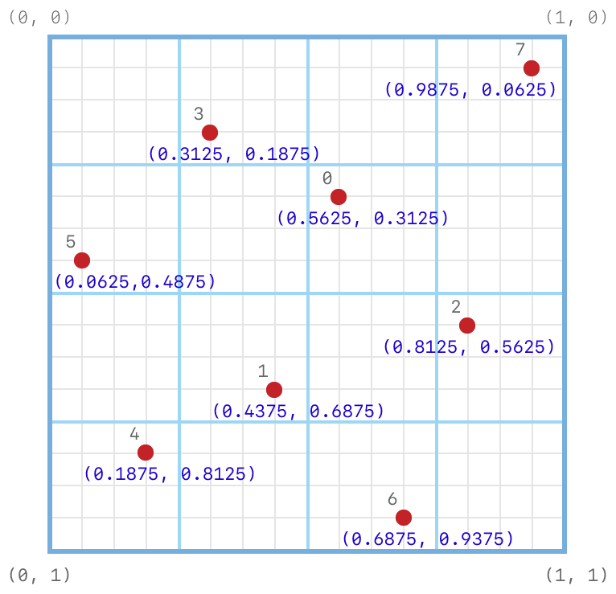

#  Using Programmable Sample Positions

> Configure the position of samples when rendering to a multisampled render target.

用于更新一组渲染目标的命令集合。

## Overview

> Traditional multisample anti-aliasing (MSAA) operations use fixed sample positions, defined by the GPU, that sample and resolve subpixels using the same pattern for all render passes.
>
> Programmable sample positions unlock additional rendering techniques because they can be configured into custom patterns that can be reused or repositioned for any render pass.

传统的多样本抗锯齿（ MSAA ）操作使用由 GPU 定义的固定样本位置，该操作对于所有的渲染过程使用相同的模式采样并解析子像素。

可编程样本位置解锁了其他渲染技术，因为它们可以配置为自定义模式，对于任意渲染过程可以重用或重新定位样本位置。

## The Subpixel Grid

> Programmable sample positions are set on a 4-bit subpixel grid (16 x 16 subpixels). Floating-point values are in the [0.0, 1.0) range along each axis, with the origin (0, 0) defined at the top-left corner. Values can be set from 0/16 up to 15/16, inclusive, in 1/16 increments along each axis.

可编程样本位置设置在 4 位子像素网格（ 16 x 16 子像素）上。沿每个轴的浮点值在 [0.0, 1.0] 范围内，原点（0, 0）定义在左上角。值可以设置为 0/16 到 15/16 ，每个轴以 1/16 为增量。


## Specifying Programmable Sample Positions

> Programmable sample positions are defined as an array of [MTLSamplePosition](https://developer.apple.com/documentation/metal/mtlsampleposition?language=objc) values. You set them by calling the [setSamplePositions:count:](https://developer.apple.com/documentation/metal/mtlrenderpassdescriptor/2866524-setsamplepositions?language=objc) method of a [MTLRenderPassDescriptor](https://developer.apple.com/documentation/metal/mtlrenderpassdescriptor?language=objc) object.

可编程样本位置被定义为 [MTLSamplePosition](https://developer.apple.com/documentation/metal/mtlsampleposition?language=objc) 值的数组。可以通过调用 [MTLRenderPassDescriptor](https://developer.apple.com/documentation/metal/mtlrenderpassdescriptor?language=objc) 对象的 [setSamplePositions:count:](https://developer.apple.com/documentation/metal/mtlrenderpassdescriptor/2866524-setsamplepositions?language=objc) 方法来设置它们。

```objc
static const MTLSamplePosition samplePositions[4] = {
    0.25, 0.25,
    0.75, 0.25,
    0.75, 0.75,
    0.25, 0.75,
};
[renderPassDescriptor setSamplePositions:samplePositions count:4];
```

> The following grid shows the programmable sample positions in the samplePositions array:

以下网格显示了 samplePositions 数组中的可编程样本位置：


## Querying Default Sample Positions

> You can query sample positions for a specific sample count by calling the [getDefaultSamplePositions:count:](https://developer.apple.com/documentation/metal/mtldevice/2866120-getdefaultsamplepositions?language=objc) method.

可以通过调用 [getDefaultSamplePositions:count:](https://developer.apple.com/documentation/metal/mtldevice/2866120-getdefaultsamplepositions?language=objc) 方法查询特定样品计数的样品位置。

### Default 1-sample Position

> The following table and grid show the position index, values, and placement for the default 1-sample position.

下表和网格显示默认单样本位置的位置索引，值和位置。

Position index | Position values
:------------: | :-------------:
0 | 0.5, 0.5


### Default 2-sample Positions

> The following table and grid show the position indices, values, and placements for the default 2-sample positions.

下表和网格显示默认双样本位置的位置索引，值和位置。

Position index | Position values
:------------: | :-------------:
0 | 0.75, 0.75
1 | 0.25, 0.25


### Default 4-sample Positions

> The following table and grid show the position indices, values, and placements for the default 4-sample positions.

下表和网格显示默认 4 样本位置的位置索引，值和放置。

Position index | Position values
:------------: | :-------------:
0 | 0.375, 0.125
1 | 0.875, 0.375
2 | 0.125, 0.625
3 | 0.625, 0.875



### Default 8-sample Positions

> The following table and grid show the position indices, values, and placements for the default 8-sample positions.

下表和网格显示默认 8 样本位置的位置索引，值和放置。

Position index | Position values
:------------: | :-------------:
0 | 0.5625, 0.3125
1 | 0.4375, 0.6875
2 | 0.8125, 0.5625
3 | 0.3125, 0.1875
4 | 0.1875, 0.8125
5 | 0.0625, 0.4375
6 | 0.6875, 0.9375
7 | 0.9375, 0.0625



## Support for Programmable Sample Positions

> Support for programmable sample positions varies by device. You can query it by calling the [programmableSamplePositionsSupported](https://developer.apple.com/documentation/metal/mtldevice/2866117-programmablesamplepositionssuppo?language=objc) property.
>
> Additionally, the number of programmable sample positions supported (the number of elements in a [MTLSamplePosition](https://developer.apple.com/documentation/metal/mtlsampleposition?language=objc) array) depends on the supported sample count. This value also varies by device; you can query it by calling the [supportsTextureSampleCount:](https://developer.apple.com/documentation/metal/mtldevice/1433355-supportstexturesamplecount?language=objc) method.
>
> Note - The number of programmable sample positions in a render pass must always match the render pass sample count.

对可编程样品位置的支持因设备而异。可以通过调用 [programmableSamplePositionsSupported](https://developer.apple.com/documentation/metal/mtldevice/2866117-programmablesamplepositionssuppo?language=objc) 属性来查询相关信息。

此外，支持的可编程样本位置数（ [MTLSamplePosition](https://developer.apple.com/documentation/metal/mtlsampleposition?language=objc) 数组中元素的数目）取决于支持的样本数。该值也因设备而异；可以通过调用 [supportsTextureSampleCount:](https://developer.apple.com/documentation/metal/mtldevice/1433355-supportstexturesamplecount?language=objc) 方法来查询它。

注意 - 一个渲染过程中可编程样本位置的数量必须始终与渲染过程样本计数相匹配。
