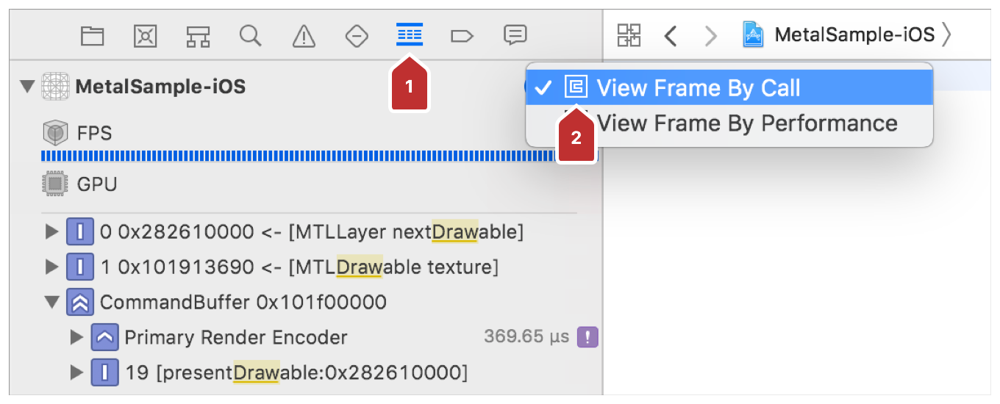
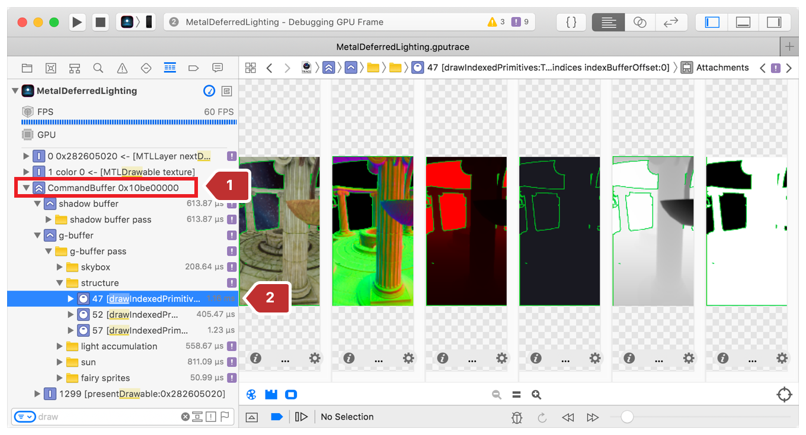
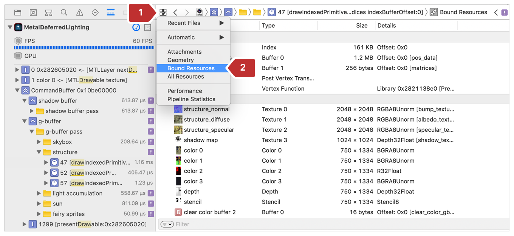
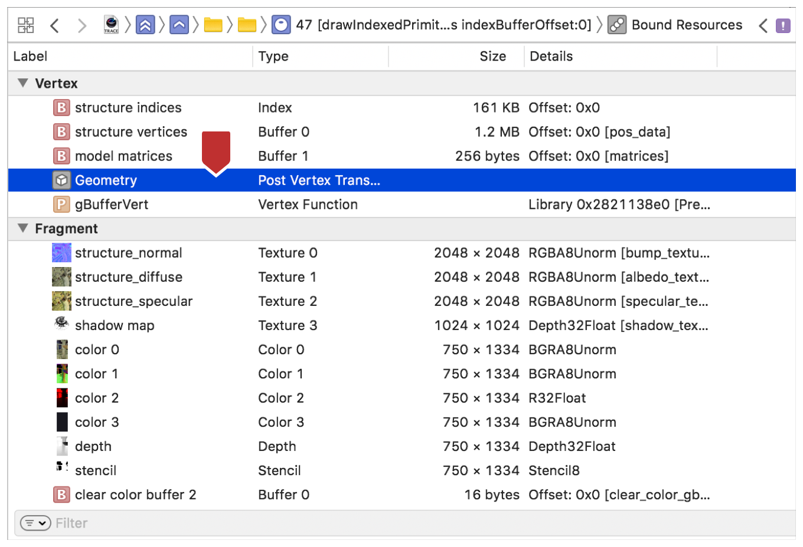
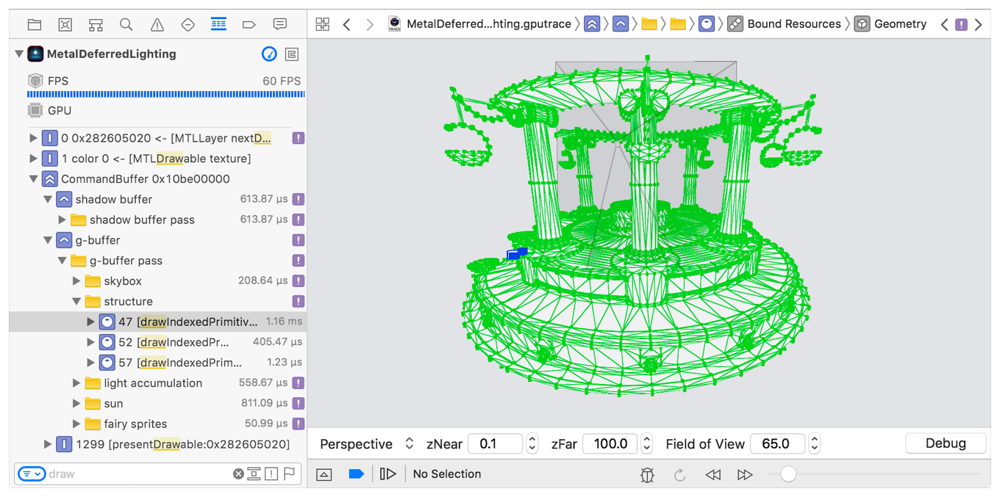
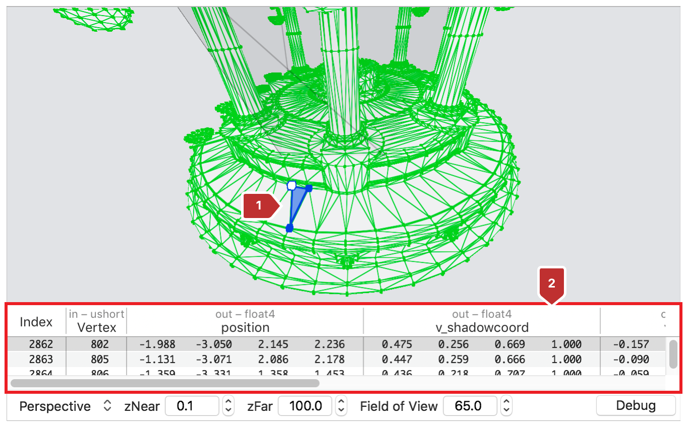

#  Vertex Data

> Points that specify precise locations within the textures associated with graphics processing.

指定与图形处理相关联的纹理内精确位置的点。

## Overview

> Use vertex data to specify the area within source pixel data that a render command will draw. You also use vertex data to specify the precise location within your rendering targets on which a draw call renders. Often times, the bit you're drawing is just a piece of a larger sheet, for example, a single image that lies within an atlas of images that line up next to each other in the texture; you use vertex data to outline those specific areas.

使用顶点数据指定渲染命令将绘制的源像素数据中的区域。还可以使用顶点数据指定绘制命令渲染的目标上的精确位置。通常情况下，你绘制的位只是较大 sheet 的一部分，例如，位于图像图集中的单个图像，这些图像在纹理中彼此相邻排列；你使用顶点数据来圈定这些特定区域。

## Topics

### Vertex Data

### [Inspecting Vertices with the Geometry Viewer](https://developer.apple.com/documentation/metal/vertex_data/inspecting_vertices_with_the_geometry_viewer?language=objc)

> Find problems with geometry by navigating a free-fly camera outside of your camera's frustum and checking vertex values.

通过在相机的平截头体外导航自由飞行相机并检查顶点值来查找几何问题。

#### Overview

> See a wireframe view of the geometry you submitted in the captured frame for debugging purposes. The geometry viewer allows you to select individual primitives in the wireframe with the mouse and check their vertex data. Using pan and pinch gestures on the trackpad, you can also navigate a free-fly camera, which allows you to view your frame's geometry from any angle.

查看捕获的帧中提交的几何体的线框视图，以进行调试。几何查看器允许你使用鼠标在线框中选择单个图元并检查其顶点数据。使用触控板上的平移和捏合手势，还可以导航自由飞行相机，从而可以从任何角度查看帧的几何图形。

#### Open the Geometry Viewer

> Access the geometry viewer within a captured Metal frame. Most commonly, you capture a Metal frame by clicking the camera button on Xcode's debug bar as covered in [Performing a GPU Capture from the Debug Bar](https://developer.apple.com/documentation/metal/tools_profiling_and_debugging/metal_gpu_capture/performing_a_gpu_capture_from_the_debug_bar?language=objc). For more ways to capture a Metal frame, see [Metal GPU Capture](https://developer.apple.com/documentation/metal/tools_profiling_and_debugging/metal_gpu_capture?language=objc).
>
> From the captured frame, display the call list using the steps hightlighted in Figure 1:
>
> 1. In Xcode, enable the Debug navigator.
>
> 2. In the Debug navigator, choose View Frame By Call.
>
> Figure 1 Viewing the frame by call

访问捕获的 Metal 帧内的几何查看器。最常见的是，通过单击 Xcode 调试栏上的相机按钮捕获 Metal 帧，如  [Performing a GPU Capture from the Debug Bar](https://developer.apple.com/documentation/metal/tools_profiling_and_debugging/metal_gpu_capture/performing_a_gpu_capture_from_the_debug_bar?language=objc) 中所述。有关捕获 Metal 帧的更多方法，见 [Metal GPU Capture](https://developer.apple.com/documentation/metal/tools_profiling_and_debugging/metal_gpu_capture?language=objc) 。

从捕获的帧中，使用图 1 中的高亮显示步骤显示调用列表：

1. 在 Xcode 中，启用 Debug 导航器。

2. 在“Debug”导航器中，选择“View Frame By Call”。

图 1 Viewing the frame by call

> From the call list, open the draw's related items using the steps illustrated in Figure 2:
>
> 1. In the sidebar, expand your command buffer.
>
> 2. Select the draw call.
>
> Figure 2 Selecting a draw in the call list

从调用列表中，使用图 2 中所示的步骤打开绘图的相关项：

1. 在侧栏中，展开命令缓冲区。

2. 选择绘制调用。

图 2 Selecting a draw in the call list

> View the draw's bound resources using the steps in :
>
> 1. Click Related Items.
>
> 2. Select Bound Resources.
>
> Figure 3 Viewing the draw's bound resources

使用以下步骤查看绘图的绑定资源：

1. 单击“Related Items”。

2. 选择“Bound Resources”。

图 3 查看绘图的绑定资源

> In the Bound Resources list, double-click Geometry.
>
> Figure 4 The Geometry item in the draw's bound resources

在“ Bound Resources”列表中，双击“Geometry”。

图 4 绘图绑定资源中的 Geometry 项

> Then, the draw's geometry shows in Xcode's center pane. Figure 5 shows the geometry associated with the draw call selected above.
>
> Figure 5 The draw's geometry

然后，绘图的几何图形显示在 Xcode 的中心窗格中。图 5 显示了与上面选择的绘图调用相关的几何体。

图 5 绘图的几何形状

#### Inspect Vertex Values

> Look to the variables view to ensure the input and output to your vertex function is correct. To do that:
>
> 1. Select a primitive in Xcode's center pane.
>
> 2. See the variables view below it fill with the primitive's vertex values.
>
> Figure 6 Highlighted variables view

查看变量视图以确保顶点函数的输入和输出正确。要做到这一点：

1. 在 Xcode 的中心窗格中选择一个图元。

2. 查看下面的变量视图，它填充了图元的顶点值。

图 6 突出显示的变量视图

> If your vertex function has multiple outputs, refer to additional columns to the right of "position."
>
> Note - If the variables view is not open, drag it up from the bottom, or choose Bound Resources from Related Items again and double-click Geometry to reveal the variables view.

如果你的顶点函数有多个输出，参考“position”右侧的其他列。

注意 - 如果变量视图未打开，请从底部向上拖动，或再次从“Related Items”中选择“Bound Resources”，然后双击“Geometry”以显示变量视图。

#### Navigate the Scene with the Free-Fly Camera

> Attain a new perspective on your frame's geometry by using trackpad gestures to change the viewing angle. This allows you to verify draw call geometry that lies outside of the camera's frustum.
>
> Figure 7 Selected geometry after panning the camera to a specfic region

通过使用触控板手势更改视角，获得几何体的新视角。这允许你可以验证位于相机平截头体外的集合体。

图 7 将相机平移到特定区域后选择的几何图形
