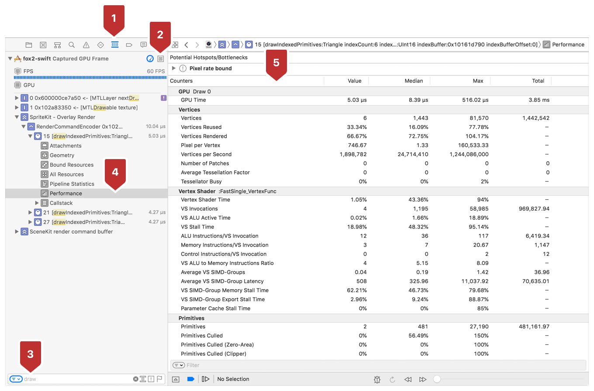
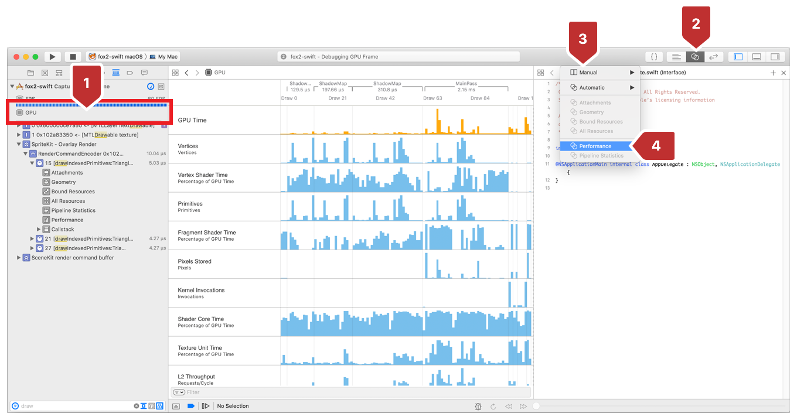
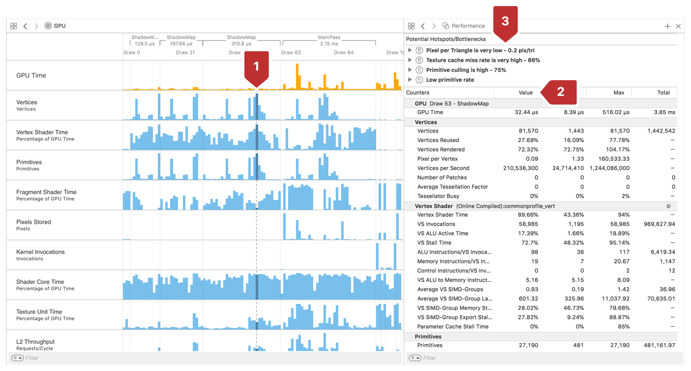
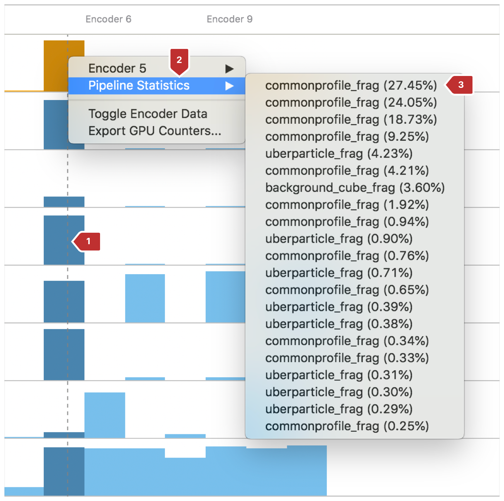

#  Viewing Performance Metrics with GPU Counters

> Ensure that properties related to an encoder's rendering are within the desired range.

确保与编码器渲染相关的属性在期望范围内。

## Overview

> You use the GPU Counters information panel to examine metrics with regard to your app's render command encoder. Use GPU Counters in conjunction with the shader profiler to direct your optimizations to the work your command encoder does most. Access GPU Counters from either the call list, or the Pipeline Activity bar chart. For more information about the shader profiler, see [Optimizing Performance with the Shader Profiler](https://developer.apple.com/documentation/metal/gpu_functions_libraries/optimizing_performance_with_the_shader_profiler?language=objc).

你可以使用 GPU 计数器信息面板检查与应用程序的渲染命令编码器相关的指标。结合使用 GPU 计数器与着色分析器来指引你对命令编码器执行最多的工作进行优化。可以通过调用列表或 Pipeline Activity bar chart 访问 GPU 计数器。有关着色分析器的更多信息，见 [Optimizing Performance with the Shader Profiler](https://developer.apple.com/documentation/metal/gpu_functions_libraries/optimizing_performance_with_the_shader_profiler?language=objc) 。

## Start with a Frame Capture

> View GPU Counter statistics within a Metal frame capture. Most commonly, you capture a Metal frame by clicking the camera button on Xcode's debug bar as covered in [Performing a GPU Capture from the Debug Bar](https://developer.apple.com/documentation/metal/tools_profiling_and_debugging/metal_gpu_capture/performing_a_gpu_capture_from_the_debug_bar?language=objc). For more ways to capture a Metal frame, see [Metal GPU Capture](https://developer.apple.com/documentation/metal/tools_profiling_and_debugging/metal_gpu_capture?language=objc).

查看 Metal 帧捕获中的 GPU 计数器统计信息。最常见的是，通过单击 Xcode 调试栏上的相机按钮捕获 Metal 帧，如 [Performing a GPU Capture from the Debug Bar](https://developer.apple.com/documentation/metal/tools_profiling_and_debugging/metal_gpu_capture/performing_a_gpu_capture_from_the_debug_bar?language=objc) 所述。有关捕获 Metal 帧的更多方法，见 [Metal GPU Capture](https://developer.apple.com/documentation/metal/tools_profiling_and_debugging/metal_gpu_capture?language=objc) 。

## View Counters with the Call List

> From the captured frame, observe GPU counters by using the following steps, and as annotated in Figure 1:
>
> 1. In Xcode, enable the Debug navigator.
>
> 2. Choose View Frame By Call.
>
> 3. Filter the call list by function, by entering draw in the filter field.
>
> 4. Expand a draw in the call list and select Performance.
>
> 5. In the Counters column, observe the GPU counters for the encoder that contains the selected draw call.
>
> Figure 1 Viewing GPU counters with the call list

从捕获的帧中，使用以下步骤观察 GPU 计数器，如图 1 中所示：

1. 在 Xcode 中，启用 Debug 导航器。

2. 选择“View Frame By Call”。

3. 通过函数名过滤调用列表，例如，通过在过滤字段中输入 draw 来过滤。

4. 在调用列表中展开绘制并选择“Performance”。

5. 在“Counters”列中，观察包含所选绘制调用的编码器的 GPU 计数器。

图 1 使用调用列表查看 GPU 计数器

## View Counters with the Pipeline Activity Bar Chart

> From the captured frame, open the Performance view in Xcode's Assistant editor by using the following the steps, and as annotated in Figure 2:
>
> 1. In Xcode's Debug navigator, choose GPU.
>
> 2. In the toolbar, click to open the Assistant editor.
>
> 3. Click the Assistant editor's Manual option.
>
> 4. Choose Performance.
>
> Figure 2 Choosing Performance in the Assistant editor

从捕获的帧中，使用以下步骤在 Xcode 的 Assistant 编辑器中打开 Performance 视图，如图 2 中所示：

1. 在 Xcode 的 Debug 导航器中，选择 GPU 。

2. 在工具栏中，单击以打开“Assistant”编辑器。

3. 单击“Assistant 编辑器的手动”选项。

4. 选择性能。

图 2 在“Assistant”编辑器中选择“Performance”

> Observe the GPU counters view in Xcode's Assistant editor. Next, retarget the GPU counters pane by using the following steps, and as annoted in Figure 3:
>
> 1. In the bar chart, click an encoder's column to select it.
>
> 2. In the Counters list, observe the Value column populated with the selected encoder's data.
>
> 3. In the Bottlenecks section, see the recommendations that Xcode makes for the selected command encoder based on the GPU Counters data.
>
> Figure 3 GPU Counters of the selected command encoder

在 Xcode 的 Assistant 编辑器中观察 GPU 计数器视图。接下来，使用以下步骤重新定位 GPU 计数器窗格，如图 3 中所示：

1. 在条形图中，单击编码器的列以将其选中。

2. 在“Counters”列表中，观察所选编码器的数据填充的“Value”列。

3. 在 Bottlenecks 部分，查看 Xcode 根据 GPU 计数器数据为所选命令编码器提供的建议。

图 3 所选命令编码器的 GPU 计数器

> The size of the bar (see Figure 3, callout 1) represents the amount of time the encoder spent doing that GPU activity.
>
> In addition to seeing counters for a particular encoder, you can view the pipeline statistics for its long-running draws by using the following steps, and as annotated in Figure 4:
>
> 1. Select an encoder in the pipeline activity bar chart.
>
> 2. Control-click the encoder's bars and choose Pipeline Statistics from the menu.
>
> 3. Examine the long-running draws that are labeled by shader and sorted in descending order, with the longest-running draw at the top.
>
> Figure 4 Seeing the pipeline statistics for an encoder in the pipeline activity bar chart

条形图的大小（参见图 3 ，标注 1 ）表示编码器花费在 GPU 活动上的时间。

除了查看特定编码器的计数器之外，还可以使用以下步骤查看其长时间运行绘制的管道统计信息，如图 4 中所示：

1. 在管道活动条形图中选择编码器。

2. 按住 Control 键并单击编码器的栏，然后从菜单中选择“Pipeline Statistics”。

3. 检查由着色器标记并按降序排序的长时间运行的绘制，运行时间最长的在顶部。

图 4 在管道活动条形图中查看编码器的管道统计信息

> When you choose a draw from the list, its pipeline statistics are shown as detailed in [Viewing Pipeline Statistics of a Draw](https://developer.apple.com/documentation/metal/render_pipeline/viewing_pipeline_statistics_of_a_draw?language=objc).

从列表中选择绘图时，其管道统计信息即会显示出来，详见 [Viewing Pipeline Statistics of a Draw](https://developer.apple.com/documentation/metal/render_pipeline/viewing_pipeline_statistics_of_a_draw?language=objc) 。

## Interpret the GPU Counters

> The Value column aggregates all of the draws in the encoder that contains the current selection in the call list. The Median, Max, and Total columns refer to all of the encoders in the captured frame.

“Value”列聚合了包含调用列表中当前选择编码器的所有绘制。Max 和 Total 列指的是捕获帧中所有的编码器。
