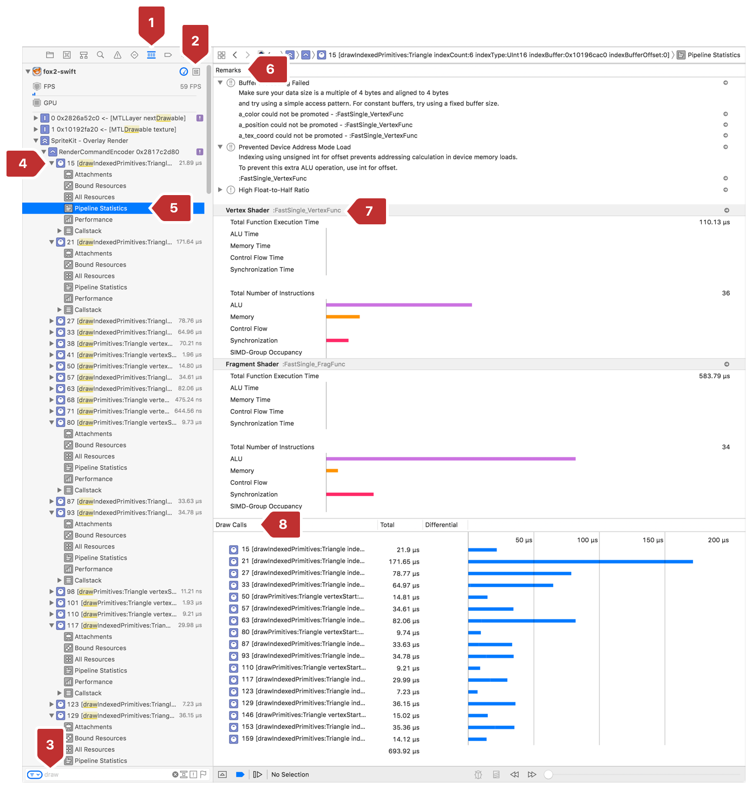

#  Viewing Pipeline Statistics of a Draw

> See relative percentages of where a given draw call spent its time across the GPU architecture.

查看给定绘制调用在 GPU 架构中花费时间的相对百分比。

## Overview

> View pipeline statistics to understand which GPU activities your draw call is performing the most. When the GPU is in one state for a relatively long time, it can indicate a performance bottleneck that you should consider optimizing.

查看管道统计信息以了解你的绘制调用执行最多的 GPU 活动。当 GPU 相当长的时间处于一种状态时，即指示了一个你应该考虑优化的性能瓶颈。

## Open the Pipeline Statistics of a Draw

> View the pipeline statistics of a draw call within a Metal frame capture. Most commonly, you capture a Metal frame by clicking the camera button on Xcode's debug bar as covered in [Performing a GPU Capture from the Debug Bar](https://developer.apple.com/documentation/metal/tools_profiling_and_debugging/metal_gpu_capture/performing_a_gpu_capture_from_the_debug_bar?language=objc). For more ways to capture a Metal frame, see [Metal GPU Capture](https://developer.apple.com/documentation/metal/tools_profiling_and_debugging/metal_gpu_capture?language=objc).
>
> From the captured frame, observe the pipeline statistics using the annotated steps in :
>
> 1. In Xcode, enable the Debug navigator.
>
> 2. Choose View Frame By Call.
>
> 3. Filter the call list by function name, by entering draw in the filter field.
>
> 4. Expand a draw in the call list.
>
> 5. Select Pipeline Statistics for the draw.
>
> 6. Observe the performance recommendations in the Remarks pane.
>
> 7. Examine the GPU metrics that compose the time taken by the vertex and fragment functions.
>
> 8. Compare the time taken by this draw call with similar calls in the same command encoder.
>
> Figure 1 The pipeline statistics of a draw

查看 Metal 帧捕获中的绘制调用的管道统计信息。最常见的是，通过单击 Xcode 调试栏上的相机按钮捕获 Metal 帧，如 [Performing a GPU Capture from the Debug Bar](https://developer.apple.com/documentation/metal/tools_profiling_and_debugging/metal_gpu_capture/performing_a_gpu_capture_from_the_debug_bar?language=objc) 中所述。有关捕获 Metal 帧的更多方法，请参阅 [Metal GPU Capture](https://developer.apple.com/documentation/metal/tools_profiling_and_debugging/metal_gpu_capture?language=objc) 。

从捕获的帧中，使用以下注释步骤观察管道统计信息：

1. 在 Xcode 中，启用 Debug 导航器。

2. 选择“View Frame By Call”。

3. 通过函数名过滤调用列表，例如，通过在过滤字段中输入 draw 来过滤。

4. 在调用列表中展开绘制。

5. 选择绘图的管道统计。

6. 观察“备注”窗格中的性能建议。

7. 检查由顶点和片段函数所用时间构成的 GPU 指标。

8. 将此绘制调用所花费的时间与同一命令编码器中的类似调用所花时间进行比较。

图 1 绘制的管道统计

## Interpret the GPU Activity Metrics

> Focus on the tasks that relate to the brunt of your draw call's work to get the most performance out of your optimization effort. Use the following table to see the types of improvements you should consider for your draw call based on the larger GPU activity your draw is doing.
>
> Table 1 Explanations for GPU activities.

专注于与你的绘图调用工作首当其冲的任务，以便从优化工作中获得最佳性能。使用下表查看绘制调用应考虑的改进类型，具体取决于绘制正在执行的较大 GPU 活动。

表格 1 GPU 活动解释。

GPU activity | Explanation
:------------ | :-------------
ALU | Time spent in the GPU's arithmetic logic unit. Changing floats to half floats where possible is one way to reduce time spent in the ALU. Another is to minimize complex instructions, like sqrt, sin, cos, recip, and so on.
Memory | Time spent waiting for access to your app's buffers or texture memory. You can shorten this time by down-sampling textures, or, if you're not spending much time in Memory, you could improve your texture resolution instead.
Control Flow | Time spent in conditional, increment, or jump instructions as a result of branches or loops in your shader. Use a constant interation count to minimize Control Flow time for loops because the Metal compiler can generate optimized code in those cases.
Synchronization | Time spent waiting for a required resource or event before execution could begin. Synchronization types are described below.
Synchronization (wait memory) | Waiting for dependent memory accesses issued in prior instructions, such as texture sampling or buffer read/write.
Synchronization (wait pixel) | Waiting for underlapping pixels to release resources. In addition to color attachments, pixels could be from depth or stencil buffers or user-defined resources. Blending is a common cause of pixel waiting. Use raster order groups to reduce time spent waiting for pixels.
Synchronization (barrier) | The thread reached a barrier and waits for remaining threads in the same group to arrive at the barrier before proceeding.
Synchronization (atomics) | Time spent on atomic instructions.

GPU 活动 | 说明
:------------ | :-------------
ALU | 在 GPU 的算术逻辑单元中花费的时间。改变浮点数为半浮点数可能是减少在 ALU 中花费时间的一种方式。另一种方式是减少复杂指令的使用，比如 sqrt，sin，cos，recip 等。
Memory | 等待访问应用程序缓冲区或纹理内存所花费的时间。可以通过下采样纹理来缩短此时间，或者，如果你没有在 Memory 这一项中花费太多时间，则可以提升纹理分辨率。
Control Flow | 由着色器中的分支或循环导致的条件，增量或跳转指令花费的时间。使用常量 interation 计数可以最小化循环的控制流时间，因为 Metal 编译器可以在这些情况下生成优化代码。
Synchronization | 在开始执行之前等待所需资源或事件所花费的时间。同步类型如下所述。
Synchronization (wait memory) | 等待先前指令中发出的存储器依赖访问，例如纹理采样或缓冲器读/写。
Synchronization (wait pixel)  | 等待重叠像素以释放资源。除了颜色附件，也可以是来自深度或模板缓冲区或用户定义的资源中的像素。混合是像素等待的常见原因。使用栅格顺序组可减少等待像素所花费的时间。
Synchronization (barrier) | 线程到达 barrier ，并在进一步处理之前等待同一组中的剩余线程到达 barrier 。
Synchronization (atomics) | 花在原子指令上的时间。
