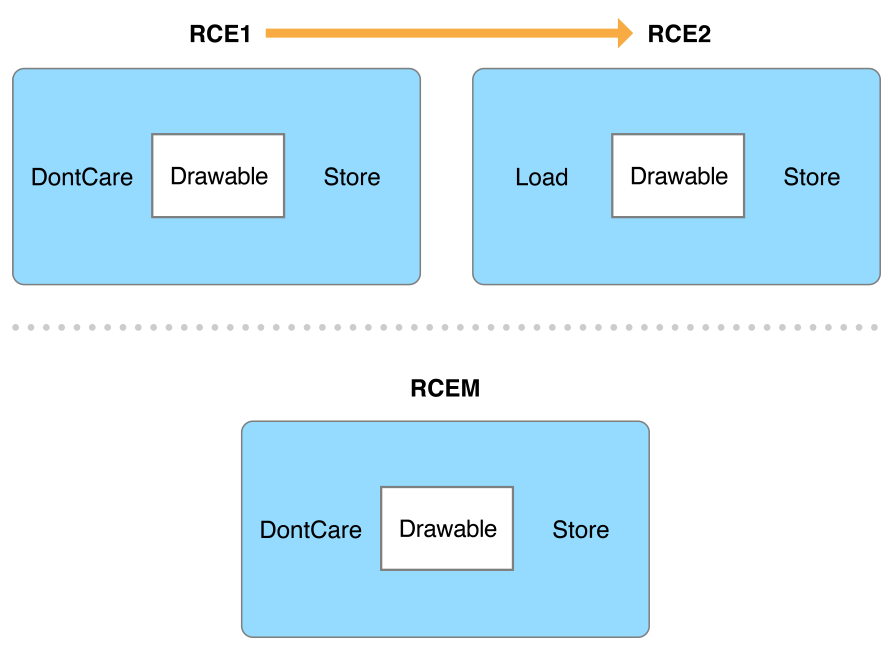
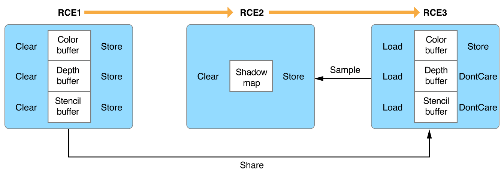
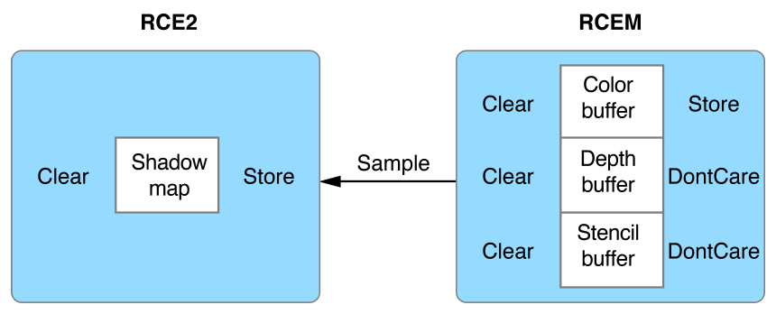
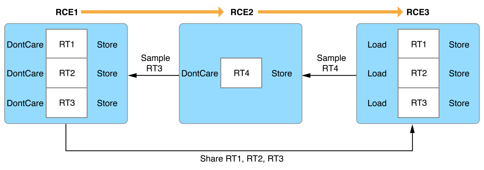

#  Metal Best Practices Guide - Metal 最佳实践指南

英文原文 https://developer.apple.com/library/archive/documentation/3DDrawing/Conceptual/MTLBestPracticesGuide/index.html#//apple_ref/doc/uid/TP40016642?language=objc

## Metal Best Practices - Metal 最佳实践

### Fundamental Concepts - 基础概念

> Metal provides the lowest-overhead access to the GPU, enabling you to maximize the graphics and compute potential of your app on iOS, macOS, and tvOS. Every millisecond and every bit is integral to a Metal app and the user experience–it’s your responsibility to make sure your Metal app performs as efficiently as possible by following the best practices described in this guide. Unless otherwise stated, these best practices apply to all platforms that support Metal.
>
> An efficient Metal app requires:
>
> - Low CPU overhead. Metal is designed to reduce or eliminate many CPU-side performance bottlenecks. Your app can benefit from this design only if you use the Metal API as recommended.
> - Optimal GPU performance. Metal allows you to create and submit commands to the GPU. To optimize GPU performance, your app should optimize the configuration and organization of these commands.
> - Continuous processor parallelism. Metal is designed to maximize CPU and GPU parallelism. Your app should keep these processors busy and working simultaneously.
> - Effective resource management. Metal provides simple yet powerful interfaces to your resource objects. Your app should manage these resources effectively to reduce memory consumption and increase access speed.

Metal 提供对 GPU 的最低开销访问，使你能够在 iOS ，macOS 和 tvOS 上最大化应用程序的图形和计算潜力。每毫秒和每个 bit 位都是 Metal 应用程序及用户体验的组成部分 - 你有责任通过遵循本指南中描述的最佳实践来确保 Metal 应用程序尽可能高效地运行。除非另有说明，这些最佳实践使用于支持 Metal 的所有平台。

高效的 Metal 应用程序需要：

-  低 CPU 开销。Metal 旨在减少或消除许多 CPU 端的性能瓶颈。只要按照推荐使用 Metal API ，你的应用程序才能从此设计中受益。
-  最佳 GPU 性能。Metal 允许创建并提交命令到 GPU 。要优化 GPU 性能，你的应用程序需要优化这些命令的配置和组织。
-  连续的处理器并行。Metal 旨在最大化 CPU 和 GPU 并行性。你的应用程序应该让这些处理器保持忙碌并让它们同时工作。
-  有效的资源管理。Metal 为资源对象提供了简单且强大的接口。你的应用程序应该有效地管理这些资源，以减少内存消耗并提高访问速度。

## Resource Management - 资源管理

### Persistent Objects - 持久对象

> Best Practice: Create persistent objects early and reuse them often.
>
> The Metal framework provides protocols to manage persistent objects throughout the lifetime of your app. These objects are expensive to create but are usually initialized once and reused often. You do not need to create these objects at the beginning of every render or compute loop.

最佳实践：尽早创建持久对象并经常重用它们

Metal 框架提供了协议管理应用程序整个生命周期内持久对象的。这些对象的创建成本很高，但通常会初始化一次并经常重复使用。你不需要在每个渲染或者计算循环的开头创建这些对象。

#### Initialize Your Device and Command Queue First - 首先初始化设备和命令队列

> Call the [MTLCreateSystemDefaultDevice](https://developer.apple.com/documentation/metal/1433401-mtlcreatesystemdefaultdevice) function at the start of your app to obtain the default system device. Next, call the [newCommandQueue](https://developer.apple.com/documentation/metal/mtldevice/1433388-newcommandqueue) or [newCommandQueueWithMaxCommandBufferCount:](https://developer.apple.com/documentation/metal/mtldevice/1433433-makecommandqueue) method to create a command queue for executing GPU instructions on that device.
>
> All apps should create only one [MTLDevice](https://developer.apple.com/documentation/metal/mtldevice) object per GPU and reuse it for all your Metal work on that GPU. Most apps should create only one [MTLCommandQueue](https://developer.apple.com/documentation/metal/mtlcommandqueue) object per GPU, though you may want more if each command queue represents different Metal work (for example, non-real-time compute processing and real-time graphics rendering).
>
> NOTE - Some macOS devices feature multiple GPUs. If you need to work with multiple GPUs, call the [MTLCopyAllDevices](https://developer.apple.com/documentation/metal/1433367-mtlcopyalldevices) function to obtain an array of available devices. Create and retain at least one command queue for each GPU you use.

在应用程序启动时调用 [MTLCreateSystemDefaultDevice](https://developer.apple.com/documentation/metal/1433401-mtlcreatesystemdefaultdevice) 函数获取默认系统设备。接下来，调用 [newCommandQueue](https://developer.apple.com/documentation/metal/mtldevice/1433388-newcommandqueue) 或 [newCommandQueueWithMaxCommandBufferCount:](https://developer.apple.com/documentation/metal/mtldevice/1433433-makecommandqueue) 方法创建用于在该设备上执行 GPU 指令的命令队列。

所有应用程序应该为每个 GPU 只创建一个 [MTLDevice](https://developer.apple.com/documentation/metal/mtldevice) 对象。大多数应用程序应该为每个 GPU 只创建一个 [MTLCommandQueue](https://developer.apple.com/documentation/metal/mtlcommandqueue) 对象，但如果每个命令队列代表不同的 Metal 工作（例如，非实时计算处理和实时图形渲染），你可能需要多个该对象。

注意 - 一些 macOS 设置具有多个 GPU 。如果你需要使用多个 GPU ，调用 [MTLCopyAllDevices](https://developer.apple.com/documentation/metal/1433367-mtlcopyalldevices) 函数获取可用设备的数组。为使用的每个 GPU 至少创建并保留一个命令队列。

#### Compile Your Functions and Build Your Library at Build Time - 在构建时编译函数并构建库

> For an overview of compiling your functions and building your library at build time, see the [Functions and Libraries](https://developer.apple.com/library/archive/documentation/3DDrawing/Conceptual/MTLBestPracticesGuide/FunctionsandLibraries.html#//apple_ref/doc/uid/TP40016642-CH24-SW1) best practices.
>
> At runtime, use the [MTLLibrary](https://developer.apple.com/documentation/metal/mtllibrary) and [MTLFunction](https://developer.apple.com/documentation/metal/mtlfunction) objects to access your library of graphics and compute functions. Avoid building your library at runtime or fetching functions during a render or compute loop.
>
> If you need to configure multiple render or compute pipelines, reuse [MTLFunction](https://developer.apple.com/documentation/metal/mtlfunction) objects whenever possible. You can release [MTLLibrary](https://developer.apple.com/documentation/metal/mtllibrary) and [MTLFunction](https://developer.apple.com/documentation/metal/mtlfunction) objects after building all render and compute pipelines that depend on them.

有关在构建时编译函数并构建库的概述，参见 [Functions and Libraries](https://developer.apple.com/library/archive/documentation/3DDrawing/Conceptual/MTLBestPracticesGuide/FunctionsandLibraries.html#//apple_ref/doc/uid/TP40016642-CH24-SW1) 最佳实践。

运行时，使用 [MTLLibrary](https://developer.apple.com/documentation/metal/mtllibrary) 和 [MTLFunction](https://developer.apple.com/documentation/metal/mtlfunction) 对象访问图形和计算函数库。避免在运行时构建库，避免在渲染或计算循环期间获取函数。

如果你需要配置多个渲染或计算管线，尽可能重用 [MTLFunction](https://developer.apple.com/documentation/metal/mtlfunction) 对象。在所有依赖它们的渲染和计算管线都构建好之后，你就可以释放 [MTLLibrary](https://developer.apple.com/documentation/metal/mtllibrary) 和 [MTLFunction](https://developer.apple.com/documentation/metal/mtlfunction) 对象了。

#### Build Your Pipelines Once and Reuse Them Often - 一次构建管线并经常重用它们

> Building a programmable pipeline involves an expensive evaluation of GPU state. You should build [MTLRenderPipelineState](https://developer.apple.com/documentation/metal/mtlrenderpipelinestate) and [MTLComputePipelineState](https://developer.apple.com/documentation/metal/mtlcomputepipelinestate) objects only once, then reuse them for every new render or compute command encoder you create. Do not build new pipelines for new command encoders. For an overview of building multiple pipelines asynchronously, see the [Pipelines](https://developer.apple.com/library/archive/documentation/3DDrawing/Conceptual/MTLBestPracticesGuide/Pipelines.html#//apple_ref/doc/uid/TP40016642-CH25-SW2) best practices.
>
> NOTE - In addition to render and compute pipelines, you may optionally create [MTLDepthStencilState](https://developer.apple.com/documentation/metal/mtldepthstencilstate) and [MTLSamplerState](https://developer.apple.com/documentation/metal/mtlsamplerstate) objects that encapsulate depth, stencil, and sampler state. These objects are less expensive but should also be created only once and reused often.

构建可编程管线涉及对 GPU 状态的昂贵评估。你应该只构建一次 [MTLRenderPipelineState](https://developer.apple.com/documentation/metal/mtlrenderpipelinestate) 和 [MTLComputePipelineState](https://developer.apple.com/documentation/metal/mtlcomputepipelinestate) 对象，然后为每一个新创建的渲染或计算命令编码器重用它们。不要为新的命令编码器构建新的管线。有关异步构建多个管线的概述，见 [Pipelines](https://developer.apple.com/library/archive/documentation/3DDrawing/Conceptual/MTLBestPracticesGuide/Pipelines.html#//apple_ref/doc/uid/TP40016642-CH25-SW2) 最佳实践。

注意 - 除了渲染和计算管线之外，你还可以选择性地创建 [MTLDepthStencilState](https://developer.apple.com/documentation/metal/mtldepthstencilstate) 和 [MTLSamplerState](https://developer.apple.com/documentation/metal/mtlsamplerstate) 对象，这些对象封装了深度，模板和采样器状态。这些对象的创建成本相对来说小很多，但也应仅创建一次并经常重复使用它们。

#### Allocate Resource Storage Up Front - 预先分配资源存储

> Resource data may be static or dynamic and accessed at various stages throughout the lifetime of your app. However, the [MTLBuffer](https://developer.apple.com/documentation/metal/mtlbuffer) and [MTLTexture](https://developer.apple.com/documentation/metal/mtltexture) objects that allocate memory for this data should be created as early as possible. After these objects are created, the resource properties and storage allocation are immutable, but the data itself is not; you can update the data whenever necessary.
>
> Reuse [MTLBuffer](https://developer.apple.com/documentation/metal/mtlbuffer) and [MTLTexture](https://developer.apple.com/documentation/metal/mtltexture) objects as much as possible, particularly for static data. Avoid creating new resources during a render or compute loop, even for dynamic data. For further information about buffers and textures, see the [Resource Management](https://developer.apple.com/library/archive/documentation/3DDrawing/Conceptual/MTLBestPracticesGuide/PersistentObjects.html#//apple_ref/doc/uid/TP40016642-CH3-SW1) and [Triple Buffering](https://developer.apple.com/library/archive/documentation/3DDrawing/Conceptual/MTLBestPracticesGuide/TripleBuffering.html#//apple_ref/doc/uid/TP40016642-CH5-SW1) best practices.

资源数据可能是静态的或动态的，同时也可能在应用整个程序生命周期的各个阶段被访问。然而，应尽早创建为资源数据分配内存的 [MTLBuffer](https://developer.apple.com/documentation/metal/mtlbuffer) 和 [MTLTexture](https://developer.apple.com/documentation/metal/mtltexture) 对象。创建这些对象后，资源属性和存储分配是不可变的，但数据本身可以改变；你可以在必要时更新数据。

尽可能重用 [MTLBuffer](https://developer.apple.com/documentation/metal/mtlbuffer) 和 [MTLTexture](https://developer.apple.com/documentation/metal/mtltexture) 对象，尤其是静态数据。避免在渲染或计算循环期间创建新的资源，即使是动态数据。关于缓冲区和纹理的更多信息，见 [Resource Management](https://developer.apple.com/library/archive/documentation/3DDrawing/Conceptual/MTLBestPracticesGuide/PersistentObjects.html#//apple_ref/doc/uid/TP40016642-CH3-SW1) 和 [Triple Buffering](https://developer.apple.com/library/archive/documentation/3DDrawing/Conceptual/MTLBestPracticesGuide/TripleBuffering.html#//apple_ref/doc/uid/TP40016642-CH5-SW1) 最佳实践。

### Resource Options - 资源选项

> Best Practice: Set appropriate resource storage modes and texture usage options.
>
> Your Metal resources must be configured appropriately to take advantage of fast memory access and driver performance optimizations. Resource storage modes allow you to define the storage location and access permissions for your [MTLBuffer](https://developer.apple.com/documentation/metal/mtlbuffer) and [MTLTexture](https://developer.apple.com/documentation/metal/mtltexture) objects. Texture usage options allow you to explicitly declare how you intend to use your [MTLTexture](https://developer.apple.com/documentation/metal/mtltexture) objects.

最佳实践：设置适当的资源存储模式和纹理使用选项

必须适当地配置你的 Metal 资源，以利用快速内存访问和驱动程序性能优化。资源存储模式允许你定义 [MTLBuffer](https://developer.apple.com/documentation/metal/mtlbuffer) 和 [MTLTexture](https://developer.apple.com/documentation/metal/mtltexture) 对象的存储位置和访问权限。纹理使用选项允许你显示声明打算如何使用 [MTLTexture](https://developer.apple.com/documentation/metal/mtltexture) 对象。

#### Familiarize Yourself with Device Memory Models - 熟悉设备内存模型

> Device memory models vary by operating system. iOS and tvOS devices support a unified memory model in which the CPU and the GPU share system memory. macOS devices support a discrete memory model with CPU-accessible system memory and GPU-accessible video memory.
>
> IMPORTANT
>
> - Some macOS devices feature integrated GPUs. In these devices, the driver optimizes the underlying architecture to support a discrete memory model. macOS Metal apps should always target a discrete memory model.
>
> - All iOS and tvOS devices feature integrated GPUs.

设备内存模型因操作系统而异。iOS 和 tvOS 设备支持统一的内存模型，CPU 和 GPU 共享系统内存。macOS 设备支持 CPU 可访问系统内存和 GPU 可访问视频内存的独立内存模型。

重要：
- 一些 macOS 设备为集成 GPU 。在这些设备中，驱动程序优化底层架构以支持分离内存模型。macOS Metal 应用程序应该总是以分离内存模型为目标。
- 所有 iOS 和 tvOS 设备都为集成 GPU 。

#### Choose an Appropriate Resource Storage Mode (iOS and tvOS) - 选择适当的资源存储模式（ iOS 和 tvOS ）

> In iOS and tvOS, the [Shared](https://developer.apple.com/documentation/metal/mtlstoragemode/mtlstoragemodeshared) mode defines system memory accessible to both the CPU and the GPU, whereas the [Private](https://developer.apple.com/documentation/metal/mtlstoragemode/private) mode defines system memory accessible only to the GPU.
>
> The [Shared](https://developer.apple.com/documentation/metal/mtlstoragemode/mtlstoragemodeshared) mode is usually the correct choice for iOS and tvOS resources. Choose the [Private](https://developer.apple.com/documentation/metal/mtlstoragemode/private) mode only if the CPU never accesses your resource.
>
> NOTE
>
> - In iOS and tvOS, the [memoryless](https://developer.apple.com/documentation/metal/mtlstoragemode/mtlstoragemodememoryless) storage mode is provided for memoryless textures. This storage mode can only be used for temporary render targets stored in on-chip tile memory. For further information, see Memoryless Textures in the [Metal Programming Guide](https://developer.apple.com/library/archive/documentation/Miscellaneous/Conceptual/MetalProgrammingGuide/Introduction/Introduction.html#//apple_ref/doc/uid/TP40014221).
>
> Figure 3-1Resource storage modes in iOS and tvOS

iOS 和 tvOS 中，[Shared](https://developer.apple.com/documentation/metal/mtlstoragemode/mtlstoragemodeshared) 模式定义了 CPU 和 GPU 都可以访问的系统内存，而 [Private](https://developer.apple.com/documentation/metal/mtlstoragemode/private) 模式定义了只有 GPU 可以访问的系统内存。

[Shared](https://developer.apple.com/documentation/metal/mtlstoragemode/mtlstoragemodeshared) 模式通常是 iOS 和 tvOS 资源的正确选择。仅当 CPU 从不访问你的资源时才选择 [Private](https://developer.apple.com/documentation/metal/mtlstoragemode/private) 模式。

注意：

- iOS 和 tvOS 中，[memoryless](https://developer.apple.com/documentation/metal/mtlstoragemode/mtlstoragemodememoryless) 存储模式用于无记忆纹理。这种存储模式只能用于存储于片上磁贴存储器中的用于临时渲染目标的纹理。关于更多信息，参阅  [Metal Programming Guide](https://developer.apple.com/library/archive/documentation/Miscellaneous/Conceptual/MetalProgrammingGuide/Introduction/Introduction.html#//apple_ref/doc/uid/TP40014221) 中 Memoryless Textures 章节。

图 3-1 iOS 和 tvOS 资源存储模式


#### Choose an Appropriate Resource Storage Mode (macOS)

> In macOS, the [Shared](https://developer.apple.com/documentation/metal/mtlstoragemode/mtlstoragemodeshared) mode defines system memory accessible to both the CPU and the GPU, whereas the [Private](https://developer.apple.com/documentation/metal/mtlstoragemode/private) mode defines video memory accessible only to the GPU.
>
> Additionally, macOS implements the [Managed](https://developer.apple.com/documentation/metal/mtlstoragemode/managed) mode that defines a synchronized memory pair for a resource, with one copy in system memory and another in video memory. Managed resources benefit from fast CPU and GPU access to each copy of the resource, with minimal API calls needed to synchronize these copies.
>
> Figure 3-2Resource storage modes in macOS
>
> 
>
> IMPORTANT
>
> - In macOS, the [Shared](https://developer.apple.com/documentation/metal/mtlstoragemode/mtlstoragemodeshared) mode is available only for buffers, not textures. Buffer data is usually linear, resulting in simple GPU access patterns. Textures are more complex and their data is usually tiled or swizzled, resulting in more complicated GPU access patterns.

##### Buffer Storage Mode (macOS)

> Use the following guidelines to determine the appropriate storage mode for a particular buffer.
>
> - If the buffer is accessed by the GPU exclusively, choose the [Private](https://developer.apple.com/documentation/metal/mtlstoragemode/private) mode. This is a common case for GPU-generated data, such as per-patch tessellation factors.
>
> - If the buffer is accessed by the CPU exclusively, choose the [Shared](https://developer.apple.com/documentation/metal/mtlstoragemode/mtlstoragemodeshared) mode. This is a rare case and is usually an intermediary step in a blit operation.
>
> - If the buffer is accessed by both the CPU and the GPU, as is the case with most vertex data, consider the following points and refer to [Table 3-1](https://developer.apple.com/library/archive/documentation/3DDrawing/Conceptual/MTLBestPracticesGuide/ResourceOptions.html#//apple_ref/doc/uid/TP40016642-CH17-SW4):
>
   > - For small-sized data that changes frequently, choose the [Shared](https://developer.apple.com/documentation/metal/mtlstoragemode/mtlstoragemodeshared) mode. The overhead of copying data to video memory may be more expensive than the overhead of the GPU accessing system memory directly.
   >
   > - For medium-sized data that changes infrequently, choose the [Managed](https://developer.apple.com/documentation/metal/mtlstoragemode/managed) mode. Always call an appropriate synchronization method after modifying the contents of a managed buffer.
   >
   > After performing a CPU write, call the [didModifyRange:](https://developer.apple.com/documentation/metal/mtlbuffer/1516121-didmodifyrange) method to notify Metal about the specific range of data that was modified; this allows Metal to update only that specific range in the video memory copy.
   >
   > After encoding a GPU write, encode a blit operation that includes a call to the [synchronizeResource:](https://developer.apple.com/documentation/metal/mtlblitcommandencoder/1400775-synchronize) method; this allows Metal to update the system memory copy after the associated command buffer has completed execution.
   >
   > - For large-sized data that never changes, choose the [Private](https://developer.apple.com/documentation/metal/mtlstoragemode/private) mode. Initialize and populate a source buffer with a [Shared](https://developer.apple.com/documentation/metal/mtlstoragemode/mtlstoragemodeshared) mode and then blit its data into a destination buffer with a [Private](https://developer.apple.com/documentation/metal/mtlstoragemode/private) mode. This is an optimal operation with a one-time cost.
>
> Table 3-1Choosing a storage mode for buffer data accessed by both the CPU and the GPU

Data size | Resource dirtiness | Update frequency | Storage mode
:------------: | :-------------: | :------------: | :------------:
Small | Full  | Every frame | [Shared](https://developer.apple.com/documentation/metal/mtlstoragemode/mtlstoragemodeshared)
Medium | Partial  | Every n frames | [Managed](https://developer.apple.com/documentation/metal/mtlstoragemode/managed)
Large | N/A | Once | [Private](https://developer.apple.com/documentation/metal/mtlstoragemode/private)((After a blit from a shared source buffer))

##### Texture Storage Mode (macOS)

> In macOS, the default storage mode for textures is [Managed](https://developer.apple.com/documentation/metal/mtlstoragemode/managed). Use the following guidelines to determine the appropriate storage mode for a particular texture.
>
> - If the texture is accessed by the GPU exclusively, choose the [Private](https://developer.apple.com/documentation/metal/mtlstoragemode/private) mode. This is a common case for GPU-generated data, such as displayable render targets.
>
> - If the texture is accessed by the CPU exclusively, choose the [Managed](https://developer.apple.com/documentation/metal/mtlstoragemode/managed) mode. This is a rare case and is usually an intermediary step in a blit operation.
>
> - If the texture is initialized once by the CPU and accessed frequently by the GPU, initialize a source texture with a [Managed](https://developer.apple.com/documentation/metal/mtlstoragemode/managed) mode and then blit its data into a destination texture with a [Private](https://developer.apple.com/documentation/metal/mtlstoragemode/private) mode. This is a common case for static textures, such as diffuse maps.
>
> - If the texture is accessed frequently by both the CPU and GPU, choose the [Managed](https://developer.apple.com/documentation/metal/mtlstoragemode/managed) mode. This is a common case for dynamic textures, such as image filters. Always call an appropriate synchronization method after modifying the contents of a managed texture.
>
   > To perform a CPU write to a specific region of data and simultaneously notify Metal about the change, call either of the following methods. This allows Metal to update only that specific region in the video memory copy.
   >
   > - [replaceRegion:mipmapLevel:withBytes:bytesPerRow:](https://developer.apple.com/documentation/metal/mtltexture/1515464-replaceregion)
   >
   > - [replaceRegion:mipmapLevel:slice:withBytes:bytesPerRow:bytesPerImage:](https://developer.apple.com/documentation/metal/mtltexture/1515679-replaceregion)
   >
   > After encoding a GPU write, encode a blit operation that includes a call to either of the following methods. This allows Metal to update the system memory copy after the associated command buffer has completed execution.
   >
   > - [synchronizeResource:](https://developer.apple.com/documentation/metal/mtlblitcommandencoder/1400775-synchronize)
   >
   > - [synchronizeTexture:slice:level:](https://developer.apple.com/documentation/metal/mtlblitcommandencoder/1400757-synchronizetexture)

#### Set Appropriate Texture Usage Flags - 设置适当的纹理使用标记
   
> Metal can optimize GPU operations for a given texture, based on its intended use. Always declare explicit texture usage options if you know them in advance. Do not rely on the [Unknown](https://developer.apple.com/documentation/metal/mtltextureusage/mtltextureusageunknown) option; although this option provides the most flexibility for your textures, it incurs a significant performance cost. The driver cannot perform any optimizations if it does not know how you intend to use your texture. For a description of available texture usage options, see the [MTLTextureUsage](https://developer.apple.com/documentation/metal/mtltextureusage) reference.

Metal 可以根据其预期用途优化对于给定纹理的 GPU 操作。如果你事先知道它们的用途，则始终声明显式纹理使用选项。不要依赖 [Unknown](https://developer.apple.com/documentation/metal/mtltextureusage/mtltextureusageunknown) 选项；虽然此选项为纹理提供了最大的灵活性，但却会产生显著的性能损失。如果驱动程序不知道你打算如何使用你的纹理，则无法执行任何优化。关于可用的纹理使用选项的描述，见 [MTLTextureUsage](https://developer.apple.com/documentation/metal/mtltextureusage) 参考。

### Triple Buffering - 三重缓冲

> Best Practice: Implement a triple buffering model to update dynamic buffer data.
>
> Dynamic buffer data refers to frequently updated data stored in a buffer. To avoid creating new buffers per frame and to minimize processor idle time between frames, implement a triple buffering model.

最佳实践：实现三重缓冲模型以更新动态缓冲区数据

动态缓冲区数据是指存储在缓冲区中的频繁更新的数据。为了避免每帧创建新缓冲区并且最小化帧之间的处理器空闲时间，请实现一个三重缓冲模型。

#### Prevent Access Conflicts and Reduce Processor Idle Time - 防止访问冲突并减少处理器空闲时间

> Dynamic buffer data is typically written by the CPU and read by the GPU. An access conflict occurs if these operations happen at the same time; the CPU must finish writing the data before the GPU can read it, and the GPU must finish reading that data before the CPU can overwrite it. If dynamic buffer data is stored in a single buffer, this causes extended periods of processor idle time when either the CPU is stalled or the GPU is starved. For the processors to work in parallel, the CPU should be working at least one frame ahead of the GPU. This solution requires multiple instances of dynamic buffer data, so the CPU can write the data for frame n+1 while the GPU reads the data for frame n.

动态缓冲数据通常由 CPU 写入并由 GPU 读取。如果这些操作同时发生，则会发生访问冲突；在 GPU 可以读取数据之前，CPU 必须完成数据写入，同时 GPU 必须在 CPU 覆写数据之前完成数据读取。如果动态缓冲数据存储在单个缓冲区中，则当 CPU 停滞或者 GPU 等待 CPU 写入新数据时，会导致处理器空闲时间延长。为使处理器并行工作，CPU 应该至少在 GPU 前一帧工作。此解决方案需要多个动态缓冲区数据实例，所以当 GPU 读取第 n 帧数据的同时 CPU 可以写第 n+1 帧的数据。

#### Reduce Memory Overhead and Frame Latency - 减小内存开销和帧延迟

> You can manage multiple instances of dynamic buffer data with a FIFO queue of reusable buffers. However, allocating too many buffers increases memory overhead and may limit memory allocation for other resources. Additionally, allocating too many buffers increases frame latency if the CPU work is too far ahead of the GPU work.
>
> IMPORTANT
>
> - Avoid creating new buffers per frame. For an overview of allocating resource storage up front, see the [Persistent Objects](https://developer.apple.com/library/archive/documentation/3DDrawing/Conceptual/MTLBestPracticesGuide/PersistentObjects.html#//apple_ref/doc/uid/TP40016642-CH4-SW1) best practices.

你可以使用可重用缓冲区的 FIFO 队列来管理多个动态缓冲数据实例。但是，分配太多缓冲区会增加内存开销并可能限制其他资源的内存分配。此外，如果 CPU 工作领先 GPU 太多的话，分配太多缓冲区会增加帧延迟。

重要：

- 避免每帧创建新的缓冲区。有关预先分配资源存储的概述，参见 [Persistent Objects](https://developer.apple.com/library/archive/documentation/3DDrawing/Conceptual/MTLBestPracticesGuide/PersistentObjects.html#//apple_ref/doc/uid/TP40016642-CH4-SW1) 最佳实践。

#### Allow Time for Command Buffer Transactions - 

> Dynamic buffer data is encoded and bound to a transient command buffer. It takes a certain amount of time to transfer this command buffer from the CPU to the GPU after it has been committed for execution. Similarly, it takes a certain amount of time for the GPU to notify the CPU that it has completed the execution of this command buffer. This sequence is detailed below, for a single frame:
>
> 1. The CPU writes to the dynamic data buffer and encodes commands into a command buffer.
>
> 2. The CPU schedules a completion handler ([addCompletedHandler:](https://developer.apple.com/documentation/metal/mtlcommandbuffer/1442997-addcompletedhandler)), commits the command buffer ([commit](https://developer.apple.com/documentation/metal/mtlcommandbuffer/1443003-commit)), and transfers the command buffer to the GPU.
>
> 3. The GPU executes the command buffer and reads from the dynamic data buffer.
>
> 4. The GPU completes its execution and calls the command buffer completion handler ([MTLCommandBufferHandler](https://developer.apple.com/documentation/metal/mtlcommandbufferhandler)).
>
> This sequence can be parallelized with two dynamic data buffers, but the command buffer transactions may cause the CPU to stall or the GPU to starve if either processor is waiting on a busy dynamic data buffer.

动态缓冲区数据被编码并绑定到瞬态命令缓冲区。在提交执行后，将此命令缓冲区从 CPU 传输到 GPU 需要一定的时间。类似的，GPU 需要一定的时间来通知 CPU 它已完成该命令缓冲区的执行。对于单个帧，此序列详述如下：

1. CPU 写数据到动态数据缓冲区并将命令编码至命令缓冲区。

2. CPU 调度完成处理程序（ [addCompletedHandler:](https://developer.apple.com/documentation/metal/mtlcommandbuffer/1442997-addcompletedhandler) ），提交命令缓冲区（ [commit](https://developer.apple.com/documentation/metal/mtlcommandbuffer/1443003-commit) ），并将命令缓冲区传输到 GPU 。

3. GPU 执行命令缓冲区并从动态数据缓冲区读取数据。

4. GPU 完成命令缓冲区的执行并调用命令缓冲区完成处理程序（ [MTLCommandBufferHandler](https://developer.apple.com/documentation/metal/mtlcommandbufferhandler) ）。

使用两个动态数据缓冲区，以上执行序列可以并行化，但是如果任一处理器正在等待繁忙的动态数据缓冲区，则命令缓冲区事务可能导致 CPU 空闲或 GPU 饥饿。

#### Implement a Triple Buffering Model - 实现三重缓冲模型

> Adding a third dynamic data buffer is the ideal solution when considering processor idle time, memory overhead, and frame latency. Figure 4-1 shows a triple buffering timeline, and Listing 4-1 shows a triple buffering implementation.
>
> Figure 4-1Triple buffering timeline

在考虑处理器空闲时间，内存开销和帧延迟时，添加第三个动态数据缓冲区是理想的解决方案。图 4-1 显示了一个三重缓冲时间线，清单 4-1 显示了一个三重缓冲实现。

图 4-1 三重缓冲时间线


清单 4-1 三重缓冲实现

```objc
static const NSUInteger kMaxInflightBuffers = 3;
/* Additional constants */

@implementation Renderer
{
    dispatch_semaphore_t _frameBoundarySemaphore;
    NSUInteger _currentFrameIndex;
    NSArray <id <MTLBuffer>> _dynamicDataBuffers;
    /* Additional variables */
}

- (void)configureMetal
{
    // Create a semaphore that gets signaled at each frame boundary.
    // The GPU signals the semaphore once it completes a frame's work, allowing the CPU to work on a new frame
    _frameBoundarySemaphore = dispatch_semaphore_create(kMaxInflightBuffers);
    _currentFrameIndex = 0;
    /* Additional configuration */
}

- (void)makeResources
{
    // Create a FIFO queue of three dynamic data buffers
    // This ensures that the CPU and GPU are never accessing the same buffer simultaneously
    MTLResourceOptions bufferOptions = /* ... */;
    NSMutableArray *mutableDynamicDataBuffers = [NSMutableArray arrayWithCapacity:kMaxInflightBuffers];
    for(int i = 0; i < kMaxInflightBuffers; i++)
    {
        // Create a new buffer with enough capacity to store one instance of the dynamic buffer data
        id <MTLBuffer> dynamicDataBuffer = [_device newBufferWithLength:sizeof(DynamicBufferData) options:bufferOptions];
        [mutableDynamicDataBuffers addObject:dynamicDataBuffer];
    }
    _dynamicDataBuffers = [mutableDynamicDataBuffers copy];
}

- (void)update
{
    // Advance the current frame index, which determines the correct dynamic data buffer for the frame
    _currentFrameIndex = (_currentFrameIndex + 1) % kMaxInflightBuffers;
    
    // Update the contents of the dynamic data buffer
    DynamicBufferData *dynamicBufferData = [_dynamicDataBuffers[_currentFrameIndex] contents];
    /* Perform updates */
}

- (void)render
{
    // Wait until the inflight command buffer has completed its work
    dispatch_semaphore_wait(_frameBoundarySemaphore, DISPATCH_TIME_FOREVER);
    
    // Update the per-frame dynamic buffer data
    [self update];
    
    // Create a command buffer and render command encoder
    id <MTLCommandBuffer> commandBuffer = [_commandQueue commandBuffer];
    id <MTLRenderCommandEncoder> renderCommandEncoder = [commandBuffer renderCommandEncoderWithDescriptor:_renderPassDescriptor];
    
    // Set the dynamic data buffer for the frame
    [renderCommandEncoder setVertexBuffer:_dynamicDataBuffers[_currentFrameIndex] offset:0 atIndex:0];
    /* Additional encoding */
    [renderCommandEncoder endEncoding];
    
    // Schedule a drawable presentation to occur after the GPU completes its work
    [commandBuffer presentDrawable:view.currentDrawable];
    
    __weak dispatch_semaphore_t semaphore = _frameBoundarySemaphore;
    [commandBuffer addCompletedHandler:^(id<MTLCommandBuffer> commandBuffer) {
        // GPU work is complete
        // Signal the semaphore to start the CPU work
        dispatch_semaphore_signal(semaphore);
    }];
    
    // CPU work is complete
    // Commit the command buffer and start the GPU work
    [commandBuffer commit];
}

@end
```

### Buffer Bindings - 缓冲区绑定

> Best Practice: Use an appropriate method to bind your buffer data to a graphics or compute function.
>
> Metal provides several API options for binding buffer data to a graphics or compute function so it can be processed by the GPU.
>
> NOTE
>
> - This chapter uses vertex function bindings as examples. Metal provides equivalent APIs for fragment and kernel functions in the [MTLRenderCommandEncoder](https://developer.apple.com/documentation/metal/mtlrendercommandencoder) and [MTLComputeCommandEncoder](https://developer.apple.com/documentation/metal/mtlcomputecommandencoder) classes.
>
> The [setVertexBytes:length:atIndex:](https://developer.apple.com/documentation/metal/mtlrendercommandencoder/1515846-setvertexbytes) method is the best option for binding a very small amount (less than 4 KB) of dynamic buffer data to a vertex function, as shown in Listing 5-1. This method avoids the overhead of creating an intermediary [MTLBuffer](https://developer.apple.com/documentation/metal/mtlbuffer) object. Instead, Metal manages a transient buffer for you.
>
> Listing 5-1Binding a very small amount (less than 4 KB) of dynamic buffer data

最佳实践：使用适当的方法将缓冲区数据绑定到图形或计算函数

Metal 提供了一些 API 选项用于将缓冲区数据绑定到图形或计算函数，绑定之后 GPU 就可以处理对应的缓冲区数据。

注意

- 本章节使用顶点函数绑定作为示例。Metal 为 [MTLRenderCommandEncoder](https://developer.apple.com/documentation/metal/mtlrendercommandencoder) 和 [MTLComputeCommandEncoder](https://developer.apple.com/documentation/metal/mtlcomputecommandencoder) 类中的片段和内核函数提供了等效的 API 。

[setVertexBytes:length:atIndex:](https://developer.apple.com/documentation/metal/mtlrendercommandencoder/1515846-setvertexbytes) 方法是将极小量（少于 4 KB ）的动态缓冲区数据绑定到顶点函数的最佳选项，如清单 5-1 所示。该方法避免了创建中间 [MTLBuffer](https://developer.apple.com/documentation/metal/mtlbuffer) 对象的开销。相反，Metal 为你管理一个瞬态缓冲区。

清单 5-1 绑定极小量（少于 4 KB ）动态缓冲区数据

```objc
float _verySmallData = 1.0;
[renderEncoder setVertexBytes:&_verySmallData length:sizeof(float) atIndex:0];
```

> If your data size is larger than 4 KB, create a [MTLBuffer](https://developer.apple.com/documentation/metal/mtlbuffer) object once and update its contents as needed. Call the [setVertexBuffer:offset:atIndex:](https://developer.apple.com/documentation/metal/mtlrendercommandencoder/1515829-setvertexbuffer) method to bind the buffer to a vertex function; if your buffer contains data used in multiple draw calls, call the [setVertexBufferOffset:atIndex:](https://developer.apple.com/documentation/metal/mtlrendercommandencoder/1515433-setvertexbufferoffset) method afterward to update the buffer offset so it points to the location of the corresponding draw call data, as shown in Listing 5-2. You do not need to rebind the currently bound buffer if you are only updating its offset.
>
> Listing 5-2Updating the offset of a bound buffer

如果你的数据大小大于 4 KB ，创建一个 [MTLBuffer](https://developer.apple.com/documentation/metal/mtlbuffer) 对象一次并根据需要更新其内容。调用 [setVertexBuffer:offset:atIndex:](https://developer.apple.com/documentation/metal/mtlrendercommandencoder/1515829-setvertexbuffer) 方法将缓冲区绑定到顶点函数；如果缓冲区包含用于多个绘制调用中使用的数据，调用 [setVertexBufferOffset:atIndex:](https://developer.apple.com/documentation/metal/mtlrendercommandencoder/1515433-setvertexbufferoffset) 方法来更新缓冲区偏移，使其指向绘制调用数据的相应的位置，如清单 5-2 所示。你不需要重新绑定当前绑定的缓冲区，如果仅更新其偏移量的话。

清单 5-2 更新绑定缓冲区的偏移量

```objc
// Bind the vertex buffer once
[renderEncoder setVertexBuffer:_vertexBuffer[_frameIndex] offset:0 atIndex:0];
for(int i=0; i<_drawCalls; i++)
{
    //  Update the vertex buffer offset for each draw call
    [renderEncoder setVertexBufferOffset:i*_sizeOfVertices atIndex:0];
    
    // Draw the vertices
    [renderEncoder drawPrimitives:MTLPrimitiveTypeTriangle vertexStart:0 vertexCount:_vertexCount];
}
```

## Display Management - 显示管理

### Drawables - 可绘

> Best Practice: Hold a drawable as briefly as possible.
>
> Most Metal apps implement a layer-backed view defined by a [CAMetalLayer](https://developer.apple.com/documentation/quartzcore/cametallayer) object. This layer vends an efficient displayable resource conforming to the [CAMetalDrawable](https://developer.apple.com/documentation/quartzcore/cametaldrawable) protocol, commonly referred to as a drawable. A drawable provides a [MTLTexture](https://developer.apple.com/documentation/metal/mtltexture) object that is typically used as a displayable render target attached to a [MTLRenderPassDescriptor](https://developer.apple.com/documentation/metal/mtlrenderpassdescriptor) object, with the goal of being presented on the screen.
>
> A drawable’s presentation is registered by calling a command buffer’s [presentDrawable:](https://developer.apple.com/documentation/metal/mtlcommandbuffer/1443029-present) method before calling its [commit](https://developer.apple.com/documentation/metal/mtlcommandbuffer/1443003-commit) method. However, the drawable itself is actually presented only after the command buffer has completed execution and the drawable has been rendered or written to.
>
> A drawable tracks whether it has outstanding render or write requests on it and will not present until those requests have been completed. A command buffer registers its drawable requests only when it is scheduled for execution. Registering a drawable presentation after the command buffer is scheduled guarantees that all command buffer work will be completed before the drawable is actually presented. Do not wait for the command buffer to complete its GPU work before registering a drawable presentation; this will cause a considerable CPU stall.
>
> IMPORTANT
>
> - To avoid presenting a drawable before any work is scheduled, or to avoid holding on to a drawable longer than necessary, call a command buffer’s [presentDrawable:](https://developer.apple.com/documentation/metal/mtlcommandbuffer/1443029-present) method instead of a drawable’s [present](https://developer.apple.com/documentation/metal/mtldrawable/1470284-present) method. [presentDrawable:](https://developer.apple.com/documentation/metal/mtlcommandbuffer/1443029-present) is a convenience method that calls the given drawable's [present](https://developer.apple.com/documentation/metal/mtldrawable/1470284-present) method via the command buffer's [addScheduledHandler:](https://developer.apple.com/documentation/metal/mtlcommandbuffer/1442991-addscheduledhandler) callback.

最佳实践：尽可能简要地持有 drawable

大多数 Metal 应用程序实现由 [CAMetalLayer](https://developer.apple.com/documentation/quartzcore/cametallayer) 对象定义的 layer-backed 视图。该 layer 提供了一个遵循 [CAMetalDrawable](https://developer.apple.com/documentation/quartzcore/cametaldrawable) 协议的有效可显示资源，通常称为 drawable 。drawable 提供了一个 [MTLTexture](https://developer.apple.com/documentation/metal/mtltexture) 对象，该对象通常用作附加到 [MTLRenderPassDescriptor](https://developer.apple.com/documentation/metal/mtlrenderpassdescriptor) 对象上用于在屏幕上显示的渲染目标。

通过在调用命令缓冲区的 [commit](https://developer.apple.com/documentation/metal/mtlcommandbuffer/1443003-commit) 方法之前调用其 [presentDrawable:](https://developer.apple.com/documentation/metal/mtlcommandbuffer/1443029-present) 方法来注册 drawable 的显示。但是，只有在命令缓冲区执行完毕并且完成对 drawable 的渲染或写入之后，drawable 的内容才会显示出来。

drawable 跟踪是否存在关于它的渲染或写入请求，在这些请求没有完成之前是不会呈现出内容的。只在其被调度执行的时候，命令缓冲区才注册其 drawable 请求。在调度命令缓冲区之后注册 drawable 的呈现可确保在实际呈现 drawable 之前完成所有命令缓冲区的工作。在注册 drawable 展示之前，不要等待命令缓冲区完成其 GPU 工作；这将导致相当大的 CPU 停滞。

重要：

- 为了避免在任何工作被调度之前呈现一个 drawable ，或者为了超过必要的持有 drawable ，调用命令缓冲区的 [presentDrawable:](https://developer.apple.com/documentation/metal/mtlcommandbuffer/1443029-present) 而不是 [present](https://developer.apple.com/documentation/metal/mtldrawable/1470284-present) 方法。[presentDrawable:](https://developer.apple.com/documentation/metal/mtlcommandbuffer/1443029-present) 是一个便利的方法，其通过命令缓冲区的 [addScheduledHandler:](https://developer.apple.com/documentation/metal/mtlcommandbuffer/1442991-addscheduledhandler) 回调调用给定 drawable 的 [present](https://developer.apple.com/documentation/metal/mtldrawable/1470284-present) 方法。

#### Hold a Drawable as Briefly as Possible - 尽可能简要地持有 drawable

> Drawables are expensive system resources created and maintained by the Core Animation framework. They exist within a limited and reusable resource pool and may or may not be available when requested by your app. If there is no drawable available at the time of your request, the calling thread is blocked until a new drawable becomes available (which is usually at the next display refresh interval).
>
> To hold a drawable as briefly as possible, follow these two steps:
>
> 1. Always acquire a drawable as late as possible; preferably, immediately before encoding an on-screen render pass. A frame’s CPU work may include dynamic data updates and off-screen render passes that you can perform before acquiring a drawable.
>
> 2. Always release a drawable as soon as possible; preferably, immediately after finalizing a frame’s CPU work. It is highly advisable to contain your rendering loop within an autorelease pool block to avoid possible deadlock situations with multiple drawables.
>
> NOTE
>
> - As of iOS 10 and tvOS 10, drawables can be safely held for post-presentation property queries, such as [drawableID](https://developer.apple.com/documentation/metal/mtldrawable/2806860-drawableid) and [presentedTime](https://developer.apple.com/documentation/metal/mtldrawable/2806855-presentedtime). Otherwise, drawables should be released when they are no longer needed, which is usually after a call to a command buffer’s [presentDrawable:](https://developer.apple.com/documentation/metal/mtlcommandbuffer/1443029-present) method.
>
> Figure 6-1 shows the lifetime of a drawable in relation to other CPU work.
>
> Figure 6-1The lifetime of a drawable

Drawables 是由 Core Animation 框架创建并维护的昂贵系统资源。它们存在于有限且可重复使用的资源池中，应用程序请求时，其可能可用，也可能不可用。若当你请求时没有可用的 drawable ，则调用线程将被阻塞，直到新的 drawable 变为可用状态（通常在下一个显示刷新间隔）。

尽可能简要地持有 drawable ，遵循以下两个步骤：

1. 总是尽可能晚的获取 drawable ；宁可在编码用于屏幕显示的渲染过程瞬间之前。帧绘制过程中，CPU 的工作包括更新动态数据及离屏渲染，你可以在获取 drawable 之前执行这些工作。

2. 务必尽快释放 drawable 对象，宁可在完成帧的 CPU 工作之后立马释放。在自动释放池块内包含你的渲染循环是非常明智的选择，以避免可能出现多个 drawables 的死锁情况。

注意：

- 从 iOS 10 和 tvOS 10 开始，drawables 可以安全地被持有用于 post-presentation 属性查询，例如 [drawableID](https://developer.apple.com/documentation/metal/mtldrawable/2806860-drawableid) 和 [presentedTime](https://developer.apple.com/documentation/metal/mtldrawable/2806855-presentedtime) 。否则，drawable 应该在不再需要时立即释放，这通常是在调用命令缓冲区的 [presentDrawable:](https://developer.apple.com/documentation/metal/mtlcommandbuffer/1443029-present) 方法之后。

图 6-1 显示了 drawable 相对于其他 CPU 工作的生命周期

图 6-1 drawable 生命周期


#### Use a MetalKit View to Interact with Drawables - 使用 MetalKit 和 Drawables 交互

> Using an [MTKView](https://developer.apple.com/documentation/metalkit/mtkview) object is the preferred way to interact with drawables. An [MTKView](https://developer.apple.com/documentation/metalkit/mtkview) object is backed by a [CAMetalLayer](https://developer.apple.com/documentation/quartzcore/cametallayer) object and provides the [currentDrawable](https://developer.apple.com/documentation/metalkit/mtkview/1535971-currentdrawable) property to acquire the drawable for the current frame. The current frame renders into this drawable and the [presentDrawable:](https://developer.apple.com/documentation/metal/mtlcommandbuffer/1443029-present) method schedules the actual presentation to occur at the next display refresh interval. The [currentDrawable](https://developer.apple.com/documentation/metalkit/mtkview/1535971-currentdrawable) property is automatically updated at the end of every frame.
>
> An [MTKView](https://developer.apple.com/documentation/metalkit/mtkview) object also provides the [currentRenderPassDescriptor](https://developer.apple.com/documentation/metalkit/mtkview/1536024-currentrenderpassdescriptor) convenience property that references the current drawable’s texture; use this property to create a render command encoder that renders into the current drawable. A call to the [currentRenderPassDescriptor](https://developer.apple.com/documentation/metalkit/mtkview/1536024-currentrenderpassdescriptor) property implicitly acquires the drawable for the current frame, which is then stored in the [currentDrawable](https://developer.apple.com/documentation/metalkit/mtkview/1535971-currentdrawable) property.
>
> NOTE
>
> - If you create your own [UIView](https://developer.apple.com/documentation/uikit/uiview) or [NSView](https://developer.apple.com/documentation/appkit/nsview) subclass that is backed by a [CAMetalLayer](https://developer.apple.com/documentation/quartzcore/cametallayer) object, you must explicitly acquire a drawable and use its texture to configure a render pass descriptor. You can also do this for your own [MTKView](https://developer.apple.com/documentation/metalkit/mtkview) object, but it is much easier to simply use the [currentRenderPassDescriptor](https://developer.apple.com/documentation/metalkit/mtkview/1536024-currentrenderpassdescriptor) convenience property. For an example of how to acquire a drawable from a [UIView](https://developer.apple.com/documentation/uikit/uiview) or [NSView](https://developer.apple.com/documentation/appkit/nsview) subclass, see the MetalBasic3D sample.
>
> Listing 6-1 shows how to use a drawable with a MetalKit view.
>
> Listing 6-1Using drawables with a MetalKit view

使用 [MTKView](https://developer.apple.com/documentation/metalkit/mtkview) 对象是与 drawables 交互的首先方式。[MTKView](https://developer.apple.com/documentation/metalkit/mtkview) 对象由 [CAMetalLayer](https://developer.apple.com/documentation/quartzcore/cametallayer) 对象支持，并提供 [currentDrawable](https://developer.apple.com/documentation/metalkit/mtkview/1535971-currentdrawable) 以获取当前帧的 drawable 。当前帧渲染到这个 drawable 中并且 [presentDrawable:](https://developer.apple.com/documentation/metal/mtlcommandbuffer/1443029-present) 方法在下一个显示刷新间隔调度真实的内容以供显示。[currentDrawable](https://developer.apple.com/documentation/metalkit/mtkview/1535971-currentdrawable) 属性在每帧结束时自动更新。

[MTKView](https://developer.apple.com/documentation/metalkit/mtkview) 对象还提供 [currentRenderPassDescriptor](https://developer.apple.com/documentation/metalkit/mtkview/1536024-currentrenderpassdescriptor) 便利属性，该属性引用当前 drawable 的纹理；使用此属性创建渲染命令编码器将内容渲染到当前 drawable 中。调用 [currentRenderPassDescriptor](https://developer.apple.com/documentation/metalkit/mtkview/1536024-currentrenderpassdescriptor) 属性隐式获取当前帧的 drawable ，然后其被存储于 [currentDrawable](https://developer.apple.com/documentation/metalkit/mtkview/1535971-currentdrawable) 属性中。

注意：

- 如果创建自己的由 [CAMetalLayer](https://developer.apple.com/documentation/quartzcore/cametallayer) 对象支持的 UIView 或 NSView 子类，你必须显试地获取 drawable 并且使用其纹理去配置渲染过程描述符。你也可以为你的 [MTKView](https://developer.apple.com/documentation/metalkit/mtkview) 对象执行该操作，但使用 [currentRenderPassDescriptor](https://developer.apple.com/documentation/metalkit/mtkview/1536024-currentrenderpassdescriptor) 便捷属性要容易的多。有关如何从 [UIView](https://developer.apple.com/documentation/uikit/uiview) 或 [NSView](https://developer.apple.com/documentation/appkit/nsview) 子类获取一个 drawable 的示例，见 MetalBasic3D 示例。

清单 6-1 显示了如何使用带有 MetalKit 视图的 drawable

清单 6-1 使用带有 MetalKit 视图的 drawables

```objc
- (void)render:(MTKView *)view {
    // Update your dynamic data
    [self update];

    // Create a new command buffer
    id <MTLCommandBuffer> commandBuffer = [_commandQueue commandBuffer];

    // BEGIN encoding any off-screen render passes
    /* ... */
    // END encoding any off-screen render passes

    // BEGIN encoding your on-screen render pass
    // Acquire a render pass descriptor generated from the drawable's texture
    // 'currentRenderPassDescriptor' implicitly acquires the drawable
    MTLRenderPassDescriptor* renderPassDescriptor = view.currentRenderPassDescriptor;

    // If there's a valid render pass descriptor, use it to render into the current drawable
    if(renderPassDescriptor != nil) {
        id<MTLRenderCommandEncoder> renderCommandEncoder = [commandBuffer renderCommandEncoderWithDescriptor:renderPassDescriptor];
        /* Set render state and resources */
        /* Issue draw calls */
        [renderCommandEncoder endEncoding];
        // END encoding your on-screen render pass

        // Register the drawable presentation
        [commandBuffer presentDrawable:view.currentDrawable];
    }

    /* Register optional callbacks */
    // Finalize the CPU work and commit the command buffer to the GPU
    [commandBuffer commit];
}

- (void)drawInMTKView:(MTKView *)view {
    @autoreleasepool {
        [self render:view];
    }
}
```

### Native Screen Scale (iOS and tvOS) - 原生屏幕比例（ iOS 与 tvOS ）

> Best Practice: Render drawables at the exact pixel size of your target display.
>
> The pixel size of your drawables should always match the exact pixel size of their target display. This is critical to avoid rendering to off-screen pixels or incurring an additional sampling stage.
>
> The [UIScreen](https://developer.apple.com/documentation/uikit/uiscreen) class provides two properties that define the native size and scale factor of a physical screen: [nativeBounds](https://developer.apple.com/documentation/uikit/uiscreen/1617810-nativebounds) and [nativeScale](https://developer.apple.com/documentation/uikit/uiscreen/1617825-nativescale). Query the [nativeBounds](https://developer.apple.com/documentation/uikit/uiscreen/1617810-nativebounds) property to determine the native bounding rectangle of the screen, in pixels. Query the [nativeScale](https://developer.apple.com/documentation/uikit/uiscreen/1617825-nativescale) property to determine the native scale factor used to convert points to pixels.
>
> IMPORTANT
>
> In iOS and tvOS, most drawing technologies measure size in points instead of pixels. Your Metal app should always measure size in pixels and avoid points altogether. To learn more about the difference between these two units, see [Points Versus Pixels](https://developer.apple.com/library/archive/documentation/2DDrawing/Conceptual/DrawingPrintingiOS/GraphicsDrawingOverview/GraphicsDrawingOverview.html#//apple_ref/doc/uid/TP40010156-CH14-SW7).

最佳实践：以目标显示的精确像素大小渲染 drawables

drawables 的像素大小应该始终与目标显示的精确像素大小相匹配。这对于避免渲染到离屏像素或产生额外的采样阶段至关重要。

[UIScreen](https://developer.apple.com/documentation/uikit/uiscreen) 类提供了两个定义物理屏幕原生大小和比例因子的属性：[nativeBounds](https://developer.apple.com/documentation/uikit/uiscreen/1617810-nativebounds) 和 [nativeScale](https://developer.apple.com/documentation/uikit/uiscreen/1617825-nativescale) 。查询 [nativeBounds](https://developer.apple.com/documentation/uikit/uiscreen/1617810-nativebounds) 属性以确定屏幕的本机边界举行矩形，以像素为单位。查询 [nativeScale](https://developer.apple.com/documentation/uikit/uiscreen/1617825-nativescale) 属性以确定用于将点转换为像素的本地比例因子。

重要：

- iOS 和 tvOS 中，大多数绘制计算以点而不是像素来衡量大小。你的 Metal 应用程序应该始终以像素为单位测量大小，并完全避免使用点。要了解关于这两个单位之间差异的更多信息，见 [Points Versus Pixels](https://developer.apple.com/library/archive/documentation/2DDrawing/Conceptual/DrawingPrintingiOS/GraphicsDrawingOverview/GraphicsDrawingOverview.html#//apple_ref/doc/uid/TP40010156-CH14-SW7) 。

#### Use a MetalKit View to Support Native Screen Scale - 使用 MetalKit 视图支持本机屏幕比例

> The MTKView class automatically supports native screen scale. By default, the size of the view’s current drawable is always guaranteed to match the size of the view itself.
>
> NOTE
>
> - If you create your own [UIView](https://developer.apple.com/documentation/uikit/uiview) subclass that is backed by a [CAMetalLayer](https://developer.apple.com/documentation/quartzcore/cametallayer) object, you must first set the view’s [contentScaleFactor](https://developer.apple.com/documentation/uikit/uiview/1622657-contentscalefactor) property to match the screen’s [nativeScale](https://developer.apple.com/documentation/uikit/uiscreen/1617825-nativescale) property. Next, make sure you adjust the size of your render targets whenever your view’s size changes. Finally, adjust the layer’s [drawableSize](https://developer.apple.com/documentation/quartzcore/cametallayer/1478174-drawablesize) property to match the native screen scale. For an example of how to match the native screen scale, see the MetalBasic3D sample.

MTKView 类自动支持本机屏幕比例。默认情况下，视图当前 drawable 的大小始终保证与视图本身的大小相匹配。

注意：

- 如果创建自己的由 [CAMetalLayer](https://developer.apple.com/documentation/quartzcore/cametallayer) 对象支持的 [UIView](https://developer.apple.com/documentation/uikit/uiview) 子类，你必须首先设置视图的 [contentScaleFactor](https://developer.apple.com/documentation/uikit/uiview/1622657-contentscalefactor) 以匹配屏幕的 [nativeScale](https://developer.apple.com/documentation/uikit/uiscreen/1617825-nativescale) 属性。接下来，确保在视图大小发生变化时调整渲染目标的大小。最后，调整 layer 的 [drawableSize](https://developer.apple.com/documentation/quartzcore/cametallayer/1478174-drawablesize) 以匹配本机屏幕因子。有关如何匹配本机屏幕比例的例子，见 MetalBasic3D 。

### Frame Rate (iOS and tvOS) - 帧率（ iOS 与 tvOS ）

> Best Practice: Present your drawables at a consistent and stable frame rate.
>
> Most apps target a frame rate of 60 FPS, equivalent to 16.67 ms per frame. However, apps that are consistently unable to complete a frame’s work within this time should target a lower frame rate to avoid jitter.
>
> IMPORTANT
>
> - The minimum acceptable frame rate for real-time gaming is 30 FPS. Lower frame rates are considered a poor user experience and should be avoided. If your app cannot maintain a minimum acceptable frame rate of 30 FPS, you should consider further optimizations or decreased workloads (spending less than 33.33 ms per frame).

最佳实践：以一致且稳定的帧率呈现你的 drawables

大多数应用程序的目标帧率为 60 FPS ，相当于每帧 16.67 ms 。但是，在此时间内始终无法完成一帧工作的应用应该以较低的帧率为目标以避免抖动。

重要：

- 对于实时游戏来说最低可接受的帧率为 30 FPS 。再低的帧率被认为是糟糕的用户体验，应该避免。如果你的应用程序无法保持 30 FPS 的最低可接受帧率，则应考虑进一步的优化或减少工作负载（每帧花费少于 33.33 ms ）。

#### Querying and Adjusting the Frame Rate - 查询并调整帧率

> The maximum frame rate of iOS and tvOS devices can be queried through the [maximumFramesPerSecond](https://developer.apple.com/reference/uikit/uiscreen/2806814-maximumframespersecond) property. For iOS devices, this value is usually 60 FPS; for tvOS devices, this value can vary based on the hardware capabilities of an attached screen or the user-selected resolution on Apple TV.
>
> Using an [MTKView](https://developer.apple.com/documentation/metalkit/mtkview) object is the recommended way to adjust your app’s frame rate. By default, the view renders at 60 FPS; to target a different frame rate, set the view’s [preferredFramesPerSecond](https://developer.apple.com/documentation/quartzcore/cadisplaylink/1648421-preferredframespersecond) property to your desired value.
>
> NOTE
>
> - A MetalKit view always rounds the value of [preferredFramesPerSecond](https://developer.apple.com/documentation/quartzcore/cadisplaylink/1648421-preferredframespersecond) to the nearest factor of the device’s [maximumFramesPerSecond](https://developer.apple.com/reference/uikit/uiscreen/2806814-maximumframespersecond) value. If your app cannot maintain its maximum target frame rate (e.g. 60 FPS), then set this property to a lower-factor frame rate (e.g. 30 FPS). Setting the value of [preferredFramesPerSecond](https://developer.apple.com/documentation/quartzcore/cadisplaylink/1648421-preferredframespersecond) to a non-factor frame rate may produce unexpected results.
>
> - Maintaining a target frame rate requires your app to completely update, encode, schedule, and execute a frame’s work during the allowed render interval time (e.g. less than 16.67ms per frame to maintain a 60 FPS frame rate).

iOS 和 tvOS 设备的最大帧率可以通过 [maximumFramesPerSecond](https://developer.apple.com/reference/uikit/uiscreen/2806814-maximumframespersecond) 属性查询得到。对于 iOS 设备，该值通常为 60 FPS ；对于 tvOS 设备，该值可能会因附加屏幕的硬件功能或 Apple TV 上用户选择的分辨率而异。

使用 [MTKView](https://developer.apple.com/documentation/metalkit/mtkview) 对象是调整应用程序帧率的推荐方式。默认情况下，视图以 60 FPS 渲染；设置该视图的 [preferredFramesPerSecond](https://developer.apple.com/documentation/quartzcore/cadisplaylink/1648421-preferredframespersecond) 为你所需的值来以不同的帧率渲染。

注意：

- MetalKit 视图始终将 [preferredFramesPerSecond](https://developer.apple.com/documentation/quartzcore/cadisplaylink/1648421-preferredframespersecond) 的值舍入到设备 [maximumFramesPerSecond](https://developer.apple.com/reference/uikit/uiscreen/2806814-maximumframespersecond) 值的最接近的因子。如果你的应用无法保持最大目标帧率（例如，60 FPS ），则将此属性设置为较低的帧率（如，30 FPS ）。将 [preferredFramesPerSecond](https://developer.apple.com/documentation/quartzcore/cadisplaylink/1648421-preferredframespersecond) 设置为 non-factor 帧率可能产生意外结果。

- 维持目标帧率要求你的应用在允许的渲染间隔时间内完成帧工作的更新、编码、调度和执行（如，每帧少于 16.67 ms 以维持 60 FPS 帧率）。

#### Adjust the Drawable Presentation Time - 调整 Drawable 显示时间

> The [presentDrawable:](https://developer.apple.com/documentation/metal/mtlcommandbuffer/1443029-present) method registers a drawable presentation to occur as soon as possible, which is usually at the next display refresh interval after the drawable has been rendered or written to. If your app can maintain its maximum target frame rate, as set via the [preferredFramesPerSecond](https://developer.apple.com/documentation/quartzcore/cadisplaylink/1648421-preferredframespersecond) property, then simply calling the [presentDrawable:](https://developer.apple.com/documentation/metal/mtlcommandbuffer/1443029-present) method is enough to maintain a consistent and stable frame rate.
>
> If your app targets a lower-factor frame rate, the display refresh rate (e.g. 60 FPS) may fire more frequently than your app’s render loop (e.g. 30 FPS). This means that the [presentDrawable:](https://developer.apple.com/documentation/metal/mtlcommandbuffer/1443029-present) method could present a drawable earlier than expected if a frame is rendered before the next display refresh interval (e.g. 16.67 ms intervals).
>
> The [presentDrawable:afterMinimumDuration:](https://developer.apple.com/documentation/metal/mtlcommandbuffer/2806849-present) method allows you to specify a minimum display time for each drawable, meaning that drawable presentations occur only after the previous drawable has spent enough time on the display. This lets you synchronize your drawable’s presentation time with your app’s render loop. The relationship between the [preferredFramesPerSecond](https://developer.apple.com/documentation/quartzcore/cadisplaylink/1648421-preferredframespersecond) and [presentDrawable:afterMinimumDuration:](https://developer.apple.com/documentation/metal/mtlcommandbuffer/2806849-present) API is shown in Listing 8-1
>
> Listing 8-1Presenting drawables after a minimum display time

[presentDrawable:](https://developer.apple.com/documentation/metal/mtlcommandbuffer/1443029-present) 方法注册一个 drawable 的显示，该显示会尽快发生，通常是在绘制或写入 drawable 之后的下一个显示刷新间隔发生。如果你的应用保持其最大目标帧率（通过 [preferredFramesPerSecond](https://developer.apple.com/documentation/quartzcore/cadisplaylink/1648421-preferredframespersecond) 属性设置的值），那么只需调用 [presentDrawable:](https://developer.apple.com/documentation/metal/mtlcommandbuffer/1443029-present) 即可保持一致且稳定的帧率。

如果你的应用以较低帧率为目标，显示刷新率（如，60 FPS ）可能会比应用的渲染循环（如，30 FPS ）更频繁地触发。这意味着如果在下一个显示刷新间隔（如 16.67 ms 间隔 ）之前渲染帧， [presentDrawable:](https://developer.apple.com/documentation/metal/mtlcommandbuffer/1443029-present) 方法可以比预期更早地呈现 drawable 。

[presentDrawable:afterMinimumDuration:](https://developer.apple.com/documentation/metal/mtlcommandbuffer/2806849-present) 方法允许你为每个 drawable 指定一个最小显示时间，这意味着只有在前一个 drawable 显示了如果长时间之后，当前 drawable 的呈现才会发生。这使你可以将 drawable 的呈现时间与应用的渲染循环同步。API [preferredFramesPerSecond](https://developer.apple.com/documentation/quartzcore/cadisplaylink/1648421-preferredframespersecond) 和 [presentDrawable:afterMinimumDuration:](https://developer.apple.com/documentation/metal/mtlcommandbuffer/2806849-present) 之间的关系如清单 8-1 所示。

清单 8-1 最小显示时间之后呈现 drawables

```objc
view.preferredFramesPerSecond = 30;
/* ... */
[commandBuffer presentDrawable:view.currentDrawable afterMinimumDuration:1.0/view.preferredFramesPerSecond];
```

## Command Generation - 命令的生成

### Load and Store Actions - 加载和存储操作

> Best Practice: Set appropriate load and store actions for your render targets.
>
> Actions performed on your Metal render targets must be configured appropriately to avoid costly and unnecessary rendering work at the start (load action) or end (store action) of a rendering pass.

最佳实践：为渲染目标设置适当的加载和存储操作

必须正确配置应用于 Metal 渲染目标上执行的操作，以避免在渲染过程的开始（加载操作）或结束（存储操作）时进行昂贵且不必要的渲染工作。

#### Choose an Appropriate Load Action - 选择适当的加载操作

> Use the following guidelines to determine the appropriate load action for a particular render target. These guidelines are also summarized in [Table 9-1](https://developer.apple.com/library/archive/documentation/3DDrawing/Conceptual/MTLBestPracticesGuide/LoadandStoreActions.html#//apple_ref/doc/uid/TP40016642-CH20-SW2).
>
> - If all the render target pixels are rendered to, choose the [DontCare](https://developer.apple.com/documentation/metal/mtlloadaction/dontcare) action. There are no costs associated with this action, and texture data is always interpreted as undefined.
>
> - If the previous contents of the render target do not need to be preserved and only some of its pixels are rendered to, choose the [Clear](https://developer.apple.com/documentation/metal/mtlloadaction/clear) action. This action incurs the cost of writing a clear value to each pixel.
>
> - If the previous contents of the render target need to be preserved and only some of its pixels are rendered to, choose the [Load](https://developer.apple.com/documentation/metal/mtlloadaction/load) action. This action incurs the cost of loading the previous contents.
>
> Table 9-1Choosing a render target load action

使用以下准则确定特定渲染目标适合的加载操作。表 [Table 9-1](https://developer.apple.com/library/archive/documentation/3DDrawing/Conceptual/MTLBestPracticesGuide/LoadandStoreActions.html#//apple_ref/doc/uid/TP40016642-CH20-SW2) 还总结了这些准则。

- 如果渲染会更新渲染目标的所有像素，选择 [DontCare](https://developer.apple.com/documentation/metal/mtlloadaction/dontcare) 操作。此项操作没有相关成本，纹理数据始终被解释为未定义的。
- 如果不需要保留渲染目标之前的内容并且仅渲染其某些像素，选择 [Clear](https://developer.apple.com/documentation/metal/mtlloadaction/clear) 操作。该操作会产生为每个像素写入 clear 值的成本。
- 如果需要保留渲染目标之前的内容并且仅渲染其某些像素，选择 [Load](https://developer.apple.com/documentation/metal/mtlloadaction/load) 操作。该操作会产生加载先前内容的成本

表 9-1 选择渲染目标加载操作

Previous contents preserved | Pixels rendered to | Load action
:------------: | :-------------: | :------------:
N/A  | All | [Dontcare](https://developer.apple.com/documentation/metal/mtlloadaction/dontcare)
NO | Some | [Clear](https://developer.apple.com/documentation/metal/mtlloadaction/clear)
YES | Some | [Load](https://developer.apple.com/documentation/metal/mtlloadaction/load)

#### Choose an Appropriate Store Action - 选择适当的存储操作

> Use the following guidelines to determine the appropriate store action for a particular render target.
>
> - If the contents of the render target do not need to be preserved, choose the [DontCare](https://developer.apple.com/documentation/metal/mtlstoreaction/dontcare) action. There are no costs associated with this action, and texture data is always interpreted as undefined. This is a common case for depth and stencil render targets.
>
> - If the contents of the render target need to be preserved, choose the Store action. This is always the case for drawables and other displayable render targets.
>
> - If the render target is a multisample texture, refer to Table 9-2.
>
> Table 9-2Choosing a render target store action for a multisample texture

使用以下准则确定特定渲染目标适合的存储操作。

- 如果不需要保留渲染目标的内容，选择 [DontCare](https://developer.apple.com/documentation/metal/mtlstoreaction/dontcare) 操作。该操作没有相关成本，纹理数据始终被解释为未定义的。这是深度和模版渲染目标的常见情况。

- 如果需要保留渲染目标的内容，选择 Store 操作。对于 drawables 和其他可显示的渲染目标，情况总是如此。

- 如果渲染目标是多重采样纹理，参考表 9-2 。

表 9-2 为多重采样纹理选择渲染目标存储操作

Multisampled contents preserved | Resolve texture specified | Resolved contents preserved | Store action
:------------: | :-------------: | :------------: | :------------:
Yes  | Yes | Yes | [storeAndMultisampleResolve](https://developer.apple.com/documentation/metal/mtlstoreaction/storeandmultisampleresolve)
No | Yes  | Yes | [MultisampleResolve](https://developer.apple.com/documentation/metal/mtlstoreaction/mtlstoreactionmultisampleresolve)
Yes | No | N/A | [Store](https://developer.apple.com/documentation/metal/mtlstoreaction/store)
No | No | N/A | [DontCare](https://developer.apple.com/documentation/metal/mtlstoreaction/dontcare)

> NOTE
>
> - If you need to perform a store-and-resolve operation, always use the [storeAndMultisampleResolve](https://developer.apple.com/documentation/metal/mtlstoreaction/storeandmultisampleresolve) action with a single render command encoder. Some feature sets do not support the [storeAndMultisampleResolve](https://developer.apple.com/documentation/metal/mtlstoreaction/storeandmultisampleresolve) action; instead, a store-and-resolve operation is performed with two render command encoders by using the [Store](https://developer.apple.com/documentation/metal/mtlstoreaction/store) and [MultisampleResolve](https://developer.apple.com/documentation/metal/mtlstoreaction/mtlstoreactionmultisampleresolve) actions.
>
> In some cases, the store action of a particular render target may not be known up front. To defer this decision, set the temporary [unknown](https://developer.apple.com/documentation/metal/mtlstoreaction/mtlstoreactionunknown) value when you create a [MTLRenderPassAttachmentDescriptor](https://developer.apple.com/documentation/metal/mtlrenderpassattachmentdescriptor) object. You must specify a known store action before you finish encoding your rendering pass, otherwise an error occurs. Setting the [unknown](https://developer.apple.com/documentation/metal/mtlstoreaction/mtlstoreactionunknown) value may avoid potential costs incurred by setting the [Store](https://developer.apple.com/documentation/metal/mtlstoreaction/store) store action prematurely.

注意：

- 如果需要执行 store-and-resolve 操作，请始终将 [storeAndMultisampleResolve](https://developer.apple.com/documentation/metal/mtlstoreaction/storeandmultisampleresolve) 与单个渲染命令编码器一起使用。一些功能集不支持 [storeAndMultisampleResolve](https://developer.apple.com/documentation/metal/mtlstoreaction/storeandmultisampleresolve) 操作；相反，通过使用 [Store](https://developer.apple.com/documentation/metal/mtlstoreaction/store) 和 [MultisampleResolve](https://developer.apple.com/documentation/metal/mtlstoreaction/mtlstoreactionmultisampleresolve) 操作，使用两个渲染命令编码器执行 store-and-resolve 操作。

在某些情况下，特定渲染目标的存储操作可能不会预先知道。要推迟此决定，请在创建 [MTLRenderPassAttachmentDescriptor](https://developer.apple.com/documentation/metal/mtlrenderpassattachmentdescriptor) 对象时设置临时的 [unknown](https://developer.apple.com/documentation/metal/mtlstoreaction/mtlstoreactionunknown) 值。在完成渲染过程的编码之前，必须指定一个已知的存储操作，否则会发生错误。设置 [unknown](https://developer.apple.com/documentation/metal/mtlstoreaction/mtlstoreactionunknown) 值可以避免因过早设置 [Store](https://developer.apple.com/documentation/metal/mtlstoreaction/store) 操作而产生的潜在成本。

#### Evaluate Actions Between Rendering Passes - 评估渲染过程之间的操作

> Render targets used across multiple rendering passes should be evaluated closely for optimal combinations of store and load actions between rendering passes. Table 9-3 lists these combinations.
>
> Table 9-3Store and load actions between rendering passes

应该仔细评估在多个渲染过程使用的渲染目标，以获得渲染过程之间的存储和加载操作的最佳组合。表 9-3 列出了这些组合。

表 9-3 渲染过程间的存储和加载操作

First rendering pass store action | Second rendering pass load action
:------------: | :-------------:
[DontCare](https://developer.apple.com/documentation/metal/mtlstoreaction/dontcare)  | One of the following actions:[DontCare](https://developer.apple.com/documentation/metal/mtlloadaction/dontcare) [Clear](https://developer.apple.com/documentation/metal/mtlloadaction/clear)
One of the following actions:[Store](https://developer.apple.com/documentation/metal/mtlstoreaction/store) [MultisampleResolve](https://developer.apple.com/documentation/metal/mtlstoreaction/mtlstoreactionmultisampleresolve) [storeAndMultisampleResolve](https://developer.apple.com/documentation/metal/mtlstoreaction/storeandmultisampleresolve) | [Load](https://developer.apple.com/documentation/metal/mtlloadaction/load)

### Render Command Encoders (iOS and tvOS) - 渲染命令编码器（ iOS 与 tvOS ）

> Best Practice: Merge render command encoders when possible.
>
> Eliminating unnecessary render command encoders reduces memory bandwidth and increases performance. You can achieve these goals by merging render command encoders into a single rendering pass, when possible. To determine whether two render command encoders are merge-compatible or not, you must carefully evaluate their render targets, load and store actions, relationships, and dependencies. The simplest criteria for two merge-compatible render command encoders, RCE1 and RCE2, are as follows:
>
> - RCE1 and RCE2 are created in the same frame.
>
> - RCE1 and RCE2 are created from the same command buffer.
>
> - RCE1 is created before RCE2.
>
> - RCE2 shares the same render targets as RCE1.
>
> - RCE2 does not sample from any render targets in RCE1.
>
> - RCE1’s render target store actions are either [Store](https://developer.apple.com/documentation/metal/mtlstoreaction/store) or [DontCare](https://developer.apple.com/documentation/metal/mtlstoreaction/dontcare), and RCE2’s render target load actions are either [Load](https://developer.apple.com/documentation/metal/mtlloadaction/load) or [DontCare](https://developer.apple.com/documentation/metal/mtlloadaction/dontcare).
>
> - No other render command encoders have been created between RCE1 and RCE2.
>
> If these criteria are met, RCE1 and RCE2 can be merged into a single render command encoder, RCEM, as shown in Figure 10-1.
>
> Figure 10-1A simple render command encoder merge

最佳实践：尽可能合并渲染命令编码器

消除不必要的渲染命令编码器可减少内存带宽并提高性能。可能的话，你可以通过将渲染命令编码器合并到单个渲染过程中来实现这些目标。要确定两个渲染命令编码器是否合并兼容，你必须仔细评估它们的渲染目标、加载和存储操作、关系及依赖关系。两个合并兼容的渲染命令编码器 RCE1 和 RCE2 最简单的标准如下：

- RCE1 和 RCE2 在同一帧中创建

- RCE1 和 RCE2 是从同一个命令缓冲区创建的

- RCE1 在 RCE2 之前创建

- RCE2 与 RCE1 共享相同的渲染目标

- RCE2 不从 RCE1 中的任何渲染目标采样

- RCE1 渲染目标的存储操作为 [Store](https://developer.apple.com/documentation/metal/mtlstoreaction/store) 或 [DontCare](https://developer.apple.com/documentation/metal/mtlstoreaction/dontcare) ，并且 RCE2 渲染目标的加载操作为 [Load](https://developer.apple.com/documentation/metal/mtlloadaction/load) 或 [DontCare](https://developer.apple.com/documentation/metal/mtlloadaction/dontcare) 。

- 在 RCE1 与 RCE2 之间没有创建其他渲染命令编码器

如果满足这些条件，RCE1 和 RCE2 可以合并为单个渲染命令编码器 RCEM ，如图 10-1 中所示。

图 10-1 简单的渲染命令编码器合并



> Additionally, if RCE1 can merge with a render command encoder created before it (RCE0) and RCE2 can merge with a render command encoder created after it (RCE3), then RCE0, RCE1, RCE2, and RCE3 can all be merged.
>
> The following sections provide guidelines for evaluating merge compatibility between render command encoders, assuming all other criteria are met.
>
> NOTE
>
> - The details of your rendering passes are specific to your app; therefore, this guide cannot provide specific advice for how to merge a particular set of render command encoders. Render command encoders are merged manually; there is no Metal API that automatically performs a merger for you. Most mergers are accomplished by coalescing draw calls, vertex or fragment functions, or render targets. Some mergers may even be accomplished with programmable blending, as shown in the [MetalDeferredLighting](https://developer.apple.com/library/archive/samplecode/MetalDeferredLighting/Introduction/Intro.html#//apple_ref/doc/uid/TP40014630) sample.
>
> - The number of render targets in a merged command encoder may not exceed the limits documented in [Metal Feature Sets](https://developer.apple.com/metal/feature-sets/).

另外，如果 RCE1 可以与在其之前创建的渲染命令编码器（ RCE0 ）合并，并且 RCE2 可以与在其之后创建的渲染命令编码器（ RCE3 ）合并，则 RCE0，RCE1，RCE2 和 RCE3 都可以合并。

假设满足其他所有条件，以下部分提供了评估渲染命令编码器之间合并兼容性的指南。

注意：

- 渲染通道的细节特定于具体的应用；因此，本指南无法提供有关如何合并特定渲染命令编码器集的具体建议。渲染命令编码器的合并是手工进行；没有 Metal API 自动为你执行合并。大多数合并是通过合并绘制调用，顶点和片段函数或者渲染目标来完成的。有些合并甚至可以通过可编程混合来完成，如 [MetalDeferredLighting](https://developer.apple.com/library/archive/samplecode/MetalDeferredLighting/Introduction/Intro.html#//apple_ref/doc/uid/TP40014630) 示例中所示。

- 合并之后的命令编码器中的渲染目标数量不得超过 [Metal Feature Sets](https://developer.apple.com/metal/feature-sets/) 中记录的限制。

#### Evaluate Rendering Pass Order - 评估渲染过程顺序

> Some apps may begin encoding into a render command encoder (RCE1) and prematurely end the initial rendering pass if they require additional dynamic data to proceed. The dynamic data is then generated in a separate rendering pass with a second render command encoder (RCE2). The initial rendering pass then continues with a third render command encoder (RCE3). Figure 10-2 shows this inefficient order, including the separated render command encoders.
>
> Figure 10-2An inefficient order of rendering passes

一些应用可能一开始将一些命令编码到渲染命令编码器（ RCE1 ），如果需要其他动态数据以继续，则会过早地结束初始渲染通道。然后在具有第二个渲染命令编码器（ RCE2 ）的单独渲染通道中生成动态数据。初始渲染过程继续使用第三个渲染命令编码器（ RCE3 ）。图 10-2 显示了这种低效的顺序，包含分离的渲染命令编码器。

图 10-2 渲染过程的低效顺序



> If RCE2 does not depend on RCE1, then RCE2 doesn’t need to be encoded after RCE1. Encoding RCE2 first allows RCE1 and RCE3 to be merged into RCEM because they represent the same rendering pass, and their dynamic data dependencies are guaranteed to be available at the start of the rendering pass. Figure 10-3 shows this improved order, including the merged render command encoders.
>
> Figure 10-3An improved order of rendering passes

如果 RCE2 不依赖于 RCE1 ，则 RCE2 不需要在 RCE1 之后编码。首先编码 RCE2 允许 RCE1 和 RCE3 合并为 RCEM ，因为它们表示相同的渲染过程，并且可以保证在渲染过程开始时动态数据依赖的东西处于可用状态。图 10-3 显示这种改进的顺序，包括合并的渲染命令编码器。

图 10-3 改进的渲染过程顺序



#### Evaluate Sampling Dependencies - 评估采样依赖性

> Render command encoders cannot be merged if there are any sampling dependencies between them. For render command encoders that share the same render targets, these dependencies may be introduced by additional render command encoders in between them, as shown in Figure 10-4.
>
> Figure 10-4Sampling dependencies between render command encoders

如果它们之间存在任何采样依赖关系，则无法合并渲染命令编码器。对于共享相同渲染目标的渲染命令编码器，可以通过它们之间的其他渲染命令编码器引入这些依赖关系，如图 10-4 所示。

图 10-4 渲染命令编码器之间的采样依赖



> RCE1 and RCE3 share the same render targets, RT1, RT2, and RT3. Furthermore, the actions between RCE1 and RCE3 indicate a continuation of a rendering pass. However, these render command encoders cannot be merged due to the sampling dependencies introduced by RCE2. RCE2 renders to a separate render target, RT4, which is sampled by RCE3. Additionally, RCE2 samples RT3 after it is rendered by RCE1. These sampling dependencies define a strict rendering pass order that prevents merging these render command encoders.

RCE1 与 RCE3 共享相同的渲染目标 - RT1，RT2，RT3 。此外，RCE1 与 RCE3 之间的动作表示渲染通道的连续。然而，这些渲染命令编码由于 RCE2 引入的采样依赖性而无法合并。RCE2 渲染到单独的渲染目标 RT4 ，RT4 被 RCE3 采样。此外，RCE2 在 RCE1 渲染 RT3 之后对其进行采样。这些采样依赖项定义了严格的渲染通道顺序，从而阻止了对这些渲染命令编码器的合并。

#### Evaluate Actions Between Rendering Passes - 评估渲染通道间的操作

> The store and load actions between render command encoder render targets are not as important as other criteria, but there are a few notable cases where additional consideration is due. Use the following guidelines to further understand merge compatibility between render command encoders RCE1 and RCE2, based on their shared render targets:
>
> - If the store action in RCE1 is [Store](https://developer.apple.com/documentation/metal/mtlstoreaction/store) and the load action in RCE2 is [Load](https://developer.apple.com/documentation/metal/mtlloadaction/load), the render target is merge-compatible and is typically continuing a rendering pass.
>
> - If the store action in RCE1 is [DontCare](https://developer.apple.com/documentation/metal/mtlstoreaction/dontcare) and the load action in RCE2 is [DontCare](https://developer.apple.com/documentation/metal/mtlstoreaction/dontcare), the render target is merge-compatible and is typically being used as an intermediary resource.
>
> - If the load action in RCE2 is [Clear](https://developer.apple.com/documentation/metal/mtlloadaction/clear), the render target is merge-compatible if a primitive clear operation can be performed in the merged render command encoder by first rendering clear values into a display-aligned quad.
>
> NOTE
>
> - For advice on choosing appropriate load and store actions for a particular render target, see the [Load and Store Actions](https://developer.apple.com/library/archive/documentation/3DDrawing/Conceptual/MTLBestPracticesGuide/LoadandStoreActions.html#//apple_ref/doc/uid/TP40016642-CH20-SW1) best practices.

渲染命令编码器渲染目标之间的存储和加载操作并不像其他标准那样重要，但有一些值得注意的额外考虑因素。使用以下准则可以进一步了解渲染命令编码器 RCE1 和 RCE2 之间基于共享渲染目标的合并兼容性：

- 如果 RCE1 中的存储操作是 [Store](https://developer.apple.com/documentation/metal/mtlstoreaction/store) 并且 RCE2 中的加载操作是 [Load](https://developer.apple.com/documentation/metal/mtlloadaction/load) ，则渲染目标是合并兼容的，并且通常为可以延续的渲染通道。

- 如果 RCE1 中的存储操作是 [DontCare](https://developer.apple.com/documentation/metal/mtlstoreaction/dontcare) 并且 RCE2 中的加载操作是 [DontCare](https://developer.apple.com/documentation/metal/mtlstoreaction/dontcare) ，渲染目标是合并兼容的，并且该渲染目标通常用作中间资源。

- 如果 RCE2 的加载操作是 [Clear](https://developer.apple.com/documentation/metal/mtlloadaction/clear) ，如果可以在合并的渲染命令编码器中执行图元清除操作，即首先将清除值渲染到 display-aligned 四边形中，那么渲染目标是合并兼容的。

注意：

- 有关为特定渲染目标选择适当加载和存储操作的建议，见 [Load and Store Actions](https://developer.apple.com/library/archive/documentation/3DDrawing/Conceptual/MTLBestPracticesGuide/LoadandStoreActions.html#//apple_ref/doc/uid/TP40016642-CH20-SW1) 最佳实践。

### Command Buffers - 命令缓冲区

> Best Practice: Submit the fewest possible command buffers per frame without underutilizing the GPU.
>
> Command buffers are the unit of work submission in Metal; they are created by the CPU and executed by the GPU. This relationship allows you to balance CPU and GPU work by adjusting the number of command buffers submitted per frame.
>
> Most Metal apps keep their CPU work one or two frames ahead of their GPU work by implementing triple buffering. This means that there is usually sufficient CPU work queued up to keep the GPU busy by submitting only one or two command buffers per frame (preferably one). However, if the CPU work does not keep far enough ahead of the GPU work, the GPU will starve. More frequent command buffer submissions may keep the GPU busy but may also introduce CPU stalls caused by CPU-GPU synchronization. Managing this tradeoff effectively is the key to improved performance and can be facilitated with the Metal System Trace profiling template in Instruments.
>
> NOTE
>
> For a complete overview of triple buffering, see the [Triple Buffering](https://developer.apple.com/library/archive/documentation/3DDrawing/Conceptual/MTLBestPracticesGuide/TripleBuffering.html#//apple_ref/doc/uid/TP40016642-CH5-SW1) best practices.


### Indirect Buffers - 间接缓冲


## Compilation - 汇编

### Functions and Libraries - 函数和库

> Best Practice: Compile your functions and build your library at build time.
>
> Compiling Metal shading language source code is one of the most expensive stages in the lifetime of a Metal app. Metal minimizes this cost by allowing you to compile graphics and compute functions at build time, then load them as a library at runtime.

最佳实践：在构建时编译你的函数并构建库

编译 Metal 着色语言源代码是 Metal 应用程序生命周期中最昂贵的阶段之一。Metal 允许你在构建时编译图形和计算函数，然后在运行时将它们作为库加载，从而最大限度地降低了这一成本。

#### Build Your Library at Build Time - 在构建时构建你的库

> When you build your app, Xcode automatically compiles your .metal source files and builds them into a single default library. To obtain the resulting [MTLLibrary](https://developer.apple.com/documentation/metal/mtllibrary) object, call the [newDefaultLibrary](https://developer.apple.com/documentation/metal/mtldevice/1433380-newdefaultlibrary) method once during your initial Metal setup.
>
> NOTE:
>
> - If your app has a custom build pipeline, you may prefer to use Metal’s command line utilities to build your library. For further information, see [Using Command Line Utilities to Build a Library](https://developer.apple.com/library/archive/documentation/Miscellaneous/Conceptual/MetalProgrammingGuide/Dev-Technique/Dev-Technique.html#//apple_ref/doc/uid/TP40014221-CH8-SW10) in the [Metal Programming Guide](https://developer.apple.com/library/archive/documentation/Miscellaneous/Conceptual/MetalProgrammingGuide/Introduction/Introduction.html#//apple_ref/doc/uid/TP40014221).
>
> Building your library at runtime incurs a significant performance cost. Do so only if your graphics and compute functions are created dynamically at runtime. In all other situations, always build your library at build time.
>
>IMPORTANT:
>
> - The #include directive is not supported at runtime for user files.

在构建应用程序时，Xcode 自动编译你的 .metal 源文件并将它们构建到单个默认库中。要获取生成的 [MTLLibrary](https://developer.apple.com/documentation/metal/mtllibrary) ，初始化 Metal 设置期间调用 [newDefaultLibrary](https://developer.apple.com/documentation/metal/mtldevice/1433380-newdefaultlibrary) 方法一次。

注意：

- 如果你的应用具有自定义构建管道，你可能更喜欢使用 Metal 的命令行工具来构建库。有关进一步信息，参阅 [Metal Programming Guide](https://developer.apple.com/library/archive/documentation/Miscellaneous/Conceptual/MetalProgrammingGuide/Introduction/Introduction.html#//apple_ref/doc/uid/TP40014221) 中的 [Using Command Line Utilities to Build a Library](https://developer.apple.com/library/archive/documentation/Miscellaneous/Conceptual/MetalProgrammingGuide/Dev-Technique/Dev-Technique.html#//apple_ref/doc/uid/TP40014221-CH8-SW10) 章节。

运行时构建库会引入显著的性能成本。仅当你的图形和计算函数是在运行时动态创建的情况下才这么做。其他所有情况下，始终在构建时构建你的库。

重要：

- 用户文件在运行时不支持 #include 指令。

#### Group Your Functions into a Single Library - 将功能组合到单个库中

> Using Xcode to build a single default library is the fastest and most efficient build option. If you must use Metal’s command line utilities or runtime methods to build your library, coalesce your Metal shading language source code and group all your functions into a single library. Avoid creating multiple libraries, if possible.

使用 Xcode 构建单个默认库是最快且最有效的构建选项。如果必须使用 Metal 命令行实用程序或运行时方法来构建库，请合并 Metal 着色语言源代码并将所有函数组合到单个库中。如果可能，避免创建多个库。

### Pipelines - 管线

> Best Practice: Build your render and compute pipelines asynchronously.
>
> Having multiple render or compute pipelines allows your app to use different state configurations for specific tasks. Building these pipelines asynchronously maximizes performance and parallelism. Build all known pipelines up front and avoid lazy loading. Listing 14-1 shows how to build multiple render pipelines asynchronously.
>
> Listing 14-1Building multiple render pipelines asynchronously

最佳实践：异步构建渲染和计算管线

拥有多个渲染或计算管线允许你的应用程序针对特定任务使用不同的状态配置。异步地构建这些管线可以最大限度地提高性能和并行性。预先构建所有已知的管线，避免延迟加载。清单 14-1 显示了如何异步地构建多个渲染管线。

清单 14-1 异步地构建多个渲染管线

```objc
const uint32_t pipelineCount;
dispatch_queue_t dispatch_queue = dispatch_get_global_queue(DISPATCH_QUEUE_PRIORITY_DEFAULT, 0);

// Dispatch the render pipeline build
__block NSMutableArray<id<MTLRenderPipelineState>> *pipelineStates = [[NSMutableArray alloc] initWithCapacity:pipelineCount];

dispatch_group_t pipelineGroup = dispatch_group_create();
for(uint32_t pipelineIndex = 0; pipelineIndex < pipelineCount; pipelineIndex++)
{
    id <MTLFunction> vertexFunction = [_defaultLibrary newFunctionWithName:vertexFunctionNames[pipelineIndex]];
    id <MTLFunction> fragmentFunction = [_defaultLibrary newFunctionWithName:fragmentFunctionNames[pipelineIndex]];

    MTLRenderPipelineDescriptor* pipelineDescriptor = [MTLRenderPipelineDescriptor new];
    pipelineDescriptor.vertexFunction = vertexFunction;
    pipelineDescriptor.fragmentFunction = fragmentFunction;
    /* Configure additional descriptor properties */

    dispatch_group_enter(pipelineGroup);
    [_device newRenderPipelineStateWithDescriptor:pipelineDescriptor completionHandler: ^(id <MTLRenderPipelineState> newRenderPipeline, NSError *error )
    {
        // Add error handling if newRenderPipeline is nil
        pipelineStates[pipelineIndex] = newRenderPipeline;
        dispatch_group_leave(pipelineGroup);
    }];
}

/* Do more work */

// Wait for build to complete
dispatch_group_wait(pipelineGroup, DISPATCH_TIME_FOREVER);

/* Use the render pipelines */
```
