#  Metal Programming Guide - Metal 编程指引

翻译自英文完整版 https://developer.apple.com/library/archive/documentation/Miscellaneous/Conceptual/MetalProgrammingGuide/Introduction/Introduction.html#//apple_ref/doc/uid/TP40014221?language=objc

## About Metal and This Guide - Metal 与本指引概述

> The Metal framework supports GPU-accelerated advanced 3D graphics rendering and data-parallel computation workloads. Metal provides a modern and streamlined API for fine-grained, low-level control of the organization, processing, and submission of graphics and computation commands, as well as the management of the associated data and resources for these commands. A primary goal of Metal is to minimize the CPU overhead incurred by executing GPU workloads.

Metal 框架支持 GPU 加速的高级 3D 图形渲染与数据并行计算工作。Metal 提供了一个现代化的精简 API ，这些 API 用于组织、处理、提交图形及计算命令细粒度、底层的控制，以及这些命令的相关数据及资源的管理。Metal 的主要目标是最小化由于执行 GPU 工作所带来的 CPU 开销。

### At a Glance - 摘要

> This document describes the fundamental concepts of Metal: the command submission model, the memory management model, and the use of independently compiled code for graphics shader and data-parallel computation functions. The document then details how to use the Metal API to write an app.
>
> You can find more details in the following chapters:
>
> - [Fundamental Metal Concepts](https://developer.apple.com/library/archive/documentation/Miscellaneous/Conceptual/MetalProgrammingGuide/Device/Device.html#//apple_ref/doc/uid/TP40014221-CH2-SW1) briefly describes the main features of Metal.
> - [Command Organization and Execution Model](https://developer.apple.com/library/archive/documentation/Miscellaneous/Conceptual/MetalProgrammingGuide/Cmd-Submiss/Cmd-Submiss.html#//apple_ref/doc/uid/TP40014221-CH3-SW1) explains how to create and submit commands to the GPU for execution.
> - [Resource Objects: Buffers and Textures](https://developer.apple.com/library/archive/documentation/Miscellaneous/Conceptual/MetalProgrammingGuide/Mem-Obj/Mem-Obj.html#//apple_ref/doc/uid/TP40014221-CH4-SW1) discusses the management of device memory, including buffer and texture objects that represent GPU memory allocations.
> - [Functions and Libraries](https://developer.apple.com/library/archive/documentation/Miscellaneous/Conceptual/MetalProgrammingGuide/Prog-Func/Prog-Func.html#//apple_ref/doc/uid/TP40014221-CH5-SW1) describes how Metal shading language code can be represented in a Metal app, and how Metal shading language code is loaded onto and executed by the GPU.
> - [Graphics Rendering: Render Command Encoder](https://developer.apple.com/library/archive/documentation/Miscellaneous/Conceptual/MetalProgrammingGuide/Render-Ctx/Render-Ctx.html#//apple_ref/doc/uid/TP40014221-CH7-SW1) describes how to render 3D graphics, including how to distribute graphics operations across multiple threads.
> - [Data-Parallel Compute Processing: Compute Command Encoder](https://developer.apple.com/library/archive/documentation/Miscellaneous/Conceptual/MetalProgrammingGuide/Compute-Ctx/Compute-Ctx.html#//apple_ref/doc/uid/TP40014221-CH6-SW1) explains how to perform data-parallel processing.
> - [Buffer and Texture Operations: Blit Command Encoder](https://developer.apple.com/library/archive/documentation/Miscellaneous/Conceptual/MetalProgrammingGuide/Blit-Ctx/Blit-Ctx.html#//apple_ref/doc/uid/TP40014221-CH9-SW3) describes how to copy data between textures and buffers.
> - [Metal Tools](https://developer.apple.com/library/archive/documentation/Miscellaneous/Conceptual/MetalProgrammingGuide/Dev-Technique/Dev-Technique.html#//apple_ref/doc/uid/TP40014221-CH8-SW1) lists the tools available to help you customize and improve your development workflow.
> - [Metal Feature Set Tables](https://developer.apple.com/library/archive/documentation/Miscellaneous/Conceptual/MetalProgrammingGuide/MetalFeatureSetTables/MetalFeatureSetTables.html#//apple_ref/doc/uid/TP40014221-CH13-SW1) lists the feature availability, implementation limits, and pixel format capabilities of each Metal feature set.
> - [What's New in iOS 9 and OS X 10.1](https://developer.apple.com/library/archive/documentation/Miscellaneous/Conceptual/MetalProgrammingGuide/WhatsNewiniOS9andOSX1011/WhatsNewiniOS9andOSX1011.html#//apple_ref/doc/uid/TP40014221-CH12-SW11)1 summarizes the new features introduced in iOS 9 and OS X 10.11.
> - [What’s New in iOS 10, tvOS 10, and OS X 10.12](https://developer.apple.com/library/archive/documentation/Miscellaneous/Conceptual/MetalProgrammingGuide/WhatsNewiniOS10tvOS10andOSX1012/WhatsNewiniOS10tvOS10andOSX1012.html#//apple_ref/doc/uid/TP40014221-CH14-SW1) summarizes the new features introduced in iOS 10, tvOS 10, and OS X 10.12.
> - [Tessellation](https://developer.apple.com/library/archive/documentation/Miscellaneous/Conceptual/MetalProgrammingGuide/Tessellation/Tessellation.html#//apple_ref/doc/uid/TP40014221-CH15-SW1) describes the Metal tessellation pipeline used to tessellate a patch, including the use of a compute kernel, tessellator, and post-tessellation vertex function.
> - [Resource Heaps](https://developer.apple.com/library/archive/documentation/Miscellaneous/Conceptual/MetalProgrammingGuide/ResourceHeaps/ResourceHeaps.html#//apple_ref/doc/uid/TP40014221-CH16-SW1) describes how to sub-allocate resources from a heap, alias between them, and track them with a fence.

本文描述了 Metal 的基本概念：命令提交模型、内存管理模型、以及用于图形着色器和数据并行计算功能的独立编译代码的使用。然后，该文档详细说明了如何使用 Metal API 编写 app 。

你可以在以下章节中找到更多详细信息：

- [Fundamental Metal Concepts](https://developer.apple.com/library/archive/documentation/Miscellaneous/Conceptual/MetalProgrammingGuide/Device/Device.html#//apple_ref/doc/uid/TP40014221-CH2-SW1) 简要介绍了 Metal 的主要特征
- [Command Organization and Execution Model](https://developer.apple.com/library/archive/documentation/Miscellaneous/Conceptual/MetalProgrammingGuide/Cmd-Submiss/Cmd-Submiss.html#//apple_ref/doc/uid/TP40014221-CH3-SW1) 解释了如何创建命令并将其提交给 GPU 执行
- [Resource Objects: Buffers and Textures](https://developer.apple.com/library/archive/documentation/Miscellaneous/Conceptual/MetalProgrammingGuide/Mem-Obj/Mem-Obj.html#//apple_ref/doc/uid/TP40014221-CH4-SW1) 讨论了设备内存的管理，包括表示 GPU 内存分配的缓冲区和纹理对象
- [Functions and Libraries](https://developer.apple.com/library/archive/documentation/Miscellaneous/Conceptual/MetalProgrammingGuide/Prog-Func/Prog-Func.html#//apple_ref/doc/uid/TP40014221-CH5-SW1) 描述了如何在 Metal 应用程序中表示 Metal 着色语言代码，以及如何将 Metal 着色语言代码加载到 GPU 上并执行它们
- [Graphics Rendering: Render Command Encoder](https://developer.apple.com/library/archive/documentation/Miscellaneous/Conceptual/MetalProgrammingGuide/Render-Ctx/Render-Ctx.html#//apple_ref/doc/uid/TP40014221-CH7-SW1) 描述了如何渲染 3D 图形，包括如何跨多个线程分布图形操作
- [Data-Parallel Compute Processing: Compute Command Encoder](https://developer.apple.com/library/archive/documentation/Miscellaneous/Conceptual/MetalProgrammingGuide/Compute-Ctx/Compute-Ctx.html#//apple_ref/doc/uid/TP40014221-CH6-SW1) 解释了如何执行数据并行处理
- [Buffer and Texture Operations: Blit Command Encoder](https://developer.apple.com/library/archive/documentation/Miscellaneous/Conceptual/MetalProgrammingGuide/Blit-Ctx/Blit-Ctx.html#//apple_ref/doc/uid/TP40014221-CH9-SW3) 描述了如何在纹理与缓冲区之间拷贝数据
- [Metal Tools](https://developer.apple.com/library/archive/documentation/Miscellaneous/Conceptual/MetalProgrammingGuide/Dev-Technique/Dev-Technique.html#//apple_ref/doc/uid/TP40014221-CH8-SW1) 列出可用于帮助你自定义以及改进开发工作流程的工具
- [Metal Feature Set Tables](https://developer.apple.com/library/archive/documentation/Miscellaneous/Conceptual/MetalProgrammingGuide/MetalFeatureSetTables/MetalFeatureSetTables.html#//apple_ref/doc/uid/TP40014221-CH13-SW1) 列出了每个 Metal 功能集的功能可用性、实现限制及像素格式能力
- [What's New in iOS 9 and OS X 10.1](https://developer.apple.com/library/archive/documentation/Miscellaneous/Conceptual/MetalProgrammingGuide/WhatsNewiniOS9andOSX1011/WhatsNewiniOS9andOSX1011.html#//apple_ref/doc/uid/TP40014221-CH12-SW11) 总结了 iOS 9 和 OS X 10.11 中引入的新功能
- [What’s New in iOS 10, tvOS 10, and OS X 10.12](https://developer.apple.com/library/archive/documentation/Miscellaneous/Conceptual/MetalProgrammingGuide/WhatsNewiniOS10tvOS10andOSX1012/WhatsNewiniOS10tvOS10andOSX1012.html#//apple_ref/doc/uid/TP40014221-CH14-SW1) 总结了 iOS 10 和 OS X 10.12 中引入的新功能
- [Tessellation](https://developer.apple.com/library/archive/documentation/Miscellaneous/Conceptual/MetalProgrammingGuide/Tessellation/Tessellation.html#//apple_ref/doc/uid/TP40014221-CH15-SW1) 描述了用于细分补丁的 Metal 细分管线，包括计算内核、曲面戏份及后细分顶点函数的使用
- [Resource Heaps](https://developer.apple.com/library/archive/documentation/Miscellaneous/Conceptual/MetalProgrammingGuide/ResourceHeaps/ResourceHeaps.html#//apple_ref/doc/uid/TP40014221-CH16-SW1) 介绍了如何从堆中分配资源，在它们之间使用别名，并使用 fence 跟踪它们

### Prerequisites - 预备知识

> You should be familiar with the Objective-C language and experienced in programming with OpenGL, OpenCL, or similar APIs.

你应该熟悉 Objective-C 语言，并且熟悉使用 OpenGL、OpenAL 或类似 API 编程。

### See Also - 参考

> The [Metal Framework Reference](https://developer.apple.com/documentation/metal) is a collection of documents that describes the interfaces in the Metal framework.
>
> The [Metal Shading Language Specification](https://developer.apple.com/metal/Metal-Shading-Language-Specification.pdf) is a document that specifies the Metal shading language, which is used to write a graphics shader or a compute function that is used by a Metal app.
>
> In addition, several sample code projects using Metal are available in the Apple Developer Library.

[Metal Framework Reference](https://developer.apple.com/documentation/metal) 是描述 Metal 接口的文档集合。

[Metal Shading Language Specification](https://developer.apple.com/metal/Metal-Shading-Language-Specification.pdf) 是一个 Metal 着色语言的规范文档，使用 Metal 着色语言编写 Metal 应用程序中使用的图形着色器或者计算函数。

此外，Apple Developer Library 中提供了几个使用 Metal 的示例代码程序。

## Fundamental Metal Concepts - Metal 基本概念

> Metal provides a single, unified programming interface and language for both graphics and data-parallel computation workloads. Metal enables you to integrate graphics and computation tasks much more efficiently without needing to use separate APIs and shader languages.
>
> The Metal framework provides the following:
>
> Low-overhead interface. Metal is designed to eliminate “hidden” performance bottlenecks such as implicit state validation. You get control over the asynchronous behavior of the GPU for efficient multithreading used to create and commit command buffers in parallel.
>For details on Metal command submission, see [Command Organization and Execution Model](https://developer.apple.com/library/archive/documentation/Miscellaneous/Conceptual/MetalProgrammingGuide/Cmd-Submiss/Cmd-Submiss.html#//apple_ref/doc/uid/TP40014221-CH3-SW1).
>
> Memory and resource management. The Metal framework describes buffer and texture objects that represent allocations of GPU memory. Texture objects have specific pixel formats and may be used for texture images or attachments.
> For details on Metal memory objects, see [Resource Objects: Buffers and Textures](https://developer.apple.com/library/archive/documentation/Miscellaneous/Conceptual/MetalProgrammingGuide/Mem-Obj/Mem-Obj.html#//apple_ref/doc/uid/TP40014221-CH4-SW1).
>
> Integrated support for both graphics and compute operations. Metal uses the same data structures and resources (such as buffers, textures, and command queues) for both graphics and compute operations. In addition, the Metal shading language supports both graphics and compute functions. The Metal framework enables resources to be shared between the runtime interface, graphics shaders, and compute functions.
> For details on writing apps that use Metal for graphics rendering or data-parallel compute operations, see [Graphics Rendering: Render Command Encoder or Data-Parallel Compute Processing: Compute Command Encoder](https://developer.apple.com/library/archive/documentation/Miscellaneous/Conceptual/MetalProgrammingGuide/Compute-Ctx/Compute-Ctx.html#//apple_ref/doc/uid/TP40014221-CH6-SW1).
>
> Precompiled shaders. Metal shaders can be compiled at build time along with your app code and then loaded at runtime. This workflow provides better code generation as well as easier debugging of shader code. (Metal also supports runtime compilation of shader code.)
> For details on working with Metal shaders from your Metal framework code, see [Functions and Libraries](https://developer.apple.com/library/archive/documentation/Miscellaneous/Conceptual/MetalProgrammingGuide/Prog-Func/Prog-Func.html#//apple_ref/doc/uid/TP40014221-CH5-SW1). For details on the Metal shading language itself, see Metal Shading Language Guide.
>
> A Metal app cannot execute Metal commands in the background, and a Metal app that attempts this is terminated.

Metal 为图形及数据并行计算提供了单一、统一的编程接口和语言。Metal 使你能够更有效地集成图形与计算任务，而无需使用单独的 API 和着色语言。

Metal 提供以下内容：

- 低开销接口。Metal 旨在消除“隐藏”的性能瓶颈，例如隐式状态验证。你可以控制 GPU 的异步行为，以使用高效的多线程模式并行地创建和提交命令缓冲区。
有关 Metal 命令提交的详细信息，参阅 [Command Organization and Execution Model](https://developer.apple.com/library/archive/documentation/Miscellaneous/Conceptual/MetalProgrammingGuide/Cmd-Submiss/Cmd-Submiss.html#//apple_ref/doc/uid/TP40014221-CH3-SW1)。

- 内存和资源管理。Metal 框架描述了表示 GPU 内存分配的缓冲区和纹理对象。纹理对象具有特定的像素格式，可用于纹理图像或附件。
有关 Metal 内存对象的详细信息，参阅 [Resource Objects: Buffers and Textures](https://developer.apple.com/library/archive/documentation/Miscellaneous/Conceptual/MetalProgrammingGuide/Mem-Obj/Mem-Obj.html#//apple_ref/doc/uid/TP40014221-CH4-SW1)。

- 对图形和计算操作的集成支持。Metal 为图形及计算操作使用相同的数据操作和资源（如缓冲区、纹理和命令队列）。此外，Metal 着色语言既支持图形又支持计算函数。Metal 允许在运行时接口、图形着色器和计算函数之间共享资源。
有关编写使用 Metal 进行图形渲染或数据并行计算操作的应用程序的详细信息，参阅 [Graphics Rendering: Render Command Encoder or Data-Parallel Compute Processing: Compute Command Encoder](https://developer.apple.com/library/archive/documentation/Miscellaneous/Conceptual/MetalProgrammingGuide/Compute-Ctx/Compute-Ctx.html#//apple_ref/doc/uid/TP40014221-CH6-SW1)。

- 预编译的着色器。Metal 着色器可以与应用程序代码一起在构建阶段进行编译，然后在运行时加载。此工作流程提供了着色代码更好的代码生成及更简单的调试（ Metal 还支持着色器代码的运行时编译。）。
有关使用 Metal 框架代码中的 Metal 着色器的详细信息，参阅 [Functions and Libraries](https://developer.apple.com/library/archive/documentation/Miscellaneous/Conceptual/MetalProgrammingGuide/Prog-Func/Prog-Func.html#//apple_ref/doc/uid/TP40014221-CH5-SW1)。有关 Metal 着色语言本身的详细信息，参阅 Metal Shading Language Guide。

Metal 应用程序无法在后台执行 Metal 命令。并且尝试此操作的 Metal 应用程序将被终止。

## Command Organization and Execution Model - 命令组织及执行模型

> In the Metal architecture, the [MTLDevice](https://developer.apple.com/documentation/metal/mtldevice) protocol defines the interface that represents a single GPU. The MTLDevice protocol supports methods for interrogating device properties, for creating other device-specific objects such as buffers and textures, and for encoding and queueing render and compute commands to be submitted to the GPU for execution.
>
> A command queue consists of a queue of command buffers, and a command queue organizes the order of execution of those command buffers. A command buffer contains encoded commands that are intended for execution on a particular device. A command encoder appends rendering, computing, and blitting commands onto a command buffer, and those command buffers are eventually committed for execution on the device.

在 Metal 架构中， [MTLDevice](https://developer.apple.com/documentation/metal/mtldevice) 协议定义了代表单个 GPU 的接口。MTLDevice 协议支持查询设备属性的方法，支持创建其他特定于设备对象（缓冲区或纹理）的方法，以及对渲染和计算命令进行编码以队列形式提交给 GPU 执行的方法。

命令队列由命令缓冲区队列组成，命令队列组织这些命令缓冲区的执行顺序。命令缓冲区包含用于在特定设备上执行的编码过的命令。命令编码器将渲染、计算和 blitting 命令附加到命令缓冲区，并且这些命令缓冲区最终被提交到设备上执行。

> The [MTLCommandQueue](https://developer.apple.com/documentation/metal/mtlcommandqueue) protocol defines an interface for command queues, primarily supporting methods for creating command buffer objects. The [MTLCommandBuffer](https://developer.apple.com/documentation/metal/mtlcommandbuffer) protocol defines an interface for command buffers and provides methods for creating command encoders, enqueueing command buffers for execution, checking status, and other operations. The MTLCommandBuffer protocol supports the following command encoder types, which are interfaces for encoding different kinds of GPU workloads into a command buffer:
>
> - The [MTLRenderCommandEncoder](https://developer.apple.com/documentation/metal/mtlrendercommandencoder) protocol encodes graphics (3D) rendering commands for a single rendering pass.
> - The [MTLComputeCommandEncoder](https://developer.apple.com/documentation/metal/mtlcomputecommandencoder) protocol encodes data-parallel computation workloads.
> - The [MTLBlitCommandEncoder](https://developer.apple.com/documentation/metal/mtlblitcommandencoder) protocol encodes simple copy operations between buffers and textures, as well as utility operations like mipmap generation.

[MTLCommandQueue](https://developer.apple.com/documentation/metal/mtlcommandqueue) 协议定义了命令队列的接口，主要支持创建命令缓冲区对象的方法。[MTLCommandBuffer](https://developer.apple.com/documentation/metal/mtlcommandbuffer) 协议定义了命令缓冲区的接口，并提供了创建命令编码器、enqueue 命令缓冲区以执行、状态检查和其他操作的方法。MTLCommandBuffer 协议支持以下命令编码器类型，这些接口用于将不同类型的 GPU 工作负载编码到命令缓冲区中：

- [MTLRenderCommandEncoder](https://developer.apple.com/documentation/metal/mtlrendercommandencoder) 协议对单个渲染阶段的图形（3D）渲染命令进行编码。
- [MTLComputeCommandEncoder](https://developer.apple.com/documentation/metal/mtlcomputecommandencoder) 协议对数据并行计算工作负载进行编码。
- [MTLBlitCommandEncoder](https://developer.apple.com/documentation/metal/mtlblitcommandencoder) 协议对缓冲区和纹理之间的简单复制操作以及类似 mipmap 生成等的实用程序操作进行编码。

> At any point in time, only a single command encoder can be active and append commands into a command buffer. Each command encoder must be ended before another command encoder can be created for use with the same command buffer. The one exception to the “one active command encoder for each command buffer” rule is the [MTLParallelRenderCommandEncoder](https://developer.apple.com/documentation/metal/mtlparallelrendercommandencoder) protocol, discussed in [Encoding a Single Rendering Pass Using Multiple Threads](https://developer.apple.com/library/archive/documentation/Miscellaneous/Conceptual/MetalProgrammingGuide/Render-Ctx/Render-Ctx.html#//apple_ref/doc/uid/TP40014221-CH7-SW16).
>
> Once all encoding is completed, you commit the MTLCommandBuffer object itself, which marks the command buffer as ready for execution by the GPU. The MTLCommandQueue protocol controls when the commands in the committed MTLCommandBuffer object are executed, relative to other MTLCommandBuffer objects that are already in the command queue.
>
> Figure 2-1 shows how the command queue, command buffer, and command encoder objects are closely related. Each column of components at the top of the diagram (buffer, texture, sampler, depth and stencil state, pipeline state) represent resources and state that are specific to a particular command encoder.

在任何时间点，只有一个命令编码器可以处于激活状态，将命令附加到命令缓冲区中。对于同一个命令缓冲区，必须先结束每一个已经存在的命令编码器，然后才能创建另一个命令编码器。“每个命令缓冲区对应一个激活的命令编码器”规则的一个例外是  [MTLParallelRenderCommandEncoder](https://developer.apple.com/documentation/metal/mtlparallelrendercommandencoder)  协议，在 [Encoding a Single Rendering Pass Using Multiple Threads](https://developer.apple.com/library/archive/documentation/Miscellaneous/Conceptual/MetalProgrammingGuide/Render-Ctx/Render-Ctx.html#//apple_ref/doc/uid/TP40014221-CH7-SW16) 中讨论。

完成所有编码后，你将提交 MTLCommandBuffer 对象，此时该对象将命令缓冲区标记为可供 GPU 执行。相对于已在命令队列中的其他 MTLCommandBuffer 对象，MTLCommandQueue 协议控制何时执行提交的 MTLCommandBuffer 对象中的命令。

图 2 - 1显示了命令队列、命令缓冲区和命令编码器对象的关联。图顶部的每列组件（缓冲区、纹理、采样器、深度和模版状态、管线状态）表示特定于命令编码器的资源和状态。

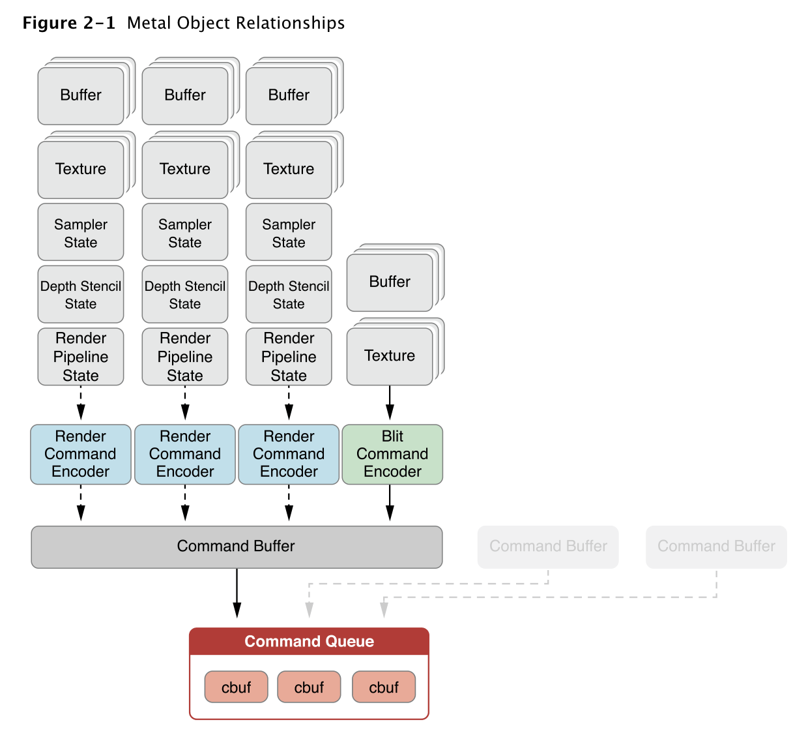

### The Device Object Represents a GPU - 代表 GPU 的设置对象

> A [MTLDevice](https://developer.apple.com/documentation/metal/mtldevice) object represents a GPU that can execute commands. The MTLDevice protocol has methods to create new command queues, to allocate buffers from memory, to create textures, and to make queries about the device’s capabilities. To obtain the preferred system device on the system, call the [MTLCreateSystemDefaultDevice](https://developer.apple.com/documentation/metal/1433401-mtlcreatesystemdefaultdevice) function.

[MTLDevice](https://developer.apple.com/documentation/metal/mtldevice) 对象表示一个可以执行命令的 GPU 。MTLDevice 协议具有创建新的命令队列、从内存分配缓冲区、创建纹理以及查询设备能力的方法。要获取系统的首选设备，调用 [MTLCreateSystemDefaultDevice](https://developer.apple.com/documentation/metal/1433401-mtlcreatesystemdefaultdevice) 函数。

### Transient and Non-transient Objects in Metal - Metal 中的持久与非持久对象

> Some objects in Metal are designed to be transient and extremely lightweight, while others are more expensive and can last for a long time, perhaps for the lifetime of the app.
>
> Command buffer and command encoder objects are transient and designed for a single use. They are very inexpensive to allocate and deallocate, so their creation methods return autoreleased objects.
>
> The following objects are not transient. Reuse these objects in performance sensitive code, and avoid creating them repeatedly.
>
> - Command queues
> - Data buffers
> - Textures
> - Sampler states
> - Libraries
> - Compute states
> - Render pipeline states
> - Depth/stencil states

Metal 中的一些对象被设计为非持久并且及其轻量的，而其他对象则更加昂贵并且持续很长时间，可能是应用程序的生命周期。

命令缓冲区和命令编码器被设计为非持久使用，仅供单次使用的对象。分配并且释放它们开销极小，所以它们的创建方法返回自动释放的对象。

以下对象不是瞬态的。在性能敏感的代码中重用这些对象，避免重复创建它们。

- 命令队列
- 数据缓冲区
- 纹理
- 采样器状态
- Libraries
- 计算状态
- 渲染管线状态
- 深度/模版状态

### Command Queue - 命令队列

> A command queue accepts an ordered list of command buffers that the GPU will execute. All command buffers sent to a single queue are guaranteed to execute in the order in which the command buffers were enqueued. In general, command queues are thread-safe and allow multiple active command buffers to be encoded simultaneously.
>
> To create a command queue, call either the [newCommandQueue](https://developer.apple.com/documentation/metal/mtldevice/1433388-newcommandqueue) method or the [newCommandQueueWithMaxCommandBufferCount:](https://developer.apple.com/documentation/metal/mtldevice/1433433-makecommandqueue) method of a [MTLDevice](https://developer.apple.com/documentation/metal/mtldevice) object. In general, command queues are expected to be long-lived, so they should not be repeatedly created and destroyed.

命令队列容纳一个即将被 GPU 执行的命令缓冲区的有序队列。发送到单个队列的所有命令缓冲区可以保证按照其入队的顺序执行。通常，命令队列是线程安全的，允许同时编码多个激活的命令缓冲区。

调用 [MTLDevice](https://developer.apple.com/documentation/metal/mtldevice) 对象的 [newCommandQueue](https://developer.apple.com/documentation/metal/mtldevice/1433388-newcommandqueue) 方法或者 [newCommandQueueWithMaxCommandBufferCount:](https://developer.apple.com/documentation/metal/mtldevice/1433433-makecommandqueue) 方法，以创建一个命令队列。通常，命令队列应该是长期存活的，因此不应该重复地创建和销毁它们。

### Command Buffer - 命令缓冲区

> A command buffer stores encoded commands until the buffer is committed for execution by the GPU. A single command buffer can contain many different kinds of encoded commands, depending on the number and type of encoders that are used to build it. In a typical app, an entire frame of rendering is encoded into a single command buffer, even if rendering that frame involves multiple rendering passes, compute processing functions, or blit operations.
>
> Command buffers are transient single-use objects and do not support reuse. Once a command buffer has been committed for execution, the only valid operations are to wait for the command buffer to be scheduled or completed—through synchronous calls or handler blocks discussed in [Registering Handler Blocks for Command Buffer Execution](https://developer.apple.com/library/archive/documentation/Miscellaneous/Conceptual/MetalProgrammingGuide/Cmd-Submiss/Cmd-Submiss.html#//apple_ref/doc/uid/TP40014221-CH3-SW20)—and to check the status of the command buffer execution.
>
> Command buffers also represent the only independently trackable unit of work by the app, and they define the coherency boundaries established by the Metal memory model, as detailed in [Resource Objects: Buffers and Textures](https://developer.apple.com/library/archive/documentation/Miscellaneous/Conceptual/MetalProgrammingGuide/Mem-Obj/Mem-Obj.html#//apple_ref/doc/uid/TP40014221-CH4-SW1).

命令缓冲区存储编码过的命令，直到缓冲区被提交以供 GPU 执行。单个命令缓冲区可以包含许多不同类型的编码命令，具体取决于用于构建它的编码器的数量和类型。在典型的应用程序中，整个渲染帧被编码到单个命令缓冲区中，即使渲染该帧涉及多个渲染过程，多个计算处理函数或者多个 blit 操作。

命令缓冲区是瞬态一次性对象，不支持重用。一旦命令缓冲区被提交执行，唯一有效的操作是，通过在 [Registering Handler Blocks for Command Buffer Execution](https://developer.apple.com/library/archive/documentation/Miscellaneous/Conceptual/MetalProgrammingGuide/Cmd-Submiss/Cmd-Submiss.html#//apple_ref/doc/uid/TP40014221-CH3-SW20) 中讨论的同步调用或者处理程序块等待命令缓冲区被调度或执行完成，以及检查命令缓冲区的执行状态。

命令缓冲区也是应用程序唯一可独立跟踪的工作单元，它们定义了由 Metal memory 模型建立的一致性边界，详见 [Resource Objects: Buffers and Textures](https://developer.apple.com/library/archive/documentation/Miscellaneous/Conceptual/MetalProgrammingGuide/Mem-Obj/Mem-Obj.html#//apple_ref/doc/uid/TP40014221-CH4-SW1)。

#### Creating a Command Buffer - 创建一个命令缓冲区

> To create a [MTLCommandBuffer](https://developer.apple.com/documentation/metal/mtlcommandbuffer) object, call the commandBuffer method of [MTLCommandQueue](https://developer.apple.com/documentation/metal/mtlcommandqueue). A MTLCommandBuffer object can only be committed into the MTLCommandQueue object that created it.
>
>Command buffers created by the commandBuffer method retain data that is needed for execution. For certain scenarios, where you hold a retain to these objects elsewhere for the duration of the execution of a MTLCommandBuffer object, you can instead create a command buffer by calling the commandBufferWithUnretainedReferences method of MTLCommandQueue. Use the commandBufferWithUnretainedReferences method only for extremely performance-critical apps that can guarantee that crucial objects have references elsewhere in the app until command buffer execution is completed. Otherwise, an object that no longer has other references may be prematurely released, and the results of the command buffer execution are undefined.

要创建 [MTLCommandBuffer](https://developer.apple.com/documentation/metal/mtlcommandbuffer) 对象，调用 [MTLCommandQueue](https://developer.apple.com/documentation/metal/mtlcommandqueue) 的 commandBuffer 方法。MTLCommandBuffer 对象只能提交到创建它的 MTLCommandQueue 对象中。

commandBuffer 方法创建的命令缓冲区会 ratain 执行所需要的数据。对于某些情况，如果在执行 MTLCommandBuffer 对象期间在其他地方 retain 这些对象，则可以通过调用 MTLCommandQueue 的 commandBufferWithUnretainedReferences 方法来创建命令缓冲区。仅对那些对性能极其敏感的应用程序使用 commandBufferWithUnretainedReferences 方法，这些应用程序必须保证在命令缓冲区执行完毕之前，关键对象不会被释放。否则，可能过早释放不再具有其他引用的对象，这样的话，命令缓冲区的执行结果是未定义的。

#### Executing Commands - 执行命令

> The MTLCommandBuffer protocol uses the following methods to establish the execution order of command buffers in the command queue. A command buffer does not begin execution until it is committed. Once committed, command buffers are executed in the order in which they were enqueued.
>
> - The [enqueue](https://developer.apple.com/documentation/metal/mtlcommandbuffer/1443019-enqueue) method reserves a place for the command buffer on the command queue, but does not commit the command buffer for execution. When this command buffer is eventually committed, it is executed after any previously enqueued command buffers within the associated command queue.
> - The [commit](https://developer.apple.com/documentation/metal/mtlcommandbuffer/1443003-commit) method causes the command buffer to be executed as soon as possible, but after any previously enqueued command buffers in the same command queue are committed. If the command buffer has not previously been enqueued, commit makes an implied enqueue call.
>
> For an example of using enqueue with multiple threads, see [Multiple Threads, Command Buffers, and Command Encoders](https://developer.apple.com/library/archive/documentation/Miscellaneous/Conceptual/MetalProgrammingGuide/Cmd-Submiss/Cmd-Submiss.html#//apple_ref/doc/uid/TP40014221-CH3-SW6).

MTLCommandBuffer 协议使用以下方法建立加入命令队列中的命令缓冲区的执行顺序。命令缓冲区在提交之前不会开始执行，一旦提交，命令缓冲区按照它们入队的顺序执行。

- [enqueue](https://developer.apple.com/documentation/metal/mtlcommandbuffer/1443019-enqueue) 方法为命令队列上的命令缓冲区保留一个位置，但并不提交命令缓冲区以供执行。当该缓冲区最终提交时，将在相关命令队列中任何先前入队的命令缓冲区执行之后被执行。
- [commit](https://developer.apple.com/documentation/metal/mtlcommandbuffer/1443003-commit) 方法会导致命令缓冲区尽快执行，但也是在同一个命令队列中的之前入队的命令缓冲区提交之后。如果先前没有将命令缓冲区入队，则 commit 会进行隐式的入队调用。

有关使用多线程入队的示例，参阅 [Multiple Threads, Command Buffers, and Command Encoders](https://developer.apple.com/library/archive/documentation/Miscellaneous/Conceptual/MetalProgrammingGuide/Cmd-Submiss/Cmd-Submiss.html#//apple_ref/doc/uid/TP40014221-CH3-SW6)。

#### Registering Handler Blocks for Command Buffer Execution - 为命令缓冲区的执行注册处理程序块

> The [MTLCommandBuffer](https://developer.apple.com/documentation/metal/mtlcommandbuffer) methods listed below monitor command execution. Scheduled and completed handlers are invoked in execution order on an undefined thread. Any code you execute in these handlers should complete quickly; if expensive or blocking work needs to be done, defer that work to another thread.
>
> - The [addScheduledHandler:](https://developer.apple.com/documentation/metal/mtlcommandbuffer/1442991-addscheduledhandler) method registers a block of code to be called when the command buffer is scheduled. A command buffer is considered scheduled when any dependencies between work submitted by other MTLCommandBuffer objects or other APIs in the system is satisfied. You can register multiple scheduled handlers for a command buffer.
> - The [waitUntilScheduled](https://developer.apple.com/documentation/metal/mtlcommandbuffer/1443036-waituntilscheduled) method synchronously waits and returns after the command buffer is scheduled and all handlers registered by the addScheduledHandler: method are completed.
> - The [addCompletedHandler:](https://developer.apple.com/documentation/metal/mtlcommandbuffer/1442997-addcompletedhandler) method registers a block of code to be called immediately after the device completes the execution of the command buffer. You can register multiple completed handlers for a command buffer.
> - The [waitUntilCompleted](https://developer.apple.com/documentation/metal/mtlcommandbuffer/1443039-waituntilcompleted) method synchronously waits and returns after the device has completed the execution of the command buffer and all handlers registered by the [addCompletedHandler:](https://developer.apple.com/documentation/metal/mtlcommandbuffer/1442997-addcompletedhandler) method have returned.
> The [presentDrawable:](https://developer.apple.com/documentation/metal/mtlcommandbuffer/1443029-present) method is a special case of completed handler. This convenience method presents the contents of a displayable resource (a CAMetalDrawable object) when the command buffer is scheduled. For details about the presentDrawable: method, see [Integration with Core Animation: CAMetalLayer](https://developer.apple.com/library/archive/documentation/Miscellaneous/Conceptual/MetalProgrammingGuide/Render-Ctx/Render-Ctx.html#//apple_ref/doc/uid/TP40014221-CH7-SW36).

下面列出的 [MTLCommandBuffer](https://developer.apple.com/documentation/metal/mtlcommandbuffer) 方法监控命令的执行。调度和完成的处理程序在未定义的线程上按执行顺序调用。你在这些处理程序中执行的任何代码都应该快速完成；如果需要进行开销较大或者阻塞的工作，将该工作推迟到另外的线程去处理。

- [addScheduledHandler:](https://developer.apple.com/documentation/metal/mtlcommandbuffer/1442991-addscheduledhandler) 方法注册一个代码块，当命令缓冲区被调度时，该代码块被执行。当满足其他 MTLCommandBuffer 对象或系统中的其他 API 提交的工作之间的任何依赖关系时，将考虑调度该命令缓冲区。你可以为一个命令缓冲区注册多个调度处理程序。
- [waitUntilScheduled](https://developer.apple.com/documentation/metal/mtlcommandbuffer/1443036-waituntilscheduled) 方法在命令缓冲区被调度之后及通过 addScheduledHandler: 注册的所有处理程序都执行完毕之后同步返回。
- [addCompletedHandler:](https://developer.apple.com/documentation/metal/mtlcommandbuffer/1442997-addcompletedhandler) 方法注册一个代码块，在设备完成命令缓冲区的执行之后，该代码块被立即执行。你可以为一个命令缓冲区注册多个完成处理程序。
- [waitUntilCompleted](https://developer.apple.com/documentation/metal/mtlcommandbuffer/1443039-waituntilcompleted) 方法在设置执行完命令缓冲区及通过  [addCompletedHandler:](https://developer.apple.com/documentation/metal/mtlcommandbuffer/1442997-addcompletedhandler) 注册的所有处理程序都返回之后同步返回。

[presentDrawable:](https://developer.apple.com/documentation/metal/mtlcommandbuffer/1443029-present) 方法是完成处理程序的特例。这种便捷方法在调度命令缓冲区时呈现可显示资源（一个 CAMetalDrawable 对象）的内容。关于presentDrawable: 方法的详细信息，参阅 [Integration with Core Animation: CAMetalLayer](https://developer.apple.com/library/archive/documentation/Miscellaneous/Conceptual/MetalProgrammingGuide/Render-Ctx/Render-Ctx.html#//apple_ref/doc/uid/TP40014221-CH7-SW36)。

#### Monitoring Command Buffer Execution Status - 监控命令缓冲区执行状态

> The read-only [status](https://developer.apple.com/documentation/metal/mtlcommandbuffer/1443048-status) property contains a MTLCommandBufferStatus enum value listed in [Command Buffer Status Codes](https://developer.apple.com/documentation/metal/mtlcommandbufferstatus) that reflects the current scheduling stage in the lifetime of this command buffer.
>
> If execution finishes successfully, the value of the read-only [error](https://developer.apple.com/documentation/metal/mtlcommandbuffer/1443040-error) property is nil. If execution fails, then status is set to MTLCommandBufferStatusError, and the error property may contain a value listed in [Command Buffer Error Codes](https://developer.apple.com/documentation/metal/mtlcommandbuffererror/code) that indicates the cause of the failure.

只读的 [status](https://developer.apple.com/documentation/metal/mtlcommandbuffer/1443048-status) 属性包含一个 [Command Buffer Status Codes](https://developer.apple.com/documentation/metal/mtlcommandbufferstatus) 中列出的 MTLCommandBufferStatus 枚举值，该值反映了此命令缓冲区生命周期中的当前调度阶段。

如果执行成功完成，只读的 [error](https://developer.apple.com/documentation/metal/mtlcommandbuffer/1443040-error) 属性值为 nil 。如果执行失败，status 属性设置为 MTLCommandBufferStatusError ，error 属性可能包含一个[Command Buffer Error Codes](https://developer.apple.com/documentation/metal/mtlcommandbuffererror/code) 中列出的值，该值指示失败的原因。

### Command Encoder - 命令编码器

> A command encoder is a transient object that you use once to write commands and state into a single command buffer in a format that the GPU can execute. Many command encoder object methods append commands onto the command buffer. While a command encoder is active, it has the exclusive right to append commands for its command buffer. Once you finish encoding commands, call the [endEncoding](https://developer.apple.com/documentation/metal/mtlcommandencoder/1458038-endencoding) method. To write further commands, create a new command encoder.

命令编码器是一个瞬态对象，你可以使用该对象以 GPU 可以执行的格式将命令和状态写入单个命令缓冲区。许多命令编码器对象方法附加命令到命令缓冲区。当命令编码器处于激活状态时，它具有为其命令缓冲区附加命令的专有权。一旦完成命令的编码，调用 [endEncoding](https://developer.apple.com/documentation/metal/mtlcommandencoder/1458038-endencoding) 方法。今后再要写入命令的话，就再创建一个新的命令编码器。

#### Creating a Command Encoder Object - 创建一个命令编码器对象

> Because a command encoder appends commands into a specific command buffer, you create a command encoder by requesting one from the [MTLCommandBuffer](https://developer.apple.com/documentation/metal/mtlcommandbuffer) object you want to use it with. Use the following MTLCommandBuffer methods to create command encoders of each type:
>
> - The [renderCommandEncoderWithDescriptor:](https://developer.apple.com/documentation/metal/mtlcommandbuffer/1442999-rendercommandencoderwithdescript) method creates a [MTLRenderCommandEncoder](https://developer.apple.com/documentation/metal/mtlrendercommandencoder) object for graphics rendering to an attachment in a [MTLRenderPassDescriptor](https://developer.apple.com/documentation/metal/mtlrenderpassdescriptor).
> - The [computeCommandEncoder](https://developer.apple.com/documentation/metal/mtlcommandbuffer/1443044-computecommandencoder) method creates a [MTLComputeCommandEncoder](https://developer.apple.com/documentation/metal/mtlcomputecommandencoder) object for data-parallel computations.
> - The [blitCommandEncoder](https://developer.apple.com/documentation/metal/mtlcommandbuffer/1443001-blitcommandencoder) method creates a [MTLBlitCommandEncoder](https://developer.apple.com/documentation/metal/mtlblitcommandencoder) object for memory operations.
> - The [parallelRenderCommandEncoderWithDescriptor:](https://developer.apple.com/documentation/metal/mtlcommandbuffer/1443009-parallelrendercommandencoderwith) method creates a [MTLParallelRenderCommandEncoder](https://developer.apple.com/documentation/metal/mtlparallelrendercommandencoder) object that enables several MTLRenderCommandEncoder objects to run on different threads while still rendering to an attachment that is specified in a shared [MTLRenderPassDescriptor](https://developer.apple.com/documentation/metal/mtlrenderpassdescriptor).

由于命令编码器将命令附加到特定命令缓冲区，因此通过从指定的命令缓冲区对象申请的方式来创建一个命令编码器。使用以下 MTLCommandBuffer 的方法创建每种类型的命令编码器：

- [renderCommandEncoderWithDescriptor:](https://developer.apple.com/documentation/metal/mtlcommandbuffer/1442999-rendercommandencoderwithdescript) 方法创建一个用于渲染图像到 [MTLRenderPassDescriptor](https://developer.apple.com/documentation/metal/mtlrenderpassdescriptor) 中附件的 [MTLRenderCommandEncoder](https://developer.apple.com/documentation/metal/mtlrendercommandencoder) 对象。
- [computeCommandEncoder](https://developer.apple.com/documentation/metal/mtlcommandbuffer/1443044-computecommandencoder) 方法创建一个用于数据并行计算的 [MTLComputeCommandEncoder](https://developer.apple.com/documentation/metal/mtlcomputecommandencoder) 对象。
- [blitCommandEncoder](https://developer.apple.com/documentation/metal/mtlcommandbuffer/1443001-blitcommandencoder) 方法创建一个用于内存操作的 [MTLBlitCommandEncoder](https://developer.apple.com/documentation/metal/mtlblitcommandencoder) 对象。
- [parallelRenderCommandEncoderWithDescriptor:](https://developer.apple.com/documentation/metal/mtlcommandbuffer/1443009-parallelrendercommandencoderwith) 方法创建一个 [MTLParallelRenderCommandEncoder](https://developer.apple.com/documentation/metal/mtlparallelrendercommandencoder) 对象，该对象使多个 MTLRenderCommandEncoder 对象能够在不同的线程上运行，同时渲染图像到指定的共享 [MTLRenderPassDescriptor](https://developer.apple.com/documentation/metal/mtlrenderpassdescriptor) 中的附件。

#### Render Command Encoder - 渲染命令编码器

> Graphics rendering can be described in terms of a rendering pass. A [MTLRenderCommandEncoder](https://developer.apple.com/documentation/metal/mtlrendercommandencoder) object represents the rendering state and drawing commands associated with a single rendering pass. A MTLRenderCommandEncoder requires an associated [MTLRenderPassDescriptor](https://developer.apple.com/documentation/metal/mtlrenderpassdescriptor) (described in Creating a [Render Pass Descriptor](https://developer.apple.com/library/archive/documentation/Miscellaneous/Conceptual/MetalProgrammingGuide/Render-Ctx/Render-Ctx.html#//apple_ref/doc/uid/TP40014221-CH7-SW5)) that includes the color, depth, and stencil attachments that serve as destinations for rendering commands. The MTLRenderCommandEncoder has methods to:
>
> - Specify graphics resources, such as buffer and texture objects, that contain vertex, fragment, or texture image data
> - Specify a [MTLRenderPipelineState](https://developer.apple.com/documentation/metal/mtlrenderpipelinestate) object that contains compiled rendering state, including vertex and fragment shaders
> - Specify fixed-function state, including viewport, triangle fill mode, scissor rectangle, depth and stencil tests, and other values
Draw 3D primitives
> For detailed information about the MTLRenderCommandEncoder protocol, see [Graphics Rendering: Render Command Encoder](https://developer.apple.com/library/archive/documentation/Miscellaneous/Conceptual/MetalProgrammingGuide/Render-Ctx/Render-Ctx.html#//apple_ref/doc/uid/TP40014221-CH7-SW1).

可以根据渲染过程来描述图形渲染。[MTLRenderCommandEncoder](https://developer.apple.com/documentation/metal/mtlrendercommandencoder) 对象表示与单个渲染过程关联的渲染状态和绘制命令。一个 MTLRenderCommandEncoder 需要关联一个 [MTLRenderPassDescriptor](https://developer.apple.com/documentation/metal/mtlrenderpassdescriptor) ，其包含颜色、深度和模版附件，渲染命令的渲染结果即保存在该 MTLRenderPassDescriptor 对应的附件中。MTLRenderCommandEncoder 具有以下方法：

- 指定图形资源，比如包含顶点、片元或者纹理图像数据的缓冲区和纹理对象
- 指定 [MTLRenderPipelineState](https://developer.apple.com/documentation/metal/mtlrenderpipelinestate) 对象，其中包含已编译的渲染状态，包括顶点和片段着色器
- 指定固定功能状态，包括 viewport、三角形填充模式、裁剪区域、深度和模版测试和其他绘制 3D 图元的值

有关 MTLRenderCommandEncoder 协议的详细信息，参阅 [Graphics Rendering: Render Command Encoder](https://developer.apple.com/library/archive/documentation/Miscellaneous/Conceptual/MetalProgrammingGuide/Render-Ctx/Render-Ctx.html#//apple_ref/doc/uid/TP40014221-CH7-SW1)。

#### Compute Command Encoder - 计算命令编码器

> For data-parallel computing, the [MTLComputeCommandEncoder](https://developer.apple.com/documentation/metal/mtlcomputecommandencoder) protocol provides methods to encode commands in the command buffer that can specify the compute function and its arguments (for example, texture, buffer, and sampler state) and dispatch the compute function for execution. To create a compute command encoder object, use the [computeCommandEncoder](https://developer.apple.com/documentation/metal/mtlcommandbuffer/1443044-computecommandencoder) method of [MTLCommandBuffer](https://developer.apple.com/documentation/metal/mtlcommandbuffer). For detailed information about the MTLComputeCommandEncoder methods and properties, see [Data-Parallel Compute Processing: Compute Command Encoder](https://developer.apple.com/library/archive/documentation/Miscellaneous/Conceptual/MetalProgrammingGuide/Compute-Ctx/Compute-Ctx.html#//apple_ref/doc/uid/TP40014221-CH6-SW1).

对于数据并行计算，[MTLComputeCommandEncoder](https://developer.apple.com/documentation/metal/mtlcomputecommandencoder)  协议提供了对命令缓冲区中的命令进行编码的方法，该命令缓冲区可以指定计算函数及其参数（例如，纹理、缓冲区和采样器状态）并调度计算函数以供执行。使用 [MTLCommandBuffer](https://developer.apple.com/documentation/metal/mtlcommandbuffer) 的 [computeCommandEncoder](https://developer.apple.com/documentation/metal/mtlcommandbuffer/1443044-computecommandencoder) 方法创建一个计算命令编码器对象。关于 MTLComputeCommandEncoder 方法和属性的详细信息，参阅 [Data-Parallel Compute Processing: Compute Command Encoder](https://developer.apple.com/library/archive/documentation/Miscellaneous/Conceptual/MetalProgrammingGuide/Compute-Ctx/Compute-Ctx.html#//apple_ref/doc/uid/TP40014221-CH6-SW1)。

#### Blit Command Encoder - Blit 命令编码器

> The [MTLBlitCommandEncoder](https://developer.apple.com/documentation/metal/mtlblitcommandencoder) protocol has methods that append commands for memory copy operations between buffers ([MTLBuffer](https://developer.apple.com/documentation/metal/mtlbuffer)) and textures ([MTLTexture](https://developer.apple.com/documentation/metal/mtltexture)). The MTLBlitCommandEncoder protocol also provides methods to fill textures with a solid color and to generate mipmaps. To create a blit command encoder object, use the [blitCommandEncoder](https://developer.apple.com/documentation/metal/mtlcommandbuffer/1443001-blitcommandencoder) method of MTLCommandBuffer. For detailed information about the MTLBlitCommandEncoder methods and properties, see [Buffer and Texture Operations: Blit Command Encoder](https://developer.apple.com/library/archive/documentation/Miscellaneous/Conceptual/MetalProgrammingGuide/Blit-Ctx/Blit-Ctx.html#//apple_ref/doc/uid/TP40014221-CH9-SW3).

[MTLBlitCommandEncoder](https://developer.apple.com/documentation/metal/mtlblitcommandencoder) 协议具有为缓冲区（ [MTLBuffer](https://developer.apple.com/documentation/metal/mtlbuffer) ）和纹理（ [MTLTexture](https://developer.apple.com/documentation/metal/mtltexture) ）之间的内存复制操作附加命令的方法。MTLBlitCommandEncoder 协议还提供了使用纯色填充纹理及生成 mipmaps 的方法。使用 MTLCommandBuffer 的 [blitCommandEncoder](https://developer.apple.com/documentation/metal/mtlcommandbuffer/1443001-blitcommandencoder) 方法去创建一个 blit 命令编码器对象。关于 MTLBlitCommandEncoder 方法和属性的详细信息，参阅 [Buffer and Texture Operations: Blit Command Encoder](https://developer.apple.com/library/archive/documentation/Miscellaneous/Conceptual/MetalProgrammingGuide/Blit-Ctx/Blit-Ctx.html#//apple_ref/doc/uid/TP40014221-CH9-SW3) 。

#### Multiple Threads, Command Buffers, and Command Encoders - 多线程，命令缓冲区和命令编码器

> Most apps use a single thread to encode the rendering commands for a single frame in a single command buffer. At the end of each frame, you commit the command buffer, which both schedules and begins command execution.
>
> If you want to parallelize command buffer encoding, then you can create multiple command buffers at the same time, and encode to each one with a separate thread. If you know ahead of time in what order a command buffer should execute, then the [enqueue]((https://developer.apple.com/documentation/metal/mtlcommandbuffer/1443019-enqueue)) method of [MTLCommandBuffer](https://developer.apple.com/documentation/metal/mtlcommandbuffer) can declare the execution order within the command queue without needing to wait for the commands to be encoded and committed. Otherwise, when a command buffer is committed, it is assigned a place in the command queue after any previously enqueued command buffers.
>
> Only one CPU thread can access a command buffer at time. Multithreaded apps can use one thread per command buffer to create multiple command buffers in parallel.
>
> Figure 2-2 shows an example with three threads. Each thread has its own command buffer. For each thread, one command encoder at a time has access to its associated command buffer. Figure 2-2 also shows each command buffer receiving commands from different command encoders. When you finish encoding, call the [endEncoding](https://developer.apple.com/documentation/metal/mtlcommandencoder/1458038-endencoding) method of the command encoder, and a new command encoder object can then begin encoding commands to the command buffer.
>
> A [MTLParallelRenderCommandEncoder](https://developer.apple.com/documentation/metal/mtlparallelrendercommandencoder) object allows a single rendering pass to be broken up across multiple command encoders and assigned to separate threads. For more information about [MTLParallelRenderCommandEncoder](https://developer.apple.com/documentation/metal/mtlparallelrendercommandencoder), see [Encoding a Single Rendering Pass Using Multiple Threads](https://developer.apple.com/library/archive/documentation/Miscellaneous/Conceptual/MetalProgrammingGuide/Render-Ctx/Render-Ctx.html#//apple_ref/doc/uid/TP40014221-CH7-SW16).

大多数应用程序使用单个线程在单个命令缓冲区中为单个帧编码渲染命令。在每一帧的末尾，你提交命令缓冲区，引发命令的调度以及执行的开始。

如果要并行化命令缓冲区编码，则可以同时创建多个命令缓冲区，并使用单独的线程对每个命令缓冲区进行编码。如果事先知道命令缓冲区应该以什么顺序执行，那么 [MTLCommandBuffer](https://developer.apple.com/documentation/metal/mtlcommandbuffer) 的 [enqueue]((https://developer.apple.com/documentation/metal/mtlcommandbuffer/1443019-enqueue)) 方法可以在命令队列中声明执行顺序，而无需等待命令的编码和提交。否则，当提交命令缓冲区时，该命令缓冲区将被放置于先前入队的任何命令缓冲区之后的位置。

同一时刻只允许一个 CPU 线程访问一个命令缓冲区。多线程应用程序可以使用每个命令缓冲区一个线程的方式来并行创建多个命令缓冲区。

图 2-2 显示了一个包含三个线程的例子。每个线程都有自己的命令缓冲区。对于每个线程，同一时刻一个命令编码器访问其关联的命令缓冲区。图 2-2 还显示了每个命令缓冲区接收来自不同命令编码器的命令。完成编码后，调用命令编码器的 [endEncoding](https://developer.apple.com/documentation/metal/mtlcommandencoder/1458038-endencoding) 方法，然后新的命令编码器对象可以开始编码命令到命令缓冲区中。

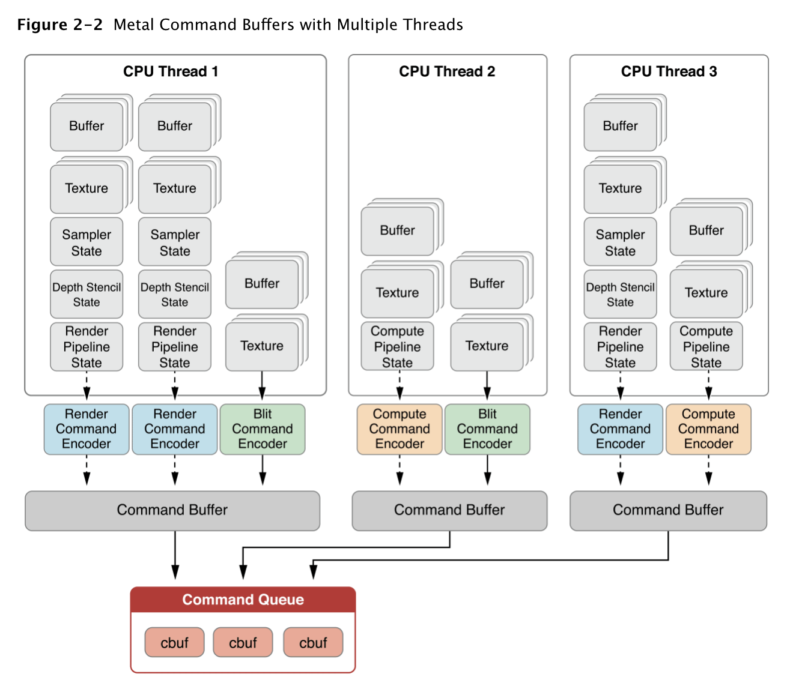

[MTLParallelRenderCommandEncoder](https://developer.apple.com/documentation/metal/mtlparallelrendercommandencoder) 对象允许单个渲染过程分解到多个命令编码器之间，其中每个命令编码器分配单独的线程。关于 [MTLParallelRenderCommandEncoder](https://developer.apple.com/documentation/metal/mtlparallelrendercommandencoder) 的更多信息，参阅 [Encoding a Single Rendering Pass Using Multiple Threads](https://developer.apple.com/library/archive/documentation/Miscellaneous/Conceptual/MetalProgrammingGuide/Render-Ctx/Render-Ctx.html#//apple_ref/doc/uid/TP40014221-CH7-SW16) 。

## Resource Objects: Buffers and Textures - 资源对象：缓冲区与纹理

> This chapter describes Metal resource objects ([MTLResource](https://developer.apple.com/documentation/metal/mtlresource)) for storing unformatted memory and formatted image data. There are two types of [MTLResource](https://developer.apple.com/documentation/metal/mtlresource) objects:
>
> - [MTLBuffer](https://developer.apple.com/documentation/metal/mtlbuffer) represents an allocation of unformatted memory that can contain any type of data. Buffers are often used for vertex, shader, and compute state data.
> - [MTLTexture](https://developer.apple.com/documentation/metal/mtltexture) represents an allocation of formatted image data with a specified texture type and pixel format. Texture objects are used as source textures for vertex, fragment, or compute functions, as well as to store graphics rendering output (that is, as an attachment).
>
> [MTLSamplerState](https://developer.apple.com/documentation/metal/mtlsamplerstate) objects are also discussed in this chapter. Although samplers are not resources themselves, they are used when performing lookup calculations with a texture object.

本章介绍用于存储未格式化内存和格式化图像数据的 Metal 资源对象（ [MTLResource](https://developer.apple.com/documentation/metal/mtlresource) ）。有两种类型的 [MTLResource](https://developer.apple.com/documentation/metal/mtlresource) 对象：

- [MTLBuffer](https://developer.apple.com/documentation/metal/mtlbuffer) 表示可以包含任何类型数据的未格式化内存的分配。缓冲区通常用于顶点、着色器和计算状态数据。
- [MTLSamplerState](https://developer.apple.com/documentation/metal/mtlsamplerstate) 表示具有指定纹理类型和像素格式的格式化图像数据的分配。纹理对象用作顶点、片段或者计算函数的源纹理，以及用作存储图形渲染输出（即作为一个 attachment ）。

本章还讨论了 [MTLSamplerState](https://developer.apple.com/documentation/metal/mtlsamplerstate) 对象。虽然采样器本身不是资源，但在使用纹理对象执行查找计算时会使用它们。

### Buffers Are Typeless Allocations of Memory - 缓冲区是内存的弱类型分配

> A [MTLBuffer](https://developer.apple.com/documentation/metal/mtlbuffer) object represents an allocation of memory that can contain any type of data.

[MTLBuffer](https://developer.apple.com/documentation/metal/mtlbuffer) 对象表示可以包含任何类型数据的内存分配。

#### Creating a Buffer Object - 创建缓冲区对象

> The following [MTLDevice](https://developer.apple.com/documentation/metal/mtldevice) methods create and return a [MTLBuffer](https://developer.apple.com/documentation/metal/mtlbuffer) object:
>
> - The [newBufferWithLength:options:](https://developer.apple.com/documentation/metal/mtldevice/1433375-newbufferwithlength) method creates a MTLBuffer object with a new storage allocation.
> - The [newBufferWithBytes:length:options:](https://developer.apple.com/documentation/metal/mtldevice/1433429-newbufferwithbytes) method creates a MTLBuffer object by copying data from existing storage (located at the CPU address pointer) into a new storage allocation.
> - The [newBufferWithBytesNoCopy:length:options:deallocator:](https://developer.apple.com/documentation/metal/mtldevice/1433382-makebuffer) method creates a MTLBuffer object with an existing storage allocation and does not allocate any new storage for this object.
> All buffer creation methods have the input value length to indicate the size of the storage allocation, in bytes. All the methods also accept a MTLResourceOptions object for options that can modify the behavior of the created buffer. If the value for options is 0, the default values are used for resource options.

以下 [MTLDevice](https://developer.apple.com/documentation/metal/mtldevice) 方法创建并返回 [MTLDevice](https://developer.apple.com/documentation/metal/mtldevice) 对象：

- [newBufferWithLength:options:](https://developer.apple.com/documentation/metal/mtldevice/1433375-newbufferwithlength) 创建具有新存储分配的 MTLBuffer 对象
- [newBufferWithBytes:length:options:](https://developer.apple.com/documentation/metal/mtldevice/1433429-newbufferwithbytes) 方法通过将数据从现有存储（ CPU 地址指针 ）复制到新的存储分配中来创建 MTLBuffer 对象
- [newBufferWithBytesNoCopy:length:options:deallocator:](https://developer.apple.com/documentation/metal/mtldevice/1433382-makebuffer) 方法以现有存储分配创建 MTLBuffer 对象，并且不为该对象分配任何新存储

所有缓冲区创建方法都有 length 的输入参数，以指示存储分配的大小（以字节为单位）。所有的方法同时也接受一个作为选项的 MTLResourceOptions 对象，该选项可以改变创建的缓冲区的行为。如果 option 值为 0 ，则使用默认值作为资源选项。

#### Buffer Methods - 缓冲区方法

> The [MTLBuffer](https://developer.apple.com/documentation/metal/mtlbuffer) protocol has the following methods:
>
> - The [contents](https://developer.apple.com/documentation/metal/mtlbuffer/1515716-contents) method returns the CPU address of the buffer’s storage allocation.
> - The [newTextureWithDescriptor:offset:bytesPerRow:](https://developer.apple.com/documentation/metal/mtlbuffer/1613852-newtexturewithdescriptor) method creates a special kind of texture object that references the buffer's data. This method is detailed in [Creating a Texture Object](https://developer.apple.com/library/archive/documentation/Miscellaneous/Conceptual/MetalProgrammingGuide/Mem-Obj/Mem-Obj.html#//apple_ref/doc/uid/TP40014221-CH4-SW10).

[MTLBuffer](https://developer.apple.com/documentation/metal/mtlbuffer) 协议具有如下方法：

- [contents](https://developer.apple.com/documentation/metal/mtlbuffer/1515716-contents) 方法返回缓冲区存储分配的 CPU 地址
- [newTextureWithDescriptor:offset:bytesPerRow:](https://developer.apple.com/documentation/metal/mtlbuffer/1613852-newtexturewithdescriptor) 方法创建一个引用该缓冲区数据的特定类型的纹理对象。关于该方法的详细介绍，见 [Creating a Texture Object](https://developer.apple.com/library/archive/documentation/Miscellaneous/Conceptual/MetalProgrammingGuide/Mem-Obj/Mem-Obj.html#//apple_ref/doc/uid/TP40014221-CH4-SW10) 。

### Textures Are Formatted Image Data - 纹理是格式化的图像数据

> A [MTLTexture](https://developer.apple.com/documentation/metal/mtltexture) object represents an allocation of formatted image data that can be used as a resource for a vertex shader, fragment shader, or compute function, or as an attachment to be used as a rendering destination. A MTLTexture object can have one of the following structures:
>
> - A 1D, 2D, or 3D image
> - An array of 1D or 2D images
> - A cube of six 2D images
> MTLPixelFormat specifies the organization of individual pixels in a MTLTexture object. Pixel formats are discussed further in [Pixel Formats for Textures](https://developer.apple.com/library/archive/documentation/Miscellaneous/Conceptual/MetalProgrammingGuide/Mem-Obj/Mem-Obj.html#//apple_ref/doc/uid/TP40014221-CH4-SW12).

[MTLTexture](https://developer.apple.com/documentation/metal/mtltexture) 对象表示格式化图像数据的分配，可以将其用作顶点着色器、片段着色器或者计算函数的资源，或者作为 attachment 用作渲染的目标缓冲区。MTLTexture 对象可以具有如下结构之一：

- 1D、2D 或者 3D 图像
- 1D 或者 2D 图像的数组
- 六个 2D 图像的立方体

MTLPixelFormat 指定了 MTLTexture 对象中每个像素的组织形式。像素格式在 [Pixel Formats for Textures](https://developer.apple.com/library/archive/documentation/Miscellaneous/Conceptual/MetalProgrammingGuide/Mem-Obj/Mem-Obj.html#//apple_ref/doc/uid/TP40014221-CH4-SW12) 中进一步讨论。

#### Creating a Texture Object - 创建纹理对象

> The following methods create and return a [MTLTexture](https://developer.apple.com/documentation/metal/mtltexture) object:
>
> - The [newTextureWithDescriptor:](https://developer.apple.com/documentation/metal/mtldevice/1433425-maketexture) method of MTLDevice creates a MTLTexture object with a new storage allocation for the texture image data, using a [MTLTextureDescriptor](https://developer.apple.com/documentation/metal/mtltexturedescriptor) object to describe the texture’s properties.
> - The [newTextureViewWithPixelFormat:](https://developer.apple.com/documentation/metal/mtltexture/1515598-newtextureviewwithpixelformat) method of MTLTexture creates a MTLTexture object that shares the same storage allocation as the calling MTLTexture object. Since they share the same storage, any changes to the pixels of the new texture object are reflected in the calling texture object, and vice versa. For the newly created texture, the [newTextureViewWithPixelFormat:](https://developer.apple.com/documentation/metal/mtltexture/1515598-newtextureviewwithpixelformat) method reinterprets the existing texture image data of the storage allocation of the calling MTLTexture object as if the data was stored in the specified pixel format. The MTLPixelFormat of the new texture object must be compatible with the MTLPixelFormat of the original texture object. (See [Pixel Formats for Textures](https://developer.apple.com/library/archive/documentation/Miscellaneous/Conceptual/MetalProgrammingGuide/Mem-Obj/Mem-Obj.html#//apple_ref/doc/uid/TP40014221-CH4-SW12) for details about the ordinary, packed, and compressed pixel formats.)
> - The [newTextureWithDescriptor:offset:bytesPerRow:](https://developer.apple.com/documentation/metal/mtlbuffer/1613852-newtexturewithdescriptor) method of MTLBuffer creates a MTLTexture object that shares the storage allocation of the calling MTLBuffer object as its texture image data. As they share the same storage, any changes to the pixels of the new texture object are reflected in the calling texture object, and vice versa. Sharing storage between a texture and a buffer can prevent the use of certain texturing optimizations, such as pixel swizzling or tiling.

以下方法创建并返回 [MTLTexture](https://developer.apple.com/documentation/metal/mtltexture) 对象：

- MTLDevice 的 [newTextureWithDescriptor:](https://developer.apple.com/documentation/metal/mtldevice/1433425-maketexture) 方法使用描述纹理属性的 [MTLTextureDescriptor](https://developer.apple.com/documentation/metal/mtltexturedescriptor) 对象创建一个具有纹理图像数据的新存储分配的 MTLTexture 对象
- MTLTexture 的 [newTextureViewWithPixelFormat:](https://developer.apple.com/documentation/metal/mtltexture/1515598-newtextureviewwithpixelformat) 方法创建一个 MTLTexture 对象，该对象与调用 MTLTexture 对象共享存储分配。由于它们共享相同的存储空间，因此对新纹理对象像素的任何更改都会反映在调用方纹理对象上，反之亦然。对于新创建的纹理，[newTextureViewWithPixelFormat:](https://developer.apple.com/documentation/metal/mtltexture/1515598-newtextureviewwithpixelformat) 方法会重新解释调用方 MTLTexture 对象已经存在的纹理图像数据，就像数据是以指定的像素格式存储一样。新纹理对象的 MTLPixelFormat 必须与原纹理对象的 MTLPixelFormat 兼容（有关原始、压缩和压缩像素格式的详细信息，参阅 [Pixel Formats for Textures](https://developer.apple.com/library/archive/documentation/Miscellaneous/Conceptual/MetalProgrammingGuide/Mem-Obj/Mem-Obj.html#//apple_ref/doc/uid/TP40014221-CH4-SW12) ）。
- MTLBuffer 的[newTextureWithDescriptor:offset:bytesPerRow:](https://developer.apple.com/documentation/metal/mtlbuffer/1613852-newtexturewithdescriptor) 方法创建一个 MTLTexture 对象，该对象将 MTLBuffer 对象的数据作为纹理图像数据与 MTLBuffer 共享。由于它们共享相同的存储，新纹理对象像素的任何更改都会反应在调用方纹理对象中，反之亦然。在纹理和缓冲区之间共享存储可以防止特定纹理优化的使用，比如像素调整或平铺。

#### Creating a Texture Object with a Texture Descriptor - 使用纹理描述符创建纹理对象

> [MTLTextureDescriptor](https://developer.apple.com/documentation/metal/mtltexturedescriptor) defines the properties that are used to create a [MTLTexture](https://developer.apple.com/documentation/metal/mtltexture) object, including its image size (width, height, and depth), pixel format, arrangement (array or cube type) and number of mipmaps. The MTLTextureDescriptor properties are only used during the creation of a MTLTexture object. After you create a MTLTexture object, property changes in its MTLTextureDescriptor object no longer have any effect on that texture.
>
> To create one or more textures from a descriptor:
>
> 1. Create a custom [MTLTextureDescriptor](https://developer.apple.com/documentation/metal/mtltexturedescriptor) object that contains texture properties that describe the texture data:
> - The [textureType](https://developer.apple.com/documentation/metal/mtltexturedescriptor/1516228-texturetype) property specifies a texture’s dimensionality and arrangement (for example, array or cube).
> - The [width](https://developer.apple.com/documentation/metal/mtltexturedescriptor/1515649-width), [height](https://developer.apple.com/documentation/metal/mtltexturedescriptor/1516000-height), and [depth](https://developer.apple.com/documentation/metal/mtltexturedescriptor/1516298-depth) properties specify the pixel size in each dimension of the base level texture mipmap.
> - The [pixelFormat](https://developer.apple.com/documentation/metal/mtltexturedescriptor/1515450-pixelformat) property specifies how a pixel is stored in a texture.
> - The [arrayLength](https://developer.apple.com/documentation/metal/mtltexturedescriptor/1515331-arraylength) property specifies the number of array elements for a [MTLTextureType1DArray](https://developer.apple.com/documentation/metal/mtltexturetype/type1darray) or [MTLTextureType2DArray](https://developer.apple.com/documentation/metal/mtltexturetype/type2darray) type texture object.
> - The [mipmapLevelCount](https://developer.apple.com/documentation/metal/mtltexturedescriptor/1516300-mipmaplevelcount) property specifies the number of mipmap levels.
> - The [sampleCount](https://developer.apple.com/documentation/metal/mtltexturedescriptor/1516260-samplecount) property specifies the number of samples in each pixel.
> - The [resourceOptions](https://developer.apple.com/documentation/metal/mtltexturedescriptor/1515776-resourceoptions) property specifies the behavior of its memory allocation.
> 2. Create a texture from the MTLTextureDescriptor object by calling the [newTextureWithDescriptor:](https://developer.apple.com/documentation/metal/mtldevice/1433425-maketexture) method of a MTLDevice object. After texture creation, call the [replaceRegion:mipmapLevel:slice:withBytes:bytesPerRow:bytesPerImage:](https://developer.apple.com/documentation/metal/mtltexture/1515679-replaceregion) method to load the texture image data, as detailed in [Copying Image Data to and from a Texture](https://developer.apple.com/library/archive/documentation/Miscellaneous/Conceptual/MetalProgrammingGuide/Mem-Obj/Mem-Obj.html#//apple_ref/doc/uid/TP40014221-CH4-SW17).
> 3. To create more MTLTexture objects, you can reuse the same MTLTextureDescriptor object, modifying the descriptor’s property values as needed.
>
> Listing 3-1 shows code for creating a texture descriptor txDesc and setting its properties for a 3D, 64x64x64 texture.
>
> Listing 3-1  Creating a Texture Object with a Custom Texture Descriptor

[MTLTextureDescriptor](https://developer.apple.com/documentation/metal/mtltexturedescriptor) 定义了用于创建 [MTLTexture](https://developer.apple.com/documentation/metal/mtltexture) 对象的属性，包括图像大小（宽度、高度和深度）、像素格式、排列（数组或多维数据集）和 mipmap 数。MTLTextureDescriptor 属性仅在创建 MTLTexture 对象期间使用。创建 MTLTexture 对象之后，其 MTLTextureDescriptor 对象上的属性更改不再对该纹理产生任何影响。

使用描述符创建一个或者多个：

- 1. 创建一个自定义 MTLTextureDescriptor 对象，其中包含描述纹理数据的纹理属性：
- [textureType](https://developer.apple.com/documentation/metal/mtltexturedescriptor/1516228-texturetype) 属性指定纹理维度和排列（数组或多维数据集）
- [width](https://developer.apple.com/documentation/metal/mtltexturedescriptor/1515649-width), [height](https://developer.apple.com/documentation/metal/mtltexturedescriptor/1516000-height) 和  [depth](https://developer.apple.com/documentation/metal/mtltexturedescriptor/1516298-depth) 属性指定基级纹理 mipmap 各个维度上的像素大小
- [pixelFormat](https://developer.apple.com/documentation/metal/mtltexturedescriptor/1515450-pixelformat) 属性指定像素在纹理中的存储方式
- [arrayLength](https://developer.apple.com/documentation/metal/mtltexturedescriptor/1515331-arraylength) 属性指定[MTLTextureType1DArray](https://developer.apple.com/documentation/metal/mtltexturetype/type1darray) 或者 [MTLTextureType2DArray](https://developer.apple.com/documentation/metal/mtltexturetype/type2darray) 类型纹理对象数组元素个数
- [mipmapLevelCount](https://developer.apple.com/documentation/metal/mtltexturedescriptor/1516300-mipmaplevelcount) 属性指定 mipmap 级别的数量
- [sampleCount](https://developer.apple.com/documentation/metal/mtltexturedescriptor/1516260-samplecount) 属性指定每个像素中的样本数
- [resourceOptions](https://developer.apple.com/documentation/metal/mtltexturedescriptor/1515776-resourceoptions) 属性指定其内存分配行为

- 2. 调用 MTLDevice 对象的 [newTextureWithDescriptor:](https://developer.apple.com/documentation/metal/mtldevice/1433425-maketexture)  方法由 MTLTextureDescriptor 对象创建纹理。纹理创建完成之后，调用 [replaceRegion:mipmapLevel:slice:withBytes:bytesPerRow:bytesPerImage:](https://developer.apple.com/documentation/metal/mtltexture/1515679-replaceregion) 方法加载纹理图像数据，详见  [Copying Image Data to and from a Texture](https://developer.apple.com/library/archive/documentation/Miscellaneous/Conceptual/MetalProgrammingGuide/Mem-Obj/Mem-Obj.html#//apple_ref/doc/uid/TP40014221-CH4-SW17) 。
- 3. 要创建更多 MTLTexture 对象，可以重用相同的 MTLTextureDescriptor 对象，根据需要修改其属性值。

清单 3-1 创建纹理描述符 txDesc 并为 3D 尺寸为 64x64x64 的纹理设置属性的代码。

Listing 3-1  使用自定义的纹理描述符创建纹理对象

```objc
MTLTextureDescriptor* txDesc = [[MTLTextureDescriptor alloc] init];
txDesc.textureType = MTLTextureType3D;
txDesc.height = 64;
txDesc.width = 64;
txDesc.depth = 64;
txDesc.pixelFormat = MTLPixelFormatBGRA8Unorm;
txDesc.arrayLength = 1;
txDesc.mipmapLevelCount = 1;
id <MTLTexture> aTexture = [device newTextureWithDescriptor:txDesc];
```

#### Working with Texture Slices - 使用纹理切片

> A slice is a single 1D, 2D, or 3D texture image and all its associated mipmaps. For each slice:
>
> - The size of the base level mipmap is specified by the [width](https://developer.apple.com/documentation/metal/mtltexturedescriptor/1515649-width), [height](https://developer.apple.com/documentation/metal/mtltexturedescriptor/1516000-height), and [depth](https://developer.apple.com/documentation/metal/mtltexturedescriptor/1516298-depth) properties of the MTLTextureDescriptor object.
> - The scaled size of mipmap level i is specified by max(1, floor(width / 2i)) x max(1, floor(height / 2i)) x max(1, floor(depth / 2i)). The maximum mipmap level is the first mipmap level where the size 1 x 1 x 1 is achieved.
> - The number of mipmap levels in one slice can be determined by floor(log2(max(width, height, depth)))+1.
>
> All texture objects have at least one slice; cube and array texture types may have several slices. In the methods that write and read texture image data that are discussed in [Copying Image Data to and from a Texture](https://developer.apple.com/library/archive/documentation/Miscellaneous/Conceptual/MetalProgrammingGuide/Mem-Obj/Mem-Obj.html#//apple_ref/doc/uid/TP40014221-CH4-SW17), slice is a zero-based input value. For a 1D, 2D, or 3D texture, there is only one slice, so the value of slice must be 0. A cube texture has six total 2D slices, addressed from 0 to 5. For the 1DArray and 2DArray texture types, each array element represents one slice. For example, for a 2DArray texture type with arrayLength = 10, there are 10 total slices, addressed from 0 to 9. To choose a single 1D, 2D, or 3D image out of an overall texture structure, first select a slice, and then select a mipmap level within that slice.

切片是单个 1D、2D 或者 3D 纹理图像及其所有关联的 mipmaps 。对于每个切片：

- 基准级别 mipmap 大小由 MTLTextureDescriptor 对象的 [width](https://developer.apple.com/documentation/metal/mtltexturedescriptor/1515649-width), [height](https://developer.apple.com/documentation/metal/mtltexturedescriptor/1516000-height), 和 [depth](https://developer.apple.com/documentation/metal/mtltexturedescriptor/1516298-depth) 属性指定
- i 级 mipmap 的缩放尺寸由 max(1, floor(width / 2i)) x max(1, floor(height / 2i)) x max(1, floor(depth / 2i)) 指定。一级 mipmap 是最大的 mipmap 级别，缩放比例为 1 x 1 x 1 。
- 所有纹理对象至少由一个切片；立方体和数组纹理类型可能有多个切片。 [Copying Image Data to and from a Texture](https://developer.apple.com/library/archive/documentation/Miscellaneous/Conceptual/MetalProgrammingGuide/Mem-Obj/Mem-Obj.html#//apple_ref/doc/uid/TP40014221-CH4-SW17) 中讨论的读写纹理图像数据的方法中，切片是从零开始的输入值。对于 1D、2D 或者 3D 纹理，只有一个切片，因此切片的值必须为 0 。立方体纹理一共有六个 2D 切片，从 0 到 5 。对于 1DArray 和 2DArray 纹理类型，每个数组元素代表一个切片。例如，对于一个 arrayLength = 10 的 2DArray 纹理类型，总共有 10 个切片，从 0 到 9 。要从整体纹理结构中选取单个 1D、2D 或者 3D 图像，首先选取一个切片，然后在该切片中选取一个 mipmap 级别。

#### Creating a Texture Descriptor with Convenience Methods - 使用便捷方法创建纹理描述符

> For common 2D and cube textures, use the following convenience methods to create a MTLTextureDescriptor object with several of its property values automatically set:
>
> - The [texture2DDescriptorWithPixelFormat:width:height:mipmapped:](https://developer.apple.com/documentation/metal/mtltexturedescriptor/1515511-texture2ddescriptor) method creates a MTLTextureDescriptor object for a 2D texture. The width and height values define the dimensions of the 2D texture. The type property is automatically set to MTLTextureType2D, and depth and arrayLength are set to 1.
> - The [textureCubeDescriptorWithPixelFormat:size:mipmapped:](https://developer.apple.com/documentation/metal/mtltexturedescriptor/1516090-texturecubedescriptor) method creates a MTLTextureDescriptor object for a cube texture, where the type property is set to MTLTextureTypeCube, width and height are set to size, and depth and arrayLength are set to 1.
> Both MTLTextureDescriptor convenience methods accept an input value, pixelFormat, which defines the pixel format of the texture. Both methods also accept the input value mipmapped, which determines whether or not the texture image is mipmapped. (If mipmapped is YES, the texture is mipmapped.)
>
> Listing 3-2 uses the texture2DDescriptorWithPixelFormat:width:height:mipmapped: method to create a descriptor object for a 64x64 2D texture that is not mipmapped.

对于常见的 2D 和立方体纹理，使用以下便捷方法创建 MTLTextureDescriptor 对象，这些方法会自动设置其若干属性值：

- [texture2DDescriptorWithPixelFormat:width:height:mipmapped:](https://developer.apple.com/documentation/metal/mtltexturedescriptor/1515511-texture2ddescriptor) 方法创建一个用于 2D 纹理的 MTLTextureDescriptor 对象。width 和 height 值定义了该 2D 纹理的尺寸。type 属性自动设置为 MTLTextureType2D ，depth 和 arrayLength 属性自动设置为 1 
-  [textureCubeDescriptorWithPixelFormat:size:mipmapped:](https://developer.apple.com/documentation/metal/mtltexturedescriptor/1516090-texturecubedescriptor) 方法创建用于立方体纹理的 MTLTextureDescriptor 对象，type 属性自动设置为 MTLTextureTypeCube ，width 和 height 属性自动设置为 size，depth 和 arrayLength 自动设置为 1 
- 两种 MTLTextureDescriptor 便捷方法都接收输入值 pixelFormat ，它定义纹理的像素格式。也都接收 mipmapped 输入值，它决定纹理图像是否为 mipmapped（若 mipmapped 为 YES ，纹理就是 mipmapped 的）。

清单 3-2 使用 texture2DDescriptorWithPixelFormat:width:height:mipmapped: 方法为非 mipmapped 的 64x64 2D 纹理创建描述符对象。

Listing 3-2  使用便捷纹理描述符创建纹理对象

```objc
MTLTextureDescriptor *texDesc = [MTLTextureDescriptor 
texture2DDescriptorWithPixelFormat:MTLPixelFormatBGRA8Unorm 
width:64 height:64 mipmapped:NO];
id <MTLTexture> myTexture = [device newTextureWithDescriptor:texDesc];
```
#### Copying Image Data to and from a Texture - 复制图像数据到纹理/从纹理复制图像数据

> To synchronously copy image data into or copy data from the storage allocation of a MTLTexture object, use the following methods:
>
> - [replaceRegion:mipmapLevel:slice:withBytes:bytesPerRow:bytesPerImage:](https://developer.apple.com/documentation/metal/mtltexture/1515679-replaceregion) copies a region of pixel data from the caller's pointer into a portion of the storage allocation of a specified texture slice. [replaceRegion:mipmapLevel:withBytes:bytesPerRow:](https://developer.apple.com/documentation/metal/mtltexture/1515464-replaceregion) is a similar convenience method that copies a region of pixel data into the default slice, assuming default values for slice-related arguments (i.e., slice = 0 and bytesPerImage = 0).
> - [getBytes:bytesPerRow:bytesPerImage:fromRegion:mipmapLevel:slice:](https://developer.apple.com/documentation/metal/mtltexture/1516318-getbytes) retrieves a region of pixel data from a specified texture slice. [getBytes:bytesPerRow:fromRegion:mipmapLevel:](https://developer.apple.com/documentation/metal/mtltexture/1515751-getbytes) is a similar convenience method that retrieves a region of pixel data from the default slice, assuming default values for slice-related arguments (slice = 0 and bytesPerImage = 0).
>
> Listing 3-3 shows how to call [replaceRegion:mipmapLevel:slice:withBytes:bytesPerRow:bytesPerImage:](https://developer.apple.com/documentation/metal/mtltexture/1515679-replaceregion) to specify a texture image from source data in system memory, textureData, at slice 0 and mipmap level 0.

同步地复制图像数据到 MTLTexture 对象的存储分配区或者同步地从 MTLTexture 对象的存储分配区读取图像数据，使用以下方法：

- [replaceRegion:mipmapLevel:slice:withBytes:bytesPerRow:bytesPerImage:](https://developer.apple.com/documentation/metal/mtltexture/1515679-replaceregion) 将来自调用者指针指向的像素数据的一个区域拷贝到指定的纹理切片的存储区。[replaceRegion:mipmapLevel:withBytes:bytesPerRow:](https://developer.apple.com/documentation/metal/mtltexture/1515464-replaceregion) 是类似的便捷方法，将像素数据拷贝到默认切片中，假设切片相关参数的默认值（如，slice = 0 且 bytesPerImage = 0）
- [getBytes:bytesPerRow:bytesPerImage:fromRegion:mipmapLevel:slice:](https://developer.apple.com/documentation/metal/mtltexture/1516318-getbytes) 从指定的纹理切片中检索某片像素数据。[getBytes:bytesPerRow:fromRegion:mipmapLevel:](https://developer.apple.com/documentation/metal/mtltexture/1515751-getbytes) 是类似的便捷方法，从默认切片中检索像素数据，假设切片相关参数的默认值（如，slice = 0 and bytesPerImage = 0）

清单 3-3 显示了如何调用 [replaceRegion:mipmapLevel:slice:withBytes:bytesPerRow:bytesPerImage:](https://developer.apple.com/documentation/metal/mtltexture/1515679-replaceregion) 从系统内存中源数据 textureData 指定纹理图像。

Listing 3-3  拷贝图像数据到纹理

```objc
//  pixelSize is the size of one pixel, in bytes
//  width, height - number of pixels in each dimension
NSUInteger myRowBytes = width * pixelSize;
NSUInteger myImageBytes = rowBytes * height;
[tex replaceRegion:MTLRegionMake2D(0,0,width,height)
    mipmapLevel:0 slice:0 withBytes:textureData
    bytesPerRow:myRowBytes bytesPerImage:myImageBytes];
```

#### Pixel Formats for Textures - 纹理像素格式

> MTLPixelFormat specifies the organization of color, depth, and stencil data storage in individual pixels of a MTLTexture object. There are three varieties of pixel formats: ordinary, packed, and compressed.
>
> - Ordinary formats have only regular 8-, 16-, or 32-bit color components. Each component is arranged in increasing memory addresses with the first listed component at the lowest address. For example, [MTLPixelFormatRGBA8Unorm](https://developer.apple.com/documentation/metal/mtlpixelformat/mtlpixelformatrgba8unorm) is a 32-bit format with eight bits for each color component; the lowest addresses contains red, the next addresses contain green, and so on. In contrast, for [MTLPixelFormatBGRA8Unorm](https://developer.apple.com/documentation/metal/mtlpixelformat/bgra8unorm), the lowest addresses contains blue, the next addresses contain green, and so on.
> - Packed formats combine multiple components into one 16-bit or 32-bit value, where the components are stored from the least to most significant bit (LSB to MSB). For example, [MTLPixelFormatRGB10A2Uint](https://developer.apple.com/documentation/metal/mtlpixelformat/rgb10a2uint) is a 32-bit packed format that consists of three 10-bit channels (for R, G, and B) and two bits for alpha.
> - Compressed formats are arranged in blocks of pixels, and the layout of each block is specific to that pixel format. Compressed pixel formats can only be used for 2D, 2D Array, or cube texture types. Compressed formats cannot be used to create 1D, 2DMultisample or 3D textures.
>
>The [MTLPixelFormatGBGR422](https://developer.apple.com/documentation/metal/mtlpixelformat/gbgr422) and [MTLPixelFormatBGRG422](https://developer.apple.com/documentation/metal/mtlpixelformat/mtlpixelformatbgrg422) are special pixel formats that are intended to store pixels in the YUV color space. These formats are only supported for 2D textures (but neither 2D Array, nor cube type), without mipmaps, and an even width.
>
> Several pixel formats store color components with sRGB color space values (for example, [MTLPixelFormatRGBA8Unorm_sRGB](https://developer.apple.com/documentation/metal/mtlpixelformat/rgba8unorm_srgb) or [MTLPixelFormatETC2_RGB8_sRGB](https://developer.apple.com/documentation/metal/mtlpixelformat/mtlpixelformatetc2_rgb8_srgb)). When a sampling operation references a texture with an sRGB pixel format, the Metal implementation converts the sRGB color space components to a linear color space before the sampling operation takes place. The conversion from an sRGB component, S, to a linear component, L, is as follows:
>
> - If S <= 0.04045, L = S/12.92
> - If S > 0.04045, L = ((S+0.055)/1.055)2.4
>
> Conversely, when rendering to a color-renderable attachment that uses a texture with an sRGB pixel format, the implementation converts the linear color values to sRGB, as follows:
>
> - If L <= 0.0031308, S = L * 12.92
> - If L > 0.0031308, S = (1.055 * L0.41667) - 0.055
>
> For more information about pixel format for rendering, see [Creating a Render Pass Descriptor](https://developer.apple.com/library/archive/documentation/Miscellaneous/Conceptual/MetalProgrammingGuide/Render-Ctx/Render-Ctx.html#//apple_ref/doc/uid/TP40014221-CH7-SW5).

MTLPixelFormat 指定 MTLTexture 对象单个像素的颜色、深度、模版数组存储的组织方式。有三种像素格式：普通、打包和压缩。

- 普通格式只有常规的 8 位、16 位或 32 位颜色分量。各个通道以地址递增的顺序存储，首先列出的通道存储于最低地址处。例如，[MTLPixelFormatRGBA8Unorm](https://developer.apple.com/documentation/metal/mtlpixelformat/mtlpixelformatrgba8unorm) 是 32 位格式，每个颜色分量占 8 个位，最低地址存储红色分量，下一地址存储绿色分量，以此类推。相反，对于 [MTLPixelFormatBGRA8Unorm](https://developer.apple.com/documentation/metal/mtlpixelformat/bgra8unorm) ，最低地址存储蓝色分量，下一地址存储绿色分量，以此类推。
- 打包格式将多个分量组合成一个 16 位或者 32 位的值，各个分量存储于最低到最高有效位（LSB to MSB）。例如，[MTLPixelFormatRGB10A2Uint](https://developer.apple.com/documentation/metal/mtlpixelformat/rgb10a2uint) 是一个 32 位打包格式，由三个 10 位通道和 2 位 alpha 通道组成。
- 压缩格式以像素块排列，每个块的布局特定于该像素格式。压缩像素格式只能用于 2D、2D 数组或者立方体纹理类型。压缩格式不能用于创建 1D、2DMultisample 或者 3D 纹理。

[MTLPixelFormatGBGR422](https://developer.apple.com/documentation/metal/mtlpixelformat/gbgr422) 和 [MTLPixelFormatBGRG422](https://developer.apple.com/documentation/metal/mtlpixelformat/mtlpixelformatbgrg422) 是特殊的像素格式，用于存储 YUV 颜色空间中的像素。这些格式仅支持非 mipmap并且均匀宽度的 2D 纹理（不包括 2D 数组和立方体纹理）。

一些像素格式存储具有 sRGB 颜色空间值的颜色分量（例如 [MTLPixelFormatRGBA8Unorm_sRGB](https://developer.apple.com/documentation/metal/mtlpixelformat/rgba8unorm_srgb) 或者 [MTLPixelFormatETC2_RGB8_sRGB](https://developer.apple.com/documentation/metal/mtlpixelformat/mtlpixelformatetc2_rgb8_srgb)）。当采样操作引用具有 sRGB 像素格式的纹理时，Metal 实现会在采样操作发生之前将 sRGB 颜色空间分量转换为线型颜色空间。从 sRGB 分量 S 到线型分量 L 的转换如下：
- 如果 S <= 0.04045, L = S/12.92
- 如果 S > 0.04045, L = ((S+0.055)/1.055)2.4

相反，当渲染到使用 sRGB 像素格式纹理的颜色 attachment 时，Metal 实现将线型颜色值转换为 sRGB ，如下所示：
- 如果 L <= 0.0031308, S = L * 12.92
- 如果 L > 0.0031308, S = (1.055 * L0.41667) - 0.055

有关渲染相关像素格式的更多信息，参阅 [Creating a Render Pass Descriptor](https://developer.apple.com/library/archive/documentation/Miscellaneous/Conceptual/MetalProgrammingGuide/Render-Ctx/Render-Ctx.html#//apple_ref/doc/uid/TP40014221-CH7-SW5)。

### Creating a Sampler States Object for Texture Lookup - 创建用于纹理查找的采样器状态对象

> A [MTLSamplerState](https://developer.apple.com/documentation/metal/mtlsamplerstate) object defines the addressing, filtering, and other properties that are used when a graphics or compute function performs texture sampling operations on a MTLTexture object. A sampler descriptor defines the properties of a sampler state object. To create a sampler state object:
>
> - Call the [newSamplerStateWithDescriptor:](https://developer.apple.com/documentation/metal/mtldevice/1433408-makesamplerstate) method of a [MTLDevice](https://developer.apple.com/documentation/metal/mtldevice) object to create a [MTLSamplerDescriptor](https://developer.apple.com/documentation/metal/mtlsamplerdescriptor) object.
> - Set the desired values in the MTLSamplerDescriptor object, including filtering options, addressing modes, maximum anisotropy, and level-of-detail parameters.
> - Create a [MTLSamplerState](https://developer.apple.com/documentation/metal/mtlsamplerstate) object from the sampler descriptor by calling the [newSamplerStateWithDescriptor:](https://developer.apple.com/documentation/metal/mtldevice/1433408-makesamplerstate) method of the MTLDevice object that created the descriptor.
>
> You can reuse the sampler descriptor object to create more MTLSamplerState objects, modifying the descriptor’s property values as needed. The descriptor's properties are only used during object creation. After a sampler state has been created, changing the properties in its descriptor no longer has an effect on that sampler state.
> 
> Listing 3-4 is a code example that creates a MTLSamplerDescriptor and configures it in order to create a [MTLSamplerState](https://developer.apple.com/documentation/metal/mtlsamplerstate). Non-default values are set for filter and address mode properties of the descriptor object. Then the [newSamplerStateWithDescriptor:](https://developer.apple.com/documentation/metal/mtldevice/1433408-makesamplerstate) method uses the sampler descriptor to create a sampler state object.

[MTLSamplerState](https://developer.apple.com/documentation/metal/mtlsamplerstate) 对象定义了图像或计算函数对 MTLTexture 对象执行纹理采样操作时使用的寻址、过滤和其他属性。采样器描述符定义采样器状态对象的属性，要创建采样器状态对象：

- 调用 [MTLDevice](https://developer.apple.com/documentation/metal/mtldevice) 对象的 [newSamplerStateWithDescriptor:](https://developer.apple.com/documentation/metal/mtldevice/1433408-makesamplerstate) 创建 MTLSamplerDescriptor 对象
- 为 MTLSamplerDescriptor 对象设置所需要的值，包括过滤选项、寻址模式、最大各向异性和详细级别参数
- 通过调用创建描述符的 MTLDevice 对象的 [newSamplerStateWithDescriptor:](https://developer.apple.com/documentation/metal/mtldevice/1433408-makesamplerstate) 方法由采样器描述符创建 [MTLSamplerState](https://developer.apple.com/documentation/metal/mtlsamplerstate) 对象

你可以重用采样器描述符去创建更多 MTLSamplerState 对象，根据需要修改描述符的属性值。描述符的属性仅在对象创建期间使用。采样器状态对象创建之后，更改其描述符的属性不再对该采样器状态产生影响。

清单 3-4 的代码示例展示了创建 MTLSamplerDescriptor 并对其进行配置，然后创建 [MTLSamplerState](https://developer.apple.com/documentation/metal/mtlsamplerstate) 。为描述符对象的过滤器和地址模式设置非默认值。然后 [newSamplerStateWithDescriptor:](https://developer.apple.com/documentation/metal/mtldevice/1433408-makesamplerstate) 方法使用采样器描述符创建采样器状态对象。

Listing 3-4  创建采样器状态对象

```objc
// create MTLSamplerDescriptor
MTLSamplerDescriptor *desc = [[MTLSamplerDescriptor alloc] init];
desc.minFilter = MTLSamplerMinMagFilterLinear;
desc.magFilter = MTLSamplerMinMagFilterLinear;
desc.sAddressMode = MTLSamplerAddressModeRepeat;
desc.tAddressMode = MTLSamplerAddressModeRepeat;
//  all properties below have default values
desc.mipFilter        = MTLSamplerMipFilterNotMipmapped;
desc.maxAnisotropy    = 1U;
desc.normalizedCoords = YES;
desc.lodMinClamp      = 0.0f;
desc.lodMaxClamp      = FLT_MAX;
// create MTLSamplerState
id <MTLSamplerState> sampler = [device newSamplerStateWithDescriptor:desc];
```

### Maintaining Coherency Between CPU and GPU Memory - 保持 CPU 内存和 GPU 内存之间的一致性

> Both the CPU and GPU can access the underlying storage for a [MTLResource](https://developer.apple.com/documentation/metal/mtlresource) object. However, the GPU operates asynchronously from the host CPU, so keep the following in mind when using the host CPU to access the storage for these resources.
>
> When executing a [MTLCommandBuffer](https://developer.apple.com/documentation/metal/mtlcommandbuffer) object, the [MTLDevice](https://developer.apple.com/documentation/metal/mtldevice) object is only guaranteed to observe any changes made by the host CPU to the storage allocation of any MTLResource object referenced by that MTLCommandBuffer object if (and only if) those changes were made by the host CPU before the MTLCommandBuffer object was committed. That is, the MTLDevice object might not observe changes to the resource that the host CPU makes after the corresponding MTLCommandBuffer object was committed (i.e., the [status](https://developer.apple.com/documentation/metal/mtlcommandbuffer/1443048-status) property of the MTLCommandBuffer object is [MTLCommandBufferStatusCommitted](https://developer.apple.com/documentation/metal/mtlcommandbufferstatus/mtlcommandbufferstatuscommitted)).
>
> Similarly, after the MTLDevice object executes a MTLCommandBuffer object, the host CPU is only guaranteed to observe any changes the MTLDevice object makes to the storage allocation of any resource referenced by that command buffer if the command buffer has completed execution (that is, the status property of the MTLCommandBuffer object is [MTLCommandBufferStatusCompleted](https://developer.apple.com/documentation/metal/mtlcommandbufferstatus/completed)).

CPU 和 GPU 都可以访问 [MTLResource](https://developer.apple.com/documentation/metal/mtlresource) 对象的底层存储。然而，GPU 与主机 CPU 操作是异步进行的，因此在使用主机 CPU 访问这些资源的存储时注意一下几点：

执行 [MTLCommandBuffer](https://developer.apple.com/documentation/metal/mtlcommandbuffer) 对象时，[MTLDevice](https://developer.apple.com/documentation/metal/mtldevice) 仅保证在该 MTLCommandBuffer 对象提交之前主机 CPU 对该 MTLCommandBuffer 对象引用的任何 MTLResource 对象存储所做的任何修改可以被观察到。也就是说，MTLDevice 对象可能观察不到 MTLCommandBuffer 提交之后主机 CPU 所做的资源修改（即，MTLCommandBuffer 对象的 [status](https://developer.apple.com/documentation/metal/mtlcommandbuffer/1443048-status) 属性为 [MTLCommandBufferStatusCommitted](https://developer.apple.com/documentation/metal/mtlcommandbufferstatus/mtlcommandbufferstatuscommitted) ）。

类似的，在 MTLDevice 对象执行 MTLCommandBuffer 对象之后，如果命令缓冲区已经执行完成（即，MTLCommandBuffer 对象的 status 属性为 [MTLCommandBufferStatusCompleted](https://developer.apple.com/documentation/metal/mtlcommandbufferstatus/completed) ），则主机 CPU 仅保证观察到 MTLDevice 对象对该命令缓冲区引用的任何资源存储分配的更改。

## Functions and Libraries - 函数和库

> This chapter describes how to create a [MTLFunction](https://developer.apple.com/documentation/metal/mtlfunction) object as a reference to a Metal shader or compute function and how to organize and access functions with a [MTLLibrary](https://developer.apple.com/documentation/metal/mtllibrary) object.

本章介绍如何创建作为 Metal 着色器或者计算函数引用的 [MTLFunction](https://developer.apple.com/documentation/metal/mtlfunction) 对象以及如何使用 [MTLLibrary](https://developer.apple.com/documentation/metal/mtllibrary) 对象组织和访问函数。

### MTLFunction Represents a Shader or Compute Function - MTLFunction 代表一个着色器或者计算函数

> A [MTLFunction](https://developer.apple.com/documentation/metal/mtlfunction) object represents a single function that is written in the Metal shading language and executed on the GPU as part of a graphics or compute pipeline. For details on the Metal shading language, see the Metal Shading Language Guide.
>
> To pass data or state between the Metal runtime and a graphics or compute function written in the Metal shading language, you assign an argument index for textures, buffers, and samplers. The argument index identifies which texture, buffer, or sampler is being referenced by both the Metal runtime and Metal shading code.
>
> For a rendering pass, you specify a MTLFunction object for use as a vertex or fragment shader in a [MTLRenderPipelineDescriptor](https://developer.apple.com/documentation/metal/mtlrenderpipelinedescriptor) object, as detailed in [Creating a Render Pipeline State](https://developer.apple.com/library/archive/documentation/Miscellaneous/Conceptual/MetalProgrammingGuide/Render-Ctx/Render-Ctx.html#//apple_ref/doc/uid/TP40014221-CH7-SW37). For a compute pass, you specify a MTLFunction object when creating a [MTLComputePipelineState](https://developer.apple.com/documentation/metal/mtlcomputepipelinestate) object for a target device, as described in [Specify a Compute State and Resources for a Compute Command Encoder](https://developer.apple.com/library/archive/documentation/Miscellaneous/Conceptual/MetalProgrammingGuide/Compute-Ctx/Compute-Ctx.html#//apple_ref/doc/uid/TP40014221-CH6-SW30).

[MTLFunction](https://developer.apple.com/documentation/metal/mtlfunction) 对象表示使用 Metal shading language 编写并且作为图形或者计算管线一部分运行于 GPU 上的单个函数。关于 Metal shading language 的更多细节，参阅 Metal Shading Language Guide 。

要在 Metal 运行时和使用 Metal 着色语言编写的图形或计算函数之间传递数据或状态，可以为纹理、缓冲区和采样器分配参数索引。参数索引标识 Metal 运行时和 Metal 着色代码正在引用哪个纹理、缓冲区或采样器。

对于渲染过程，你可以指定 MTLFunction 对象作为 [MTLRenderPipelineDescriptor](https://developer.apple.com/documentation/metal/mtlrenderpipelinedescriptor) 对象中的顶点或片段着色器，如 [Creating a Render Pipeline State](https://developer.apple.com/library/archive/documentation/Miscellaneous/Conceptual/MetalProgrammingGuide/Render-Ctx/Render-Ctx.html#//apple_ref/doc/uid/TP40014221-CH7-SW37) 中所述。对于计算过程，在为目标设备创建 [MTLComputePipelineState](https://developer.apple.com/documentation/metal/mtlcomputepipelinestate) 对象时指定 MTLFunction 对象，如 [Specify a Compute State and Resources for a Compute Command Encoder](https://developer.apple.com/library/archive/documentation/Miscellaneous/Conceptual/MetalProgrammingGuide/Compute-Ctx/Compute-Ctx.html#//apple_ref/doc/uid/TP40014221-CH6-SW30) 中所述。

### A Library Is a Repository of Functions - Library 是函数的仓库

> A [MTLLibrary](https://developer.apple.com/documentation/metal/mtllibrary) object represents a repository of one or more [MTLFunction](https://developer.apple.com/documentation/metal/mtlfunction) objects. A single MTLFunction object represents one Metal function that has been written with the shading language. In the Metal shading language source code, any function that uses a Metal function qualifier (vertex, fragment, or kernel) can be represented by a MTLFunction object in a library. A Metal function without one of these function qualifiers cannot be directly represented by a MTLFunction object, although it can called by another function within the shader.
>
> The MTLFunction objects in a library can be created from either of these sources:
>
> - Metal shading language code that was compiled into a binary library format during the app build process.
> - A text string containing Metal shading language source code that is compiled by the app at runtime.

[MTLLibrary](https://developer.apple.com/documentation/metal/mtllibrary) 对象表示一个或多个 [MTLFunction](https://developer.apple.com/documentation/metal/mtlfunction) 对象的存储库。单个 MTLFunction 对象表示使用着色语言编写的 Metal 函数。在 Metal 着色语言源代码中，任何使用 Metal 函数限定符（vertex、fragment 或 kernel ）的函数都可以由库中的 MTLFunction 对象表示。没有使用这些函数限定符的 Metal 函数不能由 MTLFunction 对象直接表示，尽管它可以被着色器中的其他函数调用。

可以从以下任一来源创建库中的 MTLFunction 对象：

- 应用程序构建过程中编译为二进制库格式的 Metal 着色语言代码
- 由应用程序在运行时进行编译的包含 Metal 着色语言源代码的文本字符串

#### Creating a Library from Compiled Code - 由已编译的代码创建库

> For the best performance, compile your Metal shading language source code into a library file during your app's build process in Xcode, which avoids the costs of compiling function source during the runtime of your app. To create a [MTLLibrary](https://developer.apple.com/documentation/metal/mtllibrary) object from a library binary, call one of the following methods of [MTLDevice](https://developer.apple.com/documentation/metal/mtldevice):
>
> - [newDefaultLibrary](https://developer.apple.com/documentation/metal/mtldevice/1433380-newdefaultlibrary) retrieves a library built for the main bundle that contains all shader and compute functions in an app’s Xcode project.
> - [newLibraryWithFile:error:](https://developer.apple.com/documentation/metal/mtldevice/1433416-newlibrarywithfile) takes the path to a library file and returns a MTLLibrary object that contains all the functions stored in that library file.
> - [newLibraryWithData:error:](https://developer.apple.com/documentation/metal/mtldevice/1433391-makelibrary) takes a binary blob containing code for the functions in a library and returns a MTLLibrary object.

> For more information about compiling Metal shading language source code during the build process, see [Creating Libraries During the App Build Process](https://developer.apple.com/library/archive/documentation/Miscellaneous/Conceptual/MetalProgrammingGuide/Dev-Technique/Dev-Technique.html#//apple_ref/doc/uid/TP40014221-CH8-SW8).

为了获得最佳性能，在 Xcode 的应用程序构建过程中将 Metal 着色语言源代码编译到库文件中，这样可以避免在应用程序运行期间编译函数源的代价。要从库二进制文件创建 [MTLLibrary](https://developer.apple.com/documentation/metal/mtllibrary) 对象，调用以下 [MTLDevice](https://developer.apple.com/documentation/metal/mtldevice) 方法之一：

- [newDefaultLibrary](https://developer.apple.com/documentation/metal/mtldevice/1433380-newdefaultlibrary) 检索为 main bundle 构建的库，该库包含应用程序 Xcode 项目中的所有着色器和计算函数。
- [newLibraryWithFile:error:](https://developer.apple.com/documentation/metal/mtldevice/1433416-newlibrarywithfile) 获取库文件的路径，返回包含存储在该库文件中所有函数的 MTLLibrary 对象。
- [newLibraryWithData:error:](https://developer.apple.com/documentation/metal/mtldevice/1433391-makelibrary) 获取包含库中函数代码的二进制 blob ，返回 MTLLibrary 对象。

关于构建过程中中编译 Metal 着色语言源代码的更多信息，参阅 [Creating Libraries During the App Build Process](https://developer.apple.com/library/archive/documentation/Miscellaneous/Conceptual/MetalProgrammingGuide/Dev-Technique/Dev-Technique.html#//apple_ref/doc/uid/TP40014221-CH8-SW8) 。

#### Creating a Library from Source Code - 由源代码创建库

> To create a [MTLLibrary](https://developer.apple.com/documentation/metal/mtllibrary) from a string of Metal shading language source code that may contain several functions, call one of the following methods of [MTLDevice](https://developer.apple.com/documentation/metal/mtldevice). These methods compile the source code when the library is created. To specify the compiler options to use, set the properties in a [MTLCompileOptions](https://developer.apple.com/documentation/metal/mtlcompileoptions) object.
>
> - [newLibraryWithSource:options:error:](https://developer.apple.com/documentation/metal/mtldevice/1433431-newlibrarywithsource) synchronously compiles source code from the input string to create MTLFunction objects and then returns a MTLLibrary object that contains them.
> - [newLibraryWithSource:options:completionHandler:](https://developer.apple.com/documentation/metal/mtldevice/1433351-newlibrarywithsource) asynchronously compiles source code from the input string to create MTLFunction objects and then returns a MTLLibrary object that contains them. completionHandler is a block of code that is invoked when object creation is completed.

要从可能包含多个函数的 Metal 着色语言源代码的字符串创建 [MTLLibrary](https://developer.apple.com/documentation/metal/mtllibrary) ，调用 [MTLDevice](https://developer.apple.com/documentation/metal/mtldevice) 的以下方法之一。这些方法在库被创建时编译源代码。设置 [MTLCompileOptions](https://developer.apple.com/documentation/metal/mtlcompileoptions) 对象中的属性，可以指定要使用的编译选项。

- [newLibraryWithSource:options:error:](https://developer.apple.com/documentation/metal/mtldevice/1433431-newlibrarywithsource) 从输入字符串同步地编译源代码以创建 MTLFunction 对象，然后返回包含它们的 MTLLibrary 对象。
- [newLibraryWithSource:options:completionHandler:](https://developer.apple.com/documentation/metal/mtldevice/1433351-newlibrarywithsource) 从输入字符串异步地编译源代码以创建 MTLFunction 对象，然后返回包含它们的 MTLLibrary 对象。completionHandler 是在完成对象创建时调用的代码块。

#### Getting a Function from a Library - 从库中获取函数

> The [newFunctionWithName:](https://developer.apple.com/documentation/metal/mtllibrary/1515524-newfunctionwithname) method of MTLLibrary returns a MTLFunction object with the requested name. If the name of a function that uses a Metal shading language function qualifier is not found in the library, then newFunctionWithName: returns nil.
>
> Listing 4-1 uses the [newLibraryWithFile:error:](https://developer.apple.com/documentation/metal/mtldevice/1433416-newlibrarywithfile) method of MTLDevice to locate a library file by its full path name and uses its contents to create a MTLLibrary object with one or more MTLFunction objects. Any errors from loading the file are returned in error. Then the newFunctionWithName: method of MTLLibrary creates a MTLFunction object that represents the function called my_func in the source code. The returned function object myFunc can now be used in an app.

MTLLibrary 的 [newFunctionWithName:](https://developer.apple.com/documentation/metal/mtllibrary/1515524-newfunctionwithname) 方法返回具有所请求名称的 MTLFunction 对象。如果在库中找不到使用 Metal 着色语言函数限定符的函数的名称，该函数返回 nil 。

清单 4-1 使用 MTLDevice 的方法 [newLibraryWithFile:error:](https://developer.apple.com/documentation/metal/mtldevice/1433416-newlibrarywithfile) 通过完整路径名定位库文件，并使用其内容创建包含一个或者多个 MTLFunction 对象的 MTLLibrary 对象。加载文件产生的任何错误返回到 error 参数中。然后 MTLLibrary 的 newFunctionWithName: 方法创建一个 MTLFunction 对象，该对象表示源代码中名为 my_func 的函数。返回的函数对象 myFunc 现在可以在应用程序中使用了。

Listing 4-1  访问来自库的函数

```objc
NSError *errors;
id <MTLLibrary> library = [device newLibraryWithFile:@"myarchive.metallib"
error:&errors];
id <MTLFunction> myFunc = [library newFunctionWithName:@"my_func"];
```

### Determining Function Details at Runtime - 运行时确定函数详细信息

> Because the actual contents of a [MTLFunction](https://developer.apple.com/documentation/metal/mtlfunction) object are defined by a graphics shader or compute function that may be compiled before the MTLFunction object was created, its source code might not be directly available to the app. You can query the following MTLFunction properties at run time:
>
> - [name](https://developer.apple.com/documentation/metal/mtlfunction/1515424-name), a string with the name of the function.
> - [functionType](https://developer.apple.com/documentation/metal/mtlfunction/1516042-functiontype), which indicates whether the function is declared as a vertex, fragment, or compute function.
> - [vertexAttributes](https://developer.apple.com/documentation/metal/mtlfunction/1515944-vertexattributes), an array of [MTLVertexAttribute](https://developer.apple.com/documentation/metal/mtlvertexattribute) objects that describe how vertex attribute data is organized in memory and how it is mapped to vertex function arguments. For more details, see [Vertex Descriptor for Data Organization](https://developer.apple.com/library/archive/documentation/Miscellaneous/Conceptual/MetalProgrammingGuide/Render-Ctx/Render-Ctx.html#//apple_ref/doc/uid/TP40014221-CH7-SW44).

由于 [MTLFunction](https://developer.apple.com/documentation/metal/mtlfunction) 对象的实际内容是由可能在创建 MTLFunction 对象之前编译的图形着色器或者计算函数定义的，因此它的源代码可能无法直接用于应用程序。你可以在运行时查询 MTLFunction 的以下属性：

- [name](https://developer.apple.com/documentation/metal/mtlfunction/1515424-name) ，包含函数名称的字符串
- [functionType](https://developer.apple.com/documentation/metal/mtlfunction/1516042-functiontype) ，指示函数是声明为顶点、片段或者计算函数
- [vertexAttributes](https://developer.apple.com/documentation/metal/mtlfunction/1515944-vertexattributes) ，一个 [MTLVertexAttribute](https://developer.apple.com/documentation/metal/mtlvertexattribute) 对象数组，描述顶点属性数据在内存中的组织方式以及如何将其映射到顶点函数参数。更多细节，参阅 [Vertex Descriptor for Data Organization](https://developer.apple.com/library/archive/documentation/Miscellaneous/Conceptual/MetalProgrammingGuide/Render-Ctx/Render-Ctx.html#//apple_ref/doc/uid/TP40014221-CH7-SW44) 。

> MTLFunction does not provide access to function arguments. A reflection object (either [MTLRenderPipelineReflection](https://developer.apple.com/documentation/metal/mtlrenderpipelinereflection) or [MTLComputePipelineReflection](https://developer.apple.com/documentation/metal/mtlcomputepipelinereflection), depending upon the type of command encoder) that reveals details of shader or compute function arguments can be obtained during the creation of a pipeline state. For details on creating pipeline state and reflection objects, see [Creating a Render Pipeline State](https://developer.apple.com/library/archive/documentation/Miscellaneous/Conceptual/MetalProgrammingGuide/Render-Ctx/Render-Ctx.html#//apple_ref/doc/uid/TP40014221-CH7-SW37) or [Creating a Compute Pipeline State](https://developer.apple.com/library/archive/documentation/Miscellaneous/Conceptual/MetalProgrammingGuide/Compute-Ctx/Compute-Ctx.html#//apple_ref/doc/uid/TP40014221-CH6-SW3). Avoid obtaining reflection data if it will not be used.
>
> A reflection object contains an array of [MTLArgument](https://developer.apple.com/documentation/metal/mtlargument) objects for each type of function supported by the command encoder. For [MTLComputeCommandEncoder](https://developer.apple.com/documentation/metal/mtlcomputecommandencoder), [MTLComputePipelineReflection](https://developer.apple.com/documentation/metal/mtlcomputepipelinereflection) has one array of [MTLArgument](https://developer.apple.com/documentation/metal/mtlargument) objects in the [arguments](https://developer.apple.com/documentation/metal/mtlcomputepipelinereflection/1414909-arguments) property that correspond to the arguments of its compute function. For [MTLRenderCommandEncoder](https://developer.apple.com/documentation/metal/mtlrendercommandencoder), [MTLRenderPipelineReflection](https://developer.apple.com/documentation/metal/mtlrenderpipelinereflection) has two properties, [vertexArguments](https://developer.apple.com/documentation/metal/mtlrenderpipelinereflection/1514686-vertexarguments) and [fragmentArguments](https://developer.apple.com/documentation/metal/mtlrenderpipelinereflection/1514701-fragmentarguments), that are arrays that correspond to the vertex function arguments and fragment function arguments, respectively.
>
> Not all arguments of a function are present in a reflection object. A reflection object only contains arguments that have an associated resource, but not arguments declared with the [[ stage_in ]] qualifier or built-in [[ vertex_id ]] or [[ attribute_id ]] qualifier.
>
> Listing 4-2 shows how you can obtain a reflection object (in this example, [MTLComputePipelineReflection](https://developer.apple.com/documentation/metal/mtlcomputepipelinereflection)) and then iterate through the [MTLArgument](https://developer.apple.com/documentation/metal/mtlargument) objects in its [arguments](https://developer.apple.com/documentation/metal/mtlcomputepipelinereflection/1414909-arguments) property.

MTLFunction 不提供对函数参数的访问。可以在创建管线状态期间获得揭示着色器或者计算函数参数细节的反射对象（ [MTLRenderPipelineReflection](https://developer.apple.com/documentation/metal/mtlrenderpipelinereflection) 或者 [MTLComputePipelineReflection](https://developer.apple.com/documentation/metal/mtlcomputepipelinereflection) ，具体取决于命令编码器的类型）。有关创建管线状态和反射对象的详细信息，参阅 [Creating a Render Pipeline State](https://developer.apple.com/library/archive/documentation/Miscellaneous/Conceptual/MetalProgrammingGuide/Render-Ctx/Render-Ctx.html#//apple_ref/doc/uid/TP40014221-CH7-SW37) 或者 [Creating a Compute Pipeline State](https://developer.apple.com/library/archive/documentation/Miscellaneous/Conceptual/MetalProgrammingGuide/Compute-Ctx/Compute-Ctx.html#//apple_ref/doc/uid/TP40014221-CH6-SW3) 。若不使用反射数据，避免获取它们。

反射对象包含命令编码器支持的每种函数类型的 [MTLArgument](https://developer.apple.com/documentation/metal/mtlargument) 对象数组。对于 [MTLComputeCommandEncoder](https://developer.apple.com/documentation/metal/mtlcomputecommandencoder) ，[MTLComputePipelineReflection](https://developer.apple.com/documentation/metal/mtlcomputepipelinereflection) 在 [arguments](https://developer.apple.com/documentation/metal/mtlcomputepipelinereflection/1414909-arguments) 属性中有一个 [MTLArgument](https://developer.apple.com/documentation/metal/mtlargument) 对象数组，对应于其计算函数的参数。对于 [MTLRenderCommandEncoder](https://developer.apple.com/documentation/metal/mtlrendercommandencoder) ，[MTLRenderPipelineReflection](https://developer.apple.com/documentation/metal/mtlrenderpipelinereflection) 有两个属性， [vertexArguments](https://developer.apple.com/documentation/metal/mtlrenderpipelinereflection/1514686-vertexarguments) 和 [fragmentArguments](https://developer.apple.com/documentation/metal/mtlrenderpipelinereflection/1514701-fragmentarguments) ，它们分别对应于顶点函数参数和片段函数参数。

并不是函数所有的参数都存在于反射对象中。反射对象只包含那些有关联资源的参数，但不包含使用 [[ stage_in ]] 限定符或内置 [[ vertex_id ]] 、 [[ attribute_id ]] 限定符声明的参数。

清单 4-2 显示了如何获取反射对象（在此例中为  [MTLComputePipelineReflection](https://developer.apple.com/documentation/metal/mtlcomputepipelinereflection) ），然后在其 [arguments](https://developer.apple.com/documentation/metal/mtlcomputepipelinereflection/1414909-arguments) 属性中迭代 [MTLArgument](https://developer.apple.com/documentation/metal/mtlargument) 对象。

Listing 4-2  通过函数参数进行迭代

```objc
MTLComputePipelineReflection* reflection;
id <MTLComputePipelineState> computePS = [device
newComputePipelineStateWithFunction:func
options:MTLPipelineOptionArgumentInfo
reflection:&reflection error:&error];
for (MTLArgument *arg in reflection.arguments) {
//  process each MTLArgument
}
```

> The [MTLArgument](https://developer.apple.com/documentation/metal/mtlargument) properties reveal the details of an argument to a shading language function.
>
> - The [name](https://developer.apple.com/documentation/metal/mtlargument/1462031-name) property is simply the name of the argument.
> - [active](https://developer.apple.com/documentation/metal/mtlargument/1461891-isactive) is a Boolean that indicates whether the argument can be ignored.
> - [index](https://developer.apple.com/documentation/metal/mtlargument/1461883-index) is a zero-based position in its corresponding argument table. For example, for [[ buffer(2) ]], index is 2.
> - [access](https://developer.apple.com/documentation/metal/mtlargument/1462029-access) describes any access restrictions, for example, the read or write access qualifier.
> - [type](https://developer.apple.com/documentation/metal/mtlargument/1461997-type) is indicated by the shading language qualifier, for example, [[ buffer(n) ]], [[ texture(n) ]], [[ sampler(n) ]], or [[ threadgroup(n) ]].

[MTLArgument](https://developer.apple.com/documentation/metal/mtlargument) 属性揭示着色语言函数参数的详细信息。

- [name](https://developer.apple.com/documentation/metal/mtlargument/1462031-name) 属性只是参数的名字
- [active](https://developer.apple.com/documentation/metal/mtlargument/1461891-isactive) 是一个布尔值，指示是否可以忽略该参数
- [index](https://developer.apple.com/documentation/metal/mtlargument/1461883-index) 是其对应参数表中从零开始的位置。例如，对于 [[ buffer(2) ]] ，index 为2
- [access](https://developer.apple.com/documentation/metal/mtlargument/1462029-access) 描述任何访问限制，例如，读写访问限定符
- [type](https://developer.apple.com/documentation/metal/mtlargument/1461997-type) 由着色语言限定符指示，例如，[[ buffer(n) ]], [[ texture(n) ]]、[[ sampler(n) ]] 或 [[ threadgroup(n) ]] 。

> [type](https://developer.apple.com/documentation/metal/mtlargument/1461997-type) determines which other [MTLArgument](https://developer.apple.com/documentation/metal/mtlargument) properties are relevant.
>
> - If type is [MTLArgumentTypeTexture](https://developer.apple.com/documentation/metal/mtlargumenttype/mtlargumenttypetexture), then the [textureType](https://developer.apple.com/documentation/metal/mtlargument/1461920-texturetype) property indicates the overall texture type (such as texture1d_array, texture2d_ms, and texturecube types in the shading language), and the [textureDataType](https://developer.apple.com/documentation/metal/mtlargument/1462049-texturedatatype) property indicates the component data type (such as half, float, int, or uint).
> - If type is [MTLArgumentTypeThreadgroupMemory](https://developer.apple.com/documentation/metal/mtlargumenttype/mtlargumenttypethreadgroupmemory), the [threadgroupMemoryAlignment](https://developer.apple.com/documentation/metal/mtlargument/1462030-threadgroupmemoryalignment) and [threadgroupMemoryDataSize](https://developer.apple.com/documentation/metal/mtlargument/1461951-threadgroupmemorydatasize) properties are relevant.
> - If type is [MTLArgumentTypeBuffer](https://developer.apple.com/documentation/metal/mtlargumenttype/mtlargumenttypebuffer), the [bufferAlignment](https://developer.apple.com/documentation/metal/mtlargument/1462007-bufferalignment), [bufferDataSize](https://developer.apple.com/documentation/metal/mtlargument/1461986-bufferdatasize), [bufferDataType](https://developer.apple.com/documentation/metal/mtlargument/1461885-bufferdatatype), and [bufferStructType](https://developer.apple.com/documentation/metal/mtlargument/1462041-bufferstructtype) properties are relevant.

type 确定哪些其他 [MTLArgument](https://developer.apple.com/documentation/metal/mtlargument) 属性是相关的。

- 如果 type 是 [MTLArgumentTypeTexture](https://developer.apple.com/documentation/metal/mtlargumenttype/mtlargumenttypetexture) ，则 [textureType](https://developer.apple.com/documentation/metal/mtlargument/1461920-texturetype) 属性指示整体纹理类型（例如，着色语言中的 texture1d_array、texture2d_ms 和 texturecube 类型），[textureDataType](https://developer.apple.com/documentation/metal/mtlargument/1462049-texturedatatype) 指示组件数据类型（例如half、float、int 或 uint）。
- 如果 type 是 [MTLArgumentTypeThreadgroupMemory](https://developer.apple.com/documentation/metal/mtlargumenttype/mtlargumenttypethreadgroupmemory) ，[threadgroupMemoryAlignment](https://developer.apple.com/documentation/metal/mtlargument/1462030-threadgroupmemoryalignment) 和 [threadgroupMemoryDataSize](https://developer.apple.com/documentation/metal/mtlargument/1461951-threadgroupmemorydatasize) 属性是相关的。
- 如果 type 是 [MTLArgumentTypeBuffer](https://developer.apple.com/documentation/metal/mtlargumenttype/mtlargumenttypebuffer) ，[bufferAlignment](https://developer.apple.com/documentation/metal/mtlargument/1462007-bufferalignment), [bufferDataSize](https://developer.apple.com/documentation/metal/mtlargument/1461986-bufferdatasize)、[bufferDataType](https://developer.apple.com/documentation/metal/mtlargument/1461885-bufferdatatype) 和 [bufferStructType](https://developer.apple.com/documentation/metal/mtlargument/1462041-bufferstructtype) 属性是相关的。

> If the buffer argument is a struct (that is, bufferDataType is [MTLDataTypeStruct](https://developer.apple.com/documentation/metal/mtldatatype/mtldatatypestruct)), the bufferStructType property contains a [MTLStructType](https://developer.apple.com/documentation/metal/mtlstructtype) that represents the struct, and bufferDataSize contains the size of the struct, in bytes. If the buffer argument is an array (or pointer to an array), then bufferDataType indicates the data type of an element, and bufferDataSize contains the size of one array element, in bytes.
>
> Listing 4-3 drills down in a [MTLStructType](https://developer.apple.com/documentation/metal/mtlstructtype) object to examine the details of struct members, each represented by a [MTLStructMember](https://developer.apple.com/documentation/metal/mtlstructmember) object. A struct member may be a simple type, an array, or a nested struct. If the member is a nested struct, then call the [structType](https://developer.apple.com/documentation/metal/mtlstructmember/1462011-structtype) method of MTLStructMember to obtain a MTLStructType object that represents the struct and then recursively drill down to analyze it. If the member is an array, use the [arrayType](https://developer.apple.com/documentation/metal/mtlstructmember/1461887-arraytype) method of MTLStructMember to obtain a [MTLArrayType](https://developer.apple.com/documentation/metal/mtlarraytype) that represents it. Then examine its [elementType](https://developer.apple.com/documentation/metal/mtlarraytype/1462012-elementtype) property of MTLArrayType. If elementType is [MTLDataTypeStruct](https://developer.apple.com/documentation/metal/mtldatatype/mtldatatypestruct), call the [elementStructType](https://developer.apple.com/documentation/metal/mtlarraytype/1461901-elementstructtype) method to obtain the struct and continue to drill down into its members. If elementType is [MTLDataTypeArray](https://developer.apple.com/documentation/metal/mtldatatype/array), call the [elementArrayType](https://developer.apple.com/documentation/metal/mtlarraytype/1461963-elementarraytype) method to obtain the subarray and analyze it further.

如果 buffer 参数是一个结构体（即，bufferDataType 是  [MTLDataTypeStruct](https://developer.apple.com/documentation/metal/mtldatatype/mtldatatypestruct) ），则 bufferStructType 属性包含一个表示该结构体的 [MTLStructType](https://developer.apple.com/documentation/metal/mtlstructtype) ，并且 bufferDataSize 包含结构体的大小（以字节为单位）。如果 buffer 参数是一个数组（或指向数组的指针），则 bufferDataType 指示元素的数据类型，bufferDataSize 包含一个数组元素的大小（以字节为单位）。

清单 4-3 深入研究 [MTLStructType](https://developer.apple.com/documentation/metal/mtlstructtype) 对象，以检查结构体成员的详细信息，每个结构体成员由一个 [MTLStructMember](https://developer.apple.com/documentation/metal/mtlstructmember) 对象表示。一个结构体成员可能是简单类型、数组或者嵌套结构。如果成员是嵌套结构，则调用 MTLStructMember 的 [structType](https://developer.apple.com/documentation/metal/mtlstructmember/1462011-structtype) 方法获取表示结构的 MTLStructType 对象，然后递归地进行深入分析。如果成员是数组，使用 MTLStructMember 的 [arrayType](https://developer.apple.com/documentation/metal/mtlstructmember/1461887-arraytype) 方法获取表示它的 [MTLArrayType](https://developer.apple.com/documentation/metal/mtlarraytype) 。然后检查 MTLArrayType 的 [elementType](https://developer.apple.com/documentation/metal/mtlarraytype/1462012-elementtype) 属性。如果 elementType 为 [MTLDataTypeStruct](https://developer.apple.com/documentation/metal/mtldatatype/mtldatatypestruct) ，则调用 [elementStructType](https://developer.apple.com/documentation/metal/mtlarraytype/1461901-elementstructtype) 方法以获取结构并继续深入查看其成员。如果 elementType 是 [MTLDataTypeArray](https://developer.apple.com/documentation/metal/mtldatatype/array) ，则调用 [elementArrayType](https://developer.apple.com/documentation/metal/mtlarraytype/1461963-elementarraytype) 方法以获取子数组并进一步分析它。

Listing 4-3  处理结构体参数
```objc
MTLStructType *structObj = [arg.bufferStructType];
for (MTLStructMember *member in structObj.members) {
    //  process each MTLStructMember
    if (member.dataType == MTLDataTypeStruct) {
        MTLStructType *nestedStruct = member.structType;
        // recursively drill down into the nested struct
    }
    else if (member.dataType == MTLDataTypeArray) {
        MTLStructType *memberArray = member.arrayType;
        // examine the elementType and drill down, if necessary
    }
    else {
        // member is neither struct nor array
        // analyze it; no need to drill down further
    }
}
```

## Graphics Rendering: Render Command Encoder - 图形渲染：渲染命令编码器

> This chapter describes how to create and work with [MTLRenderCommandEncoder](https://developer.apple.com/documentation/metal/mtlrendercommandencoder) and [MTLParallelRenderCommandEncoder](https://developer.apple.com/documentation/metal/mtlparallelrendercommandencoder) objects, which are used to encode graphics rendering commands into a command buffer. MTLRenderCommandEncoder commands describe a graphics rendering pipeline, as seen in Figure 5-1.

> Figure 5-1  Metal Graphics Rendering Pipeline

本章介绍如何创建和使用 [MTLRenderCommandEncoder](https://developer.apple.com/documentation/metal/mtlrendercommandencoder) 和 [MTLParallelRenderCommandEncoder](https://developer.apple.com/documentation/metal/mtlparallelrendercommandencoder) 对象，用于将图形渲染命令编码到命令缓冲区中。MTLRenderCommandEncoder 命令描述图形渲染管线，如图 5-1 所示。

图 5-1 Metal 图形渲染管线

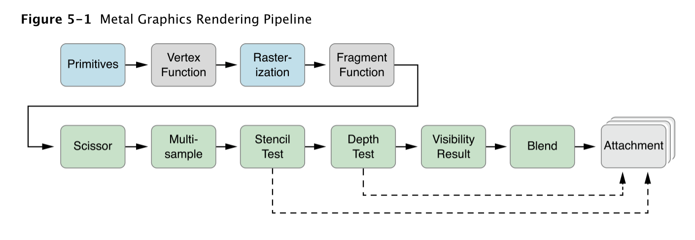

> A MTLRenderCommandEncoder object represents a single rendering command encoder. A MTLParallelRenderCommandEncoder object enables a single rendering pass to be broken into a number of separate MTLRenderCommandEncoder objects, each of which may be assigned to a different thread. The commands from the different render command encoders are then chained together and executed in a consistent, predictable order, as described in [Multiple Threads for a Rendering Pass](https://developer.apple.com/library/archive/documentation/Miscellaneous/Conceptual/MetalProgrammingGuide/Render-Ctx/Render-Ctx.html#//apple_ref/doc/uid/TP40014221-CH7-SW16).

MTLRenderCommandEncoder 对象表示单个渲染命令编码器。MTLParallelRenderCommandEncoder 对象允许将单个渲染过程分解为多个单独的 MTLRenderCommandEncoder 对象，每个对象可以分配给不同的线程。然后将来自不同渲染命令编码器的命令链接在一起并以一致、可预测的顺序执行，如  [Multiple Threads for a Rendering Pass](https://developer.apple.com/library/archive/documentation/Miscellaneous/Conceptual/MetalProgrammingGuide/Render-Ctx/Render-Ctx.html#//apple_ref/doc/uid/TP40014221-CH7-SW16) 中描述的那样。

### Creating and Using a Render Command Encoder - 创建并使用渲染命令编码器

> To create, initialize, and use a single render command encoder:
>
> 1. Create a [MTLRenderPassDescriptor](https://developer.apple.com/documentation/metal/mtlrenderpassdescriptor) object to define a collection of attachments that serve as the rendering destination for the graphics commands in the command buffer for that rendering pass. Typically, you create a MTLRenderPassDescriptor object once and reuse it each time your app renders a frame. See [Creating a Render Pass Descriptor](https://developer.apple.com/library/archive/documentation/Miscellaneous/Conceptual/MetalProgrammingGuide/Render-Ctx/Render-Ctx.html#//apple_ref/doc/uid/TP40014221-CH7-SW5).
> 2. Create a MTLRenderCommandEncoder object by calling the [renderCommandEncoderWithDescriptor:](https://developer.apple.com/documentation/metal/mtlcommandbuffer/1442999-rendercommandencoderwithdescript) method of [MTLCommandBuffer](https://developer.apple.com/documentation/metal/mtlcommandbuffer) with the specified render pass descriptor. See [Using the Render Pass Descriptor to Create a Render Command Encoder](https://developer.apple.com/library/archive/documentation/Miscellaneous/Conceptual/MetalProgrammingGuide/Render-Ctx/Render-Ctx.html#//apple_ref/doc/uid/TP40014221-CH7-SW11).
> 3. Create a [MTLRenderPipelineState](https://developer.apple.com/documentation/metal/mtlrenderpipelinestate) object to define the state of the graphics rendering pipeline (including shaders, blending, multisampling, and visibility testing) for one or more draw calls. To use this render pipeline state for drawing primitives, call the [setRenderPipelineState:](https://developer.apple.com/documentation/metal/mtlrendercommandencoder/1515811-setrenderpipelinestate) method of MTLRenderCommandEncoder. For details, see [Creating a Render Pipeline State](https://developer.apple.com/library/archive/documentation/Miscellaneous/Conceptual/MetalProgrammingGuide/Render-Ctx/Render-Ctx.html#//apple_ref/doc/uid/TP40014221-CH7-SW37).
> 4. Set textures, buffers, and samplers to be used by the render command encoder, as described in [Specifying Resources for a Render Command Encoder](https://developer.apple.com/library/archive/documentation/Miscellaneous/Conceptual/MetalProgrammingGuide/Render-Ctx/Render-Ctx.html#//apple_ref/doc/uid/TP40014221-CH7-SW10).
> 5. Call MTLRenderCommandEncoder methods to specify additional fixed-function state, including the depth and stencil state, as explained in [Fixed-Function State Operations](https://developer.apple.com/library/archive/documentation/Miscellaneous/Conceptual/MetalProgrammingGuide/Render-Ctx/Render-Ctx.html#//apple_ref/doc/uid/TP40014221-CH7-SW38).
> 6. Finally, call MTLRenderCommandEncoder methods to draw graphics primitives, as described in [Drawing Geometric Primitives](https://developer.apple.com/library/archive/documentation/Miscellaneous/Conceptual/MetalProgrammingGuide/Render-Ctx/Render-Ctx.html#//apple_ref/doc/uid/TP40014221-CH7-SW39).

要创建、初始化并使用单个渲染命令编码器：

1. 创建一个 [MTLRenderPassDescriptor](https://developer.apple.com/documentation/metal/mtlrenderpassdescriptor) 对象以定义一组 attachment ，这些 attachment 用作该渲染过程命令缓冲区中图形命令的渲染目的地。通常，你创建一次 MTLRenderPassDescriptor 对象，并在应用程序渲染每一帧时重复使用它。参阅  [Creating a Render Pass Descriptor](https://developer.apple.com/library/archive/documentation/Miscellaneous/Conceptual/MetalProgrammingGuide/Render-Ctx/Render-Ctx.html#//apple_ref/doc/uid/TP40014221-CH7-SW5) 。
2. 通过使用指定的渲染过程描述符调用 [MTLCommandBuffer](https://developer.apple.com/documentation/metal/mtlcommandbuffer) 的 [renderCommandEncoderWithDescriptor:](https://developer.apple.com/documentation/metal/mtlcommandbuffer/1442999-rendercommandencoderwithdescript) 方法创建 MTLRenderCommandEncoder 对象。参阅 [Using the Render Pass Descriptor to Create a Render Command Encoder](https://developer.apple.com/library/archive/documentation/Miscellaneous/Conceptual/MetalProgrammingGuide/Render-Ctx/Render-Ctx.html#//apple_ref/doc/uid/TP40014221-CH7-SW11) 。
3. 创建一个 [MTLRenderPipelineState](https://developer.apple.com/documentation/metal/mtlrenderpipelinestate) 对象，为一个或者更多绘制调用定义图形渲染管线的状态（包括着色器、混合、多重采样和可见性测试）。要使用该渲染管线状态来绘制图元，调用 MTLRenderCommandEncoder 的 [setRenderPipelineState:](https://developer.apple.com/documentation/metal/mtlrendercommandencoder/1515811-setrenderpipelinestate) 方法。有关详细信息，参阅  [Creating a Render Pipeline State](https://developer.apple.com/library/archive/documentation/Miscellaneous/Conceptual/MetalProgrammingGuide/Render-Ctx/Render-Ctx.html#//apple_ref/doc/uid/TP40014221-CH7-SW37) 。
4. 像 [Specifying Resources for a Render Command Encoder](https://developer.apple.com/library/archive/documentation/Miscellaneous/Conceptual/MetalProgrammingGuide/Render-Ctx/Render-Ctx.html#//apple_ref/doc/uid/TP40014221-CH7-SW10) 中描述的那样，设置渲染命令编码器使用的纹理、缓冲区和采样器。
5. 调用 MTLRenderCommandEncoder 方法以指定其他固有功能状态，包括深度和模版状态，如 [Fixed-Function State Operations](https://developer.apple.com/library/archive/documentation/Miscellaneous/Conceptual/MetalProgrammingGuide/Render-Ctx/Render-Ctx.html#//apple_ref/doc/uid/TP40014221-CH7-SW38) 中所述。
6. 最后，调用 MTLRenderCommandEncoder 方法绘制图形基元，如 [Drawing Geometric Primitives](https://developer.apple.com/library/archive/documentation/Miscellaneous/Conceptual/MetalProgrammingGuide/Render-Ctx/Render-Ctx.html#//apple_ref/doc/uid/TP40014221-CH7-SW39) 中所述。

#### Creating a Render Pass Descriptor - 创建一个渲染过程描述符

> A [MTLRenderPassDescriptor](https://developer.apple.com/documentation/metal/mtlrenderpassdescriptor) object represents the destination for the encoded rendering commands, which is a collection of attachments. The properties of a render pass descriptor may include an array of up to four attachments for color pixel data, one attachment for depth pixel data, and one attachment for stencil pixel data. The [renderPassDescriptor](https://developer.apple.com/documentation/metal/mtlrenderpassdescriptor/1437979-renderpassdescriptor) convenience method creates a MTLRenderPassDescriptor object with color, depth, and stencil attachment properties with default attachment state. The [visibilityResultBuffer](https://developer.apple.com/documentation/metal/mtlrenderpassdescriptor/1437942-visibilityresultbuffer) property specifies a buffer where the device can update to indicate whether any samples pass the depth and stencil tests—for details, see [Fixed-Function State Operations](https://developer.apple.com/library/archive/documentation/Miscellaneous/Conceptual/MetalProgrammingGuide/Render-Ctx/Render-Ctx.html#//apple_ref/doc/uid/TP40014221-CH7-SW38).
>
> Each individual attachment, including the texture that will be written to, is represented by an attachment descriptor. For an attachment descriptor, the pixel format of the associated texture must be chosen appropriately to store color, depth, or stencil data. For a color attachment descriptor, [MTLRenderPassColorAttachmentDescriptor](https://developer.apple.com/documentation/metal/mtlrenderpasscolorattachmentdescriptor), use a color-renderable pixel format. For a depth attachment descriptor, [MTLRenderPassDepthAttachmentDescriptor](https://developer.apple.com/documentation/metal/mtlrenderpassdepthattachmentdescriptor), use a depth-renderable pixel format, such as [MTLPixelFormatDepth32Float](https://developer.apple.com/documentation/metal/mtlpixelformat/depth32float). For a stencil attachment descriptor, [MTLRenderPassStencilAttachmentDescriptor](https://developer.apple.com/documentation/metal/mtlrenderpassstencilattachmentdescriptor), use a stencil-renderable pixel format, such as [MTLPixelFormatStencil8](https://developer.apple.com/documentation/metal/mtlpixelformat/mtlpixelformatstencil8).
>
> The amount of memory the texture actually uses per pixel on the device does not always match the size of the texture’s pixel format in the Metal framework code, because the device adds padding for alignment or other purposes. See the [Metal Feature Set Tables](https://developer.apple.com/library/archive/documentation/Miscellaneous/Conceptual/MetalProgrammingGuide/MetalFeatureSetTables/MetalFeatureSetTables.html#//apple_ref/doc/uid/TP40014221-CH13-SW1) chapter for how much memory is actually used for each pixel format, as well limitations on the size and number of attachments.

[MTLRenderPassDescriptor](https://developer.apple.com/documentation/metal/mtlrenderpassdescriptor) 对象表示已编码渲染命令的目的地，其为一系列 attachments 的集合。渲染通道描述符的属性可能包含用于颜色像素数据多达4个 attachment 的数组、一个用于深度像素数据的 attachment 、一个用于模版像素数据的 attachment 。[renderPassDescriptor](https://developer.apple.com/documentation/metal/mtlrenderpassdescriptor/1437979-renderpassdescriptor) 便捷方法使用默认 attachment 状态创建一个带有颜色、深度、模版 attachment 属性的 MTLRenderPassDescriptor 对象。 [visibilityResultBuffer](https://developer.apple.com/documentation/metal/mtlrenderpassdescriptor/1437942-visibilityresultbuffer) 属性指定设备可以更新的缓冲区，该缓冲区用来指示任何样本是否通过深度和模版测试 - 有关详细信息，参阅 [Fixed-Function State Operations](https://developer.apple.com/library/archive/documentation/Miscellaneous/Conceptual/MetalProgrammingGuide/Render-Ctx/Render-Ctx.html#//apple_ref/doc/uid/TP40014221-CH7-SW38) 。

每个单独的 attachment ，包括纹理将要写入的 attachment ，都有一个 attachment 描述符表示。对于一个 attachment 描述符，必须适当地选择相关纹理的像素格式以存储颜色、深度或者模版数据。对于颜色 attachment 描述符 [MTLRenderPassColorAttachmentDescriptor](https://developer.apple.com/documentation/metal/mtlrenderpasscolorattachmentdescriptor) ，使用颜色可渲染像素格式。对于深度 attachment 描述符 [MTLRenderPassDepthAttachmentDescriptor](https://developer.apple.com/documentation/metal/mtlrenderpassdepthattachmentdescriptor) ，使用深度可渲染像素格式，如 [MTLPixelFormatDepth32Float](https://developer.apple.com/documentation/metal/mtlpixelformat/depth32float) 。对于模版 attachment 描述符 [MTLRenderPassStencilAttachmentDescriptor](https://developer.apple.com/documentation/metal/mtlrenderpassstencilattachmentdescriptor) ，使用模版可渲染像素格式，如 [MTLPixelFormatStencil8](https://developer.apple.com/documentation/metal/mtlpixelformat/mtlpixelformatstencil8) 。

纹理每个像素确切的内存占用量并不总是与 Metal 框架代码中纹理的像素格式大小相匹配，因为设备添加了填充用于对齐或其他目的。有关每种像素格式实际使用的内存量以及 attachment 大小及数量上的限制，见 [Metal Feature Set Tables](https://developer.apple.com/library/archive/documentation/Miscellaneous/Conceptual/MetalProgrammingGuide/MetalFeatureSetTables/MetalFeatureSetTables.html#//apple_ref/doc/uid/TP40014221-CH13-SW1) 章节。

##### Load and Store Actions - 加载和存储操作

> The [loadAction](https://developer.apple.com/documentation/metal/mtlrenderpassattachmentdescriptor/1437905-loadaction) and [storeAction](https://developer.apple.com/documentation/metal/mtlrenderpassattachmentdescriptor/1437956-storeaction) properties of an attachment descriptor specify an action that is performed at either the start or end of a rendering pass. (For MTLParallelRenderCommandEncoder, the load and store actions occur at the boundaries of the overall command, not for each of its MTLRenderCommandEncoder objects. For details, see [Multiple Threads for a Rendering Pass](https://developer.apple.com/library/archive/documentation/Miscellaneous/Conceptual/MetalProgrammingGuide/Render-Ctx/Render-Ctx.html#//apple_ref/doc/uid/TP40014221-CH7-SW16).)
>
>Possible [loadAction](https://developer.apple.com/documentation/metal/mtlrenderpassattachmentdescriptor/1437905-loadaction) values include:
>
> - [MTLLoadActionClear](https://developer.apple.com/documentation/metal/mtlloadaction/clear), which writes the same value to every pixel in the specified attachment descriptor. For more detail about this action, see [Specifying the Clear Load Action](https://developer.apple.com/library/archive/documentation/Miscellaneous/Conceptual/MetalProgrammingGuide/Render-Ctx/Render-Ctx.html#//apple_ref/doc/uid/TP40014221-CH7-SW7).
> - [MTLLoadActionLoad](https://developer.apple.com/documentation/metal/mtlloadaction/load), which preserves the existing contents of the texture.
> - [MTLLoadActionDontCare](https://developer.apple.com/documentation/metal/mtlloadaction/dontcare), which allows each pixel in the attachment to take on any value at the start of the rendering pass.

attachment 描述符的 [loadAction](https://developer.apple.com/documentation/metal/mtlrenderpassattachmentdescriptor/1437905-loadaction) 和 [storeAction](https://developer.apple.com/documentation/metal/mtlrenderpassattachmentdescriptor/1437956-storeaction) 属性指定在渲染通道的开始或者结束时执行的操作。（对于 MTLParallelRenderCommandEncoder ，加载和存储操作发生在整个命令的边界，而不是每个 MTLRenderCommandEncoder 对象。有关详细信息，见 [Multiple Threads for a Rendering Pass](https://developer.apple.com/library/archive/documentation/Miscellaneous/Conceptual/MetalProgrammingGuide/Render-Ctx/Render-Ctx.html#//apple_ref/doc/uid/TP40014221-CH7-SW16) ）。

[loadAction](https://developer.apple.com/documentation/metal/mtlrenderpassattachmentdescriptor/1437905-loadaction) 可能的值包括：

- [MTLLoadActionClear](https://developer.apple.com/documentation/metal/mtlloadaction/clear) ，它将相同的值写入指定 attachment 描述符中的每个像素。有关此操作更多的详细信息，见 [Specifying the Clear Load Action](https://developer.apple.com/library/archive/documentation/Miscellaneous/Conceptual/MetalProgrammingGuide/Render-Ctx/Render-Ctx.html#//apple_ref/doc/uid/TP40014221-CH7-SW7) 。
- [MTLLoadActionLoad](https://developer.apple.com/documentation/metal/mtlloadaction/load) ，保留纹理的现有内容。
- [MTLLoadActionDontCare](https://developer.apple.com/documentation/metal/mtlloadaction/dontcare) ，允许 attachment 中的每个像素在渲染通道开始时采用任何值。

> If your application will render all pixels of the attachment for a given frame, use the default load action [MTLLoadActionDontCare](https://developer.apple.com/documentation/metal/mtlloadaction/dontcare). The MTLLoadActionDontCare action allows the GPU to avoid loading the existing contents of the texture, ensuring the best performance. Otherwise, you can use the [MTLLoadActionClear](https://developer.apple.com/documentation/metal/mtlloadaction/clear) action to clear the previous contents of the attachment, or the MTLLoadActionLoad action to preserve them. The MTLLoadActionClear action also avoids loading the existing texture contents, but it incurs the cost of filling the destination with a solid color.
>
> Possible [storeAction](https://developer.apple.com/documentation/metal/mtlrenderpassattachmentdescriptor/1437956-storeaction) values include:

> - [MTLStoreActionStore](https://developer.apple.com/documentation/metal/mtlstoreaction/mtlstoreactionstore), which saves the final results of the rendering pass into the attachment.
> - [MTLStoreActionMultisampleResolve](https://developer.apple.com/documentation/metal/mtlstoreaction/mtlstoreactionmultisampleresolve), which resolves the multisample data from the render target into single sample values, stores them in the texture specified by the attachment property resolveTexture, and leaves the contents of the attachment undefined. For details, see [Example: Creating a Render Pass Descriptor for Multisampled Rendering](https://developer.apple.com/library/archive/documentation/Miscellaneous/Conceptual/MetalProgrammingGuide/Render-Ctx/Render-Ctx.html#//apple_ref/doc/uid/TP40014221-CH7-SW27).
> - [MTLStoreActionDontCare](https://developer.apple.com/documentation/metal/mtlstoreaction/dontcare), which leaves the attachment in an undefined state after the rendering pass is complete. This may improve performance as it enables the implementation to avoid any work necessary to preserve the rendering results.
>
> For color attachments, the [MTLStoreActionStore](https://developer.apple.com/documentation/metal/mtlstoreaction/mtlstoreactionstore) action is the default store action, because applications almost always preserve the final color values in the attachment at the end of rendering pass. For depth and stencil attachments, [MTLStoreActionDontCare](https://developer.apple.com/documentation/metal/mtlstoreaction/dontcare) is the default store action, because those attachments typically do not need to be preserved after the rendering pass is complete.

如果你的应用程序对于给定帧将渲染 attachment 的所有像素，使用默认加载操作 [MTLLoadActionDontCare](https://developer.apple.com/documentation/metal/mtlloadaction/dontcare) 。MTLLoadActionDontCare 操作允许 GPU 避免加载纹理的现有内容，从而确保最佳性能。否则，你可以使用 [MTLLoadActionClear](https://developer.apple.com/documentation/metal/mtlloadaction/clear) 操作清除 attachment 之前的内容，或使用 MTLLoadActionLoad 操作来保留它们。MTLLoadActionClear 操作也可以避免加载现有纹理内容，但是会产生使用纯色填充目标的成本。

可能的 [storeAction](https://developer.apple.com/documentation/metal/mtlrenderpassattachmentdescriptor/1437956-storeaction) 值包括：

- [MTLStoreActionStore](https://developer.apple.com/documentation/metal/mtlstoreaction/mtlstoreactionstore) ，保存渲染过程的最终结果到 attachment 中。
- [MTLStoreActionMultisampleResolve](https://developer.apple.com/documentation/metal/mtlstoreaction/mtlstoreactionmultisampleresolve) ，它将渲染目标中的多重采样数据解析成单个样本值，将它们存储在 attachment 的 resolveTexture 属性指定的纹理中，并使 attachment 的内容保持未定义状态。更多详细信息，见 [Example: Creating a Render Pass Descriptor for Multisampled Rendering](https://developer.apple.com/library/archive/documentation/Miscellaneous/Conceptual/MetalProgrammingGuide/Render-Ctx/Render-Ctx.html#//apple_ref/doc/uid/TP40014221-CH7-SW27) 。
- [MTLStoreActionDontCare](https://developer.apple.com/documentation/metal/mtlstoreaction/dontcare) ，渲染过程完成后使 attachment 处于未定义状态。这可以提高性能，因为它使实现避免任何保留渲染结果的工作。

对于颜色 attachment ， [MTLStoreActionStore](https://developer.apple.com/documentation/metal/mtlstoreaction/mtlstoreactionstore) 操作是默认的存储操作，因为应用程序总是在渲染过程结束之后保留attachment 中最终的颜色值。对于深度和模版 attachment 来说，[MTLStoreActionDontCare](https://developer.apple.com/documentation/metal/mtlstoreaction/dontcare) 是默认的存储操作，因为在渲染过程结束后通常不需要保留这些 attachment 。

##### Specifying the Clear Load Action - 指定清除加载操作

> if the [loadAction](https://developer.apple.com/documentation/metal/mtlrenderpassattachmentdescriptor/1437905-loadaction) property of an attachment descriptor is set to [MTLLoadActionClear](https://developer.apple.com/documentation/metal/mtlloadaction/clear), then a clearing value is written to every pixel in the specified attachment descriptor at the start of a rendering pass. The clearing value property depends upon the type of attachment.

> - For [MTLRenderPassColorAttachmentDescriptor](https://developer.apple.com/documentation/metal/mtlrenderpasscolorattachmentdescriptor), [clearColor](https://developer.apple.com/documentation/metal/mtlrenderpasscolorattachmentdescriptor/1437924-clearcolor) contains a [MTLClearColor](https://developer.apple.com/documentation/metal/mtlclearcolor) value that consists of four double-precision floating-point RGBA components and is used to clear the color attachment. The [MTLClearColorMake](https://developer.apple.com/documentation/metal/1437971-mtlclearcolormake) function creates a clear color value from red, green, blue, and alpha components. The default clear color is (0.0, 0.0, 0.0, 1.0), or opaque black.
> - For [MTLRenderPassDepthAttachmentDescriptor](https://developer.apple.com/documentation/metal/mtlrenderpassdepthattachmentdescriptor), [clearDepth](https://developer.apple.com/documentation/metal/mtlrenderpassdepthattachmentdescriptor/1437933-cleardepth) contains one double-precision floating-point clearing value in the range [0.0, 1.0] that is used to clear the depth attachment. The default value is 1.0.
> - For [MTLRenderPassStencilAttachmentDescriptor](https://developer.apple.com/documentation/metal/mtlrenderpassstencilattachmentdescriptor), [clearStencil](https://developer.apple.com/documentation/metal/mtlrenderpassstencilattachmentdescriptor/1437931-clearstencil) contains one 32-bit unsigned integer that is used to clear the stencil attachment. The default value is 0.

如果 attachment 描述符的 [loadAction](https://developer.apple.com/documentation/metal/mtlrenderpassattachmentdescriptor/1437905-loadaction) 属性设置为 [MTLLoadActionClear](https://developer.apple.com/documentation/metal/mtlloadaction/clear) ，则在渲染过程开始时，指定 attachment 描述符中的每个像素会被写入一个清除值。清除值属性取决于 attachment 的类型。

- 对于 [MTLRenderPassColorAttachmentDescriptor](https://developer.apple.com/documentation/metal/mtlrenderpasscolorattachmentdescriptor) ，[clearColor](https://developer.apple.com/documentation/metal/mtlrenderpasscolorattachmentdescriptor/1437924-clearcolor) 包含一个 [MTLClearColor](https://developer.apple.com/documentation/metal/mtlclearcolor) 值，该值由四个双精度浮点 RGBA 组件组成，用于清除颜色 attachment 。 [MTLClearColorMake](https://developer.apple.com/documentation/metal/1437971-mtlclearcolormake) 函数从红、绿、蓝和透明分量创建一个清除颜色值。默认的清除颜色为 (0.0, 0.0, 0.0, 1.0) 或者不透明黑色。
- 对于 [MTLRenderPassDepthAttachmentDescriptor](https://developer.apple.com/documentation/metal/mtlrenderpassdepthattachmentdescriptor) ，[clearDepth](https://developer.apple.com/documentation/metal/mtlrenderpassdepthattachmentdescriptor/1437933-cleardepth) 包含一个介于 [0.0, 1.0] 之间的双精度浮点清除值，用于清除深度 attachment ，默认值为 1.0 。
- 对于 [MTLRenderPassStencilAttachmentDescriptor](https://developer.apple.com/documentation/metal/mtlrenderpassstencilattachmentdescriptor) ，[clearStencil](https://developer.apple.com/documentation/metal/mtlrenderpassstencilattachmentdescriptor/1437931-clearstencil) 包含一个 32 位无符号整数，用于清除模版 attachment 。默认值为 0 。

##### Example: Creating a Render Pass Descriptor with Load and Store Actions - 示例：使用加载和存储操作创建渲染通道描述符

> Listing 5-1 creates a simple render pass descriptor with color and depth attachments. First, two texture objects are created, one with a color-renderable pixel format and the other with a depth pixel format. Next the [renderPassDescriptor](https://developer.apple.com/documentation/metal/mtlrenderpassdescriptor/1437979-renderpassdescriptor) convenience method of [MTLRenderPassDescriptor](https://developer.apple.com/documentation/metal/mtlrenderpassdescriptor) creates a default render pass descriptor. Then the color and depth attachments are accessed through the properties of MTLRenderPassDescriptor. The textures and actions are set in colorAttachments[0], which represents the first color attachment (at index 0 in the array), and the depth attachment.

> Listing 5-1  Creating a Render Pass Descriptor with Color and Depth Attachments

清单 5-1 创建了一个带有颜色和深度 attachment 的简单渲染过程描述符。首先，创建了两个纹理对象，一个具有颜色可渲染像素格式，另一个具有深度像素格式。接下来， [MTLRenderPassDescriptor](https://developer.apple.com/documentation/metal/mtlrenderpassdescriptor) 的 [renderPassDescriptor](https://developer.apple.com/documentation/metal/mtlrenderpassdescriptor/1437979-renderpassdescriptor) 便捷方法创建了一个默认渲染通道描述符。然后通过 MTLRenderPassDescriptor 的属性访问颜色和深度 attachment 。针对 colorAttachments[0] 和深度 attachment ，分别设置了对应的纹理和操作，colorAttachments[0] 表示第一个颜色 attachment （位于数组中的 0 号位置）。

Listing 5-1  创建一个带有颜色和深度 attachments 的渲染通道描述符

```objc
MTLTextureDescriptor *colorTexDesc = [MTLTextureDescriptor
    texture2DDescriptorWithPixelFormat:MTLPixelFormatRGBA8Unorm
    width:IMAGE_WIDTH height:IMAGE_HEIGHT mipmapped:NO];
id <MTLTexture> colorTex = [device newTextureWithDescriptor:colorTexDesc];

MTLTextureDescriptor *depthTexDesc = [MTLTextureDescriptor
    texture2DDescriptorWithPixelFormat:MTLPixelFormatDepth32Float
    width:IMAGE_WIDTH height:IMAGE_HEIGHT mipmapped:NO];
id <MTLTexture> depthTex = [device newTextureWithDescriptor:depthTexDesc];

MTLRenderPassDescriptor *renderPassDesc = [MTLRenderPassDescriptor renderPassDescriptor];
renderPassDesc.colorAttachments[0].texture = colorTex;
renderPassDesc.colorAttachments[0].loadAction = MTLLoadActionClear;
renderPassDesc.colorAttachments[0].storeAction = MTLStoreActionStore;
renderPassDesc.colorAttachments[0].clearColor = MTLClearColorMake(0.0,1.0,0.0,1.0);

renderPassDesc.depthAttachment.texture = depthTex;
renderPassDesc.depthAttachment.loadAction = MTLLoadActionClear;
renderPassDesc.depthAttachment.storeAction = MTLStoreActionStore;
renderPassDesc.depthAttachment.clearDepth = 1.0;
```

##### Example: Creating a Render Pass Descriptor for Multisampled Rendering - 示例：为多重采样渲染创建渲染通道描述符

> To use the [MTLStoreActionMultisampleResolve](https://developer.apple.com/documentation/metal/mtlstoreaction/mtlstoreactionmultisampleresolve) action, you must set the [texture](https://developer.apple.com/documentation/metal/mtlrenderpassattachmentdescriptor/1437958-texture) property to a multisample-type texture, and the [resolveTexture](https://developer.apple.com/documentation/metal/mtlrenderpassattachmentdescriptor/1437926-resolvetexture) property will contain the result of the multisample resolve operation. (If texture does not support multisampling, then the result of a multisample resolve action is undefined.) The [resolveLevel](https://developer.apple.com/documentation/metal/mtlrenderpassattachmentdescriptor/1437918-resolvelevel), [resolveSlice](https://developer.apple.com/documentation/metal/mtlrenderpassattachmentdescriptor/1437966-resolveslice), and [resolveDepthPlane](https://developer.apple.com/documentation/metal/mtlrenderpassattachmentdescriptor/1437960-resolvedepthplane) properties may also be used for the multisample resolve operation to specify the mipmap level, cube slice, and depth plane of the multisample texture, respectively. In most cases, the default values for resolveLevel, resolveSlice, and resolveDepthPlane are usable. In Listing 5-2, an attachment is initially created and then its loadAction, storeAction, texture, and resolveTexture properties are set to support multisample resolve.
>
> Listing 5-2  Setting Properties for an Attachment with Multisample Resolve

要使用 [MTLStoreActionMultisampleResolve](https://developer.apple.com/documentation/metal/mtlstoreaction/mtlstoreactionmultisampleresolve) 操作，必须将 [texture](https://developer.apple.com/documentation/metal/mtlrenderpassattachmentdescriptor/1437958-texture) 属性设置为多重采样类型纹理， [resolveTexture](https://developer.apple.com/documentation/metal/mtlrenderpassattachmentdescriptor/1437926-resolvetexture) 属性将会包含多重采样解析操作的结果。（如果纹理不支持多重采样，多重采样解析操作的结果是为定义的）。[resolveLevel](https://developer.apple.com/documentation/metal/mtlrenderpassattachmentdescriptor/1437918-resolvelevel), [resolveSlice](https://developer.apple.com/documentation/metal/mtlrenderpassattachmentdescriptor/1437966-resolveslice), 和 [resolveDepthPlane](https://developer.apple.com/documentation/metal/mtlrenderpassattachmentdescriptor/1437960-resolvedepthplane) 属性也可用于多重采样解析操作，分别制定 mipmap 级别、立方体切片和深度平面。大多数情况下，resolveLevel 、resolveSlice 和 resolveDepthPlane 默认值都是可用的。在清单 5-2 中，创建了一个 attachment ，然后设置它的 loadAction 、storeAction 、texture 和 resolveTexture 属性以支持多重采样解析。

清单 5-2  使用多重采样解析设置 attachment 的属性

```objc
MTLTextureDescriptor *colorTexDesc = [MTLTextureDescriptor
    texture2DDescriptorWithPixelFormat:MTLPixelFormatRGBA8Unorm
    width:IMAGE_WIDTH height:IMAGE_HEIGHT mipmapped:NO];
id <MTLTexture> colorTex = [device newTextureWithDescriptor:colorTexDesc];

MTLTextureDescriptor *msaaTexDesc = [MTLTextureDescriptor
    texture2DDescriptorWithPixelFormat:MTLPixelFormatRGBA8Unorm
    width:IMAGE_WIDTH height:IMAGE_HEIGHT mipmapped:NO];
msaaTexDesc.textureType = MTLTextureType2DMultisample;
msaaTexDesc.sampleCount = sampleCount;  //  must be > 1
id <MTLTexture> msaaTex = [device newTextureWithDescriptor:msaaTexDesc];

MTLRenderPassDescriptor *renderPassDesc = [MTLRenderPassDescriptor renderPassDescriptor];
renderPassDesc.colorAttachments[0].texture = msaaTex;
renderPassDesc.colorAttachments[0].resolveTexture = colorTex;
renderPassDesc.colorAttachments[0].loadAction = MTLLoadActionClear;
renderPassDesc.colorAttachments[0].storeAction = MTLStoreActionMultisampleResolve;
renderPassDesc.colorAttachments[0].clearColor = MTLClearColorMake(0.0,1.0,0.0,1.0);
```

##### Using the Render Pass Descriptor to Create a Render Command Encoder - 使用渲染通道描述符创建渲染命令编码器

> After you create a render pass descriptor and specify its properties, use the [renderCommandEncoderWithDescriptor:](https://developer.apple.com/documentation/metal/mtlcommandbuffer/1442999-rendercommandencoderwithdescript) method of a [MTLCommandBuffer](https://developer.apple.com/documentation/metal/mtlcommandbuffer) object to create a render command encoder, as shown in Listing 5-3.
>
> Listing 5-3  Creating a Render Command Encoder with the Render Pass Descriptor

创建渲染过程描述符并制定其属性之后，使用 [MTLCommandBuffer](https://developer.apple.com/documentation/metal/mtlcommandbuffer) 对象的 [renderCommandEncoderWithDescriptor:](https://developer.apple.com/documentation/metal/mtlcommandbuffer/1442999-rendercommandencoderwithdescript) 方法创建渲染命令编码器，如清单 5-3 所示。

清单 5-3 使用渲染通道描述符创建渲染命令编码器

```objc
id <MTLRenderCommandEncoder> renderCE = [commandBuffer
    renderCommandEncoderWithDescriptor:renderPassDesc];
```

### Displaying Rendered Content with Core Animation - 使用核心动画显示渲染内容

> Core Animation defines the [CAMetalLayer](https://developer.apple.com/documentation/quartzcore/cametallayer) class, which is designed for the specialized behavior of a layer-backed view whose content is rendered using Metal. A CAMetalLayer object represents information about the geometry of the content (position and size), its visual attributes (background color, border, and shadow), and the resources used by Metal to present the content in a color attachment. It also encapsulates the timing of content presentation so that the content can be displayed as soon as it is available or at a specified time. For more information about Core Animation, see the [Core Animation Programming Guide](https://developer.apple.com/library/archive/documentation/Cocoa/Conceptual/CoreAnimation_guide/Introduction/Introduction.html#//apple_ref/doc/uid/TP40004514).
>
> Core Animation also defines the [CAMetalDrawable](https://developer.apple.com/documentation/quartzcore/cametaldrawable) protocol for objects that are displayable resources. The CAMetalDrawable protocol extends MTLDrawable and provides an object that conforms to the [MTLTexture](https://developer.apple.com/documentation/metal/mtltexture) protocol, so it can be used as a destination for rendering commands. To render into a CAMetalLayer object, you should get a new CAMetalDrawable object for each rendering pass, get the MTLTexture object that it provides, and use that texture to create the color attachment. Unlike color attachments, creation and destruction of a depth or stencil attachment are costly. If you need either depth or stencil attachments, create them once and then reuse them each time a frame is rendered.
>
> Typically, you use the [layerClass](https://developer.apple.com/documentation/uikit/uiview/1622626-layerclass) method to designate CAMetalLayer as the backing layer type for your own custom UIView subclass, as shown in Listing 5-4. Otherwise, you can create a CAMetalLayer with its init method and include the layer in an existing view.
>
> Listing 5-4  Using CAMetalLayer as the backing layer for a UIView subclass

Core Animation 定义了 [CAMetalLayer](https://developer.apple.com/documentation/quartzcore/cametallayer) 类，该类专为使用 Metal 渲染内容的图层支持视图的特殊行为而设计。CAMetalLayer 对象表示有关内容几何（位置和大小）、可见属性（背景颜色、边框和阴影）的信息，以及 Metal 用于在颜色 attachment 显示内容使用的资源。它还封装了内容呈现的时间控制，以便内容可以在可用时或者指定的时间呈现出来。关于 Core Animation 的更多信息，参见 [Core Animation Programming Guide](https://developer.apple.com/library/archive/documentation/Cocoa/Conceptual/CoreAnimation_guide/Introduction/Introduction.html#//apple_ref/doc/uid/TP40004514) 。

Core Animation 还为可显示资源的对象定义了 [CAMetalDrawable](https://developer.apple.com/documentation/quartzcore/cametaldrawable) 协议。CAMetalDrawable 协议扩展了 MTLDrawable 协议并提供了一个遵循 [MTLTexture](https://developer.apple.com/documentation/metal/mtltexture) 协议的对象，所以它可以用作渲染命令的目的地。要渲染到 CAMetalLayer 对象中，你应该为每个渲染过程获取一个新的 CAMetalDrawable 对象，进而获取它提供的 MTLTexture 对象并且使用该纹理创建颜色 attachment 。与颜色 attachment 不同，创建并销毁深度或模版 attachment 的代价是昂贵的。如果你需要深度或者模版 attachment ，创建一次，然后在每次渲染帧时重复使用它们。

通常，对于自定义的 UIView 子类，使用 [layerClass](https://developer.apple.com/documentation/uikit/uiview/1622626-layerclass) 方法指定 CAMetalLayer 作为对应的图层类型，如清单 5-4 中所述。否则，你可以使用 init 方法创建 CAMetalLayer ，并将该图层包含在已存在的视图中。

清单 5-4 使用 CAMetalLayer 作为 UIView 子类背后的图层

```objc
+ (id) layerClass {
    return [CAMetalLayer class];
}
```

> To display content rendered by Metal in the layer, you must obtain a displayable resource (a [CAMetalDrawable](https://developer.apple.com/documentation/quartzcore/cametaldrawable) object) from the CAMetalLayer object and then render to the texture in this resource by attaching it to a [MTLRenderPassDescriptor](https://developer.apple.com/documentation/metal/mtlrenderpassdescriptor) object. To do this, you first set properties of the CAMetalLayer object that describe the drawable resources it provides, then call its [nextDrawable](https://developer.apple.com/documentation/quartzcore/cametallayer/1478172-nextdrawable) method each time you begin rendering a new frame. If the CAMetalLayer properties are not set, the nextDrawable method call fails. The following CAMetalLayer properties describe the drawable object:
>
> - The [device](https://developer.apple.com/documentation/quartzcore/cametallayer/1478163-device) property declares the [MTLDevice](https://developer.apple.com/documentation/metal/mtldevice) object that the resource is created from.
> - The [pixelFormat](https://developer.apple.com/documentation/quartzcore/cametallayer/1478155-pixelformat) property declares the pixel format of the texture. The supported values are [MTLPixelFormatBGRA8Unorm](https://developer.apple.com/documentation/metal/mtlpixelformat/bgra8unorm) (the default) and [MTLPixelFormatBGRA8Unorm_sRGB](https://developer.apple.com/documentation/metal/mtlpixelformat/bgra8unorm_srgb).
> - The [drawableSize](https://developer.apple.com/documentation/quartzcore/cametallayer/1478174-drawablesize) property declares the dimensions of the texture in device pixels. To ensure that your app renders content at the precise dimensions of the display (without requiring an additional sampling stage on some devices), take the target screen’s [nativeScale](https://developer.apple.com/documentation/uikit/uiscreen/1617825-nativescale) or [nativeBounds](https://developer.apple.com/documentation/uikit/uiscreen/1617810-nativebounds) property into account when calculating the desired size for your layer.
> - The [framebufferOnly](https://developer.apple.com/documentation/quartzcore/cametallayer/1478168-framebufferonly) property declares whether the texture can be used only as an attachment (YES) or whether it can also be used for texture sampling and pixel read/write operations (NO). If YES, the layer object can optimize the texture for display. For most apps, the recommended value is YES.
> - The [presentsWithTransaction](https://developer.apple.com/documentation/quartzcore/cametallayer/1478157-presentswithtransaction) property declares whether changes to the layer's rendered resource are updated with standard Core Animation transaction mechanisms (YES) or are updated asynchronously to normal layer updates (NO, the default value).

在 layer 上显示 Metal 渲染的内容，你必须从 CAMetalLayer 对象获取可渲染的资源，然后通过将该资源附加到 [MTLRenderPassDescriptor](https://developer.apple.com/documentation/metal/mtlrenderpassdescriptor) 对象上来达到渲染至其纹理中的目的。为此，首先设置 CAMetalLayer 对象的描述其提供的可绘制资源的属性，然后在每次开始渲染新的一帧时调用其  [nextDrawable](https://developer.apple.com/documentation/quartzcore/cametallayer/1478172-nextdrawable) 方法。如果 CAMetalLayer 属性未设置，nextDrawable 方法将调用失败。以下 CAMetalLayer 属性描述了可绘制对象：

- [device](https://developer.apple.com/documentation/quartzcore/cametallayer/1478163-device) 属性声明了 [MTLDevice](https://developer.apple.com/documentation/metal/mtldevice) 对象，资源创建于此。
- [pixelFormat](https://developer.apple.com/documentation/quartzcore/cametallayer/1478155-pixelformat) 属性声明纹理的像素格式。支持的值有 [MTLPixelFormatBGRA8Unorm](https://developer.apple.com/documentation/metal/mtlpixelformat/bgra8unorm)（默认值）和 [MTLPixelFormatBGRA8Unorm_sRGB](https://developer.apple.com/documentation/metal/mtlpixelformat/bgra8unorm_srgb)。
- [drawableSize](https://developer.apple.com/documentation/quartzcore/cametallayer/1478174-drawablesize) 属性声明了纹理的尺寸，以设备像素为单位。要确保你的应用程序以屏幕的精确尺寸渲染内容（在某些设备上无需额外的采样阶段），在计算图层所需要的大小时，考虑目标屏幕的 [nativeScale](https://developer.apple.com/documentation/uikit/uiscreen/1617825-nativescale) 或 [nativeBounds](https://developer.apple.com/documentation/uikit/uiscreen/1617810-nativebounds) 属性。
-  [framebufferOnly](https://developer.apple.com/documentation/quartzcore/cametallayer/1478168-framebufferonly) 属性声明纹理是否只是用作 attachment（YES），还是也可用以纹理采样和像素读写操作（NO）。若为 YES ，图层对象可以优化纹理以供显示。对于大多数应用程序，建议值为 YES 。
- [presentsWithTransaction](https://developer.apple.com/documentation/quartzcore/cametallayer/1478157-presentswithtransaction) 属性声明对于图层渲染资源的更改，是使用标准 Core Animation 事务机制更新（YES）还是异步更新到常规视图更新（ NO , 默认值）。

> If the nextDrawable method succeeds, it returns a CAMetalDrawable object with the following read-only properties:
>
> - The [texture](https://developer.apple.com/documentation/quartzcore/cametaldrawable/1478159-texture) property holds the texture object. You use this as an attachment when creating your rendering pipeline ([MTLRenderPipelineColorAttachmentDescriptor](https://developer.apple.com/documentation/metal/mtlrenderpipelinecolorattachmentdescriptor) object).
> - The [layer](https://developer.apple.com/documentation/quartzcore/cametaldrawable/1478165-layer) property points to the CAMetalLayer object that responsible for displaying the drawable.

如果 nextDrawable 方法成功，其返回一个带有以下只读属性的 CAMetalDrawable 对象：

-  [texture](https://developer.apple.com/documentation/quartzcore/cametaldrawable/1478159-texture) 属性保存纹理对象。在创建渲染管线（ [MTLRenderPipelineColorAttachmentDescriptor](https://developer.apple.com/documentation/metal/mtlrenderpipelinecolorattachmentdescriptor) 对象）时使用它作为 attachment 。
- [layer](https://developer.apple.com/documentation/quartzcore/cametaldrawable/1478165-layer) 属性指向负责显示 drawable 的 CAMetalLayer 对象。

> Important: There are only a small set of drawable resources, so a long frame rendering time could temporarily exhaust those resources and cause a nextDrawable method call to block its CPU thread until the method is completed. To avoid expensive CPU stalls, perform all per-frame operations that do not need a drawable resource before calling the nextDrawable method of a CAMetalLayer object.
>
> - To display the contents of a drawable object after rendering is complete, you must submit it to Core Animation by calling the drawable object’s [present](https://developer.apple.com/documentation/metal/mtldrawable/1470284-present) method. To synchronize presentation of a drawable with completion of the command buffer responsible for its rendering, you can call either the [presentDrawable:](https://developer.apple.com/documentation/metal/mtlcommandbuffer/1443029-present) or [presentDrawable:atTime:](https://developer.apple.com/documentation/metal/mtlcommandbuffer/1442989-present) convenience method on a [MTLCommandBuffer](https://developer.apple.com/documentation/metal/mtlcommandbuffer) object. These methods use the scheduled handler (see [Registering Handler Blocks for Command Buffer Execution](https://developer.apple.com/library/archive/documentation/Miscellaneous/Conceptual/MetalProgrammingGuide/Cmd-Submiss/Cmd-Submiss.html#//apple_ref/doc/uid/TP40014221-CH3-SW20)) to call the drawable’s present method, which covers most scenarios. The presentDrawable:atTime: method provides further control over when the drawable is presented.

重要：只有一小部分可绘制资源，因此长帧渲染时间可能暂时耗尽这些资源并导致 nextDrawable 方法调用阻塞其 CPU 线程，知道方法完成。为了避免昂贵的 CPU 停顿，在调用 CAMetalLayer 对象的 nextDrawable 方法之前，执行所有不需要可绘制资源的每帧操作。

要在渲染完成之后显示可绘制对象的内容，必须通过调用可绘制对象的 [present](https://developer.apple.com/documentation/metal/mtldrawable/1470284-present) 方法将其提交给 Core Animation 。要使 drawable 的显示和用于渲染的命令缓冲区的完成之间同步，你可以调用 [MTLCommandBuffer](https://developer.apple.com/documentation/metal/mtlcommandbuffer) 对象的 [presentDrawable:](https://developer.apple.com/documentation/metal/mtlcommandbuffer/1443029-present) 或 [presentDrawable:atTime:](https://developer.apple.com/documentation/metal/mtlcommandbuffer/1442989-present) 便捷方法。这些方法使用调度处理程序（见  [Registering Handler Blocks for Command Buffer Execution](https://developer.apple.com/library/archive/documentation/Miscellaneous/Conceptual/MetalProgrammingGuide/Cmd-Submiss/Cmd-Submiss.html#//apple_ref/doc/uid/TP40014221-CH3-SW20) ）来调用 drawable 的 present 方法，可以覆盖大多数场景。presentDrawable:atTime: 方法提供了何时呈现 drawble 的进一步控制。

### Creating a Render Pipeline State - 创建渲染管线状态

> To use a [MTLRenderCommandEncoder](https://developer.apple.com/documentation/metal/mtlrendercommandencoder) object to encode rendering commands, you must first specify a [MTLRenderPipelineState](https://developer.apple.com/documentation/metal/mtlrenderpipelinestate) object to define the graphics state for any draw calls. A render pipeline state object is a long-lived persistent object that can be created outside of a render command encoder, cached in advance, and reused across several render command encoders. When describing the same set of graphics state, reusing a previously created render pipeline state object may avoid expensive operations that re-evaluate and translate the specified state to GPU commands.
> 
> A render pipeline state is an immutable object. To create a render pipeline state, you first create and configure a mutable [MTLRenderPipelineDescriptor](https://developer.apple.com/documentation/metal/mtlrenderpipelinedescriptor) object that describes the attributes of a render pipeline state. Then, you use the descriptor to create a [MTLRenderPipelineState](https://developer.apple.com/documentation/metal/mtlrenderpipelinestate) object.

要使用 [MTLRenderCommandEncoder](https://developer.apple.com/documentation/metal/mtlrendercommandencoder) 对象对渲染命令进行编码，你必须首先指定一个 [MTLRenderPipelineState](https://developer.apple.com/documentation/metal/mtlrenderpipelinestate) 对象以定义用于任何绘制调用的图形状态。渲染管线状态对象是一个长期存在的持久对象，可以在渲染命令编码器之外创建，预先缓存，并在多个渲染命令编码器之间重用。当描述相同的图形状态集时，重用先前创建的渲染管线状态对象可以避免重新评估并将指定状态转换为 GPU 命令的昂贵操作。

渲染管线状态是不可变对象。要创建渲染管线状态，首先要创建并配置一个可变 [MTLRenderPipelineDescriptor](https://developer.apple.com/documentation/metal/mtlrenderpipelinedescriptor) 对象，该对象描述渲染管线状态的属性。 然后，使用描述符创建 [MTLRenderPipelineState](https://developer.apple.com/documentation/metal/mtlrenderpipelinestate) 对象。

#### Creating and Configuring a Render Pipeline Descriptor - 创建并配置渲染管线描述符

> To create a render pipeline state, first create a [MTLRenderPipelineDescriptor](https://developer.apple.com/documentation/metal/mtlrenderpipelinedescriptor) object, which has properties that describe the graphics rendering pipeline state you want to use during the rendering pass, as depicted in Figure 5-2. The [colorAttachments](https://developer.apple.com/documentation/metal/mtlrenderpipelinedescriptor/1514712-colorattachments) property of the new MTLRenderPipelineDescriptor object contains an array of [MTLRenderPipelineColorAttachmentDescriptor](https://developer.apple.com/documentation/metal/mtlrenderpipelinecolorattachmentdescriptor) objects, and each descriptor represents a color attachment state that specifies the blend operations and factors for that attachment, as detailed in [Configuring Blending in a Render Pipeline Attachment Descriptor](https://developer.apple.com/library/archive/documentation/Miscellaneous/Conceptual/MetalProgrammingGuide/Render-Ctx/Render-Ctx.html#//apple_ref/doc/uid/TP40014221-CH7-SW22). The attachment descriptor also specifies the pixel format of the attachment, which must match the pixel format for the texture of the render pipeline descriptor with the corresponding attachment index, or an error occurs.

要创建渲染管线状态，首先创建一个 [MTLRenderPipelineDescriptor](https://developer.apple.com/documentation/metal/mtlrenderpipelinedescriptor) 对象，该对象具有描述在渲染过程中要使用的图形渲染管线状态的属性。如图 5-2 所示。新 MTLRenderPipelineDescriptor 对象的 [colorAttachments](https://developer.apple.com/documentation/metal/mtlrenderpipelinedescriptor/1514712-colorattachments) 属性包含一个[MTLRenderPipelineColorAttachmentDescriptor](https://developer.apple.com/documentation/metal/mtlrenderpipelinecolorattachmentdescriptor) 对象的数组，每个描述符表示一个颜色附件状态，指定该附件的混合操作和因子，详见  [Configuring Blending in a Render Pipeline Attachment Descriptor](https://developer.apple.com/library/archive/documentation/Miscellaneous/Conceptual/MetalProgrammingGuide/Render-Ctx/Render-Ctx.html#//apple_ref/doc/uid/TP40014221-CH7-SW22) 。附件描述符也指定了附件的像素格式，该格式必须与相应 attachment 索引的渲染管线描述符纹理的像素格式相匹配，否则的话会产生错误。

Figure 5-2  从描述符创建渲染管线状态

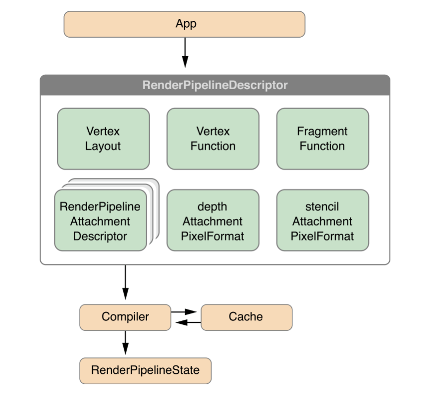

> In addition to configuring the color attachments, set these properties for the [MTLRenderPipelineDescriptor](https://developer.apple.com/documentation/metal/mtlrenderpipelinedescriptor) object:
>
> - Set the [depthAttachmentPixelFormat](https://developer.apple.com/documentation/metal/mtlrenderpipelinedescriptor/1514608-depthattachmentpixelformat) property to match the pixel format for the texture of [depthAttachment](https://developer.apple.com/documentation/metal/mtlrenderpassdescriptor/1437973-depthattachment) in [MTLRenderPassDescriptor](https://developer.apple.com/documentation/metal/mtlrenderpassdescriptor).
> - Set the [stencilAttachmentPixelFormat](https://developer.apple.com/documentation/metal/mtlrenderpipelinedescriptor/1514650-stencilattachmentpixelformat) property to match the pixel format for the texture of [stencilAttachment](https://developer.apple.com/documentation/metal/mtlrenderpassdescriptor/1437950-stencilattachment) in [MTLRenderPassDescriptor](https://developer.apple.com/documentation/metal/mtlrenderpassdescriptor).
> - To specify the vertex or fragment shader in the render pipeline state, set the [vertexFunction](https://developer.apple.com/documentation/metal/mtlrenderpipelinedescriptor/1514679-vertexfunction) or [fragmentFunction](https://developer.apple.com/documentation/metal/mtlrenderpipelinedescriptor/1514600-fragmentfunction) property, respectively. Setting fragmentFunction to nil disables the rasterization of pixels into the specified color attachment, which is typically used for depth-only rendering or for outputting data into a buffer object from the vertex shader.
> - If the vertex shader has an argument with per-vertex input attributes, set the [vertexDescriptor](https://developer.apple.com/documentation/metal/mtlrenderpipelinedescriptor/1514681-vertexdescriptor) property to describe the organization of the vertex data in that argument, as described in [Vertex Descriptor for Data Organization](https://developer.apple.com/library/archive/documentation/Miscellaneous/Conceptual/MetalProgrammingGuide/Render-Ctx/Render-Ctx.html#//apple_ref/doc/uid/TP40014221-CH7-SW44).
> - The default value of YES for the [rasterizationEnabled](https://developer.apple.com/documentation/metal/mtlrenderpipelinedescriptor/1514708-rasterizationenabled) property is sufficient for most typical rendering tasks. To use only the vertex stage of the graphics pipeline (for example, to gather data transformed in a vertex shader), set this property to NO.
> - If the attachment supports multisampling (that is, the attachment is a [MTLTextureType2DMultisample](https://developer.apple.com/documentation/metal/mtltexturetype/mtltexturetype2dmultisample) type texture), then multiple samples can be created per pixel. To determine how fragments combine to provide pixel coverage, use the following MTLRenderPipelineDescriptor properties.
>   - The [sampleCount](https://developer.apple.com/documentation/metal/mtlrenderpipelinedescriptor/1514699-samplecount) property determines the number of samples for each pixel. When [MTLRenderCommandEncoder](https://developer.apple.com/documentation/metal/mtlrendercommandencoder) is created, the [sampleCount](https://developer.apple.com/documentation/metal/mtltexture/1515443-samplecount) for the textures for all attachments must match this sampleCount property. If the attachment cannot support multisampling, then sampleCount is 1, which is also the default value.
>   - If [alphaToCoverageEnabled](https://developer.apple.com/documentation/metal/mtlrenderpipelinedescriptor/1514624-alphatocoverageenabled) is set to YES, then the alpha channel fragment output for colorAttachments[0] is read and used to determine a coverage mask.
>   - If [alphaToOneEnabled](https://developer.apple.com/documentation/metal/mtlrenderpipelinedescriptor/1514697-isalphatooneenabled) is set to YES, then alpha channel fragment values for colorAttachments[0] are forced to 1.0, which is the largest representable value. (Other attachments are unaffected.)

除了配置颜色附件外，还要为  [MTLRenderPipelineDescriptor](https://developer.apple.com/documentation/metal/mtlrenderpipelinedescriptor) 对象设置如下属性：

- 设置  [depthAttachmentPixelFormat](https://developer.apple.com/documentation/metal/mtlrenderpipelinedescriptor/1514608-depthattachmentpixelformat) 属性以匹配 [MTLRenderPassDescriptor](https://developer.apple.com/documentation/metal/mtlrenderpassdescriptor) 中 [depthAttachment](https://developer.apple.com/documentation/metal/mtlrenderpassdescriptor/1437973-depthattachment) 的纹理的像素格式。
- 设置 [stencilAttachmentPixelFormat](https://developer.apple.com/documentation/metal/mtlrenderpipelinedescriptor/1514650-stencilattachmentpixelformat) 属性以匹配 [MTLRenderPassDescriptor](https://developer.apple.com/documentation/metal/mtlrenderpassdescriptor) 中 [stencilAttachment](https://developer.apple.com/documentation/metal/mtlrenderpassdescriptor/1437950-stencilattachment) 的纹理的像素格式。
- 要指定渲染管线状态的顶点或片段着色器，分别设置 [vertexFunction](https://developer.apple.com/documentation/metal/mtlrenderpipelinedescriptor/1514679-vertexfunction) 或 [fragmentFunction](https://developer.apple.com/documentation/metal/mtlrenderpipelinedescriptor/1514600-fragmentfunction) 属性。设置 fragmentFunction 为 nil 禁用像素光栅化到指定的颜色 attachment ，这通常应用于仅有深度渲染或者将顶点着色器的输出数据写入缓冲区对象中。
- 如果顶点着色器具有每个顶点输入属性的参数，设置 [vertexDescriptor](https://developer.apple.com/documentation/metal/mtlrenderpipelinedescriptor/1514681-vertexdescriptor) 属性用来描述该参数中顶点数据的组织形式，如 [Vertex Descriptor for Data Organization](https://developer.apple.com/library/archive/documentation/Miscellaneous/Conceptual/MetalProgrammingGuide/Render-Ctx/Render-Ctx.html#//apple_ref/doc/uid/TP40014221-CH7-SW44) 中所述。
- 对于大多数典型的渲染任务，[rasterizationEnabled](https://developer.apple.com/documentation/metal/mtlrenderpipelinedescriptor/1514708-rasterizationenabled) 属性的默认值 YES 足以应对。如果只使用图形管线的顶点阶段（例如，要收集在顶点着色器中转换之后的数据），设置该属性为 NO 。
- 如果 attachment 支持多重采样（也就是说，attachment 是一个 [MTLTextureType2DMultisample](https://developer.apple.com/documentation/metal/mtltexturetype/mtltexturetype2dmultisample) 类型的纹理），则可以为每个像素创建多个样本。要确定片段如何组合以提供像素覆盖，使用下面的 MTLRenderPipelineDescriptor 属性。
   -  [sampleCount](https://developer.apple.com/documentation/metal/mtlrenderpipelinedescriptor/1514699-samplecount) 属性决定每个像素的样本数。创建 [MTLRenderCommandEncoder](https://developer.apple.com/documentation/metal/mtlrendercommandencoder) 时，所有 attachment 的纹理的 [sampleCount](https://developer.apple.com/documentation/metal/mtltexture/1515443-samplecount) 必须与该 sampleCount 属性匹配。如果 attachment 不支持多重采样，则 sampleCount 为 1 ，这也是默认值。
   - 若 [alphaToCoverageEnabled](https://developer.apple.com/documentation/metal/mtlrenderpipelinedescriptor/1514624-alphatocoverageenabled) 设置为 YES ，则读取 colorAttachments[0] 片段着色器输出的alpha 通道并用于确定 coverage 掩码。
   - 若 [alphaToOneEnabled](https://developer.apple.com/documentation/metal/mtlrenderpipelinedescriptor/1514697-isalphatooneenabled) 设置为 YES ，则强制设置 colorAttachments[0] 的 alpha 通道片段值为 1.0 ，这是最大的可表示值。（其他 attachments 不受影响。）
   
#### Creating a Render Pipeline State from a Descriptor - 从描述符创建渲染管线状态

> After creating a render pipeline descriptor and specifying its properties, use it to create the [MTLRenderPipelineState](https://developer.apple.com/documentation/metal/mtlrenderpipelinestate) object. Because creating a render pipeline state can require an expensive evaluation of graphics state and a possible compilation of the specified graphics shaders, you can use either a blocking or an asynchronous method to schedule such work in a way that best fits the design of your app.
>
> - To synchronously create the render pipeline state object, call either the [newRenderPipelineStateWithDescriptor:error:](https://developer.apple.com/documentation/metal/mtldevice/1433369-makerenderpipelinestate) or [newRenderPipelineStateWithDescriptor:options:reflection:error:](https://developer.apple.com/documentation/metal/mtldevice/1433361-newrenderpipelinestatewithdescri) method of a [MTLDevice](https://developer.apple.com/documentation/metal/mtldevice) object. These methods block the current thread while Metal evaluates the descriptor’s graphics state information and compiles shader code to create the pipeline state object.
> - To asynchronously create the render pipeline state object, call either the [newRenderPipelineStateWithDescriptor:completionHandler:](https://developer.apple.com/documentation/metal/mtldevice/1433363-makerenderpipelinestate) or [newRenderPipelineStateWithDescriptor:options:completionHandler:](https://developer.apple.com/documentation/metal/mtldevice/1433365-makerenderpipelinestate) method of a [MTLDevice](https://developer.apple.com/documentation/metal/mtldevice) object. These methods return immediately—Metal asynchronously evaluates the descriptor’s graphics state information and compiles shader code to create the pipeline state object, then calls your completion handler to provide the new MTLRenderPipelineState object.
>
> When you create a [MTLRenderPipelineState](https://developer.apple.com/documentation/metal/mtlrenderpipelinestate) object you can also choose to create reflection data that reveals details of the pipeline’s shader function and its arguments. The [newRenderPipelineStateWithDescriptor:options:reflection:error:](https://developer.apple.com/documentation/metal/mtldevice/1433361-newrenderpipelinestatewithdescri) and [newRenderPipelineStateWithDescriptor:options:completionHandler:](https://developer.apple.com/documentation/metal/mtldevice/1433365-makerenderpipelinestate) methods provide this data. Avoid obtaining reflection data if it will not be used. For more information on how to analyze reflection data, see [Determining Function Details at Runtime](https://developer.apple.com/library/archive/documentation/Miscellaneous/Conceptual/MetalProgrammingGuide/Prog-Func/Prog-Func.html#//apple_ref/doc/uid/TP40014221-CH5-SW6).
>
> After you create a [MTLRenderPipelineState](https://developer.apple.com/documentation/metal/mtlrenderpipelinestate) object, call the [setRenderPipelineState:](https://developer.apple.com/documentation/metal/mtlrendercommandencoder/1515811-setrenderpipelinestate) method of MTLRenderCommandEncoder to associate the render pipeline state with the command encoder for use in rendering.
>
> Listing 5-5 demonstrates the creation of a render pipeline state object called pipeline.

创建渲染管线描述符并指定其属性之后，使用它来创建 [MTLRenderPipelineState](https://developer.apple.com/documentation/metal/mtlrenderpipelinestate) 对象。因为创建渲染管线状态可能需要对图形状态进行昂贵的评估以及对指定的图形着色器进行编译，你可以使用阻塞或者异步方法以最适合你的应用程序设计的方式安排此类工作。

- 要同步创建渲染管线状态对象，调用 [MTLDevice](https://developer.apple.com/documentation/metal/mtldevice) 对象的 [newRenderPipelineStateWithDescriptor:error:](https://developer.apple.com/documentation/metal/mtldevice/1433369-makerenderpipelinestate) 或 [newRenderPipelineStateWithDescriptor:options:reflection:error:](https://developer.apple.com/documentation/metal/mtldevice/1433361-newrenderpipelinestatewithdescri) 方法。这些方法阻塞当前线程，Metal 评估描述符的图形状态信息并编译着色器代码以创建管线状态对象。
- 要异步创建渲染管线状态对象，调用 [MTLDevice](https://developer.apple.com/documentation/metal/mtldevice) 对象的 [newRenderPipelineStateWithDescriptor:completionHandler:](https://developer.apple.com/documentation/metal/mtldevice/1433363-makerenderpipelinestate) 或 [newRenderPipelineStateWithDescriptor:options:completionHandler:](https://developer.apple.com/documentation/metal/mtldevice/1433365-makerenderpipelinestate) 方法。这些方法立马返回 - Metal 异步地评估描述符的图形状态信息并编译着色器代码以创建管线状态对象，然后调用完成处理程序以提供新的 MTLRenderPipelineState 对象。

当你创建 [MTLRenderPipelineState](https://developer.apple.com/documentation/metal/mtlrenderpipelinestate) 对象时，你也可以选择创建反射数据，以显示管线着色函数和其参数的详细信息。[newRenderPipelineStateWithDescriptor:options:reflection:error:](https://developer.apple.com/documentation/metal/mtldevice/1433361-newrenderpipelinestatewithdescri) 和 [newRenderPipelineStateWithDescriptor:options:completionHandler:](https://developer.apple.com/documentation/metal/mtldevice/1433365-makerenderpipelinestate) 方法提供此数据。如果不使用反射数据，请避免获取反射数据。关于如何分析反射数据的更多信息，参见 [Determining Function Details at Runtime](https://developer.apple.com/library/archive/documentation/Miscellaneous/Conceptual/MetalProgrammingGuide/Prog-Func/Prog-Func.html#//apple_ref/doc/uid/TP40014221-CH5-SW6) 。

创建 [MTLRenderPipelineState](https://developer.apple.com/documentation/metal/mtlrenderpipelinestate) 对象之后，调用 MTLRenderCommandEncoder 的 [setRenderPipelineState:](https://developer.apple.com/documentation/metal/mtlrendercommandencoder/1515811-setrenderpipelinestate) 方法将渲染管线状态和命令编码器关联以用于渲染。

清单 5-5 演示了如何创建一个名为 pipeline 的渲染管线状态对象

```objc
MTLRenderPipelineDescriptor *renderPipelineDesc =
    [[MTLRenderPipelineDescriptor alloc] init];
        renderPipelineDesc.vertexFunction = vertFunc;
        renderPipelineDesc.fragmentFunction = fragFunc;
        renderPipelineDesc.colorAttachments[0].pixelFormat = MTLPixelFormatRGBA8Unorm;

// Create MTLRenderPipelineState from MTLRenderPipelineDescriptor
NSError *errors = nil;
id <MTLRenderPipelineState> pipeline = [device
    newRenderPipelineStateWithDescriptor:renderPipelineDesc error:&errors];
assert(pipeline && !errors);

// Set the pipeline state for MTLRenderCommandEncoder
[renderCE setRenderPipelineState:pipeline];
```

> The variables vertFunc and fragFunc are shader functions that are specified as properties of the render pipeline state descriptor called renderPipelineDesc. Calling the [newRenderPipelineStateWithDescriptor:error:](https://developer.apple.com/documentation/metal/mtldevice/1433369-makerenderpipelinestate) method of the [MTLDevice](https://developer.apple.com/documentation/metal/mtldevice) object synchronously uses the pipeline state descriptor to create the render pipeline state object. Calling the [setRenderPipelineState:](https://developer.apple.com/documentation/metal/mtlrendercommandencoder/1515811-setrenderpipelinestate) method of MTLRenderCommandEncoder specifies the MTLRenderPipelineState object to use with the render command encoder.
>
> Note: Because a MTLRenderPipelineState object is expensive to create, you should reuse it whenever you want to use the same graphics state.

变量 vertFunc 和 fragFunc 是着色器函数，它们被指定为 renderPipelineDesc 渲染管线状态描述符的属性。调用 [MTLDevice](https://developer.apple.com/documentation/metal/mtldevice) 的 [newRenderPipelineStateWithDescriptor:error:](https://developer.apple.com/documentation/metal/mtldevice/1433369-makerenderpipelinestate) 方法同步地使用管线状态描述符来创建渲染管线状态对象。调用 MTLRenderCommandEncoder 的 [setRenderPipelineState:](https://developer.apple.com/documentation/metal/mtlrendercommandencoder/1515811-setrenderpipelinestate) 方法指定要与渲染命令编码器一起使用的 MTLRenderPipelineState 对象。

注意：因为 MTLRenderPipelineState 对象创建成本很高，所以只要你想使用相同的图形状态，就应该重用它。

#### Configuring Blending in a Render Pipeline Attachment Descriptor - 配置渲染管线附件描述符中的 Blending

> Blending uses a highly configurable blend operation to mix the output returned by the fragment function (source) with pixel values in the attachment (destination). Blend operations determine how the source and destination values are combined with blend factors.
>
> To configure blending for a color attachment, set the following [MTLRenderPipelineColorAttachmentDescriptor](https://developer.apple.com/documentation/metal/mtlrenderpipelinecolorattachmentdescriptor) properties:
>
> - To enable blending, set [blendingEnabled](https://developer.apple.com/documentation/metal/mtlrenderpipelinecolorattachmentdescriptor/1514642-isblendingenabled) to YES. Blending is disabled, by default.
> - [writeMask](https://developer.apple.com/documentation/metal/mtlrenderpipelinecolorattachmentdescriptor/1514619-writemask) identifies which color channels are blended. The default value MTLColorWriteMaskAll allows all color channels to be blended.
> - [rgbBlendOperation](https://developer.apple.com/documentation/metal/mtlrenderpipelinecolorattachmentdescriptor/1514659-rgbblendoperation) and [alphaBlendOperation](https://developer.apple.com/documentation/metal/mtlrenderpipelinecolorattachmentdescriptor/1514666-alphablendoperation) separately assign the blend operations for the RGB and Alpha fragment data with a MTLBlendOperation value. The default value for both properties is [MTLBlendOperationAdd](https://developer.apple.com/documentation/metal/mtlblendoperation/add).
> - [sourceRGBBlendFactor](https://developer.apple.com/documentation/metal/mtlrenderpipelinecolorattachmentdescriptor/1514615-sourcergbblendfactor), [sourceAlphaBlendFactor](https://developer.apple.com/documentation/metal/mtlrenderpipelinecolorattachmentdescriptor/1514660-sourcealphablendfactor), [destinationRGBBlendFactor](https://developer.apple.com/documentation/metal/mtlrenderpipelinecolorattachmentdescriptor/1514626-destinationrgbblendfactor), and [destinationAlphaBlendFactor](https://developer.apple.com/documentation/metal/mtlrenderpipelinecolorattachmentdescriptor/1514657-destinationalphablendfactor) assign the source and destination blend factors.

Blending 使用高度可配置的混合操作来将片段函数（源）返回的输出与附件（目标）中的像素值混合。混合操作决定源和目标值如何使用混合因子结合起来。

要配置颜色附件的混合，设置以下 [MTLRenderPipelineColorAttachmentDescriptor](https://developer.apple.com/documentation/metal/mtlrenderpipelinecolorattachmentdescriptor) 属性：

- 要启用混合，设置 [blendingEnabled](https://developer.apple.com/documentation/metal/mtlrenderpipelinecolorattachmentdescriptor/1514642-isblendingenabled) 为 YES ，默认为关闭混合。
- [writeMask](https://developer.apple.com/documentation/metal/mtlrenderpipelinecolorattachmentdescriptor/1514619-writemask) 标识哪些颜色通道进行混合。默认值 MTLColorWriteMaskAll 允许所有颜色通道进行混合。
- [rgbBlendOperation](https://developer.apple.com/documentation/metal/mtlrenderpipelinecolorattachmentdescriptor/1514659-rgbblendoperation) 和 [alphaBlendOperation](https://developer.apple.com/documentation/metal/mtlrenderpipelinecolorattachmentdescriptor/1514666-alphablendoperation) 分别使用 MTLBlendOperation 值为 RGB 和 Alpha 片段数据指定混合操作。这两个属性默认值都为 [MTLBlendOperationAdd](https://developer.apple.com/documentation/metal/mtlblendoperation/add) 。
- [sourceRGBBlendFactor](https://developer.apple.com/documentation/metal/mtlrenderpipelinecolorattachmentdescriptor/1514615-sourcergbblendfactor), [sourceAlphaBlendFactor](https://developer.apple.com/documentation/metal/mtlrenderpipelinecolorattachmentdescriptor/1514660-sourcealphablendfactor), [destinationRGBBlendFactor](https://developer.apple.com/documentation/metal/mtlrenderpipelinecolorattachmentdescriptor/1514626-destinationrgbblendfactor), 和 [destinationAlphaBlendFactor](https://developer.apple.com/documentation/metal/mtlrenderpipelinecolorattachmentdescriptor/1514657-destinationalphablendfactor) 指定源和目标的混合因子。

##### Understanding Blending Factors and Operations - 理解混合因子和操作

> Four blend factors refer to a constant blend color value: MTLBlendFactorBlendColor, MTLBlendFactorOneMinusBlendColor, MTLBlendFactorBlendAlpha, and MTLBlendFactorOneMinusBlendAlpha. Call the [setBlendColorRed:green:blue:alpha:](https://developer.apple.com/documentation/metal/mtlrendercommandencoder/1515592-setblendcolorred) method of MTLRenderCommandEncoder to specify the constant color and alpha values used with these blend factors, as described in [Fixed-Function State Operations](https://developer.apple.com/library/archive/documentation/Miscellaneous/Conceptual/MetalProgrammingGuide/Render-Ctx/Render-Ctx.html#//apple_ref/doc/uid/TP40014221-CH7-SW38).
>
> Some blend operations combine the fragment values by multiplying the source values by a source [MTLBlendFactor](https://developer.apple.com/documentation/metal/mtlblendfactor) value (abbreviated SBF), multiplying the destination values by a destination blend factor (DBF), and combining the results using the arithmetic indicated by the [MTLBlendOperation](https://developer.apple.com/documentation/metal/mtlblendoperation) value. (If the blend operation is either MTLBlendOperationMin or MTLBlendOperationMax, the SBF and DBF blend factors are ignored.) For example, MTLBlendOperationAdd for both rgbBlendOperation and alphaBlendOperation properties defines the following additive blend operation for RGB and Alpha values:
>
> - RGB = (Source.rgb * sourceRGBBlendFactor) + (Dest.rgb * destinationRGBBlendFactor)
> - Alpha = (Source.a * sourceAlphaBlendFactor) + (Dest.a * destinationAlphaBlendFactor)
>
> In the default blend behavior, the source completely overwrites the destination. This behavior is equivalent to setting both the sourceRGBBlendFactor and sourceAlphaBlendFactor to MTLBlendFactorOne, and the destinationRGBBlendFactor and destinationAlphaBlendFactor to MTLBlendFactorZero. This behavior is expressed mathematically as:
>
> - RGB = (Source.rgb * 1.0) + (Dest.rgb * 0.0)
> - A = (Source.a * 1.0) + (Dest.a * 0.0)
>
> - Another commonly used blend operation, where the source alpha defines how much of the destination color remains, can be expressed mathematically as:
>
> - RGB = (Source.rgb * 1.0) + (Dest.rgb * (1 - Source.a))
> - A = (Source.a * 1.0) + (Dest.a * (1 - Source.a))

四个混合因子指的是常量混合颜色值：MTLBlendFactorBlendColor, MTLBlendFactorOneMinusBlendColor, MTLBlendFactorBlendAlpha 和 MTLBlendFactorOneMinusBlendAlpha 。调用 MTLRenderCommandEncoder 的 [setBlendColorRed:green:blue:alpha:](https://developer.apple.com/documentation/metal/mtlrendercommandencoder/1515592-setblendcolorred) 方法指定与这些混合因子一起使用的常量颜色和 alphe 值。如 [Fixed-Function State Operations](https://developer.apple.com/library/archive/documentation/Miscellaneous/Conceptual/MetalProgrammingGuide/Render-Ctx/Render-Ctx.html#//apple_ref/doc/uid/TP40014221-CH7-SW38) 中所述。

某些混合操作通过将源值乘以 [MTLBlendFactor](https://developer.apple.com/documentation/metal/mtlblendfactor) 值 (缩写 SBF) ，将目标值乘以目标混合因子（DBF），然后使用 [MTLBlendOperation](https://developer.apple.com/documentation/metal/mtlblendoperation) 值指示的算法组合结果来组合片段值（如果混合操作是 MTLBlendOperationMin 或 MTLBlendOperationMax ，则忽略 SBF 和 DBF 混合因子）。例如，rgbBlendOperation 和 alphaBlendOperation 属性的 MTLBlendOperationAdd 为 RGB 和 Alpha 值定义以下混合操作：

- RGB = (Source.rgb * sourceRGBBlendFactor) + (Dest.rgb * destinationRGBBlendFactor)
- Alpha = (Source.a * sourceAlphaBlendFactor) + (Dest.a * destinationAlphaBlendFactor)

在默认的混合行为中，源完全覆盖目标。此行为相当于将 sourceRGBBlendFactor 和 sourceAlphaBlendFactor 都设置为 MTLBlendFactorOne ，将 destinationRGBBlendFactor 和 destinationAlphaBlendFactor 都设置为 MTLBlendFactorZero ，此行为在数学上表示为：

- RGB = (Source.rgb * 1.0) + (Dest.rgb * 0.0)
- A = (Source.a * 1.0) + (Dest.a * 0.0)

另一种常用的混合操作，其中源 alpha 定义保留多少目标颜色，可以用数学方式表示为：

- RGB = (Source.rgb * 1.0) + (Dest.rgb * (1 - Source.a))
- A = (Source.a * 1.0) + (Dest.a * (1 - Source.a))

##### Using a Custom Blending Configuration - 使用自定义的混合配制

> Listing 5-6 shows code for a custom blending configuration, using the blend operation MTLBlendOperationAdd, the source blend factor MTLBlendFactorOne, and the destination blend factor MTLBlendFactorOneMinusSourceAlpha. colorAttachments[0] is a [MTLRenderPipelineColorAttachmentDescriptor](https://developer.apple.com/documentation/metal/mtlrenderpipelinecolorattachmentdescriptor) object with properties that specify the blending configuration.
>
> Listing 5-6  Specifying a Custom Blending Configuration

清单 5-6 为自定义混合配制的代码，使用 MTLBlendOperationAdd 混合操作，源混合因子 MTLBlendFactorOne ，目标混合因子 MTLBlendFactorOneMinusSourceAlpha 。colorAttachments[0] 是具有指定混合配制属性的 [MTLRenderPipelineColorAttachmentDescriptor](https://developer.apple.com/documentation/metal/mtlrenderpipelinecolorattachmentdescriptor) 对象。

清单 5-6 指定自定义混合配制

```objc
MTLRenderPipelineDescriptor *renderPipelineDesc = 
    [[MTLRenderPipelineDescriptor alloc] init];
renderPipelineDesc.colorAttachments[0].blendingEnabled = YES; 
renderPipelineDesc.colorAttachments[0].rgbBlendOperation = MTLBlendOperationAdd;
renderPipelineDesc.colorAttachments[0].alphaBlendOperation = MTLBlendOperationAdd;
renderPipelineDesc.colorAttachments[0].sourceRGBBlendFactor = MTLBlendFactorOne;
renderPipelineDesc.colorAttachments[0].sourceAlphaBlendFactor = MTLBlendFactorOne;
renderPipelineDesc.colorAttachments[0].destinationRGBBlendFactor = 
MTLBlendFactorOneMinusSourceAlpha;
renderPipelineDesc.colorAttachments[0].destinationAlphaBlendFactor = 
MTLBlendFactorOneMinusSourceAlpha;

NSError *errors = nil;
id <MTLRenderPipelineState> pipeline = [device 
    newRenderPipelineStateWithDescriptor:renderPipelineDesc error:&errors];
```

### Specifying Resources for a Render Command Encoder - 为渲染命令编码器指定资源

> The [MTLRenderCommandEncoder](https://developer.apple.com/documentation/metal/mtlrendercommandencoder) methods discussed in this section specify resources that are used as arguments for the vertex and fragment shader functions, which are specified by the vertexFunction and fragmentFunction properties in a [MTLRenderPipelineState](https://developer.apple.com/documentation/metal/mtlrenderpipelinestate) object. These methods assign a shader resource (buffers, textures, and samplers) to the corresponding argument table index (atIndex) in the render command encoder, as shown in Figure 5-3.

本节中讨论的 [MTLRenderCommandEncoder](https://developer.apple.com/documentation/metal/mtlrendercommandencoder) 方法指定用作顶点和片段着色器函数参数的资源，顶点和片段着色器函数在 [MTLRenderPipelineState](https://developer.apple.com/documentation/metal/mtlrenderpipelinestate) 对象的 vertexFunction 和 fragmentFunction 属性中指定。这些方法将着色器资源（缓冲区，纹理和采样器）分配给渲染命令编码器中对应的参数表索引（atIndex），如图 5-3 所示。

Figure 5-3  渲染命令编码器参数表

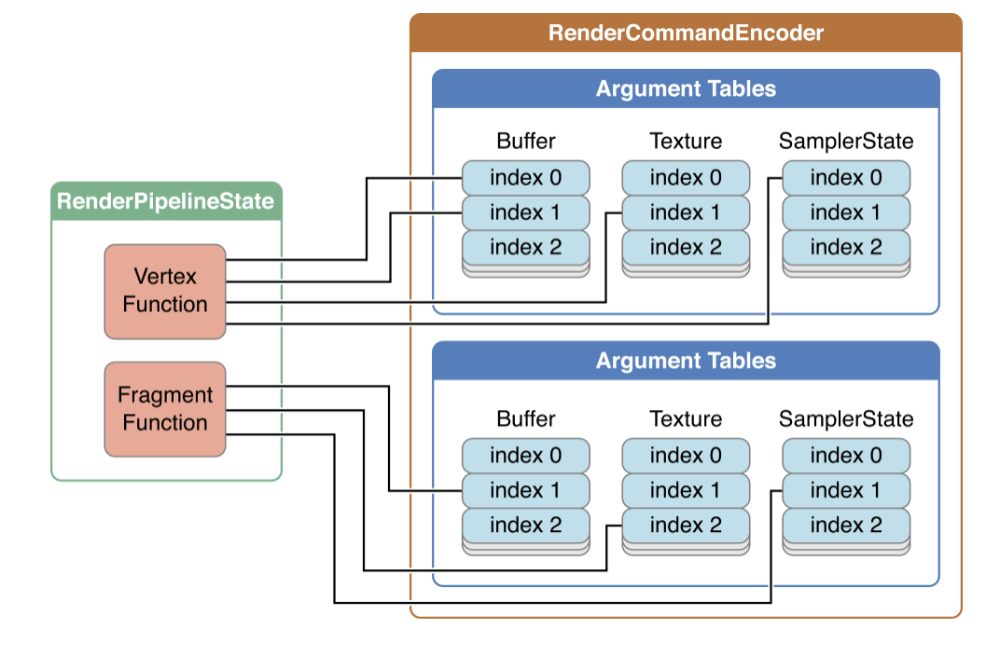

> The following setVertex* methods assign one or more resources to corresponding arguments of a vertex shader function.
>
> - [setVertexBuffer:offset:atIndex:](https://developer.apple.com/documentation/metal/mtlrendercommandencoder/1515829-setvertexbuffer)
> - [setVertexBuffers:offsets:withRange:](https://developer.apple.com/documentation/metal/mtlrendercommandencoder/1515987-setvertexbuffers)
> - [setVertexTexture:atIndex:](https://developer.apple.com/documentation/metal/mtlrendercommandencoder/1515842-setvertextexture)
> - [setVertexTextures:withRange:](https://developer.apple.com/documentation/metal/mtlrendercommandencoder/1516109-setvertextextures)
> - [setVertexSamplerState:atIndex:](https://developer.apple.com/documentation/metal/mtlrendercommandencoder/1515537-setvertexsamplerstate)
> - [setVertexSamplerState:lodMinClamp:lodMaxClamp:atIndex:](https://developer.apple.com/documentation/metal/mtlrendercommandencoder/1515864-setvertexsamplerstate)
> - [setVertexSamplerStates:withRange:](https://developer.apple.com/documentation/metal/mtlrendercommandencoder/1515400-setvertexsamplerstates)
> - [setVertexSamplerStates:lodMinClamps:lodMaxClamps:withRange:](https://developer.apple.com/documentation/metal/mtlrendercommandencoder/1516322-setvertexsamplerstates)
>
> These setFragment* methods similarly assign one or more resources to corresponding arguments of a fragment shader function.
>
> - [setFragmentBuffer:offset:atIndex:](https://developer.apple.com/documentation/metal/mtlrendercommandencoder/1515470-setfragmentbuffer)
> - [setFragmentBuffers:offsets:withRange:](https://developer.apple.com/documentation/metal/mtlrendercommandencoder/1515724-setfragmentbuffers)
> - [setFragmentTexture:atIndex:](https://developer.apple.com/documentation/metal/mtlrendercommandencoder/1515390-setfragmenttexture)
> - [setFragmentTextures:withRange:](https://developer.apple.com/documentation/metal/mtlrendercommandencoder/1515878-setfragmenttextures)
> - [setFragmentSamplerState:atIndex:](https://developer.apple.com/documentation/metal/mtlrendercommandencoder/1515577-setfragmentsamplerstate)
> - [setFragmentSamplerState:lodMinClamp:lodMaxClamp:atIndex:](https://developer.apple.com/documentation/metal/mtlrendercommandencoder/1515485-setfragmentsamplerstate)
> - [setFragmentSamplerStates:withRange:](https://developer.apple.com/documentation/metal/mtlrendercommandencoder/1515970-setfragmentsamplerstates)
> - [setFragmentSamplerStates:lodMinClamps:lodMaxClamps:withRange:](https://developer.apple.com/documentation/metal/mtlrendercommandencoder/1515463-setfragmentsamplerstates)

以下 setVertex* 方法将一个或多个资源分配给顶点着色器函数的相应参数。

- [setVertexBuffer:offset:atIndex:](https://developer.apple.com/documentation/metal/mtlrendercommandencoder/1515829-setvertexbuffer)
- [setVertexBuffers:offsets:withRange:](https://developer.apple.com/documentation/metal/mtlrendercommandencoder/1515987-setvertexbuffers)
- [setVertexTexture:atIndex:](https://developer.apple.com/documentation/metal/mtlrendercommandencoder/1515842-setvertextexture)
- [setVertexTextures:withRange:](https://developer.apple.com/documentation/metal/mtlrendercommandencoder/1516109-setvertextextures)
- [setVertexSamplerState:atIndex:](https://developer.apple.com/documentation/metal/mtlrendercommandencoder/1515537-setvertexsamplerstate)
- [setVertexSamplerState:lodMinClamp:lodMaxClamp:atIndex:](https://developer.apple.com/documentation/metal/mtlrendercommandencoder/1515864-setvertexsamplerstate)
- [setVertexSamplerStates:withRange:](https://developer.apple.com/documentation/metal/mtlrendercommandencoder/1515400-setvertexsamplerstates)
- [setVertexSamplerStates:lodMinClamps:lodMaxClamps:withRange:](https://developer.apple.com/documentation/metal/mtlrendercommandencoder/1516322-setvertexsamplerstates)

以下 setFragment* 方法类似地将一个或多个资源分配给片段着色器函数的相应参数。

- [setFragmentBuffer:offset:atIndex:](https://developer.apple.com/documentation/metal/mtlrendercommandencoder/1515470-setfragmentbuffer)
- [setFragmentBuffers:offsets:withRange:](https://developer.apple.com/documentation/metal/mtlrendercommandencoder/1515724-setfragmentbuffers)
- [setFragmentTexture:atIndex:](https://developer.apple.com/documentation/metal/mtlrendercommandencoder/1515390-setfragmenttexture)
- [setFragmentTextures:withRange:](https://developer.apple.com/documentation/metal/mtlrendercommandencoder/1515878-setfragmenttextures)
- [setFragmentSamplerState:atIndex:](https://developer.apple.com/documentation/metal/mtlrendercommandencoder/1515577-setfragmentsamplerstate)
- [setFragmentSamplerState:lodMinClamp:lodMaxClamp:atIndex:](https://developer.apple.com/documentation/metal/mtlrendercommandencoder/1515485-setfragmentsamplerstate)
- [setFragmentSamplerStates:withRange:](https://developer.apple.com/documentation/metal/mtlrendercommandencoder/1515970-setfragmentsamplerstates)
- [setFragmentSamplerStates:lodMinClamps:lodMaxClamps:withRange:](https://developer.apple.com/documentation/metal/mtlrendercommandencoder/1515463-setfragmentsamplerstates)

> There are a maximum of 31 entries in the buffer argument table, 31 entries in the texture argument table, and 16 entries in the sampler state argument table.
>
> The attribute qualifiers that specify resource locations in the Metal shading language source code must match the argument table indices in the Metal framework methods. In Listing 5-7, two buffers (posBuf and texCoordBuf) with indices 0 and 1, respectively, are defined for the vertex shader.

缓冲区参数表中最多有 31 个条目，纹理参数表最多有 31 个条目，采样器状态参数表中最多有 16 个条目。

Metal 着色语言源代码中指定资源位置的属性限定符必须与 Metal 框架方法中参数表的索引匹配。清单 5-7 中，为顶点着色器定义了两个索引分别为 0 和 1 的缓冲区（ posBuf 和 texCoordBuf ）。

Listing 5-7  Metal 框架：为顶点函数指定资源

```objc
[renderEnc setVertexBuffer:posBuf offset:0 atIndex:0];
[renderEnc setVertexBuffer:texCoordBuf offset:0 atIndex:1]
```

> In Listing 5-8, the function signature has corresponding arguments with the attribute qualifiers buffer(0) and buffer(1).
>
> Listing 5-8  Metal Shading Language: Vertex Function Arguments Match the Framework Argument Table Indices


清单 5-8 中，函数签名具有属性限定符 buffer(0) 和 buffer(1) 的相关参数。

清单 5-8 Metal 着色语言：顶点函数参数匹配框架参数表索引

```objc
vertex VertexOutput metal_vert(float4 *posData [[ buffer(0) ]],
    float2 *texCoordData [[ buffer(1) ]])
```

> Similarly, in Listing 5-9, a buffer, a texture, and a sampler (fragmentColorBuf, shadeTex, and sampler, respectively), all with index 0, are defined for the fragment shader.
>
> Listing 5-9  Metal Framework: Specifying Resources for a Fragment Function

类似的，清单 5-9 中，为片段着色器定义了索引均为 0 的缓冲区、纹理和采样器（ fragmentColorBuf、shadeTex 和 sampler）。

清单 5-9 Metal 框架：为片段着色器指定资源

```objc
[renderEnc setFragmentBuffer:fragmentColorBuf offset:0 atIndex:0];
[renderEnc setFragmentTexture:shadeTex atIndex:0];
[renderEnc setFragmentSamplerState:sampler atIndex:0];
```

> In Listing 5-10, the function signature has corresponding arguments with the attribute qualifiers buffer(0), texture(0), and sampler(0), respectively.
>
> Listing 5-10  Metal Shading Language: Fragment Function Arguments Match the Framework Argument Table Indices

清单 5-10 中，函数签名分别具有带有属性限定符 buffer(0) 、texture(0) 和 sampler(0) 的对应参数。

清单 5-10 Metal 着色语言：片段函数参数匹配框架参数表索引

```objc
fragment float4 metal_frag(VertexOutput in [[stage_in]],
float4 *fragColorData [[ buffer(0) ]],
texture2d<float> shadeTexValues [[ texture(0) ]],
sampler samplerValues [[ sampler(0) ]] )
```

#### Vertex Descriptor for Data Organization - 顶点描述符描述数据组织

> In Metal framework code, there can be one [MTLVertexDescriptor](https://developer.apple.com/documentation/metal/mtlvertexdescriptor) for every pipeline state that describes the organization of data input to the vertex shader function and shares resource location information between the shading language and framework code.
>
> In Metal shading language code, per-vertex inputs (such as scalars or vectors of integer or floating-point values) can be organized in one struct, which can be passed in one argument that is declared with the [[ stage_in ]] attribute qualifier, as seen in the VertexInput struct for the example vertex function vertexMath in Listing 5-11. Each field of the per-vertex input struct has the [[ attribute(index) ]] qualifier, which specifies the index in the vertex attribute argument table.
>
> Listing 5-11  Metal Shading Language: Vertex Function Inputs with Attribute Indices

在 Metal 框架代码中，每个管道状态可以有一个 [MTLVertexDescriptor](https://developer.apple.com/documentation/metal/mtlvertexdescriptor) ，用于描述输入到顶点着色器函数的数据的组织形式，并在着色语言和框架代码之间共享资源位置信息。

在 Metal 着色语言代码中，每个顶点输入（例如标量或整数向量或浮点数向量）可以组织在一个结构体中，该结构可以传递到带有 [[ stage_in ]] 属性限定符声明的一个参数中，如清单 5-11 中示例顶点函数 vertexMath 的 VertexInput 结构。顶点输入结构体的每个字段都有 [[ attribute(index) ]] 限定符，指定顶点属性参数表中的索引。

清单 5-11 Metal 着色语言：带属性索引顶点函数输入

```objc
struct VertexInput {
    float2    position [[ attribute(0) ]];
    float4    color    [[ attribute(1) ]];
    float2    uv1      [[ attribute(2) ]];
    float2    uv2      [[ attribute(3) ]];
};

struct VertexOutput {
    float4 pos [[ position ]];
    float4 color;
};

vertex VertexOutput vertexMath(VertexInput in [[ stage_in ]])
{
    VertexOutput out;
    out.pos = float4(in.position.x, in.position.y, 0.0, 1.0);

    float sum1 = in.uv1.x + in.uv2.x;
    float sum2 = in.uv1.y + in.uv2.y;
    out.color = in.color + float4(sum1, sum2, 0.0f, 0.0f);
    return out;
}
```
> To refer to the shader function input using the [[ stage_in ]] qualifier, describe a [MTLVertexDescriptor](https://developer.apple.com/documentation/metal/mtlvertexdescriptor) object and then set it as the [vertexDescriptor](https://developer.apple.com/documentation/metal/mtlrenderpipelinedescriptor/1514681-vertexdescriptor) property of [MTLRenderPipelineState](https://developer.apple.com/documentation/metal/mtlrenderpipelinestate). MTLVertexDescriptor has two properties: [attributes](https://developer.apple.com/documentation/metal/mtlvertexdescriptor/1515921-attributes) and [layouts](https://developer.apple.com/documentation/metal/mtlvertexdescriptor/1515480-layouts).
>
> The [attributes](https://developer.apple.com/documentation/metal/mtlvertexdescriptor/1515921-attributes) property of MTLVertexDescriptor is a [MTLVertexAttributeDescriptorArray](https://developer.apple.com/documentation/metal/mtlvertexattributedescriptorarray) object that defines how each vertex attribute is organized in a buffer that is mapped to a vertex function argument. The attributes property can support access to multiple attributes (such as vertex coordinates, surface normals, and texture coordinates) that are interleaved within the same buffer. The order of the members in the shading language code does not have to be preserved in the buffer in the framework code. Each vertex attribute descriptor in the array has the following properties that provide a vertex shader function information to locate and load the argument data:
>
> - [bufferIndex](https://developer.apple.com/documentation/metal/mtlvertexattributedescriptor/1515502-bufferindex), which is an index to the buffer argument table that specifies which MTLBuffer is accessed. The buffer argument table is discussed in [Specifying Resources for a Render Command Encoder](https://developer.apple.com/library/archive/documentation/Miscellaneous/Conceptual/MetalProgrammingGuide/Render-Ctx/Render-Ctx.html#//apple_ref/doc/uid/TP40014221-CH7-SW10).
> - [format](https://developer.apple.com/documentation/metal/mtlvertexattributedescriptor/1516081-format), which specifies how the data should be interpreted in the framework code. If the data type is not an exact type match, it may be converted or expanded. For example, if the shading language type is half4 and the framework format is [MTLVertexFormatFloat2](https://developer.apple.com/documentation/metal/mtlvertexformat/float2), then when the data is used as an argument to the vertex function, it may be converted from float to half and expanded from two to four elements (with 0.0, 1.0 in the last two elements).
> - [offset](https://developer.apple.com/documentation/metal/mtlvertexattributedescriptor/1515785-offset), which specifies where the data can be found from the start of a vertex.
>
> Figure 5-4 illustrates a [MTLVertexAttributeDescriptorArray](https://developer.apple.com/documentation/metal/mtlvertexattributedescriptorarray) in Metal framework code that implements an interleaved buffer that corresponds to the input to the vertex function vertexMath in the shading language code in [Listing 5-11](https://developer.apple.com/library/archive/documentation/Miscellaneous/Conceptual/MetalProgrammingGuide/Render-Ctx/Render-Ctx.html#//apple_ref/doc/uid/TP40014221-CH7-SW41).

Figure 5-4  Buffer Organization with Vertex Attribute Descriptors

要引用使用 [[ stage_in ]] 限定符的着色函数输入，需要描述一个 [MTLVertexDescriptor](https://developer.apple.com/documentation/metal/mtlvertexdescriptor) 对象，然后把它设置为 [MTLRenderPipelineState](https://developer.apple.com/documentation/metal/mtlrenderpipelinestate) 的[vertexDescriptor](https://developer.apple.com/documentation/metal/mtlrenderpipelinedescriptor/1514681-vertexdescriptor) 属性。MTLVertexDescriptor 有两个属性： [attributes](https://developer.apple.com/documentation/metal/mtlvertexdescriptor/1515921-attributes) 和 [layouts](https://developer.apple.com/documentation/metal/mtlvertexdescriptor/1515480-layouts) 。

MTLVertexDescriptor 的 [attributes](https://developer.apple.com/documentation/metal/mtlvertexdescriptor/1515921-attributes) 属性是一个 [MTLVertexAttributeDescriptorArray](https://developer.apple.com/documentation/metal/mtlvertexattributedescriptorarray) 对象，定义了映射到顶点函数参数的缓冲区中的顶点属性是如何组织的。attributes 属性支持访问在同一缓冲区中交错的多个属性（例如顶点坐标、表面法线和纹理坐标）。着色语言代码中成员的顺序不必与框架代码缓冲区中顺序一致。数组中的每个顶点属性描述符都具有以下属性，这些属性提供顶点着色器函数信息以定位和加载参数数据。

- [bufferIndex](https://developer.apple.com/documentation/metal/mtlvertexattributedescriptor/1515502-bufferindex) ，缓冲区参数表中的索引，用于指定访问哪个 MTLBuffer 。缓冲区参数表在 [Specifying Resources for a Render Command Encoder](https://developer.apple.com/library/archive/documentation/Miscellaneous/Conceptual/MetalProgrammingGuide/Render-Ctx/Render-Ctx.html#//apple_ref/doc/uid/TP40014221-CH7-SW10) 中讨论。
- [format](https://developer.apple.com/documentation/metal/mtlvertexattributedescriptor/1516081-format) ，指定如何在框架代码中解释数据。如果数据类型不是精确类型匹配，数据会被转换或扩展。例如，如果着色语言类型为 half4同时框架格式是 [MTLVertexFormatFloat2](https://developer.apple.com/documentation/metal/mtlvertexformat/float2) ，那么当数据用作顶点函数的参数时，它可能从浮点数转换为 half ，也可能从两个元素扩展为四个元素（最后两个元素填充 0.0 和 1.0）。
- [offset](https://developer.apple.com/documentation/metal/mtlvertexattributedescriptor/1515785-offset) 指定从顶点的开头可以找到数据的位置。

图 5-4 说明了 Metal 框架代码中的 [MTLVertexAttributeDescriptorArray](https://developer.apple.com/documentation/metal/mtlvertexattributedescriptorarray) ，实现了一个交错缓冲区，该缓冲区对应于清单 5-11 中着色语言代码中顶点函数 vertexMath 的输入。

图 5-4 具有顶点属性描述符的缓冲区组织

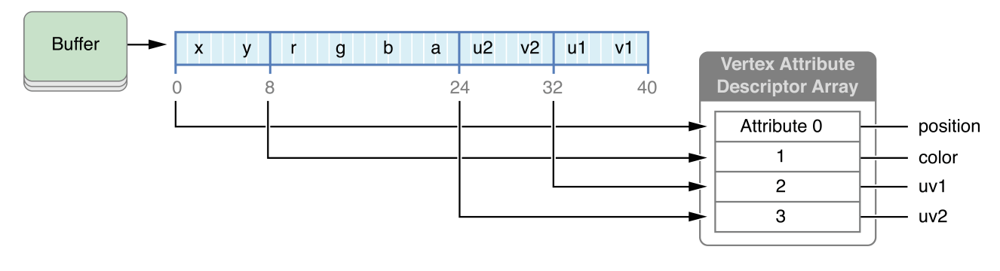

> Listing 5-12 shows the Metal framework code that corresponds to the interleaved buffer shown in Figure 5-4.
>
> Listing 5-12  Metal Framework: Using a Vertex Descriptor to Access Interleaved Data

清单 5-12 显示了图 5-4 中所示的交错缓冲区相对应的 Metal 框架代码。

清单 5-12 Metal 框架：使用顶点描述符访问交错数据

```objc
id <MTLFunction> vertexFunc = [library newFunctionWithName:@"vertexMath"];            
MTLRenderPipelineDescriptor* pipelineDesc =      
 [[MTLRenderPipelineDescriptor alloc] init];
MTLVertexDescriptor* vertexDesc = [[MTLVertexDescriptor alloc] init];

vertexDesc.attributes[0].format = MTLVertexFormatFloat2;
vertexDesc.attributes[0].bufferIndex = 0;
vertexDesc.attributes[0].offset = 0;
vertexDesc.attributes[1].format = MTLVertexFormatFloat4;
vertexDesc.attributes[1].bufferIndex = 0;
vertexDesc.attributes[1].offset = 2 * sizeof(float);  // 8 bytes
vertexDesc.attributes[2].format = MTLVertexFormatFloat2;
vertexDesc.attributes[2].bufferIndex = 0;
vertexDesc.attributes[2].offset = 8 * sizeof(float);  // 32 bytes
vertexDesc.attributes[3].format = MTLVertexFormatFloat2;
vertexDesc.attributes[3].bufferIndex = 0;
vertexDesc.attributes[3].offset = 6 * sizeof(float);  // 24 bytes
vertexDesc.layouts[0].stride = 10 * sizeof(float);    // 40 bytes
vertexDesc.layouts[0].stepFunction = MTLVertexStepFunctionPerVertex;

pipelineDesc.vertexDescriptor = vertexDesc;
pipelineDesc.vertexFunction = vertFunc;
```

> Each [MTLVertexAttributeDescriptor](https://developer.apple.com/documentation/metal/mtlvertexattributedescriptor) object in the [attributes](https://developer.apple.com/documentation/metal/mtlvertexdescriptor/1515921-attributes) array of the [MTLVertexDescriptor](https://developer.apple.com/documentation/metal/mtlvertexdescriptor) object corresponds to the indexed struct member in VertexInput in the shader function. attributes[1].bufferIndex = 0 specifies the use of the buffer at index 0 in the argument table. (In this example, each [MTLVertexAttributeDescriptor](https://developer.apple.com/documentation/metal/mtlvertexattributedescriptor) has the same [bufferIndex](https://developer.apple.com/documentation/metal/mtlvertexattributedescriptor/1515502-bufferindex), so each refers to the same vertex buffer at index 0 in the argument table.) The [offset](https://developer.apple.com/documentation/metal/mtlvertexattributedescriptor/1515785-offset) values specify the location of data within the vertex, so attributes[1].offset = 2 * sizeof(float) locates the start of the corresponding data 8 bytes from the start of the buffer. The [format](https://developer.apple.com/documentation/metal/mtlvertexattributedescriptor/1516081-format) values are chosen to match the data type in the shader function, so attributes[1].format = MTLVertexFormatFloat4 specifies the use of four floating-point values.
>
> The [layouts](https://developer.apple.com/documentation/metal/mtlvertexdescriptor/1515480-layouts) property of MTLVertexDescriptor is a [MTLVertexBufferLayoutDescriptorArray](https://developer.apple.com/documentation/metal/mtlvertexbufferlayoutdescriptorarray). For each [MTLVertexBufferLayoutDescriptor](https://developer.apple.com/documentation/metal/mtlvertexbufferlayoutdescriptor) in [layouts](https://developer.apple.com/documentation/metal/mtlvertexdescriptor/1515480-layouts), the properties specify how vertex and attribute data are fetched from the corresponding [MTLBuffer](https://developer.apple.com/documentation/metal/mtlbuffer) in the argument table when Metal draws primitives. (For more on drawing primitives, see [Drawing Geometric Primitives](https://developer.apple.com/library/archive/documentation/Miscellaneous/Conceptual/MetalProgrammingGuide/Render-Ctx/Render-Ctx.html#//apple_ref/doc/uid/TP40014221-CH7-SW39).) The [stepFunction](https://developer.apple.com/documentation/metal/mtlvertexbufferlayoutdescriptor/1515341-stepfunction) property of MTLVertexBufferLayoutDescriptor determines whether to fetch attribute data for every vertex, for some number of instances, or just once. If stepFunction is set to fetch attribute data for some number of instances, then the [stepRate](https://developer.apple.com/documentation/metal/mtlvertexbufferlayoutdescriptor/1516148-steprate) property of MTLVertexBufferLayoutDescriptor determines how many instances. The [stride](https://developer.apple.com/documentation/metal/mtlvertexbufferlayoutdescriptor/1515441-stride) property specifies the distance between the data of two vertices, in bytes.
>
> Figure 5-5 depicts the [MTLVertexBufferLayoutDescriptor](https://developer.apple.com/documentation/metal/mtlvertexbufferlayoutdescriptor) that corresponds to the code in [Listing 5-12](https://developer.apple.com/library/archive/documentation/Miscellaneous/Conceptual/MetalProgrammingGuide/Render-Ctx/Render-Ctx.html#//apple_ref/doc/uid/TP40014221-CH7-SW43). layouts[0] specifies how vertex data is fetched from corresponding index 0 in the buffer argument table. layouts[0].stride specifies a distance of 40 bytes between the data of two vertices. The value of layouts[0].stepFunction, [MTLVertexStepFunctionPerVertex](https://developer.apple.com/documentation/metal/mtlvertexstepfunction/pervertex), specifies that attribute data is fetched for every vertex when drawing. If the value of stepFunction is [MTLVertexStepFunctionPerInstance](https://developer.apple.com/documentation/metal/mtlvertexstepfunction/perinstance), the stepRate property determines how often attribute data is fetched. For example, if stepRate is 1, data is fetched for every instance; if stepRate is 2, for every two instances, and so on.
>
> Figure 5-5  Buffer Organization with Vertex Buffer Layout Descriptors

 [MTLVertexDescriptor](https://developer.apple.com/documentation/metal/mtlvertexdescriptor) 对象的 [attributes](https://developer.apple.com/documentation/metal/mtlvertexdescriptor/1515921-attributes) 数组中的每个 [MTLVertexAttributeDescriptor](https://developer.apple.com/documentation/metal/mtlvertexattributedescriptor) 对象对应于着色器函数中 VertexInput 中的索引结构成员。attributes[1].bufferIndex = 0 指定使用参数表中索引 0 的缓冲区（此例中，每个 [MTLVertexAttributeDescriptor](https://developer.apple.com/documentation/metal/mtlvertexattributedescriptor) 具有相同的 bufferIndex ，因此每个引用参数表中索引 0 处相同的缓冲区）。[offset](https://developer.apple.com/documentation/metal/mtlvertexattributedescriptor/1515785-offset) 指定顶点内数据的位置，因此 attributes[1].offset = 2 * sizeof(float) 定位相关数据的起始为缓冲区起始处 8 个字节。[format](https://developer.apple.com/documentation/metal/mtlvertexattributedescriptor/1516081-format) 值与着色器函数中的数据类型相匹配，因此 attributes[1].format = MTLVertexFormatFloat4 指定使用 4 个浮点值。
 
 MTLVertexDescriptor 的 [layouts](https://developer.apple.com/documentation/metal/mtlvertexdescriptor/1515480-layouts) 属性是 [MTLVertexBufferLayoutDescriptorArray](https://developer.apple.com/documentation/metal/mtlvertexbufferlayoutdescriptorarray) 。[layouts](https://developer.apple.com/documentation/metal/mtlvertexdescriptor/1515480-layouts) 中的每个 [MTLVertexBufferLayoutDescriptor](https://developer.apple.com/documentation/metal/mtlvertexbufferlayoutdescriptor) ，属性指定当 Metal 绘制图元时如何从参数表中的相应 [MTLBuffer](https://developer.apple.com/documentation/metal/mtlbuffer) 中获取顶点和属性数据。（关于绘制图元的更多信息，参见  [Drawing Geometric Primitives](https://developer.apple.com/library/archive/documentation/Miscellaneous/Conceptual/MetalProgrammingGuide/Render-Ctx/Render-Ctx.html#//apple_ref/doc/uid/TP40014221-CH7-SW39) ）。MTLVertexBufferLayoutDescriptor 的 [stepFunction](https://developer.apple.com/documentation/metal/mtlvertexbufferlayoutdescriptor/1515341-stepfunction) 属性确定是否为每个顶点、某些实例获取属性数据，还是仅获取一次。如果 stepFunction 设置为获取某些实例的属性数据，MTLVertexBufferLayoutDescriptor 的 [stepRate](https://developer.apple.com/documentation/metal/mtlvertexbufferlayoutdescriptor/1516148-steprate) 属性确定实例数量。[stride](https://developer.apple.com/documentation/metal/mtlvertexbufferlayoutdescriptor/1515441-stride) 属性指定两个顶点数据之间的距离（以字节为单位）。
 
 图 5-5 描述了 [MTLVertexBufferLayoutDescriptor](https://developer.apple.com/documentation/metal/mtlvertexbufferlayoutdescriptor) ，对应于 [Listing 5-12](https://developer.apple.com/library/archive/documentation/Miscellaneous/Conceptual/MetalProgrammingGuide/Render-Ctx/Render-Ctx.html#//apple_ref/doc/uid/TP40014221-CH7-SW43) 中的代码。layouts[0] 指定如何从缓冲区参数表中的相应索引 0 获取顶点数据。layouts[0].stride 指定两个顶点数据之间的距离为 40 个字节。layouts[0].stepFunction 的值，[MTLVertexStepFunctionPerVertex](https://developer.apple.com/documentation/metal/mtlvertexstepfunction/pervertex) ，指定在绘制时为每个顶点数据提取属性数据。若 stepFunction 的值为 [MTLVertexStepFunctionPerInstance](https://developer.apple.com/documentation/metal/mtlvertexstepfunction/perinstance) ，则 stepRate 属性决定获取属性数据的频率。例如，若 stepRate 为 1 ，则为每个实例提取数据；若 stepRate 为 2 ，则每两个实例，以此类推。

图 5-5 具有顶点缓冲区布局描述符的缓冲区组织

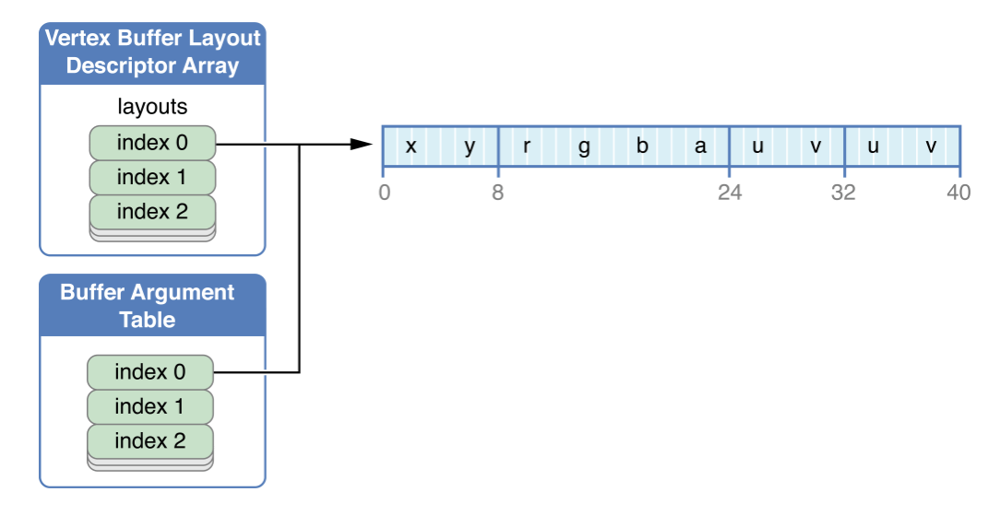

### Performing Fixed-Function Render Command Encoder Operations - 执行固定功能渲染命令编码器操作

> Use these [MTLRenderCommandEncoder](https://developer.apple.com/documentation/metal/mtlrendercommandencoder) methods to set fixed-function graphics state values:
>
> - [setViewport:](https://developer.apple.com/documentation/metal/mtlrendercommandencoder/1515527-setviewport) specifies the region, in screen coordinates, which is the destination for the projection of the virtual 3D world. The viewport is 3D, so it includes depth values; for details, see [Working with Viewport and Pixel Coordinate Systems](https://developer.apple.com/library/archive/documentation/Miscellaneous/Conceptual/MetalProgrammingGuide/Render-Ctx/Render-Ctx.html#//apple_ref/doc/uid/TP40014221-CH7-SW34).
> - [setTriangleFillMode:](https://developer.apple.com/documentation/metal/mtlrendercommandencoder/1516029-settrianglefillmode) determines whether to rasterize triangle and triangle strip primitives with lines ([MTLTriangleFillModeLines](https://developer.apple.com/documentation/metal/mtltrianglefillmode/lines)) or as filled triangles ([MTLTriangleFillModeFill](https://developer.apple.com/documentation/metal/mtltrianglefillmode/fill)). The default value is MTLTriangleFillModeFill.
> - [setCullMode:](https://developer.apple.com/documentation/metal/mtlrendercommandencoder/1515975-setcullmode) and [setFrontFacingWinding:](https://developer.apple.com/documentation/metal/mtlrendercommandencoder/1515499-setfrontfacingwinding) are used together to determine if and how culling is applied. You can use culling for hidden surface removal on some geometric models, such as an orientable sphere rendered with filled triangles. (A surface is orientable if its primitives are consistently drawn in either clockwise or counterclockwise order.)
   > - The value of [setFrontFacingWinding:](https://developer.apple.com/documentation/metal/mtlrendercommandencoder/1515499-setfrontfacingwinding) indicates whether a front-facing primitive has its vertices drawn in clockwise ([MTLWindingClockwise](https://developer.apple.com/documentation/metal/mtlwinding/mtlwindingclockwise)) or counterclockwise ([MTLWindingCounterClockwise](https://developer.apple.com/documentation/metal/mtlwinding/mtlwindingcounterclockwise)) order. The default value is MTLWindingClockwise.
   > - The value of [setCullMode:](https://developer.apple.com/documentation/metal/mtlrendercommandencoder/1515975-setcullmode) determines whether to perform culling ([MTLCullModeNone](https://developer.apple.com/documentation/metal/mtlcullmode/mtlcullmodenone), if culling disabled) or which type of primitive to cull ([MTLCullModeFront](https://developer.apple.com/documentation/metal/mtlcullmode/front) or [MTLCullModeBack](https://developer.apple.com/documentation/metal/mtlcullmode/mtlcullmodeback)).
   
使用 [MTLRenderCommandEncoder](https://developer.apple.com/documentation/metal/mtlrendercommandencoder) 的这些方法设置固定功能图形状态值：

- [setViewport:](https://developer.apple.com/documentation/metal/mtlrendercommandencoder/1515527-setviewport) 指定屏幕坐标系的一个区域，该区域是虚拟 3D 世界投影的目的地。viewPort 是 3D 的，所以它包含深度值，更多细节，见 [Working with Viewport and Pixel Coordinate Systems](https://developer.apple.com/library/archive/documentation/Miscellaneous/Conceptual/MetalProgrammingGuide/Render-Ctx/Render-Ctx.html#//apple_ref/doc/uid/TP40014221-CH7-SW34) 。
- [setTriangleFillMode:](https://developer.apple.com/documentation/metal/mtlrendercommandencoder/1516029-settrianglefillmode) 确定是否使用直线（[MTLTriangleFillModeLines](https://developer.apple.com/documentation/metal/mtltrianglefillmode/lines)）或者填充三角形（[MTLTriangleFillModeFill](https://developer.apple.com/documentation/metal/mtltrianglefillmode/fill)）光栅化三角形和三角形条带图元。默认值为 MTLTriangleFillModeFill 。
- [setCullMode:](https://developer.apple.com/documentation/metal/mtlrendercommandencoder/1515975-setcullmode) 和 [setFrontFacingWinding:](https://developer.apple.com/documentation/metal/mtlrendercommandencoder/1515499-setfrontfacingwinding) 组合使用来决定是否以及如何应用剔除。你可以在某些几何模型上使用剔除隐藏要去除的面，例如，使用实心三角形渲染的可定向球体。（如果其图元始终以顺时针或逆时针顺序绘制，则其表面是可定向的）。
   - [setFrontFacingWinding:](https://developer.apple.com/documentation/metal/mtlrendercommandencoder/1515499-setfrontfacingwinding) 值指示正面图元是以顺时针（ [MTLWindingClockwise](https://developer.apple.com/documentation/metal/mtlwinding/mtlwindingclockwise) ）还是逆时针（ ([MTLWindingCounterClockwise](https://developer.apple.com/documentation/metal/mtlwinding/mtlwindingcounterclockwise))）的顺序绘制顶点。默认值为 MTLWindingClockwise 。
   - [setCullMode:](https://developer.apple.com/documentation/metal/mtlrendercommandencoder/1515975-setcullmode) 值决定是否执行剔除（如果禁用剔除，值为 [MTLCullModeNone](https://developer.apple.com/documentation/metal/mtlcullmode/mtlcullmodenone) ）或者要剔除哪种类型的图元（[MTLCullModeFront](https://developer.apple.com/documentation/metal/mtlcullmode/front) 或 [MTLCullModeBack](https://developer.apple.com/documentation/metal/mtlcullmode/mtlcullmodeback)）。

> Use the following [MTLRenderCommandEncoder](https://developer.apple.com/documentation/metal/mtlrendercommandencoder) methods to encode fixed-function state change commands:
>
> - [setScissorRect:](https://developer.apple.com/documentation/metal/mtlrendercommandencoder/1515583-setscissorrect) specifies a 2D scissor rectangle. Fragments that lie outside the specified scissor rectangle are discarded.
> - [setDepthStencilState:](https://developer.apple.com/documentation/metal/mtlrendercommandencoder/1516119-setdepthstencilstate) sets the depth and stencil test state as described in [Depth and Stencil States](https://developer.apple.com/library/archive/documentation/Miscellaneous/Conceptual/MetalProgrammingGuide/Render-Ctx/Render-Ctx.html#//apple_ref/doc/uid/TP40014221-CH7-SW9).
> - [setStencilReferenceValue:](https://developer.apple.com/documentation/metal/mtlrendercommandencoder/1515697-setstencilreferencevalue) specifies the stencil reference value.
> - [setDepthBias:slopeScale:clamp:](https://developer.apple.com/documentation/metal/mtlrendercommandencoder/1516269-setdepthbias) specifies an adjustment for comparing shadow maps to the depth values output from fragment shaders.
> - [setVisibilityResultMode:offset:](https://developer.apple.com/documentation/metal/mtlrendercommandencoder/1515556-setvisibilityresultmode) determines whether to monitor if any samples pass the depth and stencil tests. If set to [MTLVisibilityResultModeBoolean](https://developer.apple.com/documentation/metal/mtlvisibilityresultmode/boolean), then if any samples pass the depth and stencil tests, a non-zero value is written to a buffer specified by the [visibilityResultBuffer](https://developer.apple.com/documentation/metal/mtlrenderpassdescriptor/1437942-visibilityresultbuffer) property of [MTLRenderPassDescriptor](https://developer.apple.com/documentation/metal/mtlrenderpassdescriptor), as described in [Creating a Render Pass Descriptor](https://developer.apple.com/library/archive/documentation/Miscellaneous/Conceptual/MetalProgrammingGuide/Render-Ctx/Render-Ctx.html#//apple_ref/doc/uid/TP40014221-CH7-SW5).
>
>   You can use this mode to perform occlusion testing. If you draw a bounding box and no samples pass, then you may conclude that any objects within that bounding box are occluded and thus do not require rendering.
>
> - [setBlendColorRed:green:blue:alpha:](https://developer.apple.com/documentation/metal/mtlrendercommandencoder/1515592-setblendcolorred) specifies the constant blend color and alpha values, as detailed in [Configuring Blending in a Render Pipeline Attachment Descriptor](https://developer.apple.com/library/archive/documentation/Miscellaneous/Conceptual/MetalProgrammingGuide/Render-Ctx/Render-Ctx.html#//apple_ref/doc/uid/TP40014221-CH7-SW22).


使用 [MTLRenderCommandEncoder](https://developer.apple.com/documentation/metal/mtlrendercommandencoder) 的以下方法编码固定功能状态更改命令：

- [setScissorRect:](https://developer.apple.com/documentation/metal/mtlrendercommandencoder/1515583-setscissorrect) 指定 2D 裁剪矩形区域。位于指定区域外的片段将被丢弃。
- [setDepthStencilState:](https://developer.apple.com/documentation/metal/mtlrendercommandencoder/1516119-setdepthstencilstate) 设置深度和模版测试状态，如 [Depth and Stencil States](https://developer.apple.com/library/archive/documentation/Miscellaneous/Conceptual/MetalProgrammingGuide/Render-Ctx/Render-Ctx.html#//apple_ref/doc/uid/TP40014221-CH7-SW9) 中所述。
- [setStencilReferenceValue:](https://developer.apple.com/documentation/metal/mtlrendercommandencoder/1515697-setstencilreferencevalue) 指定模版参考值。
- [setDepthBias:slopeScale:clamp:](https://developer.apple.com/documentation/metal/mtlrendercommandencoder/1516269-setdepthbias) 指定用于将深度贴图与片段着色器输出的深度值进行比较的调整。
- [setVisibilityResultMode:offset:](https://developer.apple.com/documentation/metal/mtlrendercommandencoder/1515556-setvisibilityresultmode) 决定是否监控样本深度测试和模版测试的结果。如果设置为 [MTLVisibilityResultModeBoolean](https://developer.apple.com/documentation/metal/mtlvisibilityresultmode/boolean) ，则如果任何样本通过深度和模版测试，非零值则会写入由 [MTLRenderPassDescriptor](https://developer.apple.com/documentation/metal/mtlrenderpassdescriptor) 的 [visibilityResultBuffer](https://developer.apple.com/documentation/metal/mtlrenderpassdescriptor/1437942-visibilityresultbuffer) 属性指定的缓冲区中，如 [Creating a Render Pass Descriptor](https://developer.apple.com/library/archive/documentation/Miscellaneous/Conceptual/MetalProgrammingGuide/Render-Ctx/Render-Ctx.html#//apple_ref/doc/uid/TP40014221-CH7-SW5) 中所述。

你可以使用此模式进行遮挡测试。如果绘制边界框并且没有样本通过，则可以得出结论，该边界框内的任何物体都被遮挡，因此不需要渲染。

- [setBlendColorRed:green:blue:alpha:](https://developer.apple.com/documentation/metal/mtlrendercommandencoder/1515592-setblendcolorred) 指定混合颜色和 alpha 常量值，如 [Configuring Blending in a Render Pipeline Attachment Descriptor](https://developer.apple.com/library/archive/documentation/Miscellaneous/Conceptual/MetalProgrammingGuide/Render-Ctx/Render-Ctx.html#//apple_ref/doc/uid/TP40014221-CH7-SW22) 中所述。

#### Working with Viewport and Pixel Coordinate Systems - 使用 Viewport 和像素坐标系

> Metal defines its Normalized Device Coordinate (NDC) system as a 2x2x1 cube with its center at (0, 0, 0.5). The left and bottom for x and y, respectively, of the NDC system are specified as -1. The right and top for x and y, respectively, of the NDC system are specified as +1.
>
> The viewport specifies the transformation from NDC to the window coordinates. The Metal viewport is a 3D transformation specified by the [setViewport:](https://developer.apple.com/documentation/metal/mtlrendercommandencoder/1515527-setviewport) method of [MTLRenderCommandEncoder](https://developer.apple.com/documentation/metal/mtlrendercommandencoder). The origin of the window coordinates is in the upper-left corner.
>
> In Metal, pixel centers are offset by (0.5, 0.5). For example, the pixel at the origin has its center at (0.5, 0.5); the center of the adjacent pixel to its right is (1.5, 0.5). This is also true for textures.

Metal 将其标准设备坐标系（ NDC ）定义为中心位于 (0, 0, 0.5) 的 2x2x1 立方体。NDC 系统的 x 和 y 的左侧和底部分别指定为 -1 。x 和 y 的右侧和顶部分别指定为 +1 。

viewport 指定从 NDC 到窗口坐标系的转换。Metal 的 viewport 是由 [MTLRenderCommandEncoder](https://developer.apple.com/documentation/metal/mtlrendercommandencoder) 的 [setViewport:](https://developer.apple.com/documentation/metal/mtlrendercommandencoder/1515527-setviewport) 方法指定的一个 3D 转换。窗口坐标系的原点位于左上角。

Metal 中像素中心偏移 (0.5, 0.5) 。例如，原点处的像素的中心位于 (0.5, 0.5) ；右边相邻像素的中心s为 (1.5, 0.5) 。纹理也是如此。

#### Performing Depth and Stencil Operations - 执行深度和模版操作

> The depth and stencil operations are fragment operations that you specify as follows:
>
> - Specify a custom [MTLDepthStencilDescriptor](https://developer.apple.com/documentation/metal/mtldepthstencildescriptor) object that contains settings for the depth/stencil state. Creating a custom MTLDepthStencilDescriptor object may require creating one or two [MTLStencilDescriptor](https://developer.apple.com/documentation/metal/mtlstencildescriptor) objects that are applicable to front-facing primitives and back-facing primitives.
> - Create a [MTLDepthStencilState](https://developer.apple.com/documentation/metal/mtldepthstencilstate) object by calling the [newDepthStencilStateWithDescriptor:](https://developer.apple.com/documentation/metal/mtldevice/1433412-makedepthstencilstate) method of MTLDevice with a depth/stencil state descriptor.
> - To set the depth/stencil state, call the [setDepthStencilState:](https://developer.apple.com/documentation/metal/mtlrendercommandencoder/1516119-setdepthstencilstate) method of MTLRenderCommandEncoder with the [MTLDepthStencilState](https://developer.apple.com/documentation/metal/mtldepthstencilstate).
> - If the stencil test is in use, call [setStencilReferenceValue:](https://developer.apple.com/documentation/metal/mtlrendercommandencoder/1515697-setstencilreferencevalue) to specify the stencil reference value.

深度和模版操作是像下面这样指定的片段操作：

- 指定一个自定义的 [MTLDepthStencilDescriptor](https://developer.apple.com/documentation/metal/mtldepthstencildescriptor) 对象，包含深度/模版状态设置。创建一个自定义 MTLDepthStencilDescriptor 对象可能需要创建一个或者两个适用于 front-facing 图元和 back-facing 图源的 [MTLStencilDescriptor](https://developer.apple.com/documentation/metal/mtlstencildescriptor) 。
- 使用深度/模版状态描述符调用 MTLDevice 的 [newDepthStencilStateWithDescriptor:](https://developer.apple.com/documentation/metal/mtldevice/1433412-makedepthstencilstate) 方法创建一个 [MTLDepthStencilState](https://developer.apple.com/documentation/metal/mtldepthstencilstate) 对象。
- 要设置深度/模版状态的话，使用 [MTLDepthStencilState](https://developer.apple.com/documentation/metal/mtldepthstencilstate) 调用 MTLRenderCommandEncoder 的 [setDepthStencilState:](https://developer.apple.com/documentation/metal/mtlrendercommandencoder/1516119-setdepthstencilstate) 方法。
- 如果模版测试正在使用，调用 [setStencilReferenceValue:](https://developer.apple.com/documentation/metal/mtlrendercommandencoder/1515697-setstencilreferencevalue) 指定模版参考值。

> If the depth test is enabled, the render pipeline state must include a depth attachment to support writing the depth value. To perform the stencil test, the render pipeline state must include a stencil attachment. To configure attachments, see [Creating and Configuring a Render Pipeline Descriptor](https://developer.apple.com/library/archive/documentation/Miscellaneous/Conceptual/MetalProgrammingGuide/Render-Ctx/Render-Ctx.html#//apple_ref/doc/uid/TP40014221-CH7-SW40).
>
> If you will be changing the depth/stencil state regularly, then you may want to reuse the state descriptor object, modifying its property values as needed to create more state objects.
>
> Note: To sample from a depth-format texture within a shader function, implement the sampling operation within the shader without using MTLSamplerState.

如果启用了深度测试，渲染管线状态必须包含一个深度附件以支持写入深度值。要执行模版测试，渲染管线状态必须包含一个模版附件。配制 attachments ，参见 [Creating and Configuring a Render Pipeline Descriptor](https://developer.apple.com/library/archive/documentation/Miscellaneous/Conceptual/MetalProgrammingGuide/Render-Ctx/Render-Ctx.html#//apple_ref/doc/uid/TP40014221-CH7-SW40) 。

如果要定期更改深度/模版状态，你可能需要重用状态描述符对象，按需更改其属性值以创建更多状态对象。

注意：要在着色器函数中从深度格式纹理中进行采样，则在着色器中实现采样操作，不要使用 MTLSamplerState 。

> Use the properties of a [MTLDepthStencilDescriptor](https://developer.apple.com/documentation/metal/mtldepthstencildescriptor) object as follows to set the depth and stencil state:
>
> - To enable writing the depth value to the depth attachment, set [depthWriteEnabled](https://developer.apple.com/documentation/metal/mtldepthstencildescriptor/1462501-isdepthwriteenabled) to YES.
> - [depthCompareFunction](https://developer.apple.com/documentation/metal/mtldepthstencildescriptor/1462463-depthcomparefunction) specifies how the depth test is performed. If a fragment’s depth value fails the depth test, the fragment is discarded. For example, the commonly used MTLCompareFunctionLess function causes fragment values that are further away from the viewer than the (previously written) pixel depth value to fail the depth test; that is, the fragment is considered occluded by the earlier depth value.
> - The [frontFaceStencil](https://developer.apple.com/documentation/metal/mtldepthstencildescriptor/1462476-frontfacestencil) and [backFaceStencil](https://developer.apple.com/documentation/metal/mtldepthstencildescriptor/1462507-backfacestencil) properties each specify a separate [MTLStencilDescriptor](https://developer.apple.com/documentation/metal/mtlstencildescriptor) object for front- and back-facing primitives. To use the same stencil state for both front- and back-facing primitives, you can assign the same [MTLStencilDescriptor](https://developer.apple.com/documentation/metal/mtlstencildescriptor) to both [frontFaceStencil](https://developer.apple.com/documentation/metal/mtldepthstencildescriptor/1462476-frontfacestencil) and [backFaceStencil](https://developer.apple.com/documentation/metal/mtldepthstencildescriptor/1462507-backfacestencil) properties. To explicitly disable the stencil test for one or both faces, set the corresponding property to nil, the default value.
>
> Explicit disabling of a stencil state is not necessary. Metal determines whether to enable a stencil test based on whether the stencil descriptor is configured for a valid stencil operation.
>
> [Listing 5-13](https://developer.apple.com/library/archive/documentation/Miscellaneous/Conceptual/MetalProgrammingGuide/Render-Ctx/Render-Ctx.html#//apple_ref/doc/uid/TP40014221-CH7-SW8) shows an example of creation and use of a [MTLDepthStencilDescriptor](https://developer.apple.com/documentation/metal/mtldepthstencildescriptor) object for the creation of a [MTLDepthStencilState](https://developer.apple.com/documentation/metal/mtldepthstencilstate) object, which is then used with a render command encoder. In this example, the stencil state for the front-facing primitives is accessed from the [frontFaceStencil](https://developer.apple.com/documentation/metal/mtldepthstencildescriptor/1462476-frontfacestencil) property of the depth/stencil state descriptor. The stencil test is explicitly disabled for the back-facing primitives.
>
> Listing 5-13  Creating and Using a Depth/Stencil Descriptor

使用 [MTLDepthStencilDescriptor](https://developer.apple.com/documentation/metal/mtldepthstencildescriptor) 对象的属性，如下所示设置深度和模版状态：

- 设置 [depthWriteEnabled](https://developer.apple.com/documentation/metal/mtldepthstencildescriptor/1462501-isdepthwriteenabled) 为 YES 启用深度值写入深度附件。
- [depthCompareFunction](https://developer.apple.com/documentation/metal/mtldepthstencildescriptor/1462463-depthcomparefunction) 指定深度测试的执行方式。若一个片段的深度值未通过深度测试，则丢弃该片段。例如，常用的 MTLCompareFunctionLess 函数会导致比之前写入的像素深度值更原理观察者的片段值深度测试失败；也就是说，该片段被之前的深度值遮挡。
- [frontFaceStencil](https://developer.apple.com/documentation/metal/mtldepthstencildescriptor/1462476-frontfacestencil) 和 [backFaceStencil](https://developer.apple.com/documentation/metal/mtldepthstencildescriptor/1462507-backfacestencil) 属性为 front- 和 back-facing 图元分别指定了 [MTLStencilDescriptor](https://developer.apple.com/documentation/metal/mtlstencildescriptor) 对象。要对 front- 和 back-facing 图元使用相同的模版状态，可以为 [frontFaceStencil](https://developer.apple.com/documentation/metal/mtldepthstencildescriptor/1462476-frontfacestencil) 和 [backFaceStencil](https://developer.apple.com/documentation/metal/mtldepthstencildescriptor/1462507-backfacestencil) 指定同一个 [MTLStencilDescriptor](https://developer.apple.com/documentation/metal/mtlstencildescriptor) 。要显示地禁用一个或两个面的模版测试，将相应的属性值设为 nil （默认值）。

不必显示禁用模版状态。Metal 基于模版描述符是否配置有效的模版操作来决定是否启用模版测试。

[Listing 5-13](https://developer.apple.com/library/archive/documentation/Miscellaneous/Conceptual/MetalProgrammingGuide/Render-Ctx/Render-Ctx.html#//apple_ref/doc/uid/TP40014221-CH7-SW8) 显示了创建和使用 [MTLDepthStencilDescriptor](https://developer.apple.com/documentation/metal/mtldepthstencildescriptor) 以创建 [MTLDepthStencilState](https://developer.apple.com/documentation/metal/mtldepthstencilstate) 对象的示例，该对象随后与渲染命令编码器一起使用。该例中，通过深度/模版状态描述符 [frontFaceStencil](https://developer.apple.com/documentation/metal/mtldepthstencildescriptor/1462476-frontfacestencil) 属性访问 front-facing 图元的模版状态。显示地禁用了 back-facing 的模版测试。

清单 5-13 创建并使用深度/模版描述符

```objc
MTLDepthStencilDescriptor *dsDesc = [[MTLDepthStencilDescriptor alloc] init];
if (dsDesc == nil)
    exit(1);   //  if the descriptor could not be allocated
dsDesc.depthCompareFunction = MTLCompareFunctionLess;
dsDesc.depthWriteEnabled = YES;

dsDesc.frontFaceStencil.stencilCompareFunction = MTLCompareFunctionEqual;
dsDesc.frontFaceStencil.stencilFailureOperation = MTLStencilOperationKeep;
dsDesc.frontFaceStencil.depthFailureOperation = MTLStencilOperationIncrementClamp;
dsDesc.frontFaceStencil.depthStencilPassOperation =
MTLStencilOperationIncrementClamp;
dsDesc.frontFaceStencil.readMask = 0x1;
dsDesc.frontFaceStencil.writeMask = 0x1;
dsDesc.backFaceStencil = nil;
id <MTLDepthStencilState> dsState = [device
    newDepthStencilStateWithDescriptor:dsDesc];

[renderEnc setDepthStencilState:dsState];
[renderEnc setStencilReferenceValue:0xFF];
```

> The following properties define a stencil test in the [MTLStencilDescriptor](https://developer.apple.com/documentation/metal/mtlstencildescriptor):
>
> - [readMask](https://developer.apple.com/documentation/metal/mtlstencildescriptor/1462465-readmask) is a bitmask; the GPU computes the bitwise AND of this mask with both the stencil reference value and the stored stencil value. The stencil test is a comparison between the resulting masked reference value and the masked stored value.
> - [writeMask](https://developer.apple.com/documentation/metal/mtlstencildescriptor/1462496-writemask) is a bitmask that restricts which stencil values are written to the stencil attachment by the stencil operations.
> - [stencilCompareFunction](https://developer.apple.com/documentation/metal/mtlstencildescriptor/1462455-stencilcomparefunction) specifies how the stencil test is performed for fragments. In Listing 5-13, the stencil comparison function is [MTLCompareFunctionEqual](https://developer.apple.com/documentation/metal/mtlcomparefunction/equal), so the stencil test passes if the masked reference value is equal to masked stencil value already stored at the location of a fragment.
> - [stencilFailureOperation](https://developer.apple.com/documentation/metal/mtlstencildescriptor/1462471-stencilfailureoperation), [depthFailureOperation](https://developer.apple.com/documentation/metal/mtlstencildescriptor/1462500-depthfailureoperation), and [depthStencilPassOperation](https://developer.apple.com/documentation/metal/mtlstencildescriptor/1462486-depthstencilpassoperation) specify what to do to a stencil value stored in the stencil attachment for three different test outcomes: if the stencil test fails, if the stencil test passes and the depth test fails, or if both stencil and depth tests succeed, respectively. In the preceding example, the stencil value is unchanged ([MTLStencilOperationKeep](https://developer.apple.com/documentation/metal/mtlstenciloperation/keep)) if the stencil test fails, but it is incremented if the stencil test passes, unless the stencil value is already the maximum possible ([MTLStencilOperationIncrementClamp](https://developer.apple.com/documentation/metal/mtlstenciloperation/incrementclamp)).

以下 [MTLStencilDescriptor](https://developer.apple.com/documentation/metal/mtlstencildescriptor) 中的属性实现对模版测试的定义：

- [readMask](https://developer.apple.com/documentation/metal/mtlstencildescriptor/1462465-readmask) 是一个位掩码；GPU 将模版参考值或存储的模版值与该掩码进行按位 AND 计算。模版测试是在掩码之后的参考值和掩码之后的存储值之间进行比较的
- [writeMask](https://developer.apple.com/documentation/metal/mtlstencildescriptor/1462496-writemask) 位掩码限制模版操作可以将哪些模版值写入模版附件中。
- [stencilCompareFunction](https://developer.apple.com/documentation/metal/mtlstencildescriptor/1462455-stencilcomparefunction) 指定片段模版测试如何进行。清单 5-13 中，模版比较函数是 [MTLCompareFunctionEqual](https://developer.apple.com/documentation/metal/mtlcomparefunction/equal) ，所以如果掩码之后的参考值与当前片段处存储的模版值掩码之后的值相等的话，则模版测试通过。
- [stencilFailureOperation](https://developer.apple.com/documentation/metal/mtlstencildescriptor/1462471-stencilfailureoperation), [depthFailureOperation](https://developer.apple.com/documentation/metal/mtlstencildescriptor/1462500-depthfailureoperation), 和 [depthStencilPassOperation](https://developer.apple.com/documentation/metal/mtlstencildescriptor/1462486-depthstencilpassoperation) 指定三种不同测试结果发生的情况下，如何操作已经存储于模版附件中的模版值：如果模版测试失败；如果模版测试通过同时深度测试失败；模版和深度测试均通过。在前面的示例中，如果模版测试失败，则模版值不变（ [MTLStencilOperationKeep](https://developer.apple.com/documentation/metal/mtlstenciloperation/keep) ），但是如果模版测试通过，则模版值会增加，除非模版值已经是最大可能值（[MTLStencilOperationIncrementClamp](https://developer.apple.com/documentation/metal/mtlstenciloperation/incrementclamp)）。

### Drawing Geometric Primitives - 绘制几何图元

> After you have established the pipeline state and fixed-function state, you can call the following [MTLRenderCommandEncoder](https://developer.apple.com/documentation/metal/mtlrendercommandencoder) methods to draw the geometric primitives. These draw methods reference resources (such as buffers that contain vertex coordinates, texture coordinates, surface normals, and other data) to execute the pipeline with the shader functions and other state you have previously established with MTLRenderCommandEncoder.
>
> - [drawPrimitives:vertexStart:vertexCount:instanceCount:](https://developer.apple.com/documentation/metal/mtlrendercommandencoder/1515327-drawprimitives) renders a number of instances (instanceCount) of primitives using vertex data in contiguous array elements, starting with the first vertex at the array element at the index vertexStart and ending at the array element at the index vertexStart + vertexCount - 1.
> - [drawPrimitives:vertexStart:vertexCount:](https://developer.apple.com/documentation/metal/mtlrendercommandencoder/1516326-drawprimitives) is the same as the previous method with an instanceCount of 1.
> - [drawIndexedPrimitives:indexCount:indexType:indexBuffer:indexBufferOffset:instanceCount:](https://developer.apple.com/documentation/metal/mtlrendercommandencoder/1515699-drawindexedprimitives) renders a number of instances (instanceCount) of primitives using an index list specified in the MTLBuffer object indexBuffer. indexCount determines the number of indices. The index list starts at the index that is indexBufferOffset byte offset within the data in indexBuffer. indexBufferOffset must be a multiple of the size of an index, which is determined by indexType.
> - [drawIndexedPrimitives:indexCount:indexType:indexBuffer:indexBufferOffset:](https://developer.apple.com/documentation/metal/mtlrendercommandencoder/1515542-drawindexedprimitives) is similar to the previous method with an instanceCount of 1.

建立管线状态和固定功能状态之后，就可以调用以下 [MTLRenderCommandEncoder](https://developer.apple.com/documentation/metal/mtlrendercommandencoder) 的方法来绘制几何图元。这些绘制方法引用资源（例如包含顶点坐标、纹理坐标、表面法线以及其他数据的缓冲区）来执行具有着色器函数以及先前使用 MTLRenderCommandEncoder 建立的其他状态的管线。

- [drawPrimitives:vertexStart:vertexCount:instanceCount:](https://developer.apple.com/documentation/metal/mtlrendercommandencoder/1515327-drawprimitives) 使用连续数组元素中的顶点数据渲染图元的多个实例（ instanceCount ），从索引 vertexStart 指定的第一个顶点到索引 vertexStart + vertexCount - 1 指定的最后一个顶点。
- [drawPrimitives:vertexStart:vertexCount:](https://developer.apple.com/documentation/metal/mtlrendercommandencoder/1516326-drawprimitives) 与 instanceCount 为 1 的前一个方法相同。
- [drawIndexedPrimitives:indexCount:indexType:indexBuffer:indexBufferOffset:instanceCount:](https://developer.apple.com/documentation/metal/mtlrendercommandencoder/1515699-drawindexedprimitives) 使用 MTLBuffer 对象 indexBuffer 中指定的索引列表渲染多个图元实例（ intanceCount ）。indexCount 决定索引数量。indexBuffer 中数据的 indexBufferOffset 字节偏移处的索引为索引表的开始。indexBufferOffset 必须为一个索引大小的整数倍，每个索引的大小由 indexType 决定。
- [drawIndexedPrimitives:indexCount:indexType:indexBuffer:indexBufferOffset:](https://developer.apple.com/documentation/metal/mtlrendercommandencoder/1515542-drawindexedprimitives) 当 instanceCount 为 1 时，与前个方法类似。

> For every primitive rendering method listed above, the first input value determines the primitive type with one of the MTLPrimitiveType values. The other input values determine which vertices are used to assemble the primitives. For all these methods, the instanceStart input value determines the first instance to draw, and instanceCount input value determines how many instances to draw.
>
> As previously discussed, [setTriangleFillMode:](https://developer.apple.com/documentation/metal/mtlrendercommandencoder/1516029-settrianglefillmode) determines whether the triangles are rendered as filled or wireframe, and the [setCullMode:](https://developer.apple.com/documentation/metal/mtlrendercommandencoder/1515975-setcullmode) and [setFrontFacingWinding:](https://developer.apple.com/documentation/metal/mtlrendercommandencoder/1515499-setfrontfacingwinding) settings determine whether the GPU culls triangles during rendering. For more information, see [Fixed-Function State Operations](https://developer.apple.com/library/archive/documentation/Miscellaneous/Conceptual/MetalProgrammingGuide/Render-Ctx/Render-Ctx.html#//apple_ref/doc/uid/TP40014221-CH7-SW38)).
>
> When rendering a point primitive, the shader language code for the vertex function must provide the [[ point_size ]] attribute, or the point size is undefined.
>
> When rendering a triangle primitive with flat shading, the attributes of the first vertex (also known as the provoking vertex) are used for the whole triangle. The shader language code for the vertex function must provide the [[ flat ]] interpolation qualifier.
>
> For details on all Metal shading language attributes and qualifiers, see Metal Shading Language Guide.

对于上面列出的每个图元渲染方法，第一个输入值决定决定了图元的类型，MTLPrimitiveType 就是其中之一。其他输入值决定哪些顶点用来组装图元。对于所有这些方法，instanceStart 输入值决定要绘制的第一个实例，instanceCount 输入值决定有多少实例需要绘制。

如之前讨论的那样，[setTriangleFillMode:](https://developer.apple.com/documentation/metal/mtlrendercommandencoder/1516029-settrianglefillmode) 决定三角形是被渲染成实心还是线框，[setCullMode:](https://developer.apple.com/documentation/metal/mtlrendercommandencoder/1515975-setcullmode) 和 [setFrontFacingWinding:](https://developer.apple.com/documentation/metal/mtlrendercommandencoder/1515499-setfrontfacingwinding) 设置决定渲染过程中 GPU 是否剔除三角形。关于更多信息，见 [Fixed-Function State Operations](https://developer.apple.com/library/archive/documentation/Miscellaneous/Conceptual/MetalProgrammingGuide/Render-Ctx/Render-Ctx.html#//apple_ref/doc/uid/TP40014221-CH7-SW38)) 。

当渲染一个点图元时，顶点函数的着色器语言代码必须提供 [[ point_size ]] 属性，否则点大小是未定义的。

当渲染具有平面着色的三角形图元时，第一个顶点（也称为激发顶点）的属性用于整个三角形。顶点函数着色器语言代码必须提供 [[ flat ]] 插值限定符。

关于所有 Metal 着色语言属性和限定符的细节，见 Metal Shading Language Guide 。

### Ending a Rendering Pass - 结束渲染过程

> To terminate a rendering pass, call [endEncoding](https://developer.apple.com/documentation/metal/mtlcommandencoder/1458038-endencoding) on the render command encoder. After ending the previous command encoder, you can create a new command encoder of any type to encode additional commands into the command buffer.

要终止渲染过程的话，在渲染命令编码器上调用l [endEncoding](https://developer.apple.com/documentation/metal/mtlcommandencoder/1458038-endencoding) 。结束之前的命令编码器之后，可以创建任意类型新命令编码器，以降其他命令编码至命令缓冲区。

### Code Example: Drawing a Triangle - 代码实例：绘制三角形

> The following steps, illustrated in [Listing 5-14](https://developer.apple.com/library/archive/documentation/Miscellaneous/Conceptual/MetalProgrammingGuide/Render-Ctx/Render-Ctx.html#//apple_ref/doc/uid/TP40014221-CH7-SW3), describe a basic procedure for rendering a triangle.
>
> 1. Create a [MTLCommandQueue](https://developer.apple.com/documentation/metal/mtlcommandqueue) and use it to create a [MTLCommandBuffer](https://developer.apple.com/documentation/metal/mtlcommandbuffer).
> 2. Create a [MTLRenderPassDescriptor](https://developer.apple.com/documentation/metal/mtlrenderpassdescriptor) that specifies a collection of attachments that serve as the destination for encoded rendering commands in the command buffer.
   > In this example, only the first color attachment is set up and used. (The variable currentTexture is assumed to contain a [MTLTexture](https://developer.apple.com/documentation/metal/mtltexture) that is used for a color attachment.) Then the [MTLRenderPassDescriptor](https://developer.apple.com/documentation/metal/mtlrenderpassdescriptor) is used to create a new [MTLRenderCommandEncoder](https://developer.apple.com/documentation/metal/mtlrendercommandencoder).
>
> 3. Create two [MTLBuffer](https://developer.apple.com/documentation/metal/mtlbuffer) objects, posBuf and colBuf, and call [newBufferWithBytes:length:options:](https://developer.apple.com/documentation/metal/mtldevice/1433429-newbufferwithbytes) to copy vertex coordinate and vertex color data, posData and colData, respectively, into the buffer storage.
> 4. Call the [setVertexBuffer:offset:atIndex:](https://developer.apple.com/documentation/metal/mtlrendercommandencoder/1515829-setvertexbuffer) method of [MTLRenderCommandEncoder](https://developer.apple.com/documentation/metal/mtlrendercommandencoder) twice to specify the coordinates and colors.
   > The atIndex input value of the [setVertexBuffer:offset:atIndex:](https://developer.apple.com/documentation/metal/mtlrendercommandencoder/1515829-setvertexbuffer) method corresponds to the attribute buffer(atIndex) in the source code of the vertex function.
>
> 5. Create a [MTLRenderPipelineDescriptor](https://developer.apple.com/documentation/metal/mtlrenderpipelinedescriptor) and establish the vertex and fragment functions in the pipeline descriptor:
   > - Create a [MTLLibrary](https://developer.apple.com/documentation/metal/mtllibrary) with source code from progSrc, which is assumed to be a string that contains Metal shader source code.
   > - Then call the [newFunctionWithName:](https://developer.apple.com/documentation/metal/mtllibrary/1515524-newfunctionwithname) method of [MTLLibrary](https://developer.apple.com/documentation/metal/mtllibrary) to create the [MTLFunction](https://developer.apple.com/documentation/metal/mtlfunction) vertFunc that represents the function called hello_vertex and to create the [MTLFunction](https://developer.apple.com/documentation/metal/mtlfunction) fragFunc that represents the function called hello_fragment.
   > - Finally, set the [vertexFunction](https://developer.apple.com/documentation/metal/mtlrenderpipelinedescriptor/1514679-vertexfunction) and [fragmentFunction](https://developer.apple.com/documentation/metal/mtlrenderpipelinedescriptor/1514600-fragmentfunction) properties of the [MTLRenderPipelineDescriptor](https://developer.apple.com/documentation/metal/mtlrenderpipelinedescriptor) with these MTLFunction objects.
> 6. Create a [MTLRenderPipelineState](https://developer.apple.com/documentation/metal/mtlrenderpipelinestate) from the [MTLRenderPipelineDescriptor](https://developer.apple.com/documentation/metal/mtlrenderpipelinedescriptor) by calling [newRenderPipelineStateWithDescriptor:error:](https://developer.apple.com/documentation/metal/mtldevice/1433369-makerenderpipelinestate) or a similar method of [MTLDevice](https://developer.apple.com/documentation/metal/mtldevice). Then the [setRenderPipelineState:](https://developer.apple.com/documentation/metal/mtlrendercommandencoder/1515811-setrenderpipelinestate) method of [MTLRenderCommandEncoder](https://developer.apple.com/documentation/metal/mtlrendercommandencoder) uses the created pipeline state for rendering.
> 7. Call the [drawPrimitives:vertexStart:vertexCount:](https://developer.apple.com/documentation/metal/mtlrendercommandencoder/1516326-drawprimitives) method of [MTLRenderCommandEncoder](https://developer.apple.com/documentation/metal/mtlrendercommandencoder) to append commands to perform the rendering of a filled triangle (type [MTLPrimitiveTypeTriangle](https://developer.apple.com/documentation/metal/mtlprimitivetype/triangle)).
> 8. Call the [endEncoding](https://developer.apple.com/documentation/metal/mtlcommandencoder/1458038-endencoding) method to end encoding for this rendering pass. And call the [commit](https://developer.apple.com/documentation/metal/mtlcommandbuffer/1443003-commit) method of [MTLCommandBuffer](https://developer.apple.com/documentation/metal/mtlcommandbuffer) to execute the commands on the device.
>
> Listing 5-14  Metal Code for Drawing a Triangle

清单 5-14 所示的以下步骤描述了渲染三角形的基本过程。

1. 创建一个 [MTLCommandQueue](https://developer.apple.com/documentation/metal/mtlcommandqueue) 并使用它来创建一个 [MTLCommandBuffer](https://developer.apple.com/documentation/metal/mtlcommandbuffer) 对象。
2. 创建一个 [MTLRenderPassDescriptor](https://developer.apple.com/documentation/metal/mtlrenderpassdescriptor) ，指定一组附件，这些附件用作命令缓冲区中已编码渲染命令的渲染目的地。
   本例中，仅设置并使用了第一个颜色附件（假设变量 currentTexture 包含用于颜色附件的 [MTLTexture](https://developer.apple.com/documentation/metal/mtltexture) ），然后使用 [MTLRenderPassDescriptor](https://developer.apple.com/documentation/metal/mtlrenderpassdescriptor) 创建新的 [MTLRenderCommandEncoder](https://developer.apple.com/documentation/metal/mtlrendercommandencoder) 。

3. 创建两个 [MTLBuffer](https://developer.apple.com/documentation/metal/mtlbuffer) 对象，posBuf 和 colBuf ，并调用 [newBufferWithBytes:length:options:](https://developer.apple.com/documentation/metal/mtldevice/1433429-newbufferwithbytes) 分别将顶点坐标数据 posData 和顶点颜色数据 colData 复制到缓冲区存储中。
4. 调用 [MTLRenderCommandEncoder](https://developer.apple.com/documentation/metal/mtlrendercommandencoder) 的 [setVertexBuffer:offset:atIndex:](https://developer.apple.com/documentation/metal/mtlrendercommandencoder/1515829-setvertexbuffer) 方法两次以指定坐标和颜色。
    [setVertexBuffer:offset:atIndex:](https://developer.apple.com/documentation/metal/mtlrendercommandencoder/1515829-setvertexbuffer) 方法 atIndex 输入值对应于顶点函数源代码中属性缓冲区（ atIndex ）。
5. 创建一个 [MTLRenderPipelineDescriptor](https://developer.apple.com/documentation/metal/mtlrenderpipelinedescriptor) ，并建立顶点和片段函数：
   - 使用 progSrc 中的源代码创建 [MTLLibrary](https://developer.apple.com/documentation/metal/mtllibrary)，假设 progSrc 为包含 Metal 着色器源代码的字符串。
   - 调用 [MTLLibrary](https://developer.apple.com/documentation/metal/mtllibrary) 的 [newFunctionWithName:](https://developer.apple.com/documentation/metal/mtllibrary/1515524-newfunctionwithname) 方法创建 [MTLFunction](https://developer.apple.com/documentation/metal/mtlfunction) vertFunc ，它表示名为 hello_vertex 的函数，并创建 [MTLFunction](https://developer.apple.com/documentation/metal/mtlfunction) fragFunc ，它表示名为 hello_fragment 的函数。
   - 最后，使用这些 MTLFunction 对象设置 [MTLRenderPipelineDescriptor](https://developer.apple.com/documentation/metal/mtlrenderpipelinedescriptor) 的 [vertexFunction](https://developer.apple.com/documentation/metal/mtlrenderpipelinedescriptor/1514679-vertexfunction) 和 [fragmentFunction](https://developer.apple.com/documentation/metal/mtlrenderpipelinedescriptor/1514600-fragmentfunction) 属性。
6. 通过调用 [MTLDevice](https://developer.apple.com/documentation/metal/mtldevice) 的[newRenderPipelineStateWithDescriptor:error:](https://developer.apple.com/documentation/metal/mtldevice/1433369-makerenderpipelinestate) 或相似的方法根据 [MTLRenderPipelineDescriptor](https://developer.apple.com/documentation/metal/mtlrenderpipelinedescriptor) 创建一个[MTLRenderPipelineState](https://developer.apple.com/documentation/metal/mtlrenderpipelinestate) 。然后 [MTLRenderCommandEncoder](https://developer.apple.com/documentation/metal/mtlrendercommandencoder) 的 [setRenderPipelineState:](https://developer.apple.com/documentation/metal/mtlrendercommandencoder/1515811-setrenderpipelinestate) 方法使用创建的管线状态进行渲染。
7. 调用 [MTLRenderCommandEncoder](https://developer.apple.com/documentation/metal/mtlrendercommandencoder) 的 [drawPrimitives:vertexStart:vertexCount:](https://developer.apple.com/documentation/metal/mtlrendercommandencoder/1516326-drawprimitives) 方法来附加命令以执行实心三角形的渲染（ (类型 [MTLPrimitiveTypeTriangle](https://developer.apple.com/documentation/metal/mtlprimitivetype/triangle))）。
8. 调用 [endEncoding](https://developer.apple.com/documentation/metal/mtlcommandencoder/1458038-endencoding) 结束该渲染过程的编码。然后调用 [MTLCommandBuffer](https://developer.apple.com/documentation/metal/mtlcommandbuffer) 的 [commit](https://developer.apple.com/documentation/metal/mtlcommandbuffer/1443003-commit) 方法在设备上执行命令。

清单 5-14 绘制三角形 Metal 代码

```objc
id <MTLDevice> device = MTLCreateSystemDefaultDevice();

id <MTLCommandQueue> commandQueue = [device newCommandQueue];
id <MTLCommandBuffer> commandBuffer = [commandQueue commandBuffer];

MTLRenderPassDescriptor *renderPassDesc
    = [MTLRenderPassDescriptor renderPassDescriptor];
renderPassDesc.colorAttachments[0].texture = currentTexture;
renderPassDesc.colorAttachments[0].loadAction = MTLLoadActionClear;
renderPassDesc.colorAttachments[0].clearColor = MTLClearColorMake(0.0,1.0,1.0,1.0);
id <MTLRenderCommandEncoder> renderEncoder =
    [commandBuffer renderCommandEncoderWithDescriptor:renderPassDesc];

static const float posData[] = {
    0.0f, 0.33f, 0.0f, 1.f,
    -0.33f, -0.33f, 0.0f, 1.f,
    0.33f, -0.33f, 0.0f, 1.f,
};
static const float colData[] = {
    1.f, 0.f, 0.f, 1.f,
    0.f, 1.f, 0.f, 1.f,
    0.f, 0.f, 1.f, 1.f,
};
id <MTLBuffer> posBuf = [device newBufferWithBytes:posData
    length:sizeof(posData) options:nil];
id <MTLBuffer> colBuf = [device newBufferWithBytes:colorData
    length:sizeof(colData) options:nil];
[renderEncoder setVertexBuffer:posBuf offset:0 atIndex:0];
[renderEncoder setVertexBuffer:colBuf offset:0 atIndex:1];

NSError *errors;
id <MTLLibrary> library = [device newLibraryWithSource:progSrc options:nil
    error:&errors];
id <MTLFunction> vertFunc = [library newFunctionWithName:@"hello_vertex"];
id <MTLFunction> fragFunc = [library newFunctionWithName:@"hello_fragment"];
MTLRenderPipelineDescriptor *renderPipelineDesc
    = [[MTLRenderPipelineDescriptor alloc] init];
renderPipelineDesc.vertexFunction = vertFunc;
renderPipelineDesc.fragmentFunction = fragFunc;
renderPipelineDesc.colorAttachments[0].pixelFormat = currentTexture.pixelFormat;
id <MTLRenderPipelineState> pipeline = [device
    newRenderPipelineStateWithDescriptor:renderPipelineDesc error:&errors];
[renderEncoder setRenderPipelineState:pipeline];
[renderEncoder drawPrimitives:MTLPrimitiveTypeTriangle
    vertexStart:0 vertexCount:3];
[renderEncoder endEncoding];
[commandBuffer commit];
```

> In Listing 5-14, a [MTLFunction](https://developer.apple.com/documentation/metal/mtlfunction) object represents the shader function called hello_vertex. The [setVertexBuffer:offset:atIndex:](https://developer.apple.com/documentation/metal/mtlrendercommandencoder/1515829-setvertexbuffer) method of [MTLRenderCommandEncoder](https://developer.apple.com/documentation/metal/mtlrendercommandencoder) is used to specify the vertex resources (in this case, two buffer objects) that are passed as arguments into hello_vertex. The atIndex input value of the [setVertexBuffer:offset:atIndex:](https://developer.apple.com/documentation/metal/mtlrendercommandencoder/1515829-setvertexbuffer) method corresponds to the attribute buffer(atIndex) in the source code of the vertex function, as shown in Listing 5-15.
>
> Listing 5-15  Corresponding Shader Function Declaration

清单 5-14 中，一个 [MTLFunction](https://developer.apple.com/documentation/metal/mtlfunction) 对象表示名为 hello_vertex 的着色函数。[MTLRenderCommandEncoder](https://developer.apple.com/documentation/metal/mtlrendercommandencoder) 的 [setVertexBuffer:offset:atIndex:](https://developer.apple.com/documentation/metal/mtlrendercommandencoder/1515829-setvertexbuffer) 方法用来指定作为参数传递给 hello_vertex 的顶点资源（本例中为两个缓冲区对象）。[setVertexBuffer:offset:atIndex:](https://developer.apple.com/documentation/metal/mtlrendercommandencoder/1515829-setvertexbuffer) 方法的 atIndex 输入值对应顶点函数源码中的属性缓冲区（ atIndex ），如清单 5-15 所示。

清单 5-15 相应的着色函数声明

```objc
vertex VertexOutput hello_vertex(
    const global float4 *pos_data [[ buffer(0) ]],
    const global float4 *color_data [[ buffer(1) ]])
{
    ...
}
```

### Encoding a Single Rendering Pass Using Multiple Threads - 使用多线程编码单个渲染过程

> In some cases, your app’s performance can be limited by the single-CPU workload of encoding commands for a single rendering pass. However, attempting to circumvent this bottleneck by separating the workload into multiple rendering passes encoded on multiple CPU threads can also adversely impact performance, because each rendering pass requires its own intermediate attachment store and load actions to preserve the render target contents.
>
> Instead, use a [MTLParallelRenderCommandEncoder](https://developer.apple.com/documentation/metal/mtlparallelrendercommandencoder) object, which manages multiple subordinate MTLRenderCommandEncoder objects that share the same command buffer and render pass descriptor. The parallel render command encoder ensures that the attachment load and store actions occur only at the start and end of the entire rendering pass, not at the start and end of each subordinate render command encoder’s set of commands. With this architecture, you can assign each MTLRenderCommandEncoder object to its own thread in parallel in a safe and highly performant manner.
>
> To create a parallel render command encoder, use the [parallelRenderCommandEncoderWithDescriptor:](https://developer.apple.com/documentation/metal/mtlcommandbuffer/1443009-parallelrendercommandencoderwith) method of a MTLCommandBuffer object. To create subordinate render command encoders, call the renderCommandEncoder method of the MTLParallelRenderCommandEncoder object once for each CPU thread from which you want to perform command encoding. All subordinate command encoders created from the same parallel render command encoder encode commands to the same command buffer. Commands are encoded to a command buffer in the order in which the render command encoders are created. To end encoding for a specific render command encoder, call the [endEncoding](https://developer.apple.com/documentation/metal/mtlcommandencoder/1458038-endencoding) method of MTLRenderCommandEncoder. After you have ended encoding on all render command encoders created by the parallel render command encoder, call the [endEncoding](https://developer.apple.com/documentation/metal/mtlcommandencoder/1458038-endencoding) method of MTLParallelRenderCommandEncoder to end the rendering pass.
>
> Listing 5-16 shows the MTLParallelRenderCommandEncoder creating three MTLRenderCommandEncoder objects: rCE1, rCE2, and rCE3.
>
> Listing 5-16  A Parallel Rendering Encoder with Three Render Command Encoders

在某些情况下，对于单个渲染过程使用单个 CPU 来编码命令可能会限制应用程序的性能。然而，尝试将单 CPU 的工作负载分成多 CPU 线程进行编码的多个渲染通道来绕过此瓶颈的方案同样会对性能产生负面影响，因为每个渲染通道都需要其自己的内部附件存储和加载操作来保留渲染目标内容。

取而代之的是，使用 [MTLParallelRenderCommandEncoder](https://developer.apple.com/documentation/metal/mtlparallelrendercommandencoder) 对象，该对象管理共享相同命令缓冲区和渲染命令描述符的多个从属 MTLRenderCommandEncoder 对象。并行渲染命令编码器确保附件加载和存储操作仅在整个渲染过程的开始和结束时发生，而不是在每个从属渲染命令编码命令集的开始和结束时发生。使用此架构，你可以以安全且高性能的方式并行地将每个 MTLRenderCommandEncoder 对象分配给其自己的线程。

要创建并行渲染命令编码器，使用 MTLCommandBuffer 对象的 [parallelRenderCommandEncoderWithDescriptor:](https://developer.apple.com/documentation/metal/mtlcommandbuffer/1443009-parallelrendercommandencoderwith) 方法。要创建从属渲染命令编码器，为要执行命令编码的每个 CPU 线程调用一次 MTLParallelRenderCommandEncoder 对象的 renderCommandEncoder 方法。从同一并行渲染命令编码器创建的所有从属命令编码器将命令编码到同一命令缓冲区。命令按照创建渲染命令编码器的顺序编码到命令缓冲区。要结束特定渲染命令编码器的编码，调用 MTLRenderCommandEncoder 的 [endEncoding](https://developer.apple.com/documentation/metal/mtlcommandencoder/1458038-endencoding) 方法。在并行渲染命令编码器创建的所有渲染命令编码器结束编码后，调用 MTLParallelRenderCommandEncoder 的 [endEncoding](https://developer.apple.com/documentation/metal/mtlcommandencoder/1458038-endencoding) 方法结束整个渲染过程。

清单 5-16 显示了MTLParallelRenderCommandEncoder 创建三个 MTLRenderCommandEncoder 对象：rCE1、rCE2 和 rCE3

清单 5-16 带有三个渲染命令编码器的并行渲染编码器

```objc
MTLRenderPassDescriptor *renderPassDesc 
    = [MTLRenderPassDescriptor renderPassDescriptor];
renderPassDesc.colorAttachments[0].texture = currentTexture;
renderPassDesc.colorAttachments[0].loadAction = MTLLoadActionClear;
renderPassDesc.colorAttachments[0].clearColor = MTLClearColorMake(0.0,0.0,0.0,1.0);

id <MTLParallelRenderCommandEncoder> parallelRCE = [commandBuffer 
    parallelRenderCommandEncoderWithDescriptor:renderPassDesc];
id <MTLRenderCommandEncoder> rCE1 = [parallelRCE renderCommandEncoder];
id <MTLRenderCommandEncoder> rCE2 = [parallelRCE renderCommandEncoder];
id <MTLRenderCommandEncoder> rCE3 = [parallelRCE renderCommandEncoder];

//  not shown: rCE1, rCE2, and rCE3 call methods to encode graphics commands
//
//  rCE1 commands are processed first, because it was created first
//  even though rCE2 and rCE3 end earlier than rCE1
[rCE2 endEncoding];
[rCE3 endEncoding];
[rCE1 endEncoding];

//  all MTLRenderCommandEncoders must end before MTLParallelRenderCommandEncoder
[parallelRCE endEncoding];
```

> The order in which the command encoders call [endEncoding](https://developer.apple.com/documentation/metal/mtlcommandencoder/1458038-endencoding) is not relevant to the order in which commands are encoded and appended to the [MTLCommandBuffer](https://developer.apple.com/documentation/metal/mtlcommandbuffer). For [MTLParallelRenderCommandEncoder](https://developer.apple.com/documentation/metal/mtlparallelrendercommandencoder), the [MTLCommandBuffer](https://developer.apple.com/documentation/metal/mtlcommandbuffer) always contains commands in the order that the subordinate render command encoders were created, as seen in Figure 5-6.
>
> Figure 5-6  Ordering of Render Command Encoders in a Parallel Rendering Pass

命令编码器调用 [endEncoding](https://developer.apple.com/documentation/metal/mtlcommandencoder/1458038-endencoding) 的顺序与命令被编码并附加到 [MTLCommandBuffer](https://developer.apple.com/documentation/metal/mtlcommandbuffer) 的顺序无关。对于 [MTLParallelRenderCommandEncoder](https://developer.apple.com/documentation/metal/mtlparallelrendercommandencoder) ，[MTLCommandBuffer](https://developer.apple.com/documentation/metal/mtlcommandbuffer) 始终按照创建从属渲染命令编码器的顺序包含命令，如图 5-6 所示。

图 5-6 并行渲染过程中渲染命令编码器的顺序

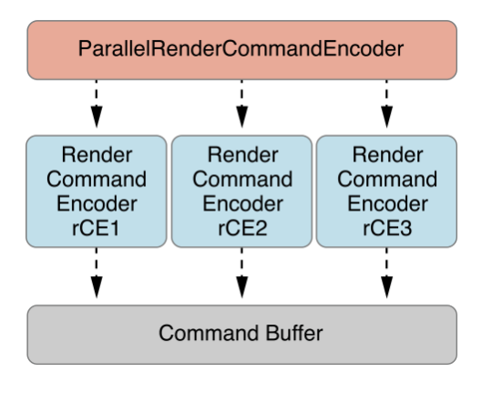

## Data-Parallel Compute Processing: Compute Command Encoder - 数据并行计算处理：计算命令编码器

> This chapter explains how to create and use a [MTLComputeCommandEncoder](https://developer.apple.com/documentation/metal/mtlcomputecommandencoder) object to encode data-parallel compute processing state and commands and submit them for execution on a device.
>
> To perform a data-parallel computation, follow these main steps:
>
> 1. Use a [MTLDevice](https://developer.apple.com/documentation/metal/mtldevice) method to create a compute state ([MTLComputePipelineState](https://developer.apple.com/documentation/metal/mtlcomputepipelinestate)) that contains compiled code from a [MTLFunction](https://developer.apple.com/documentation/metal/mtlfunction) object, as discussed in [Creating a Compute State](https://developer.apple.com/library/archive/documentation/Miscellaneous/Conceptual/MetalProgrammingGuide/Compute-Ctx/Compute-Ctx.html#//apple_ref/doc/uid/TP40014221-CH6-SW3). The MTLFunction object represents a compute function written with the Metal shading language, as described in [Functions and Libraries](https://developer.apple.com/library/archive/documentation/Miscellaneous/Conceptual/MetalProgrammingGuide/Prog-Func/Prog-Func.html#//apple_ref/doc/uid/TP40014221-CH5-SW1).
> 2. Specify the [MTLComputePipelineState](https://developer.apple.com/documentation/metal/mtlcomputepipelinestate) object to be used by the compute command encoder, as discussed in [Specifying a Compute State and Resources for a Compute Command Encoder](https://developer.apple.com/library/archive/documentation/Miscellaneous/Conceptual/MetalProgrammingGuide/Compute-Ctx/Compute-Ctx.html#//apple_ref/doc/uid/TP40014221-CH6-SW30).
> 3. Specify resources and related objects ([MTLBuffer](https://developer.apple.com/documentation/metal/mtlbuffer), [MTLTexture](https://developer.apple.com/documentation/metal/mtltexture), and possibly [MTLSamplerState](https://developer.apple.com/documentation/metal/mtlsamplerstate)) that may contain the data to be processed and returned by the compute state, as discussed in [Specifying a Compute State and Resources for a Compute Command Encoder](https://developer.apple.com/library/archive/documentation/Miscellaneous/Conceptual/MetalProgrammingGuide/Compute-Ctx/Compute-Ctx.html#//apple_ref/doc/uid/TP40014221-CH6-SW30). Also set their argument table indices, so that Metal framework code can locate a corresponding resource in the shader code. At any given moment, the [MTLComputeCommandEncoder](https://developer.apple.com/documentation/metal/mtlcomputecommandencoder) can be associated to a number of resource objects.
> 4. Dispatch the compute function a specified number of times, as explained in [Executing a Compute Command](https://developer.apple.com/library/archive/documentation/Miscellaneous/Conceptual/MetalProgrammingGuide/Compute-Ctx/Compute-Ctx.html#//apple_ref/doc/uid/TP40014221-CH6-SW2).

本章介绍如何创建并使用 [MTLComputeCommandEncoder](https://developer.apple.com/documentation/metal/mtlcomputecommandencoder) 对象来编码数据并行计算处理状态及命令，并提交它们以便在设备上执行。

要执行数据并行计算，遵循以下主要步骤：

1. 使用 [MTLDevice](https://developer.apple.com/documentation/metal/mtldevice) 方法创建包含 [MTLFunction](https://developer.apple.com/documentation/metal/mtlfunction) 对象已编译代码的计算状态（ [MTLComputePipelineState](https://developer.apple.com/documentation/metal/mtlcomputepipelinestate) ）对象，如 [Creating a Compute State](https://developer.apple.com/library/archive/documentation/Miscellaneous/Conceptual/MetalProgrammingGuide/Compute-Ctx/Compute-Ctx.html#//apple_ref/doc/uid/TP40014221-CH6-SW3) 中所述。MTLFunction 对象表示使用 Metal 着色语言编写的计算函数，如 [Functions and Libraries](https://developer.apple.com/library/archive/documentation/Miscellaneous/Conceptual/MetalProgrammingGuide/Prog-Func/Prog-Func.html#//apple_ref/doc/uid/TP40014221-CH5-SW1) 中所述。
2. 如 [Specifying a Compute State and Resources for a Compute Command Encoder](https://developer.apple.com/library/archive/documentation/Miscellaneous/Conceptual/MetalProgrammingGuide/Compute-Ctx/Compute-Ctx.html#//apple_ref/doc/uid/TP40014221-CH6-SW30) 中所示，指定计算命令编码器使用的 [MTLComputePipelineState](https://developer.apple.com/documentation/metal/mtlcomputepipelinestate) 对象。
3. 指定可能包含要由计算状态处理和返回数据的资源和相关对象（[MTLBuffer](https://developer.apple.com/documentation/metal/mtlbuffer)，[MTLTexture](https://developer.apple.com/documentation/metal/mtltexture) 和可能的 [MTLSamplerState](https://developer.apple.com/documentation/metal/mtlsamplerstate)），如 [Specifying a Compute State and Resources for a Compute Command Encoder](https://developer.apple.com/library/archive/documentation/Miscellaneous/Conceptual/MetalProgrammingGuide/Compute-Ctx/Compute-Ctx.html#//apple_ref/doc/uid/TP40014221-CH6-SW30) 所述。还需要设置它们的参数表索引，以便 Metal 框架代码可以定位到着色器代码中的相应资源。在任何给定时刻，[MTLComputeCommandEncoder](https://developer.apple.com/documentation/metal/mtlcomputecommandencoder) 可以与多个资源对象相关联。
4. 按照 [Executing a Compute Command](https://developer.apple.com/library/archive/documentation/Miscellaneous/Conceptual/MetalProgrammingGuide/Compute-Ctx/Compute-Ctx.html#//apple_ref/doc/uid/TP40014221-CH6-SW2) 中的说明，调度执行计算函数指定的次数。

### Creating a Compute Pipeline State - 创建计算管线状态

> A [MTLFunction](https://developer.apple.com/documentation/metal/mtlfunction) object represents data-parallel code that can be executed by a [MTLComputePipelineState](https://developer.apple.com/documentation/metal/mtlcomputepipelinestate) object. The [MTLComputeCommandEncoder](https://developer.apple.com/documentation/metal/mtlcomputecommandencoder) object encodes commands that set arguments and execute the compute function. Because creating a compute pipeline state can require an expensive compilation of Metal shading language code, you can use either a blocking or an asynchronous method to schedule such work in a way that best fits the design of your app.
>
> - To synchronously create the compute pipeline state object, call either the [newComputePipelineStateWithFunction:error:](https://developer.apple.com/documentation/metal/mtldevice/1433395-newcomputepipelinestatewithfunct) or [newComputePipelineStateWithFunction:options:reflection:error:](https://developer.apple.com/documentation/metal/mtldevice/1433419-makecomputepipelinestate) method of [MTLDevice](https://developer.apple.com/documentation/metal/mtldevice). These methods block the current thread while Metal compiles shader code to create the pipeline state object.
> - To asynchronously create the compute pipeline state object, call either the [newComputePipelineStateWithFunction:completionHandler:](https://developer.apple.com/documentation/metal/mtldevice/1433427-makecomputepipelinestate) or [newComputePipelineStateWithFunction:options:completionHandler:](https://developer.apple.com/documentation/metal/mtldevice/1433410-makecomputepipelinestate) method of [MTLDevice](https://developer.apple.com/documentation/metal/mtldevice). These methods return immediately—Metal asynchronously compiles shader code to create the pipeline state object, then calls your completion handler to provide the new [MTLComputePipelineState](https://developer.apple.com/documentation/metal/mtlcomputepipelinestate) object.
>
> When you create a [MTLComputePipelineState](https://developer.apple.com/documentation/metal/mtlcomputepipelinestate) object you can also choose to create reflection data that reveals details of the compute function and its arguments. The [newComputePipelineStateWithFunction:options:reflection:error:](https://developer.apple.com/documentation/metal/mtldevice/1433419-makecomputepipelinestate) and [newComputePipelineStateWithFunction:options:completionHandler:](https://developer.apple.com/documentation/metal/mtldevice/1433410-makecomputepipelinestate) methods provide this data. Avoid obtaining reflection data if it will not be used. For more information on how to analyze reflection data, see [Determining Function Details at Runtime](https://developer.apple.com/library/archive/documentation/Miscellaneous/Conceptual/MetalProgrammingGuide/Prog-Func/Prog-Func.html#//apple_ref/doc/uid/TP40014221-CH5-SW6).

[MTLFunction](https://developer.apple.com/documentation/metal/mtlfunction) 对象表示可以被 [MTLComputePipelineState](https://developer.apple.com/documentation/metal/mtlcomputepipelinestate) 执行的数据并行代码。[MTLComputeCommandEncoder](https://developer.apple.com/documentation/metal/mtlcomputecommandencoder) 对象对用于设置参数及执行计算功能的命令进行编码。因为创建计算管线状态需要昂贵的 Metal 着色语言代码编译代价，因此你可以使用阻塞或异步方式以最适合应用程序设计的方式安排此类工作。

- 要同步地创建计算管线状态对象，调用 [MTLDevice](https://developer.apple.com/documentation/metal/mtldevice) 的 [newComputePipelineStateWithFunction:error:](https://developer.apple.com/documentation/metal/mtldevice/1433395-newcomputepipelinestatewithfunct) 或 [newComputePipelineStateWithFunction:options:reflection:error:](https://developer.apple.com/documentation/metal/mtldevice/1433419-makecomputepipelinestate) 方法。这些方法阻塞当前线程当 Metal 编译着色器代码来创建管线状态对象时。
- 要异步地创建计算管线状态对象，调用 [MTLDevice](https://developer.apple.com/documentation/metal/mtldevice) 的 [newComputePipelineStateWithFunction:completionHandler:](https://developer.apple.com/documentation/metal/mtldevice/1433427-makecomputepipelinestate) 或 [newComputePipelineStateWithFunction:options:completionHandler:](https://developer.apple.com/documentation/metal/mtldevice/1433410-makecomputepipelinestate) 方法。这些函数立即返回 - Metal 异步编译着色器代码以创建管线状态对象，然后调用完成处理程序提供新的 [MTLComputePipelineState](https://developer.apple.com/documentation/metal/mtlcomputepipelinestate) 对象。

创建 [MTLComputePipelineState](https://developer.apple.com/documentation/metal/mtlcomputepipelinestate) 对象时，还可以选择创建显示计算函数及其参数详细信息的反射数据。[newComputePipelineStateWithFunction:options:reflection:error:](https://developer.apple.com/documentation/metal/mtldevice/1433419-makecomputepipelinestate) 和 [newComputePipelineStateWithFunction:options:completionHandler:](https://developer.apple.com/documentation/metal/mtldevice/1433410-makecomputepipelinestate) 方法提供该数据。如果不使用反射数据，那么避免获取它。有关如何分析反射数据的更多信息，参见 [Determining Function Details at Runtime](https://developer.apple.com/library/archive/documentation/Miscellaneous/Conceptual/MetalProgrammingGuide/Prog-Func/Prog-Func.html#//apple_ref/doc/uid/TP40014221-CH5-SW6) 。

### Specifying a Compute State and Resources for a Compute Command Encoder - 为计算命令编码器指定计算状态和资源

> The [setComputePipelineState:](https://developer.apple.com/documentation/metal/mtlcomputecommandencoder/1443140-setcomputepipelinestate) method of a [MTLComputeCommandEncoder](https://developer.apple.com/documentation/metal/mtlcomputecommandencoder) object specifies the state, including a compiled compute shader function, to use for a data-parallel compute pass. At any given moment, a compute command encoder can be associated to only one compute function.
>
> The following [MTLComputeCommandEncoder](https://developer.apple.com/documentation/metal/mtlcomputecommandencoder) methods specify a resource (that is, a buffer, texture, sampler state, or threadgroup memory) that is used as an argument to the compute function represented by the [MTLComputePipelineState](https://developer.apple.com/documentation/metal/mtlcomputepipelinestate) object.
>
> - [setBuffer:offset:atIndex:](https://developer.apple.com/documentation/metal/mtlcomputecommandencoder/1443126-setbuffer)
> - [setBuffers:offsets:withRange:](https://developer.apple.com/documentation/metal/mtlcomputecommandencoder/1443134-setbuffers)
> - [setTexture:atIndex:](https://developer.apple.com/documentation/metal/mtlcomputecommandencoder/1443130-settexture)
> - [setTextures:withRange:](https://developer.apple.com/documentation/metal/mtlcomputecommandencoder/1443148-settextures)
> - [setSamplerState:atIndex:](https://developer.apple.com/documentation/metal/mtlcomputecommandencoder/1443144-setsamplerstate)
> - [setSamplerState:lodMinClamp:lodMaxClamp:atIndex:](https://developer.apple.com/documentation/metal/mtlcomputecommandencoder/1443153-setsamplerstate)
> - [setSamplerStates:withRange:](https://developer.apple.com/documentation/metal/mtlcomputecommandencoder/1443155-setsamplerstates)
> - [setSamplerStates:lodMinClamps:lodMaxClamps:withRange:](https://developer.apple.com/documentation/metal/mtlcomputecommandencoder/1443128-setsamplerstates)
> - [setThreadgroupMemoryLength:atIndex:](https://developer.apple.com/documentation/metal/mtlcomputecommandencoder/1443142-setthreadgroupmemorylength)
>
> Each method assigns one or more resources to the corresponding argument(s), as illustrated in Figure 6-1.
>
> Figure 6-1  Argument Tables for the Compute Command Encoder

[MTLComputeCommandEncoder](https://developer.apple.com/documentation/metal/mtlcomputecommandencoder) 对象的 [setComputePipelineState:](https://developer.apple.com/documentation/metal/mtlcomputecommandencoder/1443140-setcomputepipelinestate) 方法指定用于数据并行计算过程的状态，包括已编译的计算着色器函数。在任何给定时刻，一个计算命令编码器只能与一个计算函数相关联。

以下 [MTLComputeCommandEncoder](https://developer.apple.com/documentation/metal/mtlcomputecommandencoder) 方法指定指定资源（即缓冲器、纹理、采样器状态或线程组内存），这些资源用作 [MTLComputePipelineState](https://developer.apple.com/documentation/metal/mtlcomputepipelinestate) 对象表示的计算函数的参数。

- [setBuffer:offset:atIndex:](https://developer.apple.com/documentation/metal/mtlcomputecommandencoder/1443126-setbuffer)
- [setBuffers:offsets:withRange:](https://developer.apple.com/documentation/metal/mtlcomputecommandencoder/1443134-setbuffers)
- [setTexture:atIndex:](https://developer.apple.com/documentation/metal/mtlcomputecommandencoder/1443130-settexture)
- [setTextures:withRange:](https://developer.apple.com/documentation/metal/mtlcomputecommandencoder/1443148-settextures)
- [setSamplerState:atIndex:](https://developer.apple.com/documentation/metal/mtlcomputecommandencoder/1443144-setsamplerstate)
- [setSamplerState:lodMinClamp:lodMaxClamp:atIndex:](https://developer.apple.com/documentation/metal/mtlcomputecommandencoder/1443153-setsamplerstate)
- [setSamplerStates:withRange:](https://developer.apple.com/documentation/metal/mtlcomputecommandencoder/1443155-setsamplerstates)
- [setSamplerStates:lodMinClamps:lodMaxClamps:withRange:](https://developer.apple.com/documentation/metal/mtlcomputecommandencoder/1443128-setsamplerstates)
- [setThreadgroupMemoryLength:atIndex:](https://developer.apple.com/documentation/metal/mtlcomputecommandencoder/1443142-setthreadgroupmemorylength)

每个方法将一个或更多的资源分配给相应的参数，如图 6-1 所示。

图 6-1 计算命令编码器的参数表

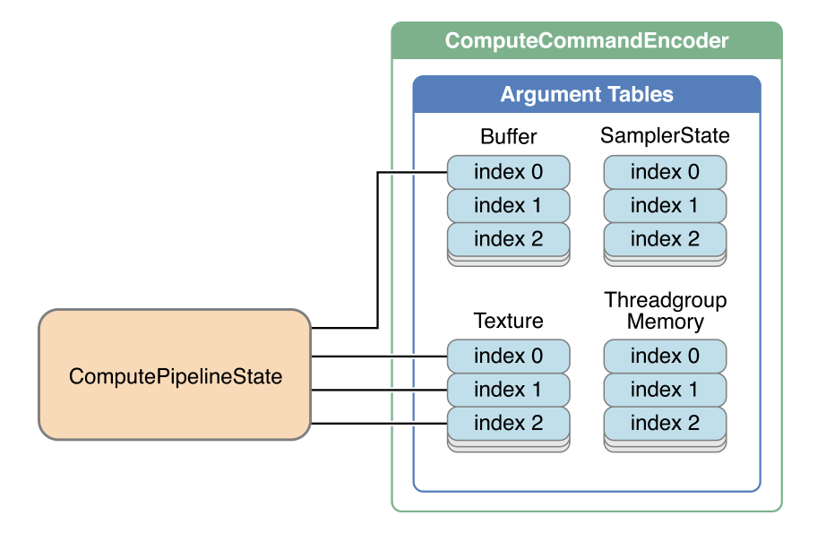

> The limits for the maximum number of entries in a buffer, texture, or sampler state argument table are listed in the [Implementation Limits](https://developer.apple.com/metal/limits/) table.
>
> The limits for the maximum total threadgroup memory allocation is also listed in the [Implementation Limits](https://developer.apple.com/metal/limits/) table.

[Implementation Limits](https://developer.apple.com/metal/limits/) 表中列出了缓冲区、纹理或采样器状态参数表中最大条目数的限制。

[Implementation Limits](https://developer.apple.com/metal/limits/) 表中还列出了最大总线程组内存分配的限制。

### Executing a Compute Command - 执行计算命令

> To encode a command to execute a compute function, call the [dispatchThreadgroups:threadsPerThreadgroup:](https://developer.apple.com/documentation/metal/mtlcomputecommandencoder/1443138-dispatchthreadgroups) method of [MTLComputeCommandEncoder](https://developer.apple.com/documentation/metal/mtlcomputecommandencoder) and specify the threadgroup dimensions and the number of threadgroups. You can query the [threadExecutionWidth](https://developer.apple.com/documentation/metal/mtlcomputepipelinestate/1414911-threadexecutionwidth) and [maxTotalThreadsPerThreadgroup](https://developer.apple.com/documentation/metal/mtlcomputepipelinestate/1414927-maxtotalthreadsperthreadgroup) properties of [MTLComputePipelineState](https://developer.apple.com/documentation/metal/mtlcomputepipelinestate) to optimize the execution of the compute function on this device.
>
> The total number of threads in a threadgroup is the product of the components of threadsPerThreadgroup: threadsPerThreadgroup.width * threadsPerThreadgroup.height * threadsPerThreadgroup.depth. The [maxTotalThreadsPerThreadgroup](https://developer.apple.com/documentation/metal/mtlcomputepipelinestate/1414927-maxtotalthreadsperthreadgroup) property specifies the maximum number of threads that can be in a single threadgroup to execute this compute function on the device.
>
> Compute commands are executed in the order in which they are encoded into the command buffer. A compute command finishes execution when all threadgroups associated with the command finish execution and all results are written to memory. Because of this sequencing, the results of a compute command are available to any commands encoded after it in the command buffer.
>
> To end encoding commands for a compute command encoder, call the [endEncoding](https://developer.apple.com/documentation/metal/mtlcommandencoder/1458038-endencoding) method of [MTLComputeCommandEncoder](https://developer.apple.com/documentation/metal/mtlcomputecommandencoder). After ending the previous command encoder, you can create a new command encoder of any type to encode additional commands into the command buffer.

要编码执行计算函数的命令，调用 [MTLComputeCommandEncoder](https://developer.apple.com/documentation/metal/mtlcomputecommandencoder) 的 [dispatchThreadgroups:threadsPerThreadgroup:](https://developer.apple.com/documentation/metal/mtlcomputecommandencoder/1443138-dispatchthreadgroups) 方法，并指定线程组维度和线程组数。你可以查询 [MTLComputePipelineState](https://developer.apple.com/documentation/metal/mtlcomputepipelinestate) 的 [threadExecutionWidth](https://developer.apple.com/documentation/metal/mtlcomputepipelinestate/1414911-threadexecutionwidth) 和 [maxTotalThreadsPerThreadgroup](https://developer.apple.com/documentation/metal/mtlcomputepipelinestate/1414927-maxtotalthreadsperthreadgroup) 属性优化设备上计算函数的执行。

线程组中的线程总数是 threadsPerThreadgroup: 各个组件的积：threadsPerThreadgroup.width * threadsPerThreadgroup.height * threadsPerThreadgroup.depth 。[maxTotalThreadsPerThreadgroup](https://developer.apple.com/documentation/metal/mtlcomputepipelinestate/1414927-maxtotalthreadsperthreadgroup) 属性指定设备上用于执行该计算函数的单个线程组中的最大线程数。

计算命令按照它们编码进命令缓冲区的顺序执行。当与命令关联的所有线程组执行完成并且所有结果都写入内存时，计算命令才算执行完成。由于这种排序，计算命令的结果对于命令缓冲区中位于该命令之后的任何已编码命令都是可用的。

要结束计算命令编码器的编码命令，调用 [MTLComputeCommandEncoder](https://developer.apple.com/documentation/metal/mtlcomputecommandencoder) 的 [endEncoding](https://developer.apple.com/documentation/metal/mtlcommandencoder/1458038-endencoding) 方法。结束前一个命令编码器之后，你可以创建任何类型的新的命令编码器来将其他命令编码到命令缓冲区中。

### Code Example: Executing Data-Parallel Functions - 代码示例：执行数据并行函数

> [Listing 6-1](https://developer.apple.com/library/archive/documentation/Miscellaneous/Conceptual/MetalProgrammingGuide/Compute-Ctx/Compute-Ctx.html#//apple_ref/doc/uid/TP40014221-CH6-SW6) shows an example that creates and uses a [MTLComputeCommandEncoder](https://developer.apple.com/documentation/metal/mtlcomputecommandencoder) object to perform the parallel computations of an image transformation on specified data. (This example does not show how the device, library, command queue, and resource objects are created and initialized.) The example creates a command buffer and then uses it to create the [MTLComputeCommandEncoder](https://developer.apple.com/documentation/metal/mtlcomputecommandencoder) object. Next a [MTLFunction](https://developer.apple.com/documentation/metal/mtlfunction) object is created that represents the entry point filter_main loaded from the [MTLLibrary](https://developer.apple.com/documentation/metal/mtllibrary) object, shown in [Listing 6-2](https://developer.apple.com/library/archive/documentation/Miscellaneous/Conceptual/MetalProgrammingGuide/Compute-Ctx/Compute-Ctx.html#//apple_ref/doc/uid/TP40014221-CH6-SW5). Then the function object is used to create a [MTLComputePipelineState](https://developer.apple.com/documentation/metal/mtlcomputepipelinestate) object called filterState.
>
> The compute function performs an image transformation and filtering operation on the image inputImage with the results returned in outputImage. First the [setTexture:atIndex:](https://developer.apple.com/documentation/metal/mtlcomputecommandencoder/1443130-settexture) and [setBuffer:offset:atIndex:](https://developer.apple.com/documentation/metal/mtlcomputecommandencoder/1443126-setbuffer) methods assign texture and buffer objects to indices in the specified argument tables. paramsBuffer specifies values used to perform the image transformation, and inputTableData specifies filter weights. The compute function is executed as a 2D threadgroup of size 16 x 16 pixels in each dimension. The [dispatchThreadgroups:threadsPerThreadgroup:](https://developer.apple.com/documentation/metal/mtlcomputecommandencoder/1443138-dispatchthreadgroups) method enqueues the command to dispatch the threads executing the compute function, and the [endEncoding](https://developer.apple.com/documentation/metal/mtlcommandencoder/1458038-endencoding) method terminates the [MTLComputeCommandEncoder](https://developer.apple.com/documentation/metal/mtlcomputecommandencoder). Finally, the [commit](https://developer.apple.com/documentation/metal/mtlcommandbuffer/1443003-commit) method of [MTLCommandBuffer](https://developer.apple.com/documentation/metal/mtlcommandbuffer) causes the commands to be executed as soon as possible.
>
> Listing 6-1  Specifying and Running a Function in a Compute State

[Listing 6-1](https://developer.apple.com/library/archive/documentation/Miscellaneous/Conceptual/MetalProgrammingGuide/Compute-Ctx/Compute-Ctx.html#//apple_ref/doc/uid/TP40014221-CH6-SW6) 显示了一个示例，创建并使用一个 [MTLComputeCommandEncoder](https://developer.apple.com/documentation/metal/mtlcomputecommandencoder) 对象执行对指定数据的图像转换的并行计算。（该示例未展示如何创建并初始化 device、library、command queue 和 resource objects）。该示例创建一个命令缓冲区，然后使用它创建 [MTLComputeCommandEncoder](https://developer.apple.com/documentation/metal/mtlcomputecommandencoder) 对象。接下来，创建一个 [MTLFunction](https://developer.apple.com/documentation/metal/mtlfunction) 对象来表示从 [MTLLibrary](https://developer.apple.com/documentation/metal/mtllibrary) 对象中加载的入口点 filter_main ，如清单 [Listing 6-2](https://developer.apple.com/library/archive/documentation/Miscellaneous/Conceptual/MetalProgrammingGuide/Compute-Ctx/Compute-Ctx.html#//apple_ref/doc/uid/TP40014221-CH6-SW5) 所示。然后使用函数对象创建一个名称为 filterState 的 [MTLComputePipelineState](https://developer.apple.com/documentation/metal/mtlcomputepipelinestate) 对象。

计算函数针对 inputImage 图像执行图像变换和过滤操作，并在 outputImage 中返回结果。首先 [setTexture:atIndex:](https://developer.apple.com/documentation/metal/mtlcomputecommandencoder/1443130-settexture) 和 [setBuffer:offset:atIndex:](https://developer.apple.com/documentation/metal/mtlcomputecommandencoder/1443126-setbuffer) 方法将纹理和缓冲区对象分配给指定参数表中的索引。paramsBuffer 指定用于执行图像转换的值，inputTableData 指定过滤器权重。计算函数作为每个维度中尺寸为 16 x 16 像素的 2D 线程组执行。[dispatchThreadgroups:threadsPerThreadgroup:](https://developer.apple.com/documentation/metal/mtlcomputecommandencoder/1443138-dispatchthreadgroups)  方法将命令排入队列以分派执行计算函数的线程，[endEncoding](https://developer.apple.com/documentation/metal/mtlcommandencoder/1458038-endencoding) 方法终止 [MTLComputeCommandEncoder](https://developer.apple.com/documentation/metal/mtlcomputecommandencoder) 。最后，[MTLCommandBuffer](https://developer.apple.com/documentation/metal/mtlcommandbuffer) 的 [commit](https://developer.apple.com/documentation/metal/mtlcommandbuffer/1443003-commit) 方法触发命令尽快执行。

清单 6-1 在计算状态中指定并允许函数

```objc
id <MTLDevice> device;
id <MTLLibrary> library;
id <MTLCommandQueue> commandQueue;

id <MTLTexture> inputImage;
id <MTLTexture> outputImage;
id <MTLTexture> inputTableData;
id <MTLBuffer> paramsBuffer;

// ... Create and initialize device, library, queue, resources

// Obtain a new command buffer
id <MTLCommandBuffer> commandBuffer = [commandQueue commandBuffer];

// Create a compute command encoder
id <MTLComputeCommandEncoder> computeCE = [commandBuffer computeCommandEncoder];

NSError *errors;
id <MTLFunction> func = [library newFunctionWithName:@"filter_main"];
id <MTLComputePipelineState> filterState
    = [device newComputePipelineStateWithFunction:func error:&errors];
[computeCE setComputePipelineState:filterState];
[computeCE setTexture:inputImage atIndex:0];
[computeCE setTexture:outputImage atIndex:1];
[computeCE setTexture:inputTableData atIndex:2];
[computeCE setBuffer:paramsBuffer offset:0 atIndex:0];

MTLSize threadsPerGroup = {16, 16, 1};
MTLSize numThreadgroups = {inputImage.width/threadsPerGroup.width,
inputImage.height/threadsPerGroup.height, 1};

[computeCE dispatchThreadgroups:numThreadgroups
    threadsPerThreadgroup:threadsPerGroup];
[computeCE endEncoding];

// Commit the command buffer
[commandBuffer commit];
```

> Listing 6-2 shows the corresponding shader code for the preceding example. (The functions read_and_transform and filter_table are placeholders for user-defined code).
>
> Listing 6-2  Shading Language Compute Function Declaration

清单 6-2 显示了前面示例的相应着色器代码。（ read_and_transform 函数和 filter_table 是用户定义的代码的占位符）。

清单 6-2 着色语言计算函数声明

```objc
kernel void filter_main(
    texture2d<float,access::read>   inputImage   [[ texture(0) ]],
    texture2d<float,access::write>  outputImage  [[ texture(1) ]],
    uint2 gid                                    [[ thread_position_in_grid ]],
    texture2d<float,access::sample> table        [[ texture(2) ]],
    constant Parameters* params                  [[ buffer(0) ]]
)
{
    float2 p0          = static_cast<float2>(gid);
    float3x3 transform = params->transform;
    float4   dims      = params->dims;

    float4 v0 = read_and_transform(inputImage, p0, transform);
    float4 v1 = filter_table(v0,table, dims);

    outputImage.write(v1,gid);
}
```

## Buffer and Texture Operations: Blit Command Encoder - 缓冲区和纹理操作 - Blit 命令编码器

> [MTLBlitCommandEncoder](https://developer.apple.com/documentation/metal/mtlblitcommandencoder) provides methods for copying data between resources (buffers and textures). Data copying operations may be necessary for image processing and texture effects, such as blurring or reflections. They may be used to access image data that is rendered off-screen.
>
> To perform data copying operations, first create a [MTLBlitCommandEncoder](https://developer.apple.com/documentation/metal/mtlblitcommandencoder) object by calling the [blitCommandEncoder](https://developer.apple.com/documentation/metal/mtlcommandbuffer/1443001-blitcommandencoder) method of [MTLCommandBuffer](https://developer.apple.com/documentation/metal/mtlcommandbuffer). Then call the [MTLBlitCommandEncoder](https://developer.apple.com/documentation/metal/mtlblitcommandencoder) methods described below to encode commands onto the command buffer.

[MTLBlitCommandEncoder](https://developer.apple.com/documentation/metal/mtlblitcommandencoder) 提供了在资源（缓冲区和纹理）之间复制数据的方法。数据复制操作对于图像处理和纹理效果（例如模糊或反射）可能是必需的。可以使用它们访问离屏渲染的图像数据。

要执行数据拷贝操作，首先通过调用 [MTLCommandBuffer](https://developer.apple.com/documentation/metal/mtlcommandbuffer) 的 [blitCommandEncoder](https://developer.apple.com/documentation/metal/mtlcommandbuffer/1443001-blitcommandencoder) 方法创建一个 [MTLBlitCommandEncoder](https://developer.apple.com/documentation/metal/mtlblitcommandencoder) 对象。然后调用下面描述的 [MTLBlitCommandEncoder](https://developer.apple.com/documentation/metal/mtlblitcommandencoder) 方法将命令编码到命令缓冲区。

### Copying Data in GPU Memory Between Resource Objects - 在资源对象之间拷贝 GPU 内存中的数据

> The following [MTLBlitCommandEncoder](https://developer.apple.com/documentation/metal/mtlblitcommandencoder) methods copy image data between resource objects: between two buffer objects, between two texture objects, and between a buffer and a texture.

以下 [MTLBlitCommandEncoder](https://developer.apple.com/documentation/metal/mtlblitcommandencoder) 方法在资源对象之间拷贝图像数据：两个缓冲区对象之间、两个纹理对象之间以及缓冲区和纹理之间。

#### Copying Data Between Two Buffers - 两个缓冲区之间拷贝数据

> The method [copyFromBuffer:sourceOffset:toBuffer:destinationOffset:size:](https://developer.apple.com/documentation/metal/mtlblitcommandencoder/1400767-copy) copies data between two buffers: from the source buffer into the destination buffer toBuffer. If the source and destination are the same buffer, and the range being copied overlaps, the results are undefined.

方法 [copyFromBuffer:sourceOffset:toBuffer:destinationOffset:size:](https://developer.apple.com/documentation/metal/mtlblitcommandencoder/1400767-copy) 在两个缓冲区之间拷贝数据：从源缓冲区到 toBuffer 目标缓冲区。若源和目标为相同的缓冲区，并且复制范围重叠的话，则结果是未定义的。

#### Copying Data from a Buffer to a Texture - 从缓冲区拷贝数据到纹理
> The method [copyFromBuffer:sourceOffset:sourceBytesPerRow:sourceBytesPerImage:sourceSize:toTexture:destinationSlice:destinationLevel:destinationOrigin:](https://developer.apple.com/documentation/metal/mtlblitcommandencoder/1400752-copy) copies image data from a source buffer into the destination texture toTexture.

方法 [copyFromBuffer:sourceOffset:sourceBytesPerRow:sourceBytesPerImage:sourceSize:toTexture:destinationSlice:destinationLevel:destinationOrigin:](https://developer.apple.com/documentation/metal/mtlblitcommandencoder/1400752-copy) 将图像数据从源缓冲区复制到目标纹理 toTexture 。

#### Copying Data Between Two Textures - 在两个纹理之间复制数据

> The method [copyFromTexture:sourceSlice:sourceLevel:sourceOrigin:sourceSize:toTexture:destinationSlice:destinationLevel:destinationOrigin:](https://developer.apple.com/documentation/metal/mtlblitcommandencoder/1400754-copyfromtexture) copies a region of image data between two textures: from a single cube slice and mipmap level of the source texture to the destination texture toTexture.

方法 [copyFromTexture:sourceSlice:sourceLevel:sourceOrigin:sourceSize:toTexture:destinationSlice:destinationLevel:destinationOrigin:](https://developer.apple.com/documentation/metal/mtlblitcommandencoder/1400754-copyfromtexture) 两个纹理之间复制图像数据某个区域：从源纹理的单个立方体切片和 mipmap 级别到目标纹理 toTexture 。

#### Copying Data from a Texture to a Buffer - 从纹理拷贝数据到缓冲区

> The method [copyFromTexture:sourceSlice:sourceLevel:sourceOrigin:sourceSize:toBuffer:destinationOffset:destinationBytesPerRow:destinationBytesPerImage:](https://developer.apple.com/documentation/metal/mtlblitcommandencoder/1400773-copy) copies a region of image data from a single cube slice and mipmap level of a source texture into the destination buffer toBuffer.

方法 copyFromTexture:sourceSlice:sourceLevel:sourceOrigin:sourceSize:toBuffer:destinationOffset:destinationBytesPerRow:destinationBytesPerImage: 将源纹理的单个立方体切片和 mipmap 级别的图像数据的一个区域拷贝到目标缓冲区 toBuffer 。

### Generating Mipmaps - 生成 Mipmaps

> The [generateMipmapsForTexture:](https://developer.apple.com/documentation/metal/mtlblitcommandencoder/1400748-generatemipmapsfortexture) method of [MTLBlitCommandEncoder](https://developer.apple.com/documentation/metal/mtlblitcommandencoder) automatically generate mipmaps for the given texture, starting from the base level texture image. generateMipmapsForTexture: creates scaled images for all mipmap levels up to the maximum level.
>
> For details on how the number of mipmaps and the size of each mipmap are determined, see [Slices](https://developer.apple.com/library/archive/documentation/Miscellaneous/Conceptual/MetalProgrammingGuide/Mem-Obj/Mem-Obj.html#//apple_ref/doc/uid/TP40014221-CH4-SW6).

[MTLBlitCommandEncoder](https://developer.apple.com/documentation/metal/mtlblitcommandencoder) 的 [generateMipmapsForTexture:](https://developer.apple.com/documentation/metal/mtlblitcommandencoder/1400748-generatemipmapsfortexture) 方法从基础级纹理图像开始自动为给定纹理生成 mipmaps 。generateMipmapsForTexture: 为不超过最大级的所有 mipmap 级创建缩放图像。

有关如何确定 mipmaps 数量和每个 mipmap 大小的详细信息，见 [Slices](https://developer.apple.com/library/archive/documentation/Miscellaneous/Conceptual/MetalProgrammingGuide/Mem-Obj/Mem-Obj.html#//apple_ref/doc/uid/TP40014221-CH4-SW6) 。

### Filling the Contents of a Buffer - 填充缓冲区内容

> The [fillBuffer:range:value:](https://developer.apple.com/documentation/metal/mtlblitcommandencoder/1400761-fillbuffer) method of [MTLBlitCommandEncoder](https://developer.apple.com/documentation/metal/mtlblitcommandencoder) stores the 8-bit constant value in every byte over the specified range of the given buffer.

[MTLBlitCommandEncoder](https://developer.apple.com/documentation/metal/mtlblitcommandencoder) 的 [fillBuffer:range:value:](https://developer.apple.com/documentation/metal/mtlblitcommandencoder/1400761-fillbuffer) 方法在给定缓冲区的指定范围内，填充 8 位常量值到每个字节中。

### Ending Encoding for the Blit Command Encoder - 结束 Blit 命令编码器编码

> To end encoding commands for a blit command encoder, call [endEncoding](https://developer.apple.com/documentation/metal/mtlcommandencoder/1458038-endencoding). After ending the previous command encoder, you can create a new command encoder of any type to encode additional commands into the command buffer.

要结束一个 blit 命令编码器的编码，调用 [endEncoding](https://developer.apple.com/documentation/metal/mtlcommandencoder/1458038-endencoding) 。结束之前的命令编码器之后，你可以创建任意类型的新命令编码器将其他命令编码到命令缓冲区中。

## Metal Tools - Metal 工具

> This chapter lists the tools available to help you customize and improve your development workflow.

本章列出了可以帮助你自定义和改进开发工作流程的工具。

### Creating Libraries During the App Build Process - App 构建过程中创建库

> Compiling shader language source files and building a library (.metallib file) during the app build process achieves better app performance than compiling shader source code at runtime. You can build a library within Xcode or by using command line utilities.

在应用程序构建过程中编译着色器语言源文件并构建库（.metallib 文件）可以比在运行时编译着色器源代码获取更好的应用程序性能。你可以使用 Xcode 或者命令行工具构建库。

#### Using Xcode to Build a Library - 使用 Xcode 构建库

> Any shader source files that are in your project are automatically used to generate the default library, which you can access from Metal framework code with the [newDefaultLibrary](https://developer.apple.com/documentation/metal/mtldevice/1433380-newdefaultlibrary) method of [MTLDevice](https://developer.apple.com/documentation/metal/mtldevice).

项目中的任何着色器源文件都会自动用于生成默认库，你可以使用 [MTLDevice](https://developer.apple.com/documentation/metal/mtldevice) 的 [newDefaultLibrary](https://developer.apple.com/documentation/metal/mtldevice/1433380-newdefaultlibrary) 在 Metal 框架代码中访问该库。

#### Using Command Line Utilities to Build a Library - 使用命令行工具构建库

> [Figure 8-1](https://developer.apple.com/library/archive/documentation/Miscellaneous/Conceptual/MetalProgrammingGuide/Dev-Technique/Dev-Technique.html#//apple_ref/doc/uid/TP40014221-CH8-SW6) shows the command line utilities that form the compiler toolchain for Metal shader source code. When you include .metal files in your project, Xcode invokes these tools to build a library file that you can access in your app at run time.
>
> To compile shader source into a library without using Xcode:
>
> 1. Use the metal tool to compile each .metal file into a single .air file, which stores an intermediate representation (IR) of shader language code.
> 2. Optionally, use the metal-ar tool to archive several .air files together into a single .metalar file. (metal-ar is similar to the Unix ar.)
> 3. Use the metallib tool to build a Metal .metallib library file from IR .air files or from archive .metalar files.
>
> Figure 8-1  Building a Library File with Command Line Utilities

[Figure 8-1](https://developer.apple.com/library/archive/documentation/Miscellaneous/Conceptual/MetalProgrammingGuide/Dev-Technique/Dev-Technique.html#//apple_ref/doc/uid/TP40014221-CH8-SW6) 显示了构成 Metal 着色器源代码编译器工具链的命令行工具。当你的项目中包含 .metal 文件时，Xcode 调用这些工具来构建一个可以在应用程序运行期间访问的库文件。

要在不使用 Xcode 的情况下将着色器源码编译到库中：

1. 使用 metal 工具将每个 .metal 文件编译为单个 .air 文件，该文件存储着着色器语言代码的中间表示（IR）。
2. 可选地，使用 metal-ar 工具将多个 .air 文件一起存档到单个 .metalar 文件中（metal-ar 类似于 Unix ar ）。
3. 使用 metallib 工具从 IR .air 文件或存档 .metalar 文件构建 Metal .metallib 库文件。

图 8-1 使用命令行工具构建库文件

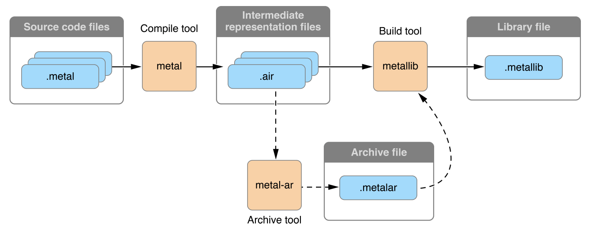

> [Listing 8-1](https://developer.apple.com/library/archive/documentation/Miscellaneous/Conceptual/MetalProgrammingGuide/Dev-Technique/Dev-Technique.html#//apple_ref/doc/uid/TP40014221-CH8-SW4) shows the minimum number of commands needed for compiling and building a .metal file into a .metallib file.
>
> Listing 8-1  Building a Library File with Command Line Utilities

[Listing 8-1](https://developer.apple.com/library/archive/documentation/Miscellaneous/Conceptual/MetalProgrammingGuide/Dev-Technique/Dev-Technique.html#//apple_ref/doc/uid/TP40014221-CH8-SW4) 显示了编译并构建一个 .metal 文件到 .metallib 文件所需要的最少命令数。

清单 8-1 使用命令行工具构建一个库文件

```objc
xcrun -sdk macosx metal MyLibrary.metal -o MyLibrary.air
xcrun -sdk macosx metallib MyLibrary.air -o MyLibrary.metallib
```

> To access the resulting library in framework code, call the [newLibraryWithFile:error:](https://developer.apple.com/documentation/metal/mtldevice/1433416-newlibrarywithfile) method, as shown in [Listing 8-2](https://developer.apple.com/library/archive/documentation/Miscellaneous/Conceptual/MetalProgrammingGuide/Dev-Technique/Dev-Technique.html#//apple_ref/doc/uid/TP40014221-CH8-SW5).
>
> Listing 8-2  Accessing a Library File within Your App

如 [Listing 8-2](https://developer.apple.com/library/archive/documentation/Miscellaneous/Conceptual/MetalProgrammingGuide/Dev-Technique/Dev-Technique.html#//apple_ref/doc/uid/TP40014221-CH8-SW5) 中所示，调用 [newLibraryWithFile:error:](https://developer.apple.com/documentation/metal/mtldevice/1433416-newlibrarywithfile) 方法在框架代码中访问最终生成的库。

清单 8-2 应用程序中访问库文件

```objc
NSError *libraryError = NULL;
NSString *libraryFile = [[NSBundle mainBundle] pathForResource:@"MyLibrary"         ofType:@"metallib"];
id <MTLLibrary> myLibrary = [_device newLibraryWithFile:libraryFile     error:&libraryError];
if (!myLibrary) {
    NSLog(@"Library error: %@", libraryError);
}
```

### Xcode Scheme Settings and Performance - Xcode 模式设置及性能

> When a Metal app is running from Xcode, the default scheme settings reduce performance. Xcode detects whether the Metal API is used in the source code and automatically enables the GPU Frame Capture and Metal API Validation settings, as seen in Figure 8-2. When GPU Frame Capture is enabled, the debug layer is activated. When Metal API Validation is enabled, each call is validated, which affects performance further. For both settings, CPU performance is more affected than GPU performance. Unless you disable these settings, app performance may noticeably improve when the app is run outside of Xcode.
>
> Figure 8-2  Xcode Scheme Editor Settings for a Metal App

当一个 Metal 应用程序从 Xcode 中运行起来的时候，默认模式设置会降低性能。Xcode 检测源代码中是否使用了 Metal API ，并启动启用  GPU Frame Capture 和 Metal API Validation 设置，如图 8-2 所示。GPU Frame Capture 启用时，将激活调试层。Metal API Validation 启用时，每个调用都将被验证，这会进一步影响性能。对于这两项设置，CPU 性能比 GPU 性能更受影响。除非你禁用这些设置，否则当应用程序运行于 Xcode 之外时，应用程序性能可能会显著提升。

图 8-2 Metal App 的 Xcode Scheme Editor 设置

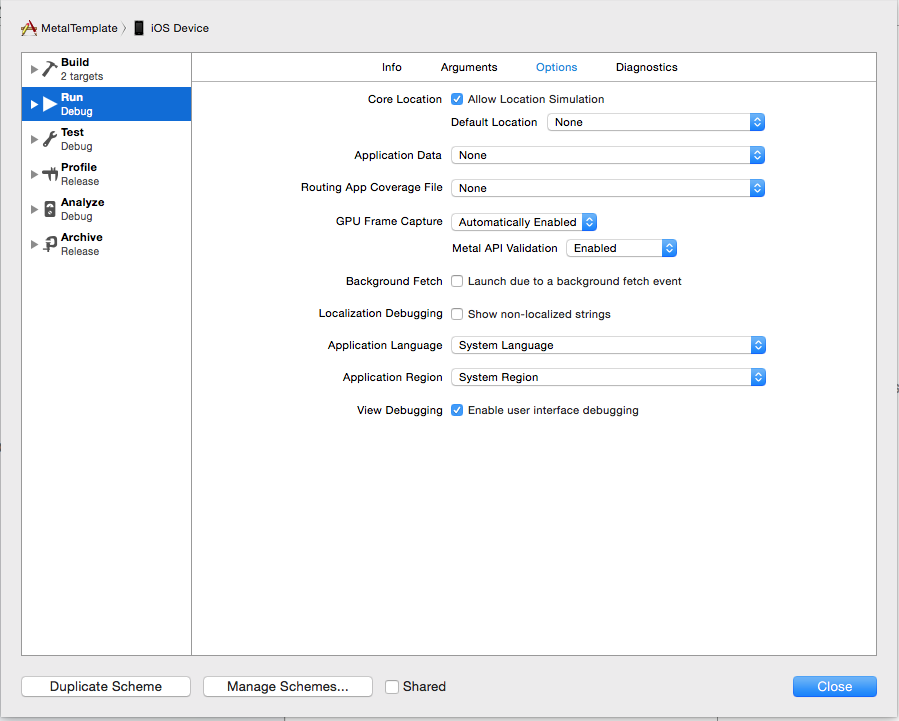

### Debugging - 调试

> Use the tips in the following sections to gain more useful diagnostic information when debugging and profiling your Metal app.
>
> Note: Debugging is enabled only if your Xcode project’s Deployment Target is set to the latest SDK.

在调试和分析 Metal 应用程序时，使用以下各节中的 tips 获取更多有用的诊断信息。

注意：仅当 Xcode 项目的部署目标设置为最新的 SDK 时，才能使用 Debugging 。

#### File Extension for Metal Shading Language Source Files - Metal 着色语言源文件的文件扩展名

> For Metal shading language source code file names, you must use the .metal file name extension to ensure that the development tools (Xcode and the GPU frame debugger) recognize the source files when debugging or profiling.

对于 Metal 着色语言源代码文件名，必需使用 .metal 文件扩展名以确保开发工具（ Xcode 和 GPU 帧调试器）在调试或分析时识别源文件。

#### Performing Frame Capture with Xcode - 使用 Xcode 执行帧捕捉

> To perform frame capture in Xcode, enable debug and call the [insertDebugCaptureBoundary](https://developer.apple.com/documentation/metal/mtlcommandqueue/1508692-insertdebugcaptureboundary) method of [MTLCommandQueue](https://developer.apple.com/documentation/metal/mtlcommandqueue) to inform Xcode. The [presentDrawable:](https://developer.apple.com/documentation/metal/mtlcommandbuffer/1443029-present) and [presentDrawable:atTime:](https://developer.apple.com/documentation/metal/mtlcommandbuffer/1442989-present) methods of [MTLCommandBuffer](https://developer.apple.com/documentation/metal/mtlcommandbuffer) similarly inform Xcode about frame capture, so call [insertDebugCaptureBoundary](https://developer.apple.com/documentation/metal/mtlcommandqueue/1508692-insertdebugcaptureboundary) only if those methods are not present. Refer to [Debugging Metal and OpenGL ES](https://developer.apple.com/library/archive/documentation/DeveloperTools/Conceptual/debugging_with_xcode/chapters/special_debugging_workflows.html#//apple_ref/doc/uid/TP40015022-CH9-SW24) for further information.

要在 Xcode 中执行帧捕获，需要启用调试并且调用 [MTLCommandQueue](https://developer.apple.com/documentation/metal/mtlcommandqueue) 的 [insertDebugCaptureBoundary](https://developer.apple.com/documentation/metal/mtlcommandqueue/1508692-insertdebugcaptureboundary) 方法以通知 Xcode 。[MTLCommandBuffer](https://developer.apple.com/documentation/metal/mtlcommandbuffer)  的  [presentDrawable:](https://developer.apple.com/documentation/metal/mtlcommandbuffer/1443029-present) 和 [presentDrawable:atTime:](https://developer.apple.com/documentation/metal/mtlcommandbuffer/1442989-present) 方法以类似的方式通知 Xcode ，所以只有在这些方法不存在时才调用 [insertDebugCaptureBoundary](https://developer.apple.com/documentation/metal/mtlcommandqueue/1508692-insertdebugcaptureboundary) 。有关详细信息，参考 [Debugging Metal and OpenGL ES](https://developer.apple.com/library/archive/documentation/DeveloperTools/Conceptual/debugging_with_xcode/chapters/special_debugging_workflows.html#//apple_ref/doc/uid/TP40015022-CH9-SW24) 。

#### The Label Property - Label 属性

> Many Metal framework objects—such as command buffers, pipeline states, and resources—support a [label](https://developer.apple.com/documentation/metal/mtlresource/1515814-label) property. You can use this property to assign a name for each object that is meaningful in the context of your application’s design. These labels appear in the Xcode Frame Capture debugging interface, allowing you to more easily identify objects.
>
> Similarly, the [insertDebugSignpost:](https://developer.apple.com/documentation/metal/mtlcommandencoder/1458034-insertdebugsignpost), [pushDebugGroup:](https://developer.apple.com/documentation/metal/mtlcommandencoder/1458041-pushdebuggroup), and [popDebugGroup](https://developer.apple.com/documentation/metal/mtlcommandencoder/1458040-popdebuggroup) methods allow you to insert debug strings into a command buffer and to push or pop string labels used to identify groups of encoded commands.

很多 Metal 框架对象 - 比如命令缓冲区、管道状态和资源 - 都支持 [label](https://developer.apple.com/documentation/metal/mtlresource/1515814-label) 属性。你可以使用该属性为每个对象指定一个符合应用程序设计上下文的有意义的名称。这些标签出现在 Xcode Frame Capture 调试界面中，使你更容易地标识对象。

类似的，[insertDebugSignpost:](https://developer.apple.com/documentation/metal/mtlcommandencoder/1458034-insertdebugsignpost)，[pushDebugGroup:](https://developer.apple.com/documentation/metal/mtlcommandencoder/1458041-pushdebuggroup) 和 [popDebugGroup](https://developer.apple.com/documentation/metal/mtlcommandencoder/1458040-popdebuggroup) 方法允许你将调试字符串插入命令缓冲区中并 push 或 pop 用于标识已编码命令组的字符串标签。

#### Metal System Trace - Metal 系统跟踪

> To profile an app in Instruments, run the Metal System Trace tool. Refer to [Metal System Trace Profiling Template](https://developer.apple.com/library/archive/documentation/DeveloperTools/Conceptual/InstrumentsUserGuide/ProfilingTemplates.html#//apple_ref/doc/uid/TP40004652-CH19-SW13) for further information.

要在 Instruments 中分析应用程序，需要运行 Metal System Trace 工具。有关详细信息，参考 [Metal System Trace Profiling Template](https://developer.apple.com/library/archive/documentation/DeveloperTools/Conceptual/InstrumentsUserGuide/ProfilingTemplates.html#//apple_ref/doc/uid/TP40004652-CH19-SW13) 。

## Metal Feature Set Tables - Metal 功能集表

> A Metal feature set describes the feature availability, implementation limits, and pixel format capabilities of a particular Metal device. Each feature set corresponds to a specific GPU and OS, as listed in the [MTLFeatureSet](https://developer.apple.com/documentation/metal/mtlfeatureset) reference. For further information, see the following tables:
>
> - [Feature Availability](https://developer.apple.com/metal/availability/)
> - [Implementation Limits](https://developer.apple.com/metal/limits/)
> - [Pixel Format Capabilities](https://developer.apple.com/metal/capabilities/)

Metal 功能集描述特定 Metal 设备的功能可用性、实现限制和像素格式能力。每个功能集对应于特定的 GPU 和 OS ，如 [MTLFeatureSet](https://developer.apple.com/documentation/metal/mtlfeatureset) 参考中所列。有关详细信息，参阅下表：

- [Feature Availability](https://developer.apple.com/metal/availability/)
- [Implementation Limits](https://developer.apple.com/metal/limits/)
- [Pixel Format Capabilities](https://developer.apple.com/metal/capabilities/)


