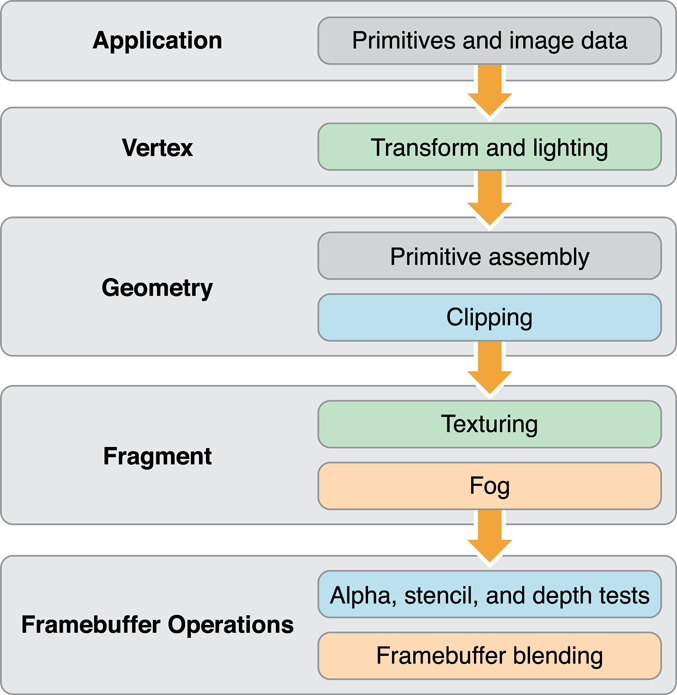
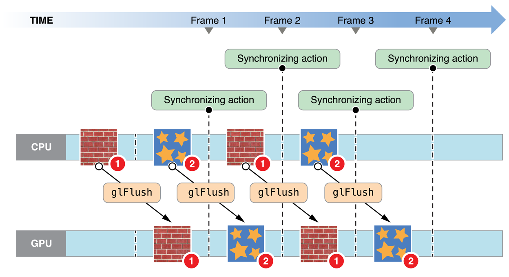
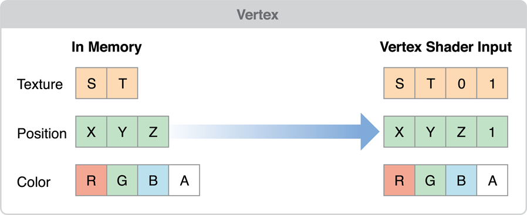
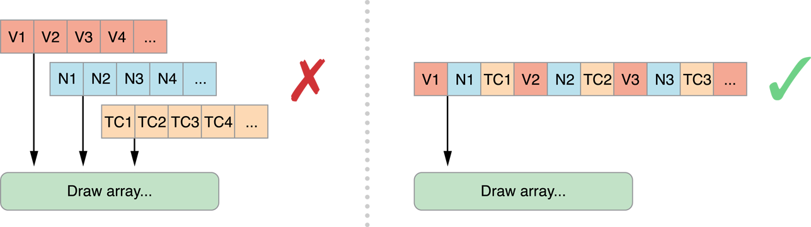
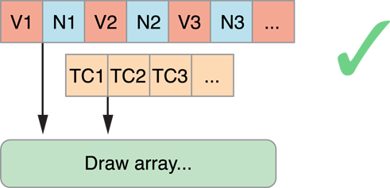
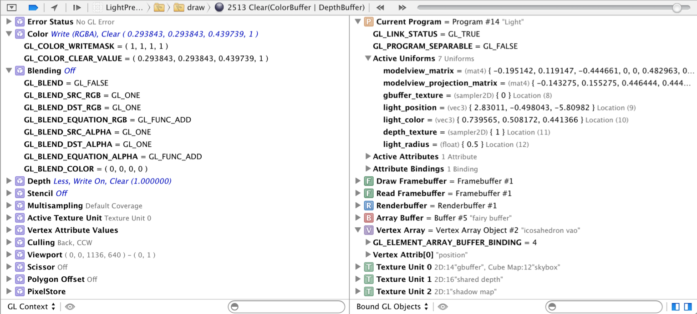

#  OpenGL ES Programming Guide

英文原文 https://developer.apple.com/library/archive/documentation/3DDrawing/Conceptual/OpenGLES_ProgrammingGuide/Introduction/Introduction.html#//apple_ref/doc/uid/TP40008793-CH1-SW1

## About OpenGL ES

> The *Open Graphics Library (OpenGL)* is used for visualizing 2D and 3D data. It is a multipurpose open-standard graphics library that supports applications for 2D and 3D digital content creation, mechanical and architectural design, virtual prototyping, flight simulation, video games, and more. You use OpenGL to configure a 3D graphics pipeline and submit data to it. Vertices are transformed and lit, assembled into primitives, and rasterized to create a 2D image. OpenGL is designed to translate function calls into graphics commands that can be sent to underlying graphics hardware. Because this underlying hardware is dedicated to processing graphics commands, OpenGL drawing is typically very fast.
>
> *OpenGL for Embedded Systems (OpenGL ES)* is a simplified version of OpenGL that eliminates redundant functionality to provide a library that is both easier to learn and easier to implement in mobile graphics hardware.

*Open Graphics Library (OpenGL)* 用来可视化 2D 与 3D 数据。它是一个多用途的开放标准图形库，支持 2D 和 3D 数字内容创建、机械和建筑设计、虚拟原型设计、飞行模拟、视频游戏等应用。你可以使用 OpenGL 配置 3D 图形管线并向其提交数据。顶点数据经过变换组装成图元，经过光栅化创建出 2D 图像。OpenGL 旨在将函数调用转换为可以发送到底层图形硬件的图形命令。因为此底层硬件专用于处理图形命令，因此 OpenGL 绘制通常非常快。

*OpenGL for Embedded Systems (OpenGL ES)* 是 OpenGL 的简化版本，它消除了冗余功能，提供了一个既易于学习更易于在移动图形硬件上实现的库。


### At a Glance

> OpenGL ES allows an app to harness the power of the underlying graphics processor. The GPU on iOS devices can perform sophisticated 2D and 3D drawing, as well as complex shading calculations on every pixel in the final image. You should use OpenGL ES if the design requirements of your app call for the most direct and comprehensive access possible to GPU hardware. Typical clients for OpenGL ES include video games and simulations that present 3D graphics.
>
> OpenGL ES is a low-level, hardware-focused API. Though it provides the most powerful and flexible graphics processing tools, it also has a steep learning curve and a significant effect on the overall design of your app. For apps that require high-performance graphics for more specialized uses, iOS provides several higher-level frameworks:
>
> - The Sprite Kit framework provides a hardware-accelerated animation system optimized for creating 2D games. (See [SpriteKit Programming Guide](https://developer.apple.com/library/archive/documentation/GraphicsAnimation/Conceptual/SpriteKit_PG/Introduction/Introduction.html#//apple_ref/doc/uid/TP40013043).)
> - The Core Image framework provides real-time filtering and analysis for still and video images. (See [Core Image Programming Guide](https://developer.apple.com/library/archive/documentation/GraphicsImaging/Conceptual/CoreImaging/ci_intro/ci_intro.html#//apple_ref/doc/uid/TP30001185).)
> - Core Animation provides the hardware-accelerated graphics rendering and animation infrastructure for all iOS apps, as well as a simple declarative programming model that makes it simple to implement sophisticated user interface animations. (See [Core Animation Programming Guide](https://developer.apple.com/library/archive/documentation/Cocoa/Conceptual/CoreAnimation_guide/Introduction/Introduction.html#//apple_ref/doc/uid/TP40004514).)
> - You can add animation, physics-based dynamics, and other special effects to Cocoa Touch user interfaces using features in the UIKit framework.

OpenGL 允许应用程序利用底层图形处理器的强大功能。iOS 设备上的 GPU 可以执行复杂的 2D 和 3D 绘图，以及最终图像中每个像素的复杂着色计算。如果你的应用程序的设计要求需要最直接和全面的 GPU 硬件访问，你应该使用 OpenGL ES 。OpenGL ES 的典型客户包括呈现 3D 图形的视频游戏和模拟。

OpenGL ES 是一种底层，以硬件为重点的 API 。虽然它提供了最强大和最灵活的图形处理工具，但它也具有陡峭的学习曲线，并对应用程序的整体设计产生重大影响。对于需要高性能图形以用于更专业用途的应用程序，iOS 提供了几个更高级别的框架：

- Sprite Kit 框架提供了一个硬件加速动画系统，该系统针对创建 2D 游戏进行了优化。（见 [SpriteKit Programming Guide](https://developer.apple.com/library/archive/documentation/GraphicsAnimation/Conceptual/SpriteKit_PG/Introduction/Introduction.html#//apple_ref/doc/uid/TP40013043) ）
- Core Image 框架为静态和视频图像提供实时滤镜和分析。（见 [Core Image Programming Guide](https://developer.apple.com/library/archive/documentation/GraphicsImaging/Conceptual/CoreImaging/ci_intro/ci_intro.html#//apple_ref/doc/uid/TP30001185) ）
- Core Animation 为所有 iOS 应用程序提供硬件加速的图形渲染和动画基础架构，以及简单的声明性编程模型，使得实现复杂的用户界面动画变得简单。（见 [Core Animation Programming Guide](https://developer.apple.com/library/archive/documentation/Cocoa/Conceptual/CoreAnimation_guide/Introduction/Introduction.html#//apple_ref/doc/uid/TP40004514) ）
- 你可以使用 UIKit 框架中的功能向 Cocoa Touch 用户界面添加动画，基于物理的动态和其他特殊效果。

#### OpenGL ES Is a Platform-Neutral API Implemented in iOS

> Because OpenGL ES is a C-based API, it is extremely portable and widely supported. As a C API, it integrates seamlessly with Objective-C Cocoa Touch apps. The OpenGL ES specification does not define a windowing layer; instead, the hosting operating system must provide functions to create an OpenGL ES *rendering context*, which accepts commands, and a *framebuffer*, where the results of any drawing commands are written to. Working with OpenGL ES on iOS requires using iOS classes to set up and present a drawing surface and using platform-neutral API to render its contents.
>
> Relevant Chapters: [Checklist for Building OpenGL ES Apps for iOS](https://developer.apple.com/library/archive/documentation/3DDrawing/Conceptual/OpenGLES_ProgrammingGuide/OpenGLESontheiPhone/OpenGLESontheiPhone.html#//apple_ref/doc/uid/TP40008793-CH101-SW1), [Configuring OpenGL ES Contexts](https://developer.apple.com/library/archive/documentation/3DDrawing/Conceptual/OpenGLES_ProgrammingGuide/WorkingwithOpenGLESContexts/WorkingwithOpenGLESContexts.html#//apple_ref/doc/uid/TP40008793-CH2-SW1)

由于 OpenGL ES 是基于 C 的 API ，因此它是可移植且受到广泛支持的。作为 C API ，它与 Objective-C Cocoa Touch 应用程序无缝集成。OpenGL ES 规范没有定义窗口层；相反，托管操作系统必须提供函数来创建一个接收命令的 OpenGL ES 渲染上下文和一个 *framebuffer* ，其中任何绘图命令的结果写入该缓冲区。在 iOS 上使用 OpenGL ES 需要使用 iOS 类来设置和呈现绘图表面，并使用与平台无关的 API 来渲染其内容。

相关章节：[Checklist for Building OpenGL ES Apps for iOS](#checklist-for-building-opengl-es-apps-for-ios)，[Configuring OpenGL ES Contexts](#configuring-opengl-es-contexts)

#### GLKit Provides a Drawing Surface and Animation Support

> Views and view controllers, defined by the UIKit framework, control the presentation of visual content on iOS. The GLKit framework provides OpenGL ES–aware versions of these classes. When you develop an OpenGL ES app, you use a [GLKView](https://developer.apple.com/documentation/glkit/glkview) object to render your OpenGL ES content. You can also use a [GLKViewController](https://developer.apple.com/documentation/glkit/glkviewcontroller) object to manage your view and support animating its contents.
>
> Relevant Chapters: [Drawing with OpenGL ES and GLKit](https://developer.apple.com/library/archive/documentation/3DDrawing/Conceptual/OpenGLES_ProgrammingGuide/DrawingWithOpenGLES/DrawingWithOpenGLES.html#//apple_ref/doc/uid/TP40008793-CH503-SW1)

由 UIKit 框架定义的视图和视图控制器控制 iOS 上可视内容的呈现。GLKit 框架提供这些类的 OpenGL ES 感知版本。在开发 OpenGL ES 应用程序时，可以使用 [GLKView](https://developer.apple.com/documentation/glkit/glkview) 对象来呈现 OpenGL ES 内容。还可以使用 [GLKViewController](https://developer.apple.com/documentation/glkit/glkviewcontroller) 对象来管理视图并支持在其内容上做动画。

相关章节：[Drawing with OpenGL ES and GLKit](#drawing-with-opengl-es-and-glkit)

#### iOS Supports Alternative Rendering Targets

> Besides drawing content to fill an entire screen or part of a view hierarchy, you can also use OpenGL ES framebuffer objects for other rendering strategies. iOS implements standard OpenGL ES framebuffer objects, which you can use for rendering to an offscreen buffer or to a texture for use elsewhere in an OpenGL ES scene. In addition, OpenGL ES on iOS supports rendering to a Core Animation layer (the [CAEAGLLayer](https://developer.apple.com/documentation/quartzcore/caeagllayer) class), which you can then combine with other layers to build your app’s user interface or other visual displays.
>
> Relevant Chapters: [Drawing to Other Rendering Destinations](https://developer.apple.com/library/archive/documentation/3DDrawing/Conceptual/OpenGLES_ProgrammingGuide/WorkingwithEAGLContexts/WorkingwithEAGLContexts.html#//apple_ref/doc/uid/TP40008793-CH103-SW1)

除了绘制内容以填充整个屏幕或视图层次结构的一部分之外，还可以将 OpenGL ES 帧缓冲区对象用于其他渲染策略。iOS 实现了标准的 OpenGL ES 帧缓冲对象，你可以将其用于渲染到离屏缓冲区或纹理以供 OpenGL ES 场景中的其他地方使用。 此外，iOS 上的 OpenGL ES 支持渲染到 Core Animation layer（ [CAEAGLLayer](https://developer.apple.com/documentation/quartzcore/caeagllayer) 类），然后你可以将其与其他图层组合以构建应用程序的用户界面或其他可视化显示。

相关章节：[Drawing to Other Rendering Destinations](#drawing-to-other-rendering-destinations)

#### Apps Require Additional Performance Tuning

> Graphics processors are parallelized devices optimized for graphics operations. To get great performance in your app, you must carefully design your app to feed data and commands to OpenGL ES so that the graphics hardware runs in parallel with your app. A poorly tuned app forces either the CPU or the GPU to wait for the other to finish processing commands.
>
> You should design your app to efficiently use the OpenGL ES API. Once you have finished building your app, use Instruments to fine tune your app’s performance. If your app is bottlenecked inside OpenGL ES, use the information provided in this guide to optimize your app’s performance.
>
> Xcode provides tools to help you improve the performance of your OpenGL ES apps.
>
> Relevant Chapters: [OpenGL ES Design Guidelines](https://developer.apple.com/library/archive/documentation/3DDrawing/Conceptual/OpenGLES_ProgrammingGuide/OpenGLESApplicationDesign/OpenGLESApplicationDesign.html#//apple_ref/doc/uid/TP40008793-CH6-SW1), [Best Practices for Working with Vertex Data](https://developer.apple.com/library/archive/documentation/3DDrawing/Conceptual/OpenGLES_ProgrammingGuide/TechniquesforWorkingwithVertexData/TechniquesforWorkingwithVertexData.html#//apple_ref/doc/uid/TP40008793-CH107-SW1), [Best Practices for Working with Texture Data](https://developer.apple.com/library/archive/documentation/3DDrawing/Conceptual/OpenGLES_ProgrammingGuide/TechniquesForWorkingWithTextureData/TechniquesForWorkingWithTextureData.html#//apple_ref/doc/uid/TP40008793-CH104-SW1), [Best Practices for Shaders](https://developer.apple.com/library/archive/documentation/3DDrawing/Conceptual/OpenGLES_ProgrammingGuide/BestPracticesforShaders/BestPracticesforShaders.html#//apple_ref/doc/uid/TP40008793-CH7-SW3), [Tuning Your OpenGL ES App](https://developer.apple.com/library/archive/documentation/3DDrawing/Conceptual/OpenGLES_ProgrammingGuide/Performance/Performance.html#//apple_ref/doc/uid/TP40008793-CH105-SW1)

图形处理器是针对图形操作优化的并行设备。要在你的应用中获得出色的性能，你必须仔细设计你的应用以向 OpenGL ES 提供数据和命令，以便图形硬件与你的应用并行运行。调整不佳的应用程序会强制 CPU 或 GPU 等待另一个完成处理命令。

你应该设计你的应用程序以有效地使用 OpenGL ES API 。完成应用程序构建后，使用 Instruments 调整应用程序的性能。如果你的应用程序在 OpenGL ES 中存在瓶颈，请使用本指南中提供的信息来优化应用程序的性能。

Xcode 提供的工具可以帮助你提高 OpenGL ES 应用程序的性能。

相关章节：[OpenGL ES Design Guidelines](#opengl-es-design-guidelines)，[Best Practices for Working with Vertex Data](#best-practices-for-working-with-vertex-data)，[Best Practices for Working with Texture Data](#best-practices-for-working-with-texture-data)，[Best Practices for Shaders](#best-practices-for-shaders)，[Tuning Your OpenGL ES App](#tuning-your-opengl-es-app)

#### OpenGL ES May Not Be Used in Background Apps

> Apps that are running in the background may not call OpenGL ES functions. If your app accesses the graphics processor while it is in the background, it is automatically terminated by iOS. To avoid this, your app should flush any pending commands previously submitted to OpenGL ES prior to being moved into the background and avoid calling OpenGL ES until it is moved back to the foreground.
>
> Relevant Chapters: [Multitasking, High Resolution, and Other iOS Features](https://developer.apple.com/library/archive/documentation/3DDrawing/Conceptual/OpenGLES_ProgrammingGuide/ImplementingaMultitasking-awareOpenGLESApplication/ImplementingaMultitasking-awareOpenGLESApplication.html#//apple_ref/doc/uid/TP40008793-CH5-SW1)

在后台运行的应用程序可能无法调用 OpenGL ES 函数。如果你的应用程序在后台运行时访问图形处理器，它将自动由 iOS 终止。为了避免这种情况，你的应用程序应该在移动到后台之前 flush 先前提交给 OpenGL ES 的任何待处理命令，并避免在将其移回前台之前调用 OpenGL ES 。

相关章节：[Multitasking, High Resolution, and Other iOS Features](#multitasking-high-resolution-and-other-ios-features)

#### OpenGL ES Places Additional Restrictions on Multithreaded Apps

> Designing apps to take advantage of concurrency can be useful to help improve your app’s performance. If you intend to add concurrency to an OpenGL ES app, you must ensure that it does not access the same context from two different threads at the same time.
>
> Relevant Chapters: [Concurrency and OpenGL ES](https://developer.apple.com/library/archive/documentation/3DDrawing/Conceptual/OpenGLES_ProgrammingGuide/ConcurrencyandOpenGLES/ConcurrencyandOpenGLES.html#//apple_ref/doc/uid/TP40008793-CH409-SW2)

利用并发性设计应用程序可以帮助提高应用程序的性能。如果你打算为 OpenGL ES 应用程序添加并发性，则必须确保它不会同时从两个不同的线程访问相同的上下文。

相关章节：[Concurrency and OpenGL ES](#concurrency-and-opengl-es)

### How to Use This Document

> Begin by reading the first three chapters: [Checklist for Building OpenGL ES Apps for iOS](https://developer.apple.com/library/archive/documentation/3DDrawing/Conceptual/OpenGLES_ProgrammingGuide/OpenGLESontheiPhone/OpenGLESontheiPhone.html#//apple_ref/doc/uid/TP40008793-CH101-SW1), [Configuring OpenGL ES Contexts](https://developer.apple.com/library/archive/documentation/3DDrawing/Conceptual/OpenGLES_ProgrammingGuide/WorkingwithOpenGLESContexts/WorkingwithOpenGLESContexts.html#//apple_ref/doc/uid/TP40008793-CH2-SW1), [Drawing with OpenGL ES and GLKit](https://developer.apple.com/library/archive/documentation/3DDrawing/Conceptual/OpenGLES_ProgrammingGuide/DrawingWithOpenGLES/DrawingWithOpenGLES.html#//apple_ref/doc/uid/TP40008793-CH503-SW1). These chapters provide an overview of how OpenGL ES integrates into iOS and all the details necessary to get your first OpenGL ES apps up and running on an iOS device.
>
> If you’re familiar with the basics of using OpenGL ES in iOS, read [Drawing to Other Rendering Destinations](https://developer.apple.com/library/archive/documentation/3DDrawing/Conceptual/OpenGLES_ProgrammingGuide/WorkingwithEAGLContexts/WorkingwithEAGLContexts.html#//apple_ref/doc/uid/TP40008793-CH103-SW1) and [Multitasking, High Resolution, and Other iOS Features](https://developer.apple.com/library/archive/documentation/3DDrawing/Conceptual/OpenGLES_ProgrammingGuide/ImplementingaMultitasking-awareOpenGLESApplication/ImplementingaMultitasking-awareOpenGLESApplication.html#//apple_ref/doc/uid/TP40008793-CH5-SW1) for important platform-specific guidelines. Developers familiar with using OpenGL ES in iOS versions before 5.0 should study [Drawing with OpenGL ES and GLKit](https://developer.apple.com/library/archive/documentation/3DDrawing/Conceptual/OpenGLES_ProgrammingGuide/DrawingWithOpenGLES/DrawingWithOpenGLES.html#//apple_ref/doc/uid/TP40008793-CH503-SW1) for details on new features for streamlining OpenGL ES development.
>
> Finally, read [OpenGL ES Design Guidelines](https://developer.apple.com/library/archive/documentation/3DDrawing/Conceptual/OpenGLES_ProgrammingGuide/OpenGLESApplicationDesign/OpenGLESApplicationDesign.html#//apple_ref/doc/uid/TP40008793-CH6-SW1), [Tuning Your OpenGL ES App](https://developer.apple.com/library/archive/documentation/3DDrawing/Conceptual/OpenGLES_ProgrammingGuide/Performance/Performance.html#//apple_ref/doc/uid/TP40008793-CH105-SW1), and the following chapters to dig deeper into how to design efficient OpenGL ES apps.
>
> Unless otherwise noted, OpenGL ES code examples in this book target OpenGL ES 3.0. You may need to make changes to use these code examples with other OpenGL ES versions.

首先阅读前三章：[Checklist for Building OpenGL ES Apps for iOS](#checklist-for-building-opengl-es-apps-for-ios)，[Configuring OpenGL ES Contexts](#configuring-opengl-es-contexts)， [Drawing with OpenGL ES and GLKit](#drawing-with-opengl-es-and-glkit) 。这些章节概述了 OpenGL ES 如何集成到 iOS 中，以及在 iOS 设备上启动和运行首个 OpenGL ES 应用程序所需的所有详细信息。

如果你熟悉在 iOS 中使用 OpenGL ES 的基础知识，请阅读 [Drawing to Other Rendering Destinations](#drawing-to-other-rendering-destinations) 和 [Multitasking, High Resolution, and Other iOS Features](#multitasking,-high-resolution,-and-other-ios-features) ，以获取重要的平台特定指南。熟悉在 5.0 之前的 iOS 版本中使用 OpenGL ES 的开发人员应该学习 [Drawing with OpenGL ES and GLKit](#drawing-with-opengl-es-and-glkit) ，以获得有关简化 OpenGL ES 开发的新功能的详细信息。

最后，阅读 [OpenGL ES Design Guidelines](#opengl-es-design-guidelines)，[Tuning Your OpenGL ES App](#tuning-your-opengl-es-app) 以及以下章节，深入探讨如何设计高效的 OpenGL ES 应用程序。

除非另有说明，否则本书中的 OpenGL ES 代码示例将以 OpenGL ES 3.0 为目标。如果结合其他 OpenGL ES 版本来使用这些代码示例的话，你可能需要对代码进行一定的更改。

### Prerequisites

> Before attempting use OpenGL ES, you should already be familiar with general iOS app architecture. See [Start Developing iOS Apps Today (Retired)](https://developer.apple.com/library/archive/referencelibrary/GettingStarted/RoadMapiOS-Legacy/index.html#//apple_ref/doc/uid/TP40011343).
>
> This document is not a complete tutorial or a reference for the cross-platform OpenGL ES API. To learn more about OpenGL ES, consult the references below.

在尝试使用 OpenGL ES 之前，你应该已经熟悉一般的 iOS 应用程序架构。见 [Start Developing iOS Apps Today (Retired)](https://developer.apple.com/library/archive/referencelibrary/GettingStarted/RoadMapiOS-Legacy/index.html#//apple_ref/doc/uid/TP40011343)。

本文档不是跨平台 OpenGL ES API 的完整教程或参考。要了解有关 OpenGL ES 的更多信息，请参阅以下参考资料。

### See Also

> OpenGL ES is an open standard defined by the Khronos Group. For more information about the OpenGL ES standard, please consult their web page at [http://www.khronos.org/opengles/](http://www.khronos.org/opengles/).
>
> - *OpenGL® ES 3.0 Programming Guide*, published by Addison-Wesley, provides a comprehensive introduction to OpenGL ES concepts.
> - *OpenGL® Shading Language, Third Edition*, also published by Addison-Wesley, provides many shading algorithms useable in your OpenGL ES app. You may need to modify some of these algorithms to run efficiently on mobile graphics processors.
> - [OpenGL ES API Registry](http://www.khronos.org/registry/gles/) is the official repository for the OpenGL ES specifications, the OpenGL ES shading language specifications, and documentation for OpenGL ES extensions.
> - [OpenGL ES Framework Reference](https://developer.apple.com/documentation/opengles) describes the platform-specific functions and classes provided by Apple to integrate OpenGL ES into iOS.
> - [iOS Device Compatibility Reference](https://developer.apple.com/library/archive/documentation/DeviceInformation/Reference/iOSDeviceCompatibility/Introduction/Introduction.html#//apple_ref/doc/uid/TP40013599) provides more detailed information on the hardware and software features available to your app.
> - [GLKit Framework Reference](https://developer.apple.com/documentation/glkit) describes a framework provided by Apple to make it easier to develop OpenGL ES 2.0 and 3.0 apps.

OpenGL ES 是 Khronos Group 定义的开放标准。有关 OpenGL ES 标准的更多信息，请访问他们的网页 [http://www.khronos.org/opengles/](http://www.khronos.org/opengles/) 。

- 由 Addison-Wesley 出版的 *OpenGL® ES 3.0 Programming Guide* 提供了对 OpenGL ES 概念的全面介绍。
- 由 Addison-Wesley 出版的 *OpenGL® Shading Language, Third Edition* ，提供了许多可用于 OpenGL ES 应用程序的着色算法。你可能需要修改其中一些算法才能在移动图形处理器上高效运行。
- [OpenGL ES API Registry](http://www.khronos.org/registry/gles/) 是 OpenGL ES 规范、OpenGL ES 着色语言规范以及 OpenGL ES 扩展文档的官方知识库。
- [OpenGL ES Framework Reference](https://developer.apple.com/documentation/opengles) 描述了 Apple 提供的用于将 OpenGL ES 集成到 iOS 中的特定于平台的功能和类。
- [iOS Device Compatibility Reference](https://developer.apple.com/library/archive/documentation/DeviceInformation/Reference/iOSDeviceCompatibility/Introduction/Introduction.html#//apple_ref/doc/uid/TP40013599) 提供有关应用程序可用的硬件和软件功能的更多详细信息。
- [GLKit Framework Reference](https://developer.apple.com/documentation/glkit) 描述了 Apple 提供的框架，使用该框架可以更容易地开发 OpenGL ES 2.0 和 3.0 应用程序。

## Checklist for Building OpenGL ES Apps for iOS

> The OpenGL ES specification defines a platform-neutral API for using GPU hardware to render graphics. Platforms implementing OpenGL ES provide a rendering context for executing OpenGL ES commands, framebuffers to hold rendering results, and one or more rendering destinations that present the contents of a framebuffer for display. In iOS, the [EAGLContext](https://developer.apple.com/documentation/opengles/eaglcontext) class implements a rendering context. iOS provides only one type of framebuffer, the OpenGL ES framebuffer object, and the [GLKView](https://developer.apple.com/documentation/glkit/glkview) and [CAEAGLLayer](https://developer.apple.com/documentation/quartzcore/caeagllayer) classes implement rendering destinations.
>
> Building an OpenGL ES app in iOS requires several considerations, some of which are generic to OpenGL ES programming and some of which are specific to iOS. Follow this checklist and the detailed sections below to get started:
>
> 1. Determine which version(s) of OpenGL ES have the right feature set for your app, and create an OpenGL ES context.
> 2. Verify at runtime that the device supports the OpenGL ES capabilities you want to use.
> 3. Choose where to render your OpenGL ES content.
> 4. Make sure your app runs correctly in iOS.
> 5. Implement your rendering engine.
> 6. Use Xcode and Instruments to debug your OpenGL ES app and tune it for optimal performance .

OpenGL ES 规范定义了一个平台无关的 API ，用于使用 GPU 硬件渲染图形。实现 OpenGL ES 的平台提供用于执行 OpenGL ES 命令的渲染上下文，用于保存渲染结果的帧缓冲区，以及用于显示帧缓冲区内容的一个或多个渲染目的地。在 iOS 中，[EAGLContext](https://developer.apple.com/documentation/opengles/eaglcontext) 类实现了渲染上下文。iOS 仅提供一种类型的帧缓冲，OpenGL ES 帧缓冲对象，[GLKView](https://developer.apple.com/documentation/glkit/glkview) 和 [CAEAGLLayer](https://developer.apple.com/documentation/quartzcore/caeagllayer) 类实现渲染目标。

在 iOS 中构建 OpenGL ES 应用程序需要考虑几个因素，其中一些是 OpenGL ES 编程的通用代码，其中一些特定于 iOS 。按照此清单和下面的详细部分开始：

1. 确定哪个版本的 OpenGL ES 具有适合应用的功能集，并创建 OpenGL ES 上下文。
2. 在运行时验证设备是否支持你要使用的 OpenGL ES 功能。
3. 选择 OpenGL ES 内容渲染的位置。
4. 确保你的应用在 iOS 中正常运行。
5. 实现渲染引擎。
6. 使用 Xcode 和 Instruments 调试 OpenGL ES 应用程序并对其进行调整以获得最佳性能。

### Choosing Which OpenGL ES Versions to Support

> Decide whether your app should support OpenGL ES 3.0, OpenGL ES 2.0, OpenGL ES 1.1, or multiple versions.
>
> - OpenGL ES 3.0 is new in iOS 7. It adds a number of new features that enable higher performance, general-purpose GPU computing techniques, and more complex visual effects previously only possible on desktop-class hardware and game consoles.
> - OpenGL ES 2.0 is the baseline profile for iOS devices, featuring a configurable graphics pipeline based on programmable shaders.
> - OpenGL ES 1.1 provides only a basic fixed-function graphics pipeline and is available in iOS primarily for backward compatibility.
> You should target the version or versions of OpenGL ES that support the features and devices most relevant to your app. To learn more about the OpenGL ES capabilities of iOS devices, read [iOS Device Compatibility Reference](https://developer.apple.com/library/archive/documentation/DeviceInformation/Reference/iOSDeviceCompatibility/Introduction/Introduction.html#//apple_ref/doc/uid/TP40013599).

> To create contexts for the versions of OpenGL ES you plan to support, read [Configuring OpenGL ES Contexts](https://developer.apple.com/library/archive/documentation/3DDrawing/Conceptual/OpenGLES_ProgrammingGuide/WorkingwithOpenGLESContexts/WorkingwithOpenGLESContexts.html#//apple_ref/doc/uid/TP40008793-CH2-SW1). To learn how your choice of OpenGL ES version relates to the rendering algorithms you might use in your app, read [OpenGL ES Versions and Renderer Architecture](https://developer.apple.com/library/archive/documentation/3DDrawing/Conceptual/OpenGLES_ProgrammingGuide/OpenGLESApplicationDesign/OpenGLESApplicationDesign.html#//apple_ref/doc/uid/TP40008793-CH6-SW2).

确定你的应用程序是否应支持 OpenGL ES 3.0 ，OpenGL ES 2.0 ，OpenGL ES 1.1 或多个版本。

- OpenGL ES 3.0 是 iOS 7 中的新功能。它增加了许多新功能，支持更高性能，通用 GPU 计算技术，以及以前只能在桌面级硬件和游戏机上实现的更复杂的视觉效果。
- OpenGL ES 2.0 是 iOS 设备的基线配置，具有基于可编程着色器的可配置图形管道。
- OpenGL ES 1.1 仅提供基本的固定功能图形管道，主要用于向后兼容。
您应该选择支持与你的应用最相关的功能和设备的 OpenGL ES 版本。要了解有关 iOS 设备的 OpenGL ES 功能的更多信息，阅读 [iOS Device Compatibility Reference](https://developer.apple.com/library/archive/documentation/DeviceInformation/Reference/iOSDeviceCompatibility/Introduction/Introduction.html#//apple_ref/doc/uid/TP40013599) 。

要为计划支持的 OpenGL ES 版本创建上下文，阅读 [Configuring OpenGL ES Contexts](#configuring-opengl-es-contexts) 。要了解你选择的 OpenGL ES 版本如何与你可能在应用程序中使用的渲染算法相关，阅读 [OpenGL ES Versions and Renderer Architecture](#opengl-es-versions-and-renderer-architecture) 。

### Verifying OpenGL ES Capabilities

> The [iOS Device Compatibility Reference](https://developer.apple.com/library/archive/documentation/DeviceInformation/Reference/iOSDeviceCompatibility/Introduction/Introduction.html#//apple_ref/doc/uid/TP40013599) summarizes the capabilities and extensions available on shipping iOS devices. However, to allow your app to run on as many devices and iOS versions as possible, your app should always query the OpenGL ES implementation for its capabilities at runtime.
>
> To determine implementation specific limits such as the maximum texture size or maximum number of vertex attributes, look up the value for the corresponding token (such as `MAX_TEXTURE_SIZE` or `MAX_VERTEX_ATTRIBS`, as found in the `gl.h` header) using the appropriate `glGet` function for its data type.
>
> To check for OpenGL ES 3.0 extensions, use the `glGetIntegerv` and `glGetStringi` functions as in the following code example:

[iOS Device Compatibility Reference](https://developer.apple.com/library/archive/documentation/DeviceInformation/Reference/iOSDeviceCompatibility/Introduction/Introduction.html#//apple_ref/doc/uid/TP40013599) 总结了 iOS 设备上可用的功能和扩展。但是，要允许你的应用程序在尽可能多的设备和 iOS 版本上运行，你的应用程序应始终在运行时查询 OpenGL ES 实现的功能。

要确定特定于实现的限制（例如最大纹理大小或顶点属性的最大数量），使用与其数据类型适合的 `glGet` 函数查询相应 token （例如，在 `gl.h` 头文件中声明的 `MAX_TEXTURE_SIZE` 或 `MAX_VERTEX_ATTRIBS` ）的值。

要检查 OpenGL ES 3.0 扩展，使用 `glGetIntegerv` 和 `glGetStringi` 函数，如以下代码示例所示：

```objc
BOOL CheckForExtension(NSString *searchName)
{
    // Create a set containing all extension names.
    // (For better performance, create the set only once and cache it for future use.)
    int max = 0;
    glGetIntegerv(GL_NUM_EXTENSIONS, &max);
    NSMutableSet *extensions = [NSMutableSet set];
    for (int i = 0; i < max; i++) {
        [extensions addObject: @( (char *)glGetStringi(GL_EXTENSIONS, i) )];
    }
    return [extensions containsObject: searchName];
}
```

> To check for OpenGL ES 1.1 and 2.0 extensions, call `glGetString(GL_EXTENSIONS)` to get a space-delimited list of all extension names.

要检查 OpenGL ES 1.1 和 2.0 扩展，调用 `glGetString(GL_EXTENSIONS)` 以获取所有扩展名的以空格分隔的列表。

### Choosing a Rendering Destination

> In iOS, a framebuffer object stores the results of drawing commands. (iOS does not implement window-system-provided framebuffers.) You can use the contents of a framebuffer object in multiple ways:
>
> - The GLKit framework provides a view that draws OpenGL ES content and manages its own framebuffer object, and a view controller that supports animating OpenGL ES content. Use these classes to create full screen views or to fit your OpenGL ES content into a UIKit view hierarchy. To learn about these classes, read [Drawing with OpenGL ES and GLKit](https://developer.apple.com/library/archive/documentation/3DDrawing/Conceptual/OpenGLES_ProgrammingGuide/DrawingWithOpenGLES/DrawingWithOpenGLES.html#//apple_ref/doc/uid/TP40008793-CH503-SW1).
> - The [CAEAGLLayer](https://developer.apple.com/documentation/quartzcore/caeagllayer) class provides a way to draw OpenGL ES content as part of a Core Animation layer composition. You must create your own framebuffer object when using this class.
> - As with any OpenGL ES implementation, you can also use framebuffers for offscreen graphics processing or rendering to a texture for use elsewhere in the graphics pipeline. With OpenGL ES 3.0, offscreen buffers can be used in rendering algorithms that utilize multiple render targets.

> To learn about rendering to an offscreen buffer, a texture, or a Core Animation layer, read [Drawing to Other Rendering Destinations](https://developer.apple.com/library/archive/documentation/3DDrawing/Conceptual/OpenGLES_ProgrammingGuide/WorkingwithEAGLContexts/WorkingwithEAGLContexts.html#//apple_ref/doc/uid/TP40008793-CH103-SW1).

在 iOS 中，帧缓冲对象存储绘图命令的结果。（ iOS 不实现窗口系统提供的帧缓冲区。）可以通过多种方式使用帧缓冲区对象的内容：

- GLKit 框架提供了一个视图，用于绘制 OpenGL ES 内容并管理自己的帧缓冲对象，以及一个支持动画 OpenGL ES 内容的视图控制器。使用这些类可以创建全屏视图或使 OpenGL ES 内容融入 UIKit 视图层次结构。要了解这些类，见 [Drawing with OpenGL ES and GLKit](#drawing-with-opengl-es-and-glkit) 。
- [CAEAGLLayer](https://developer.apple.com/documentation/quartzcore/caeagllayer) 类提供了一种将 OpenGL ES 内容作为 Core Animation layer 组件渲染的方式。使用此类时，必须创建自己的 framebuffer 对象。
- 与任何 OpenGL ES 实现一样，你也可以使用 framebuffers 进行离屏图形处理或渲染到纹理，以便在图形管道中的其他位置使用。使用 OpenGL ES 3.0 ，可以在使用多个渲染目标的渲染算法中使用离屏缓冲区。

要了解有关渲染到屏幕外缓冲区，纹理或核心动画层的信息，见 [Drawing to Other Rendering Destinations](#drawing-to-other-rendering-destinations) 。

### Integrating with iOS

> iOS apps support multitasking by default, but handling this feature correctly in an OpenGL ES app requires additional consideration. Improper use of OpenGL ES can result in your app being killed by the system when in the background.
>
> Many iOS devices include high-resolution displays, so your app should support multiple display sizes and resolutions.
>
> To learn about supporting these and other iOS features, read [Multitasking, High Resolution, and Other iOS Features](https://developer.apple.com/library/archive/documentation/3DDrawing/Conceptual/OpenGLES_ProgrammingGuide/ImplementingaMultitasking-awareOpenGLESApplication/ImplementingaMultitasking-awareOpenGLESApplication.html#//apple_ref/doc/uid/TP40008793-CH5-SW1).

iOS 应用程序默认支持多任务处理，但在 OpenGL ES 应用程序中正确处理此功能需要额外考虑。不正确地使用 OpenGL ES 会导致你的应用在后台时被系统杀死。

许多 iOS 设备都包含高分辨率显示器，因此你的应用应支持多种显示尺寸和分辨率。

要了解有关支持这些和其他 iOS 功能的信息，见 [Multitasking, High Resolution, and Other iOS Features](#multitasking,-high-resolution,-and-other-ios-features) 。

### Implementing a Rendering Engine

> There are many possible strategies for designing your OpenGL ES drawing code, the full details of which are beyond the scope of this document. Many aspects of rendering engine design are generic to all implementations of OpenGL and OpenGL ES.
>
> To learn about design considerations important for iOS devices, read [OpenGL ES Design Guidelines](https://developer.apple.com/library/archive/documentation/3DDrawing/Conceptual/OpenGLES_ProgrammingGuide/OpenGLESApplicationDesign/OpenGLESApplicationDesign.html#//apple_ref/doc/uid/TP40008793-CH6-SW1) and [Concurrency and OpenGL ES](https://developer.apple.com/library/archive/documentation/3DDrawing/Conceptual/OpenGLES_ProgrammingGuide/ConcurrencyandOpenGLES/ConcurrencyandOpenGLES.html#//apple_ref/doc/uid/TP40008793-CH409-SW2).

设计 OpenGL ES 绘图代码有许多可能的策略，其全部细节超出了本文档的范围。渲染引擎设计的许多方面对于 OpenGL 和 OpenGL ES 的所有实现都是通用的。

要了解对 iOS 设备很重要的设计注意事项，阅读 [OpenGL ES Design Guidelines](#opengl-es-design-guidelines) 和 [Concurrency and OpenGL ES](#concurrency-and-opengl-es) 。

### Debugging and Profiling

> Xcode and Instruments provide a number of tools for tracking down rendering problems and analyzing OpenGL ES performance in your app.
>
> To learn more about solving problems and improving performance in your OpenGL ES app, read [Tuning Your OpenGL ES App](https://developer.apple.com/library/archive/documentation/3DDrawing/Conceptual/OpenGLES_ProgrammingGuide/Performance/Performance.html#//apple_ref/doc/uid/TP40008793-CH105-SW1).

Xcode 和 Instruments 提供了许多工具，用于跟踪渲染问题并分析应用程序中 OpenGL ES 的性能。

要了解有关解决问题和提高 OpenGL ES 应用程序性能的更多信息，请阅读 [Tuning Your OpenGL ES App](#tuning-your-opengl-es-app) 。

## Configuring OpenGL ES Contexts

> Every implementation of OpenGL ES provides a way to create rendering contexts to manage the state required by the OpenGL ES specification. By placing this state in a context, multiple apps can easily share the graphics hardware without interfering with the other’s state.
>
> This chapter details how to create and configure contexts on iOS.

OpenGL ES 的每个实现都提供了一种创建渲染上下文的方法来管理 OpenGL ES 规范所需的状态。通过将此状态置于上下文中，多个应用程序可以轻松共享图形硬件而不会干扰对方的状态。

本章详细介绍了如何在 iOS 上创建和配置上下文。

### EAGL Is the iOS Implementation of an OpenGL ES Rendering Context

> Before your app can call any OpenGL ES functions, it must initialize an [EAGLContext](https://developer.apple.com/documentation/opengles/eaglcontext) object. The `EAGLContext` class also provides methods used to integrate OpenGL ES content with Core Animation.

在你的应用程序可以调用任何 OpenGL ES 函数之前，必须初始化一个 [EAGLContext](https://developer.apple.com/documentation/opengles/eaglcontext) 对象。`EAGLContext` 类还提供了用于将 OpenGL ES 内容与 Core Animation 集成的方法。

### The Current Context Is the Target for OpenGL ES Function Calls

> Every thread in an iOS app has a current context; when you call an OpenGL ES function, this is the context whose state is changed by the call.
>
> To set a thread’s current context, call the `EAGLContext` class method [setCurrentContext:](https://developer.apple.com/documentation/opengles/eaglcontext/1624882-setcurrentcontext) when executing on that thread.

iOS 应用中的每个线程都有一个当前上下文；当你调用 OpenGL ES 函数时，对应上下文的状态被该调用所改变。

要设置线程的当前上下文，在该线程上调用 `EAGLContext` 类的方法 [setCurrentContext:](https://developer.apple.com/documentation/opengles/eaglcontext/1624882-setcurrentcontext) 。

```objc
[EAGLContext setCurrentContext: myContext];
```

> Call the `EAGLContext` class method [currentContext](https://developer.apple.com/documentation/opengles/eaglcontext/1624880-currentcontext) to retrieve a thread’s current context.
>
> Note: If your app actively switches between two or more contexts on the same thread, call the `glFlush` function before setting a new context as the current context. This ensures that previously submitted commands are delivered to the graphics hardware in a timely fashion.
>
> OpenGL ES holds a strong reference to the `EAGLContext` object corresponding to the current context. (If you are using manual reference counting, OpenGL ES retains this object.) When you call the [setCurrentContext:](https://developer.apple.com/documentation/opengles/eaglcontext/1624882-setcurrentcontext) method to change the current context, OpenGL ES no longer references the previous context. (If you are using manual reference counting, OpenGL ES releases the `EAGLContext` object.) To prevent `EAGLContext` objects from being deallocated when not the current context, your app must keep strong references to (or retain) these objects.

调用 `EAGLContext` 类方法 [currentContext](https://developer.apple.com/documentation/opengles/eaglcontext/1624880-currentcontext) 来检索线程的当前上下文。

注意：如果你的应用程序在同一个线程上经常在两个或多个上下文之间进行切换，在将新上下文设置为当前上下文之前调用 `glFlush` 函数。这确保了先前提交的命令以及时的方式传递到图形硬件。

OpenGL ES 拥有与当前上下文对应的 `EAGLContext` 对象的强引用。（如果使用手动引用计数，OpenGL ES 会保留此对象。）当调用 [setCurrentContext:](https://developer.apple.com/documentation/opengles/eaglcontext/1624882-setcurrentcontext) 方法来更改当前的上下文，OpenGL ES 不再引用先前的上下文。（如果使用手动引用计数，OpenGL ES 将释放 `EAGLContext` 对象。）为防止 `EAGLContext` 对象在不是当前上下文时被释放，你的应用必须保留对这些对象的强引用（或保留）。

### Every Context Targets a Specific Version of OpenGL ES

> An [EAGLContext](https://developer.apple.com/documentation/opengles/eaglcontext) object supports only one version of OpenGL ES. For example, code written for OpenGL ES 1.1 is not compatible with an OpenGL ES 2.0 or 3.0 context. Code using core OpenGL ES 2.0 features is compatible with a OpenGL ES 3.0 context, and code designed for OpenGL ES 2.0 extensions can often be used in an OpenGL ES 3.0 context with minor changes. Many new OpenGL ES 3.0 features and increased hardware capabilities require an OpenGL ES 3.0 context.
>
> Your app decides which version of OpenGL ES to support when it creates and initializes the [EAGLContext](https://developer.apple.com/documentation/opengles/eaglcontext) object. If the device does not support the requested version of OpenGL ES, the [initWithAPI:](https://developer.apple.com/documentation/opengles/eaglcontext/1624895-initwithapi) method returns `nil`. Your app must test to ensure that a context was initialized successfully before using it.
>
> To support multiple versions of OpenGL ES as rendering options in your app, you should first attempt to initialize a rendering context of the newest version you want to target. If the returned object is `nil`, initialize a context of an older version instead. Listing 2-1 demonstrates how to do this.
>
> Listing 2-1  Supporting multiple versions of OpenGL ES in the same app

一个 [EAGLContext](https://developer.apple.com/documentation/opengles/eaglcontext) 对象仅支持一个版本的 OpenGL ES 。例如，为 OpenGL ES 1.1 编写的代码与 OpenGL ES 2.0 或 3.0 上下文不兼容。使用核心 OpenGL ES 2.0 功能的代码与 OpenGL ES 3.0 上下文兼容，为 OpenGL ES 2.0 扩展而设计的代码通常可以在 OpenGL ES 3.0 上下文中使用，只需稍作修改即可。许多新的 OpenGL ES 3.0 功能和增强的硬件功能需要 OpenGL ES 3.0 上下文。

你的应用在创建和初始化 [EAGLContext](https://developer.apple.com/documentation/opengles/eaglcontext) 对象时决定支持哪个版本的 OpenGL ES 。如果设备不支持所请求的 OpenGL ES 版本，则 [initWithAPI:](https://developer.apple.com/documentation/opengles/eaglcontext/1624895-initwithapi) 方法返回 `nil` 。你的应用必须对返回值进行测试，以确保在使用之前上下文被成功初始化。

要在应用程序中支持多个版本的 OpenGL ES 作为渲染选项，你应首先尝试初始化你所面向的最新版本的渲染上下文。如果返回的对象为 `nil` ，则初始化旧版本的上下文。Listing 2-1 演示了如何执行此操作。

<span id="listing-2-1">Listing 2-1</span> 在同一个应用程序中支持 OpenGL ES 的多个版本

```objc
EAGLContext* CreateBestEAGLContext()
{
    EAGLContext *context = [[EAGLContext alloc] initWithAPI:kEAGLRenderingAPIOpenGLES3];
    if (context == nil) {
        context = [[EAGLContext alloc] initWithAPI:kEAGLRenderingAPIOpenGLES2];
    }
    return context;
}
```

> A context’s [API](https://developer.apple.com/documentation/opengles/eaglcontext/1624885-api) property states which version of OpenGL ES the context supports. Your app should test the context’s [API](https://developer.apple.com/documentation/opengles/eaglcontext/1624885-api) property and use it to choose the correct rendering path. A common pattern for implementing this behavior is to create a class for each rendering path. Your app tests the context and creates a renderer once, on initialization.

上下文的 [API](https://developer.apple.com/documentation/opengles/eaglcontext/1624885-api) 属性说明了上下文支持的 OpenGL ES 版本。你的应用应测试上下文的 [API](https://developer.apple.com/documentation/opengles/eaglcontext/1624885-api) 属性，并使用它来选择正确的渲染路径。实现此行为的常见模式是为每个渲染路径创建一个类。你的应用程序在初始化时测试上下文并一次性创建渲染器。

### An EAGL Sharegroup Manages OpenGL ES Objects for the Context

> Although the context holds the OpenGL ES state, it does not directly manage OpenGL ES objects. Instead, OpenGL ES objects are created and maintained by an [EAGLSharegroup](https://developer.apple.com/documentation/opengles/eaglsharegroup) object. Every context contains an [EAGLSharegroup](https://developer.apple.com/documentation/opengles/eaglsharegroup) object that it delegates object creation to.
>
> The advantage of a sharegroup becomes obvious when two or more contexts refer to the same sharegroup, as shown in Figure 2-1. When multiple contexts are connected to a common sharegroup, OpenGL ES objects created by any context are available on all contexts; if you bind to the same object identifier on another context than the one that created it, you reference the same OpenGL ES object. Resources are often scarce on mobile devices; creating multiple copies of the same content on multiple contexts is wasteful. Sharing common resources makes better use of the available graphics resources on the device.
>
> A sharegroup is an opaque object; it has no methods or properties that your app can call. Contexts that use the sharegroup object keep a strong reference to it.
>
> Figure 2-1  Two contexts sharing OpenGL ES objects

虽然上下文保持 OpenGL ES 状态，但它不直接管理 OpenGL ES 对象。相反，OpenGL ES 对象由 [EAGLSharegroup](https://developer.apple.com/documentation/opengles/eaglsharegroup) 对象创建和维护。每个上下文都包含一个 [EAGLSharegroup](https://developer.apple.com/documentation/opengles/eaglsharegroup) 对象，上下文将对象的创建委托给该 EAGLSharegroup 对象。

当两个或多个上下文引用同一个 sharegroup 时，sharegroup 的优势变得明显，如 Figure 2-1 所示。当多个上下文连接到公共 sharegroup 时，任何上下文创建的 OpenGL ES 对象都可在所有上下文中使用；如果在另一个上下文而不是创建对象的上下文中绑定相同的对象标识符，则会引用相同的 OpenGL ES 对象。移动设备上的资源往往很受限；在多个上下文中创建相同内容的多个副本是浪费的。共享公共资源可以更好地利用设备上可用的图形资源。

sharegroup 是一个不透明的对象；它没有应用可以调用的方法或属性。使用 sharegroup 对象的上下文保留了对它的强引用。

Figure 2-1 共享 OpenGL ES 对象的两个上下文


> Sharegroups are most useful under two specific scenarios:
>
> - When most of the resources shared between the contexts are unchanging.
> - When you want your app to be able to create new OpenGL ES objects on a thread other than the main thread for the renderer. In this case, a second context runs on a separate thread and is devoted to fetching data and creating resources. After the resource is loaded, the first context can bind to the object and use it immediately. The [GLKTextureLoader](https://developer.apple.com/documentation/glkit/glktextureloader) class uses this pattern to provide asynchronous texture loading.
>
> To create multiple contexts that reference the same sharegroup, the first context is initialized by calling [initWithAPI:](https://developer.apple.com/documentation/opengles/eaglcontext/1624895-initwithapi); a sharegroup is automatically created for the context. The second and later contexts are initialized to use the first context’s sharegroup by calling the [initWithAPI:sharegroup:](https://developer.apple.com/documentation/opengles/eaglcontext/1624877-initwithapi) method instead. Listing 2-2 shows how this would work. The first context is created using the convenience function defined in [Listing 2-1](https://developer.apple.com/library/archive/documentation/3DDrawing/Conceptual/OpenGLES_ProgrammingGuide/WorkingwithOpenGLESContexts/WorkingwithOpenGLESContexts.html#//apple_ref/doc/uid/TP40008793-CH2-SW2). The second context is created by extracting the API version and sharegroup from the first context.
>
> Important: All contexts associated with the same sharegroup must use the same version of the OpenGL ES API as the initial context.
>
> Listing 2-2  Creating two contexts with a common sharegroup

Sharegroups 在两种特定情况下最有用：

- 当上下文之间共享的大多数资源保持不变时。
- 当你希望应用程序能够在除渲染主线程之外的线程上创建新的 OpenGL ES 对象时。在这种情况下，第二个上下文在单独的线程上运行，专门用于获取数据和创建资源。加载资源后，第一个上下文可以立即绑定并使用该资源。[GLKTextureLoader](https://developer.apple.com/documentation/glkit/glktextureloader) 类使用此模式提供异步纹理加载。

  要创建引用同一个 sharegroup 的多个上下文，首先通过调用 [initWithAPI:](https://developer.apple.com/documentation/opengles/eaglcontext/1624895-initwithapi) 来初始化第一个上下文：将自动为该上下文创建一个 sharegroup 。通过调用 [initWithAPI:sharegroup:](https://developer.apple.com/documentation/opengles/eaglcontext/1624877-initwithapi) 方法使用第一个上下文的 sharegroup 来初始化第二个及后续的上下文。Listing 2-2 显示了该项工作。第一个上下文是使用 [Listing 2-1](#listing-2-1) 中定义的便捷函数创建的。通过从第一个上下文中提取 API 版本和 sharegroup 来创建第二个上下文。

要点：与同一个 sharegroup 关联的所有上下文必须使用与初始上下文相同的 OpenGL ES API 版本。

Listing 2-2 使用公共 sharegroup 创建两个上下文

```objc
EAGLContext* firstContext = CreateBestEAGLContext();
EAGLContext* secondContext = [[EAGLContext alloc] initWithAPI:[firstContext API] sharegroup: [firstContext sharegroup]];
```

> It is your app’s responsibility to manage state changes to OpenGL ES objects when the sharegroup is shared by multiple contexts. Here are the rules:
>
> - Your app may access the object across multiple contexts simultaneously provided the object is not being modified.
> - While the object is being modified by commands sent to a context, the object must not be read or modified on any other context.
> - After an object has been modified, all contexts must rebind the object to see the changes. The contents of the object are undefined if a context references it before binding it.
>
> Here are the steps your app should follow to update an OpenGL ES object:
>
> 1. Call `glFlush` on every context that may be using the object.
> 2. On the context that wants to modify the object, call one or more OpenGL ES functions to change the object.
> 3. Call `glFlush` on the context that received the state-modifying commands.
> 4. On every other context, rebind the object identifier.
>
> Note: Another way to share objects is to use a single rendering context, but multiple destination framebuffers. At rendering time, your app binds the appropriate framebuffer and renders its frames as needed. Because all of the OpenGL ES objects are referenced from a single context, they see the same OpenGL ES data. This pattern uses less resources, but is only useful for single-threaded apps where you can carefully control the state of the context.

当多个上下文共享 sharegroup 时，你的应用程序负责管理 OpenGL ES 对象的状态更改。以下是规则：

- 如果对象没有变更，你的应用可以同时跨多个上下文访问该对象。
- 当发送到上下文的命令正在修改对象时，不得在任何其他上下文中读取或修改该对象。
- 修改对象后，所有上下文必须重新绑定对象才能查看更改。如果上下文在绑定对象之前引用它，则该对象的内容是未定义的。

以下是应用程序更新 OpenGL ES 对象时应遵循的步骤：

1. 在可能正在使用该对象的每个上下文上调用 `glFlush` 。
2. 在要修改对象的上下文中，调用一个或多个 OpenGL ES 函数来更改对象。
3. 在接收状态修改命令的上下文中调用 `glFlush` 。
4. 在每个其他上下文中，重新绑定对象标识符。

注意：共享对象的另一种方法是使用单个渲染上下文，但使用多个目标帧缓冲区。在渲染时，应用程序绑定相应的帧缓冲区并根据需要渲染其帧。由于单个上下文引用所有的 OpenGL ES 对象，所以它们使用相同的 OpenGL ES 数据。此模式使用较少的资源，但仅适用于可以仔细控制上下文状态的单线程应用程序。

## Drawing with OpenGL ES and GLKit

> The GLKit framework provides view and view controller classes that eliminate the setup and maintenance code that would otherwise be required for drawing and animating OpenGL ES content. The [GLKView](https://developer.apple.com/documentation/glkit/glkview) class manages OpenGL ES infrastructure to provide a place for your drawing code, and the [GLKViewController](https://developer.apple.com/documentation/glkit/glkviewcontroller) class provides a rendering loop for smooth animation of OpenGL ES content in a GLKit view. These classes extend the standard UIKit design patterns for drawing view content and managing view presentation. As a result, you can focus your efforts primarily on your OpenGL ES rendering code and get your app up and running quickly. The GLKit framework also provides other features to ease OpenGL ES 2.0 and 3.0 development.

GLKit 框架提供视图和视图控制器类，消除了绘制和动画 OpenGL ES 内容所需的设置和维护代码。[GLKView](https://developer.apple.com/documentation/glkit/glkview) 类管理 OpenGL ES 基础结构，绘制代码应该在这里提供，[GLKViewController](https://developer.apple.com/documentation/glkit/glkviewcontroller) 类提供一个渲染循环，用于在 GLKit 视图中平滑地动画 OpenGL ES 内容。这些类扩展了标准的 UIKit 设计模式，用于绘制视图内容和管理视图呈现。因此，你可以将你的工作主要集中在 OpenGL ES 渲染代码上，并获得应用程序更快的启动和运行效率。GLKit 框架还提供其他功能，以简化 OpenGL ES 2.0 和 3.0 开发。

### A GLKit View Draws OpenGL ES Content on Demand

> The [GLKView](https://developer.apple.com/documentation/glkit/glkview) class provides an OpenGL ES–based equivalent of the standard `UIView` drawing cycle. A [UIView](https://developer.apple.com/documentation/uikit/uiview) instance automatically configures its graphics context so that your [drawRect:](https://developer.apple.com/documentation/uikit/uiview/1622529-draw) implementation need only perform Quartz 2D drawing commands, and a [GLKView](https://developer.apple.com/documentation/glkit/glkview) instance automatically configures itself so that your drawing method need only perform OpenGL ES drawing commands. The [GLKView](https://developer.apple.com/documentation/glkit/glkview) class provides this functionality by maintaining a framebuffer object that holds the results of your OpenGL ES drawing commands, and then automatically presents them to Core Animation once your drawing method returns.
>
> Like a standard UIKit view, a GLKit view renders its content on demand. When your view is first displayed, it calls your drawing method—Core Animation caches the rendered output and displays it whenever your view is shown. When you want to change the contents of your view, call its [setNeedsDisplay](https://developer.apple.com/documentation/uikit/uiview/1622437-setneedsdisplay) method and the view again calls your drawing method, caches the resulting image, and presents it on screen. This approach is useful when the data used to render an image changes infrequently or only in response to user action. By rendering new view contents only when you need to, you conserve battery power on the device and leave more time for the device to perform other actions.
>
> Figure 3-1  Rendering OpenGL ES content with a GLKit view

[GLKView](https://developer.apple.com/documentation/glkit/glkview) 类提供了基于 OpenGL ES 的标准 `UIView` 绘图周期。 [UIView](https://developer.apple.com/documentation/uikit/uiview) 实例自动配置其图形上下文，以便 [drawRect:](https://developer.apple.com/documentation/uikit/uiview/1622529-draw) 实现只需要执行 Quartz 2D 绘图命令，同时 [GLKView](https://developer.apple.com/documentation/glkit/glkview) 实例自动配置自身，以便你的绘图方法只需要执行 OpenGL ES 绘图命令。[GLKView](https://developer.apple.com/documentation/glkit/glkview) 类通过维护一个保存 OpenGL ES 绘图命令结果的 framebuffer 对象来提供此功能，然后在绘制方法返回后自动将它们呈现给 Core Animation 。

与标准的 UIKit 视图一样，GLKit 视图按需呈现其内容。首次显示视图时，它会调用绘图方法 -  Core Animation 会缓存渲染的输出，并在显示视图时显示它。如果要更改视图的内容，调用其 [setNeedsDisplay](https://developer.apple.com/documentation/uikit/uiview/1622437-setneedsdisplay) 方法，然后视图再次调用绘图方法，缓存生成的图像，并将其显示在屏幕上。当用于渲染图像的数据不经常更改或仅响应用户操作时，此方法很有用。通过仅在需要时渲染新视图内容，可以节省设备上的电池电量并为设备留出更多时间来执行其他操作。

<span id="figure-3-1">Figure 3-1</span> 使用 GLKit 视图渲染 OpenGL ES 内容


#### Creating and Configuring a GLKit View

> You can create and configure a `GLKView` object either programmatically or using Interface Builder. Before you can use it for drawing, you must associate it with an [EAGLContext](https://developer.apple.com/documentation/opengles/eaglcontext) object (see [Configuring OpenGL ES Contexts](https://developer.apple.com/library/archive/documentation/3DDrawing/Conceptual/OpenGLES_ProgrammingGuide/WorkingwithOpenGLESContexts/WorkingwithOpenGLESContexts.html#//apple_ref/doc/uid/TP40008793-CH2-SW1)).
>
> - When creating a view programmatically, first create a context and then pass it to the view’s [initWithFrame:context:](https://developer.apple.com/documentation/glkit/glkview/1615609-initwithframe) method.
> - After loading a view from a storyboard, create a context and set it as the value of the view’s [context](https://developer.apple.com/documentation/glkit/glkview/1615597-context) property.
>
> A GLKit view automatically creates and configures its own OpenGL ES framebuffer object and renderbuffers. You control the attributes of these objects using the view’s drawable properties, as illustrated in Listing 3-1. If you change the size, scale factor, or drawable properties of a GLKit view, it automatically deletes and re-creates the appropriate framebuffer objects and renderbuffers the next time its contents are drawn.
>
> Listing 3-1  Configuring a GLKit view

你可以通过编程方式或使用 Interface Builder 创建和配置 `GLKView` 对象。在将其用于绘图之前，必须将其与 [EAGLContext](https://developer.apple.com/documentation/opengles/eaglcontext) 对象关联（见 [Configuring OpenGL ES Contexts](#configuring-opengl-es-contexts) ）。

- 以编程方式创建视图时，首先创建一个上下文，然后将其传递给视图的 [initWithFrame:context:](https://developer.apple.com/documentation/glkit/glkview/1615609-initwithframe) 方法。
- 从 storyboard 加载视图后，创建上下文并将其设置为视图的 [context](https://developer.apple.com/documentation/glkit/glkview/1615597-context) 属性的值。

GLKit 视图自动创建和配置自己的 OpenGL ES 帧缓冲对象和渲染缓冲区。你可以使用视图的 drawable 属性控制这些对象的属性，如 Listing 3-1 所示。 如果更改 GLKit 视图的大小，比例因子或可绘制属性，它会在下次绘制其内容时自动销毁并重新创建相应的帧缓冲区对象和渲染缓冲区。

Listing 3-1 配置 GLKit 视图

```objc
- (void)viewDidLoad
{
    [super viewDidLoad];

    // Create an OpenGL ES context and assign it to the view loaded from storyboard
    GLKView *view = (GLKView *)self.view;
    view.context = [[EAGLContext alloc] initWithAPI:kEAGLRenderingAPIOpenGLES2];

    // Configure renderbuffers created by the view
    view.drawableColorFormat = GLKViewDrawableColorFormatRGBA8888;
    view.drawableDepthFormat = GLKViewDrawableDepthFormat24;
    view.drawableStencilFormat = GLKViewDrawableStencilFormat8;

    // Enable multisampling
    view.drawableMultisample = GLKViewDrawableMultisample4X;
}
```

> You can enable multisampling for a [GLKView](https://developer.apple.com/documentation/glkit/glkview) instance using its [drawableMultisample](https://developer.apple.com/documentation/glkit/glkview/1615601-drawablemultisample) property. Multisampling is a form of antialiasing that smooths jagged edges, improving image quality in most 3D apps at the cost of using more memory and fragment processing time—if you enable multisampling, always test your app’s performance to ensure that it remains acceptable.

你可以使用其 [drawableMultisample](https://developer.apple.com/documentation/glkit/glkview/1615601-drawablemultisample) 属性为 [GLKView](https://developer.apple.com/documentation/glkit/glkview) 实例启用多重采样。多重采样是一种抗锯齿形式，可以平滑锯齿状边缘，提高大多数 3D 应用程序的图像质量，但代价是使用更多内存和片段处理时间 - 如果启用多重采样，应该始终测试应用程序的性能以确保性能处于可接受的状态。

#### Drawing With a GLKit View

> [Figure 3-1](https://developer.apple.com/library/archive/documentation/3DDrawing/Conceptual/OpenGLES_ProgrammingGuide/DrawingWithOpenGLES/DrawingWithOpenGLES.html#//apple_ref/doc/uid/TP40008793-CH503-SW4) outlines the three steps for drawing OpenGL ES content: preparing OpenGL ES infrastructure, issuing drawing commands, and presenting the rendered content to Core Animation for display. The [GLKView](https://developer.apple.com/documentation/glkit/glkview) class implements the first and third steps. For the second step, you implement a drawing method like the example in Listing 3-2.
>
> Listing 3-2  Example drawing method for a GLKit view

[Figure 3-1](#figure-3-1) 概述了绘制 OpenGL ES 内容的三个步骤：准备 OpenGL ES 基础结构，发布绘图命令，以及将渲染的内容呈现给 Core Animation 以供显示。[GLKView](https://developer.apple.com/documentation/glkit/glkview) 类实现第一步和第三步。对于第二步，实现一个类似于 Listing 3-2 中示例的绘图方法。

Listing 3-2 GLKit 视图的绘图方法示例

```objc
- (void)drawRect:(CGRect)rect
{
    // Clear the framebuffer
    glClearColor(0.0f, 0.0f, 0.1f, 1.0f);
    glClear(GL_COLOR_BUFFER_BIT | GL_DEPTH_BUFFER_BIT);

    // Draw using previously configured texture, shader, uniforms, and vertex array
    glBindTexture(GL_TEXTURE_2D, _planetTexture);
    glUseProgram(_diffuseShading);
    glUniformMatrix4fv(_uniformModelViewProjectionMatrix, 1, 0, _modelViewProjectionMatrix.m);
    glBindVertexArrayOES(_planetMesh);
    glDrawElements(GL_TRIANGLE_STRIP, 256, GL_UNSIGNED_SHORT);
}
```

> Note: The glClear function hints to OpenGL ES that any existing framebuffer contents can be discarded, avoiding costly memory operations to load the previous contents into memory. To ensure optimal performance, you should always call this function before drawing.
>
> The GLKView class is able to provide a simple interface for OpenGL ES drawing because it manages the standard parts of the OpenGL ES rendering process:
>
> - Before invoking your drawing method, the view:
    - Makes its [EAGLContext](https://developer.apple.com/documentation/opengles/eaglcontext) object the current context
    - Creates a framebuffer object and renderbuffers based on its current size, scale factor, and drawable properties (if needed)
    - Binds the framebuffer object as the current destination for drawing commands
    - Sets the OpenGL ES viewport to match the framebuffer size
>
> - After your drawing method returns, the view:
    - Resolves multisampling buffers (if multisampling is enabled)
    - Discards renderbuffers whose contents are no longer needed
    - Presents renderbuffer contents to Core Animation for caching and display

注意：glClear 函数暗示 OpenGL ES 可以丢弃任何现有的帧缓冲内容，避免了将先前的内容加载到内存所需内存操作的开销。为确保最佳性能，应始终在绘制前调用此函数。

GLKView 类能够为 OpenGL ES 绘图提供简单的接口，因为它管理 OpenGL ES 渲染过程的标准部分：

- 在调用绘图方法之前，视图进行以下操作：
    - 设置其 [EAGLContext](https://developer.apple.com/documentation/opengles/eaglcontext) 对象为当前上下文
    - 根据当前大小，比例因子和可绘制属性，按需创建帧缓冲对象和渲染缓冲区
    - 将 framebuffer 对象绑定为绘图命令的当前目标
    - 设置 OpenGL ES 视口以匹配帧缓冲区大小
- 绘图方法返回后，视图进行以下操作：
    - 解决多重采样缓冲区（如果启用了多重采样）
    - 丢弃不再需要其内容的渲染缓冲区
    - 将渲染缓冲区内容呈现给 Core Animation 以进行缓存和显示

### Rendering Using a Delegate Object

> Many OpenGL ES apps implement rendering code in a custom class. An advantage of this approach is that it allows you to easily support multiple rendering algorithms by defining a different renderer class for each. Rendering algorithms that share common functionality can inherit it from a superclass. For example, you might use different renderer classes to support both OpenGL ES 2.0 and 3.0 (see [Configuring OpenGL ES Contexts](https://developer.apple.com/library/archive/documentation/3DDrawing/Conceptual/OpenGLES_ProgrammingGuide/WorkingwithOpenGLESContexts/WorkingwithOpenGLESContexts.html#//apple_ref/doc/uid/TP40008793-CH2-SW1)). Or you might use them to customize rendering for better image quality on devices with more powerful hardware.
>
> GLKit is well suited to this approach—you can make your renderer object the delegate of a standard [GLKView](https://developer.apple.com/documentation/glkit/glkview) instance. Instead of subclassing [GLKView](https://developer.apple.com/documentation/glkit/glkview) and implementing the [drawRect:](https://developer.apple.com/documentation/uikit/uiview/1622529-draw) method, your renderer class adopts the [GLKViewDelegate](https://developer.apple.com/documentation/glkit/glkviewdelegate) protocol and implements the [glkView:drawInRect:](https://developer.apple.com/documentation/glkit/glkviewdelegate/1615595-glkview) method. Listing 3-3 demonstrates choosing a renderer class based on hardware features at app launch time.
>
> Listing 3-3  Choosing a renderer class based on hardware features

许多 OpenGL ES 应用程序在自定义类中实现呈现代码。这种方法的一个优点是，它允许你通过为每个算法定义不同的渲染器类来轻松支持多种渲染算法。共享通用功能的渲染算法可以从超类继承共享函数。例如，你可以使用不同的渲染器类来支持 OpenGL ES 2.0 和 3.0（见 [Configuring OpenGL ES Contexts](#configuring-opengl-es-contexts) ）。或者你可以使用它们自定义渲染，以便在具有更强大硬件的设备上获得更好的图像质量。

GLKit 非常适合这种方法 - 你可以使渲染器对象成为标准 [GLKView](https://developer.apple.com/documentation/glkit/glkview) 实例的委托。渲染器类遵循 [GLKViewDelegate](https://developer.apple.com/documentation/glkit/glkviewdelegate) 协议并实现 [glkView:drawInRect:](https://developer.apple.com/documentation/glkit/glkviewdelegate/1615595-glkview) 方法，而不是继承 [GLKView](https://developer.apple.com/documentation/glkit/glkview) 并实现 [drawRect:](https://developer.apple.com/documentation/uikit/uiview/1622529-draw) 方法。Listing 3-3 演示了如何在应用程序启动时根据硬件特性选择渲染器类。

Listing 3-3 根据硬件特性选择渲染器类

```objc
- (BOOL)application:(UIApplication *)application didFinishLaunchingWithOptions:(NSDictionary *)launchOptions
{
    // Create a context so we can test for features
    EAGLContext *context = [[EAGLContext alloc] initWithAPI:kEAGLRenderingAPIOpenGLES2];
    [EAGLContext setCurrentContext:context];

    // Choose a rendering class based on device features
    GLint maxTextureSize;
    glGetIntegerv(GL_MAX_TEXTURE_SIZE, &maxTextureSize);
    if (maxTextureSize > 2048)
        self.renderer = [[MyBigTextureRenderer alloc] initWithContext:context];
    else
        self.renderer = [[MyRenderer alloc] initWithContext:context];

    // Make the renderer the delegate for the view loaded from the main storyboard
    GLKView *view = (GLKView *)self.window.rootViewController.view;
    view.delegate = self.renderer;

    // Give the OpenGL ES context to the view so it can draw
    view.context = context;

    return YES;
}
```

### A GLKit View Controller Animates OpenGL ES Content

> By default, a [GLKView](https://developer.apple.com/documentation/glkit/glkview) object renders its contents on demand. That said, a key advantage to drawing with OpenGL ES is its ability to use graphics processing hardware for continuous animation of complex scenes—apps such as games and simulations rarely present static images. For these cases, the GLKit framework provides a view controller class that maintains an animation loop for the [GLKView](https://developer.apple.com/documentation/glkit/glkview) object it manages. This loop follows a design pattern common in games and simulations, with two phases: update and display. Figure 3-2 shows a simplified example of an animation loop.
>
> Figure 3-2  The animation loop

默认情况下，[GLKView](https://developer.apple.com/documentation/glkit/glkview) 对象按需呈现其内容。也就是说，使用 OpenGL ES 绘制的一个关键优势是其使用图形处理硬件处理复杂场景的连续动画的能力 - 诸如游戏和模拟之类很少呈现静态图像的应用。对于这些情况，GLKit 框架提供了一个视图控制器类，为其管理的 [GLKView](https://developer.apple.com/documentation/glkit/glkview) 对象维护动画循环。此循环遵循游戏和模拟应用中常见的设计模式，包括两个阶段：更新和显示。Figure 3-2 显示了动画循环的简化示例。

Figure 3-2 动画循环


#### Understanding the Animation Loop

> For the update phase, the view controller calls its own update method (or its delegate’s [glkViewControllerUpdate:](https://developer.apple.com/documentation/glkit/glkviewcontrollerdelegate/1620710-glkviewcontrollerupdate) method). In this method, you should prepare for drawing the next frame. For example, a game might use this method to determine the positions of player and enemy characters based on input events received since the last frame, and a scientific visualization might use this method to run a step of its simulation. If you need timing information to determine your app’s state for the next frame, use one of the view controller’s timing properties such as the [timeSinceLastUpdate](https://developer.apple.com/documentation/glkit/glkviewcontroller/1620726-timesincelastupdate) property. In Figure 3-2, the update phase increments an angle variable and uses it to calculate a transformation matrix.
>
> For the display phase, the view controller calls its view’s [display](https://developer.apple.com/documentation/glkit/glkview/1615571-display) method, which in turn calls your drawing method. In your drawing method, you submit OpenGL ES drawing commands to the GPU to render your content. For optimal performance, your app should modify OpenGL ES objects at the start of rendering a new frame, and submit drawing commands afterward. In Figure 3-2, the display phase sets a uniform variable in a shader program to the matrix calculated in the update phase, and then submits a drawing command to render new content.
>
> The animation loop alternates between these two phases at the rate indicated by the view controller’s [framesPerSecond](https://developer.apple.com/documentation/glkit/glkviewcontroller/1620723-framespersecond) property. You can use the [preferredFramesPerSecond](https://developer.apple.com/documentation/glkit/glkviewcontroller/1620702-preferredframespersecond) property to set a desired frame rate—to optimize performance for the current display hardware, the view controller automatically chooses an optimal frame rate close to your preferred value.
>
> Important: For best results, choose a frame rate your app can consistently achieve. A smooth, consistent frame rate produces a more pleasant user experience than a frame rate that varies erratically.

对于更新阶段，视图控制器调用自己的更新方法（或其委托的 [glkViewControllerUpdate:](https://developer.apple.com/documentation/glkit/glkviewcontrollerdelegate/1620710-glkviewcontrollerupdate) 方法）。在此方法中，应该为下一帧的绘制做准备。例如，游戏可以使用此方法基于自上一帧以来接收的输入事件来确定玩家和敌人角色的位置，科学可视化可以使用该方法来运行其模拟步骤。如果你需要时序信息来确定应用程序的下一帧状态，使用视图控制器的时序属性之一，例如 [timeSinceLastUpdate](https://developer.apple.com/documentation/glkit/glkviewcontroller/1620726-timesincelastupdate) 属性。在 Figure 3-2 中，更新阶段递增角度变量并使用它来计算变换矩阵。

对于显示阶段，视图控制器调用其视图的 [display](https://developer.apple.com/documentation/glkit/glkview/1615571-display) 方法，该方法又调用你的绘图方法。在绘图方法中，向 GPU 提交 OpenGL ES 绘图命令以渲染内容。为获得最佳性能，你的应用应在渲染新帧的开始时修改 OpenGL ES 对象，然后提交绘图命令。在 Figure 3-2 中，显示阶段设置着色器程序中的统一变量为在更新阶段计算的矩阵，然后提交绘图命令以渲染新内容。

动画循环以视图控制器的 [framesPerSecond](https://developer.apple.com/documentation/glkit/glkviewcontroller/1620723-framespersecond) 属性指示的速率在这两个阶段之间交替。你可以使用 [preferredFramesPerSecond](https://developer.apple.com/documentation/glkit/glkviewcontroller/1620702-preferredframespersecond) 属性设置所需的帧率 - 为了优化当前显示硬件的性能，视图控制器会自动选择接近设置的首选值的最佳帧速率。

重要提示：为获得最佳效果，请选择应用可以始终保持的帧速率。平滑，一致的帧速率比非正常变化的帧率产生更愉快的用户体验。

#### Using a GLKit View Controller

> Listing 3-4 demonstrates a typical strategy for rendering animated OpenGL ES content using a [GLKViewController](https://developer.apple.com/documentation/glkit/glkviewcontroller) subclass and [GLKView](https://developer.apple.com/documentation/glkit/glkview) instance.
>
> Listing 3-4  Using a GLKit view and view controller to draw and animate OpenGL ES content

Listing 3-4 演示了使用 [GLKViewController](https://developer.apple.com/documentation/glkit/glkviewcontroller) 子类和 [GLKView](https://developer.apple.com/documentation/glkit/glkview) 实例渲染动画 OpenGL ES 内容的典型策略。

Listing 3-4 使用 GLKi t视图和视图控制器来绘制和动画 OpenGL ES 内容

```objc
@implementation PlanetViewController // subclass of GLKViewController

- (void)viewDidLoad
{
    [super viewDidLoad];

    // Create an OpenGL ES context and assign it to the view loaded from storyboard
    GLKView *view = (GLKView *)self.view;
    view.context = [[EAGLContext alloc] initWithAPI:kEAGLRenderingAPIOpenGLES2];

    // Set animation frame rate
    self.preferredFramesPerSecond = 60;

    // Not shown: load shaders, textures and vertex arrays, set up projection matrix
    [self setupGL];
}

- (void)update
{
    _rotation += self.timeSinceLastUpdate * M_PI_2; // one quarter rotation per second

    // Set up transform matrices for the rotating planet
    GLKMatrix4 modelViewMatrix = GLKMatrix4MakeRotation(_rotation, 0.0f, 1.0f, 0.0f);
    _normalMatrix = GLKMatrix3InvertAndTranspose(GLKMatrix4GetMatrix3(modelViewMatrix), NULL);
    _modelViewProjectionMatrix = GLKMatrix4Multiply(_projectionMatrix, modelViewMatrix);
}

- (void)glkView:(GLKView *)view drawInRect:(CGRect)rect
{
    // Clear the framebuffer
    glClearColor(0.0f, 0.0f, 0.1f, 1.0f);
    glClear(GL_COLOR_BUFFER_BIT | GL_DEPTH_BUFFER_BIT);

    // Set shader uniforms to values calculated in -update
    glUseProgram(_diffuseShading);
    glUniformMatrix4fv(_uniformModelViewProjectionMatrix, 1, 0, _modelViewProjectionMatrix.m);
    glUniformMatrix3fv(_uniformNormalMatrix, 1, 0, _normalMatrix.m);

    // Draw using previously configured texture and vertex array
    glBindTexture(GL_TEXTURE_2D, _planetTexture);
    glBindVertexArrayOES(_planetMesh);
    glDrawElements(GL_TRIANGLE_STRIP, 256, GL_UNSIGNED_SHORT, 0);
}

@end
```

> In this example, an instance of the PlanetViewController class (a custom [GLKViewController](https://developer.apple.com/documentation/glkit/glkviewcontroller) subclass) is loaded from a storyboard, along with a standard [GLKView](https://developer.apple.com/documentation/glkit/glkview) instance and its drawable properties. The viewDidLoad method creates an OpenGL ES context and provides it to the view, and also sets the frame rate for the animation loop.

The view controller is automatically the delegate of its view, so it implements both the update and display phases of the animation loop. In the update method, it calculates the transformation matrices needed to display a rotating planet. In the glkView:drawInRect: method, it provides those matrices to a shader program and submits drawing commands to render the planet geometry.

在此示例中，从故事板加载 PlanetViewController 类（自定义 [GLKViewController](https://developer.apple.com/documentation/glkit/glkviewcontroller) 子类）的实例，以及标准[GLKView](https://developer.apple.com/documentation/glkit/glkview) 实例及其可绘制属性。viewDidLoad 方法创建 OpenGL ES 上下文并将其提供给视图，设置动画循环的帧速率。

视图控制器自动成为其视图的代理，因此它实现了动画循环的更新和显示阶段。在更新方法中，它计算显示旋转行星所需的变换矩阵。在 glkView:drawInRect: 方法中，它将这些矩阵提供给着色器程序并提交绘图命令以渲染行星几何体。

### Using GLKit to Develop Your Renderer

> In addition to view and view controller infrastructure, the GLKit framework provides several other features to ease OpenGL ES development on iOS.

除了视图和视图控制器基础结构外，GLKit 框架还提供了其他一些功能，可以简化 iOS 上的 OpenGL ES 开发。

#### Handling Vector and Matrix Math

> OpenGL ES 2.0 and later doesn’t provide built-in functions for creating or specifying transformation matrices. Instead, programmable shaders provide vertex transformation, and you specify shader inputs using generic uniform variables. The GLKit framework includes a comprehensive library of vector and matrix types and functions, optimized for high performance on iOS hardware. (See [GLKit Framework Reference](https://developer.apple.com/documentation/glkit).)

OpenGL ES 2.0 及更高版本不提供用于创建或指定转换矩阵的内置函数。相反，可编程着色器提供顶点变换，可以使用通用统一变量指定着色器输入。GLKit 框架包含一个全面的矢量和矩阵类型和函数库，针对 iOS 硬件进行了高性能的优化。（参见 [GLKit Framework Reference](https://developer.apple.com/documentation/glkit) 。）

#### Migrating from the OpenGL ES 1.1 Fixed-Function Pipeline

> OpenGL ES 2.0 and later removes all functionality associated with the OpenGL ES 1.1 fixed-function graphics pipeline. The [GLKBaseEffect](https://developer.apple.com/documentation/glkit/glkbaseeffect) class provides an Objective-C analog to the transformation, lighting and shading stages of the OpenGL ES 1.1 pipeline, and the [GLKSkyboxEffect](https://developer.apple.com/documentation/glkit/glkskyboxeffect) and [GLKReflectionMapEffect](https://developer.apple.com/documentation/glkit/glkreflectionmapeffect) classes add support for common visual effects. See the reference documentation for these classes for details.

OpenGL ES 2.0 及更高版本移除了与 OpenGL ES 1.1 固定功能图形管道相关的所有功能。[GLKBaseEffect](https://developer.apple.com/documentation/glkit/glkbaseeffect) 类为 OpenGL ES 1.1 管线的转换，光照和着色阶段提供了 Objective-C 的模拟，[GLKSkyboxEffect](https://developer.apple.com/documentation/glkit/glkskyboxeffect) 和 [GLKReflectionMapEffect](https://developer.apple.com/documentation/glkit/glkreflectionmapeffect) 类添加对常见视觉效果的支持。有关详细信息，请参阅这些类的参考文档。

#### Loading Texture Data

> The [GLKTextureLoader](https://developer.apple.com/documentation/glkit/glktextureloader) class provides a simple way to load texture data from any image format supported by iOS into an OpenGL ES context, synchronously or asynchronously. (See [Use the GLKit Framework to Load Texture Data](https://developer.apple.com/library/archive/documentation/3DDrawing/Conceptual/OpenGLES_ProgrammingGuide/TechniquesForWorkingWithTextureData/TechniquesForWorkingWithTextureData.html#//apple_ref/doc/uid/TP40008793-CH104-SW10).)

[GLKTextureLoader](https://developer.apple.com/documentation/glkit/glktextureloader) 类提供了一种简单的方法，将 iOS 支持的任何图像格式中的纹理数据同步或异步地加载到 OpenGL ES 上下文中。（见 [Use the GLKit Framework to Load Texture Data](#use-the-glkit-framework-to-load-texture-data) 。）

## Drawing to Other Rendering Destinations

> Framebuffer objects are the destination for rendering commands. When you create a framebuffer object, you have precise control over its storage for color, depth, and stencil data. You provide this storage by attaching images to the framebuffer, as shown in Figure 4-1. The most common image attachment is a renderbuffer object. You can also attach an OpenGL ES texture to the color attachment point of a framebuffer, which means that any drawing commands are rendered into the texture. Later, the texture can act as an input to future rendering commands. You can also create multiple framebuffer objects in an single rendering context. You might do this so that you can share the same rendering pipeline and OpenGL ES resources between multiple framebuffers.
>
> Figure 4-1  Framebuffer with color and depth renderbuffers

Framebuffer 对象是渲染命令的目标。创建帧缓冲对象时，可以精确控制其用于颜色，深度和模板数据的存储。可以通过将图像附加到帧缓冲区来提供此存储，如 Figure 4-1 所示。最常见的图像附件是渲染缓冲对象。你还可以将 OpenGL ES 纹理附加到帧缓冲区的颜色附加点，这意味着任何绘图命令都会渲染到纹理中。之后，纹理可以作为未来渲染命令的输入。还可以在单个渲染上下文中创建多个帧缓冲对象。你可以这样做，以便可以在多个帧缓冲区之间共享相同的渲染管道和 OpenGL ES 资源。

Figure 4-1 具有颜色和深度渲染缓冲区的帧缓冲区


> All of these approaches require manually creating framebuffer and renderbuffer objects to store the rendering results from your OpenGL ES context, as well as writing additional code to present their contents to the screen and (if needed) run an animation loop.

所有这些方法都需要手动创建 framebuffer 和 renderbuffer 对象来存储来自 OpenGL ES 上下文的渲染结果，以及编写其他代码以将其内容呈现给屏幕并（如果需要）运行动画循环。

### Creating a Framebuffer Object

> Depending on what task your app intends to perform, your app configures different objects to attach to the framebuffer object. In most cases, the difference in configuring the framebuffer is in what object is attached to the framebuffer object’s color attachment point:
>
> - To use the framebuffer for offscreen image processing, attach a renderbuffer. See [Creating Offscreen Framebuffer Objects](https://developer.apple.com/library/archive/documentation/3DDrawing/Conceptual/OpenGLES_ProgrammingGuide/WorkingwithEAGLContexts/WorkingwithEAGLContexts.html#//apple_ref/doc/uid/TP40008793-CH103-SW6).
> - To use the framebuffer image as an input to a later rendering step, attach a texture. See [Using Framebuffer Objects to Render to a Texture](https://developer.apple.com/library/archive/documentation/3DDrawing/Conceptual/OpenGLES_ProgrammingGuide/WorkingwithEAGLContexts/WorkingwithEAGLContexts.html#//apple_ref/doc/uid/TP40008793-CH103-SW7).
> - To use the framebuffer in a Core Animation layer composition, use a special Core Animation–aware renderbuffer. See [Rendering to a Core Animation Layer](https://developer.apple.com/library/archive/documentation/3DDrawing/Conceptual/OpenGLES_ProgrammingGuide/WorkingwithEAGLContexts/WorkingwithEAGLContexts.html#//apple_ref/doc/uid/TP40008793-CH103-SW8).

根据应用程序要执行的任务，你的应用程序配置不同的对象附加到帧缓冲区对象。在大多数情况下，配置帧缓冲区的不同之处在于附加到帧缓冲区对象的颜色附加点上对象的不同：

- 要使用帧缓冲区进行离屏图像处理，附加渲染缓冲区。见 [Creating Offscreen Framebuffer Objects](#creating-offscreen-framebuffer-objects) 。
- 要将帧缓冲区图像用作后续渲染步骤的输入，附加纹理。见 [Using Framebuffer Objects to Render to a Texture](#using-framebuffer-objects-to-render-to-a-texture) 。
- 要在 Core Animation 图层合成中使用帧缓冲区，使用特殊的 Core Animation-aware 渲染缓冲区。见 [Rendering to a Core Animation Layer](#rendering-to-a-core-animation-layer) 。

#### Creating Offscreen Framebuffer Objects

> A framebuffer intended for offscreen rendering allocates all of its attachments as OpenGL ES renderbuffers. The following code allocates a framebuffer object with color and depth attachments.
>
> 1. Create the framebuffer and bind it.

用于离屏渲染的帧缓冲区分配其所有附件为 OpenGL ES 渲染缓冲区。以下代码分配带有颜色和深度附件的帧缓冲对象。

1. 创建帧缓冲并绑定它。

```objc
GLuint framebuffer;
glGenFramebuffers(1, &framebuffer);
glBindFramebuffer(GL_FRAMEBUFFER, framebuffer);
```

2. Create a color renderbuffer, allocate storage for it, and attach it to the framebuffer’s color attachment point.

创建颜色渲染缓冲区，为其分配存储空间，并将其附加到帧缓冲区的颜色附加点。

```objc
GLuint colorRenderbuffer;
glGenRenderbuffers(1, &colorRenderbuffer);
glBindRenderbuffer(GL_RENDERBUFFER, colorRenderbuffer);
glRenderbufferStorage(GL_RENDERBUFFER, GL_RGBA8, width, height);
glFramebufferRenderbuffer(GL_FRAMEBUFFER, GL_COLOR_ATTACHMENT0, GL_RENDERBUFFER, colorRenderbuffer);
```

3. Create a depth or depth/stencil renderbuffer, allocate storage for it, and attach it to the framebuffer’s depth attachment point.

创建深度或深度/模板渲染缓冲区，为其分配存储空间，并将其附加到帧缓冲区的深度附加点。

```objc
GLuint depthRenderbuffer;
glGenRenderbuffers(1, &depthRenderbuffer);
glBindRenderbuffer(GL_RENDERBUFFER, depthRenderbuffer);
glRenderbufferStorage(GL_RENDERBUFFER, GL_DEPTH_COMPONENT16, width, height);
glFramebufferRenderbuffer(GL_FRAMEBUFFER, GL_DEPTH_ATTACHMENT, GL_RENDERBUFFER, depthRenderbuffer);
```

4. Test the framebuffer for completeness. This test only needs to be performed when the framebuffer’s configuration changes.

测试帧缓冲的完整性。只有在帧缓冲区配置发生变化时才需要执行此测试。

```objc
GLenum status = glCheckFramebufferStatus(GL_FRAMEBUFFER) ;
if(status != GL_FRAMEBUFFER_COMPLETE) {
    NSLog(@"failed to make complete framebuffer object %x", status);
}
```

> After drawing to an offscreen renderbuffer, you can return its contents to the CPU for further processing using the glReadPixels function.

绘制到屏幕外渲染缓冲区后，可以使用 glReadPixels 函数将其内容返回到 CPU 进行进一步处理。

#### Using Framebuffer Objects to Render to a Texture

> The code to create this framebuffer is almost identical to the offscreen example, but now a texture is allocated and attached to the color attachment point.
>
> 1. Create the framebuffer object (using the same procedure as in [Creating Offscreen Framebuffer Objects](https://developer.apple.com/library/archive/documentation/3DDrawing/Conceptual/OpenGLES_ProgrammingGuide/WorkingwithEAGLContexts/WorkingwithEAGLContexts.html#//apple_ref/doc/uid/TP40008793-CH103-SW6)).
> 2. Create the destination texture, and attach it to the framebuffer’s color attachment point.

创建此帧缓冲区的代码几乎与 offscreen 示例的代码相同，不同的是，该示例中是分配一个纹理并将其附加到颜色附加点。

1. 创建 framebuffer 对象（使用与 [Creating Offscreen Framebuffer Objects](#creating-offscreen-framebuffer-objects) 中相同的过程）。
2. 创建目标纹理，并将其附加到帧缓冲区的颜色附加点。

```objc
// create the texture
GLuint texture;
glGenTextures(1, &texture);
glBindTexture(GL_TEXTURE_2D, texture);
glTexParameteri(GL_TEXTURE_2D, GL_TEXTURE_MIN_FILTER, GL_LINEAR);
glTexImage2D(GL_TEXTURE_2D, 0, GL_RGBA8,  width, height, 0, GL_RGBA, GL_UNSIGNED_BYTE, NULL);
glFramebufferTexture2D(GL_FRAMEBUFFER, GL_COLOR_ATTACHMENT0, GL_TEXTURE_2D, texture, 0);
```

> 3. Allocate and attach a depth buffer (as before).
> 4. Test the framebuffer for completeness (as before).
>
> Although this example assumes you are rendering to a color texture, other options are possible. For example, using the OES_depth_texture extension, you can attach a texture to the depth attachment point to store depth information from the scene into a texture. You might use this depth information to calculate shadows in the final rendered scene.

3. 分配并附加深度缓冲区（如前所述）。
4. 测试帧缓冲区的完整性（如前所述）。

虽然此示例假定你正在渲染颜色纹理，但其他选项也是可能的。例如，使用 OES_depth_texture 扩展，你可以将纹理附加到深度附着点，以将场景中的深度信息存储到纹理中。你可以使用此深度信息来计算最终渲染场景中的阴影。

#### Rendering to a Core Animation Layer

> Core Animation is the central infrastructure for graphics rendering and animation on iOS. You can compose your app’s user interface or other visual displays using layers that host content rendered using different iOS subsystems, such as UIKit, Quartz 2D, and OpenGL ES. OpenGL ES connects to Core Animation through the [CAEAGLLayer](https://developer.apple.com/documentation/quartzcore/caeagllayer) class, a special type of Core Animation layer whose contents come from an OpenGL ES renderbuffer. Core Animation composites the renderbuffer’s contents with other layers and displays the resulting image on screen.
>
> Figure 4-2  Core Animation shares the renderbuffer with OpenGL ES

Core Animation 是 iOS 上图形渲染和动画的核心基础架构。你可以使用图层来组合应用程序的用户界面或其他可视化显示，这些图层的内容可以使用不同的 iOS 子系统渲染，如 UIKit，Quartz 2D 和 OpenGL ES 。OpenGL ES 通过 [CAEAGLLayer](https://developer.apple.com/documentation/quartzcore/caeagllayer) 类连接到 Core Animation ，CAEAGLLayer 类是一种特殊类型的 Core Animation 层，其内容来自 OpenGL ES 渲染缓冲区。Core Animation 将渲染缓冲区的内容与其他图层合成，并在屏幕上显示生成的图像。

Figure 4-2 Core Animation 与 OpenGL ES 共享渲染缓冲区


> The [CAEAGLLayer](https://developer.apple.com/documentation/quartzcore/caeagllayer) provides this support to OpenGL ES by providing two key pieces of functionality. First, it allocates shared storage for a renderbuffer. Second, it presents the renderbuffer to Core Animation, replacing the layer’s previous contents with data from the renderbuffer. An advantage of this model is that the contents of the Core Animation layer do not need to be drawn in every frame, only when the rendered image changes.
>
> Note: The [GLKView](https://developer.apple.com/documentation/glkit/glkview) class automates the steps below, so you should use it when you want to draw with OpenGL ES in the content layer of a view.
>
> To use a Core Animation layer for OpenGL ES rendering:
>
> 1. Create a [CAEAGLLayer](https://developer.apple.com/documentation/quartzcore/caeagllayer) object and configure its properties.
>
>    For optimal performance, set the value of the layer’s [opaque](https://developer.apple.com/documentation/quartzcore/calayer/1410763-isopaque) property to YES. See [Be Aware of Core Animation Compositing Performance](https://developer.apple.com/library/archive/documentation/3DDrawing/Conceptual/OpenGLES_ProgrammingGuide/Performance/Performance.html#//apple_ref/doc/uid/TP40008793-CH105-SW8).
>
>     Optionally, configure the surface properties of the rendering surface by assigning a new dictionary of values to the [drawableProperties](https://developer.apple.com/documentation/quartzcore/caeagllayer/1805302-drawableproperties) property of the CAEAGLLayer object. You can specify the pixel format for the renderbuffer and specify whether the renderbuffer’s contents are discarded after they are sent to Core Animation. For a list of the permitted keys, see [EAGLDrawable Protocol Reference](https://developer.apple.com/documentation/opengles/eagldrawable).
>
> 2. Allocate an OpenGL ES context and make it the current context. See [Configuring OpenGL ES Contexts](https://developer.apple.com/library/archive/documentation/3DDrawing/Conceptual/OpenGLES_ProgrammingGuide/WorkingwithOpenGLESContexts/WorkingwithOpenGLESContexts.html#//apple_ref/doc/uid/TP40008793-CH2-SW1).
>
> 3. Create the framebuffer object (as in [Creating Offscreen Framebuffer Objects](https://developer.apple.com/library/archive/documentation/3DDrawing/Conceptual/OpenGLES_ProgrammingGuide/WorkingwithEAGLContexts/WorkingwithEAGLContexts.html#//apple_ref/doc/uid/TP40008793-CH103-SW6) above).
>
> 4. Create a color renderbuffer, allocating its storage by calling the context’s [renderbufferStorage:fromDrawable:](https://developer.apple.com/documentation/opengles/eaglcontext/1622262-renderbufferstorage) method and passing the layer object as the parameter. The width, height and pixel format are taken from the layer and used to allocate storage for the renderbuffer.

[CAEAGLLayer](https://developer.apple.com/documentation/quartzcore/caeagllayer) 通过提供两个关键功能为 OpenGL ES 提供此支持。首先，它为渲染缓冲区分配共享存储。其次，它将渲染缓冲区呈现给核心动画，用渲染缓冲区中的数据替换图层的先前内容。此模型的一个优点是，只有在渲染图像发生变化时，才需要绘制 Core Animation 图层的内容。

注意：[GLKView](https://developer.apple.com/documentation/glkit/glkview) 类自动执行以下步骤，因此当你想要在视图的内容层中使用 OpenGL ES 进行绘制时，应该使用它。

要使用 Core Animation 层进行 OpenGL ES 渲染：

1. 创建 [CAEAGLLayer](https://developer.apple.com/documentation/quartzcore/caeagllayer) 对象并配置其属性。

    为获得最佳性能，将图层的 [opaque](https://developer.apple.com/documentation/quartzcore/calayer/1410763-isopaque) 属性值设置为YES。见 [Be Aware of Core Animation Compositing Performance](#be-aware-of-core-animation-compositing-performance) 。

    可选地，通过为 CAEAGLLayer 对象的 [drawableProperties](https://developer.apple.com/documentation/quartzcore/caeagllayer/1805302-drawableproperties) 属性指定新的字典来配置渲染表面的表面属性。你可以指定渲染缓冲区的像素格式，并指定渲染缓冲区的内容在发送到 Core Animation 后是否被丢弃。有关支持健的列表，见 [EAGLDrawable Protocol Reference](https://developer.apple.com/documentation/opengles/eagldrawable) 。

2. 分配 OpenGL ES 上下文并设置其为当前上下文。见 [Configuring OpenGL ES Contexts](#configuring-opengl-es-contexts) 。
3. 创建帧缓冲对象（如上面的 [Creating Offscreen Framebuffer Objects](#creating-offscreen-framebuffer-objects) ）。
4. 创建一个颜色渲染缓冲区，通过调用上下文的 [renderbufferStorage:fromDrawable:](https://developer.apple.com/documentation/opengles/eaglcontext/1622262-renderbufferstorage) 方法并将图层对象作为参数传递来分配其存储空间。宽度，高度和像素格式取自图层，用于为渲染缓冲区分配存储空间。

```objc
GLuint colorRenderbuffer;
glGenRenderbuffers(1, &colorRenderbuffer);
glBindRenderbuffer(GL_RENDERBUFFER, colorRenderbuffer);
[myContext renderbufferStorage:GL_RENDERBUFFER fromDrawable:myEAGLLayer];
glFramebufferRenderbuffer(GL_FRAMEBUFFER, GL_COLOR_ATTACHMENT0, GL_RENDERBUFFER, colorRenderbuffer);
```

> Note: When the Core Animation layer’s bounds or properties change, your app should reallocate the renderbuffer’s storage. If you do not reallocate the renderbuffers, the renderbuffer size won’t match the size of the layer; in this case, Core Animation may scale the image’s contents to fit in the layer.
>
> 5. Retrieve the height and width of the color renderbuffer.
注意：当 Core Animation 图层的边界或属性发生更改时，应用应重新分配 renderbuffer 的存储。如果不重新分配渲染缓冲区，则渲染缓冲区大小将与图层的大小不匹配；在这种情况下，Core Animation 将会缩放图像的内容以适合图层。

5. 检索颜色渲染缓冲区的高度和宽度。

```objc
GLint width;
GLint height;
glGetRenderbufferParameteriv(GL_RENDERBUFFER, GL_RENDERBUFFER_WIDTH, &width);
glGetRenderbufferParameteriv(GL_RENDERBUFFER, GL_RENDERBUFFER_HEIGHT, &height);
```

>    In earlier examples, the width and height of the renderbuffers were explicitly provided to allocate storage for the buffer. Here, the code retrieves the width and height from the color renderbuffer after its storage is allocated. Your app does this because the actual dimensions of the color renderbuffer are calculated based on the layer’s bounds and scale factor. Other renderbuffers attached to the framebuffer must have the same dimensions. In addition to using the height and width to allocate the depth buffer, use them to assign the OpenGL ES viewport and to help determine the level of detail required in your app’s textures and models. See [Supporting High-Resolution Displays](https://developer.apple.com/library/archive/documentation/3DDrawing/Conceptual/OpenGLES_ProgrammingGuide/ImplementingaMultitasking-awareOpenGLESApplication/ImplementingaMultitasking-awareOpenGLESApplication.html#//apple_ref/doc/uid/TP40008793-CH5-SW6).
> 6. Allocate and attach a depth buffer (as before).
> 7. Test the framebuffer for completeness (as before).
> 8. Add the [CAEAGLLayer](https://developer.apple.com/documentation/quartzcore/caeagllayer) object to your Core Animation layer hierarchy by passing it to the [addSublayer:](https://developer.apple.com/documentation/quartzcore/calayer/1410833-addsublayer) method of a visible layer.

在前面的示例中，显式提供了 renderbuffers 的宽度和高度，以便为缓冲区分配存储空间。而在该示例中，在分配渲染缓冲区存储之后从颜色渲染缓冲区中检索宽度和高度。应用程序执行此操作是因为颜色渲染缓冲区的实际尺寸是根据图层的边界和比例因子计算出来的。附加到帧缓冲区的其他渲染缓冲区必须具有相同的尺寸。 除了使用高度和宽度来分配深度缓冲区之外，还可以使用它们来设置 OpenGL ES 视口，并帮助确定应用程序纹理和模型所需的详细程度。见 [Supporting High-Resolution Displays](#supporting-high-resolution-displays) 。
6. 分配并附加深度缓冲区（如前所述）。
7. 测试帧缓冲的完整性（如前所述）。
8. 通过将 [CAEAGLLayer](https://developer.apple.com/documentation/quartzcore/caeagllayer) 对象传递给可见图层的 [addSublayer:](https://developer.apple.com/documentation/quartzcore/calayer/1410833-addsublayer) 方法，将其添加到 Core Animation 图层层次结构中。

### Drawing to a Framebuffer Object

> Now that you have a framebuffer object, you need to fill it. This section describes the steps required to render new frames and present them to the user. Rendering to a texture or offscreen framebuffer acts similarly, differing only in how your app uses the final frame.

现在你需要填充已经拥有的 framebuffer 对象。本节介绍渲染新帧并将其呈现给用户所需的步骤。渲染到纹理或离屏帧缓冲区的行为类似，唯一不同的是应用程序如何使用最终的帧。

#### Rendering on Demand or with an Animation Loop

> You must choose when to draw your OpenGL ES content when rendering to a Core Animation layer, just as when drawing with GLKit views and view controllers. If rendering to an offscreen framebuffer or texture, draw whenever is appropriate to the situations where you use those types of framebuffers.
>
> For on-demand drawing, implement your own method to draw into and present your renderbuffer, and call it whenever you want to display new content.
>
> To draw with an animation loop, use a [CADisplayLink](https://developer.apple.com/documentation/quartzcore/cadisplaylink) object. A display link is a kind of timer provided by Core Animation that lets you synchronize drawing to the refresh rate of a screen. [Listing 4-1](https://developer.apple.com/library/archive/documentation/3DDrawing/Conceptual/OpenGLES_ProgrammingGuide/WorkingwithEAGLContexts/WorkingwithEAGLContexts.html#//apple_ref/doc/uid/TP40008793-CH103-SW2) shows how you can retrieve the screen showing a view, use that screen to create a new display link object and add the display link object to the run loop.
>
> Note: The [GLKViewController](https://developer.apple.com/documentation/glkit/glkviewcontroller) class automates the usage of [CADisplayLink](https://developer.apple.com/documentation/quartzcore/cadisplaylink) objects for animating [GLKView](https://developer.apple.com/documentation/glkit/glkview) content. Use the [CADisplayLink](https://developer.apple.com/documentation/quartzcore/cadisplaylink) class directly only if you need behavior beyond what the GLKit framework provides.
>
> Listing 4-1  Creating and starting a display link

在渲染到 Core Animation 层时，你必须选择何时绘制 OpenGL ES 内容，就像使用 GLKit 视图和视图控制器绘制时一样。如果渲染到离屏的帧缓冲区或纹理，在使用这些类型帧缓冲区场景的合适时候进行绘制。

对于按需绘图，实现自己的方法来绘制和呈现渲染缓冲区，并在想要显示新内容时调用它。

要使用动画循环绘制，请使用 [CADisplayLink](https://developer.apple.com/documentation/quartzcore/cadisplaylink) 对象。该对象是 Core Animation 提供的一种计时器，允许你将绘图与屏幕的刷新率同步。[Listing 4-1](#listing-4-1) 显示了如何检索显示视图的屏幕，使用该屏幕创建新的 display link 对象并将该对象添加到运行循环。

注意：[GLKViewController](https://developer.apple.com/documentation/glkit/glkviewcontroller) 类自动使用 [CADisplayLink](https://developer.apple.com/documentation/quartzcore/cadisplaylink) 对象来为 [GLKView](https://developer.apple.com/documentation/glkit/glkview) 内容设置动画。仅在 GLKit 框架提供的能力不足以满足应用程序所需时才直接使用 [CADisplayLink](https://developer.apple.com/documentation/quartzcore/cadisplaylink) 类。

<span id="listing-4-1">Listing 4-1</span> 创建和启动 display link

```objc
displayLink = [myView.window.screen displayLinkWithTarget:self selector:@selector(drawFrame)];
[displayLink addToRunLoop:[NSRunLoop currentRunLoop] forMode:NSDefaultRunLoopMode];
```

> Inside your implementation of the drawFrame method, read the display link’s [timestamp](https://developer.apple.com/documentation/quartzcore/cadisplaylink/1621257-timestamp) property to get the timestamp for the next frame to be rendered. It can use that value to calculate the positions of objects in the next frame.
>
> Normally, the display link object is fired every time the screen refreshes; that value is usually 60 Hz, but may vary on different devices. Most apps do not need to update the screen 60 times per second. You can set the display link’s [frameInterval](https://developer.apple.com/documentation/quartzcore/cadisplaylink/1621231-frameinterval) property to the number of actual frames that go by before your method is called. For example, if the frame interval was set to 3, your app is called every third frame, or roughly 20 frames per second.
>
> Important: For best results, choose a frame rate your app can consistently achieve. A smooth, consistent frame rate produces a more pleasant user experience than a frame rate that varies erratically.

在 drawFrame 方法的实现中，读取display link 的 [timestamp](https://developer.apple.com/documentation/quartzcore/cadisplaylink/1621257-timestamp) 属性以获取要渲染的下一帧的时间戳。可以使用该值来计算下一帧中对象的位置。

通常，每次屏幕刷新时都会触发 display link 对象；该值通常为 60 Hz ，但可能因设备而异。大多数应用程序不需要每秒更新屏幕 60 次。可以将 display link 的 [frameInterval](https://developer.apple.com/documentation/quartzcore/cadisplaylink/1621231-frameinterval) 属性设置为调用方法之前经过的实际帧数。例如，如果帧间隔设置为 3 ，则每隔三帧调用一次应用程序，大约每秒 20 帧。

重要提示：为获得最佳效果，请选择应用可以始终保持的帧率。平滑，一致的帧速率比非正常变化的帧率产生更愉快的用户体验。

#### Rendering a Frame

> Figure 4-3 shows the steps an OpenGL ES app should take on iOS to render and present a frame. These steps include many hints to improve performance in your app.
>
> Figure 4-3  iOS OpenGL Rendering Steps

Figure 4-3 显示了 OpenGL ES 应用程序在 iOS 上渲染和呈现帧的步骤。这些步骤包括许多可以提高应用程序性能的提示。

<span id="figure-4-3">Figure 4-3</span> iOS OpenGL 渲染步骤


##### Clear Buffers

> At the start of every frame, erase the contents of all framebuffer attachments whose contents from a previous frames are not needed to draw the next frame. Call the glClear function, passing in a bit mask with all of the buffers to clear, as shown in Listing 4-2.
>
> Listing 4-2  Clear framebuffer attachments

在每帧的开始处，擦除所有帧缓冲附件的内容，这些附件中来自前一帧的内容不需要在下一帧中进行绘制了。调用 glClear 函数，传入一个位掩码，清除所有缓冲区，如 Listing 4-2 所示。

Listing 4-2 清除帧缓冲附件

```objc
glBindFramebuffer(GL_FRAMEBUFFER, framebuffer);
glClear(GL_DEPTH_BUFFER_BIT | GL_COLOR_BUFFER_BIT);
```

> Using glClear “hints” to OpenGL ES that the existing contents of a renderbuffer or texture can be discarded, avoiding costly operations to load the previous contents into memory.

使用 glClear “提示” OpenGL ES 可以丢弃渲染缓冲区或纹理的现有内容，避免了将先前内容加载到内存中的操作开销。

##### Prepare Resources and Execute Drawing Commands

> These two steps encompass most of the key decisions you make in designing your app’s architecture. First, you decide what you want to display to the user and configure the corresponding OpenGL ES objects—such as vertex buffer objects, textures, shader programs and their input variables—for uploading to the GPU. Next, you submit drawing commants that tell the GPU how to use those resources for rendering a frame.
>
> Renderer design is covered in more detail in [OpenGL ES Design Guidelines](https://developer.apple.com/library/archive/documentation/3DDrawing/Conceptual/OpenGLES_ProgrammingGuide/OpenGLESApplicationDesign/OpenGLESApplicationDesign.html#//apple_ref/doc/uid/TP40008793-CH6-SW1). For now, the most important performance optimization to note is that your app runs faster if it modifies OpenGL ES objects only at the start of rendering a new frame. Although your app can alternate between modifying objects and submitting drawing commands (as shown by the dotted line in [Figure 4-3](https://developer.apple.com/library/archive/documentation/3DDrawing/Conceptual/OpenGLES_ProgrammingGuide/WorkingwithEAGLContexts/WorkingwithEAGLContexts.html#//apple_ref/doc/uid/TP40008793-CH103-SW12)), it runs faster if it performs each step only once per frame.

这两个步骤涵盖了你在设计应用程序架构时所做的大部分关键决策。首先，你决定要向用户显示的内容，并配置相应的 OpenGL ES 对象（如顶点缓冲区对象，纹理，着色器程序及其输入变量）以上传到 GPU 。接下来，提交绘图命令告诉 GPU 如何使用这些资源渲染帧。

[OpenGL ES Design Guidelines](#opengl-es-design-guidelines) 中详细介绍了渲染器设计。目前，要注意的最重要的性能优化是，如果仅在渲染新帧的开始时修改 OpenGL ES 对象，则应用程序运行得更快。虽然你的应用程序可以在修改对象和提交绘图命令之间切换（如 [Figure 4-3](#figure-4-3) 中的虚线所示），但如果每帧仅执行每个步骤一次，则运行速度会更快。

##### Execute Drawing Commands

> This step takes the objects you prepared in the previous step and submits drawing commands to use them. Designing this portion of your rendering code to run efficiently is covered in detail in [OpenGL ES Design Guidelines](https://developer.apple.com/library/archive/documentation/3DDrawing/Conceptual/OpenGLES_ProgrammingGuide/OpenGLESApplicationDesign/OpenGLESApplicationDesign.html#//apple_ref/doc/uid/TP40008793-CH6-SW1). For now, the most important performance optimization to note is that your app runs faster if it only modifies OpenGL ES objects at the start of rendering a new frame. Although your app can alternate between modifying objects and submitting drawing commands (as shown by the dotted line), it runs faster if it only performs each step once.

此步骤使用上一步中准备的对象，并提交绘图命令以使用它们。[OpenGL ES Design Guidelines](#opengl-es-design-guidelines) 详细介绍了如何设计渲染代码以便高效运行。目前，要注意的最重要的性能优化是，如果只在渲染新帧的开始时修改 OpenGL ES 对象，则应用程序运行得更快。虽然你的应用程序可以在修改对象和提交绘图命令之间交替（如虚线所示），但如果每个步骤只执行一次，它运行得更快。

##### Resolve Multisampling

> If your app uses multisampling to improve image quality, your app must resolve the pixels before they are presented to the user. Multisampling is covered in detail in [Using Multisampling to Improve Image Quality](https://developer.apple.com/library/archive/documentation/3DDrawing/Conceptual/OpenGLES_ProgrammingGuide/WorkingwithEAGLContexts/WorkingwithEAGLContexts.html#//apple_ref/doc/uid/TP40008793-CH103-SW4).

如果你的应用使用多重采样来提高图像质量，那么应用必须在将像素呈现给用户之前解析像素。[Using Multisampling to Improve Image Quality](#using-multisampling-to-improve-image-quality) 中详细介绍了多重采样。

##### Discard Unneeded Renderbuffers

> A discard operation is a performance hint that tells OpenGL ES that the contents of one or more renderbuffers are no longer needed. By hinting to OpenGL ES that you do not need the contents of a renderbuffer, the data in the buffers can be discarded and expensive tasks to keep the contents of those buffers updated can be avoided.
>
> At this stage in the rendering loop, your app has submitted all of its drawing commands for the frame. While your app needs the color renderbuffer to display to the screen, it probably does not need the depth buffer’s contents. Listing 4-3 discards the contents of the depth buffer.
>
> Listing 4-3  Discarding the depth framebuffer

丢弃操作是一个性能提示，告诉 OpenGL ES 不再需要一个或多个渲染缓冲区的内容。通过向 OpenGL ES 暗示不再需要渲染缓冲区的内容，缓冲区中的数据可以被丢弃掉，并且可以避免用于保持这些缓冲区内容更新的昂贵任务。

在渲染循环的这个阶段，应用已经提交了该帧的所有绘图命令。当应用需要将颜色渲染缓冲区显示到屏幕时，它可能不需要深度缓冲区的内容。Listing 4-3 丢弃了深度缓冲区的内容。

Listing 4-3 丢弃深度帧缓冲区

```objc
const GLenum discards[]  = {GL_DEPTH_ATTACHMENT};
glBindFramebuffer(GL_FRAMEBUFFER, framebuffer);
glDiscardFramebufferEXT(GL_FRAMEBUFFER,1,discards);
```

> Note: The glDiscardFramebufferEXT function is provided by the [EXT_discard_framebuffer](http://www.khronos.org/registry/gles/extensions/EXT/EXT_discard_framebuffer.txt) extension for OpenGL ES 1.1 and 2.0. In a OpenGL ES 3.0 context, use the glInvalidateFramebuffer function instead.

注意：glDiscardFramebufferEXT 函数由 OpenGL ES 1.1 和 2.0 的 [EXT_discard_framebuffer](http://www.khronos.org/registry/gles/extensions/EXT/EXT_discard_framebuffer.txt) 扩展提供。在 OpenGL ES 3.0 上下文中，请使用 glInvalidateFramebuffer 函数。

##### Present the Results to Core Animation

> At this step, the color renderbuffer holds the completed frame, so all you need to do is present it to the user. Listing 4-4 binds the renderbuffer to the context and presents it. This causes the completed frame to be handed to Core Animation.
>
> [Listing 4-4](https://developer.apple.com/library/archive/documentation/3DDrawing/Conceptual/OpenGLES_ProgrammingGuide/WorkingwithEAGLContexts/WorkingwithEAGLContexts.html#//apple_ref/doc/uid/TP40008793-CH103-SW23)  Presenting the finished frame

在此步骤中，颜色渲染缓冲区保存已完成渲染的帧数据，因此需要做的就是将其呈现给用户。[Listing 4-4](#listing-4-4) 将 renderbuffer 绑定到上下文并显示它。这会将完成的帧传递给 Core Animation 。

<span id="listing-4-4">Listing 4-4</span> 显示完成的帧

```objc
glBindRenderbuffer(GL_RENDERBUFFER, colorRenderbuffer);
[context presentRenderbuffer:GL_RENDERBUFFER];
```

> By default, you must assume that the contents of the renderbuffer are discarded after your app presents the renderbuffer. This means that every time your app presents a frame, it must completely re-create the frame’s contents when it renders a new frame. The code above always erases the color buffer for this reason.
>
> If your app wants to preserve the contents of the color renderbuffer between frames, add the [kEAGLDrawablePropertyRetainedBacking](https://developer.apple.com/documentation/opengles/keagldrawablepropertyretainedbacking) key to the dictionary stored in the drawableProperties property of the CAEAGLLayer object, and remove the GL_COLOR_BUFFER_BIT constant from the earlier glClear function call. Retained backing may require iOS to allocate additional memory to preserve the buffer’s contents, which may reduce your app’s performance.

默认情况下，你必须假设在应用程序显示渲染缓冲区后，将放弃渲染缓冲区的内容。这意味着每次你的应用程序呈现一帧时，它必须在渲染一个新帧时完全重新创建帧的内容。由于这个原因，上面的代码总是擦除颜色缓冲区。

如果应用程序想要在帧之间保留颜色渲染缓冲区的内容，将 [kEAGLDrawablePropertyRetainedBacking](https://developer.apple.com/documentation/opengles/keagldrawablepropertyretainedbacking) 键添加到 CAEAGLLayer 对象的 drawableProperties 属性中的字典中，并从早期的 glClear 函数调用中删除 GL_COLOR_BUFFER_BIT 常量。保留备份可能需要 iOS 分配额外的内存来保留缓冲区的内容，这可能会降低应用程序的性能。

### Using Multisampling to Improve Image Quality

> Multisampling is a form of antialiasing that smooths jagged edges and improves image quality in most 3D apps. OpenGL ES 3.0 includes multisampling as part of the core specification, and iOS provides it in OpenGL ES 1.1 and 2.0 through the [APPLE_framebuffer_multisample](http://www.khronos.org/registry/gles/extensions/APPLE/APPLE_framebuffer_multisample.txt) extension. Multisampling uses more memory and fragment processing time to render the image, but it may improve image quality at a lower performance cost than using other approaches.
>
> Figure 4-4 shows how multisampling works. Instead of creating one framebuffer object, your app creates two. The multisampling buffer contains all attachments necessary to render your content (typically color and depth buffers). The resolve buffer contains only the attachments necessary to display a rendered image to the user (typically a color renderbuffer, but possibly a texture), created using the appropriate procedure from [Creating a Framebuffer Object](https://developer.apple.com/library/archive/documentation/3DDrawing/Conceptual/OpenGLES_ProgrammingGuide/WorkingwithEAGLContexts/WorkingwithEAGLContexts.html#//apple_ref/doc/uid/TP40008793-CH103-SW5). The multisample renderbuffers are allocated using the same dimensions as the resolve framebuffer, but each includes an additional parameter that specifies the number of samples to store for each pixel. Your app performs all of its rendering to the multisampling buffer and then generates the final antialiased image by resolving those samples into the resolve buffer.
>
> Figure 4-4  How multisampling works

多重采样是一种抗锯齿形式，可以在大多数 3D 应用中平滑锯齿状边缘并提高图像质量。OpenGL ES 3.0 包括多重采样作为核心规范的一部分，iOS 通过 [APPLE_framebuffer_multisample](http://www.khronos.org/registry/gles/extensions/APPLE/APPLE_framebuffer_multisample.txt) 扩展在 OpenGL ES 1.1 和 2.0 中提供它。多重采样使用更多的内存和片段处理时间来渲染图像，但与使用其他方法相比，它可以以更低的性能成本提高图像质量。

Figure 4-4 显示了多重采样的工作原理。应用需要创建了两个帧缓冲区，而不是一个。多重采样缓冲区包含渲染内容所需的所有附件（通常是颜色和深度缓冲区）。解析缓冲区仅包含向用户显示渲染图像所需的附件（通常是颜色渲染缓冲区，但可能是纹理），使用 [Creating a Framebuffer Object](#creating-a-framebuffer-object) 中的相应过程创建。使用与解析帧缓冲区相同的维度分配多重采样渲染缓冲区，但每个渲染缓冲区都包含一个附加参数，该参数指定要为每个像素存储的样本数。应用程序渲染内容到多重采样缓冲区，然后通过解析这些样本到解析缓冲区中来生成最终的抗锯齿图像。

Figure 4-4 多重采样的工作原理


> Listing 4-5 shows the code to create the multisampling buffer. This code uses the width and height of the previously created buffer. It calls the glRenderbufferStorageMultisampleAPPLE function to create multisampled storage for the renderbuffer.
>
> Listing 4-5  Creating the multisample buffer

Listing 4-5 显示了创建多重采样缓冲区的代码。此代码使用先前创建的缓冲区的宽度和高度。它调用 glRenderbufferStorageMultisampleAPPLE 函数为 renderbuffer 创建多重采样存储。

Listing 4-5 创建多重采样缓冲区

```objc
glGenFramebuffers(1, &sampleFramebuffer);
glBindFramebuffer(GL_FRAMEBUFFER, sampleFramebuffer);

glGenRenderbuffers(1, &sampleColorRenderbuffer);
glBindRenderbuffer(GL_RENDERBUFFER, sampleColorRenderbuffer);
glRenderbufferStorageMultisampleAPPLE(GL_RENDERBUFFER, 4, GL_RGBA8_OES, width, height);
glFramebufferRenderbuffer(GL_FRAMEBUFFER, GL_COLOR_ATTACHMENT0, GL_RENDERBUFFER, sampleColorRenderbuffer);

glGenRenderbuffers(1, &sampleDepthRenderbuffer);
glBindRenderbuffer(GL_RENDERBUFFER, sampleDepthRenderbuffer);
glRenderbufferStorageMultisampleAPPLE(GL_RENDERBUFFER, 4, GL_DEPTH_COMPONENT16, width, height);
glFramebufferRenderbuffer(GL_FRAMEBUFFER, GL_DEPTH_ATTACHMENT, GL_RENDERBUFFER, sampleDepthRenderbuffer);

if (glCheckFramebufferStatus(GL_FRAMEBUFFER) != GL_FRAMEBUFFER_COMPLETE)
    NSLog(@"Failed to make complete framebuffer object %x", glCheckFramebufferStatus(GL_FRAMEBUFFER));
```

> Here are the steps to modify your rendering code to support multisampling:
>
> 1. During the Clear Buffers step, you clear the multisampling framebuffer’s contents.

以下是修改渲染代码以支持多重采样的步骤：

1. 在 Clear Buffers 步骤中，清除多重采样帧缓冲区的内容。

```objc
glBindFramebuffer(GL_FRAMEBUFFER, sampleFramebuffer);
glViewport(0, 0, framebufferWidth, framebufferHeight);
glClear(GL_COLOR_BUFFER_BIT | GL_DEPTH_BUFFER_BIT);
```

> 2. After submitting your drawing commands, you resolve the contents from the multisampling buffer into the resolve buffer. The samples stored for each pixel are combined into a single sample in the resolve buffer.

2. 提交绘图命令后，解析多重采样缓冲区中的内容到解析缓冲区。为每个像素存储的样本被组合成解析缓冲区中的单个样本。

```objc
glBindFramebuffer(GL_DRAW_FRAMEBUFFER_APPLE, resolveFrameBuffer);
glBindFramebuffer(GL_READ_FRAMEBUFFER_APPLE, sampleFramebuffer);
glResolveMultisampleFramebufferAPPLE();
```

> 3. In the Discard step, you can discard both renderbuffers attached to the multisample framebuffer. This is because the contents you plan to present are stored in the resolve framebuffer.

3. 在 Discard 步骤中，你可以丢弃附加到多重采样帧缓冲区的两个渲染缓冲区。这是因为计划呈现的内容已经存储在 resolve framebuffer 中了。

```objc
const GLenum discards[]  = {GL_COLOR_ATTACHMENT0,GL_DEPTH_ATTACHMENT};
glDiscardFramebufferEXT(GL_READ_FRAMEBUFFER_APPLE,2,discards);
```

> 4. In the Present Results step, you present the color renderbuffer attached to the resolve framebuffer.

4. 在“显示结果”步骤中，呈现附加到解析帧缓冲区的颜色渲染缓冲区。

```objc
glBindRenderbuffer(GL_RENDERBUFFER, colorRenderbuffer);
[context presentRenderbuffer:GL_RENDERBUFFER];
```

> Multisampling is not free; additional memory is required to store the additional samples, and resolving the samples into the resolve framebuffer takes time. If you add multisampling to your app, always test your app’s performance to ensure that it remains acceptable.
>
> Note: The above code assumes an OpenGL ES 1.1 or 2.0 context. Multisampling is part of the core OpenGL ES 3.0 API, but the functions are different. See the specification for details.

多重采样不是无开销的；需要额外的内存来存储额外的样本，并且将样本解析为解析帧缓冲需要一定的时间。如果向应用添加多重采样，请始终测试应用的性能，以确保其仍然处于可以接受的状态。

注意：上面的代码假定是 OpenGL ES 1.1 或 2.0 上下文。多重采样是核心 OpenGL ES 3.0 API 的一部分，但相应的函数是不同的。有关详细信息，请参阅规范。

## Multitasking, High Resolution, and Other iOS Features

> Many aspects of working with OpenGL ES are platform neutral, but some details of working with OpenGL ES on iOS bear special consideration. In particular, an iOS app using OpenGL ES must handle multitasking correctly or risk being terminated when it moves to the background. You should also consider display resolution and other device features when developing OpenGL ES content for iOS devices.

使用 OpenGL ES 的许多方面都是平台无关的，但在 iOS 上使用 OpenGL ES 的一些细节需要特别考虑。特别是，使用 OpenGL ES 的 iOS 应用程序必须正确处理多任务处理，否则在退出到后台时可能会被终止。在为 iOS 设备开发 OpenGL ES 内容时，还应考虑显示分辨率和其他设备特性。

### Implementing a Multitasking-Aware OpenGL ES App

> Your app can continue to run when a user switches to another app. For an overall discussion of multitasking on iOS, see [App States and Multitasking](https://developer.apple.com/library/archive/documentation/iPhone/Conceptual/iPhoneOSProgrammingGuide/BackgroundExecution/BackgroundExecution.html#//apple_ref/doc/uid/TP40007072-CH4).
>
> An OpenGL ES app must perform additional work when it is moved into the background. If an app handles these tasks improperly, it may be terminated by iOS instead. Also, an app may want to free OpenGL ES resources so that those resources are made available to the foreground app.

当用户切换到另一个应用时，你的应用可以继续运行。有关 iOS 上多任务处理的总体讨论，见 [App States and Multitasking](https://developer.apple.com/library/archive/documentation/iPhone/Conceptual/iPhoneOSProgrammingGuide/BackgroundExecution/BackgroundExecution.html#//apple_ref/doc/uid/TP40007072-CH4) 。

OpenGL ES 应用程序退到后台时必须执行额外的其他工作。如果应用程序不正确地处理这些任务，则可能会被 iOS 终止。此外，应用程序可能希望释放 OpenGL ES 资源，以便这些资源可供前台应用程序使用。

#### Background Apps May Not Execute Commands on the Graphics Hardware

> An OpenGL ES app is terminated if it attempts to execute OpenGL ES commands on the graphics hardware. iOS prevents background apps from accessing the graphics processor so that the frontmost app is always able to present a great experience to the user. Your app can be terminated not only if it makes OpenGL ES calls while in the background but also if previously submitted commands are flushed to the GPU while in the background. Your app must ensure that all previously submitted commands have finished executing before moving into the background.
>
> If you use a GLKit view and view controller, and only submit OpenGL ES commands during your drawing method, your app automatically behaves correctly when it moves to the background. The [GLKViewController](https://developer.apple.com/documentation/glkit/glkviewcontroller) class, by default, pauses its animation timer when your app becomes inactive, ensuring that your drawing method is not called.
>
> If you do not use GLKit views or view controllers or if you submit OpenGL ES commands outside a [GLKView](https://developer.apple.com/documentation/glkit/glkview) drawing method, you must take the following steps to ensure that your app is not terminated in the background:
>
> 1. In your app delegate’s [applicationWillResignActive:](https://developer.apple.com/documentation/uikit/uiapplicationdelegate/1622950-applicationwillresignactive) method, your app should stop its animation timer (if any), place itself into a known good state, and then call the glFinish function.
> 2. In your app delegate’s [applicationDidEnterBackground:](https://developer.apple.com/documentation/uikit/uiapplicationdelegate/1622997-applicationdidenterbackground) method, your app may want to delete some of its OpenGL ES objects to make memory and resources available to the foreground app. Call the glFinish function to ensure that the resources are removed immediately.
> 3. After your app exits its [applicationDidEnterBackground:](https://developer.apple.com/documentation/uikit/uiapplicationdelegate/1622997-applicationdidenterbackground) method, it must not make any new OpenGL ES calls. If it makes an OpenGL ES call, it is terminated by iOS.
> 4. In your app’s [applicationWillEnterForeground:](https://developer.apple.com/documentation/uikit/uiapplicationdelegate/1623076-applicationwillenterforeground) method, re-create any objects and restart your animation timer.
>
> To summarize, your app needs to call the glFinish function to ensure that all previously submitted commands are drained from the command buffer and are executed by OpenGL ES. After it moves into the background, you must avoid all use of OpenGL ES until it moves back into the foreground.

如果 OpenGL ES 应用程序尝试在图形硬件上执行 OpenGL ES 命令，则会被终止|。iOS 不允许后台应用程序访问图形处理器，以便最前端的应用程序始终能够为用户提供出色的体验。应用程序如果在后台时发出 OpenGL ES 调用或者在后台时之前提交的命令到达 GPU 都会被系统杀死。应用必须确保所有先前提交的命令在进入后台之前都已完成执行。

如果你使用 GLKit 视图与视图控制器，并且仅在绘图方法期间提交 OpenGL ES 命令，则当应用程序移动到后台时，它会自动正常运行。默认情况下，[GLKViewController](https://developer.apple.com/documentation/glkit/glkviewcontroller) 类会在应用变为非活动状态时暂停其动画计时器，从而确保你的绘图方法不会被调用。

如果不使用 GLKit 视图或视图控制器，或者如果在 [GLKView](https://developer.apple.com/documentation/glkit/glkview) 绘图方法之外提交 OpenGL ES 命令，则必须执行以下步骤以确保你的应用程序不会在后台被终止：

1. 在你的 app delegate 的 [applicationWillResignActive:](https://developer.apple.com/documentation/uikit/uiapplicationdelegate/1622950-applicationwillresignactive) 方法中，你的 app 应该停止它的动画计时器（如果有的话），将自己置于一个已知的良好状态，然后调用 glFinish 函数。
2. 在你的 app delegate 的 [applicationDidEnterBackground:](https://developer.apple.com/documentation/uikit/uiapplicationdelegate/1622997-applicationdidenterbackground) 方法中，你的应用可能希望删除一些 OpenGL ES 对象，以为前台应用程序留出足够可用的内存和资源。调用 glFinish 函数以确保资源被立即删除。
3. 在应用程序退出其 [applicationDidEnterBackground:](https://developer.apple.com/documentation/uikit/uiapplicationdelegate/1622997-applicationdidenterbackground) 方法后，它不能进行任何新的 OpenGL ES 调用。如果它进行 OpenGL ES 调用，它将被 iOS 终止。
4. 在应用程序的 [applicationWillEnterForeground:](https://developer.apple.com/documentation/uikit/uiapplicationdelegate/1623076-applicationwillenterforeground) 方法中，重新创建任何对象并重新启动动画计时器。

总而言之，应用程序需要调用 glFinish 函数以确保所有先前提交的命令都从命令缓冲区中排出并由 OpenGL ES 执行。移动到后台后，必须避免使用 OpenGL ES ，直到它回到前台。

#### Delete Easily Re-Created Resources Before Moving to the Background

> Your app is never required to free up OpenGL ES objects when it moves into the background. Usually, your app should avoid disposing of its content. Consider two scenarios:
>
> - A user is playing your game and exits it briefly to check their calendar. When the player returns to your game, the game’s resources are still in memory, and the game can resume immediately.
> - Your OpenGL ES app is in the background when the user launches another OpenGL ES app. If that app needs more memory than is available on the device, the system silently and automatically terminates your app without requiring it to perform any additional work.
>
> Your goal should be to design your app to be a good citizen: This means keeping the time it takes to move to the foreground as short as possible while also reducing its memory footprint while it is in the background.
>
> Here’s how you should handle the two scenarios:
>
> - Your app should keep textures, models and other assets in memory; resources that take a long time to re-create should never be disposed of when your app moves into the background.
> - Your app should dispose of objects that can be quickly and easily re-created. Look for objects that consume large amounts of memory.
>
> Easy targets are the framebuffers your app allocates to hold rendering results. When your app is in the background, it is not visible to the user and may not render any new content using OpenGL ES. That means the memory consumed by your app’s framebuffers is allocated, but is not useful. Also, the contents of the framebuffers are transitory; most app re-create the contents of the framebuffer every time they render a new frame. This makes renderbuffers a memory-intensive resource that can be easily re-created, becoming a good candidate for an object that can be disposed of when moving into the background.
>
> If you use a GLKit view and view controller, the [GLKViewController](https://developer.apple.com/documentation/glkit/glkviewcontroller) class automatically disposes of its associated view’s framebuffers when your app moves into the background. If you manually create framebuffers for other uses, you should dispose of them when your app moves to the background. In either case, you should also consider what other transitory resources your app can dispose of at that time.

当退到后台时，应用程序永远不需要释放 OpenGL ES 对象。通常，应用应避免处置其内容。考虑两种情况：

- 用户正在玩游戏并短暂退出以查看日历。当玩家返回游戏时，游戏的资源仍在内存中，游戏可以立即恢复。
- 当用户启动另一个 OpenGL ES 应用程序时，你的 OpenGL ES 应用程序就在后台。如果该应用程序需要的内存多于设备上可用的内存，则系统会静默并自动终止你的应用程序，而无需执行任何其他工作。

你的目标应该是将你的应用程序设计为一个好公民：这意味着应用程序切到前台所需的时间应该保持尽可能的短，同时减少其处于后台时的内存占用。

以下是面对这两种情况，你该如何处理：

- 你的应用应该将纹理，模型和其他资产保留在内存中；当应用程序进入后台时，那些需要花费很长时间重新创建的资源应该永远不被主动丢弃。
- 你的应用应该释放那些可以快速轻松地重新创建的对象。查找那些消耗大量内存的对象。

应用程序分配的用来存储渲染结果的帧缓冲区是当进出前后台时容易处理的对象。当应用在后台时，用户看不到帧缓冲区，并且也不可能使用 OpenGL ES 渲染任何新内容。这意味着应用程序的帧缓冲区消耗的内存已分配但处于无用的状态。此外，帧缓冲区的内容是暂时的；大多数应用程序每次渲染新帧时都会重新创建帧缓冲区的内容。这使得渲染缓冲区成为一种内存密集型资源，可以轻松地重新创建，成为可以在移动到后台时处理的对象的良好候选者。

如果使用 GLKit 视图与视图控制器，则当应用程序移动到后台时 [GLKViewController](https://developer.apple.com/documentation/glkit/glkviewcontroller) 类会自动处理其关联视图的帧缓冲区。如果你为其他用途手动创建帧缓冲区，则应在应用移动到后台时将其丢弃。在任何一种情况下，你还应该考虑应用程序中还有哪些临时资源可以在应用切到后台时被处理。

### Supporting High-Resolution Displays

> By default, the value of a GLKit view’s [contentScaleFactor](https://developer.apple.com/documentation/uikit/uiview/1622657-contentscalefactor) property matches the scale of the screen that contains it, so its associated framebuffer is configured for rendering at the full resolution of the display. For more information on how high-resolution displays are supported in UIKit, see [Supporting High-Resolution Screens In Views](https://developer.apple.com/library/archive/documentation/2DDrawing/Conceptual/DrawingPrintingiOS/SupportingHiResScreensInViews/SupportingHiResScreensInViews.html#//apple_ref/doc/uid/TP40010156-CH15).
>
> If you present OpenGL ES content using a Core Animation layer, its scale factor is set to 1.0 by default. To draw at the full resolution of a Retina display, you should change the scale factor of the [CAEAGLLayer](https://developer.apple.com/documentation/quartzcore/caeagllayer) object to match the screen’s scale factor.
>
> When supporting devices with high resolution displays, you should adjust the model and texture assets of your app accordingly. When running on a high-resolution device, you might want to choose more detailed models and textures to render a better image. Conversely, on a standard-resolution device, you can use smaller models and textures.
>
> Important: Many OpenGL ES API calls express dimensions in screen pixels. If you use a scale factor greater than 1.0, you should adjust dimensions accordingly when using the glScissor, glBlitFramebuffer, glLineWidth, or glPointSize functions or the gl_PointSize shader variable.
>
> An important factor when determining how to support high-resolution displays is performance. The doubling of scale factor on a Retina display quadruples the number of pixels, causing the GPU to process four times as many fragments. If your app performs many per-fragment calculations, the increase in pixels may reduce the frame rate. If you find that your app runs significantly slower at a higher scale factor, consider one of the following options:
>
> - Optimize your fragment shader’s performance using the performance-tuning guidelines found in this document.
> - Implement a simpler algorithm in your fragment shader. By doing so, you are reducing the quality of individual pixels to render the overall image at a higher resolution.
> - Use a fractional scale factor between 1.0 and and the screen’s scale factor. A scale factor of 1.5 provides better quality than a scale factor of 1.0 but needs to fill fewer pixels than an image scaled to 2.0.
> - Use lower-precision formats for your GLKView object’s [drawableColorFormat](https://developer.apple.com/documentation/glkit/glkview/1615587-drawablecolorformat) and [drawableDepthFormat](https://developer.apple.com/documentation/glkit/glkview/1615583-drawabledepthformat) properties. By doing this, you reduce the memory bandwidth required to operate on the underlying renderbuffers.
> - Use a lower scale factor and enable multisampling. An added advantage is that multisampling also provides higher quality on devices that do not support high-resolution displays.
>
> To enable multisampling for a GLKView object, change the value of its [drawableMultisample](https://developer.apple.com/documentation/glkit/glkview/1615601-drawablemultisample) property. If you are not rendering to a GLKit view, you must manually set up multisampling buffers and resolve them before presenting a final image (see [Using Multisampling to Improve Image Quality](https://developer.apple.com/library/archive/documentation/3DDrawing/Conceptual/OpenGLES_ProgrammingGuide/WorkingwithEAGLContexts/WorkingwithEAGLContexts.html#//apple_ref/doc/uid/TP40008793-CH103-SW4)).
>
> Multisampling is not free; additional memory is required to store the additional samples, and resolving the samples into the resolve framebuffer takes time. If you add multisampling to your app, always test your app’s performance to ensure that it remains acceptable.

默认情况下，GLKit 视图的 [contentScaleFactor](https://developer.apple.com/documentation/uikit/uiview/1622657-contentscalefactor) 属性的值与包含它的屏幕的 scale 相匹配，因此其关联的帧缓冲区配置为以显示的完整分辨率进行渲染。有关 UIKit 中如何支持高分辨率显示的更多信息，请参阅 [Supporting High-Resolution Screens In Views](https://developer.apple.com/library/archive/documentation/2DDrawing/Conceptual/DrawingPrintingiOS/SupportingHiResScreensInViews/SupportingHiResScreensInViews.html#//apple_ref/doc/uid/TP40010156-CH15) 。

如果使用 Core Animation 层显示 OpenGL ES 内容，默认情况下其比例因子设置为 1.0 。要以 Retina 显示屏的全分辨率进行绘制，你应该更改 [CAEAGLLayer](https://developer.apple.com/documentation/quartzcore/caeagllayer) 对象的比例因子以匹配屏幕的比例因子。

支持高分辨率显示器的设备时，应相应地调整应用程序的模型和纹理资源。在高分辨率设备上运行时，你可能希望选择更详细的模型和纹理来渲染更好的图像。相反，在标准分辨率设备上，你可以使用较小的模型和纹理。

重要提示：许多 OpenGL ES API 调用表示屏幕像素的尺寸。如果使用大于 1.0 的比例因子，则应在使用glScissor，glBlitFramebuffer，glLineWidth 或 glPointSize 函数或 gl_PointSize 着色器变量时相应地调整尺寸。

确定如何支持高分辨率显示器时，一个重要因素是性能。Retina 显示器上的比例因子加倍使像素数量变为四倍，从而导致 GPU 处理四倍的片段。如果你的应用程序执行许多每片段计算，则像素的增加可能会降低帧率。如果发现应用程序在较高比例因子下运行速度明显较慢，请考虑以下选项之一：

- 使用本文档中的性能调优指南优化片段着色器的性能。
- 在片段着色器中实现更简单的算法。通过这样做，降低了单个像素的质量，同时以更高的分辨率渲染整个图像。
- 使用介于 1.0 和屏幕比例因子之间的小数比例因子。比例因子 1.5 比 1.0 的比例因子提供了更好的图像质量，同时与比例因子为 2.0 的图像相比，只需要填充更少的像素。
- 设置 GLKView 对象的 [drawableColorFormat](https://developer.apple.com/documentation/glkit/glkview/1615587-drawablecolorformat) 和 [drawableDepthFormat](https://developer.apple.com/documentation/glkit/glkview/1615583-drawabledepthformat) 属性为低精度格式。通过这样做，可以减少操作底层渲染缓冲区所需的内存带宽。
- 使用较低比例因子并启用多重采样。另一个优点是多重采样还可以在不支持高分辨率显示器的设备上提供更高的质量的图像。

要为 GLKView 对象启用多重采样，请更改其 [drawableMultisample](https://developer.apple.com/documentation/glkit/glkview/1615601-drawablemultisample) 属性的值。如果不是渲染到 GLKit 视图上，则必须手动设置多重采样缓冲区并在显示最终图像之前解析它们（请参阅 [Using Multisampling to Improve Image Quality](#using-multisampling-to-improve-image-quality) ）。

多重采样不是无开销的；需要额外的内存来存储额外的样本，并且将样本解析为解析帧缓冲需要一定的时间。如果向应用添加多重采样，请始终测试应用的性能，以确保其仍然处于可以接受的状态。

### Supporting Multiple Interface Orientations

> Like any app, an OpenGL ES app should support the user interface orientations appropriate to its content. You declare the supported interface orientations for your app in its information property list, or for the view controller hosting your OpenGL ES content using its [supportedInterfaceOrientations](https://developer.apple.com/documentation/uikit/uiviewcontroller/1621435-supportedinterfaceorientations) method. (See [View Controller Programming Guide](https://developer.apple.com/library/archive/featuredarticles/ViewControllerPGforiPhoneOS/index.html#//apple_ref/doc/uid/TP40007457) for iOS for details.)
>
> By default, the [GLKViewController](https://developer.apple.com/documentation/glkit/glkviewcontroller) and GLKView classes handle orientation changes automatically: When the user rotates the device to a supported orientation, the system animates the orientation change and changes the size of the view controller’s view. When its size changes, a GLKView object adjusts the size of its framebuffer and viewport accordingly. If you need to respond to this change, implement the [viewWillLayoutSubviews](https://developer.apple.com/documentation/uikit/uiviewcontroller/1621437-viewwilllayoutsubviews) or [viewDidLayoutSubviews](https://developer.apple.com/documentation/uikit/uiviewcontroller/1621398-viewdidlayoutsubviews) method in your GLKViewController subclass, or implement the [layoutSubviews](https://developer.apple.com/documentation/uikit/uiview/1622482-layoutsubviews) method if you’re using a custom GLKView subclass.
>
> If you draw OpenGL ES content using a Core Animation layer, your app should still include a view controller to manage user interface orientation.

与任何应用程序一样，OpenGL ES 应用程序应支持适合其内容的用户界面方向。在应用程序的属性列表中声明其支持的界面方向，或者使用 [supportedInterfaceOrientations](https://developer.apple.com/documentation/uikit/uiviewcontroller/1621435-supportedinterfaceorientations) 方法为托管 OpenGL ES 内容的视图控制器声明支持的界面方向。（有关详细信息，请参阅 [View Controller Programming Guide](https://developer.apple.com/library/archive/featuredarticles/ViewControllerPGforiPhoneOS/index.html#//apple_ref/doc/uid/TP40007457) 。）

默认情况下，[GLKViewController](https://developer.apple.com/documentation/glkit/glkviewcontroller) 和 GLKView 类自动处理方向更改：当用户将设备旋转到支持的方向时，系统会设置方向更改的动画并更改视图控制器视图的大小。当其大小更改时，GLKView 对象会相应地调整其帧缓冲区和视口的大小。如果需要响应此更改，请在 GLKViewController 子类中实现 [viewWillLayoutSubviews](https://developer.apple.com/documentation/uikit/uiviewcontroller/1621437-viewwilllayoutsubviews) 或 [viewDidLayoutSubviews](https://developer.apple.com/documentation/uikit/uiviewcontroller/1621398-viewdidlayoutsubviews) 方法，或者如果使用的是自定义 GLKView 子类的话，则实现 [layoutSubviews](https://developer.apple.com/documentation/uikit/uiview/1622482-layoutsubviews) 方法。

如果使用核心动画层绘制 OpenGL ES 内容，你的应用程序仍应包含一个视图控制器来管理用户界面方向。

### Presenting OpenGL ES Content on External Displays

> An iOS device can be attached to an external display. The resolution of an external display and its content scale factor may differ from the resolution and scale factor of the main screen; your code that renders a frame should adjust to match.
>
> The procedure for drawing on an external display is almost identical to that running on the main screen.
>
> 1. Create a window on the external display by following the steps in [Multiple Display Programming Guide for iOS](https://developer.apple.com/library/archive/documentation/WindowsViews/Conceptual/WindowAndScreenGuide/Introduction/Introduction.html#//apple_ref/doc/uid/TP40012555).
> 2. Add to the window the appropriate view or view controller objects for your rendering strategy.
>    - If rendering with GLKit, set up instances of [GLKViewController](https://developer.apple.com/documentation/glkit/glkviewcontroller) and [GLKView](https://developer.apple.com/documentation/glkit/glkview) (or your custom subclasses) and add them to the window using its [rootViewController](https://developer.apple.com/documentation/uikit/uiwindow/1621581-rootviewcontroller) property.
>    - If rendering to a Core Animation layer, add the view containing your layer as a subview of the window. To use an animation loop for rendering, create a display link object optimized for the external display by retrieving the [screen](https://developer.apple.com/documentation/uikit/uiwindow/1621597-screen) property of the window and calling its [displayLinkWithTarget:selector:](https://developer.apple.com/documentation/uikit/uiscreen/1617820-displaylink) method.

iOS 设备可以连接到外部显示器。外部显示器的分辨率及其内容比例因子可能与主屏幕的分辨率和比例因子不同；渲染帧的代码应调整以匹配这种差异。

在外部显示器上绘图的过程几乎与在主屏幕上绘制的过程相同。

1. 按照 [Multiple Display Programming Guide for iOS](https://developer.apple.com/library/archive/documentation/WindowsViews/Conceptual/WindowAndScreenGuide/Introduction/Introduction.html#//apple_ref/doc/uid/TP40012555) 中的步骤在外部显示器上创建一个窗口。
2. 向窗口添加适当的视图或视图控制器对象以用于渲染策略。
    - 如果使用 GLKit 进行渲染，设置 [GLKViewController](https://developer.apple.com/documentation/glkit/glkviewcontroller) 和 [GLKView](https://developer.apple.com/documentation/glkit/glkview) (or your custom subclasses)（或自定义子类）的实例，并使用窗口的 [rootViewController](https://developer.apple.com/documentation/uikit/uiwindow/1621581-rootviewcontroller) 属性将它们添加到窗口中。
    - 如果渲染到 Core Animation 图层，将包含图层的视图添加为窗口的子视图。要使用动画循环进行渲染，通过检索窗口的 [screen](https://developer.apple.com/documentation/uikit/uiwindow/1621597-screen) 属性并调用其 [displayLinkWithTarget:selector:](https://developer.apple.com/documentation/uikit/uiscreen/1617820-displaylink) 方法来创建针对外部显示优化的 display link 对象。

## OpenGL ES Design Guidelines

> Now that you’ve mastered the basics of using OpenGL ES in an iOS app, use the information in this chapter to help you design your app’s rendering engine for better performance. This chapter introduces key concepts of renderer design; later chapters expand on this information with specific best practices and performance techniques.

现在你已经掌握了在 iOS 应用程序中使用 OpenGL ES 的基础知识，使用本章中的信息来帮助你设计应用程序的渲染引擎以获得更好的性能。本章介绍了渲染器设计的关键概念；后面的章节将使用特定的最佳实践和性能技术扩展此信息。

### How to Visualize OpenGL ES

> This section describes two perspectives for visualizing the design of OpenGL ES: as a client-server architecture and as a pipeline. Both perspectives can be useful in planning and evaluating the architecture of your app.

本节描述了可视化 OpenGL ES 设计的两个视角：客户端 - 服务器体系结构和管道架构。这两种观点在规划和评估应用程序架构时非常有用。

#### OpenGL ES as a Client-Server Architecture

> Figure 6-1 visualizes OpenGL ES as a client-server architecture. Your app communicates state changes, texture and vertex data, and rendering commands to the OpenGL ES client. The client translates this data into a format that the graphics hardware understands, and forwards them to the GPU. These processes add overhead to your app’s graphics performance.
>
> Figure 6-1  OpenGL ES client-server architecture

Figure 6-1 将 OpenGL ES 可视化为客户端 - 服务器体系结构。你的应用程序将状态更改，纹理和顶点数据以及渲染命令传达给 OpenGL ES 客户端。客户端将此数据转换为图形硬件理解的格式，并将其转发到 GPU 。这些过程会增加应用程序图形性能的开销。

Figure 6-1 OpenGL ES 客户端 - 服务器体系结构


> Achieving great performance requires carefully managing this overhead. A well-designed app reduces the frequency of calls it makes to OpenGL ES, uses hardware-appropriate data formats to minimize translation costs, and carefully manages the flow of data between itself and OpenGL ES.

实现卓越性能需要谨慎管理这一开销。精心设计的应用程序可降低对 OpenGL ES 的调用频率，使用适合硬件的数据格式来最大限度地降低转换成本，并仔细管理自身与 OpenGL ES 之间的数据流。

#### OpenGL ES as a Graphics Pipeline

> Figure 6-2 visualizes OpenGL ES as a graphics pipeline. Your app configures the graphics pipeline, and then executes drawing commands to send vertex data down the pipeline. Successive stages of the pipeline run a vertex shader to process the vertex data, assemble vertices into primitives, rasterize primitives into fragments, run a fragment shader to compute color and depth values for each fragment, and blend fragments into a framebuffer for display.
>
> Figure 6-2  OpenGL ES graphics pipeline

Figure 6-2 将 OpenGL ES 可视化为图形管道。你的应用程序配置图形管道，然后执行绘图命令向管道发送顶点数据。管道接下来的阶段运行顶点着色器以处理顶点数据，将顶点组合成图元，将图元光栅化为片段，运行片段着色器以计算每个片段的颜色和深度值，以及将片段混合到帧缓冲区中以供显示。

Figure 6-2 OpenGL ES 图形管道



> Use the pipeline as a mental model to identify what work your app performs to generate a new frame. Your renderer design consists of writing shader programs to handle the vertex and fragment stages of the pipeline, organizing the vertex and texture data that you feed into these programs, and configuring the OpenGL ES state machine that drives fixed-function stages of the pipeline.
>
> Individual stages in the graphics pipeline can calculate their results simultaneously—for example, your app might prepare new primitives while separate portions of the graphics hardware perform vertex and fragment calculations on previously submitted geometry. However, later stages depend on the output of earlier stages. If any pipeline stage performs too much work or performs too slowly, other pipeline stages sit idle until the slowest stage completes its work. A well-designed app balances the work performed by each pipeline stage according to graphics hardware capabilities.
>
> Important: When you tune your app’s performance, the first step is usually to determine which stage it is bottlenecked in, and why.

将管道视作心理模型，以确定应用程序生成新帧所需要执行哪些工作。渲染器设计包括编写着色器程序以处理管道的顶点和片段阶段，组织提供给这些程序的顶点和纹理数据，以及配置驱动管道固定功能阶段的 OpenGL ES 状态机。

图形管道中的各个阶段可以同时计算它们的结果 - 例如，图形硬件的单独部分对先前提交的几何体执行顶点和片段计算的同时，你的应用程序可能准备新的图元。然而，后期阶段取决于早期阶段的输出。如果管道的任何阶段执行太多工作或执行太慢，则其他管道阶段处于空闲状态，直到最慢的阶段完成其工作。精心设计的应用程序根据图形硬件能力平衡每个管道阶段执行的工作。

重要提示：当你调整应用程序的性能时，第一步通常是确定哪个阶段存在瓶颈，以及原因。

### OpenGL ES Versions and Renderer Architecture

> iOS supports three versions of OpenGL ES. Newer versions provide more flexibility, allowing you to implement rendering algorithms that include high-quality visual effects without compromising performance..

iOS 支持三种版本的 OpenGL ES 。较新的版本提供了更大的灵活性，允许你实现包含高质量视觉效果的渲染算法，而不会影响性能。

#### OpenGL ES 3.0

> OpenGL ES 3.0 is new in iOS 7. Your app can use features introduced in OpenGL ES 3.0 to implement advanced graphics programming techniques—previously available only on desktop-class hardware and game consoles—for faster graphics performance and compelling visual effects.
>
> Some key features of OpenGL ES 3.0 are highlighted below. For a complete overview, see the OpenGL ES 3.0 Specification in the [OpenGL ES API Registry](http://www.khronos.org/registry/gles/).

OpenGL ES 3.0 是 iOS 7 中的新功能。你的应用程序可以使用 OpenGL ES 3.0 中引入的功能来实现先前仅在桌面级硬件和游戏控制台上提供的高级图形编程技术，以实现更快的图形性能和引人注目的视觉效果。

下面重点介绍 OpenGL ES 3.0 的一些主要功能。有关完整概述，请参阅 [OpenGL ES API Registry](http://www.khronos.org/registry/gles/) 中的 OpenGL ES 3.0 规范。

##### OpenGL ES Shading Language Version 3.0

> GLSL ES 3.0 adds new features such as uniform blocks, 32-bit integers, and additional integer operations, for performing more general-purpose computing tasks within vertex and fragment shader programs. To use the new language in a shader program, your shader source code must begin with the #version 330 es directive. OpenGL ES 3.0 contexts remain compatible with shaders written for OpenGL ES 2.0.
>
> For more details, see [Adopting OpenGL ES Shading Language version 3.0](https://developer.apple.com/library/archive/documentation/3DDrawing/Conceptual/OpenGLES_ProgrammingGuide/AdoptingOpenGLES3/AdoptingOpenGLES3.html#//apple_ref/doc/uid/TP40008793-CH504-SW18) and the OpenGL ES Shading Language 3.0 Specification in the [OpenGL ES API Registry](http://www.khronos.org/registry/gles/).

GLSL ES 3.0 增加了新功能，如统一块，32 位整数和其他整数运算，用于在顶点和片段着色器程序中执行更多通用计算任务。要在着色器程序中使用新语言，着色器源代码必须以 #version 330 es 指令开头。 OpenGL ES 3.0 上下文兼容为 OpenGL ES 2.0 编写的着色器。

有关更多详细信息，请参阅 [Adopting OpenGL ES Shading Language version 3.0](#adopting-opengl-es-shading-language-version-3.0) 和 [OpenGL ES API Registry](http://www.khronos.org/registry/gles/) 中的 OpenGL ES 着色语言 3.0 规范。

##### Multiple Render Targets

> By enabling multiple render targets, you can create fragment shaders that write to multiple framebuffer attachments simultaneously.
>
> This feature enables the use of advanced rendering algorithms such as deferred shading, in which your app first renders to a set of textures to store geometry data, then performs one or more shading passes that read from those textures and perform lighting calculations to output a final image. Because this approach precomputes the inputs to lighting calculations, the incremental performance cost for adding larger numbers of lights to a scene is much smaller. Deferred shading algorithms require multiple render target support, as shown in Figure 6-3, to achieve reasonable performance. Otherwise, rendering to multiple textures requires a separate drawing pass for each texture.
>
> Figure 6-3  Example of fragment shader output to multiple render targets

通过启用多个渲染目标，你可以创建可同时写入多个帧缓冲附件的片段着色器。

此功能允许使用高级渲染算法，例如延迟着色，在该算法中你的应用首先渲染一组纹理以存储几何数据，然后执行一个或多个着色过程，从这些纹理读取并执行光照计算以输出最终图片。由于此方法预先计算了照明计算的输入，因此向场景添加大量灯光的增量性能成本要小得多。延迟着色算法需要多个渲染目标支持，如 Figure 6-3 所示，以实现合理的性能。否则，渲染到多个纹理需要为每个纹理提供单独的绘制过程。

Figure 6-3 片段着色器输出到多个渲染目标的示例


> You set up multiple render targets with an addition to the process described in [Creating a Framebuffer Object](https://developer.apple.com/library/archive/documentation/3DDrawing/Conceptual/OpenGLES_ProgrammingGuide/WorkingwithEAGLContexts/WorkingwithEAGLContexts.html#//apple_ref/doc/uid/TP40008793-CH103-SW5). Instead of creating a single color attachment for a framebuffer, you create several. Then, call the glDrawBuffers function to specify which framebuffer attachments to use in rendering, as shown in Listing 6-1.
>
> Listing 6-1  Setting up multiple render targets

你可以设置多个渲染目标并将它们添加到 [Creating a Framebuffer Object](#creating-a-framebuffer-object) 中描述的过程中。可以为一个帧缓冲区创建多个颜色附件。然后，调用 glDrawBuffers 函数来指定在渲染时使用哪些帧缓冲附件，如 Listing 6-1 所示。

Listing 6-1 设置多个渲染目标

```objc
// Attach (previously created) textures to the framebuffer.
glFramebufferTexture2D(GL_DRAW_FRAMEBUFFER, GL_COLOR_ATTACHMENT0, GL_TEXTURE_2D, _colorTexture, 0);
glFramebufferTexture2D(GL_DRAW_FRAMEBUFFER, GL_COLOR_ATTACHMENT1, GL_TEXTURE_2D, _positionTexture, 0);
glFramebufferTexture2D(GL_DRAW_FRAMEBUFFER, GL_COLOR_ATTACHMENT2, GL_TEXTURE_2D, _normalTexture, 0);
glFramebufferTexture2D(GL_DRAW_FRAMEBUFFER, GL_DEPTH_STENCIL_ATTACHMENT, GL_TEXTURE_2D, _depthTexture, 0);

// Specify the framebuffer attachments for rendering.
GLenum targets[] = {GL_COLOR_ATTACHMENT0, GL_COLOR_ATTACHMENT1, GL_COLOR_ATTACHMENT2};
glDrawBuffers(3, targets);
```

> When your app issues drawing commands, your fragment shader determines what color (or non-color data) is output for each pixel in each render target. Listing 6-2 shows a basic fragment shader that renders to multiple targets by assigning to fragment output variables whose locations match those set in Listing 6-1.

当应用程序发出绘图命令时，片段着色器确定每个渲染目标中每个像素输出的颜色（或非颜色数据）。Listing 6-2 显示了一个基本的片段着色器，它通过与 Listing 6-1 中设置匹配的 locations 来对着色器输出变量赋值达到渲染至多个目标的目的。

```objc
#version 300 es

uniform lowp sampler2D myTexture;
in mediump vec2 texCoord;
in mediump vec4 position;
in mediump vec3 normal;

layout(location = 0) out lowp vec4 colorData;
layout(location = 1) out mediump vec4 positionData;
layout(location = 2) out mediump vec4 normalData;

void main()
{
    colorData = texture(myTexture, texCoord);
    positionData = position;
    normalData = vec4(normalize(normal), 1.0);
}
```

> Multiple render targets can also be useful for other advanced graphics techniques, such as real-time reflections, screen-space ambient occlusion, and volumetric lighting.

多个渲染目标对于其他高级图形技术也很有用，例如实时反射，屏幕空间环境遮挡和体积照明。

##### Transform Feedback

> Graphics hardware uses a highly parallelized architecture optimized for vector processing. You can make better use of this hardware with the new transform feedback feature, which lets you capture output from a vertex shader into a buffer object in GPU memory. You can capture data from one rendering pass to use in another, or disable parts of the graphics pipeline and use transform feedback for general-purpose computation.
>
> One technique that benefits from transform feedback is animated particle effects. A general architecture for rendering a particle system is illustrated in Figure 6-4. First, the app sets up the initial state of the particle simulation. Then, for each frame rendered, the app runs a step of its simulation, updating the position, orientation, and velocity of each simulated particle, and then draws visual assets representing the current state of the particles.
>
> Figure 6-4  Overview of a particle system animation

图形硬件使用针对矢量处理优化的高度并行化架构。你可以使用新的变换反馈功能更好地利用此硬件，该功能可以将顶点着色器的输出捕获到 GPU 内存中的缓冲区对象中。你可以捕获来自某个渲染过程的数据以在另一个渲染过程中使用或者根据这些数据禁用部分图形管道，也可以使用变换反馈进行通用计算。

可以从变换反馈受益的一项技术是动画粒子效果。渲染粒子系统的一般架构如 Figure 6-4 所示。首先，应用程序设置粒子模拟的初始状态。然后，对于渲染的每个帧，应用程序运行其模拟步骤，更新每个模拟粒子的位置，方向和速度，然后绘制表示粒子当前状态的视觉资产。

Figure 6-4 粒子系统动画概述


> Traditionally, apps implementing particle systems run their simulations on the CPU, storing the results of the simulation in a vertex buffer to be used in rendering particle art. However, transferring the contents of the vertex buffer to GPU memory is time-consuming. Transform feedback, by optimizing the power of parallel architecture available in modern GPU hardware, solves the problem more efficiently.
>
> With transform feedback, you can design your rendering engine to solve this problem more efficiently. Figure 6-5 shows an overview of how your app might configure the OpenGL ES graphics pipeline to implement a particle system animation. Because OpenGL ES represents each particle and its state as a vertex, the GPU’s vertex shader stage can run the simulation for several particles at once. Because the vertex buffer containing particle state data is reused between frames, the expensive process of transferring that data to GPU memory only happens once, at initialization time.
>
> Figure 6-5  Example graphics pipeline configuration using transform feedback

传统上，实现粒子系统的应用程序在 CPU 上运行其模拟，将模拟结果存储在顶点缓冲区中，以用于渲染粒子艺术。但是，将顶点缓冲区的内容传输到 GPU 内存非常耗时。通过优化现代 GPU 硬件中可用的并行架构的功能来实现的变换反馈，可以更有效地解决问题。

通过变换反馈，你可以设计渲染引擎以更有效地解决此问题。Figure 6-5 显示了应用程序如何配置 OpenGL ES 图形管道以实现粒子系统动画的概述。因为 OpenGL ES 使用顶点表示每个粒子及其状态，所以 GPU 的顶点着色器阶段可以同时运行多个粒子的模拟。因为包含粒子状态数据的顶点缓冲区在帧之间被重用，所以将该数据传输到 GPU 存储器的昂贵过程仅在初始化时发生一次。

Figure 6-5 使用变换反馈的图形管道配置示例


> 1. At initialization time, create a vertex buffer and fill it with data containing the initial state of all particles in the simulation.
> 2. Implement your particle simulation in a GLSL vertex shader program, and run it each frame by drawing the contents of the vertex buffer containing particle position data.
>    - To render with transform feedback enabled, call the glBeginTransformFeedback function. (Call glEndTransformFeedback() before resuming normal drawing.)
>    - Use the glTransformFeedbackVaryings function to specify which shader outputs should be captured by transform feedback, and use the glBindBufferBase or glBindBufferRange function and GL_TRANSFORM_FEEDBACK_BUFFER buffer type to specify the buffer they will be captured into.
>    - Disable rasterization (and subsequent stages of the pipeline) by calling glEnable(GL_RASTERIZER_DISCARD).
> 3. To render the simulation results for display, use the vertex buffer containing particle positions as an input to second drawing pass, with rasterization (and the rest of the pipeline) once again enabled and using vertex and fragment shaders appropriate for rendering your app’s visual content.
> 4. On the next frame, use the vertex buffer output by the last frame’s simulation step as input to the next simulation step.
>
> Other graphics programming techniques that can benefit from transform feedback include skeletal animation (also known as skinning) and ray marching.

1. 在初始化时，创建一个顶点缓冲区并用包含模拟中所有粒子初始状态的数据填充它。
2. 在 GLSL 顶点着色器程序中实现粒子模拟，并通过绘制包含粒子位置数据的顶点缓冲区的内容来每帧运行它。
    - 要在启用转换反馈的情况下进行渲染，调用 glBeginTransformFeedback 函数。（在恢复正常绘图之前调用 glEndTransformFeedback() 。）
    - 使用 glTransformFeedbackVaryings 函数指定变换反馈应捕获哪些着色器输出，并使用 glBindBufferBase 或 glBindBufferRange 函数和 GL_TRANSFORM_FEEDBACK_BUFFER 缓冲区类型来指定被捕获数据存储的缓冲区。
    - 通过调用 glEnable（GL_RASTERIZER_DISCARD）禁用光栅化（以及管道的后续阶段）。
3. 要渲染模拟结果，使用包含粒子位置的顶点缓冲区作为第二个绘图过程的输入，再次启用光栅化（以及管道的其余部分）并使用适合渲染应用程序可视内容的顶点和片段着色器。
4. 在下一帧中，使用最后一帧模拟步骤的顶点缓冲输出作为下一个模拟步骤的输入。

可以从变换反馈中受益的其他图形编程技术包括骨架动画（也称为蒙皮）和光线行进。

#### OpenGL ES 2.0

> OpenGL ES 2.0 provides a flexible graphics pipeline with programmable shaders, and is available on all current iOS devices. Many features formally introduced in the OpenGL ES 3.0 specification are available to iOS devices through OpenGL ES 2.0 extensions, so you can implement many advanced graphics programming techniques while remaining compatible with most devices.

OpenGL ES 2.0 提供了带有可编程着色器的灵活图形管道，可在所有当前的 iOS 设备上使用。通过 OpenGL ES 2.0 扩展，iOS 设备可以使用 OpenGL ES 3.0 规范中正式引入的许多功能，因此可以实现许多高级图形编程技术，同时保持与大多数设备的兼容性。

#### OpenGL ES 1.1

> OpenGL ES 1.1 provides only a basic fixed-function graphics pipeline. iOS supports OpenGL ES 1.1 primarily for backward compatibility. If you are maintaining an OpenGL ES 1.1 app, consider updating your code for newer OpenGL ES versions.
>
> The GLKit framework can assist you in transitioning from the OpenGL ES 1.1 fixed-function pipeline to later versions. For details, read [Using GLKit to Develop Your Renderer](https://developer.apple.com/library/archive/documentation/3DDrawing/Conceptual/OpenGLES_ProgrammingGuide/DrawingWithOpenGLES/DrawingWithOpenGLES.html#//apple_ref/doc/uid/TP40008793-CH503-SW15).

OpenGL ES 1.1 仅提供基本的固定功能图形管道。iOS 支持 OpenGL ES 1.1 主要是为了向后兼容。如果你要维护 OpenGL ES 1.1 应用程序，请考虑更新代码以使用较新的 OpenGL ES 版本。

GLKit 框架可以帮助你从 OpenGL ES 1.1 固定功能管道转换到更高版本。有关详细信息，阅读 [Using GLKit to Develop Your Renderer](#using-glkit-to-develop-your-renderer) 。

### Designing a High-Performance OpenGL ES App

> To summarize, a well-designed OpenGL ES app needs to:
>
> - Exploit parallelism in the OpenGL ES pipeline.
> - Manage data flow between the app and the graphics hardware.
>
> Figure 6-6 suggests a process flow for an app that uses OpenGL ES to perform animation to the display.
>
> Figure 6-6  App model for managing resources

总而言之，精心设计的 OpenGL ES 应用程序需要：

- 利用 OpenGL ES 管道中并行性。
- 管理应用程序和图形硬件之间的数据流。

Figure 6-6 显示了使用 OpenGL ES 的应用程序执行动画显示的处理流程。

<span id="figure-6-6">Figure 6-6</span> 用于管理资源的 App 模型


> When the app launches, the first thing it does is initialize resources that it does not intend to change over the lifetime of the app. Ideally, the app encapsulates those resources into OpenGL ES objects. The goal is to create any object that can remain unchanged for the runtime of the app (or even a portion of the app’s lifetime, such as the duration of a level in a game), trading increased initialization time for better rendering performance. Complex commands or state changes should be replaced with OpenGL ES objects that can be used with a single function call. For example, configuring the fixed-function pipeline can take dozens of function calls. Instead, compile a graphics shader at initialization time, and switch to it at runtime with a single function call. OpenGL ES objects that are expensive to create or modify should almost always be created as static objects.
>
> The rendering loop processes all of the items you intend to render to the OpenGL ES context, then presents the results to the display. In an animated scene, some data is updated for every frame. In the inner rendering loop shown in Figure 6-6, the app alternates between updating rendering resources (creating or modifying OpenGL ES objects in the process) and submitting drawing commands that use those resources. The goal of this inner loop is to balance the workload so that the CPU and GPU are working in parallel, preventing the app and OpenGL ES from accessing the same resources simultaneously. On iOS, modifying an OpenGL ES object can be expensive when the modification is not performed at the start or the end of a frame.
>
> An important goal for this inner loop is to avoid copying data back from OpenGL ES to the app. Copying results from the GPU to the CPU can be very slow. If the copied data is also used later as part of the process of rendering the current frame, as shown in the middle rendering loop, your app blocks until all previously submitted drawing commands are completed.
>
> After the app submits all drawing commands needed in the frame, it presents the results to the screen. A non-interactive app would copy the final image to app memory for further processing.
>
> Finally, when your app is ready to quit, or when it finishes with a major task, it frees OpenGL ES objects to make additional resources available, either for itself or for other apps.
>
> To summarize the important characteristics of this design:
>
> - Create static resources whenever practical.
> - The inner rendering loop alternates between modifying dynamic resources and submitting rendering commands. Try to avoid modifying dynamic resources except at the beginning or the end of a frame.
> - Avoid reading intermediate rendering results back to your app.
>
> The rest of this chapter provides useful OpenGL ES programming techniques to implement the features of this rendering loop. Later chapters demonstrate how to apply these general techniques to specific areas of OpenGL ES programming.
>
> - [Avoid Synchronizing and Flushing Operations](https://developer.apple.com/library/archive/documentation/3DDrawing/Conceptual/OpenGLES_ProgrammingGuide/OpenGLESApplicationDesign/OpenGLESApplicationDesign.html#//apple_ref/doc/uid/TP40008793-CH6-SW3)
> - [Avoid Querying OpenGL ES State](https://developer.apple.com/library/archive/documentation/3DDrawing/Conceptual/OpenGLES_ProgrammingGuide/OpenGLESApplicationDesign/OpenGLESApplicationDesign.html#//apple_ref/doc/uid/TP40008793-CH6-SW16)
> - [Use OpenGL ES to Manage Your Resources](https://developer.apple.com/library/archive/documentation/3DDrawing/Conceptual/OpenGLES_ProgrammingGuide/OpenGLESApplicationDesign/OpenGLESApplicationDesign.html#//apple_ref/doc/uid/TP40008793-CH6-SW4)
> - [Use Double Buffering to Avoid Resource Conflicts](https://developer.apple.com/library/archive/documentation/3DDrawing/Conceptual/OpenGLES_ProgrammingGuide/OpenGLESApplicationDesign/OpenGLESApplicationDesign.html#//apple_ref/doc/uid/TP40008793-CH6-SW5)
> - [Be Mindful of OpenGL ES State](https://developer.apple.com/library/archive/documentation/3DDrawing/Conceptual/OpenGLES_ProgrammingGuide/OpenGLESApplicationDesign/OpenGLESApplicationDesign.html#//apple_ref/doc/uid/TP40008793-CH6-SW6)
> - [Encapsulate State with OpenGL ES Objects](https://developer.apple.com/library/archive/documentation/3DDrawing/Conceptual/OpenGLES_ProgrammingGuide/OpenGLESApplicationDesign/OpenGLESApplicationDesign.html#//apple_ref/doc/uid/TP40008793-CH6-SW7)

当应用程序启动时，它首先要做的是初始化那些不打算在应用程序的生命周期内更改的资源。理想情况下，应用程序将这些资源封装到 OpenGL ES 对象中。目标是创建任何在应用程序运行期间保持不变的对象（或者是应用程序生命周期的一部分，例如游戏中某个关卡的持续时间之内保持不变的对象），损失增加的初始化时间以获得更好的渲染性能。复杂命令或状态更改应替换为可与单个函数调用一起使用的 OpenGL ES 对象。例如，配置固定功能管道可能需要几十个函数调用。相反，在初始化时编译图形着色器，并在运行时使用单个函数调用切换它们。对于创建或修改成本很高的 OpenGL ES 对象几乎总是应该被创建为静态对象。

渲染循环处理你想要渲染到 OpenGL ES 上下文的所有项目，然后将结果显示出来。在动画场景中，每帧都会更新一些数据。在 Figure 6-6 所示的内部渲染循环中，应用程序在更新渲染资源（在过程中创建或修改 OpenGL ES 对象）和提交使用这些资源的绘图命令之间交替。此内循环的目标是平衡工作负载，以便 CPU 和 GPU 并行工作，从而阻止应用程序和 OpenGL ES 同时访问相同的资源。在 iOS 上，如果不在帧的开头或结尾执行修改，修改 OpenGL ES 对象可能会很昂贵。

内循环的一个重要目标是避免从 OpenGL ES 到应用程序的数据拷贝。将结果从 GPU 复制到 CPU 可能非常慢。如果复制的数据稍后也用作渲染当前帧过程的一部分，如中间渲染循环所示，则应用程序将阻塞，直到完成所有先前提交的绘制命令。

应用程序提交当前帧中所需的所有绘图命令后，它会将结果显示在屏幕上。非交互式应用程序会将最终图像拷贝到应用程序内存以进行进一步处理。

最后，当你的应用程序准备退出或完成主要任务时，它会释放 OpenGL ES 对象，以便为自身或其他应用程序提供其他可用资源。

总结这个设计的重要特征：

- 在可行的时间创建静态资源。
- 内部渲染循环在修改动态资源和提交渲染命令之间交替。尽量避免修改动态资源，除非在帧的开头或结尾。
- 避免将中间渲染结果读回应用程序内存中。

本章的其余部分提供了有用的 OpenGL ES 编程技术来实现此渲染循环的功能。后面的章节演示如何将这些通用技术应用于 OpenGL ES 编程的特定领域。

- [Avoid Synchronizing and Flushing Operations](#avoid-synchronizing-and-flushing-operations) - 避免同步和刷新操作
- [Avoid Querying OpenGL ES State](#avoid-querying-opengl-es-state) - 避免查询 OpenGL ES 状态
- [Use OpenGL ES to Manage Your Resources](#use-opengl-es-to-manage-your-resources) - 使用 OpenGL ES 管理资源
- [Use Double Buffering to Avoid Resource Conflicts](#use-double-buffering-to-avoid-resource-conflicts) - 使用双缓冲来避免资源冲突
- [Be Mindful of OpenGL ES State](#be-mindful-of-opengl-es-state) - 注意 OpenGL ES 状态
- [Encapsulate State with OpenGL ES Objects](#encapsulate-state-with-opengl-es-objects) - 使用 OpenGL ES 对象封装状态

### Avoid Synchronizing and Flushing Operations

> The OpenGL ES specification doesn’t require implementations to execute commands immediately. Often, commands are queued to a command buffer and executed by the hardware at a later time. Usually, OpenGL ES waits until the app has queued many commands before sending the commands to the hardware—batch processing is usually more efficient. However, some OpenGL ES functions must flush the command buffer immediately. Other functions not only flush the command buffer but also block until previously submitted commands have completed before returning control over the app. Use flushing and synchronizing commands only when that behavior is necessary. Excessive use of flushing or synchronizing commands may cause your app to stall while it waits for the hardware to finish rendering.
>
> These situations require OpenGL ES to submit the command buffer to the hardware for execution.
>
> - The function glFlush sends the command buffer to the graphics hardware. It blocks until commands are submitted to the hardware but does not wait for the commands to finish executing.
> - The function glFinish flushes the command buffer and then waits for all previously submitted commands to finish executing on the graphics hardware.
> - Functions that retrieve framebuffer content (such as glReadPixels) also wait for submitted commands to complete.
> - The command buffer is full.

OpenGL ES 规范不要求实现立即执行命令。通常，命令排队到命令缓冲区并在稍后由硬件执行。通常，OpenGL ES 会等待应用程序排队许多命令，然后再将命令发送到硬件，批处理通常会更有效。但是，某些 OpenGL ES 函数必须立即刷新命令缓冲区。其他函数不仅刷新命令缓冲区，还会阻塞，直到先前提交的命令完成后再返回对应用程序的控制。仅在需要该行为时才使用刷新和同步命令。过度使用刷新或同步命令可能会导致应用程序在等待硬件完成渲染时停止运行。

以下这些情况会导致 OpenGL ES 将命令缓冲区提交给硬件执行。

- 函数 glFlush 将命令缓冲区发送到图形硬件。它会阻塞，直到命令提交给硬件，但不会等待命令完成执行。
- 函数 glFinish 刷新命令缓冲区，然后等待所有先前提交的命令在图形硬件上完成执行。
- 检索帧缓冲内容的函数（例如 glReadPixels ）也会等待提交的命令完成。
- 命令缓冲区已满。

#### Using glFlush Effectively

> On some desktop OpenGL implementations, it can be useful to periodically call the glFlush function to efficiently balance CPU and GPU work, but this is not the case in iOS. The Tile-Based Deferred Rendering algorithm implemented by iOS graphics hardware depends on buffering all vertex data in a scene at once, so it can be optimally processed for hidden surface removal. Typically, there are only two situations where an OpenGL ES app should call the glFlush or glFinish functions.
>
> - You should flush the command buffer when your app moves to the background, because executing OpenGL ES commands on the GPU while your app is in the background causes iOS to terminate your app. (See [Implementing a Multitasking-Aware OpenGL ES App](https://developer.apple.com/library/archive/documentation/3DDrawing/Conceptual/OpenGLES_ProgrammingGuide/ImplementingaMultitasking-awareOpenGLESApplication/ImplementingaMultitasking-awareOpenGLESApplication.html#//apple_ref/doc/uid/TP40008793-CH5-SW5).)
> - If your app shares OpenGL ES objects (such as vertex buffers or textures) between multiple contexts, you should call the glFlush function to synchronize access to these resources. For example, you should call the glFlush function after loading vertex data in one context to ensure that its contents are ready to be retrieved by another context. This advice also applies when sharing OpenGL ES objects with other iOS APIs such as Core Image.

在某些桌面 OpenGL 实现中，定期调用 glFlush 函数以有效平衡 CPU 和 GPU 工作可能很有用，但在 iOS 中并非如此。由 iOS 图形硬件实现的基于 Tile 的延迟渲染算法依赖于一次性缓冲场景中的所有顶点数据，因此可以对隐藏表面移除进行最佳处理。通常，只有两种情况，OpenGL ES 应用程序应该调用 glFlush 或 glFinish 函数。

- 当应用程序移动到后台时，应该刷新命令缓冲区，因为当应用程序处于后台时在 GPU 上执行 OpenGL ES 命令会导致 iOS 终止你的应用程序。（见 [Implementing a Multitasking-Aware OpenGL ES App](#implementing-a-multitasking-aware-opengl-es-app) 。）
- 如果你的应用程序在多个上下文之间共享 OpenGL ES 对象（例如顶点缓冲区或纹理），则应调用 glFlush 函数来同步对这些资源的访问。例如，你应该在一个上下文中加载顶点数据后调用 glFlush 函数，以确保其内容已准备好被另一个上下文检索。当与其他 iOS API（如 Core Image ）共享 OpenGL ES 对象时，此建议也适用。

#### Avoid Querying OpenGL ES State

> Calls to glGet*(), including glGetError(), may require OpenGL ES to execute previous commands before retrieving any state variables. This synchronization forces the graphics hardware to run lockstep with the CPU, reducing opportunities for parallelism. To avoid this, maintain your own copy of any state you need to query, and access it directly, rather than calling OpenGL ES.
>
> When errors occur, OpenGL ES sets an error flag. These and other errors appear in OpenGL ES Frame Debugger in Xcode or OpenGL ES Analyzer in Instruments. You should use those tools instead of the glGetError function, which degrades performance if called frequently. Other queries such as glCheckFramebufferStatus(), glGetProgramInfoLog() and glValidateProgram() are also generally only useful while developing and debugging. You should omit calls to these functions in Release builds of your app.

调用 glGet*() ，包括 glGetError() ，可能需要 OpenGL ES 在检索任何状态变量之前执行先前的命令。此同步会强制图形硬件与 CPU 保持同步，从而减少并行机会。要避免这种情况，你需要维护需要查询的任何状态的副本，并直接访问它，而不是调用 OpenGL ES 。

发生错误时，OpenGL ES 会设置错误标志。这些和其他错误出现在 Xcode 中的 OpenGL ES Frame Debugger 或 Instruments 中的 OpenGL ES Analyzer 中。你应该使用这些工具而不是 glGetError 函数，因为如果经常调用 glGetError 的话，会降低性能。其他查询（如 glCheckFramebufferStatus() ， glGetProgramInfoLog() 和 glValidateProgram() ）通常仅在开发和调试时有用。你应该在应用的发布版本中省略对这些函数的调用。

### Use OpenGL ES to Manage Your Resources

> Many pieces of OpenGL data can be stored directly inside the OpenGL ES rendering context and its associated sharegroup object. The OpenGL ES implementation is free to transform the data into a format that is optimal for the graphics hardware. This can significantly improve performance, especially for data that changes infrequently. Your app can also provide hints to OpenGL ES about how it intends to use the data. An OpenGL ES implementation can use these hints to process the data more efficiently. For example, static data might be placed in memory that the graphics processor can readily fetch, or even into dedicated graphics memory.

许多 OpenGL 数据可以直接存储在 OpenGL ES 渲染上下文及其关联的 sharegroup 对象中。OpenGL ES 实现可以自由地将数据转换为最适合图形硬件的格式。这可以显着提高性能，尤其是对于不经常更改的数据。你的应用程序还可以向 OpenGL ES 提供有关如何使用数据的提示。OpenGL ES 实现可以使用这些提示来更有效地处理数据。例如，静态数据可能被放置在图形处理器可以容易地获取的存储器中，或者甚至放置在专用图形存储器中。

### Use Double Buffering to Avoid Resource Conflicts

> Resource conflicts occur when your app and OpenGL ES access an OpenGL ES object at the same time. When one participant attempts to modify an OpenGL ES object being used by the other, they may block until the object is no longer in use. Once they begin modifying the object, the other participant may not access the object until the modifications are complete. Alternatively, OpenGL ES may implicitly duplicate the object so that both participants can continue to execute commands. Either option is safe, but each can end up as a bottleneck in your app. Figure 6-7 shows this problem. In this example, there is a single texture object, which both OpenGL ES and your app want to use. When the app attempts to change the texture, it must wait until previously submitted drawing commands complete—the CPU synchronizes to the GPU.
>
> Figure 6-7  Single-buffered texture data

当应用和 OpenGL ES 同时访问同一个 OpenGL ES 对象时，会发生资源冲突。当一个参与者尝试修改另一个参与者正在使用的 OpenGL ES 对象时，它们可能会阻塞，直到该对象不再使用。一旦他们开始修改对象，其他参与者可能无法访问该对象，直到修改完成。或者，OpenGL ES 可能隐式复制对象，以便两个参与者都可以继续执行命令。这两种做法都是安全的，但每个最终都会成为应用中的瓶颈。Figure 6-7 显示了这个问题。在这个例子中，有一个纹理对象，OpenGL ES 和你的应用都想使用它。当应用程序尝试更改纹理时，它必须等到先前提交的绘图命令执行完成 -  CPU 同步到 GPU 。

Figure 6-7 单缓冲纹理数据


> To solve this problem, your app could perform additional work between changing the object and drawing with it. But, if your app does not have additional work it can perform, it should explicitly create two identically sized objects; while one participant reads an object, the other participant modifies the other. Figure 6-8 illustrates the double-buffered approach. While the GPU operates on one texture, the CPU modifies the other. After the initial startup, neither the CPU or GPU sits idle. Although shown for textures, this solution works for almost any type of OpenGL ES object.
>
> Figure 6-8  Double-buffered texture data

要解决此问题，应用可以在更改对象和使用它绘图之间执行其他工作。但是，如果你的应用程序没有可以执行的额外工作，它应该显式创建两个大小相同的对象；当一个参与者读取一个对象时，另一个参与者修改另一个对象。Figure 6-8 说明了双缓冲方法。当 GPU 在一个纹理上运行时，CPU 会修改另一个纹理。初始启动后，CPU 或 GPU 都无法空闲。虽然以纹理作为演示，但此解决方案适用于几乎任何类型的 OpenGL ES 对象。

Figure 6-8 双缓冲纹理数据



> Double buffering is sufficient for most apps, but it requires that both participants finish processing commands in roughly the same time. To avoid blocking, you can add more buffers; this implements a traditional producer-consumer model. If the producer finishes before the consumer finishes processing commands, it takes an idle buffer and continues to process commands. In this situation, the producer idles only if the consumer falls badly behind.
>
> Double and triple buffering trade off consuming additional memory to prevent the pipeline from stalling. The additional use of memory may cause pressure on other parts of your app. On an iOS device, memory can be scarce; your design may need to balance using more memory with other app optimizations.

对于大多数应用程序来说，双缓冲已足够，但它要求两个参与者在大致相同的时间内完成处理命令。为了避免阻塞，你可以添加更多缓冲区；这实现了传统的生产者 - 消费者模型。如果生产者在消费者完成处理命令之前完成，则需要空闲缓冲区并继续处理命令。在这种情况下，只有当消费者严重落后时，生产者才会闲置。

双重和三重缓冲消耗额外的内存以防止管道暂停等待。额外使用内存可能会对应用的其他部分造成压力。 在 iOS 设备上，内存可能很少；你的设计可能需要在使用更多内存与其他优化之间平衡。

### Be Mindful of OpenGL ES State

> OpenGL ES implementations maintain a complex set of state data, including switches you set with the glEnable or glDisable functions, the current shader program and its uniform variables, currently bound texture units, and currently bound vertex buffers and their enabled vertex attributes. The hardware has one current state, which is compiled and cached lazily. Switching state is expensive, so it's best to design your app to minimize state switches.
>
> Don't set a state that's already set. Once a feature is enabled, it does not need to be enabled again. For instance, if you call a glUniform function with the same arguments more than once, OpenGL ES may not check to see if the same uniform state is already set. It simply updates the state value even if that value is identical to the current value.
>
> Avoid setting a state more than necessary by using dedicated setup or shutdown routines rather than putting such calls in a drawing loop. Setup and shutdown routines are also useful for turning on and off features that achieve a specific visual effect—for example, when drawing a wire-frame outline around a textured polygon.

OpenGL ES 实现维护一组复杂的状态数据，包括使用 glEnable 或 glDisable 函数设置的开关，当前着色器程序及其统一变量，当前绑定的纹理单元，以及当前绑定的顶点缓冲区及其启用的顶点属性。硬件只有一个当前状态，该状态以懒惰的方式被编译和缓存。切换状态代价很高，因此最好设计你的应用以最小化状态切换。

不要设置已设置的状态。启用某项功能后，无需再次启用该功能。例如，如果使用相同的参数多次调用 glUniform 函数，OpenGL ES 可能无法检查是否已设置相同的统一状态。即使该值与当前值相同，它也只是简单地更新状态值。

通过使用专用的设置或关闭例程而不是将这些调用放在绘图循环中，避免设置超过必要的状态。设置和关闭例程对于打开和关闭实现特定视觉效果的特征也很有用 - 例如，在纹理多边形周围绘制线框轮廓时。

#### Encapsulate State with OpenGL ES Objects

> To reduce state changes, create objects that collect multiple OpenGL ES state changes into an object that can be bound with a single function call. For example, vertex array objects store the configuration of multiple vertex attributes into a single object. See [Consolidate Vertex Array State Changes Using Vertex Array Objects](https://developer.apple.com/library/archive/documentation/3DDrawing/Conceptual/OpenGLES_ProgrammingGuide/TechniquesforWorkingwithVertexData/TechniquesforWorkingwithVertexData.html#//apple_ref/doc/uid/TP40008793-CH107-SW14).

要减少状态更改，创建将多个 OpenGL ES 状态更改收集到单个对象中的对象，这样的对象可以使用单个函数调用完成绑定。例如，顶点数组对象存储多个顶点属性的配置到单个对象中。见 [Consolidate Vertex Array State Changes Using Vertex Array Objects](#consolidate-vertex-array-state-changes-using-vertex-array-objects) 。

#### Organize Draw Calls to Minimize State Changes

> Changing OpenGL ES state has no immediate effect. Instead, when you issue a drawing command, OpenGL ES performs the work necessary to draw with a set of state values. You can reduce the CPU time spent reconfiguring the graphics pipeline by minimizing state changes. For example, keep a state vector in your app, and set the corresponding OpenGL ES state only if your state changes between draw calls. Another useful algorithm is state sorting—keep track of the drawing operations you need to do and the amount of state change necessary for each, then sort them to perform operations using the same state consecutively.
>
> The iOS implementation of OpenGL ES can cache some of the configuration data it needs for efficient switching between states, but the initial configuration for each unique state set takes longer. For consistent performance, you can “prewarm” each state set you plan to use during a setup routine:
>
> 1. Enable a state configuration or shader you plan to use.
> 2. Draw a trivial number of vertices using that state configuration.
> 3. Flush the OpenGL ES context so that drawing during this prewarm phase is not displayed.

更改 OpenGL ES 状态不会立即生效。相反，当发出绘图命令时，OpenGL ES 使用一组状态值执行绘制所需的工作。可以通过最小化状态更改来减少重新配置图形管道所花费的 CPU 时间。例如，在应用程序中保留状态向量，并且只有在绘制调用之间状态发生变化时才设置相应的 OpenGL ES 状态。另一个有用的算法是状态排序 - 跟踪需要执行的绘制操作以及每个操作所需的状态更改量，然后对它们进行排序以连续执行那些使用相同状态的操作。

OpenGL ES 的 iOS 实现可以缓存状态之间有效切换所需的一些配置数据，但每个唯一状态集的初始配置需要更长时间。为了获得一致的性能，可以“预热”计划在安装例程中使用的每个状态集：

1. 启用计划使用的状态配置或着色器。
2. 使用该状态配置绘制一些微不足道的顶点。
3. 刷新 OpenGL ES 上下文，以便不显示此预热阶段期间的绘图。

## Tuning Your OpenGL ES App

> The performance of OpenGL ES apps in iOS differs from that of OpenGL in OS X or other desktop operating systems. Although powerful computing devices, iOS–based devices do not have the memory or CPU power that desktop or laptop computers possess. Embedded GPUs are optimized for lower memory and power usage, using algorithms different from those a typical desktop or laptop GPU might use. Rendering your graphics data inefficiently can result in a poor frame rate or dramatically reduce the battery life of an iOS-based device.
>
> Later chapters describe many techniques to improve your app’s performance; this chapter covers overall strategies. Unless otherwise labeled, the advice in this chapter pertains to all versions of OpenGL ES.

iOS 中 OpenGL ES 应用程序的性能与 OS X 或其他桌面操作系统中的 OpenGL 性能不同。虽然基于 iOS 的设备是功能强大的计算设备，但其仍然不具备台式机或笔记本电脑所拥有的内存或 CPU 能力。嵌入式 GPU 针对较低的内存和功耗进行了优化，使用的算法与典型的台式机或笔记本电脑 GPU 可能使用的算法不同。 低效渲染图形数据可能导致帧率不佳或显着缩短基于 iOS 的设备的电池寿命。

后面的章节描述了许多提高应用程序性能的技术；本章介绍了整体策略。除非另有说明，否则本章中的建议适用于所有 OpenGL ES 版本。

### Debug and Profile Your App with Xcode and Instruments

> Don’t optimize your app until you test its performance in a variety of scenarios on a variety of devices. Xcode and Instruments include tools to help you identify performance and correctness problems in your app.
>
> - Monitor the Xcode debug gauges for a general overview of performance. These gauges are visible whenever you run your app from Xcode, making it easy to spot changes in performance while developing your app.
> - Use the OpenGL ES Analysis and OpenGL ES Driver tools in Instruments for a deeper understanding of run-time performance. Get detailed information on your app’s resource use and conformance to OpenGL ES best practices, and selectively disable portions of the graphics pipeline so you can determine which part is a significant bottleneck in your app. For more information, see [Instruments User Guide](https://developer.apple.com/library/archive/documentation/DeveloperTools/Conceptual/InstrumentsUserGuide/index.html#//apple_ref/doc/uid/TP40004652).
> - Use the OpenGL ES Frame Debugger and Performance Analyzer tools in Xcode for pinpoint troubleshooting of performance and rendering issues. Capture all OpenGL ES commands used to render and present a single frame, then walk through those commands to see the effect of each on the OpenGL ES state, bound resources, and the output framebuffer. You can also view shader source code, edit it, and see how your changes affect the rendered image. On OpenGL ES 3.0–capable devices, the Frame Debugger also indicates which draw calls and shader instructions contribute most to rendering time. For more information about these tools, see [Xcode OpenGL ES Tools Overview](https://developer.apple.com/library/archive/documentation/3DDrawing/Conceptual/OpenGLES_ProgrammingGuide/ToolsOverview/ToolsOverview.html#//apple_ref/doc/uid/TP40008793-A2-SW7).

在各种设备上的各种场景中测试其性能之前，不要优化你的应用。Xcode 和 Instruments 包含的工具可帮助你识别应用中的性能和正确性问题。

- 监视 Xcode 调试仪表以获得性能的一般概述。从 Xcode 运行应用程序时，都可以看到这些仪表盘，从而可以在开发应用程序时轻松发现性能变化。
- 使用 Instruments 中的 OpenGL ES Analysis 和 OpenGL ES Driver 工具可以更深入地了解运行时性能。获取有关应用程序资源使用和 OpenGL ES 最佳实践一致性的详细信息，并有选择地禁用图形管道的某些部分，以便确定哪个部分是应用程序的重要瓶颈。有关更多信息，见 [Instruments User Guide](https://developer.apple.com/library/archive/documentation/DeveloperTools/Conceptual/InstrumentsUserGuide/index.html#//apple_ref/doc/uid/TP40004652) 。
- 使用 Xcode 中的 OpenGL ES 帧调试器和性能分析器工具来精确地排除性能和渲染问题。捕获用于渲染和呈现单个帧的所有 OpenGL ES 命令，然后遍历这些命令以查看每个命令对 OpenGL ES 状态，绑定资源和输出帧缓冲区的影响。还可以查看着色器源代码，对其进行编辑，以及查看更改如何影响渲染的结果图像。在支持 OpenGL ES 3.0 的设备上，帧调试器还指示哪些绘制调用和着色器指令对渲染时间贡献最大。有关这些工具的更多信息，见 [Xcode OpenGL ES Tools Overview](#xcode-opengl-es-tools-overview) 。

#### Watch for OpenGL ES Errors in Xcode and Instruments

> OpenGL ES errors occur when your app uses the OpenGL ES API incorrectly (for example, by requesting operations that the underlying hardware is not capable of performing). Even if your content renders correctly, these errors may indicate performance problems. The traditional way to check for OpenGL ES errors is to call the glGetError function; however, repeatedly calling this function can significantly degrade performance. Instead, use the tools described above to test for errors:
>
> - When profiling your app in Instruments, see the detail pane for OpenGL ES Analyzer tool to view any OpenGL ES errors reported while recording.
> - While debugging your app in Xcode, capture a frame to examine the drawing commands used to produce it, as well as any errors encountered while performing those commands.
>
> You can also configure Xcode to stop program execution when an OpenGL ES error is encountered. (See Adding an OpenGL ES Error Breakpoint.)

当应用程序错误地使用 OpenGL ES API 时（例如，请求底层硬件无法执行的操作），会发生 OpenGL ES 错误。即使内容呈现正确，这些错误也可能表示性能问题。检查 OpenGL ES 错误的传统方法是调用 glGetError 函数；但是，反复调用此函数会显着降低性能。相反，应该使用上述工具来测试错误：

- 在仪器中分析应用程序时，查看 OpenGL ES 分析工具的详细信息窗格，以查看录制时报告的任何 OpenGL ES 错误。
- 在 Xcode 中调试应用程序时，捕获帧以检查用于生成它的绘图命令，以及执行这些命令时遇到的任何错误。

你还可以配置 Xcode 以在遇到 OpenGL ES 错误时停止程序执行。（见 Adding an OpenGL ES Error Breakpoint 。）

#### Annotate Your OpenGL ES Code for Informative Debugging and Profiling

> You can make debugging and profiling more efficient by organizing your OpenGL ES commands into logical groups and adding meaningful labels to OpenGL ES objects. These groups and labels appear in OpenGL ES Frame Debugger in Xcode as shown in Figure 7-1, and in OpenGL ES Analyzer in Instruments. To add groups and labels, use the [EXT_debug_marker](http://www.khronos.org/registry/gles/extensions/EXT/EXT_debug_marker.txt) and [EXT_debug_label](http://www.khronos.org/registry/gles/extensions/EXT/EXT_debug_label.txt) extensions.
>
> Figure 7-1  Xcode Frame Debugger before and after adding debug marker groups

通过将 OpenGL ES 命令组织到逻辑组中并向 OpenGL ES 对象添加有意义的标签，可以更有效地进行调试和分析。这些组和标签会出现在 Xcode 中的 OpenGL ES Frame Debugger 中，如 Figure 7-1 所示，以及 Instruments 中的 OpenGL ES Analyzer 。要添加组和标签，请使用 [EXT_debug_marker](http://www.khronos.org/registry/gles/extensions/EXT/EXT_debug_marker.txt) 和 [EXT_debug_label](http://www.khronos.org/registry/gles/extensions/EXT/EXT_debug_label.txt) 扩展。

Figure 7-1 添加调试标记组之前和之后的 Xcode Frame Debugger


> When you have a sequence of drawing commands that represent a single meaningful operation—for example, drawing a game character—you can use a marker to group them for debugging. Listing 7-1 shows how to group the texture, program, vertex array, and draw calls for a single element of a scene. First, it calls the glPushGroupMarkerEXT function to provide a meaningful name, then it issues a group of OpenGL ES commands. Finally, it closes the group with a call to the glPopGroupMarkerEXT function.
>
> Listing 7-1  Using a debug marker to annotate drawing commands

对于代表一个有意义操作的一系列绘图命令 - 例如，绘制游戏角色 - 你可以使用标记对它们进行分组以进行调试。Listing 7-1 显示了如何对场景的单个元素的纹理，程序，顶点数组和绘制调用进行分组。首先，调用 glPushGroupMarkerEXT 函数来提供有意义的名称，然后发出一组 OpenGL ES 命令。最后，通过调用 glPopGroupMarkerEXT 函数来关闭组。

Listing 7-1 使用调试标记来注释绘图命令

```objc
glPushGroupMarkerEXT(0, "Draw Spaceship");
glBindTexture(GL_TEXTURE_2D, _spaceshipTexture);
glUseProgram(_diffuseShading);
glBindVertexArrayOES(_spaceshipMesh);
glDrawElements(GL_TRIANGLE_STRIP, 256, GL_UNSIGNED_SHORT, 0);
glPopGroupMarkerEXT();
```

> You can use multiple nested markers to create a hierarchy of meaningful groups in a complex scene. When you use the [GLKView](https://developer.apple.com/documentation/glkit/glkview) class to draw OpenGL ES content, it automatically creates a “Rendering” group containing all commands in your drawing method. Any markers you create are nested within this group.
>
> Labels provide meaningful names for OpenGL ES objects, such as textures, shader programs, and vertex array objects. Call the glLabelObjectEXT function to give an object a name to be shown when debugging and profiling. Listing 7-2 illustrates using this function to label a vertex array object. If you use the [GLKTextureLoader](https://developer.apple.com/documentation/glkit/glktextureloader) class to load texture data, it automatically labels the OpenGL ES texture objects it creates with their filenames.
>
> Listing 7-2  Using a debug label to annotate an OpenGL ES object

可以使用多个嵌套标记在复杂场景中创建有意义的组的层次结构。当你使用 [GLKView](https://developer.apple.com/documentation/glkit/glkview) 类绘制 OpenGL ES 内容时，它会自动创建一个“渲染”组，其中包含绘图方法中的所有命令。你创建的任何标记都嵌套在此组中。

标签为 OpenGL ES 对象提供有意义的名称，例如纹理，着色器程序和顶点数组对象。调用 glLabelObjectEXT 函数，为对象提供调试和分析时显示的名称。Listing 7-2 说明了使用此函数标记顶点数组对象。如果使用 [GLKTextureLoader](https://developer.apple.com/documentation/glkit/glktextureloader) 类加载纹理数据，它会自动使用文件名标记它创建的 OpenGL ES 纹理对象。

Listing 7-2 使用调试标签注释 OpenGL ES 对象

```objc
glGenVertexArraysOES(1, &_spaceshipMesh);
glBindVertexArrayOES(_spaceshipMesh);
glLabelObjectEXT(GL_VERTEX_ARRAY_OBJECT_EXT, _spaceshipMesh, 0, "Spaceship");
```

### General Performance Recommendations

> Use common sense to guide your performance tuning efforts. For example, if your app draws only a few dozen triangles per frame, changing how it submits vertex data is unlikely to improve its performance. Look for optimizations that provide the most performance improvement for your effort.

使用常识来指导你的性能调优工作。例如，如果你的应用每帧仅绘制几十个三角形，则更改提交顶点数据的方式不太可能提高其性能。寻找能够为你的工作提供最大性能改进的优化。

#### Redraw Scenes Only When the Scene Data Changes

> Your app should wait until something in the scene changes before rendering a new frame. Core Animation caches the last image presented to the user and continues to display it until a new frame is presented.
>
> Even when your data changes, it is not necessary to render frames at the speed the hardware processes commands. A slower but fixed frame rate often appears smoother to the user than a fast but variable frame rate. A fixed frame rate of 30 frames per second is sufficient for most animation and helps reduce power consumption.

你的应用应该等到场景中的某些内容发生更改之后，再渲染新帧。核心动画缓存呈现给用户的最后一个图像并继续显示它直到新帧渲染出来。

即使数据发生变化，也无需以硬件处理命令的速度渲染帧。与快速但变化的帧率相比，相对较慢但稳定的帧率通常对用户来说更平滑。对于大多数动画而言，每秒 30 帧的固定帧率就足够了，并且有助于降低功耗。

#### Disable Unused OpenGL ES Features

> The best calculation is one that your app never performs. For example, if a result can be precalculated and stored in your model data, you can avoid performing that calculation at runtime.
>
> If your app is written for OpenGL ES 2.0 or later, do not create a single shader with lots of switches and conditionals that performs every task your app needs to render the scene. Instead, compile multiple shader programs that each perform a specific, focused task.
>
> If your app uses OpenGL ES 1.1, disable any fixed-function operations that are not necessary to render the scene. For example, if your app does not require lighting or blending, disable those functions. Similarly, if your app draws only 2D models, it should disable fog and depth testing.

最佳计算是你的应用永远不会执行的计算。例如，如果可以预先计算结果并将其存储在模型数据中，则可以避免在运行时执行该计算。

如果你的应用程序是为 OpenGL ES 2.0 或更高版本编写的，不要创建一个具有大量开关和条件的着色器，这些开关和条件执行应用程序渲染场景所需的每个任务。相反，编译多个着色器程序，每个程序执行特定的，重点突出的任务。

如果你的应用使用 OpenGL ES 1.1 ，禁用渲染场景所不需要的任何固定功能操作。例如，如果你的应用不需要照明或混合，请禁用这些功能。同样，如果应用仅绘制 2D 模型，则应禁用雾和深度测试。

#### Simplify Your Lighting Models

> These guidelines apply both to fixed-function lighting in OpenGL ES 1.1 and shader-based lighting calculations you use in your custom shaders in OpenGL ES 2.0 or later.
>
> - Use the fewest lights possible and the simplest lighting type for your app. Consider using directional lights instead of spot lighting, which require more calculations. Shaders should perform lighting calculations in model space; consider using simpler lighting equations in your shaders over more complex lighting algorithms.
> - Pre-compute your lighting and store the color values in a texture that can be sampled by fragment processing.

这些指南适用于 OpenGL ES 1.1 中的固定功能照明和在 OpenGL ES 2.0 或更高版本中的自定义着色器中使用的基于着色器的照明计算。

- 尽可能使用最少的灯光和最简单的灯光类型。考虑使用平行光而不是聚光灯，聚光灯需要更多的计算。着色器应在模型空间中执行光照计算；考虑在着色器中使用更简单的照明方程而不是更复杂的照明算法。
- 预先计算光照并将颜色值存储在可以被片段采样的纹理中。

### Use Tile-Based Deferred Rendering Efficiently

> All GPUs used in iOS devices use tile-based deferred rendering (TBDR). When you call OpenGL ES functions to submit rendering commands to the hardware, the commands are buffered until a large list of commands is accumulated. The hardware does not begin processing vertices and shading pixels until you present the renderbuffer or flush the command buffer. It then renders these commands as a single operation by dividing the framebuffer into tiles and then drawing the commands once for each tile, with each tile rendering only the primitives that are visible within it. (The [GLKView](https://developer.apple.com/documentation/glkit/glkview) class presents the renderbuffer after your drawing method returns. If you create your own renderbuffer for display using the [CAEAGLLayer](https://developer.apple.com/documentation/quartzcore/caeagllayer) class, you present it using the OpenGL ES context’s [presentRenderbuffer:](https://developer.apple.com/documentation/opengles/eaglcontext/1622257-presentrenderbuffer) method. The glFlush or glFinish function flushes the command buffer.)
>
> Because tile memory is part of the GPU hardware, parts of the rendering process such as depth testing and blending are much more efficient—in both time and energy usage—than on a traditional stream-based GPU architecture. Because this architecture processes all vertices for an entire scene at once, the GPU can perform hidden surface removal before fragments are processed. Pixels that are not visible are discarded without sampling textures or performing fragment processing, significantly reducing the calculations that the GPU must perform to render the tile.
>
> Some rendering strategies that are useful on traditional stream-based renderer have a high performance costs on iOS graphics hardware. Following the guidelines below can help your app perform well on TBDR hardware.

iOS 设备中使用的所有 GPU 都使用基于 tile 的延迟渲染（TBDR）。当你调用 OpenGL ES 函数向硬件提交渲染命令时，这些命令将会被缓存下来，直到累积了大量命令。在呈现渲染缓冲区或刷新命令缓冲区之前，硬件不会开始处理顶点和着色像素。然后，硬件将这些命令作为单个操作进行渲染，方法是将帧缓冲区划分为 tile ，然后为每个 tile 绘制一次命令，每个图块仅渲染其中可见的图元。（ [GLKView](https://developer.apple.com/documentation/glkit/glkview) 类在绘图方法返回后呈现渲染缓冲区。如果使用 [CAEAGLLayer](https://developer.apple.com/documentation/quartzcore/caeagllayer) 类创建自己的渲染缓冲区，则使用 OpenGL ES 上下文的 [presentRenderbuffer:](https://developer.apple.com/documentation/opengles/eaglcontext/1622257-presentrenderbuffer) 方法显示它。glFlush 或 glFinish 函数刷新命令缓冲区。）

因为 tile 内存是 GPU 硬件的一部分，所以渲染过程的一部分（如深度测试和混合）在时间和能量使用方面比传统的基于流的 GPU 架构更有效。由于此体系结构一次处理整个场景的所有顶点，因此 GPU 可以在处理片段之前执行隐藏表面移除。不可见的像素会被丢弃而不会进行纹理的采样或执行片段处理，从而显著减少了渲染 tile GPU 必须执行的计算。

一些对传统的基于流的渲染器有用的渲染策略在 iOS 图形硬件上具有高性能成本。遵循以下准则可以帮助你的应用在 TBDR 硬件上表现良好。

#### Avoid Logical Buffer Loads and Stores

> When a TBDR graphics processor begins rendering a tile, it must first transfer the contents of that portion of the framebuffer from shared memory to the tile memory on the GPU. This memory transfer, called a logical buffer load, takes time and energy. Most often, a framebuffer’s previous contents are not necessary for drawing the next frame. Avoid the performance cost of loading previous buffer contents by calling glClear whenever you begin rendering a new frame.
>
> Similarly, when the GPU finishes rendering a tile, it must write the tile’s pixel data back to shared memory. This transfer, called a logical buffer store, also has a performance cost. At least one such transfer is necessary for each frame drawn—the color renderbuffer displayed on the screen must be transferred to shared memory so it can be presented by Core Animation. Other framebuffer attachments used in your rendering algorithm (for example, depth, stencil, and multisampling buffers) need not be preserved, because their contents will be recreated on the next frame drawn. OpenGL ES automatically stores these buffers to shared memory—incurring a performance cost—unless you explicitly invalidate them. To invalidate a buffer, use the glInvalidateFramebuffer command in OpenGL ES 3.0 or the glDiscardFramebufferEXT command in OpenGL ES 1.1 or 2.0. (For more details, see [Discard Unneeded Renderbuffers](https://developer.apple.com/library/archive/documentation/3DDrawing/Conceptual/OpenGLES_ProgrammingGuide/WorkingwithEAGLContexts/WorkingwithEAGLContexts.html#//apple_ref/doc/uid/TP40008793-CH103-SW20).) When you use the basic drawing cycle provided by [GLKView](https://developer.apple.com/documentation/glkit/glkview) class, it automatically invalidates any drawable depth, stencil, or multisampling buffers it creates.
>
> Logical buffer store and load operations also occur if you switch rendering destinations. If you render to a texture, then to a view’s framebuffer, then to the same texture again, the texture’s contents must be repeatedly transferred between shared memory and the GPU. Batch your drawing operations so that all drawing to a rendering destination is done together. When you do switch framebuffers (using the glBindFramebuffer or glFramebufferTexture2D function or [bindDrawable](https://developer.apple.com/documentation/glkit/glkview/1615593-binddrawable) method), invalidate unneeded framebuffer attachments to avoid causing a logical buffer store.

当 TBDR 图形处理器开始渲染 tile 时，它必须首先将帧缓冲区的该部分的内容从共享内存传输到 GPU 上的 tile 内存。这种称为逻辑缓冲器加载的存储器传输需要时间和能量。大多数情况下，帧缓冲区的先前内容对于绘制下一帧不是必需的。每当开始渲染新帧时，通过调用 glClear 来避免加载先前缓冲区内容的性能成本。

类似地，当 GPU 完成渲染 tile 时，它必须将图块的像素数据写回共享存储器。这种称为逻辑缓冲存储的传输也具有性能成本。对于每个绘制的帧，至少需要一次这样的传输 - 颜色渲染缓冲区要在屏幕上显示就必须传输到共享内存中，以便 Core Animation 可以呈现它。渲染算法中使用的其他帧缓冲附件（例如，深度，模板和多重采样缓冲区）无需保留，因为它们的内容将在下一帧绘制时重新创建。OpenGL ES 会自动将这些缓冲区存储到共享内存中，从而产生性能成本 - 除非你明确地使它们无效。要使缓冲区无效，需要在 OpenGL ES 3.0 中使用 glInvalidateFramebuffer 命令，或在 OpenGL ES 1.1 或 2.0 中使用 glDiscardFramebufferEXT 命令。（有关更多详细信息，请参阅 [Discard Unneeded Renderbuffers](#discard-unneeded-renderbuffers) 。）当你使用 [GLKView](https://developer.apple.com/documentation/glkit/glkview) 类提供的基本绘图循环时，它会自动使其创建的任何可绘制深度，模板或多重采样缓冲区无效。

如果切换渲染目标，也会发生逻辑缓冲区的存储和加载操作。如果你当前渲染到纹理，然后切换渲染目标为视图的帧缓冲区，然后再次切换渲染到相同的纹理，则该纹理的内存会在共享内存和 GPU 之间反复传输。批量你的绘制操作，以便一起完成绘制到渲染目标的所有绘制。当切换帧缓冲区（使用 glBindFramebuffer 或 glFramebufferTexture2D 函数或 [bindDrawable](https://developer.apple.com/documentation/glkit/glkview/1615593-binddrawable) 方法）时，使不需要的帧缓冲附件无效以避免引起逻辑缓冲区存储。

#### Use Hidden Surface Removal Effectively

> A TBDR graphics processor automatically uses the depth buffer to perform hidden surface removal for the entire scene, ensuring that only one fragment shader is run for each pixel. Traditional techniques for reducing fragment processing are not necessary. For example, sorting objects or primitives by depth from front to back effectively duplicates the work done by the GPU, wasting CPU time.
>
> The GPU cannot perform hidden surface removal when blending or alpha testing is enabled, or if a fragment shader uses the discard instruction or writes to the gl_FragDepth output variable. In these cases, the GPU cannot decide the visibility of a fragment using the depth buffer, so it must run the fragment shaders for all primitives covering each pixel, greatly increasing the time and energy required to render a frame. To avoid this performance cost, minimize your use of blending, discard instructions, and depth writes.
>
> If you cannot avoid blending, alpha testing, or discard instructions, consider the following strategies for reducing their performance impact:
>
> - Sort objects by opacity. Draw opaque objects first. Next draw objects requiring a shader using the discard operation (or alpha testing in OpenGL ES 1.1). Finally, draw alpha-blended objects.
> - Trim objects requiring blending or discard instructions to reduce the number of fragments processed. For example, instead of drawing a square to render a 2D sprite texture containing mostly empty space, draw a polygon that more closely approximates the shape of the image, as shown in Figure 7-2. The performance cost of additional vertex processing is much less than that of running fragment shaders whose results will be unused.
>
> Figure 7-2  Trim transparent objects to reduce fragment processing

TBDR 图形处理器自动使用深度缓冲区为整个场景执行隐藏表面移除，确保每个像素仅运行一个片段着色器。用于减少片段处理的传统技术不是必需的。例如，按深度值从前到后排序对象或图元有效地重复了本该 GPU 处理的工作，浪费了 CPU 时间。

启用混合或 alpha 测试时，或者片段着色器使用 discard 指令或直接写入 gl_FragDepth 输出变量时，GPU 无法执行隐藏曲面移除。在这些情况下，GPU 无法使用深度缓冲区来决定片段的可见性，因此它必须为覆盖每个像素的所有图元运行片段着色器，从而大大增加渲染帧所需的时间和能量。为避免此性能成本，尽量减少混合，discard 指令和深度写入的使用。

如果无法避免使用混合，Alpha 测试或 discard 指令，考虑以下策略以降低其性能影响：

- 按不透明度对对象排序。首先绘制不透明的对象。接下来绘制那些需要使用带有 discard 操作（或 OpenGL ES 1.1 中的 alpha 测试）着色器的对象。最后，绘制 alpha 混合对象。
- 修剪需要混合或 discard 指令的对象以减少需要处理的片段数量。例如，绘制一个更接近图像形状的多边形，而不是绘制正方形来渲染主要包含空白空间的 2D 精灵纹理， 如 Figure 7-2 所示。额外顶点处理的性能成本远低于运行结果不会被使用的片段着色器的性能成本。

Figure 7-2 修剪透明对象以减少片段处理


> - Use the discard instruction as early as possible in your fragment shader to avoid performing calculations whose results are unused.
> - Instead of using alpha testing or discard instructions to kill pixels, use alpha blending with alpha set to zero. The color framebuffer is not modified, but the graphics hardware can still use any Z-buffer optimizations it performs. This does change the value stored in the depth buffer and so may require back-to-front sorting of the transparent primitives.
> - If your performance is limited by unavoidable discard operations, consider a “Z-Prepass” rendering strategy. Render your scene once with a simple fragment shader containing only your discard logic (avoiding expensive lighting calculations) to fill the depth buffer. Then, render your scene again using the GL_EQUAL depth test function and your lighting shaders. Though multipass rendering normally incurs a performance penalty, this approach can yield better performance than a single-pass render that involves a large number of discard operations.

- 在片段着色器中尽早使用 discard 指令，以避免执行结果不被使用的计算。
- 不使用 alpha 测试或 discard 指令来消除像素，而是使用 alpha 设置为零的 alpha 混合。颜色帧缓冲区​​未被修改，但图形硬件仍然可以使用它执行的任何 Z 缓冲区优化。这确实改变了存储在深度缓冲区中的值，因此可能需要对透明图元进行从前到后的排序。
- 如果性能受到不可避免的 discard 操作的限制，则考虑“Z-Prepass”渲染策略。使用仅包含 discard 逻辑的简单片段着色器（避免昂贵的光照计算）渲染场景一次以填充深度缓冲区。然后，使用 GL_EQUAL 深度测试功能和灯光着色器再次渲染场景。虽然多阶段渲染通常会导致性能损失，但这种方法比涉及大量 discard 操作的单个渲染过程可以获得更好的性能。

#### Group OpenGL ES Commands for Efficient Resource Management

> The memory bandwidth and computational savings described above perform best when processing large scenes. But when the hardware receives OpenGL ES commands that require it to render smaller scenes, the renderer loses much of its efficiency. For example, if your app renders batches of triangles using a texture and then modifies the texture, the OpenGL ES implementation must either flush out those commands immediately or duplicate the texture—neither option uses the hardware efficiently. Similarly, any attempt to read pixel data from a framebuffer requires that preceding commands be processed if they would alter that framebuffer.
>
> To avoid these performance penalties, organize your sequence of OpenGL ES calls so that all drawing commands for each rendering target are performed together.

上述存储器带宽和计算节省在处理大型场景时表现最佳。但是当硬件接收到要求渲染较小场景的 OpenGL ES 命令时，渲染器将变得低效。例如，如果你的应用使用纹理渲染批量三角形然后修改纹理，则 OpenGL ES 实现必须立即清除这些命令或复制纹理 - 两种选项都不能有效地使用硬件。类似地，任何从帧缓冲区读取像素数据的尝试都需要等待前面可能改变该帧缓冲区命令处理完成。

为了避免这些性能损失，组织你的 OpenGL ES 调用序列，使得每个渲染目标的所有绘图命令都能够一起执行。

### Minimize the Number of Drawing Commands

> Every time your app submits primitives to be processed by OpenGL ES, the CPU prepares the commands for the graphics hardware. If your app uses many glDrawArrays or glDrawElements calls to render a scene, its performance may be limited by CPU resources without fully utilizing the GPU.
>
> To reduce this overhead, look for ways to consolidate your rendering into fewer draw calls. Useful strategies include:
>
> - Merging multiple primitives into a single triangle strip, as described in [Use Triangle Strips to Batch Vertex Data](https://developer.apple.com/library/archive/documentation/3DDrawing/Conceptual/OpenGLES_ProgrammingGuide/TechniquesforWorkingwithVertexData/TechniquesforWorkingwithVertexData.html#//apple_ref/doc/uid/TP40008793-CH107-SW12). For best results, consolidate primitives that are drawn in close spatial proximity. Large, sprawling models are more difficult for your app to efficiently cull when they are not visible in the frame.
> - Creating texture atlases to draw multiple primitives using different portions of the same texture image, as described in [Combine Textures into Texture Atlases](https://developer.apple.com/library/archive/documentation/3DDrawing/Conceptual/OpenGLES_ProgrammingGuide/TechniquesForWorkingWithTextureData/TechniquesForWorkingWithTextureData.html#//apple_ref/doc/uid/TP40008793-CH104-SW2).
> - Using instanced drawing to render many similar objects, as described below.

每次应用程序提交要由 OpenGL ES 处理的图元时，CPU 都会为图形硬件准备命令。如果应用程序使用许多 glDrawArrays 或 glDrawElements 调用来渲染场景，则其性能可能会受到 CPU 资源的限制，进而无法充分利用 GPU 。

要减少这种开销，寻找将渲染合并为更少绘制调用的方法。有用的策略包括：

- 将多个图元合并到单个三角形条中，如 [Use Triangle Strips to Batch Vertex Data](#use-triangle-strips-to-batch-vertex-data) 中所述。为获得最佳结果，合并空间上挨着绘制的图元。更加难以有效地提出庞大的模型当它们在帧中不可见时。
- 创建纹理图集以使用相同纹理图像的不同部分绘制多个图元，如 [Combine Textures into Texture Atlases](#combine-textures-into-texture-atlases) 中所述。
- 使用实例化绘图渲染大量的类似对象，如下所述。

#### Use Instanced Drawing to Minimize Draw Calls

> Instanced drawing commands allow you to draw the same vertex data multiple times using a single draw call. Instead of using CPU time to set up the variations between different instances of a mesh—such as a position offset, transformation matrix, color or texture coordinates—and issuing a draw command for each, instanced drawing moves the processing of instance variations into shader code run on the GPU.
>
> Vertex data that is reused multiple times is a prime candidate for instanced drawing. For example, the code in Listing 7-3 draws an object at multiple positions within a scene. However, the many glUniform and glDrawArrays calls add CPU overhead, reducing performance.
>
> Listing 7-3  Drawing many similar objects without instancing

实例化绘图命令允许使用单个绘制调用多次绘制相同的顶点数据。实例化绘图移动实例变量的处理到运行于 GPU 上的着色器代码中，而不是使用 CPU 时间来设置网格的不同实例之间的变化 - 例如位置偏移，变换矩阵，颜色或纹理坐标，以及为绘制的每个实例发起单独的绘制命令。

多次重复使用的顶点数据是实例绘图的主要候选对象。例如，Listing 7-3 中的代码在场景中的多个位置绘制一个对象。但是，大量 glUniform 和 glDrawArrays 调用会增加 CPU 开销，从而降低性能。

Listing 7-3 不使用实例绘制多个相似对象

```objc
for (x = 0; x < 10; x++) {
    for (y = 0; y < 10; y++) {
        glUniform4fv(uniformPositionOffset, 1, positionOffsets[x][y]);
        glDrawArrays(GL_TRIANGLES, 0, numVertices);
    }
}
```

> Adopting instanced drawing requires two steps: first, replace loops like the above with a single call to glDrawArraysInstanced or glDrawElementsInstanced. These calls are otherwise identical to glDrawArrays or glDrawElements, but with an additional parameter indicating the number of instances to draw (100 for the example in Listing 7-3). Second, choose and implement one of the two strategies OpenGL ES provides for using per-instance information in your vertex shader.
>
> With the shader instance ID strategy, your vertex shader derives or looks up per-instance information. Each time the vertex shader runs, its gl_InstanceID built-in variable contains a number identifying the instance currently being drawn. Use this number to calculate a position offset, color, or other per-instance variation in shader code, or to look up per-instance information in a uniform array or other bulk storage. For example, Listing 7-4 uses this technique to draw 100 instances of a mesh positioned in a 10 x 10 grid.
>
> Listing 7-4  OpenGL ES 3.0 vertex shader using gl_InstanceID to compute per-instance information

采用实例化绘图需要两个步骤：首先，使用单个调用 glDrawArraysInstanced 或 glDrawElementsInstanced 来替换上面的循环。这些调用在其他方面与 glDrawArrays 或 glDrawElements 相同，但具有指示要绘制的实例数的附加参数（对于 Listing 7-3 中的示例，为 100 ）。其次，选择并实现 OpenGL ES 提供的两种策略之一，以便在顶点着色器中使用每个实例信息。

使用着色器实例 ID 策略，顶点着色器可以派生或查找每个实例的信息。每次顶点着色器运行时，其 gl_InstanceID 内置变量都包含一个标识当前正在绘制的实例的数字。使用此数字在着色器代码中计算位置偏移，颜色或其他单独实例的变量，或在统一数组或其他大容量存储中查找每个实例的信息。例如，Listing 7-4 使用此技术绘制位于 10 x 10 网格中的 100 个网格实例。

Listing 7-4 使用 gl_InstanceID 计算每个实例信息的 OpenGL ES 3.0 顶点着色器

```objc
#version 300 es

in vec4 position;

uniform mat4 modelViewProjectionMatrix;

void main()
{
    float xOffset = float(gl_InstanceID % 10) * 0.5 - 2.5;
    float yOffset = float(gl_InstanceID / 10) * 0.5 - 2.5;
    vec4 offset = vec4(xOffset, yOffset, 0, 0);

    gl_Position = modelViewProjectionMatrix * (position + offset);
}
```

> With the instanced arrays strategy, you store per-instance information in a vertex array attribute. Your vertex shader can then access that attribute to make use of per-instance information. Call the glVertexAttribDivisor function to specify how that attribute advances as OpenGL ES draws each instance. Listing 7-5 demonstrates setting up a vertex array for instanced drawing, and Listing 7-6 shows the corresponding shader.
>
> Listing 7-5  Using a vertex attribute for per-instance information

使用实例数组策略，可以将每个实例信息存储在顶点数组属性中。然后，你的顶点着色器可以访问该属性以使用每个实例的信息。调用 glVertexAttribDivisor 函数以指定该属性在 OpenGL ES 绘制每个实例时如何前进。Listing 7-5 演示了为实例化绘图设置顶点数组，Listing 7-6 显示了相应的着色器。

Listing 7-5 为每个实例信息使用 vertex 属性

```objc
#define kMyInstanceDataAttrib 5

glGenBuffers(1, &_instBuffer);
glBindBuffer(GL_ARRAY_BUFFER, _instBuffer);
glBufferData(GL_ARRAY_BUFFER, sizeof(instData), instData, GL_STATIC_DRAW);
glEnableVertexAttribArray(kMyInstanceDataAttrib);
glVertexAttribPointer(kMyInstanceDataAttrib, 2, GL_FLOAT, GL_FALSE, 0, 0);
glVertexAttribDivisor(kMyInstanceDataAttrib, 1);
```

> Listing 7-6  OpenGL ES 3.0 vertex shader using instanced arrays

Listing 7-6 使用实例数组的 OpenGL ES 3.0 顶点着色器

```objc
#version 300 es

layout(location = 0) in vec4 position;
layout(location = 5) in vec2 inOffset;

uniform mat4 modelViewProjectionMatrix;

void main()
{
    vec4 offset = vec4(inOffset, 0.0, 0.0)
    gl_Position = modelViewProjectionMatrix * (position + offset);
}
```

> Instanced drawing is available in the core OpenGL ES 3.0 API and in OpenGL ES 2.0 through the EXT_draw_instanced and EXT_instanced_arrays extensions.

实例绘制在核心 OpenGL ES 3.0 API 和 OpenGL ES 2.0 中通过 EXT_draw_instanced 和 EXT_instanced_arrays 扩展提供

### Minimize OpenGL ES Memory Usage

> Your iOS app shares main memory with the system and other iOS apps. Memory allocated for OpenGL ES reduces the memory available for other uses in your app. With that in mind, allocate only the memory that you need and deallocate it as soon as your app no longer needs it. Here are a few ways you can save memory:
>
> - After loading an image into an OpenGL ES texture, free the original image.
> - Allocate a depth buffer only when your app requires it.
> - If your app does not need all of its resources at once, load only a subset of the items. For example, a game might be divided into levels; each loads a subset of the total resources that fits within a more strict resource limit.
>
> The virtual memory system in iOS does not use a swap file. When a low-memory condition is detected, instead of writing volatile pages to disk, the virtual memory frees up nonvolatile memory to give your running app the memory it needs. Your app should strive to use as little memory as possible and be prepared to dispose of objects that are not essential to your app. Responding to low-memory conditions is covered in detail in the [App Programming Guide for iOS](https://developer.apple.com/library/archive/documentation/iPhone/Conceptual/iPhoneOSProgrammingGuide/Introduction/Introduction.html#//apple_ref/doc/uid/TP40007072).

你的 iOS 应用程序与系统和其他 iOS 应用程序共享主内存。为 OpenGL ES 分配的内存减少了可用于应用程序中其他用途的内存。考虑到这一点，只分配需要的内存，并在应用程序不再需要时立即释放它们。以下是一些可以节省内存的方法：

- 将图像加载到 OpenGL ES 纹理后，释放原始图像。
- 仅在应用需要时才分配深度缓冲区。
- 如果应用一次不需要所有资源，请仅加载资源的子集。例如，游戏可能被分为几个级别；每个级别加载全部资源的一个子集以满足更严格的资源限制。

iOS 中的虚拟内存系统不使用交换文件。当检测到内存不足的情况时，虚拟内存不会将易失性页写入磁盘，而是释放非易失性内存，为运行的应用程序提供所需的内存。你的应用应尽量使用尽可能少的内存，并准备处理对应用程序不重要的对象。[App Programming Guide for iOS](https://developer.apple.com/library/archive/documentation/iPhone/Conceptual/iPhoneOSProgrammingGuide/Introduction/Introduction.html#//apple_ref/doc/uid/TP40007072) 中详细介绍了对低内存条件的响应。

### Be Aware of Core Animation Compositing Performance

> Core Animation composites the contents of renderbuffers with any other layers in your view hierarchy, regardless of whether those layers were drawn with OpenGL ES, Quartz or other graphics libraries. That’s helpful, because it means that OpenGL ES is a first-class citizen to Core Animation. However, mixing OpenGL ES content with other content takes time; when used improperly, your app may perform too slowly to reach interactive frame rates.
>
> For the absolute best performance, your app should rely solely on OpenGL ES to render your content. Size the view that holds your OpenGL ES content to match the screen, make sure its [opaque](https://developer.apple.com/documentation/quartzcore/calayer/1410763-isopaque) property is set to YES (the default for [GLKView](https://developer.apple.com/documentation/glkit/glkview) objects) and that no other views or Core Animation layers are visible.
>
> If you render into a Core Animation layer that is composited on top of other layers, making your [CAEAGLLayer](https://developer.apple.com/documentation/quartzcore/caeagllayer) object opaque reduces—but doesn’t eliminate—the performance cost. If your [CAEAGLLayer](https://developer.apple.com/documentation/quartzcore/caeagllayer) object is blended on top of layers underneath it in the layer hierarchy, the renderbuffer’s color data must be in a premultiplied alpha format to be composited correctly by Core Animation. Blending OpenGL ES content on top of other content has a severe performance penalty.

Core Animation 将渲染缓冲区的内容与视图层次结构中的任何其他图层组合在一起，无论这些图层是使用OpenGL ES，Quartz 还是其他图形库绘制的。这很有用，因为这意味着 OpenGL ES 是 Core Animation 的一流公民。然而，将 OpenGL ES 内容与其他内容混合需要时间；如果使用不当，应用可能执行速度太慢，无法达到交互式帧速率。

为获得绝对最佳性能，你的应用应仅依靠 OpenGL ES 来呈现内容。调整包含 OpenGL ES 内容的视图的大小以匹配屏幕，确保其 [opaque](https://developer.apple.com/documentation/quartzcore/calayer/1410763-isopaque) 属性设置为YES（ [GLKView](https://developer.apple.com/documentation/glkit/glkview) 对象的默认值），并且不会有其他视图或 Core Animation 图层处于可见状态。

如果使用 OpenGL ES 渲染到的 Core Animation 图层位于其他图层的上面，设置 [CAEAGLLayer](https://developer.apple.com/documentation/quartzcore/caeagllayer) 对象的不透明度可以降低性能成本，但不会消除该成本。如果 [CAEAGLLayer](https://developer.apple.com/documentation/quartzcore/caeagllayer) 需要与图层层级结构中位于其下面的最顶层图层进行混合的话，则渲染缓冲区的颜色数据必须采用预乘的 Alpha 格式才能被 Core Animation 正确合成。将 OpenGL ES 内容混合到其他内容之上会严重影响性能。

## Best Practices for Working with Vertex Data

> To render a frame using OpenGL ES your app configures the graphics pipeline and submits graphics primitives to be drawn. In some apps, all primitives are drawn using the same pipeline configuration; other apps may render different elements of the frame using different techniques. But no matter which primitives you use in your app or how the pipeline is configured, your app provides vertices to OpenGL ES. This chapter provides a refresher on vertex data and follows it with targeted advice for how to efficiently process vertex data.
>
> A vertex consists of one or more attributes, such as the position, the color, the normal, or texture coordinates. An OpenGL ES 2.0 or 3.0 app is free to define its own attributes; each attribute in the vertex data corresponds to an attribute variable that acts as an input to the vertex shader. An OpenGL 1.1 app uses attributes defined by the fixed-function pipeline.
>
> You define an attribute as a vector consisting of one to four components. All components in the attribute share a common data type. For example, a color might be defined as four GLubyte components (red, green, blue, alpha). When an attribute is loaded into a shader variable, any components that are not provided in the app data are filled in with default values by OpenGL ES. The last component is filled with 1, and other unspecified components are filled with 0, as illustrated in Figure 8-1.
>
> Figure 8-1  Conversion of attribute data to shader variables

要使用 OpenGL ES 渲染帧，你的应用程序需要配置图形管道并提交要绘制的图形基元。在某些应用程序中，使用相同的管道配置绘制所有图元；其他应用可能使用不同的技术呈现帧的不同元素。但无论应用中使用哪些图元或如何配置管道，你的应用都会为 OpenGL ES 提供顶点。本章提供了有关顶点数据的更新，并遵循有关如何有效处理顶点数据的目标建议。

顶点由一个或多个属性组成，例如位置，颜色，法线或纹理坐标。OpenGL ES 2.0 或 3.0 应用程序可以自由定义自己的属性；顶点数据中的每个属性对应于充当顶点着色器输入的一个属性变量。OpenGL 1.1 应用程序使用固定功能管道定义的属性。

属性被定义为由一到四个成分组成的向量。属性中的所有成分都共享一个公共数据类型。例如，颜色可以定义为四个 GLubyte 成分（红色，绿色，蓝色，alpha ）。当属性加载到着色器变量时，应用程序数据中未提供的任何成分都将使用 OpenGL ES 的默认值填充。最后一个成分填充 1 ，其他未指定的成分填充 0 ，如 Figure 8-1 所示。

Figure 8-1 将属性数据转换为着色器变量



> Your app may configure an attribute to be a constant, which means the same values are used for all vertices submitted as part of a draw command, or an array, which means that each vertex a value for that attribute. When your app calls a function in OpenGL ES to draw a set of vertices, the vertex data is copied from your app to the graphics hardware. The graphics hardware than acts on the vertex data, processing each vertex in the shader, assembling primitives and rasterizing them out into the framebuffer. One advantage of OpenGL ES is that it standardizes on a single set of functions to submit vertex data to OpenGL ES, removing older and less efficient mechanisms that were provided by OpenGL.
>
> Apps that must submit a large number of primitives to render a frame need to carefully manage their vertex data and how they provide it to OpenGL ES. The practices described in this chapter can be summarized in a few basic principles:
>
> - Reduce the size of your vertex data.
> - Reduce the pre-processing that must occur before OpenGL ES can transfer the vertex data to the graphics hardware.
> - Reduce the time spent copying vertex data to the graphics hardware.
> - Reduce computations performed for each vertex.

应用可能配置属性为常量，这意味着作为绘制命令一部分或作为数组一部分提交的所有顶点使用相同的值，也就是说每个顶点的对应的某个属性都具有相同的一个值。当应用程序调用 OpenGL ES 中的函数来绘制一组顶点时，顶点数据将从应用程序复制到图形硬件。图形硬件作用于顶点数据，在着色器中处理每个顶点，组装图元并将它们光栅化到帧缓冲区中。OpenGL ES 的一个优点是它标准化了一组函数，将顶点数据提交给 OpenGL ES ，从而消除 OpenGL 提供的旧的和低效的机制。

必须提交大量图元来渲染帧的应用需要仔细管理它们的顶点数据以及将它们提供给 OpenGL ES 的方式。本章中描述的实践可以归纳为几个基本原则：

- 减小顶点数据的大小。
- 减少在 OpenGL ES 将顶点数据传输到图形硬件之前必须进行的预处理。
- 减少将顶点数据复制到图形硬件所花费的时间。
- 减少为每个顶点执行的计算。

### Simplify Your Models

> The graphics hardware of iOS-based devices is very powerful, but the images it displays are often very small. You don’t need extremely complex models to present compelling graphics on iOS. Reducing the number of vertices used to draw a model directly reduces the size of the vertex data and the calculations performed on your vertex data.
>
> You can reduce the complexity of a model by using some of the following techniques:
>
> - Provide multiple versions of your model at different levels of detail, and choose an appropriate model at runtime based on the distance of the object from the camera and the dimensions of the display.
> - Use textures to eliminate the need for some vertex information. For example, a bump map can be used to add detail to a model without adding more vertex data.
> - Some models add vertices to improve lighting details or rendering quality. This is usually done when values are calculated for each vertex and interpolated across the triangle during the rasterization stage. For example, if you directed a spotlight at the center of a triangle, its effect might go unnoticed because the brightest part of the spotlight is not directed at a vertex. By adding vertices, you provide additional interpolant points, at the cost of increasing the size of your vertex data and the calculations performed on the model. Instead of adding additional vertices, consider moving calculations into the fragment stage of the pipeline instead:
>    - If your app uses OpenGL ES 2.0 or later, then your app performs the calculation in the vertex shader and assigns it to a varying variable. The varying value is interpolated by the graphics hardware and passed to the fragment shader as an input. Instead, assign the calculation’s inputs to varying variables and perform the calculation in the fragment shader. Doing this changes the cost of performing that calculation from a per-vertex cost to a per-fragment cost, reduces pressure on the vertex stage and more pressure on the fragment stage of the pipeline. Do this when your app is blocked on vertex processing, the calculation is inexpensive and the vertex count can be significantly reduced by the change.
>    - If your app uses OpenGL ES 1.1, you can perform per-fragment lighting using DOT3 lighting. You do this by adding a bump map texture to hold normal information and applying the bump map using a texture combine operation with the GL_DOT3_RGB mode.

基于 iOS 设备的图形硬件非常强大，但它显示的图像通常非常小。一般不需要极其复杂的模型来在 iOS 上呈现引人注目的图形。减少用于绘制模型的顶点数量可以直接减少顶点数据的大小以及在顶点数据上执行的计算。

可以使用下面的一些技术来降低模型的复杂性：

- 在不同的细节层次上提供模型的多个版本，并根据物体与相机的距离和显示器的尺寸在运行时选择合适的模型。
- 使用纹理可以消除对某些顶点信息的需要。例如，凹凸贴图可用于向模型添加细节，而无需添加更多顶点数据。
- 某些模型添加顶点以改善照明细节或渲染质量。这通常是在顶点着色器计算阶段与光栅化阶段在三角形内插值时完成的。例如，如果将聚光灯指向三角形的中心，其效果可能会被忽视，因为聚光灯的最亮部分未指向顶点。通过添加顶点，可以提供额外的插补点，但代价是增加顶点数据的大小以及在模型上执行的计算。 考虑将相关计算移到管道的片段阶段，而不是添加额外的顶点来解决该问题。
    - 如果你的应用使用 OpenGL ES 2.0 或更高版本，然后应用在顶点着色器中执行计算并将其分配给 varying 变量。图形硬件对 varying 变量进行插值并作为输入传递给片段着色器。另一种方式是将计算的输入赋值给 varying 变量，并在片段着色器中执行计算。这样做会将执行该计算的成本从每个顶点成本更改为每个片段成本，降低了顶点阶段的压力，但增加了管道片段阶段的压力。当你的应用程序阻塞在顶点处理时，执行此操作，此操作计算成本低廉，并且可以通过更改显着减少顶点计数。
    - 如果应用使用 OpenGL ES 1.1 ，则可以使用 DOT3 照明执行每片段照明。可以通过添加凹凸贴图纹理来保存法线信息并使用纹理合并操作和 GL_DOT3_RGB 模式应用凹凸贴图来完成此操作。

### Avoid Storing Constants in Attribute Arrays

> If your models include attributes that uses data that remains constant across the entire model, do not duplicate that data for each vertex. OpenGL ES 2.0 and 3.0 apps can either set a constant vertex attribute or use a uniform shader value to hold the value instead. OpenGL ES 1.1 app should use a per-vertex attribute function such as glColor4ub or glTexCoord2f instead.

如果模型包含使用在整个模型中保持不变的数据的属性，则不要在每个顶点中包含该数据。OpenGL ES 2.0 和 3.0 应用程序可以设置常量顶点属性，也可以使用统一着色器值来保存这样的值。OpenGL ES 1.1 应用程序应该使用每顶点属性函数，例如 glColor4ub 或 glTexCoord2f 。

### Use the Smallest Acceptable Types for Attributes

> When specifying the size of each of your attribute’s components, choose the smallest data type that provides acceptable results. Here are some guidelines:
>
> - Specify vertex colors using four unsigned byte components (GL_UNSIGNED_BYTE).
> - Specify texture coordinates using 2 or 4 unsigned bytes (GL_UNSIGNED_BYTE) or unsigned short (GL_UNSIGNED_SHORT). Do not pack multiple sets of texture coordinates into a single attribute.
> - Avoid using the OpenGL ES GL_FIXED data type. It requires the same amount of memory as GL_FLOAT, but provides a smaller range of values. All iOS devices support hardware floating-point units, so floating point values can be processed more quickly.
> - OpenGL ES 3.0 contexts support a wider range of small data types, such as GL_HALF_FLOAT and GL_INT_2_10_10_10_REV. These often provide sufficient precision for attributes such as normals, with a smaller footprint than GL_FLOAT.
>
> If you specify smaller components, be sure you reorder your vertex format to avoid misaligning your vertex data. See [Avoid Misaligned Vertex Data](https://developer.apple.com/library/archive/documentation/3DDrawing/Conceptual/OpenGLES_ProgrammingGuide/TechniquesforWorkingwithVertexData/TechniquesforWorkingwithVertexData.html#//apple_ref/doc/uid/TP40008793-CH107-SW7).

指定每个属性组件的大小时，选择提供可接受结果的最小数据类型。以下是一些指导原则：

- 使用四个无符号字节组件（ GL_UNSIGNED_BYTE ）指定顶点颜色。
- 使用 2 个或 4 个无符号字节（ GL_UNSIGNED_BYTE ）或无符号短整型（ GL_UNSIGNED_SHORT ）指定纹理坐标。不要将多组纹理坐标打包到单个属性中。
- 避免使用 OpenGL ES GL_FIXED 数据类型。它需要与 GL_FLOAT 相同的内存占用，但提供的值范围较小。所有 iOS 设备都支持硬件浮点单元，因此可以更快地处理浮点值。
- OpenGL ES 3.0 上下文支持更广泛的小数据类型，例如 GL_HALF_FLOAT 和 GL_INT_2_10_10_10_REV 。这些通常为法线等属性提供足够的精度，同时拥有比 GL_FLOAT 更小的空间占用。

如果指定较小的组件，确保重新排序顶点格式以避免错位顶点数据。见 [Avoid Misaligned Vertex Data](#avoid-misaligned-vertex-data) 。

### Use Interleaved Vertex Data

> You can specify vertex data as a series of arrays (also known as a struct of arrays) or as an array where each element includes multiple attributes (an array of structs). The preferred format on iOS is an array of structs with a single interleaved vertex format. Interleaved data provides better memory locality for each vertex.
>
> Figure 8-2  Interleaved memory structures place all data for a vertex together in memory

可以将顶点数据指定为一系列数组（也称为数组结构），也可以指定为每个元素包含多个属性（结构数组）的数组。iOS 上的首选格式是具有单个交错顶点格式的结构数组。交错数据为每个顶点提供更好的内存局部性。

Figure 8-2 交错内存结构将顶点的所有数据放在一起存储在内存中



> An exception to this rule is when your app needs to update some vertex data at a rate different from the rest of the vertex data, or if some data can be shared between two or more models. In either case, you may want to separate the attribute data into two or more structures.
>
> Figure 8-3  Use multiple vertex structures when some data is used differently

此规则的一个例外是当应用需要以不同于其他顶点数据的速率更新某些顶点数据时，或者某些数据可以在两个或更多模型之间共享时。在任何一种情况下，你可能希望将属性数据分成两个或多个结构。

Figure 8-3 当数据使用方式有差异时使用多个顶点结构



### Avoid Misaligned Vertex Data

> When you are designing your vertex structure, align the beginning of each attribute to an offset that is either a multiple of its component size or 4 bytes, whichever is larger. When an attribute is misaligned, iOS must perform additional processing before passing the data to the graphics hardware.
>
> In [Figure 8-4](https://developer.apple.com/library/archive/documentation/3DDrawing/Conceptual/OpenGLES_ProgrammingGuide/TechniquesforWorkingwithVertexData/TechniquesforWorkingwithVertexData.html#//apple_ref/doc/uid/TP40008793-CH107-SW15), the position and normal data are each defined as three short integers, for a total of six bytes. The normal data begins at offset 6, which is a multiple of the native size (2 bytes), but is not a multiple of 4 bytes. If this vertex data were submitted to iOS, iOS would have to take additional time to copy and align the data before passing it to the hardware. To fix this, explicitly add two bytes of padding after each attribute.
>
> Figure 8-4  Align Vertex Data to avoid additional processing

在设计顶点结构时，将每个属性的起始对其到其组件大小或 4 字节整数倍的偏移处，以较大者为准。当属性未对齐时，iOS 必须在将数据传递到图形硬件之前执行额外的处理。

在 [Figure 8-4](#figure-8-4) 中，位置和法线数据各自定义为三个短整数，总共六个字节。法线数据从偏移值 6 起始，偏移量为原始大小（ 2 字节）的整数倍，但不是 4 字节的整数倍。如果将此顶点数据提交到 iOS ，则在将数据传递给硬件之前，iOS 必须花费额外的时间来复制和对齐数据。要解决此问题，在每个属性后显式添加两个填充字节。

<span id="figure-8-4">Figure 8-4</span> 对齐顶点数据以避免额外处理


### Use Triangle Strips to Batch Vertex Data

> Using triangle strips significantly reduces the number of vertex calculations that OpenGL ES must perform on your models. On the left side of Figure 8-5, three triangles are specified using a total of nine vertices. C, E and G actually specify the same vertex! By specifying the data as a triangle strip, you can reduce the number of vertices from nine to five.
>
> Figure 8-5  Triangle strip

使用三角形条可以显着减少 OpenGL ES 必须在模型上执行的顶点计算次数。在 Figure 8-5 的左侧，使用总共九个顶点指定三个三角形。C，E 和 G 实际上指定了相同的顶点！通过将数据指定为三角形条带，可以将顶点数量从 9 减少到 5 。

Figure 8-5 三角形条带


> Sometimes, your app can combine more than one triangle strip into a single larger triangle strip. All of the strips must share the same rendering requirements. This means:
>
> - You must use the same shader to draw all of the triangle strips.
> - You must be able to render all of the triangle strips without changing any OpenGL state.
> - The triangle strips must share the same vertex attributes.
>
> To merge two triangle strips, duplicate the last vertex of the first strip and the first vertex of the second strip, as shown in Figure 8-6. When this strip is submitted to OpenGL ES, triangles DEE, EEF, EFF, and FFG are considered degenerate and not processed or rasterized.
>
> Figure 8-6  Use degenerate triangles to merge triangle strips

有时，应用可以将多个三角形条带组合成一个更大的三角形条带。所有条带必须共享相同的渲染要求。这意味着：

- 必须使用相同的着色器绘制所有三角形条带。
- 必须能够渲染所有三角形条而不更改任何 OpenGL 状态。
- 三角形条必须共享相同的顶点属性。

要合并两个三角形条，需要重复第一个条带的最后一个顶点和第二个条带的第一个顶点，如 Figure 8-6 所示。当此条带提交给 OpenGL ES 时，三角形 DEE ，EEF ，EFF 和 FFG 被认为是简并的，不会对其进行处理或栅格化。

Figure 8-6 使用简并三角形合并三角形条带


> For best performance, your models should be submitted as a single indexed triangle strip. To avoid specifying data for the same vertex multiple times in the vertex buffer, use a separate index buffer and draw the triangle strip using the glDrawElements function (or the glDrawElementsInstanced or glDrawRangeElements functions, if appropriate).
>
> In OpenGL ES 3.0, you can use the primitive restart feature to merge triangle strips without using degenerate triangles. When this feature is enabled, OpenGL ES treats the largest possible value in an index buffer as a command to finish one triangle strip and start another. Listing 8-1 demonstrates this approach.
>
> Listing 8-1  Using primitive restart in OpenGL ES 3.0

为获得最佳性能，你的模型应作为单个索引三角形条提交。要避免在顶点缓冲区中多次指定同一顶点的数据，使用单独的索引缓冲区并使用 glDrawElements 函数（或 glDrawElementsInstanced 或 glDrawRangeElements 函数，如果适用）绘制三角形条。

在 OpenGL ES 3.0 中，你可以使用图元 restart 功能来合并三角形条而不使用简并三角形。启用此功能后，OpenGL ES 会将索引缓冲区中可能的最大值视为完成一个三角形条带并启动另一个三角形条带的命令。Listing 8-1 演示了这种方法。

Listing 8-1 在 OpenGL ES 3.0 中使用图元 restart

```objc
// Prepare index buffer data (not shown: vertex buffer data, loading vertex and index buffers)
GLushort indexData[11] = {
    0, 1, 2, 3, 4,    // triangle strip ABCDE
    0xFFFF,           // primitive restart index (largest possible GLushort value)
    5, 6, 7, 8, 9,    // triangle strip FGHIJ
};

// Draw triangle strips
glEnable(GL_PRIMITIVE_RESTART_FIXED_INDEX);
glDrawElements(GL_TRIANGLE_STRIP, 11, GL_UNSIGNED_SHORT, 0);
```

> Where possible, sort vertex and index data so triangles that share common vertices are drawn reasonably close to each other in the triangle strip. Graphics hardware often caches recent vertex calculations to avoid recalculating a vertex.

在可能的情况下，对顶点和索引数据进行排序，以便共享公共顶点的三角形在三角形条带中相互接近地绘制。 图形硬件通常会缓存最近的顶点计算，以避免重复计算顶点。

### Use Vertex Buffer Objects to Manage Copying Vertex Data

> Listing 8-2 provides a function that a simple app might use to provide position and color data to the vertex shader. It enables two attributes and configures each to point at the interleaved vertex structure. Finally, it calls the glDrawElements function to render the model as a single triangle strip.
>
> Listing 8-2  Submitting vertex data to a shader program

Listing 8-2 提供了一个用于简单应用程序向顶点着色器提供位置和颜色数据的函数。它启用两个属性，并将每个属性配置为指向交错的顶点结构。最后，它调用 glDrawElements 函数将模型作为单个三角形条带渲染。

<span id="listing-8-2">Listing 8-2</span> 将顶点数据提交到着色器程序

```objc
typedef struct _vertexStruct
{
    GLfloat position[2];
    GLubyte color[4];
} vertexStruct;

void DrawModel()
{
    const vertexStruct vertices[] = {...};
    const GLubyte indices[] = {...};

    glVertexAttribPointer(GLKVertexAttribPosition, 2, GL_FLOAT, GL_FALSE,
    sizeof(vertexStruct), &vertices[0].position);
    glEnableVertexAttribArray(GLKVertexAttribPosition);
    glVertexAttribPointer(GLKVertexAttribColor, 4, GL_UNSIGNED_BYTE, GL_TRUE,
    sizeof(vertexStruct), &vertices[0].color);
    glEnableVertexAttribArray(GLKVertexAttribColor);

    glDrawElements(GL_TRIANGLE_STRIP, sizeof(indices)/sizeof(GLubyte), GL_UNSIGNED_BYTE, indices);
}
```

> This code works, but is inefficient. Each time DrawModel is called, the index and vertex data are copied to OpenGL ES, and transferred to the graphics hardware. If the vertex data does not change between invocations, these unnecessary copies can impact performance. To avoid unnecessary copies, your app should store its vertex data in a vertex buffer object (VBO). Because OpenGL ES owns the vertex buffer object’s memory, it can store the buffer in memory that is more accessible to the graphics hardware, or pre-process the data into the preferred format for the graphics hardware.
>
> Note: When using vertex array objects in OpenGL ES 3.0, you must also use vertex buffer objects.
>
> Listing 8-3 creates a pair of vertex buffer objects, one to hold the vertex data and the second for the strip’s indices. In each case, the code generates a new object, binds it to be the current buffer, and fills the buffer. CreateVertexBuffers would be called when the app is initialized.
>
> Listing 8-3  Creating a vertex buffer object

这样的代码是可以工作的，但效率低下。每次调用 DrawModel 时，索引和顶点数据都会复制到 OpenGL ES ，并传输到图形硬件。如果顶点数据在调用之间没有变化，则这些不必要的拷贝会影响性能。为避免不必要的拷贝，你的应用程序应将其顶点数据存储在顶点缓冲区对象（ VBO ）中。由于 OpenGL ES 拥有顶点缓冲区对象的内存，因此它可以将缓冲区存储在图形硬件更易于访问的内存中，或者将数据预处理为图形硬件的首选格式。

注意：在 OpenGL ES 3.0 中使用顶点数组对象时，还必须使用顶点缓冲区对象。

Listing 8-3 创建了一对顶点缓冲区对象，一个用于保存顶点数据，另一个用于存储条带索引。在每种情况下，代码都会生成一个新对象，将其绑定为当前缓冲区，并填充缓冲区。CreateVertexBuffers 将会在应用程序初始化时将调用。

<span id="listing-8-3">Listing 8-3</span> 创建顶点缓冲区对象

```objc
GLuint    vertexBuffer;
GLuint    indexBuffer;

void CreateVertexBuffers()
{

    glGenBuffers(1, &vertexBuffer);
    glBindBuffer(GL_ARRAY_BUFFER, vertexBuffer);
    glBufferData(GL_ARRAY_BUFFER, sizeof(vertices), vertices, GL_STATIC_DRAW);

    glGenBuffers(1, &indexBuffer);
    glBindBuffer(GL_ELEMENT_ARRAY_BUFFER, indexBuffer);
    glBufferData(GL_ELEMENT_ARRAY_BUFFER, sizeof(indices), indices, GL_STATIC_DRAW);
}
```

> Listing 8-4 modifies Listing 8-2 to use the vertex buffer objects. The key difference in Listing 8-4 is that the parameters to the glVertexAttribPointer functions no longer point to the vertex arrays. Instead, each is an offset into the vertex buffer object.
>
> Listing 8-4  Drawing with a vertex buffer object

Listing 8-4 修改了 [Listing 8-2](#listing-8-2) 以使用顶点缓冲区对象。Listing 8-4 的主要区别在于 glVertexAttribPointer 函数的参数不再指向顶点数组。相反，对应的参数为顶点缓冲区对象的偏移量。

Listing 8-4 使用顶点缓冲区对象绘制

```objc
void DrawModelUsingVertexBuffers()
{
    glBindBuffer(GL_ARRAY_BUFFER, vertexBuffer);
    glVertexAttribPointer(GLKVertexAttribPosition, 2, GL_FLOAT, GL_FALSE,
    sizeof(vertexStruct), (void *)offsetof(vertexStruct, position));
    glEnableVertexAttribArray(GLKVertexAttribPosition);
    glVertexAttribPointer(GLKVertexAttribColor, 4, GL_UNSIGNED_BYTE, GL_TRUE,
    sizeof(vertexStruct), (void *)offsetof(vertexStruct, color));
    glEnableVertexAttribArray(GLKVertexAttribColor);

    glBindBuffer(GL_ELEMENT_ARRAY_BUFFER, indexBuffer);
    glDrawElements(GL_TRIANGLE_STRIP, sizeof(indices)/sizeof(GLubyte),  GL_UNSIGNED_BYTE, (void*)0);
}
```

#### Buffer Usage Hints

> The previous example initialized the vertex buffer once and never changed its contents afterwards. You can change the contents of a vertex buffer. A key part of the design of vertex buffer objects is that the app can inform OpenGL ES how it uses the data stored in the buffer. An OpenGL ES implementation can use this hint to alter the strategy it uses for storing the vertex data. In [Listing 8-3](https://developer.apple.com/library/archive/documentation/3DDrawing/Conceptual/OpenGLES_ProgrammingGuide/TechniquesforWorkingwithVertexData/TechniquesforWorkingwithVertexData.html#//apple_ref/doc/uid/TP40008793-CH107-SW3), each call to the glBufferData function provides a usage hint as the last parameter. Passing GL_STATIC_DRAW into glBufferData tells OpenGL ES that the contents of both buffers are never expected to change, which gives OpenGL ES more opportunities to optimize how and where the data is stored.
>
> The OpenGL ES specification defines the following usage cases:
>
> - GL_STATIC_DRAW is for vertex buffers that are rendered many times, and whose contents are specified once and never change.
> - GL_DYNAMIC_DRAW is for vertex buffers that are rendered many times, and whose contents change during the rendering loop.
> - GL_STREAM_DRAW is for vertex buffers that are rendered a small number of times and then discarded.
>
> In iOS, GL_DYNAMIC_DRAW and GL_STREAM_DRAW are equivalent. You can use the glBufferSubData function to update buffer contents, but doing so incurs a performance penalty because it flushes the command buffer and waits for all commands to complete. Double or triple buffering can reduce this performance cost somewhat. (See [Use Double Buffering to Avoid Resource Conflicts](https://developer.apple.com/library/archive/documentation/3DDrawing/Conceptual/OpenGLES_ProgrammingGuide/OpenGLESApplicationDesign/OpenGLESApplicationDesign.html#//apple_ref/doc/uid/TP40008793-CH6-SW5).) For better performance, use the glMapBufferRange function in OpenGL ES 3.0 or the corresponding function provided by the [EXT_map_buffer_range](http://www.khronos.org/registry/gles/extensions/EXT/EXT_map_buffer_range.txt) extension in OpenGL ES 2.0 or 1.1.
>
> If different attributes inside your vertex format require different usage patterns, split the vertex data into multiple structures and allocate a separate vertex buffer object for each collection of attributes that share common usage characteristics. Listing 8-5 modifies the previous example to use a separate buffer to hold the color data. By allocating the color buffer using the GL_DYNAMIC_DRAW hint, OpenGL ES can allocate that buffer so that your app maintains reasonable performance.
>
> Listing 8-5  Drawing a model with multiple vertex buffer objects

前面的示例初始化顶点缓冲区一次，之后其内容保持不变。你可以更改顶点缓冲区的内容。顶点缓冲区对象设计的一个关键部分是应用程序可以通知 OpenGL ES 如何使用缓冲区中存储的数据。OpenGL ES 实现可以使用此提示来更改用于存储顶点数据的策略。在 [Listing 8-3](#listing-8-3) 中，每次调用 glBufferData 函数都会提供一个用法提示作为最后一个参数。将 GL_STATIC_DRAW 传递给 glBufferData 告诉 OpenGL ES 两个缓冲区的内容永远不会发生变化，这为 OpenGL ES 提供了更多优化数据存储方式和位置的机会。

OpenGL ES 规范定义了以下使用方式：

- GL_STATIC_DRAW 用于多次渲染的顶点缓冲区，其内容指定一次且永不改变。
- GL_DYNAMIC_DRAW 用于多次渲染的顶点缓冲区，其内容在渲染循环期间发生变化。
- GL_STREAM_DRAW 用于渲染少量次数然后被丢弃的顶点缓冲区。

在 iOS 中，GL_DYNAMIC_DRAW 和 GL_STREAM_DRAW 是等效的。你可以使用 glBufferSubData 函数来更新缓冲区内容，但这样做会导致性能下降，因为它会刷新命令缓冲区并等待所有命令完成。双重或三重缓冲可以在一定程度上降低性能成本。（见 [Use Double Buffering to Avoid Resource Conflicts](#use-double-buffering-to-avoid-resource-conflicts) 。）为了获得更好的性能，请使用 OpenGL ES 3.0 中的 glMapBufferRange 函数或 OpenGL ES 2.0 或 1.1 中 [EXT_map_buffer_range](http://www.khronos.org/registry/gles/extensions/EXT/EXT_map_buffer_range.txt) 扩展提供的相应函数。

如果顶点格式中的不同属性需要不同的使用模式，将顶点数据拆分为多个结构，并为共享通用使用特征的每个属性集合分配单独的顶点缓冲区对象。Listing 8-5 修改了前一个示例，以使用单独的缓冲区来保存颜色数据。通过使用 GL_DYNAMIC_DRAW 提示分配颜色缓冲区，OpenGL ES 可以分配该缓冲区，以便应用程序保持合理的性能。

<span id="listing-8-5">Listing 8-5</span> 使用多个顶点缓冲区对象绘制模型

```objc
typedef struct _vertexStatic
{
    GLfloat position[2];
} vertexStatic;

typedef struct _vertexDynamic
{
    GLubyte color[4];
} vertexDynamic;

// Separate buffers for static and dynamic data.
GLuint    staticBuffer;
GLuint    dynamicBuffer;
GLuint    indexBuffer;

const vertexStatic staticVertexData[] = {...};
vertexDynamic dynamicVertexData[] = {...};
const GLubyte indices[] = {...};

void CreateBuffers()
{
    // Static position data
    glGenBuffers(1, &staticBuffer);
    glBindBuffer(GL_ARRAY_BUFFER, staticBuffer);
    glBufferData(GL_ARRAY_BUFFER, sizeof(staticVertexData), staticVertexData, GL_STATIC_DRAW);

    // Dynamic color data
    // While not shown here, the expectation is that the data in this buffer changes between frames.
    glGenBuffers(1, &dynamicBuffer);
    glBindBuffer(GL_ARRAY_BUFFER, dynamicBuffer);
    glBufferData(GL_ARRAY_BUFFER, sizeof(dynamicVertexData), dynamicVertexData, GL_DYNAMIC_DRAW);

    // Static index data
    glGenBuffers(1, &indexBuffer);
    glBindBuffer(GL_ELEMENT_ARRAY_BUFFER, indexBuffer);
    glBufferData(GL_ELEMENT_ARRAY_BUFFER, sizeof(indices), indices, GL_STATIC_DRAW);
}

void DrawModelUsingMultipleVertexBuffers()
{
    glBindBuffer(GL_ARRAY_BUFFER, staticBuffer);
    glVertexAttribPointer(GLKVertexAttribPosition, 2, GL_FLOAT, GL_FALSE,
    sizeof(vertexStruct), (void *)offsetof(vertexStruct, position));
    glEnableVertexAttribArray(GLKVertexAttribPosition);

    glBindBuffer(GL_ARRAY_BUFFER, dynamicBuffer);
    glVertexAttribPointer(GLKVertexAttribColor, 4, GL_UNSIGNED_BYTE, GL_TRUE,
    sizeof(vertexStruct), (void *)offsetof(vertexStruct, color));
    glEnableVertexAttribArray(GLKVertexAttribColor);

    glBindBuffer(GL_ELEMENT_ARRAY_BUFFER, indexBuffer);
    glDrawElements(GL_TRIANGLE_STRIP, sizeof(indices)/sizeof(GLubyte), GL_UNSIGNED_BYTE, (void*)0);
}
```

### Consolidate Vertex Array State Changes Using Vertex Array Objects

> Take a closer look at the DrawModelUsingMultipleVertexBuffers function in [Listing 8-5](https://developer.apple.com/library/archive/documentation/3DDrawing/Conceptual/OpenGLES_ProgrammingGuide/TechniquesforWorkingwithVertexData/TechniquesforWorkingwithVertexData.html#//apple_ref/doc/uid/TP40008793-CH107-SW4). It enables many attributes, binds multiple vertex buffer objects, and configures attributes to point into the buffers. All of that initialization code is essentially static; none of the parameters change from frame to frame. If this function is called every time the app renders a frame, there’s a lot of unnecessary overhead reconfiguring the graphics pipeline. If the app draws many different kinds of models, reconfiguring the pipeline may become a bottleneck. Instead, use a vertex array object to store a complete attribute configuration. Vertex array objects are part of the core OpenGL ES 3.0 specification and are available in OpenGL ES 2.0 and 1.1 through the [OES_vertex_array_object](http://www.khronos.org/registry/gles/extensions/OES/OES_vertex_array_object.txt) extension.
>
> Figure 8-7 shows an example configuration with two vertex array objects. Each configuration is independent of the other; each vertex array object can reference a different set of vertex attributes, which can be stored in the same vertex buffer object or split across several vertex buffer objects.
>
> Figure 8-7  Vertex array object configuration

仔细看 [Listing 8-5](#listing-8-5) 中的 DrawModelUsingMultipleVertexBuffers 函数。它启用许多属性，绑定多个顶点缓冲区对象，并配置属性以指向缓冲区。所有初始化代码基本上都是静态的；没有参数在帧与帧之间变化。如果每次应用程序渲染帧时都调用此函数，则会有很多不必要的重新配置图形管道的开销。如果应用程序绘制了许多不同类型的模型，重新配置管道可能会成为瓶颈。使用顶点数组对象来存储完整的属性配置。顶点数组对象是核心 OpenGL ES 3.0 规范的一部分，可通过 [OES_vertex_array_object](http://www.khronos.org/registry/gles/extensions/OES/OES_vertex_array_object.txt) 扩展在 OpenGL ES 2.0 和 1.1 中使用。

Figure 8-7 显示了具有两个顶点数组对象的示例配置。每个配置都独立于另一个；每个顶点数组对象可以引用一组不同的顶点属性，这些属性可以存储在同一个顶点缓冲区对象中，也可以分割成几个顶点缓冲区对象。

Figure 8-7 顶点数组对象配置


> Listing 8-6 provides the code used to configure first vertex array object shown above. It generates an identifier for the new vertex array object and then binds the vertex array object to the context. After this, it makes the same calls to configure vertex attributes as it would if the code were not using vertex array objects. The configuration is stored to the bound vertex array object instead of to the context.
>
> Listing 8-6  Configuring a vertex array object

Listing 8-6 提供了用于配置上面显示的第一个顶点数组对象的代码。它为新的顶点数组对象生成标识符，然后将顶点数组对象绑定到上下文。在此之后，进行与不使用顶点数组对象的代码一致的调用来配置顶点属性。配置存储到绑定的顶点数组对象而不是上下文中。

Listing 8-6 配置顶点数组对象

```objc
void ConfigureVertexArrayObject()
{
// Create and bind the vertex array object.
    glGenVertexArrays(1,&vao1);
    glBindVertexArray(vao1);
    // Configure the attributes in the VAO.
    glBindBuffer(GL_ARRAY_BUFFER, vbo1);
    glVertexAttribPointer(GLKVertexAttribPosition, 3, GL_FLOAT, GL_FALSE,
    sizeof(staticFmt), (void*)offsetof(staticFmt,position));
    glEnableVertexAttribArray(GLKVertexAttribPosition);
    glVertexAttribPointer(GLKVertexAttribTexCoord0, 2, GL_UNSIGNED_SHORT, GL_TRUE,
    sizeof(staticFmt), (void*)offsetof(staticFmt,texcoord));
    glEnableVertexAttribArray(GLKVertexAttribTexCoord0);
    glVertexAttribPointer(GLKVertexAttribNormal, 3, GL_FLOAT, GL_FALSE,
    sizeof(staticFmt), (void*)offsetof(staticFmt,normal));
    glEnableVertexAttribArray(GLKVertexAttribNormal);

    glBindBuffer(GL_ARRAY_BUFFER, vbo2);
    glVertexAttribPointer(GLKVertexAttribColor, 4, GL_UNSIGNED_BYTE, GL_TRUE,
    sizeof(dynamicFmt), (void*)offsetof(dynamicFmt,color));
    glEnableVertexAttribArray(GLKVertexAttribColor);

    // Bind back to the default state.
    glBindBuffer(GL_ARRAY_BUFFER,0);
    glBindVertexArray(0);
}
```

> To draw, the code binds the vertex array object and then submits drawing commands as before.
>
> Note: In OpenGL ES 3.0, client storage of vertex array data is not allowed—vertex array objects must use vertex buffer objects.
>
> For best performance, your app should configure each vertex array object once, and never change it at runtime. If you need to change a vertex array object in every frame, create multiple vertex array objects instead. For example, an app that uses double buffering might configure one set of vertex array objects for odd-numbered frames, and a second set for even numbered frames. Each set of vertex array objects would point at the vertex buffer objects used to render that frame. When a vertex array object’s configuration does not change, OpenGL ES can cache information about the vertex format and improve how it processes those vertex attributes.

代码绑定顶点数组对象，然后像以前一样提交绘图命令来绘制。

注意：在 OpenGL ES 3.0 中，不允许客户端存储顶点数组数据 - 顶点数组对象必须使用顶点缓冲区对象。

为了获得最佳性能，应用应该配置每个顶点数组对象一次，并且永远不要在运行时更改它。如果需要在每帧中更改顶点数组对象，请改为创建多个顶点数组对象。例如，使用双缓冲的应用程序可能为奇数帧配置一组顶点数组对象，为偶数帧配置第二组顶点数组对象。每组顶点数组对象将指向用于渲染该帧的顶点缓冲区对象。当顶点数组对象的配置没有改变时，OpenGL ES 可以缓存有关顶点格式的信息并改进处理这些顶点属性的方式。

### Map Buffers into Client Memory for Fast Updates

> One of the more challenging problems in OpenGL ES app design is working with dynamic resources, especially if your vertex data needs to change every frame. Efficiently balancing parallelism between the CPU and GPU requires carefully managing data transfers between your app’s memory space and OpenGL ES memory. Traditional techniques, such as using the glBufferSubData function, can reduce performance because they force the GPU to wait while data is transferred, even if it could otherwise be rendering from data elsewhere in the same buffer.
>
> For example, you may want to both modify a vertex buffer and draw its contents on each pass through a high frame rate rendering loop. A draw command from the last frame rendered may still be utilizing the GPU while the CPU is attempting to access buffer memory to prepare for drawing the next frame—causing the buffer update call to block further CPU work until the GPU is done. You can improve performance in such scenarios by manually synchronizing CPU and GPU access to a buffer.
>
> The glMapBufferRange function provides a more efficient way to dynamically update vertex buffers. (This function is available as core API in OpenGL ES 3.0 and through the [EXT_map_buffer_range](http://www.khronos.org/registry/gles/extensions/EXT/EXT_map_buffer_range.txt) extension in OpenGL ES 1.1 and 2.0.) Use this function to retrieve a pointer to a region of OpenGL ES memory, which you can then use to write new data. The glMapBufferRange function allows mapping of any subrange of the buffer’s data storage into client memory. It also supports hints that allow for asynchronous buffer modification when you use the function together with a OpenGL sync object, as shown in Listing 8-7.
>
> Listing 8-7  Dynamically updating a vertex buffer with manual synchronization

OpenGL ES 应用程序设计中一个更具挑战性的问题是使用动态资源，特别是如果顶点数据需要每帧更改。有效地平衡 CPU 和 GPU 之间的并行性需要仔细管理应用程序内存空间和 OpenGL ES 内存之间的数据传输。传统技术（例如使用 glBufferSubData 函数）可能会降低性能，因为它们会强制 GPU 在传输数据时等待，即使它可能是从同一缓冲区中的其他位置进行渲染。

例如，你可能希望修改顶点缓冲区并在每次传递时通过高帧速率渲染循环绘制其内容。当 CPU 尝试访问缓冲内存以准备绘制下一帧时，渲染上一帧的绘图命令可能仍然在利用 GPU  - 导致缓冲区更新调用阻止进一步的 CPU 工作直到 GPU 完成。可以通过手工同步 CPU 和 GPU 对缓冲区的访问来提高此类场景的性能。

glMapBufferRange 函数提供了一种更有效的方式来动态更新顶点缓冲区。（此函数在 OpenGL ES 3.0 中作为核心 API 可用以及 OpenGL ES 1.1 和 2.0 中通过 [EXT_map_buffer_range](http://www.khronos.org/registry/gles/extensions/EXT/EXT_map_buffer_range.txt) 扩展来使用相同的功能。）使用此函数可以检索指向 OpenGL ES 内存区域的指针，然后可以使用该指针写新数据。glMapBufferRange 函数允许将缓冲区数据存储的任何子区间映射到客户端内存。当与 OpenGL 同步对象一起使用该函数时，还支持允许异步缓冲区更新的提示，如 Listing 8-7 所示。

Listing 8-7 使用手动同步动态更新顶点缓冲区

```objc
GLsync fence;
GLboolean UpdateAndDraw(GLuint vbo, GLuint offset, GLuint length, void *data) {
    GLboolean success;

    // Bind and map buffer.
    glBindBuffer(GL_ARRAY_BUFFER, vbo);
    void *old_data = glMapBufferRange(GL_ARRAY_BUFFER, offset, length,
    GL_MAP_WRITE_BIT | GL_MAP_FLUSH_EXPLICIT_BIT |
    GL_MAP_UNSYNCHRONIZED_BIT );

    // Wait for fence (set below) before modifying buffer.
    glClientWaitSync(fence, GL_SYNC_FLUSH_COMMANDS_BIT,
    GL_TIMEOUT_IGNORED);

    // Modify buffer, flush, and unmap.
    memcpy(old_data, data, length);
    glFlushMappedBufferRange(GL_ARRAY_BUFFER, offset, length);
    success = glUnmapBuffer(GL_ARRAY_BUFFER);

    // Issue other OpenGL ES commands that use other ranges of the VBO's data.

    // Issue draw commands that use this range of the VBO's data.
    DrawMyVBO(vbo);

    // Create a fence that the next frame will wait for.
    fence = glFenceSync(GL_SYNC_GPU_COMMANDS_COMPLETE, 0);
    return success;
}
```

> The UpdateAndDraw function in this example uses the glFenceSync function to establish a synchronization point, or fence, immediately after submitting drawing commands that use a particular buffer object. It then uses the glClientWaitSync function (on the next pass through the rendering loop) to check that synchronization point before modifying the buffer object. If those drawing commands finish executing on the GPU before the rendering loop comes back around, CPU execution does not block and the UpdateAndDraw function continues to modify the buffer and draw the next frame. If the GPU has not finished executing those commands, the glClientWaitSync function blocks further CPU execution until the GPU reaches the fence. By manually placing synchronization points only around the sections of your code with potential resource conflicts, you can minimize how long the CPU waits for the GPU.

此示例中的 UpdateAndDraw 函数使用 glFenceSync 函数在提交使用特定缓冲区对象的绘图命令后立即建立同步点或栅栏。然后它使用 glClientWaitSync 函数（在下一次通过渲染循环时）在修改缓冲区对象之前检查该同步点。如果这些绘图命令在渲染循环返回之前在 GPU 上完成执行，则 CPU 执行不会阻塞，并且 UpdateAndDraw 函数继续修改缓冲区并绘制下一帧。如果 GPU 尚未完成执行这些命令，则 glClientWaitSync 功能会阻止 CPU 执行，直到 GPU 到达栅栏。通过仅在代码中可能存在资源冲突的部分手动放置同步点，可以最大限度地减少 CPU 等待 GPU 的时间。

## Best Practices for Working with Texture Data

> Texture data is often the largest portion of the data your app uses to render a frame; textures provide the detail required to present great images to the user. To get the best possible performance out of your app, manage your app’s textures carefully. To summarize the guidelines:
>
> - Create your textures when your app is initialized, and never change them in the rendering loop.
> - Reduce the amount of memory your textures use.
> - Combine smaller textures into a larger texture atlas.
> - Use mipmaps to reduce the bandwidth required to fetch texture data.
> - Use multitexturing to perform texturing operations in a single pass.

纹理数据通常是应用用于渲染帧的数据的最大部分；纹理提供向用户呈现精美图像所需的细节。要从应用程序中获得最佳性能，请仔细管理应用程序的纹理。总结指南：

- 在初始化应用程序时创建纹理，并且永远不要在渲染循环中更改它们。
- 减少纹理使用的内存量。
- 将较小的纹理组合成较大的纹理图集。
- 使用 mipmap 减少获取纹理数据所需的带宽。
- 使用多纹理在一次 pass 中执行纹理操作。

### Load Textures During Initialization

> Creating and loading textures is an expensive operation. For best results, avoid creating new textures while your app is running. Instead, create and load your texture data during initialization.
>
> After you create a texture, avoid changing it except at the beginning or end of a frame. Currently, all iOS devices use a tile-based deferred renderer, making calls to the glTexSubImage and glCopyTexSubImage functions particularly expensive. See [Tile-Based Deferred Rendering](https://developer.apple.com/library/archive/documentation/OpenGLES/Conceptual/OpenGLESHardwarePlatformGuide_iOS/OpenGLESPlatforms/OpenGLESPlatforms.html#//apple_ref/doc/uid/TP40012935-CH106-SW6) for more information.

创建和加载纹理是一项昂贵的操作。为获得最佳效果，避免在应用运行时创建新纹理。而是在初始化期间创建和加载纹理数据。

创建纹理后，避免更改它，除非在帧的开头或结尾处。目前，所有 iOS 设备都使用基于 tile 的延迟渲染器，因此调用 glTexSubImage 和 glCopyTexSubImage 函数代价很高。有关更多信息，见 [Tile-Based Deferred Rendering](https://developer.apple.com/library/archive/documentation/OpenGLES/Conceptual/OpenGLESHardwarePlatformGuide_iOS/OpenGLESPlatforms/OpenGLESPlatforms.html#//apple_ref/doc/uid/TP40012935-CH106-SW6) 。

#### Use the GLKit Framework to Load Texture Data

> Loading texture data is a fundamental operation that is important to get right. Using the GLKit framework, the [GLKTextureLoader](https://developer.apple.com/documentation/glkit/glktextureloader) class makes creating and loading new textures easy. The [GLKTextureLoader](https://developer.apple.com/documentation/glkit/glktextureloader) class can load texture data from a variety of sources, including files, URLs, in-memory representations, and CGImages. Regardless of the input source, the [GLKTextureLoader](https://developer.apple.com/documentation/glkit/glktextureloader) class creates and loads a new texture from data and returns the texture information as a [GLKTextureInfo](https://developer.apple.com/documentation/glkit/glktextureinfo) object. Properties of [GLKTextureInfo](https://developer.apple.com/documentation/glkit/glktextureinfo) objects can be accessed to perform various tasks, including binding the texture to a context and enabling it for drawing.
>
> Note: A [GLKTextureInfo](https://developer.apple.com/documentation/glkit/glktextureinfo) object does not own the OpenGL ES texture object it describes. You must call the glDeleteTextures function to dispose of texture objects when you are done using them.
>
> Listing 9-1 presents a typical strategy to load a new texture from a file and to bind and enable the texture for later use.
>
> Listing 9-1  Loading a two-dimensional texture from a file

加载纹理数据是一项重要的基本操作。使用 GLKit 框架，[GLKTextureLoader](https://developer.apple.com/documentation/glkit/glktextureloader) 类可以轻松创建和加载新纹理。[GLKTextureLoader](https://developer.apple.com/documentation/glkit/glktextureloader) 类可以从各种来源加载纹理数据，包括文件，URL，内存数据和 CGImages 。无论输入源如何，[GLKTextureLoader](https://developer.apple.com/documentation/glkit/glktextureloader) 类都会根据数据创建并加载新纹理，并将纹理信息作为 [GLKTextureInfo](https://developer.apple.com/documentation/glkit/glktextureinfo) 对象返回。可以访问 [GLKTextureInfo](https://developer.apple.com/documentation/glkit/glktextureinfo) 对象的属性以执行各种任务，包括将纹理绑定到上下文并使其能够用于绘制。

注意：[GLKTextureInfo](https://developer.apple.com/documentation/glkit/glktextureinfo) 对象不拥有它描述的 OpenGL ES 纹理对象。完成使用后，必须调用 glDeleteTextures 函数来释放纹理对象。

Listing 9-1 给出了从文件加载新纹理以及绑定和启用纹理以供以后使用的典型策略。

Listing 9-1 从文件加载二维纹理

```objc
GLKTextureInfo *spriteTexture;
NSError *theError;

NSString *filePath = [[NSBundle mainBundle] pathForResource:@"Sprite" ofType:@"png"]; // 1

spriteTexture = [GLKTextureLoader textureWithContentsOfFile:filePath options:nil error:&theError]; // 2
glBindTexture(spriteTexture.target, spriteTexture.name); // 3
```

> Here is what the code does, corresponding to the numbered steps in the listing:
>
> 1. Create a path to the image that contains the texture data. This path is passed as a parameter to the [GLKTextureLoader](https://developer.apple.com/documentation/glkit/glktextureloader) class method [textureWithContentsOfFile:options:error:](https://developer.apple.com/documentation/glkit/glktextureloader/1488932-texturewithcontentsoffile).
> 2. Load a new texture from the image file and store the texture information in a [GLKTextureInfo](https://developer.apple.com/documentation/glkit/glktextureinfo) object. There are a variety of texture loading options available. For more information, see [GLKTextureLoader Class Reference](https://developer.apple.com/documentation/glkit/glktextureloader).
> 3. Bind the texture to a context, using the appropriate properties of the [GLKTextureInfo](https://developer.apple.com/documentation/glkit/glktextureinfo) object as parameters.
>
> The [GLKTextureLoader](https://developer.apple.com/documentation/glkit/glktextureloader) class can also load cubemap textures in most common image formats. And, if your app needs to load and create new textures while running, the [GLKTextureLoader](https://developer.apple.com/documentation/glkit/glktextureloader) class also provides methods for asynchronous texture loading. See [GLKTextureLoader Class Reference](https://developer.apple.com/documentation/glkit/glktextureloader) for more information.

以下是上述代码做的事情，对应于列表中的编号步骤：

1. 创建包含纹理数据的图像的路径。此路径作为参数传递给 [GLKTextureLoader](https://developer.apple.com/documentation/glkit/glktextureloader) 类方法 [textureWithContentsOfFile:options:error:](https://developer.apple.com/documentation/glkit/glktextureloader/1488932-texturewithcontentsoffile) 。
2. 从图像文件加载新纹理并将纹理信息存储在 [GLKTextureInfo](https://developer.apple.com/documentation/glkit/glktextureinfo) 对象中。有多种纹理加载选项可供选择。有关更多信息，请参阅 [GLKTextureLoader Class Reference](https://developer.apple.com/documentation/glkit/glktextureloader) 。
3. 使用 [GLKTextureInfo](https://developer.apple.com/documentation/glkit/glktextureinfo) 对象的适当属性作为参数，将纹理绑定到上下文。

[GLKTextureLoader](https://developer.apple.com/documentation/glkit/glktextureloader) 类还可以加载大多数常见图像格式的立方体贴图纹理。而且，如果应用程序需要在运行时加载并创建新纹理，则 [GLKTextureLoader](https://developer.apple.com/documentation/glkit/glktextureloader) 类还提供了异步加载纹理的方法。有关更多信息，见 [GLKTextureLoader Class Reference](https://developer.apple.com/documentation/glkit/glktextureloader) 。

### Reduce Texture Memory Usage

> Reducing the amount of memory your iOS app uses is always an important part of tuning your app. That said, an OpenGL ES app is also constrained in the total amount of memory it can use to load textures. Where possible, your app should always try to reduce the amount of memory it uses to hold texture data. Reducing the memory used by a texture is almost always at the cost of image quality, so you must balance any changes your app makes to its textures with the quality level of the final rendered frame. For best results, try the techniques described below, and choose the one that provides the best memory savings at an acceptable quality level.

减少 iOS 应用程序使用的内存量始终是调整应用程序的重要部分。也就是说，OpenGL ES 应用程序也受限于可用于加载纹理的内存总量。在可能的情况下，应用应始终尝试减少用于保存纹理数据的内存量。减少纹理使用的内存几乎总是以图像质量为代价，因此你必须平衡应用程序对其纹理所做的任何更改以及最终渲染帧的质量级别。为获得最佳效果，请尝试下述技术，并选择能够以可接受的质量水平提供最佳内存节省的技术。

#### Compress Textures

> Texture compression usually provides the best balance of memory savings and quality. OpenGL ES for iOS supports multiple compressed texture formats.
>
> All iOS devices support the the PowerVR Texture Compression (PVRTC) format by implementing the [GL_IMG_texture_compression_pvrtc](http://www.khronos.org/registry/gles/extensions/IMG/IMG_texture_compression_pvrtc.txt) extension. There are two levels of PVRTC compression, 4 bits per pixel and 2 bits per pixel, which offer a 8:1 and 16:1 compression ratio over the uncompressed 32-bit texture format respectively. A compressed PVRTC texture still provides a decent level of quality, particularly at the 4-bit level. For more information on compressing textures into PVRTC format, see [Using texturetool to Compress Textures](https://developer.apple.com/library/archive/documentation/3DDrawing/Conceptual/OpenGLES_ProgrammingGuide/TextureTool/TextureTool.html#//apple_ref/doc/uid/TP40008793-CH108-SW1).
>
> OpenGL ES 3.0 also supports the ETC2 and EAC compressed texture formats; however, PVRTC textures are recommended on iOS devices.

纹理压缩通常可以最大限度地平衡内存节省和质量。适用于 iOS 的 OpenGL ES 支持多种压缩纹理格式。

所有 iOS 设备都通过实现 [GL_IMG_texture_compression_pvrtc](http://www.khronos.org/registry/gles/extensions/IMG/IMG_texture_compression_pvrtc.txt) 扩展来支持 PowerVR 纹理压缩（ PVRTC ）格式。 PVRTC 压缩有两个级别，每像素 4 位，每像素 2 位，对于未压缩的 32 位纹理格式分别提供 8:1 和 16:1 的压缩比。压缩的 PVRTC 纹理仍然提供了不错的质量水平，特别是在 4 位水平。有关将纹理压缩为 PVRTC 格式的更多信息，见 [Using texturetool to Compress Textures](#using-texturetool-to-compress-textures) 。

OpenGL ES 3.0 还支持 ETC2 和 EAC 压缩纹理格式；但是，在 iOS 设备上建议使用 PVRTC 纹理。

#### Use Lower-Precision Color Formats

> If your app cannot use compressed textures, consider using a lower precision pixel format. A texture in RGB565, RGBA5551, or RGBA4444 format uses half the memory of a texture in RGBA8888 format. Use RGBA8888 only when your app needs that level of quality.

如果应用无法使用压缩纹理，考虑使用较低精度的像素格式。RGB565，RGBA5551 或 RGBA4444 格式的纹理使用 RGBA8888 格式纹理的一半内存。仅当应用需要对应级别的质量时才使用 RGBA8888 。

#### Use Properly Sized Textures

> The images that an iOS-based device displays are very small. Your app does not need to provide large textures to present acceptable images to the screen. Halving both dimensions of a texture reduces the amount of memory needed for that texture to one-quarter that of the original texture.
>
> Before shrinking your textures, attempt to compress the texture or use a lower-precision color format first. A texture compressed with the PVRTC format usually provides higher image quality than shrinking the texture—and it uses less memory too!

基于 iOS 设备显示的图像非常小。你的应用不需要提供大纹理以在屏幕上显示可接受的图像。将纹理的两个维度减半会将该纹理所需的内存量减少到原始纹理的四分之一。

在缩小纹理之前，首先尝试压缩纹理或使用较低精度的颜色格式。使用 PVRTC 格式压缩的纹理通常比缩小纹理提供更高的图像质量 - 它也使用更少的内存！

### Combine Textures into Texture Atlases

> Binding to a texture takes time for OpenGL ES to process. Apps that reduce the number of changes they make to OpenGL ES state perform better. For textures, one way to avoid binding to new textures is to combine multiple smaller textures into a single large texture, known as a texture atlas. When you use a texture atlas, you can bind a single texture and then make multiple drawing calls that use that texture, or even coalesce multiple drawing calls into a single draw call. The texture coordinates provided in your vertex data are modified to select the smaller portion of the texture from within the atlas.

绑定到纹理需要 OpenGL ES 的处理时间。减少 OpenGL ES 状态变更次数的应用程序表现更好。对于纹理来说，避免绑定到新纹理的一种方法是将多个较小的纹理组合成单个大纹理，称为纹理图集。使用纹理图集时，可以绑定单个纹理，然后发起使用该纹理的多次绘图调用，甚至将多个绘图调用合并为一个绘制调用。 修改顶点数据中提供的纹理坐标，以从图集中选择纹理的较小部分。


> Texture atlases have a few restrictions:
>
> - You cannot use a texture atlas if you are using the GL_REPEAT texture wrap parameter.
> - Filtering may sometimes fetch texels outside the expected range. To use those textures in a texture atlas, you must place padding between the textures that make up the texture atlas.
> - Because the texture atlas is still a texture, it is subject to the OpenGL ES implementation’s maximum texture size as well as other texture attributes.
>
> Xcode can automatically build texture atlases for you from a collection of images. For details on creating a texture atlas, see [Xcode Help](https://help.apple.com/xcode). This feature is provided primarily for developers using the Sprite Kit framework, but any app can make use of the texture atlas files it produces. For each .atlas folder in your project, Xcode creates a .atlasc folder in your app bundle, containing one or more compiled atlas images and a property list (.plist) file. The property list file describes the individual images that make up the atlas and their locations within the atlas image—you can use this information to calculate appropriate texture coordinates for use in OpenGL ES drawing.

纹理图集有一些限制：

- 如果使用 GL_REPEAT 纹理包装参数，则无法使用纹理图集。
- 过滤有时可能会获取超出预期范围的纹素。要在纹理图集中使用这些纹理，必须在构成纹理图集的纹理之间放置填充。
- 因为纹理图集仍然是纹理，所以它受 OpenGL ES 实现的最大纹理大小以及其他纹理属性的影响。

Xcode 可以从一组图像中自动为你构建纹理图集。有关创建纹理图集的详细信息，见 [Xcode Help](https://help.apple.com/xcode) 。此功能主要是为使用 Sprite Kit 框架的开发人员提供的，但任何应用程序都可以使用它生成的纹理图集文件。对于项目中的每个 .atlas 文件夹，Xcode 会在应用包中创建一个 .atlasc 文件夹，其中包含一个或多个已编译的图集图像和一个属性列表（ .plist ）文件。属性列表文件描述构成图集的各个图像及其在图集图像中的位置 - 你可以使用此信息计算用于 OpenGL ES 绘图的适当纹理坐标。

### Use Mipmapping to Reduce Memory Bandwidth Usage

> Your app should provide mipmaps for all textures except those being used to draw 2D unscaled images. Although mipmaps use additional memory, they prevent texturing artifacts and improve image quality. More importantly, when the smaller mipmaps are sampled, fewer texels are fetched from texture memory which reduces the memory bandwidth needed by the graphics hardware, improving performance.
>
> The GL_LINEAR_MIPMAP_LINEAR filter mode provides the best quality when texturing but requires additional texels to be fetched from memory. Your app can trade some image quality for better performance by specifying the GL_LINEAR_MIPMAP_NEAREST filter mode instead.
>
> When combining mip maps with texture atlases, use the TEXTURE_MAX_LEVEL parameter in OpenGL ES 3.0 to control how your textures are filtered. (This functionality is also available in OpenGL ES 1.1 and 2.0 through the [APPLE_texture_max_level](http://www.khronos.org/registry/gles/extensions/APPLE/APPLE_texture_max_level.txt) extension.)

你的应用应为所有纹理提供 mipmap ，用于绘制 2D 未缩放图像的纹理除外。虽然 mipmaps 使用额外的内存，但它们可以防止纹理瑕疵并提高图像质量。更重要的是，当对较小的 mipmap 进行采样时，只需从纹理内存获取较少的纹素，这减少了图形硬件所需的存储器带宽，从而提高了性能。

GL_LINEAR_MIPMAP_LINEAR 过滤器模式在纹理化时提供最佳质量，但需要从内存中提取额外的其他纹理元素。你的应用可以通过指定 GL_LINEAR_MIPMAP_NEAREST 过滤模式来交换一些图像质量以获得更好的性能。

将 mip 贴图与纹理图集相结合时，使用 OpenGL ES 3.0 中的 TEXTURE_MAX_LEVEL 参数来控制纹理的过滤方式。（此功能也可通过 [APPLE_texture_max_level](http://www.khronos.org/registry/gles/extensions/APPLE/APPLE_texture_max_level.txt) 扩展在 OpenGL ES 1.1 和 2.0 中使用。）

### Use Multitexturing Instead of Multiple Passes

> Many apps perform multiple passes to draw a model, altering the configuration of the graphics pipeline for each pass. This not only requires additional time to reconfigure the graphics pipeline, but it also requires vertex information to be reprocessed for every pass, and pixel data to be read back from the framebuffer on later passes.
>
> All OpenGL ES implementations on iOS support at least two texture units, and most devices support at least eight. Your app should use these texture units to perform as many steps as possible in your algorithm in each pass. You can retrieve the number of texture units available to your app by calling the glGetIntegerv function, passing in GL_MAX_TEXTURE_UNITS as the parameter.
>
> If your app requires multiple passes to render a single object:
>
> - Ensure that the position data remains unchanged for every pass.
> - On the second and later stage, test for pixels that are on the surface of your model by calling the glDepthFunc function with GL_EQUAL as the parameter.

许多应用程序执行多次 pass 来绘制模型，从而需要改变每次 pass 的图形管道配置。这不仅需要额外的时间来重新配置图形管道，而且还需要对每次 pass 重新处理顶点信息，并且在后续的 pass 中要从帧缓冲器读回像素数据。

iOS 上的所有 OpenGL ES 实现都支持至少两个纹理单元，大多数设备至少支持八个。你的应用应使用这些纹理单元在每次 pass 的算法中执行尽可能多的步骤。你可以通过以 GL_MAX_TEXTURE_UNITS 作为参数调用 glGetIntegerv 函数检索应用程序可用的纹理单元数。

如果你的应用需要多次 pass 才能呈现单个对象：

- 确保每次 pass 的位置数据保持不变。
- 在第二阶段和后期阶段，通过使用 GL_EQUAL 作为参数调用 glDepthFunc 函数来测试模型表面上的像素。

## Best Practices for Shaders

> Shaders provide great flexibility, but they can also be a significant bottleneck if you perform too many calculations or perform them inefficiently.

着色器提供了极大的灵活性，但如果着色器执行太多计算或低效执行它们，它们也可能成为一个重要的瓶颈。

### Compile and Link Shaders During Initialization

> Creating a shader program is an expensive operation compared to other OpenGL ES state changes. Compile, link, and validate your programs when your app is initialized. Once you’ve created all your shaders, the app can efficiently switch between them by calling glUseProgram.

与其他 OpenGL ES 状态更改相比，创建着色器程序是一项昂贵的操作。初始化应用程序时编译，链接和验证你的着色器程序。一旦你创建了所有着色器，应用程序就可以通过调用 glUseProgram 在它们之间高效切换。

#### Check for Shader Program Errors When Debugging

> Reading diagnostic information after compiling or linking a shader program is not necessary in a Release build of your app and can reduce performance. Use OpenGL ES functions to read shader compile or link logs only in development builds of your app, as shown in Listing 10-1.
>
> Listing 10-1  Read shader compile/link logs only in development builds

在应用程序的发布版本中，在编译或链接着色器程序后读取诊断信息不是必需的，并且可能会降低性能。 仅在应用程序的开发版本中使用 OpenGL ES 函数读取着色器编译或链接日志，如 Listing 10-1 所示。

Listing 10-1 仅在开发版本中读取着色器编译/链接日志

```objc
// After calling glCompileShader, glLinkProgram, or similar

#ifdef DEBUG
// Check the status of the compile/link
glGetProgramiv(prog, GL_INFO_LOG_LENGTH, &logLen);
if(logLen > 0) {
    // Show any errors as appropriate
    glGetProgramInfoLog(prog, logLen, &logLen, log);
    fprintf(stderr, “Prog Info Log: %s\n”, log);
}
#endif
```

> Similarly, you should call the glValidateProgram function only in development builds. You can use this function to find development errors such as failing to bind all texture units required by a shader program. But because validating a program checks it against the entire OpenGL ES context state, it is an expensive operation. Since the results of program validation are only meaningful during development, you should not call this function in Release builds of your app.

同样，应该仅在开发版本中调用 glValidateProgram 函数。你可以使用此函数来查找开发错误，例如无法绑定着色器程序所需的所有纹理单元。但是因为验证着色器程序会对整个 OpenGL ES 上下文状态进行检查，所以这是一项昂贵的操作。由于程序验证的结果仅在开发期间有意义，因此不应在应用程序的发布版本中调用此函数。

#### Use Separate Shader Objects to Speed Compilation and Linking

> Many OpenGL ES apps use several vertex and fragment shaders, and it is often useful to reuse the same fragment shader with different vertex shaders or vice versa. Because the core OpenGL ES specification requires a vertex and fragment shader to be linked together in a single shader program, mixing and matching shaders results in a large number of programs, increasing the total shader compile and link time when you initialize your app.
>
> OpenGL ES 2.0 and 3.0 contexts on iOS support the [EXT_separate_shader_objects](http://www.khronos.org/registry/gles/extensions/EXT/EXT_separate_shader_objects.txt) extension. You can use the functions provided by this extension to compile vertex and fragment shaders separately, and to mix and match precompiled shader stages at render time using program pipeline objects. Additionally, this extension provides a simplified interface for compiling and using shaders, shown in Listing 10-2.
>
> Listing 10-2  Compiling and using separate shader objects

许多 OpenGL ES 应用程序使用多个顶点和片段着色器，使用不同顶点着色器与相同片段着色器通常很有用，反之亦然。由于核心 OpenGL ES 规范要求将顶点和片段着色器链接为单个着色器程序，因此混合和匹配着色器会导致大量着色器程序，从而在初始化应用程序时增加着色器编译和链接总时间。

iOS 上的 OpenGL ES 2.0 和 3.0 上下文支持 [EXT_separate_shader_objects](http://www.khronos.org/registry/gles/extensions/EXT/EXT_separate_shader_objects.txt) 扩展。可以使用此扩展提供的函数分别编译顶点和片段着色器，并使用程序管道对象在渲染时混合和匹配预编译的着色器阶段。此外，此扩展还提供了用于编译和使用着色器的简化接口，如 Listing 10-2 所示。

Listing 10-2 编译和使用单独的着色器对象

```objc
- (void)loadShaders
{
    const GLchar *vertexSourceText = " ... vertex shader GLSL source code ... ";
    const GLchar *fragmentSourceText = " ... fragment shader GLSL source code ... ";

    // Compile and link the separate vertex shader program, then read its uniform variable locations
    _vertexProgram = glCreateShaderProgramvEXT(GL_VERTEX_SHADER, 1, &vertexSourceText);
    _uniformModelViewProjectionMatrix = glGetUniformLocation(_vertexProgram, "modelViewProjectionMatrix");
    _uniformNormalMatrix = glGetUniformLocation(_vertexProgram, "normalMatrix");

    // Compile and link the separate fragment shader program (which uses no uniform variables)
    _fragmentProgram =  glCreateShaderProgramvEXT(GL_FRAGMENT_SHADER, 1, &fragmentSourceText);

    // Construct a program pipeline object and configure it to use the shaders
    glGenProgramPipelinesEXT(1, &_ppo);
    glBindProgramPipelineEXT(_ppo);
    glUseProgramStagesEXT(_ppo, GL_VERTEX_SHADER_BIT_EXT, _vertexProgram);
    glUseProgramStagesEXT(_ppo, GL_FRAGMENT_SHADER_BIT_EXT, _fragmentProgram);
}

- (void)glkView:(GLKView *)view drawInRect:(CGRect)rect
{
    // Clear the framebuffer
    glClearColor(0.65f, 0.65f, 0.65f, 1.0f);
    glClear(GL_COLOR_BUFFER_BIT | GL_DEPTH_BUFFER_BIT);

    // Use the previously constructed program pipeline and set uniform contents in shader programs
    glBindProgramPipelineEXT(_ppo);
    glProgramUniformMatrix4fvEXT(_vertexProgram, _uniformModelViewProjectionMatrix, 1, 0, _modelViewProjectionMatrix.m);
    glProgramUniformMatrix3fvEXT(_vertexProgram, _uniformNormalMatrix, 1, 0, _normalMatrix.m);

    // Bind a VAO and render its contents
    glBindVertexArrayOES(_vertexArray);
    glDrawElements(GL_TRIANGLE_STRIP, _indexCount, GL_UNSIGNED_SHORT, 0);
}
```

### Respect the Hardware Limits on Shaders

> OpenGL ES limits the number of each variable type you can use in a vertex or fragment shader. The OpenGL ES specification doesn’t require implementations to provide a software fallback when these limits are exceeded; instead, the shader simply fails to compile or link. When developing your app you must ensure that no errors occur during shader compilation, as shown in Listing 10-1.

OpenGL ES 限制可以在顶点或片段着色器中使用的每种变量类型的数量。当超过这些限制时，OpenGL ES 规范不要求实现提供软件回退；相反，着色器将会编译或链接失败。在开发应用程序时，必须确保在着色器编译期间没有发生错误，如 Listing 10-1 所示。

### Use Precision Hints

> Precision hints were added to the GLSL ES language specification to address the need for compact shader variables that match the smaller hardware limits of embedded devices. Each shader must specify a default precision; individual shader variables may override this precision to provide hints to the compiler on how that variable is used in your app. An OpenGL ES implementation is not required to use the hint information, but may do so to generate more efficient shaders. The GLSL ES specification lists the range and precision for each hint.
>
> Important: The range limits defined by the precision hints are not enforced. You cannot assume your data is clamped to this range.
>
> Follow these guidelines:
>
> - When in doubt, default to high precision.
> - Colors in the 0.0 to 1.0 range can usually be represented using low precision variables.
> - Position data should usually be stored as high precision.
> - Normals and vectors used in lighting calculations can usually be stored as medium precision.
> - After reducing precision, retest your app to ensure that the results are what you expect.
>
> Listing 10-3 defaults to high precision variables, but calculates the color output using low precision variables because higher precision is not necessary.

> Listing 10-3  Low precision is acceptable for fragment color

GLSL ES 语言规范中增加了精确提示，以满足与嵌入式设备的较小硬件限制相匹配的紧凑着色器变量的需求。每个着色器必须指定默认精度；单个着色器变量可以覆盖此精度，以便向编译器提供有关如何在应用中使用该变量的提示。不要求 OpenGL ES 实现使用该提示信息，但这样做可能生成更有效的着色器。GLSL ES 规范列出了每个提示的范围和精度。

要点：不强制执行精度提示定义的范围限制。你不能假设数据被限制在此范围内。

请遵循以下准则：

- 当类型不明了时，默认为高精度。
- 通常可以使用低精度变量表示 0.0 到 1.0 范围内的颜色。
- 位置数据通常应以高精度存储。
- 照明计算中使用的法线和向量通常可以存储为中等精度。
- 降低精度后，重新测试应用以确保结果符合预期。

Listing 10-3 默认为高精度变量，但使用低精度变量计算颜色输出，因为不需要更高的精度。

Listing 10-3 片段颜色可以接受低精度

```objc
precision highp float; // Defines precision for float and float-derived (vector/matrix) types.
uniform lowp sampler2D sampler; // Texture2D() result is lowp.
varying lowp vec4 color;
varying vec2 texCoord;   // Uses default highp precision.

void main()
{
    gl_FragColor = color * texture2D(sampler, texCoord);
}
```

> The actual precision of shader variables can vary between different iOS devices, as can the performance of operations at each level of precision. Refer to the [iOS Device Compatibility Reference](https://developer.apple.com/library/archive/documentation/DeviceInformation/Reference/iOSDeviceCompatibility/Introduction/Introduction.html#//apple_ref/doc/uid/TP40013599) for device-specific considerations.

着色器变量的实际精度可以在不同的 iOS 设备之间变化，每个精度级别的操作性能也是如此。有关特定于设备的注意事项，请参阅 [iOS Device Compatibility Reference](https://developer.apple.com/library/archive/documentation/DeviceInformation/Reference/iOSDeviceCompatibility/Introduction/Introduction.html#//apple_ref/doc/uid/TP40013599) 。

### Perform Vector Calculations Lazily

> Not all graphics processors include vector processors; they may perform vector calculations on a scalar processor. When performing calculations in your shader, consider the order of operations to ensure that the calculations are performed efficiently even if they are performed on a scalar processor.
>
> If the code in Listing 10-4 were executed on a vector processor, each multiplication would be executed in parallel across all four of the vector’s components. However, because of the location of the parenthesis, the same operation on a scalar processor would take eight multiplications, even though two of the three parameters are scalar values.
>
> Listing 10-4  Poor use of vector operators

并非所有的图形处理器都包含向量处理器；向量计算可能在标量处理器上执行。当执行着色器中的计算时，请考虑操作顺序，以确保即使在标量处理器上执行计算也能高效地执行。

如果 Listing 10-4 中的代码在向量处理器上执行，则每个乘法将在所有四个向量的成分上并行执行。但是，由于括号的位置，标量处理器上的相同操作将需要 8 次乘法，即使这三个参数中的两个是标量值。

Listing 10-4 向量运算符的不当使用

```objc
highp float f0, f1;
highp vec4 v0, v1;
v0 = (v1 * f0) * f1;
```

> The same calculation can be performed more efficiently by shifting the parentheses as shown in Listing 10-5. In this example, the scalar values are multiplied together first, and the result multiplied against the vector parameter; the entire operation can be calculated with five multiplications.
>
> Listing 10-5  Proper use of vector operations

通过移动括号可以更高效地执行相同的计算，如 Listing 10-5 所示。在此示例中，标量值首先相乘，结果乘以向量参数；整个操作可以用五次乘法计算。

Listing 10-5 正确使用向量操作

```objc
highp float f0, f1;
highp vec4 v0, v1;
v0 = v1 * (f0 * f1);
```

> Similarly, your app should always specify a write mask for a vector operation if it does not use all of the components of the result. On a scalar processor, calculations for components not specified in the mask can be skipped. Listing 10-6 runs twice as fast on a scalar processor because it specifies that only two components are needed.
>
> Listing 10-6  Specifying a write mask

同样，如果应用程序不使用计算结果的所有组件的话，则应始终为向量操作指定写掩码。在标量处理器上，可以跳过未在掩码中指定的成分的计算。Listing 10-6 在标量处理器上运行速度是原来的两倍，因为它指定只需要两个成分。

Listing 10-6 指定写掩码

```objc
highp vec4 v0;
highp vec4 v1;
highp vec4 v2;
v2.xz = v0 * v1;
```

### Use Uniforms or Constants Instead of Computing Values in a Shader

> Whenever a value can be calculated outside the shader, pass it into the shader as a uniform or a constant. Recalculating dynamic values can potentially be very expensive in a shader.

只要可以在着色器外部计算值，就可以将其作为统一或常量传递到着色器中。在着色器中重新计算动态值可能非常昂贵。

#### Use Branching Instructions with Caution

> Branches are discouraged in shaders, as they can reduce the ability to execute operations in parallel on 3D graphics processors (although this performance cost is reduced on OpenGL ES 3.0–capable devices).
>
> Your app may perform best if you avoid branching entirely. For example, instead of creating a large shader with many conditional options, create smaller shaders specialized for specific rendering tasks. There is a tradeoff between reducing the number of branches in your shaders and increasing the number of shaders you create. Test different options and choose the fastest solution.
>
> If your shaders must use branches, follow these recommendations:
>
> - Best performance: Branch on a constant known when the shader is compiled.
> - Acceptable: Branch on a uniform variable.
> - Potentially slow: Branch on a value computed inside the shader.

在着色器中不鼓励使用分支，因为它们会降低在 3D 图形处理器上并行执行操作的能力（尽管在支持 OpenGL ES 3.0 的设备上降低了性能成本）。

如果完全避免分支的使用，你的应用可能会表现最佳。例如，创建专门用于特定渲染任务的较小着色器，而
不是创建具有许多条件选项的大型着色器。在减少着色器中的分支数量和增加着色器数量之间需要权衡。 测试不同的选项并选择最快的解决方案。

如果着色器必须使用分支，请遵循以下建议：

- 最佳性能：基于着色器编译时确定的常量值实现分支逻辑。
- 可接受：基于统一变量实现分支逻辑。
- 潜在的慢：基于着色器内部计算出来的值实现分支逻辑。

#### Eliminate Loops

> You can eliminate many loops by either unrolling the loop or using vectors to perform operations. For example, this code is very inefficient:

可以通过展开循环或使用向量来执行操作来消除许多循环。例如，以下代码效率非常低：

```objc
int i;
float f;
vec4 v;

for(i = 0; i < 4; i++)
    v[i] += f;
```

> The same operation can be done directly using a component-wise add:

可以使用组件式添加直接完成相同的操作：

```objc
float f;
vec4 v;
v += f;
```

> When you cannot eliminate a loop, it is preferred that the loop have a constant limit to avoid dynamic branches.

当无法消除循环时，最好循环具有常量限制以避免动态分支。

#### Avoid Computing Array Indices in Shaders

> Using indices computed in the shader is more expensive than a constant or uniform array index. Accessing uniform arrays is usually cheaper than accessing temporary arrays.

使用着色器中计算的索引比常量或统一数组索引更昂贵。访问统一数组通常比访问临时数组开销更小。

#### Be Aware of Dynamic Texture Lookups

> Dynamic texture lookups, also known as dependent texture reads, occur when a fragment shader computes texture coordinates rather than using the unmodified texture coordinates passed into the shader. Dependent texture reads are supported at no performance cost on OpenGL ES 3.0–capable hardware; on other devices, dependent texture reads can delay loading of texel data, reducing performance. When a shader has no dependent texture reads, the graphics hardware may prefetch texel data before the shader executes, hiding some of the latency of accessing memory.
>
> Listing 10-7 shows a fragment shader that calculates new texture coordinates. The calculation in this example can easily be performed in the vertex shader, instead. By moving the calculation to the vertex shader and directly using the vertex shader’s computed texture coordinates, you avoid the dependent texture read.
>
> Note: It may not seem obvious, but any calculation on the texture coordinates counts as a dependent texture read. For example, packing multiple sets of texture coordinates into a single varying parameter and using a swizzle command to extract the coordinates still causes a dependent texture read.
>
> Listing 10-7  Dependent Texture Read

当片段着色器计算纹理坐标而不是使用传递到着色器中的未修改纹理坐标时，会发生动态纹理查找（也称为从属纹理读取）。支持 OpenGL ES 3.0 的硬件无性能消耗地支持从属纹理读取；在其他设备上，从属纹理读取会延迟纹素数据的加载，从而降低性能。当着色器没有从属纹理读取时，图形硬件可以在着色器执行之前预取纹素数据，隐藏访问存储器的一些延迟。

Listing 10-7 显示了一个计算新纹理坐标的片段着色器。此示例中的计算可以在顶点着色器中轻松执行。通过将计算移动到顶点着色器并直接使用顶点着色器计算出来的纹理坐标，可以避免从属纹理读取。

注意：可能看起来不太明显，但对纹理坐标的任何计算都算作依赖纹理读取。例如，将多组纹理坐标打包成单个变化参数，并使用 swizzle 命令提取坐标仍会导致依赖纹理读取。

Listing 10-7 依赖纹理读取

```objc
varying vec2 vTexCoord;
uniform sampler2D textureSampler;

void main()
{
    vec2 modifiedTexCoord = vec2(1.0 - vTexCoord.x, 1.0 - vTexCoord.y);
    gl_FragColor = texture2D(textureSampler, modifiedTexCoord);
}
```

### Fetch Framebuffer Data for Programmable Blending

> Traditional OpenGL and OpenGL ES implementations provide a fixed-function blending stage, illustrated in Figure 10-1. Before issuing a draw call, you specify a blending operation from a fixed set of possible parameters. After your fragment shader outputs color data for a pixel, the OpenGL ES blending stage reads color data for the corresponding pixel in the destination framebuffer, then combines the two according to the specified blending operation to produce an output color.

Figure 10-1  Traditional fixed-function blending

传统的 OpenGL 和 OpenGL ES 实现提供了一个固定功能的混合阶段，如 Figure 10-1 所示。在发出绘制调用之前，可以从一组固定的可能参数中指定混合操作。片段着色器输出像素的颜色数据后，OpenGL ES 混合阶段读取目标帧缓冲区中相应像素的颜色数据，然后根据指定的混合操作将两者合并以生成输出颜色。

Figure 10-1 传统的固定功能混合


> In iOS 6.0 and later, you can use the [EXT_shader_framebuffer_fetch](http://www.khronos.org/registry/gles/extensions/EXT/EXT_shader_framebuffer_fetch.txt) extension to implement programmable blending and other effects. Instead of supplying a source color to be blended by OpenGL ES, your fragment shader reads the contents of the destination framebuffer corresponding to the fragment being processed. Your fragment shader can then use whatever algorithm you choose to produce an output color, as shown in Figure 10-2.
>
> Figure 10-2  Programmable blending with framebuffer fetch

在 iOS 6.0 及更高版本中，可以使用 [EXT_shader_framebuffer_fetch](http://www.khronos.org/registry/gles/extensions/EXT/EXT_shader_framebuffer_fetch.txt) 扩展来实现可编程混合和其他效果。你的片段着色器读取与正在处理的片段对应的目标帧缓冲区的内容，而不是提供由 OpenGL ES 混合的源颜色。然后，片段着色器可以使用你选择的任何算法来生成输出颜色，如 Figure 10-2 所示。

Figure 10-2 使用帧缓冲区提取进行可编程混合


> This extension enables many advanced rendering techniques:
>
> - Additional blending modes. By defining your own GLSL ES functions for combining source and destination colors, you can implement blending modes not possible with the OpenGL ES fixed-function blending stage. For example, [Listing 10-8](https://developer.apple.com/library/archive/documentation/3DDrawing/Conceptual/OpenGLES_ProgrammingGuide/BestPracticesforShaders/BestPracticesforShaders.html#//apple_ref/doc/uid/TP40008793-CH7-SW21) implements the Overlay and Difference blending modes found in popular graphics software.
> - Post-processing effects. After rendering a scene, you can draw a full-screen quad using a fragment shader that reads the current fragment color and transforms it to produce an output color. The shader in [Listing 10-9](https://developer.apple.com/library/archive/documentation/3DDrawing/Conceptual/OpenGLES_ProgrammingGuide/BestPracticesforShaders/BestPracticesforShaders.html#//apple_ref/doc/uid/TP40008793-CH7-SW22) can be used with this technique to convert a scene to grayscale.
> - Non-color fragment operations. Framebuffers may contain non-color data. For example, deferred shading algorithms use multiple render targets to store depth and normal information. Your fragment shader can read such data from one (or more) render targets and use them to produce an output color in another render target.
>
> These effects are possible without the framebuffer fetch extension—for example, grayscale conversion can be done by rendering a scene into a texture, then drawing a full-screen quad using that texture and a fragment shader that converts texel colors to grayscale. However, using this extension generally results in better performance.
>
> To enable this feature, your fragment shader must declare that it requires the EXT_shader_framebuffer_fetch extension, as shown in Listing 10-8 and Listing 10-9. The shader code to implement this feature differs between versions of the OpenGL ES Shading Language (GLSL ES).

此扩展启用了许多高级渲染技术：

- 其他混合模式。通过定义自己的 GLSL ES 函数来组合源颜色和目标颜色，可以实现 OpenGL ES 固定功能混合阶段无法实现的混合模式。例如，[Listing 10-8](#listing-10-8) 实现了主流图形软件中的 Overlay 和 Difference 混合模式。
- 后处理效果。渲染场景后，你可以使用片段着色器绘制全屏四边形，片段着色器读取当前片段颜色并对其进行变换以生成输出颜色。[Listing 10-9](#listing-10-9) 中的着色器可以与此技术一起使用，将场景转换为灰度。
- 非颜色片段操作。帧缓冲区可能包含非颜色数据。例如，延迟着色算法使用多个渲染目标来存储深度和法线信息。片段着色器可以从一个（或多个）渲染目标中读取此类数据，并使用它们在另一个渲染目标中生成输出颜色。

在没有帧缓冲区获取扩展的情况下也可以实现这些效果 - 例如，可以通过将场景渲染到纹理中，然后使用该纹理绘制全屏四边形并将纹理颜色转换为灰度的片段着色器来完成灰度转换。但是，使用此扩展通常会带来更好的性能。

要启用此特性，片段着色器必须声明它需要 EXT_shader_framebuffer_fetch 扩展，如 Listing 10-8 和 Listing 10-9 所示。实现此功能的着色器代码在 OpenGL ES 着色语言（ GLSL ES ）的版本之间有所不同。

#### Using Framebuffer Fetch in GLSL ES 1.0

> For OpenGL ES 2.0 contexts and OpenGL ES 3.0 contexts not using #version 300 es shaders, you use the gl_FragColor builtin variable for fragment shader output and the gl_LastFragData builtin variable to read framebuffer data, as illustrated in Listing 10-8.
>
> Listing 10-8  Fragment shader for programmable blending in GLSL ES 1.0

对于不使用 #version 300 es 着色器的 OpenGL ES 2.0 上下文和 OpenGL ES 3.0 上下文，可以使用 gl_FragColor 内置变量进行片段着色器输出，使用 gl_LastFragData 内置变量来读取帧缓冲数据，如 Listing 10-8 所示。

<span id="listing-10-8">Listing 10-8</span> 用于 GLSL ES 1.0 中可编程混合的片段着色器

```objc
#extension GL_EXT_shader_framebuffer_fetch : require

#define kBlendModeDifference 1
#define kBlendModeOverlay    2
#define BlendOverlay(a, b) ( (b<0.5) ? (2.0*b*a) : (1.0-2.0*(1.0-a)*(1.0-b)) )

uniform int blendMode;
varying lowp vec4 sourceColor;

void main()
{
    lowp vec4 destColor = gl_LastFragData[0];
    if (blendMode == kBlendModeDifference) {
        gl_FragColor = abs( destColor - sourceColor );
    } else if (blendMode == kBlendModeOverlay) {
        gl_FragColor.r = BlendOverlay(sourceColor.r, destColor.r);
        gl_FragColor.g = BlendOverlay(sourceColor.g, destColor.g);
        gl_FragColor.b = BlendOverlay(sourceColor.b, destColor.b);
        gl_FragColor.a = sourceColor.a;
    } else { // normal blending
        gl_FragColor = sourceColor;
    }
}
```

#### Using Framebuffer Fetch in GLSL ES 3.0

> In GLSL ES 3.0, you use user-defined variables declared with the out qualifier for fragment shader outputs. If you declare a fragment shader output variable with the inout qualifier, it will contain framebuffer data when the fragment shader executes. Listing 10-9 illustrates a grayscale post-processing technique using an inout variable.
>
> Listing 10-9  Fragment shader for color post-processing in GLSL ES 3.0

在 GLSL ES 3.0 中，使用用 out 限定符声明的用户定义变量进行片段着色器输出。如果使用 inout 限定符声明片段着色器输出变量，则在片段着色器执行时它将包含帧缓冲区数据。Listing 10-9 说明了使用 inout 变量的灰度后处理技术。

<span id="listing-10-9">Listing 10-9</span> 用于 GLSL ES 3.0 中颜色后处理的片段着色器

```objc
#version 300 es
#extension GL_EXT_shader_framebuffer_fetch : require

layout(location = 0) inout lowp vec4 destColor;

void main()
{
    lowp float luminance = dot(vec3(0.3, 0.59, 0.11), destColor.rgb);
    destColor.rgb = vec3(luminance);
}
```

### Use Textures for Larger Memory Buffers in Vertex Shaders

> In iOS 7.0 and later, vertex shaders can read from currently bound texture units. Using this technique you can access much larger memory buffers during vertex processing, enabling high performance for some advanced rendering techniques. For example:
>
> - Displacement mapping. Draw a mesh with default vertex positions, then read from a texture in the vertex shader to alter the position of each vertex. Listing 10-10 demonstrates using this technique to generate three-dimensional geometry from a grayscale height map texture.
> - Instanced drawing. As described in [Use Instanced Drawing to Minimize Draw Calls](https://developer.apple.com/library/archive/documentation/3DDrawing/Conceptual/OpenGLES_ProgrammingGuide/Performance/Performance.html#//apple_ref/doc/uid/TP40008793-CH105-SW20), instanced drawing can dramatically reduce CPU overhead when rendering a scene that contains many similar objects. However, providing per-instance information to the vertex shader can be a challenge. A texture can store extensive information for many instances. For example, you could render a vast cityscape by drawing hundreds of instances from vertex data describing only a simple cube. For each instance, the vertex shader could use the gl_InstanceID variable to sample from a texture, obtaining a transformation matrix, color variation, texture coordinate offset, and height variation to apply to each building.
>
> Listing 10-10  Vertex shader for rendering from a height map

在 iOS 7.0 及更高版本中，顶点着色器可以从当前绑定的纹理单元中读取。使用此技术，你可以在顶点处理期间访问更大的内存缓冲区，从而为某些高级渲染技术提供高性能。例如：

- 位移映射。绘制具有默认顶点位置的网格，然后从顶点着色器中读取纹理以更改每个顶点的位置。Listing 10-10 演示了如何使用此技术从灰度高度贴图纹理生成三维几何。
- 实例绘图。如 [Use Instanced Drawing to Minimize Draw Calls](#use-instanced-drawing-to-minimize-draw-calls) 中所述，实例化绘图可以在渲染包含许多类似对象的场景时显着降低 CPU 开销。但是，向顶点着色器提供每个实例信息可能是一个挑战。纹理可以存储许多实例的大量信息。例如，你可以通过从仅描述简单立方体的顶点数据中绘制数百个实例来渲染大量城市景观。对于每个实例，顶点着色器可以使用 gl_InstanceID 变量从纹理中进行采样，获得应用于每个建筑物的变换矩阵，颜色变化，纹理坐标偏移和高度变化。

Listing 10-10 用于从高度图渲染的顶点着色器

```objc
attribute vec2 xzPos;

uniform mat4 modelViewProjectionMatrix;
uniform sampler2D heightMap;

void main()
{
    // Use the vertex X and Z values to look up a Y value in the texture.
    vec4 position = texture2D(heightMap, xzPos);
    // Put the X and Z values into their places in the position vector.
    position.xz = xzPos;

    // Transform the position vector from model to clip space.
    gl_Position = modelViewProjectionMatrix * position;
}
```

> You can also use uniform arrays and uniform buffer objects (in OpenGL ES 3.0) to provide bulk data to a vertex shader, but vertex texture access offers several potential advantages. You can store much more data in a texture than in either a uniform array or uniform buffer object, and you can use texture wrapping and filtering options to interpolate the data stored in a texture. Additionally, you can render to a texture, taking advantage of the GPU to produce data for use in a later vertex processing stage.
>
> To determine whether vertex texture sampling is available on a device (and the number of texture units available to vertex shaders), check the value of the MAX_VERTEX_TEXTURE_IMAGE_UNITS limit at run time. (See [Verifying OpenGL ES Capabilities](https://developer.apple.com/library/archive/documentation/3DDrawing/Conceptual/OpenGLES_ProgrammingGuide/OpenGLESontheiPhone/OpenGLESontheiPhone.html#//apple_ref/doc/uid/TP40008793-CH101-SW3).)

还可以使用统一数组和统一缓冲对象（在 OpenGL ES 3.0 中）为顶点着色器提供批量数据，但顶点纹理访问提供了几个潜在的优势。可以在纹理中存储比在统一数组或统一缓冲区对象相比更多的数据，并且可以使用纹理包装和过滤选项来对存储在纹理中的数据进行插值。此外，你可以渲染到纹理，利用 GPU 生成数据，以便在以后的顶点处理阶段使用。

要确定设备上是否可以使用顶点纹理采样（以及顶点着色器可用的纹理单元数），请在运行时检查 MAX_VERTEX_TEXTURE_IMAGE_UNITS 限制的值。（见 [Verifying OpenGL ES Capabilities](#verifying-opengl-es-capabilities) 。）

## Concurrency and OpenGL ES

> In computing, concurrency usually refers to executing tasks on more than one processor at the same time. By performing work in parallel, tasks complete sooner, and apps become more responsive to the user. A well-designed OpenGL ES app already exhibits a specific form of concurrency—concurrency between app processing on the CPU and OpenGL ES processing on the GPU. Many techniques introduced in [OpenGL ES Design Guidelines](https://developer.apple.com/library/archive/documentation/3DDrawing/Conceptual/OpenGLES_ProgrammingGuide/OpenGLESApplicationDesign/OpenGLESApplicationDesign.html#//apple_ref/doc/uid/TP40008793-CH6-SW1) are aimed specifically at creating OpenGL apps that exhibit great CPU-GPU parallelism. Designing a concurrent app means decomposing the work into subtasks and identifying which tasks can safely operate in parallel and which tasks must be executed sequentially—that is, which tasks are dependent on either resources used by other tasks or results returned from those tasks.
>
> Each process in iOS consists of one or more threads. A thread is a stream of execution that runs code for the process. Apple offers both traditional threads and a feature called Grand Central Dispatch (GCD). Using Grand Central Dispatch, you can decompose a task into subtasks without manually managing threads. GCD allocates threads based on the number of cores available on the device and automatically schedules tasks to those threads.
>
> At a higher level, Cocoa Touch offers [NSOperation](https://developer.apple.com/documentation/foundation/nsoperation) and [NSOperationQueue](https://developer.apple.com/documentation/foundation/operationqueue) to provide an Objective-C abstraction for creating and scheduling units of work.
>
> This chapter does not describe these technologies in detail. Before you consider how to add concurrency to your OpenGL ES app, consult [Concurrency Programming Guide](https://developer.apple.com/library/archive/documentation/General/Conceptual/ConcurrencyProgrammingGuide/Introduction/Introduction.html#//apple_ref/doc/uid/TP40008091). If you plan to manage threads manually, also see [Threading Programming Guide](https://developer.apple.com/library/archive/documentation/Cocoa/Conceptual/Multithreading/Introduction/Introduction.html#//apple_ref/doc/uid/10000057i). Regardless of which technique you use, there are additional restrictions when calling OpenGL ES on multithreaded systems. This chapter helps you understand when multithreading improves your OpenGL ES app’s performance, the restrictions OpenGL ES places on multithreaded app, and common design strategies you might use to implement concurrency in an OpenGL ES app.

在计算中，并发通常是指同时在多个处理器上执行任务。通过并行执行工作，任务可以更快完成，并且应用程序对用户的响应更快。精心设计的 OpenGL ES 应用程序已经展示了特定的并发形式 - CPU 上的应用程序处理和 GPU 上的 OpenGL ES 处理之间的并行。[OpenGL ES Design Guidelines](#opengl-es-design-guidelines) 中引入的许多技术专门用于创建具有出色 CPU-GPU 并行性的 OpenGL 应用程序。设计并发应用程序意味着将工作分解为子任务并确定哪些任务可以安全地并行运行，哪些任务必须按顺序执行 - 即哪些任务依赖于其他任务使用的资源或从这些任务返回的结果。

iOS 中的每个进程都包含一个或多个线程。线程是执行流程，用于运行进程的代码。Apple 提供传统线程和称为 Grand Central Dispatch（GCD）的功能。使用 Grand Central Dispatch ，可以将任务分解为子任务，而无需手动管理线程。GCD 根据设备上可用的核心数分配线程，并自动调度这些线程执行任务。

在更高层次上，Cocoa Touch 提供 [NSOperation](https://developer.apple.com/documentation/foundation/nsoperation) 和 [NSOperationQueue](https://developer.apple.com/documentation/foundation/operationqueue) 来提供Objective-C抽象，用于创建和调度工作单元。

本章不详细描述这些技术。在考虑如何为 OpenGL ES 应用程序添加并发之前，请参阅 [Concurrency Programming Guide](https://developer.apple.com/library/archive/documentation/General/Conceptual/ConcurrencyProgrammingGuide/Introduction/Introduction.html#//apple_ref/doc/uid/TP40008091) 。如果计划手动管理线程，请参阅 [Threading Programming Guide](https://developer.apple.com/library/archive/documentation/Cocoa/Conceptual/Multithreading/Introduction/Introduction.html#//apple_ref/doc/uid/10000057i) 。无论使用哪种技术，在多线程系统上调用 OpenGL ES 时都有其他限制。本章帮助你了解多线程何时提高 OpenGL ES 应用程序的性能，OpenGL ES 对多线程应用程序的限制，以及可能用于在 OpenGL ES 应用程序中实现并发的常用设计策略。

### Deciding Whether You Can Benefit from Concurrency

> Creating a multithreaded app requires significant effort in the design, implementation, and testing of your app. Threads also add complexity and overhead. Your app may need to copy data so that it can be handed to a worker thread, or multiple threads may need to synchronize access to the same resources. Before you attempt to implement concurrency in an OpenGL ES app, optimize your OpenGL ES code in a single-threaded environment using the techniques described in [OpenGL ES Design Guidelines](https://developer.apple.com/library/archive/documentation/3DDrawing/Conceptual/OpenGLES_ProgrammingGuide/OpenGLESApplicationDesign/OpenGLESApplicationDesign.html#//apple_ref/doc/uid/TP40008793-CH6-SW1). Focus on achieving great CPU-GPU parallelism first and then assess whether concurrent programming can provide additional performance.
>
> A good candidate has either or both of the following characteristics:
>
> - The app performs many tasks on the CPU that are independent of OpenGL ES rendering. Games, for example, simulate the game world, calculate artificial intelligence from computer-controlled opponents, and play sound. You can exploit parallelism in this scenario because many of these tasks are not dependent on your OpenGL ES drawing code.
> - Profiling your app has shown that your OpenGL ES rendering code spends a lot of time in the CPU. In this scenario, the GPU is idle because your app is incapable of feeding it commands fast enough. If your CPU-bound code has already been optimized, you may be able to improve its performance further by splitting the work into tasks that execute concurrently.
>
> If your app is blocked waiting for the GPU, and has no work it can perform in parallel with its OpenGL ES drawing, then it is not a good candidate for concurrency. If the CPU and GPU are both idle, then your OpenGL ES needs are probably simple enough that no further tuning is needed.

创建多线程应用程序需要在应用程序的设计，实现和测试方面付出巨大努力。线程也增加了复杂性和开销。你的应用可能需要复制数据以便将其传递给工作线程，或者多个线程可能需要同步对相同资源的访问。尝试在 OpenGL ES 应用程序中实现并发之前，使用 [OpenGL ES Design Guidelines](#opengl-es-design-guidelines) 中描述的技术在单线程环境中优化 OpenGL ES 代码。首先关注实现出色的 CPU-GPU 并行性，然后评估并发编程是否可以提供额外的性能。

一个好的候选人具有以下特征中的一个或两个：

- 该应用程序在 CPU 上执行许多独立于 OpenGL ES 渲染的任务。例如，游戏模拟游戏世界，从计算机控制的对手计算人工智能，并播放声音。你可以在此方案中利用并行性，因为其中许多任务不依赖于 OpenGL ES 绘图代码。
- 应用进分析表明，OpenGL ES 渲染代码花费了 CPU 大量时间。在这种情况下，GPU 处于空闲状态，因为应用程序无法足够快地提供命令。如果已经优化了 CPU 绑定代码，则可以通过将工作分成并发执行的任务来进一步提高其性能。

如果应用程序阻塞等待 GPU ，并且没有可以与 OpenGL ES 绘制工作可以并行执行的工作，那么这样的应用程序不适合并发。如果 CPU 和 GPU 都处于空闲状态，那么你的 OpenGL ES 需求可能非常简单，无需进一步调整。

### OpenGL ES Restricts Each Context to a Single Thread

> Each thread in iOS has a single current OpenGL ES rendering context. Every time your app calls an OpenGL ES function, OpenGL ES implicitly looks up the context associated with the current thread and modifies the state or objects associated with that context.
>
> OpenGL ES is not reentrant. If you modify the same context from multiple threads simultaneously, the results are unpredictable. Your app might crash or it might render improperly. If for some reason you decide to set more than one thread to target the same context, then you must synchronize threads by placing a mutex around all OpenGL ES calls to the context. OpenGL ES commands that block—such as glFinish—do not synchronize threads.
>
> GCD and [NSOperationQueue](https://developer.apple.com/documentation/foundation/operationqueue) objects can execute your tasks on a thread of their choosing. They may create a thread specifically for that task, or they may reuse an existing thread. But in either case, you cannot guarantee which thread executes the task. For an OpenGL ES app, that means:
>
> - Each task must set the context before executing any OpenGL ES commands.
> - Two tasks that access the same context may never execute simultaneously.
> - Each task should clear the thread’s context before exiting.

iOS 中的每个线程都有一个当前的 OpenGL ES 渲染上下文。每次应用程序调用 OpenGL ES 函数时，OpenGL ES 都会隐式查找与当前线程关联的上下文，并修改与该上下文关联的状态或对象。

OpenGL ES 不可重入。如果同时从多个线程修改相同的上下文，则结果是不可预测的。应用可能会崩溃或渲染错误。如果由于某种原因决定设置多个线程来操作相同的上下文，则必须通过在所有 OpenGL ES 调用上下文中放置互斥来同步线程。阻塞式的 OpenGL ES 命令（如 glFinish ）不会同步线程。

GCD 和 [NSOperationQueue](https://developer.apple.com/documentation/foundation/operationqueue) 对象可以在他们选择的线程上执行你的任务。他们可能专门为该任务创建一个线程，或者重用现有的线程。但在任何一种情况下，都无法保证哪个线程执行任务。对于 OpenGL ES 应用程序，这意味着：

- 每个任务必须在执行任何 OpenGL ES 命令之前设置上下文。
- 访问相同上下文的两个任务可能永远不会同时执行。
- 每个任务都应该在退出之前清除线程的上下文。

### Strategies for Implementing Concurrency in OpenGL ES Apps

> A concurrent OpenGL ES app should focus on CPU parallelism so that OpenGL ES can provide more work to the GPU. Here are a few strategies for implementing concurrency in an OpenGL ES app:
>
> - Decompose your app into OpenGL ES and non-OpenGL ES tasks that can execute concurrently. Your OpenGL ES drawing code executes as a single task, so it still executes in a single thread. This strategy works best when your app has other tasks that require significant CPU processing.
> - If performance profiling reveals that your application spends a lot of CPU time inside OpenGL, move some of that processing to another thread by enabling multithreading for your OpenGL ES context. The advantage is simplicity; enabling multithreading takes a single line of code. See [Multithreaded OpenGL ES](https://developer.apple.com/library/archive/documentation/3DDrawing/Conceptual/OpenGLES_ProgrammingGuide/ConcurrencyandOpenGLES/ConcurrencyandOpenGLES.html#//apple_ref/doc/uid/TP40008793-CH409-SW1).
> - If your app spends a lot of CPU time preparing data to send to OpenGL ES, divide the work between tasks that prepare rendering data and tasks that submit rendering commands to OpenGL ES. See [Perform OpenGL ES Computations in a Worker Task](https://developer.apple.com/library/archive/documentation/3DDrawing/Conceptual/OpenGLES_ProgrammingGuide/ConcurrencyandOpenGLES/ConcurrencyandOpenGLES.html#//apple_ref/doc/uid/TP40008793-CH409-SW6)
> - If your app has multiple scenes it can render simultaneously or work it can perform in multiple contexts, it can create multiple tasks, with one OpenGL ES context per task. If the contexts need access to the same art assets, use a sharegroup to share OpenGL ES objects between the contexts. See [Use Multiple OpenGL ES Contexts](https://developer.apple.com/library/archive/documentation/3DDrawing/Conceptual/OpenGLES_ProgrammingGuide/ConcurrencyandOpenGLES/ConcurrencyandOpenGLES.html#//apple_ref/doc/uid/TP40008793-CH409-SW7).

并发 OpenGL ES 应用程序应关注 CPU 并行性，以便 OpenGL ES 可以为 GPU 提供更多工作。以下是在 OpenGL ES 应用程序中实现并发的一些策略：

- 将应用程序分解为可以同时执行的 OpenGL ES 和非 OpenGL ES 任务。OpenGL ES 绘图代码作为单个任务执行，因此它仍然在单个线程中执行。当应用程序具有需要大量 CPU 处理的其他任务时，此策略最有效。
- 如果性能分析显示应用程序在 OpenGL 中花费了大量 CPU 时间，请通过为 OpenGL ES 上下文启用多线程来将一些处理移动到另一个线程。优点是简单；启用多线程只需一行代码。请参阅 [Multithreaded OpenGL ES](#multithreaded-opengl-es) 。
- 如果应用程序花费大量 CPU 时间准备要发送到 OpenGL ES 的数据，将准备渲染数据的任务和提交渲染命令任务之间的工作分配给 OpenGL ES 。见 [Perform OpenGL ES Computations in a Worker Task](#perform-opengl-es-computations-in-a-worker-task)
- 如果应用程序具有可以同时渲染的多个场景，或可以同时在多个上下文上执行的工作，则可以创建多个任务，每个任务一个 OpenGL ES 上下文。如果上下文需要访问相同的艺术资产，使用共享组在上下文之间共享 OpenGL ES 对象。见 [Use Multiple OpenGL ES Contexts](#use-multiple-opengl-es-contexts) 。

### Multithreaded OpenGL ES

> Whenever your application calls an OpenGL ES function, OpenGL ES processes the parameters to put them in a format that the hardware understands. The time required to process these commands varies depending on whether the inputs are already in a hardware-friendly format, but there is always overhead in preparing commands for the hardware.
>
> If your application spends a lot of time performing calculations inside OpenGL ES, and you’ve already taken steps to pick ideal data formats, your application might gain an additional benefit by enabling multithreading for the OpenGL ES context. A multithreaded OpenGL ES context automatically creates a worker thread and transfers some of its calculations to that thread. On a multicore device, enabling multithreading allows internal OpenGL ES calculations performed on the CPU to act in parallel with your application, improving performance. Synchronizing functions continue to block the calling thread.
>
> To enable OpenGL ES multithreading, set the value of the [multiThreaded](https://developer.apple.com/documentation/opengles/eaglcontext/1624881-multithreaded) property of your [EAGLContext](https://developer.apple.com/documentation/opengles/eaglcontext) object to YES.
>
> Note: Enabling or disabling multithreaded execution causes OpenGL ES to flush previous commands and incurs the overhead of setting up the additional thread. Enable or disable multithreading in an initialization function rather than in the rendering loop.
>
> Enabling multithreading means OpenGL ES must copy parameters to transmit them to the worker thread. Because of this overhead, always test your application with and without multithreading enabled to determine whether it provides a substantial performance improvement. You can minimize this overhead by implementing your own strategy for x OpenGL ES use in a multithreaded app, as described in the remainder of this chapter.

应用程序调用 OpenGL ES 函数时，OpenGL ES 处理参数为硬件理解的格式。处理这些命令所需的时间取决于输入是否已经是硬件友好的格式，但是为硬件准备命令总是有开销的。

如果你的应用程序花费大量时间在 OpenGL ES 中执行计算，并且已经采取了理想的数据格式，那么通过为 OpenGL ES 上下文启用多线程，你的应用程序可能会获得额外的好处。多线程 OpenGL ES 上下文自动创建工作线程并将其部分计算传输到该线程。在多核设备上，启用多线程允许 CPU 上执行的内部 OpenGL ES 计算与应用程序并行运行，从而提高性能。同步函数继续阻塞调用线程。

要启用 OpenGL ES 多线程，设置 [EAGLContext](https://developer.apple.com/documentation/opengles/eaglcontext) 对象的 [multiThreaded](https://developer.apple.com/documentation/opengles/eaglcontext/1624881-multithreaded) 属性的值为YES。

注意：启用或禁用多线程执行会导致 OpenGL ES 刷新以前的命令并导致设置其他线程的开销。在初始化函数中启用或禁用多线程，而不是在渲染循环中启用或禁用多线程。

启用多线程意味着 OpenGL ES 必须复制参数以将它们传输到工作线程。由于这种开销，始终在启用和不启用多线程的情况下测试应用程序，以确定它是否提供了显着的性能改进。你可以通过在多线程应用程序中实现自己的 x OpenGL ES 使用策略来最小化此开销，如本章其余部分所述。

### Perform OpenGL ES Computations in a Worker Task

> Some app perform lots of calculations on their data before passing the data down to OpenGL ES. For example, the app might create new geometry or animate existing geometry. Where possible, such calculations should be performed inside OpenGL ES. This takes advantage of the greater parallelism available inside the GPU, and reduces the overhead of copying results between your app and OpenGL ES.
>
> The approach described in [Figure 6-6](https://developer.apple.com/library/archive/documentation/3DDrawing/Conceptual/OpenGLES_ProgrammingGuide/OpenGLESApplicationDesign/OpenGLESApplicationDesign.html#//apple_ref/doc/uid/TP40008793-CH6-SW12) alternates between updating OpenGL ES objects and executing rendering commands that use those objects. OpenGL ES renders on the GPU in parallel with your app’s updates running on the CPU. If the calculations performed on the CPU take more processing time than those on the GPU, then the GPU spends more time idle. In this situation, you may be able to take advantage of parallelism on systems with multiple CPUs. Split your OpenGL ES rendering code into separate calculation and processing tasks, and run them in parallel. One task produces data that is consumed by the second and submitted to OpenGL.
>
> For best performance, avoid copying data between tasks. Rather than calculating the data in one task and copying it into a vertex buffer object in the other, map the vertex buffer object in the setup code and hand the pointer directly to the worker task.
>
> If you can further decompose the modifications task into subtasks, you may see better benefits. For example, assume two or more vertex buffer objects, each of which needs to be updated before submitting drawing commands. Each can be recalculated independently of the others. In this scenario, the modifications to each buffer becomes an operation, using an NSOperationQueue object to manage the work:
>
> 1. Set the current context.
> 2. Map the first buffer.
> 3. Create an NSOperation object whose task is to fill that buffer.
> 4. Queue that operation on the operation queue.
> 5. Perform steps 2 through 4 for the other buffers.
> 6. Call waitUntilAllOperationsAreFinished on the operation queue.
> 7. Unmap the buffers.
> 8. Execute rendering commands.

一些应用程序在将数据传递给 OpenGL ES 之前对其数据执行大量计算。例如，应用程序可能会创建新几何图形或为现有几何图形设置动画。在可能的情况下，此类计算应在 OpenGL ES 内部执行。这利用了 GPU 内部可用的更大并行性，并减少了在应用程序和 OpenGL ES 之间复制结果的开销。

[Figure 6-6](#figure-6-6) 中描述的方法在更新 OpenGL ES 对象和执行使用这些对象的渲染命令之间交替进行。GPU 上运行的 OpenGL ES 渲染器和运行于 CPU 上的应用程序更新并行执行。如果 CPU 上执行的计算比 GPU 上的计算花费更多的处理时间，那么 GPU 将花费更多时间空闲。在这种情况下，你可以利用多 CPU 的系统的并行性。将 OpenGL ES 渲染代码拆分为单独的计算和处理任务，使用并行运行。一个任务生产数据，另一个任务消费数据并提交给 OpenGL 。

为获得最佳性能，避免在任务之间复制数据。在设置代码中映射顶点缓冲区对象，并直接传递指针给工作任务，而不是在一个任务中计算数据然后将其拷贝到另一个任务的顶点缓冲区对象中。

如果可以将修改任务进一步分解为子任务，可能会看到更好的好处。例如，假设有两个或更多顶点缓冲区对象，每个对象都需要在提交绘图命令之前进行更新。每个对象的更新都不依赖于其他对象。在这种情况下，将对每个缓冲区的修改作为一个操作，使用 NSOperationQueue对 象来管理工作：

1. 设置当前上下文。
2. 映射第一个缓冲区。
3. 创建一个 NSOperation 对象，其任务是填充该缓冲区。
4. 将 NSOperation 对象加入队列中。
5. 对其他缓冲区执行步骤 2 到 4 。
6. 在操作队列上调用 waitUntilAllOperationsAreFinished 。
7. 取消缓冲区映射。
8. 执行渲染命令。

### Use Multiple OpenGL ES Contexts

> One common approach for using multiple contexts is to have one context that updates OpenGL ES objects while the other consumes those resources, with each context running on a separate thread. Because each context runs on a separate thread, its actions are rarely blocked by the other context. To implement this, your app would create two contexts and two threads; each thread controls one context. Further, any OpenGL ES objects your app intends to update on the second thread must be double buffered; a consuming thread may not access an OpenGL ES object while the other thread is modifying it. The process of synchronizing the changes between the contexts is described in detail in [An EAGL Sharegroup Manages OpenGL ES Objects for the Context](https://developer.apple.com/library/archive/documentation/3DDrawing/Conceptual/OpenGLES_ProgrammingGuide/WorkingwithOpenGLESContexts/WorkingwithOpenGLESContexts.html#//apple_ref/doc/uid/TP40008793-CH2-SW5).
>
> The [GLKTextureLoader](https://developer.apple.com/documentation/glkit/glktextureloader) class implements this strategy to provide asynchronous loading of texture data. (See [Use the GLKit Framework to Load Texture Data](https://developer.apple.com/library/archive/documentation/3DDrawing/Conceptual/OpenGLES_ProgrammingGuide/TechniquesForWorkingWithTextureData/TechniquesForWorkingWithTextureData.html#//apple_ref/doc/uid/TP40008793-CH104-SW10).)

使用多个上下文的一种常见方法是使用一个上下文来更新 OpenGL ES 对象，而另一个上下文使用这些资源，每个上下文在一个单独的线程上运行。 由于每个上下文都在单独的线程上运行，因此其操作很少被其他上下文阻塞。要实现这一点，应用程序将创建两个上下文和两个线程；每个线程控制一个上下文。此外，应用程序打算在第二个线程上更新的任何 OpenGL ES 对象必须是双缓冲的；当另一个线程正在修改某个 OpenGL ES 对象时，消费线程可能无法访问该对象。[An EAGL Sharegroup Manages OpenGL ES Objects for the Context](#an-eagl-sharegroup-manages-opengl-es-objects-for-the-context) 中详细描述了在上下文之间同步更改的过程。

[GLKTextureLoader](https://developer.apple.com/documentation/glkit/glktextureloader) 类实现此策略以提供纹理数据的异步加载。（见 [Use the GLKit Framework to Load Texture Data](#use-the-glkit-framework-to-load-texture-data) 。）

### Guidelines for Threading OpenGL ES Apps

> Follow these guidelines to ensure successful threading in an app that uses OpenGL ES:
>
>- Use only one thread per context. OpenGL ES commands for a specific context are not thread safe. Never have more than one thread accessing a single context simultaneously.
> - When using GCD, use a dedicated serial queue to dispatch commands to OpenGL ES; this can be used to replace the conventional mutex pattern.
> - Keep track of the current context. When switching threads it is easy to switch contexts inadvertently, which causes unforeseen effects on the execution of graphic commands. You must set a current context when switching to a newly created thread and clear the current context before leaving the thread.

请遵循以下准则以确保在使用 OpenGL ES 的应用中成功进行线程处理：

- 每个上下文只使用一个线程。用于特定上下文的 OpenGL ES 命令不是线程安全的。永远不要有多个线程同时访问单个上下文。
- 使用 GCD 时，使用专用的串行队列将命令分派给 OpenGL ES ；这可以用来取代传统的互斥模式。
- 跟踪当前的上下文。切换线程时，很容易无意中切换上下文，这会对图形命令的执行造成无法预料的影响。切换到新创建的线程时必须设置当前上下文，并在离开线程之前清除当前上下文。

## Adopting OpenGL ES 3.0

> OpenGL ES 3.0 is a superset of the OpenGL ES 2.0 specification, so adopting it in your app is easy. You can continue to use your OpenGL ES 2.0 code while taking advantage of the higher resource limits available to OpenGL ES 3.0 contexts on compatible devices, and add support for OpenGL ES 3.0–specific features where it makes sense for your app’s design.

OpenGL ES 3.0 是 OpenGL ES 2.0 规范的超集，因此在应用程序中使用 OpenGL ES 3.0 很容易。在兼容设备上，你可以继续使用 OpenGL ES 2.0 代码，同时利用 OpenGL ES 3.0 上下文可用的更高资源限制，并添加对 OpenGL ES 3.0 特定功能的支持，使 OpenGL ES 3.0 适用于你的应用程序设计。

### Checklist for Adopting OpenGL ES 3.0

> To use OpenGL ES 3.0 in your app:
>
> 1. Create an OpenGL ES context (as described in [Configuring OpenGL ES Contexts](https://developer.apple.com/library/archive/documentation/3DDrawing/Conceptual/OpenGLES_ProgrammingGuide/WorkingwithOpenGLESContexts/WorkingwithOpenGLESContexts.html#//apple_ref/doc/uid/TP40008793-CH2-SW1)), and specify the API version constant for OpenGL ES 3.0:

要在应用中使用 OpenGL ES 3.0 ：

1. 创建 OpenGL ES 上下文（如 [Configuring OpenGL ES Contexts](#configuring-opengl-es-contexts) 中所述），并为 OpenGL ES 3.0 指定 API 版本常量：

```objc
EAGLContext *context = [[EAGLContext alloc] initWithAPI:kEAGLRenderingAPIOpenGLES3];
```

> If you plan to make your app available for devices that do not support OpenGL ES 3.0, follow the procedure in [Listing 2-1](https://developer.apple.com/library/archive/documentation/3DDrawing/Conceptual/OpenGLES_ProgrammingGuide/WorkingwithOpenGLESContexts/WorkingwithOpenGLESContexts.html#//apple_ref/doc/uid/TP40008793-CH2-SW2) to fall back to OpenGL ES 2.0 when necessary.
>
> 2. Include or import the OpenGL ES 3.0 API headers in source files that use OpenGL ES 3.0 API:

如果计划使应用程序适用于不支持 OpenGL ES 3.0 的设备，按照 [Listing 2-1](#listing-2-1) 中的步骤在必要时回退到 OpenGL ES 2.0 。

在使用 OpenGL ES 3.0 API 的源文件中包含或导入 OpenGL ES 3.0 API 标头：

```objc
#import <OpenGLES/ES3/gl.h>
#import <OpenGLES/ES3/glext.h>
```

> 3. Update code that uses OpenGL ES 2.0 extensions incorporated into or changed by the OpenGL ES 3.0 specifications, as described in Updating Extension Code below.
> 4. (Optional.) You can use the same shader programs in both OpenGL ES 2.0 and 3.0. However, if you choose to port shaders to GLSL ES 3.0 to use new features, see the caveats in [Adopting OpenGL ES Shading Language version 3.0](https://developer.apple.com/library/archive/documentation/3DDrawing/Conceptual/OpenGLES_ProgrammingGuide/AdoptingOpenGLES3/AdoptingOpenGLES3.html#//apple_ref/doc/uid/TP40008793-CH504-SW18).
> 5. Test your app on an OpenGL ES 3.0–compatible device to verify that it behaves correctly.

3. 更新使用 OpenGL ES 2.0 扩展的代码，这些扩展包含在 OpenGL ES 3.0 规范中或由 OpenGL ES 3.0 规范更改，如下面的 Updating Extension Code 中所述。
4. （可选）可以在 OpenGL ES 2.0 和 3.0 中使用相同的着色器程序。但是，如果你选择将着色器移植到 GLSL ES 3.0 以使用新功能，参阅 [Adopting OpenGL ES Shading Language version 3.0](#adopting-opengl-es-shading-language-version-3.0) 中的注意事项。
5. 在 OpenGL ES 3.0 兼容设备上测试应用程序，以验证其行为是否正常。

### Updating Extension Code

> OpenGL ES 3.0 is a superset of the OpenGL ES 2.0 specification, so apps that use only core OpenGL ES 2.0 features can be used in an OpenGL ES 3.0 context without changes. However, some apps also use OpenGL ES 2.0 extensions. The features provided by these extensions are also available in OpenGL ES 3.0, but using them in an OpenGL ES 3.0 context may require at least minor code changes.

OpenGL ES 3.0 是 OpenGL ES 2.0 规范的超集，因此仅使用核心 OpenGL ES 2.0 功能的应用程序可以在 OpenGL ES 3.0 上下文中使用而无需更改。然而，对于某些使用了 OpenGL ES 2.0 扩展的应用程序。这些扩展提供的功能也可以在 OpenGL ES 3.0 中使用，但在 OpenGL ES 3.0上 下文中使用它们可能至少需要对代码进行少量更改。

#### Remove Extension Suffixes

> The OpenGL ES 2.0 extensions listed below define APIs that are incorporated into the core OpenGL ES 3.0 specification. To use these features in an OpenGL ES 3.0 context, simply remove the extension suffixes from function and constant names. For example, the name of the glMapBufferRangeEXT function becomes glMapBufferRange, and the DEPTH_COMPONENT24_OES constant (used in the internalformat parameter of the glRenderbufferStorage function) becomes DEPTH_COMPONENT24.
>
> [OES_depth24](http://www.khronos.org/registry/gles/extensions/OES/OES_depth24.txt)
> [OES_element_index_uint](http://www.khronos.org/registry/gles/extensions/OES/OES_element_index_uint.txt)
> [OES_fbo_render_mipmap](http://www.khronos.org/registry/gles/extensions/OES/OES_fbo_render_mipmap.txt)
> [OES_rgb8_rgba8](http://www.khronos.org/registry/gles/extensions/OES/OES_rgb8_rgba8.txt)
> [OES_texture_half_float_linear](http://www.khronos.org/registry/gles/extensions/OES/OES_texture_float_linear.txt)
> [OES_vertex_array_object](http://www.khronos.org/registry/gles/extensions/OES/OES_vertex_array_object.txt)
> [EXT_blend_minmax](http://www.opengl.org/registry/specs/EXT/blend_minmax.txt)
> [EXT_draw_instanced](http://www.khronos.org/registry/gles/extensions/EXT/draw_instanced.txt)
> [EXT_instanced_arrays](http://www.khronos.org/registry/gles/extensions/EXT/EXT_instanced_arrays.txt)
> [EXT_map_buffer_range](http://www.khronos.org/registry/gles/extensions/EXT/EXT_map_buffer_range.txt)
> [EXT_occlusion_query_boolean](http://www.khronos.org/registry/gles/extensions/EXT/EXT_occlusion_query_boolean.txt)
> [EXT_texture_storage](http://www.khronos.org/registry/gles/extensions/EXT/EXT_texture_storage.txt)
> [APPLE_sync](http://www.khronos.org/registry/gles/extensions/APPLE/APPLE_sync.txt)
> [APPLE_texture_max_level](http://www.khronos.org/registry/gles/extensions/APPLE/APPLE_texture_max_level.txt)

下面列出的 OpenGL ES 2.0 扩展定义了包含在核心 OpenGL ES 3.0 规范中的 API 。要在 OpenGL ES 3.0 上下文中使用这些功能，只需从函数和常量名称中删除扩展名后缀。例如，glMapBufferRangeEXT 函数的名称变为 glMapBufferRange ，而 DEPTH_COMPONENT24_OES 常量（在 glRenderbufferStorage 函数的 internalformat 参数中使用）变为 DEPTH_COMPONENT24 。

[OES_depth24](http://www.khronos.org/registry/gles/extensions/OES/OES_depth24.txt)
[OES_element_index_uint](http://www.khronos.org/registry/gles/extensions/OES/OES_element_index_uint.txt)
[OES_fbo_render_mipmap](http://www.khronos.org/registry/gles/extensions/OES/OES_fbo_render_mipmap.txt)
[OES_rgb8_rgba8](http://www.khronos.org/registry/gles/extensions/OES/OES_rgb8_rgba8.txt)
[OES_texture_half_float_linear](http://www.khronos.org/registry/gles/extensions/OES/OES_texture_float_linear.txt)
[OES_vertex_array_object](http://www.khronos.org/registry/gles/extensions/OES/OES_vertex_array_object.txt)
[EXT_blend_minmax](http://www.opengl.org/registry/specs/EXT/blend_minmax.txt)
[EXT_draw_instanced](http://www.khronos.org/registry/gles/extensions/EXT/draw_instanced.txt)
[EXT_instanced_arrays](http://www.khronos.org/registry/gles/extensions/EXT/EXT_instanced_arrays.txt)
[EXT_map_buffer_range](http://www.khronos.org/registry/gles/extensions/EXT/EXT_map_buffer_range.txt)
[EXT_occlusion_query_boolean](http://www.khronos.org/registry/gles/extensions/EXT/EXT_occlusion_query_boolean.txt)
[EXT_texture_storage](http://www.khronos.org/registry/gles/extensions/EXT/EXT_texture_storage.txt)
[APPLE_sync](http://www.khronos.org/registry/gles/extensions/APPLE/APPLE_sync.txt)
[APPLE_texture_max_level](http://www.khronos.org/registry/gles/extensions/APPLE/APPLE_texture_max_level.txt)

#### Modify Use of Extension APIs

> Some features defined by OpenGL ES 2.0 extensions are in the core OpenGL ES 3.0 specification, but with changes to their API definitions. To use these features in an OpenGL ES 3.0 context, make the changes described below.

OpenGL ES 2.0 扩展定义的一些功能属于核心 OpenGL ES 3.0 规范，但对其 API 定义进行了更改。要在 OpenGL ES 3.0 上下文中使用这些功能，请进行下述更改。

##### Working with Texture Formats

> The [OES_depth_texture](http://www.khronos.org/registry/gles/extensions/OES/OES_depth_texture.txt), [OES_packed_depth_stencil](http://www.khronos.org/registry/gles/extensions/OES/OES_packed_depth_stencil.txt), [OES_texture_float](http://www.khronos.org/registry/gles/extensions/OES/OES_texture_float.txt), [OES_texture_half_float](http://www.khronos.org/registry/gles/extensions/OES/OES_texture_float.txt), [EXT_texture_rg](http://www.khronos.org/registry/gles/extensions/EXT/EXT_texture_rg.txt), and [EXT_sRGB](http://www.khronos.org/registry/gles/extensions/EXT/EXT_sRGB.txt) extensions define constants for use in the internalformat and type parameters of the glTexImage family of functions. The functionality defined by these extensions is available in the OpenGL ES 3.0 core API, but with some caveats:
>
> - The glTexImage functions do not support internalformat constants without explicit sizes. Use explicitly sized constants instead:

[OES_depth_texture](http://www.khronos.org/registry/gles/extensions/OES/OES_depth_texture.txt)，[OES_packed_depth_stencil](http://www.khronos.org/registry/gles/extensions/OES/OES_packed_depth_stencil.txt)，[OES_texture_float](http://www.khronos.org/registry/gles/extensions/OES/OES_texture_float.txt)，[OES_texture_half_float](http://www.khronos.org/registry/gles/extensions/OES/OES_texture_float.txt)，[EXT_texture_rg](http://www.khronos.org/registry/gles/extensions/EXT/EXT_texture_rg.txt) 和 [EXT_sRGB](http://www.khronos.org/registry/gles/extensions/EXT/EXT_sRGB.txt) 扩展定义了在 glTexImage 函数系列的 internalformat 和 type 参数中使用的常量。这些扩展定义的功能在 OpenGL ES 3.0 核心 API 中可用，但有一些注意事项：

- glTexImage 函数不支持没有显式大小的 internalformat 常量。改为使用明确大小的常量：

```objc
// Replace this OpenGL ES 2.0 code:
glTexImage2D(GL_TEXTURE_2D, 0, GL_RGBA, width, height, 0, GL_RGBA, GL_HALF_FLOAT_OES, data);
// With this OpenGL ES 3.0 code:
glTexImage2D(GL_TEXTURE_2D, 0, GL_RGBA16F, width, height, 0, GL_RGBA, GL_HALF_FLOAT, data);
```

> - OpenGL ES 3.0 does not define float or half-float formats for LUMINANCE or LUMINANCE_ALPHA data. Use the corresponding RED or RG formats instead.
> - The vector returned by depth and depth/stencil texture samplers no longer repeats the depth value in its first three components in OpenGL ES 3.0. Use only the first (.r) component in shader code that samples such textures.
> - The sRGB format is only valid when used for the internalformat parameter in OpenGL ES 3.0. Use GL_RGB or GL_RGBA for the format parameter for sRGB textures.
>
> Alternatively, replace calls to glTexImage functions with calls to the corresponding glTexStorage functions. Texture storage functions are available in as core API in OpenGL ES 3.0, and through the [EXT_texture_storage](http://www.khronos.org/registry/gles/extensions/EXT/EXT_texture_storage.txt) extension in OpenGL ES 1.1 and 2.0. These functions offer an additional benefit: using a glTexStorage function completely specifies an immutable texture object in one call; it performs all consistency checks and memory allocations immediately, guaranteeing that the texture object can never be incomplete due to missing mipmap levels or inconsistent cube map faces.

- OpenGL ES 3.0 没有为 LUMINANCE 或 LUMINANCE_ALPHA 数据定义 float 或 half-float 格式。改用相应的 RED 或 RG 格式。
- OpenGL ES 3.0中，深度和深度/模板纹理采样器返回的向量不再重复前三个组件中的深度值。在对这样的纹理进行采样的着色器代码中仅使用第一个（.r）成分。
- sRGB 格式仅当在 OpenGL ES 3.0 中用作 internalformat 参数时才有效。使用 GL_RGB 或 GL_RGBA 作为 sRGB 纹理的 format 参数。

另外，通过调用相应的 glTexStorage 函数替换对 glTexImage 函数的调用。纹理存储功能在 OpenGL ES 3.0 中作为核心 API 提供，OpenGL ES 1.1 和 2.0 中通过 [EXT_texture_storage](http://www.khronos.org/registry/gles/extensions/EXT/EXT_texture_storage.txt) 扩展提供。这些函数提供了额外的好处：使用 glTexStorage 函数在一次调用中完全指定不可变纹理对象；它立即执行所有一致性检查和内存分配，保证纹理对象永远不会因为缺少 mipmap 级别或不一致的立方体贴图面而不完整。

##### Mapping Buffer Objects into Client Memory

> The [OES_mapbuffer](http://www.khronos.org/registry/gles/extensions/OES/OES_mapbuffer.txt) extension defines the glMapBuffer function for mapping the entire data storage of a buffer object into client memory. OpenGL ES 3.0 instead defines the glMapBufferRange function, which provides additional functionality: it allows mapping a subset of a buffer object’s data storage and includes options for asynchronous mapping. The glMapBufferRange function is also available in OpenGL ES 1.1 and 2.0 contexts through the [EXT_map_buffer_range](http://www.khronos.org/registry/gles/extensions/EXT/EXT_map_buffer_range.txt) extension.

[OES_mapbuffer](http://www.khronos.org/registry/gles/extensions/OES/OES_mapbuffer.txt) 扩展定义了 glMapBuffe r函数，用于将缓冲区对象的整个数据存储映射到客户机内存。OpenGL ES 3.0 定义了 glMapBufferRange 函数，其提供了额外的功能：它允许映射缓冲区对象数据存储的子集，并包括异步映射的选项。glMapBufferRange 函数也可以通过 [EXT_map_buffer_range](http://www.khronos.org/registry/gles/extensions/EXT/EXT_map_buffer_range.txt) 扩展在 OpenGL ES 1.1 和 2.0 上下文中使用。

##### Discarding Framebuffers

> The glInvalidateFramebuffer function in OpenGL ES 3.0 replaces the glDiscardFramebufferEXT function provided by the [EXT_discard_framebuffer](http://www.khronos.org/registry/gles/extensions/EXT/EXT_discard_framebuffer.txt) extension. The parameters and behavior of both functions are identical.

OpenGL ES 3.0 中的 glInvalidateFramebuffer 函数替代了 [EXT_discard_framebuffer](http://www.khronos.org/registry/gles/extensions/EXT/EXT_discard_framebuffer.txt) 扩展提供的 glDiscardFramebufferEXT 函数。两个函数的参数和行为是相同的。

##### Using Multisampling

> OpenGL ES 3.0 incorporates all features of the [APPLE_framebuffer_multisample](http://www.khronos.org/registry/gles/extensions/APPLE/APPLE_framebuffer_multisample.txt) extension, except for the glResolveMultisampleFramebufferAPPLE function. Instead the glBlitFramebuffer function provides this and other other framebuffer copying options. To resolve a multisampling buffer, set the read and draw framebuffers (as in [Using Multisampling to Improve Image Quality](https://developer.apple.com/library/archive/documentation/3DDrawing/Conceptual/OpenGLES_ProgrammingGuide/WorkingwithEAGLContexts/WorkingwithEAGLContexts.html#//apple_ref/doc/uid/TP40008793-CH103-SW4)) and then use glBlitFramebuffer to copy the entire read framebuffer into the entire draw framebuffer:

除 glResolveMultisampleFramebufferAPPLE 函数外，OpenGL ES 3.0 包含 [APPLE_framebuffer_multisample](http://www.khronos.org/registry/gles/extensions/APPLE/APPLE_framebuffer_multisample.txt) 扩展的所有功能。glBlitFramebuffer 函数提供了此功能和其他帧缓冲拷贝选项。要解析多重采样缓冲区，设置读取和绘制帧缓冲区（如 [Using Multisampling to Improve Image Quality](#using-multisampling-to-improve-image-quality) ），然后使用 glBlitFramebuffer 将整个读取帧缓冲区复制到整个绘制帧缓冲区中：

```objc
glBlitFramebuffer(0,0,w,h, 0,0,w,h, GL_COLOR_BUFFER_BIT, GL_NEAREST);
```

#### Continue Using Most Other Extensions in OpenGL ES 3.0

> Several key features of iOS device graphics hardware are not part of the core OpenGL ES 3.0 specification, but remain available as OpenGL ES 3.0 extensions. To use these features, continue to check for extension support using the procedures described in [Verifying OpenGL ES Capabilities](https://developer.apple.com/library/archive/documentation/3DDrawing/Conceptual/OpenGLES_ProgrammingGuide/OpenGLESontheiPhone/OpenGLESontheiPhone.html#//apple_ref/doc/uid/TP40008793-CH101-SW3). (See also the [iOS Device Compatibility Reference](https://developer.apple.com/library/archive/documentation/DeviceInformation/Reference/iOSDeviceCompatibility/Introduction/Introduction.html#//apple_ref/doc/uid/TP40013599) to determine which features are available on which devices.)
>
> Most code written for OpenGL ES 2.0 extensions that are also present as OpenGL ES 3.0 extensions will work in an OpenGL ES 3.0 context without changes. However, additional caveats apply to extensions which modify the vertex and fragment shader language—for details, see the next section.

iOS 设备图形硬件的一些关键功能不是核心 OpenGL ES 3.0 规范的一部分，但仍作为 OpenGL ES 3.0 扩展保留其可用性。要使用这些功能，使用 [Verifying OpenGL ES Capabilities](#verifying-opengl-es-capabilities) 中描述的过程继续检查扩展支持信息。（另请参阅 [iOS Device Compatibility Reference](https://developer.apple.com/library/archive/documentation/DeviceInformation/Reference/iOSDeviceCompatibility/Introduction/Introduction.html#//apple_ref/doc/uid/TP40013599) 以确定哪些设备上哪些功能可用。）

为 OpenGL ES 2.0 扩展编写的同时仍然在 OpenGL ES 3.0 扩展保留的大多数代码也可以在 OpenGL ES 3.0 上下文中使用而无需更改。但是，对于修改顶点和片段着色器语言的扩展，还有其他注意事项 - 有关详细信息，请参阅下一节。

### Adopting OpenGL ES Shading Language version 3.0

> OpenGL ES 3.0 includes a new version of the OpenGL ES Shading Language (GLSL ES). OpenGL ES 3.0 contexts can use shader programs written in either version 1.0 or version 3.0 of GLSL ES, but version 3.0 shaders (marked with a #version 300 es directive in shader source code) are required to access certain new features, such as uniform blocks, 32-bit integers and additional integer operations.
>
> Some language conventions have changed between GLSL ES version 1.0 and 3.0. These changes make shader source code more portable between OpenGL ES 3.0 and desktop OpenGL ES 3.3 or later, but they also require minor changes to existing shader source code when porting to GLSL ES 3.0:
>
> - The attribute and varying qualifiers are replaced in GLSL ES 3.0 by by the keywords in and out. In a vertex shader, use the in qualifier for vertex attributes and the out qualifier for varying outputs. In a fragment shader, use the in qualifier for varying inputs.
> - GLSL ES 3.0 removes the gl_FragData and gl_FragColor builtin fragment output variables. Instead, you declare your own fragment output variables with the out qualifier.
> - Texture sampling functions have been renamed in GLSL ES 3.0—all sampler types use the same texture function name. For example, you can use the new texture function with either a sampler2D or samplerCube parameter (replacing the texture2D and textureCube functions from GLSL ES 1.0).
> - The features added to GLSL ES 1.0 by the [EXT_shader_texture_lod](http://www.khronos.org/registry/gles/extensions/EXT/EXT_shader_texture_lod.txt), [EXT_shadow_samplers](http://www.khronos.org/registry/gles/extensions/EXT/EXT_shadow_samplers.txt), and [OES_standard_derivatives](http://www.khronos.org/registry/gles/extensions/OES/OES_standard_derivatives.txt) extensions are part of the core GLSL ES specification. When porting shaders that use these features to GLSL ES 3.0, use the corresponding GLSL ES 3.0 functions.
> - The [EXT_shader_framebuffer_fetch](http://www.khronos.org/registry/gles/extensions/EXT/EXT_shader_framebuffer_fetch.txt) extension works differently. GLSL ES 3.0 removes the gl_FragData and gl_FragColor builtin fragment output variables in favor of requiring fragment outputs to be declared in the shader. Correspondingly, the gl_LastFragData builtin variable is not present in GLSL ES 3.0 fragment shaders. Instead, any fragment output variables you declare with the inout qualifier contain previous fragment data when the shader runs. For more details, see [Fetch Framebuffer Data for Programmable Blending](https://developer.apple.com/library/archive/documentation/3DDrawing/Conceptual/OpenGLES_ProgrammingGuide/BestPracticesforShaders/BestPracticesforShaders.html#//apple_ref/doc/uid/TP40008793-CH7-SW23).
>
> For a complete overview of GLSL ES 3.0, see the OpenGL ES Shading Language 3.0 Specification, available from the [OpenGL ES API Registry](http://www.khronos.org/registry/gles/).

OpenGL ES 3.0 包含一个新版本的 OpenGL ES 着色语言（ GLSL ES ）。OpenGL ES 3.0 上下文可以使用GLSL ES 的 1.0 版或 3.0 版编写的着色器程序，但是需要 3.0 版着色器（在着色器源代码中用 #version 300 es 指令标记）才能访问某些新功能，例如统一块，32 位整数和其他整数运算。

一些语言约定在 GLSL ES 版本 1.0 和 3.0 之间发生了变化。这些更改使得着色器源代码在 OpenGL ES 3.0 和桌面 OpenGL ES 3.3 或更高版本之间更具可移植性，但在移植到 GLSL ES 3.0 时，它们还需要对现有着色器源代码进行微小更改：

- 在GLSL ES 3.0 中，attribute 和 varying 限定符由关键字 in 和 out 替换。在顶点着色器中，顶点属性使用 in 限定符，varying output 使用 out 限定符。在片段着色器中，使用 in 限定符修饰 varying inputs 。
- GLSL ES 3.0 删除了 gl_FragData 和 gl_FragColor 内置片段输出变量。相反，使用 out 限定符声明自己的片段输出变量。
- 在 GLSL ES 3.0 中对纹理采样函数进行了重命名 - 所有采样器类型都使用相同的纹理函数名称。例如，你可以将新纹理函数与 sampler2D 或 samplerCube 参数一起使用（替换 GLSL ES 1.0 中的 texture2D 和 textureCube 函数）。
-  通过 [EXT_shader_texture_lod](http://www.khronos.org/registry/gles/extensions/EXT/EXT_shader_texture_lod.txt)，[EXT_shadow_samplers](http://www.khronos.org/registry/gles/extensions/EXT/EXT_shadow_samplers.txt) 和 [OES_standard_derivatives](http://www.khronos.org/registry/gles/extensions/OES/OES_standard_derivatives.txt) 扩展添加到 GLSL ES 1.0 的功能是核心 GLSL ES 规范的一部分。将使用这些功能的着色器移植到 GLSL ES 3.0 时，请使用相应的 GLSL ES 3.0 功能。
- [EXT_shader_framebuffer_fetch](http://www.khronos.org/registry/gles/extensions/EXT/EXT_shader_framebuffer_fetch.txt) 扩展的工作方式不同。GLSL ES 3.0 删除了 gl_FragData 和 gl_FragColor 内置片段输出变量，有利于要求在着色器中声明片段输出。相应地，GLSL ES 3.0 片段着色器中不存在 gl_LastFragData 内置变量。相反，使用 inout 限定符声明的任何片段输出变量都包含着色器运行时的先前片段数据。有关更多详细信息，见 [Fetch Framebuffer Data for Programmable Blending](#fetch-framebuffer-data-for-programmable-blending) 。

有关 GLSL ES 3.0 的完整概述，见 OpenGL ES 着色语言 3.0 规范，该规范可从 [OpenGL ES API Registry](http://www.khronos.org/registry/gles/) 获得。

## Xcode OpenGL ES Tools Overview

> Xcode tools for debugging, analyzing, and tuning OpenGL ES applications are useful during all stages of development. The FPS Debug Gauge and GPU report summarize your app’s GPU performance every time you run it from Xcode, so you can quickly spot performance issues while designing and building your renderer. Once you’ve found a trouble spot, capture a frame and use Xcode’s OpenGL ES Frame Debugger interface to pinpoint rendering problems and solve performance issues.
>
> Effectively using the Xcode OpenGL ES features requires some familiarity with Xcode’s debugging interface. For background information, read [Xcode Overview](https://developer.apple.com/library/archive/documentation/ToolsLanguages/Conceptual/Xcode_Overview/index.html#//apple_ref/doc/uid/TP40010215).

用于调试，分析和调整 OpenGL ES 应用程序的 Xcode 工具在开发的所有阶段都很有用。每次从 Xcode 运行应用程序时， FPS Debug Gauge and GPU 报告都会总结应用程序的 GPU 性能，因此可以在设计和构建渲染器时快速发现性能问题。一旦找到故障点，捕获一个帧并使用 Xcode 的 OpenGL ES Frame Debugger 界面来查明渲染问题并解决性能问题。

有效地使用 Xcode OpenGL ES 功能需要熟悉 Xcode 的调试界面。有关背景信息，请阅读 [Xcode Overview](https://developer.apple.com/library/archive/documentation/ToolsLanguages/Conceptual/Xcode_Overview/index.html#//apple_ref/doc/uid/TP40010215) 。

### Using the FPS Debug Gauge and GPU Report

> The FPS debug gauge and accompanying GPU report, shown in Figure B-1, provide a high-level summary of your app’s OpenGL ES performance while it runs. By monitoring these displays when developing your app, you can discover performance issues as they arise and consider where to focus your tuning efforts.
>
> Figure B-1  FPS Debug Gauge and GPU Report

FPS 调试仪和随附的 GPU 报告（如 Figure B-1 所示）提供了应用程序运行时 OpenGL ES 性能的高级摘要。通过在开发应用程序时监控这些显示，可以发现性能问题，并考虑调整优化的重点。

<span id="figure-b-1">Figure B-1</span> FPS 调试指示器和 GPU 报告


> Note: Some features of the FPS gauge and GPU report rely on a display link timer. If you do not use the [CADisplayLink](https://developer.apple.com/documentation/quartzcore/cadisplaylink) or [GLKViewController](https://developer.apple.com/documentation/glkit/glkviewcontroller) classes to animate your OpenGL ES displays, the gauge and report cannot show performance relative to a target frame rate or provide accurate CPU frame time information.

注意：FPS 仪表和 GPU 报告的某些功能依赖于 display link 计时器。如果不使用 [CADisplayLink](https://developer.apple.com/documentation/quartzcore/cadisplaylink) 或 [GLKViewController](https://developer.apple.com/documentation/glkit/glkviewcontroller) 类为 OpenGL ES 显示设置动画，则仪表和报告无法显示相对于目标帧率的性能或提供准确的 CPU 帧时间信息。

> The debug gauge and report contain the following displays:
>
> - FPS Gauge. Shows the current animation rate of your app, in frames per second (FPS), and a recent history of FPS readings. Click this gauge to display the GPU report in Xcode’s primary editor.
> - Frames Per Second. Shows the current frame rate, relative to the target frame rate set by your app (often 30 or 60 FPS). A blue arc indicates the recent range of FPS readings.
> - Utilization. Shows three bars, breaking down your app’s use of the different processing resources on the GPU and indicating the possible locations of performance bottlenecks in your use of graphics hardware.
> The Tiler bar measures use of the GPU’s geometry processing resources. High tiler utilization can indicate performance bottlenecks in the vertex and primitive processing stages of the OpenGL ES pipeline, such as using inefficient vertex shader code or drawing an excessive number of vertices or primitives each frame.
>
> The Renderer bar measures use of the GPU’s pixel processing resources. High renderer utilization can indicate performance bottlenecks in the fragment and pixel processing stages of the OpenGL ES pipeline, such as using inefficient fragment shader code or processing additional fragments each frame for color blending.
>
> The Device bar shows overall GPU usage, incorporating both tiler and renderer usage.
>
> - Frame Time. Shows the time spent processing each frame on both the CPU and GPU. This graph can indicate whether your app makes effective use of CPU/GPU parallelism.
> If your app spends more time in CPU processing, you may be able to improve performance by moving work to the GPU. For example, if each frame requires many similar glDrawArrays or glDrawElements calls, you can use hardware instancing to reduce CPU overhead. (For details, see [Use Instanced Drawing to Minimize Draw Calls](https://developer.apple.com/library/archive/documentation/3DDrawing/Conceptual/OpenGLES_ProgrammingGuide/Performance/Performance.html#//apple_ref/doc/uid/TP40008793-CH105-SW20).)
>
> If your app spends more time in GPU processing, you may be able to improve performance by moving work to the CPU. For example, if a shader performs the same calculation with the same result for every vertex or fragment during a particular draw call, you can perform that computation once on the CPU and pass its result to the shader in a uniform variable. (See [Use Uniforms or Constants Instead of Computing Values in a Shader](https://developer.apple.com/library/archive/documentation/3DDrawing/Conceptual/OpenGLES_ProgrammingGuide/BestPracticesforShaders/BestPracticesforShaders.html#//apple_ref/doc/uid/TP40008793-CH7-SW11).)
>
> - Program Performance. Only appears after you capture a frame (see [Capturing and Analyzing an OpenGL ES Frame](https://developer.apple.com/library/archive/documentation/3DDrawing/Conceptual/OpenGLES_ProgrammingGuide/ToolsOverview/ToolsOverview.html#//apple_ref/doc/uid/TP40008793-A2-SW1) below), showing the time spent in each shader program while rendering the captured frame, both in milliseconds and as a percentage of the total frame rendering time. Expanding the listing for a program shows the draw calls made using that program and the rendering time contribution from each. Select a program in the list to view its shader source code in the assistant editor, or click the arrow icon next to a draw call to select that call in the frame navigator (see [Navigator Area](https://developer.apple.com/library/archive/documentation/3DDrawing/Conceptual/OpenGLES_ProgrammingGuide/ToolsOverview/ToolsOverview.html#//apple_ref/doc/uid/TP40008793-A2-SW2) below).
>
> Note: The Program Performance view only appears when debugging on devices that support OpenGL ES 3.0 (regardless of whether your app uses an OpenGL ES 3.0 or 2.0 context).
>
> When tuning your app, you can use this graph to find opportunities for optimization. For example, if one program takes 50% of the frame rendering time, you gain more performance by optimizing it than by improving the speed of a program that accounts for only 10% of frame time. Though this view organizes frame time by shader program, remember that improving your shader algorithms isn’t the only way to optimize your app’s performance—for example, you can also reduce the number of draw calls that use a costly shader program, or reduce the number of fragments processed by a slow fragment shader.
>
> - Problems & Solutions. Only appears after Xcode analyzes a frame capture (see [Capturing and Analyzing an OpenGL ES Frame](https://developer.apple.com/library/archive/documentation/3DDrawing/Conceptual/OpenGLES_ProgrammingGuide/ToolsOverview/ToolsOverview.html#//apple_ref/doc/uid/TP40008793-A2-SW1)), this area lists possible issues found during analysis and recommendations for improving performance.
>
> When you make changes to a GLSL shader program in a captured frame (see [Editing Shader Programs](https://developer.apple.com/library/archive/documentation/3DDrawing/Conceptual/OpenGLES_ProgrammingGuide/ToolsOverview/ToolsOverview.html#//apple_ref/doc/uid/TP40008793-A2-SW3) below), the Frame Time and Program Performance graphs expand to show both the baseline rendering time of the frame as originally captured and the current rendering time using your edited shaders.

调试仪表和报告包含以下显示：

- FPS Gauge。以每秒帧数（ FPS ）显示应用的当前动画速率，和最近的 FPS 历史记录。单击此仪表可在 Xcode 的主编辑器中显示 GPU 报告。
- 每秒帧数。显示当前帧率，相对于应用设置的目标帧率（通常为 30 或 60 FPS ）。蓝色圆弧表示最近的 FPS 读数范围。
- 利用率。显示三个栏，分解应用程序对 GPU 上不同处理资源的使用，并指出对图形硬件的使用中可能存在的性能瓶颈位置。
Tiler 栏测量 GPU 的几何处理资源的使用。高 tiler 利用率指示 OpenGL ES 管道的顶点和图元处理阶段中的性能瓶颈，例如使用低效的顶点着色器代码或每帧绘制过多的顶点或图元。

Renderer 栏测量 GPU 的像素处理资源的使用。高 renderer 利用率指示 OpenGL ES 管道的片段和像素处理阶段中的性能瓶颈，例如使用低效片段着色器代码或者每帧处理用于颜色混合的附加片段。

设备栏显示整体 GPU 使用情况，包括 tiler 和渲染器使用情况。

- 帧时间。显示在 CPU 和 GPU 上处理每帧所花费的时间。此图表可以指示应用是否有效利用 CPU / GPU 的并行性。
如果应用在 CPU 处理上花费更多时间，可以通过将工作转移到 GPU 来提高性能。例如，如果每帧需要许多类似的 glDrawArrays 或 glDrawElements 调用，则可以使用硬件实例化来减少 CPU 开销。（有关详细信息，见 [Use Instanced Drawing to Minimize Draw Calls](#use-instanced-drawing-to-minimize-draw-calls) 。）

如果应用在 GPU 处理上花费更多时间，可以通过将工作转移到 CPU 来提高性能。例如，如果着色器在特定绘制调用期间对每个顶点或片段执行相同的计算并使用相同的结果，则可以在 CPU 上执行一次该计算，并将其结果传递给着色器的统一变量中。（请参阅 [Use Uniforms or Constants Instead of Computing Values in a Shader](#use-uniforms-or-constants-instead-of-computing-values-in-a-shader) 。）

- 程序性能。仅捕获帧后才会出现（见下面的 [Capturing and Analyzing an OpenGL ES Frame](#capturing-and-analyzing-an-opengl-es-frame) ），显示渲染捕获帧时每个着色器程序所花费的时间，以毫秒为单位，同时显示占总帧渲染时间的百分比。展开程序的列表显示使用该程序进行的绘制调用以及每个调用的渲染时间贡献。在列表中选择一个程序以在助理编辑器中查看其着色器源代码，或单击绘图调用旁边的箭头图标以在帧导航器中选择该调用（请参阅下面的 [Navigator Area](#navigator-area) ）。

注意：仅当在支持 OpenGL ES 3.0 的设备上进行调试时才会显示“程序性能”视图（无论应用程序是使用 OpenGL ES 3.0 还是 2.0 上下文）。

在调整应用时，可以使用此图表来查找优化机会。例如，如果一个程序占用帧渲染时间的 50％ ，则通过优化它可以获得更高的性能，而不是通过提高仅占帧时间的 10％ 的程序的速度。虽然此视图通过着色器程序组织帧时间，但请记住，改进着色器算法并不是优化应用程序性能的唯一方法 - 例如，你还可以减少使用昂贵的着色器程序的绘制调用次数，或者减少由慢片段着色器处理的片段数。

- 问题与解决方案。仅在 Xcode 分析帧捕获后才会出现（请参阅  [Capturing and Analyzing an OpenGL ES Frame](#capturing-and-analyzing-an-opengl-es-frame) ），此区域列出了分析期间发现的可能问题以及提高性能的建议。

当你在捕获的帧中更改 GLSL 着色器程序时（请参阅下面的 [Editing Shader Programs](#editing-shader-programs) ），帧时间和程序性能图表将展开以显示最初捕获的帧的基线渲染时间和使用编辑的当前着色器的渲染时间。

### Capturing and Analyzing an OpenGL ES Frame

> For a detailed look at your app’s OpenGL ES usage, capture the sequence of OpenGL ES commands used to render a single frame of animation. Xcode offers several ways to begin a frame capture:
>
> - Manual capture. While running your app in Xcode, click the camera icon in the debug bar (shown in Figure B-2) or choose Capture OpenGL ES Frame from the Debug menu.
>
> Figure B-2  Debug Bar with Capture OpenGL ES Frame button

有关应用程序的 OpenGL ES 用法的详细信息，请捕获用于呈现单帧动画的 OpenGL ES 命令序列。Xcode 提供了几种开始帧捕获的方法：

- 手动捕获。在 Xcode 中运行应用程序时，单击调试栏中的摄像头图标（如 Figure B-2 所示）或从 Debug 菜单中选择 Capture OpenGL ES Frame 。

Figure B-2 带有 Capture OpenGL ES Frame 按钮的调试栏


> Note: The Capture OpenGL ES Frame button automatically appears only if your project links against the OpenGL ES or Sprite Kit framework. You can choose whether it appears for other projects by editing the active scheme. (See [About the Scheme Editing Dialog](http://help.apple.com/xcode).)
>
> - Breakpoint action. Choose Capture OpenGL ES Frame as an action for any breakpoint. When the debugger reaches a breakpoint with this action, Xcode automatically captures a frame. (See [Setting Breakpoint Actions and Options](http://help.apple.com/xcode).) If you use this action with an OpenGL ES Error breakpoint while developing your app (see [Adding an OpenGL ES Error Breakpoint](http://help.apple.com/xcode)), you can use the OpenGL ES Frame Debugger to investigate the causes of OpenGL ES errors whenever they occur.
> - OpenGL ES event marker. Programmatically trigger a frame capture by inserting an event marker in the OpenGL ES command stream. The following command inserts such a marker:

注意：仅当项目链接了 OpenGL ES 或 Sprite Kit 框架时，才会自动显示 Capture OpenGL ES Frame 按钮。可以通过编辑激活模式来选择是否为其他项目显示。（请参阅 [About the Scheme Editing Dialog](http://help.apple.com/xcode) 。）

- 断点动作。选择 Capture OpenGL ES Frame 作为任何断点的操作。当调试器到达具有该操作的断点时，Xcode 会自动捕获一个帧。（见 [Setting Breakpoint Actions and Options](http://help.apple.com/xcode) 。）如果在开发应用程序时将此操作与 OpenGL ES 错误断点一起使用（见 [Adding an OpenGL ES Error Breakpoint](http://help.apple.com/xcode) ），则可以使用 OpenGL ES 帧调试器来调查 OpenGL ES 错误的原因。
- OpenGL ES 事件标记。通过在 OpenGL ES 命令流中插入事件标记，以编程方式触发帧捕获。以下命令插入这样的标记：

```objc
glInsertEventMarkerEXT(0, "com.apple.GPUTools.event.debug-frame")
```

> When the OpenGL ES client reaches this marker, it finishes rendering the frame, then Xcode automatically captures the entire sequence of commands used to render that frame.
>
> After Xcode has captured the frame, it shows the OpenGL ES Frame Debugger interface. Use this interface to inspect the sequence of OpenGL ES commands that render the frame and examine OpenGL ES resources, as discussed in [Touring the OpenGL ES Frame Debugger](https://developer.apple.com/library/archive/documentation/3DDrawing/Conceptual/OpenGLES_ProgrammingGuide/ToolsOverview/ToolsOverview.html#//apple_ref/doc/uid/TP40008793-A2-SW11).
>
> In addition, Xcode can perform an automated analysis of your app’s OpenGL ES usage to determine which parts of your renderer and shader architecture can benefit most from performance optimizations. To use this option, click the Analyze button at the top of the GPU report (shown at the top right in [Figure B-1](https://developer.apple.com/library/archive/documentation/3DDrawing/Conceptual/OpenGLES_ProgrammingGuide/ToolsOverview/ToolsOverview.html#//apple_ref/doc/uid/TP40008793-A2-SW24)).
>
> When you click the Analyze button, Xcode captures a frame (if one hasn’t been captured already), then runs your rendering code through a series of experiments using the attached iOS device. For example, to see if your rendering speed is limited by texture sizes, Xcode runs the captured sequence of OpenGL ES commands both with the texture data your app submitted to the GPU and with a size-reduced texture set. After Xcode finishes its analysis, the Problems & Solutions area of the GPU report lists any issues it found and suggestions for possible performance improvements.

当 OpenGL ES 客户端运行到此标记时，OpenGL ES 完成帧的渲染，然后 Xcode 自动捕获用于渲染该帧的整个命令序列。

在 Xcode 捕获了帧之后，显示 OpenGL ES Frame Debugger 姐买呢。使用此界面检查渲染该帧的 OpenGL ES 命令序列并检查 OpenGL ES 资源，如 [Touring the OpenGL ES Frame Debugger](#touring-the-opengl-es-frame-debugger) 中所述。

此外，Xcode 可以对应用程序的 OpenGL ES 使用情况进行自动分析，以确定渲染器和着色器体系结构的哪些部分可以从性能优化中获益最多。要使用此选项，请单击 GPU 报告顶部的“Analyze”按钮（如 [Figure B-1](#figure-b-1) 右上方所示）。

单击“Analyze”按钮时，Xcode 会捕获一个帧（若该帧未被捕获），则使用附加的 iOS 设备通过一系列实验运行渲染代码。例如，要查看渲染速度是否受纹理大小的限制，Xcode 使用应用程序提交给 GPU 的纹理数据运行捕获到的 OpenGL ES  命令序列，同时使用尺寸缩小了的纹理集运行相同的命令序列。Xcode 完成其分析之后，GPU 报告的 Problems & Solutions 区域列出它找到的任何问题以及可能的性能改进建议。

### Touring the OpenGL ES Frame Debugger

> After Xcode captures a frame, it automatically reconfigures its interface for OpenGL ES debugging. The OpenGL ES Frame Debugger interface modifies several areas of the Xcode workspace window to provide information about the OpenGL ES rendering process, as shown in Figure B-3 and Figure B-4 and summarized below. (The frame debugger does not use the inspector or library panes, so you may wish to hide Xcode’s utility area during OpenGL ES debugging.)
>
> Figure B-3  Frame debugger examining draw calls and resources

Xcode 捕获帧后，它会自动重新配置 OpenGL ES 调试的界面。OpenGL ES Frame Debugger 界面修改了 Xcode 工作区窗口的几个区域，以提供有关 OpenGL ES 渲染过程的信息，如 Figure B-3 和 Figure B-4 所示，并总结如下。（帧调试器不使用检查器或库面板，因此你可能希望在 OpenGL ES 调试期间隐藏 Xcode 的实用程序区域。）

<span id="figure-b-3">Figure B-3</span> 帧调试器检查绘制调用和资源


> Figure B-4  Frame debugger examining shader program performance and analysis results

Figure B-4 检查着色器程序性能并分析结果的帧调试器


#### Navigator Area

> In the OpenGL ES frame debugger interface, the debug navigator is replaced by the OpenGL ES frame navigator. This navigator shows the OpenGL ES commands that render the captured frame, organized sequentially or according to their associated shader program. Use the Frame View Options popup menu at the top of the frame navigator to switch between view styles.
>
> Figure B-5  View Frame By popup menu in navigator

在 OpenGL ES 帧调试器界面中，调试导航器被 OpenGL ES 帧导航器取代。此导航器显示了渲染捕获帧的 OpenGL ES 命令，按顺序组织或根据其关联的着色器程序进行组织。使用帧导航器顶部的“Frame View Options”弹出菜单可在视图样式之间切换。

Figure B-5 导航器中的弹出菜单


##### View Frame By Call

> View the captured frame by call when you want to study OpenGL ES commands in sequence to pinpoint errors, diagnose rendering problems, or identify common performance issues. In this mode, the frame navigator lists commands in the order your app called them. Error or warning icons appear next to commands that result in OpenGL ES errors or that may indicate performance issues.

You can add structure to this list by using the glPushGroupMarkerEXT and glPopGroupMarkerEXT functions to annotate groups of OpenGL ES commands—these groups appear as folders you can expand or collapse to show more or less detail. (For details, see [Annotate Your OpenGL ES Code for Informative Debugging and Profiling](https://developer.apple.com/library/archive/documentation/3DDrawing/Conceptual/OpenGLES_ProgrammingGuide/Performance/Performance.html#//apple_ref/doc/uid/TP40008793-CH105-SW6).) You can also expand an OpenGL ES command to show a stack trace indicating where in your application code the command was issued.

Use the context menu to choose whether to abbreviate command names and which commands, groups, and warnings to show. Use the flag icon at the bottom of the navigator to switch between showing all OpenGL ES commands and showing only those which draw into the framebuffer.

Clicking an OpenGL ES command in the list navigates to that point in the OpenGL ES command sequence, affecting the contents of other areas of the frame debugger interface, as discussed below, and showing the effects of the OpenGL ES calls up to that point on the attached device’s display.

如果要按顺序研究 OpenGL ES 命令以查明错误，诊断渲染问题或识别常见性能问题，选择 View the captured frame by call 。在此模式下，帧导航器按照应用程序调用它们的顺序列出命令。导致 OpenGL ES 错误或可能表示性能问题的命令旁边会出现错误或警告图标。

可以使用 glPushGroupMarkerEXT 和 glPopGroupMarkerEXT 函数为此列表添加结构，以注释 OpenGL ES 命令组 - 这些组显示为可以展开或折叠以显示更多或更少细节的文件夹的形式。（有关详细信息，见 [Annotate Your OpenGL ES Code for Informative Debugging and Profiling](#annotate-your-opengl-es-code-for-informative-debugging-and-profiling) 。）你还可以展开 OpenGL ES 命令以显示堆栈跟踪，指示命令发出的相应应用程序代码的位置。

使用上下文菜单选择是否缩写命令名称以及要显示的命令，组和警告。使用导航器底部的标志图标在显示所有 OpenGL ES 命令和仅显示绘制到帧缓冲区的命令之间切换。

单击列表中的 OpenGL ES 命令导航到 OpenGL ES 命令序列中的那一点，影响帧调试器界面的其他区域的内容，如下所述，显示在附加设备显示屏上 OpenGL ES 调用对该点的影响。

##### View Frame By Program

> View the captured frame by program when you want to analyze the GPU time spent on each shader program and draw command.
>
> Expand the listing for a program to see the time contribution from each shader in the program and each draw call. Expand the listing for a draw call to show a stack trace indicating where in your application code that command was issued.
>
> Use the context menu to refine the display—you can choose whether programs are sorted by their time contributions and whether timing information is displayed as a percentage of the total rendering time.
>
> Clicking a program or shader shows the corresponding GLSL source code in the primary editor. Clicking an OpenGL ES command navigates to that point in the frame capture sequence.
>
> Note: The View Frame By Program option is only available when debugging on devices that support OpenGL ES 3.0 (regardless of whether your app uses an OpenGL ES 3.0 or 2.0 context). On other devices, the Frame View Options popup menu is disabled.

当想要分析在每个着色器程序和绘制命令上花费的 GPU 时间时，选择 View the captured frame by program 。

展开程序的列表，以查看程序和每个绘制调用中每个着色器的时间贡献。展开绘制调用的列表以显示堆栈跟踪，指示应用程序代码中发出命令的位置。

使用上下文菜单优化显示 - 可以选择是否按时间贡献对程序进行排序，以及计时信息是否显示为总渲染时间的百分比。

单击程序或着色器会在主编辑器中显示相应的 GLSL 源代码。单击 OpenGL ES 命令导航到帧捕获序列中的该点。

注意：View Frame By Program 选项仅在支持 OpenGL ES 3.0 的设备上进行调试时可用（无论应用程序是使用 OpenGL ES 3.0 还是 2.0 上下文）。在其他设备上，“Frame View Options”弹出菜单被禁用。

#### Editor Area

> When working with a frame capture, you use the primary editor to preview the framebuffer being rendered to, and the assistant editor to examine OpenGL ES resources and edit GLSL shader programs. By default, the assistant editor shows a graphical overview of all resources currently owned by the OpenGL ES context, as shown in [Figure B-3](https://developer.apple.com/library/archive/documentation/3DDrawing/Conceptual/OpenGLES_ProgrammingGuide/ToolsOverview/ToolsOverview.html#//apple_ref/doc/uid/TP40008793-A2-SW26). Use the assistant editor’s jump bar to show only those resources bound for use as of the call selected in the frame navigator, or to select an individual resource for further inspection. You can also double-click a resource in the overview to inspect it. When you select a resource, the assistant editor changes to a format suited for tasks appropriate to that resource’s type.

使用帧捕获时，使用主编辑器预览要渲染的帧缓冲区，使用辅助编辑器检查 OpenGL ES 资源并编辑 GLSL 着色器程序。默认情况下，辅助编辑器显示 OpenGL ES 上下文当前拥有的所有资源的图形概览，如 [Figure B-3](#figure-b-3) 所示。 使用辅助编辑器的跳转栏来仅显示在帧导航器中选择的调用使用的资源，或选择单个资源以供进一步检查。还可以双击概览中的资源来检查它。选择资源时，辅助编辑器将更改为适合该资源类型的任务的格式。

##### Previewing Framebuffer Contents

> The primary editor shows the contents of the framebuffer as rendered by the draw call currently selected in the frame navigator. (If the selected OpenGL ES command in the frame navigator is not a drawing command—for example, a command that sets state such as glUseProgram—the framebuffer reflects the rendering done by the most recent draw call prior to the selection.) You can also navigate the sequence of OpenGL ES commands using the jump bar at the top of the primary editor.
>
> Figure B-6  Framebuffer info popover

主编辑器显示帧导航器中当前选中的绘制调用渲染的帧缓冲区内容。（如果帧导航器中选定的 OpenGL ES 命令不是绘图命令 - 例如，譬如 glUseProgram 这类设置状态的命令  - 帧缓冲区反映了由选中的命令之前的最近绘制调用所做的渲染。）你还可以使用主编辑器顶部的跳转栏浏览 OpenGL ES 命令序列。

Figure B-6 帧缓冲区信息弹出窗口


> The editor shows a preview for each framebuffer attachment currently bound for drawing. For example, most approaches to 3D rendering use a framebuffer with attachments for both color and depth, as illustrated in . Use the controls in the lower left of the editor to choose which framebuffer attachments are currently shown. Clicking the info button, left of each framebuffer attachment’s name, shows a popover detailing the attachment’s properties, as shown in Figure B-6. Click the settings button, right of the framebuffer attachment’s name, to show a popover with controls that adjust the preview image. For example, you can use these controls to make a certain range of Z values in a depth buffer more visible in its grayscale preview, as shown in Figure B-7.
>
> Figure B-7  Framebuffer settings popover

编辑器显示当前绑定用于绘图的每个帧缓冲附件的预览。例如，大多数 3D 渲染方法都使用带有颜色和深度附件的帧缓冲，如图所示。使用编辑器左下角的控件选择当前显示的帧缓冲附件。单击每个帧缓冲附件名称左侧的信息按钮，会显示一个详细说明附件属性的弹出窗口，如 Figure B-6 所示。单击帧缓冲附件名称右侧的设置按钮，以显示带有用于调整预览图像控件的弹出窗口。例如，你可以使用这些控件在深度缓冲区中使一定范围的 Z 值在其灰度预览中更加可见，如 Figure B-7 所示。

Figure B-7 帧缓冲设置弹出窗口


> Each framebuffer attachment preview also shows a green wireframe highlighting the effect of the current draw call (as illustrated in Figure B-3). Use the context menu in a preview image to choose whether the highlight appears in the preview or on the display of the attached device.

每个帧缓冲附件预览还会显示一个绿色线框，突出显示当前绘制调用的效果（如 [Figure B-3](#figure-b-3) 所示）。使用预览图像中的上下文菜单选择突出显示是在预览中还是在所连接设备的显示屏上。

##### Editing Shader Programs

> When you select a shader program in the assistant editor’s jump bar or resource overview, the assistant editor shows the GLSL source code for that program’s fragment shader (as shown in Figure B-8). When you select a program in the frame navigator (see [View Frame By Program](https://developer.apple.com/library/archive/documentation/3DDrawing/Conceptual/OpenGLES_ProgrammingGuide/ToolsOverview/ToolsOverview.html#//apple_ref/doc/uid/TP40008793-A2-SW5)), the primary editor shows the program’s fragment shader and the assistant editor shows its vertex shader. In any editor showing a fragment shader, you can use the jump bar to switch to its counterpart vertex shader, and vice versa.
>
> Figure B-8  GLSL shader source editor with update button

在辅助编辑器的跳转栏或资源概述中选择着色器程序时，辅助编辑器会显示该程序的片段着色器的 GLSL 源代码（如 Figure B-8 所示）。在帧导航器中选择程序时（见 [View Frame By Program](#view-frame-by-program) ），主编辑器显示程序的片段着色器，辅助编辑器显示其顶点着色器。在显示片段着色器的任何编辑器中，可以使用跳转条切换到其对应的顶点着色器，反之亦然。

<span id="figure-b-8">Figure B-8</span> 带有更新按钮的 GLSL 着色器源编辑器


> Each line of the shader source code is highlighted in the right margin with a bar representing its relative contribution to rendering time. Use these to focus your shader optimization efforts—if a few lines account for a greater share of rendering time, look into faster alternatives for those lines. (For shader performance tips, see [Best Practices for Shaders](https://developer.apple.com/library/archive/documentation/3DDrawing/Conceptual/OpenGLES_ProgrammingGuide/BestPracticesforShaders/BestPracticesforShaders.html#//apple_ref/doc/uid/TP40008793-CH7-SW3).)
>
> You can make changes to the shader source code in the editor. Then, click the Update button below the editor (shown in [Figure B-8](https://developer.apple.com/library/archive/documentation/3DDrawing/Conceptual/OpenGLES_ProgrammingGuide/ToolsOverview/ToolsOverview.html#//apple_ref/doc/uid/TP40008793-A2-SW31)) to recompile the shader program and see its effects on the captured frame. If compiling the shader results in error or warning messages from the GLSL compiler, Xcode annotates the shader source code for each issue. The recompiled shader program remains in use on the device, so you can resume running your app. Click the Continue button in the debug bar to see your shader changes in action.

着色器源代码每行右边都有高亮显示了条形图，该条形图表示该行对渲染时间的相对贡献。使用这些来集中着色器优化工作 - 如果某几行占用渲染时间的更大份额，请查看这些行的更快替代方案。（有关着色器性能提示，请参阅 [Best Practices for Shaders](#best-practices-for-shaders) 。）

你可以在编辑器中更改着色器源代码。然后，单击编辑器下方的“更新”按钮（如 [Figure B-8](#figure-b-8) 所示）以重新编译着色器程序并查看其对捕获帧的影响。如果编译着色器会出现来自 GLSL 编译器的错误或警告消息，则 Xcode 会在着色器源代码中为每个问题添加注释。重新编译仍在设备上使用的着色器程序，可以继续应用程序的运行。单击调试栏中的“Continue”按钮以查看着色器更改的操作。

##### Inspecting Vertex Data

> When you inspect an array buffer, the assistant editor shows the contents of the buffer (see Figure B-9). Because a buffer in OpenGL ES memory has no defined format, you use the pop-up menus at the bottom of the editor to choose how its contents appear (for example, as 32-bit integers or floating-point values, or as twice as many 16-bit integers or half-float values), and how many columns Xcode uses to display the data.
>
> Figure B-9  Assistant editor previewing array buffer contents

检查数组缓冲区时，辅助编辑器会显示缓冲区的内容（参见 Figure B-9 ）。由于 OpenGL ES 内存中的缓冲区没有定义格式，因此可以使用编辑器底部的弹出菜单选择其内容的显示方式（例如，32 位整数或浮点值，或者两倍于 16 位整数或半浮点数的值），以及 Xcode 用于显示数据的列数。

Figure B-9 辅助编辑器预览数组缓冲区内容


> A vertex array object (VAO) encapsulates one or more data buffers in OpenGL ES memory and the attribute bindings used for supplying vertex data from the buffers to a shader program. (For details on using VAOs, see [Consolidate Vertex Array State Changes Using Vertex Array Objects](https://developer.apple.com/library/archive/documentation/3DDrawing/Conceptual/OpenGLES_ProgrammingGuide/TechniquesforWorkingwithVertexData/TechniquesforWorkingwithVertexData.html#//apple_ref/doc/uid/TP40008793-CH107-SW14).) Because the VAO bindings include information about the format of the buffers’ contents, inspecting a VAO shows its contents as interpreted by OpenGL ES (see Figure B-10).
>
> Figure B-10  Assistant editor previewing vertex array object

顶点数组对象（ VAO ）封装 OpenGL ES 内存中的一个或多个数据缓冲区以及用于将缓冲区中的顶点数据提供给着色器程序的属性绑定。（有关使用 VAO 的详细信息，请参阅 [Consolidate Vertex Array State Changes Using Vertex Array Objects](#consolidate-vertex-array-state-changes-using-vertex-array-objects) 。）由于 VAO 绑定包含有关缓冲区内容格式的信息，因此检查 VAO 会显示由 OpenGL ES 解释的内容（参见 Figure B-10 ）。

Figure B-10 辅助编辑器预览顶点数组对象


##### Viewing Textures or Renderbuffers

> When you inspect a texture or renderbuffer, the assistant editor shows an image preview of its contents. You can use the same controls found in the primary editor to get more information about the texture object or renderbuffer and to adjust the image preview. For textures, you can use an additional control in the lower left corner of the assistant editor to preview each mipmap level of the texture and (if applicable) each face of a cube map texture (as shown in Figure B-11).
>
> Figure B-11  Assistant editor previewing cube map texture

检查纹理或渲染缓冲区时，辅助编辑器会显示其内容的图像预览。可以使用主编辑器中的相同控件来获取有关纹理对象或渲染缓冲区的更多信息，并调整图像预览。对于纹理，可以使用辅助编辑器左下角的附加控件来预览纹理的每个 mipmap 级别以及（如果适用）立方体贴图纹理的每个面（如 Figure B-11 所示）。

Figure B-11 辅助编辑器预览立方体贴图纹理


#### Debug Area

> The debug bar provides multiple controls for navigating the captured sequence of OpenGL ES commands (shown in Figure B-12). You can use its menus to follow the hierarchy shown in the frame navigator and choose a command, or you can use the arrows and slider to move back and forth in the sequence. Press the Continue button to end frame debugging and return to running your application.
>
> Figure B-12  OpenGL ES debug bar

调试栏提供了多个控件，用于导航捕获的 OpenGL ES 命令序列（如 Figure B-12 所示）。你可以使用其菜单在帧导航器中显示的层次结构中进行导航并选择一个命令，也可以使用箭头和滑块在序列中来回移动。按“Continue”按钮结束帧调试并返回运行的应用程序。

Figure B-12 OpenGL ES 调试栏


> The frame debugger has no debug console. Instead, Xcode offers multiple variables views, each of which provides a different summary of the current state of the OpenGL ES rendering process. Use the popup menu to choose between the available variables views, discussed in the following sections.

帧调试器没有调试控制台。相反，Xcode 提供了多个变量视图，每个视图都提供了 OpenGL ES 渲染过程当前状态的不同摘要。使用弹出菜单在可用变量视图之间进行选择，这将在以下各节中讨论。

##### The All GL Objects View

> The All GL Objects view, similar to the Bound GL Objects view shown on the right in [Figure B-13](https://developer.apple.com/library/archive/documentation/3DDrawing/Conceptual/OpenGLES_ProgrammingGuide/ToolsOverview/ToolsOverview.html#//apple_ref/doc/uid/TP40008793-A2-SW36), lists the same OpenGL ES resources as the graphical overview in the assistant editor. Unlike the graphical overview, however, this view can provide more detailed information about a resource when you expand its disclosure triangle. For example, expanding the listing for a framebuffer or buffer object shows information otherwise available only through OpenGL ES query functions such as glGetBufferParameter and glGetFramebufferAttachmentParameter. Expanding the listing for a shader program shows its status, attribute bindings, and the currently bound value for each uniform variable.

All GL Objects 视图类似于 [Figure B-13](#figure-b-13) 右侧所示的 Bound GL Objects 视图，列出了与辅助编辑器中的图形概览相同的 OpenGL ES 资源。但是，与图形概述不同的是，当展开其显示三角形时，此视图可以提供有关资源的更详细信息。例如，展开帧缓冲区或缓冲区对象的列表显示仅通过 OpenGL ES 查询函数（例如 glGetBufferParameter 和 glGetFramebufferAttachmentParameter ）可用的信息。 展开着色器程序的列表会显示其状态，属性绑定以及每个统一变量的当前绑定值。

##### The Bound GL Objects View

> The Bound GL Objects view, shown on the right in Figure B-13, behaves identically to the All GL Objects view, but lists only resources currently bound for use as of the selected OpenGL ES command in the frame navigator.
>
> Figure B-13  Debug area with GL Context and Bound GL Objects views

Figure B-13 右侧所示的 Bound GL Objects 视图的行为与 All GL Objects 视图相同，但仅列出从帧导航栏中选中的 OpenGL ES 命令开始使用的当前绑定的资源。

<span id="figure-b-13">Figure B-13</span> 具有 GL Context 和 Bound GL Objects 视图的调试区域



##### The GL Context View

> The GL Context view, shown on the left in Figure B-13, lists the entire state vector of the OpenGL ES renderer, organized into functional groups. When you select a call in the frame navigator that changes OpenGL ES state, the changed values appear highlighted. For example, calling the glCullFace or glFrontFace function changes and highlights values in the Culling section of the state list. Enabling blending with the glEnable(GL_BLEND) call or changing blending parameters with the glBlendFunc function changes and highlights values in the Blending section of the state list.

GL Context 视图（如 Figure B-13 左侧所示）列出了 OpenGL ES 渲染器的整个状态向量，以功能为单位组织。当在帧导航器中选择一个更改 OpenGL ES 状态的调用时，更改的值将突出显示。例如，调用 glCullFace 或 glFrontFace 函数会更改并高亮显示状态列表的 Culling 部分中的值。使用 glEnable（GL_BLEND）调用启用混合或使用 glBlendFunc 函数更改混合参数会更改并高亮显示状态列表的 Blending 部分中的值。

##### The Context Info View

> The Context Info view, shown on the right in Figure B-14, lists static information about the OpenGL ES renderer in use: name, version, capabilities, extensions and similar data. You can look through this data instead of writing your own code to query renderer attributes such as GL_MAX_TEXTURE_IMAGE_UNITS and GL_EXTENSIONS.
>
> Figure B-14  Debug area with Auto and Context Info views

如 Figure B-14 右侧所示，Context Info 视图列出了有关 OpenGL ES 渲染器正在使用的静态信息：名称，版本，功能，扩展和类似数据。你可以直接在该视图中查看此数据，而不用编写自己的代码来查询渲染器属性，例如 GL_MAX_TEXTURE_IMAGE_UNITS 和 GL_EXTENSIONS 。

Figure B-14 具有 Auto 和 Context Info 视图的调试区域


##### The Auto View

> The Auto view, shown on the left in Figure B-14, automatically lists a subset of items normally found in the other variables views and other information appropriate to the selected call in the frame navigator. For example:
>
> - If the selected call results in an OpenGL ES error, or if Xcode has identified possible performance issues with the selected call, the view lists the errors or warnings and suggested fixes for each.
> - If the selected call changes part of the OpenGL ES context state, or its behavior is dependent on context state, the view automatically lists relevant items from the GL Context view.
> - If the selected call binds a resource or makes use of bound resources such as vertex array objects, programs, or textures, the view automatically lists relevant items from the Bound GL Objects view.
> - If a draw call is selected, the view lists program performance information, including the total time spent in each shader during that draw call and, if you’ve changed and recompiled shaders since capturing the frame, the difference from the baseline time spent in each shader. (Program performance information is only available when debugging on an OpenGL ES 3.0–capable device.)
>
> In addition, this view lists aggregate statistics about frame rendering performance, including the number of draw calls and frame rate.

自动视图（如 Figure B-14 左侧所示）自动列出通常在其他变量视图中找到的项目子集以及适用于帧导航器中所选调用的其他信息。例如：

- 如果所选调用导致 OpenGL ES 错误，或者 Xcode 已识别出所选调用可能存在的性能问题，则该视图会列出相关错误或警告以及建议的修复方案。
- 如果所选调用更改了 OpenGL ES 上下文状态的一部分，或者其行为依赖于上下文状态，则该视图会自动列出 GL Context 视图中的相关项。
- 如果所选调用绑定资源或使用绑定资源（如顶点数组对象，程序或纹理），则该视图会自动列出 Bound GL Objects 视图中的相关项。
- 如果选取了某个绘制调用，则该视图会列出程序性能信息，包括在绘制调用期间在每个着色器中花费的总时间，如果自捕获帧后更改和重新编译了着色器，也包括每个着色器花费的时间与基准时间的差距。（只有在支持 OpenGL ES 3.0 的设备上进行调试时，才能使用程序性能信息。）

此外，此视图还列出了有关帧渲染性能的聚合统计信息，包括绘制调用的数量和帧率。

## Using texturetool to Compress Textures

> The iOS SDK includes a tool to compress your textures into the PVRTC or ASTC formats, aptly named texturetool. If you have Xcode installed with the iOS 7.0 SDK or later, then texturetool is located at: /Xcode.app/Contents/Developer/Platforms/iPhoneOS.platform/Developer/usr/bin/texturetool.
>
> texturetool provides various compression options, with tradeoffs between image quality and size. You need to experiment with each texture to determine which setting provides the best compromise.
>
> Note: The encoders, formats, and options available with texturetool are subject to change. This document describes those options available as of iOS 7.

iOS SDK 包含一个叫做 texturetool 的工具，可将纹理压缩为 PVRTC 或 ASTC 格式。如果使用具有 iOS 7.0 SDK 或更高版本的 Xcode ，那么 texturetool 位于：/Xcode.app/Contents/Developer/Platforms/iPhoneOS.platform/Developer/usr/bin/texturetool 。

texturetool 提供了各种压缩选项，在图像质量和大小之间进行权衡。你需要尝试各个纹理以确定哪个设置可以提供最佳折衷。

注意：texturetool 可用的编码器，格式和选项可能会发生变化。本文档介绍了自 iOS 7 起可用的选项。

### texturetool Parameters

> The parameters that may be passed to texturetool are described in the rest of this section.

可以传递给 texturetool 的参数将在本节的其余部分中介绍。

```objc
user$ texturetool -h

Usage: texturetool [-hl]
texturetool -c <reference_image> <input_image>
texturetool [-ms] [-e <encoder>] [-p <preview_file>] -o <output> [-f <format>] <input_image>

first form:
-h       Display this help menu.
-l       List available encoders, individual encoder options, and file formats.

second form:
-c       Compare <input_image> to <reference_image> and report differences.

third form:
-m                Generate a complete mipmap chain from the input image.
-s                Report numerical differences between <input_image> and the encoded image.
-e <encoder>      Encode texture levels with <encoder>.
-p <preview_file> Output a PNG preview of the encoded output to <preview_file>. Requires -e option
-o <output>       Write processed image to <output>.
-f <format>       Set file <format> for <output> image.
```

> Note: The -p option indicates that it requires the -e option. It also requires the -o option.

Listing C-1  Encoding options

注意：-p 选项表示其需要 -e 选项与 -o 选项。

Listing C-1 编码选项

```objc
user$ texturetool -l
Encoders:

PVRTC
--channel-weighting-linear
--channel-weighting-perceptual
--bits-per-pixel-2
--bits-per-pixel-4
--alpha-is-independent
--alpha-is-opacity
--punchthrough-unused
--punchthrough-allowed
--punchthrough-forced
ASTC
--block-width-4
--block-width-5
--block-width-6
--block-width-8
--block-width-10
--block-width-12
--compression-mode-veryfast
--compression-mode-fast
--compression-mode-medium
--compression-mode-thorough
--compression-mode-exhaustive
--srgb-yes
--srgb-no
--block-height-4
--block-height-5
--block-height-6
--block-height-8
--block-height-10
--block-height-12

Formats:

Raw
PVR
KTX
```

> texturetool defaults to --bits-per-pixel-4, --channel-weighting-linear and -f Raw if no other options are provided.
>
> The --bits-per-pixel-2 and --bits-per-pixel-4 options create PVRTC data that encodes source pixels into 2 or 4 bits per pixel. These options represent a fixed 16:1 and 8:1 compression ratio over the uncompressed 32-bit RGBA image data. There is a minimum data size of 32 bytes; the compressor never produces files smaller than this, and at least that many bytes are expected when uploading compressed texture data.
>
> When compressing, specifying --channel-weighting-linear spreads compression error equally across all channels. By contrast, specifying --channel-weighting-perceptual attempts to reduce error in the green channel compared to the linear option. In general, PVRTC compression does better with photographic images than with line art.
>
> The -m option automatically generates mipmap levels for the source image. These levels are provided as additional image data in the archive created. If you use the Raw image format, then each level of image data is appended one after another to the archive. If you use the PVR archive format, then each mipmap image is provided as a separate image in the archive.
>
> The (-f) parameter controls the format of its output file. The default format is Raw. This format is raw compressed texture data, either for a single texture level (without the -m option) or for each texture level concatenated together (with the -m option). Each texture level stored in the file is at least 32 bytes in size and must be uploaded to the GPU in its entirety. The PVR format matches the format used by the PVRTexTool found in Imagination Technologies’s PowerVR SDK. To load a PVR-compressed texture, use the [GLKTextureLoader](https://developer.apple.com/documentation/glkit/glktextureloader) class.
>
> The -s and -c options print error metrics during encoding. The -s option compares the input (uncompressed) image to the output (encoded) image, and the -c option compares any two images. Results of the comparison include root-mean-square error (rms), perceptually weighted pRms, worst-case texel error (max), and compositing-based versions of each statistic (rmsC, pRmsC, and maxC). Compositing-based errors assume that the image’s alpha channel is used for opacity and that the color in each texel is blended with the worst-case destination color.
>
> The error metrics used with the -s and -c options and by the encoder when optimizing a compressed image treat the image’s alpha channel as an independent channel by default (or when using the --alpha-is-independent option). The --alpha-is-opacity option changes the error metric to one based on a standard blending operation, as implemented by calling glBlendFunc( GL_SRC_ALPHA, GL_ONE_MINUS_SRC_ALPHA ).
>
> PVR Texture compression supports a special punchthrough mode which can be enabled on a per 4x4 block basis. This mode limits the color gradations that can be used within the block, but introduces the option of forcing the pixel’s alpha value to 0. It can defeat PVRTC smooth color interpolation, introducing block boundary artifacts, so it should be used with care. The three punchthrough options are:
>
> - --punchthrough-unused — No punchthrough (the default option).
> - --punchthrough-allowed — The encoder may enable punchthrough on a block by block basis when optimizing for image quality. This option generally improves the objective (per-pixel) error metrics used by the compression algorithm, but may introduce subjective artifacts.
> - --punchthrough-forced — Punchthrough is enabled on every block, limiting color gradation but making it possible for any pixel in the block to have an alpha of 0. This option is provided principally for completeness, but may be useful when the results can be compared visually to the other options.

若没有提供其他选项，texturetool 默认为 --bits-per-pixel-4 ， -  channel-weighting-linear 和 -f Raw 。

-bits-per-pixel-2 和 -bits-per-pixel-4 选项创建 PVRTC 数据，将源像素编码为每像素 2 或 4 位。这些选项表示与未压缩的 32 位 RGBA 图像数据相比具有固定的 16:1 和 8:1 压缩比。压缩之后的数据最小大小为 32 字节；压缩器永远不会生成比此值更小的文件，并且在上传压缩纹理数据时至少需要很多字节。

压缩时，指定 --channel-weighting-linear 会在所有通道上均匀地传播压缩误差。与线性选项相比，指定 --channel-weighting-perceptual 尝试减少绿色通道中的错误。通常，PVRTC 压缩对于摄影图像的效果好于艺术线条。

-m 选项自动为源图像生成 mipmap 级别。创建的存档中这些级别作为附件图像数据提供。如果使用原始图像格式，则会将每个级别的图像数据一个接一个地附加到存档中。如果使用 PVR 存档格式，则每个 mipmap 图像在存档中作为单独图像提供。

（ -f ）参数控制其输出文件的格式。默认格式为 Raw 。此格式是原始压缩纹理数据，可以是单个纹理级别（不带 -m 选项），也可以是连接在一起的每个纹理级别（使用 -m 选项）。存储在该文件中的每个纹理级别的大小至少为 32 个字节，并且必须完整地上传到 GPU 。PVR 格式与 Imagination Technologies 的 PowerVR SDK 中的 PVRTexTool 使用的格式相匹配。要加载 PVR 压缩纹理，请使用 [GLKTextureLoader](https://developer.apple.com/documentation/glkit/glktextureloader) 类。

-s 和 -c 选项在编码期间打印错误指标。-s 选项将输入（未压缩）图像与输出（编码）图像进行比较，-c 选项比较任意两个图像。比较结果包括均方根误差（ rms ），感知加权 pRms ，最坏情况纹素错误（ max ）以及每个统计量的基于合成的版本（ rmsC，pRmsC 和 maxC ）。基于合成的错误假设图像的 alpha 通道用于不透明度，并且每个纹素的颜色与最坏情况的目标颜色混合。

在优化压缩图像时，-s 和 -c 选项与编码器一起使用的误差指标默认将图像的 alpha 通道视为独立通道（或使用 --alpha-is-independent 选项时）。--alpha-is-opacity 选项根据标准混合操作将错误指标更改为 1 ，如通过调用 glBlendFunc（ GL_SRC_ALPHA，GL_ONE_MINUS_SRC_ALPHA ）实现的。

PVR 纹理压缩支持特殊的穿通模式，可以基于每个 4x4 块启用。此模式限制了可在块内使用的颜色等级，但引入了强制像素的 alpha 值为 0 的选项。它可以击败 PVRTC 平滑颜色插值，引入块边界伪像，因此应谨慎使用。三个穿通选项是：

- --punchthrough-unused  - 无穿通（默认选项）。
- --punchthrough-allowed  - 在优化图像质量时，编码器可以逐块地启用穿通。此选项通常可以改进压缩算法使用的目标（每像素）误差度量，但可能会引入主观伪像。
- --punchthrough-forced  - 在每个块上启用 Punchthrough ，限制颜色渐变，但使块中的任何像素都可以具有 0 的 alpha 。此选项主要是为了完整性提供，但是当结果可以在视觉上与其他选项进行比较时可能会有用。

> Important: Source images for the encoder must satisfy these requirements:
> 
> - Height and width must be at least 8.
> - Height and width must be a power of 2.
> - Must be square (height==width).
> - Source images must be in a format that Image IO accepts in OS X. For best results, your original textures should begin in an uncompressed data format.
> 
> Important: If you are using PVRTexTool to compress your textures, then you must create textures that are square and a power of 2 in length. If your app attempts to load a non-square or non-power-of-two texture in iOS, an error is returned.

Listing C-2  Encoding images into the PVRTC compression format

重要：编码器的源图像必须满足以下要求：

- 高度和宽度必须至少为 8 。
- 高度和宽度必须是 2 的幂。
- 必须是正方形（高度==宽度）。
- 源图像必须采用 Image IO 在 OS X 中接受的格式。为获得最佳效果，原始纹理应以未压缩的数据格式开始。

重要提示：如果使用 PVRTexTool 压缩纹理，则必须创建方形和长度为 2 的幂的纹理。如果你的应用尝试在 iOS 中加载非方形或非二次幂纹理，则会返回错误。

Listing C-2 将图像编码为 PVRTC 压缩格式

```objc
Encode Image.png into PVRTC using linear weights and 4 bpp, and saving as ImageL4.pvrtc
user$ texturetool -e PVRTC --channel-weighting-linear --bits-per-pixel-4 -o ImageL4.pvrtc Image.png

Encode Image.png into PVRTC using perceptual weights and 4 bpp, and saving as ImageP4.pvrtc
user$ texturetool -e PVRTC --channel-weighting-perceptual --bits-per-pixel-4 -o ImageP4.pvrtc Image.png

Encode Image.png into PVRTC using linear weights and 2 bpp, and saving as ImageL2.pvrtc
user$ texturetool -e PVRTC --channel-weighting-linear --bits-per-pixel-2 -o ImageL2.pvrtc Image.png

Encode Image.png into PVRTC using perceptual weights and 2 bpp, and saving as ImageP2.pvrtc
user$ texturetool -e PVRTC --channel-weighting-perceptual --bits-per-pixel-2 -o ImageP2.pvrtc Image.png
```

> Listing C-3  Encoding images into the PVRTC compression format while creating a preview

Listing C-3 在创建预览时将图像编码为 PVRTC 压缩格式

```objc
Encode Image.png into PVRTC using linear weights and 4 bpp, and saving the output as ImageL4.pvrtc and a PNG preview as ImageL4.png
user$ texturetool -e PVRTC --channel-weighting-linear --bits-per-pixel-4 -o ImageL4.pvrtc -p ImageL4.png Image.png

Encode Image.png into PVRTC using perceptual weights and 4 bpp, and saving the output as ImageP4.pvrtc and a PNG preview as ImageP4.png
user$ texturetool -e PVRTC --channel-weighting-perceptual --bits-per-pixel-4 -o ImageP4.pvrtc -p ImageP4.png Image.png

Encode Image.png into PVRTC using linear weights and 2 bpp, and saving the output as ImageL2.pvrtc and a PNG preview as ImageL2.png
user$ texturetool -e PVRTC --channel-weighting-linear --bits-per-pixel-2 -o ImageL2.pvrtc -p ImageL2.png Image.png

Encode Image.png into PVRTC using perceptual weights and 2 bpp, and saving the output as ImageP2.pvrtc and a PNG preview as ImageP2.png
user$ texturetool -e PVRTC --channel-weighting-perceptual --bits-per-pixel-2 -o ImageP2.pvrtc -p ImageP2.png Image.png
```

> Note: It is not possible to create a preview without also specifying the -o parameter and a valid output file. Preview images are always in PNG format.

To load a PVR-compressed texture, use the [GLKTextureLoader](https://developer.apple.com/documentation/glkit/glktextureloader) class.

For an example of working with PVR-compressed data directly, see the [PVRTextureLoader](https://developer.apple.com/library/archive/samplecode/PVRTextureLoader/Introduction/Intro.html#//apple_ref/doc/uid/DTS40008121) sample.

注意：如果不指定 -o 参数和有效的输出文件，则无法创建预览。预览图像始终为 PNG 格式。

要加载 PVR 压缩纹理，使用 [GLKTextureLoader](https://developer.apple.com/documentation/glkit/glktextureloader) 类。

有关直接使用 PVR 压缩数据的示例，见 [PVRTextureLoader](https://developer.apple.com/library/archive/samplecode/PVRTextureLoader/Introduction/Intro.html#//apple_ref/doc/uid/DTS40008121) 示例。

## OpenGL ES 3.0 for Apple A7 GPUs and Later

> For best performance and to access all of the features of modern GPUs, your app should use Metal. However, if your app is using OpenGL ES, use OpenGL ES 3.0. Using OpenGL ES 3.0 gives you access to new features and a larger pool of rendering resources.

为了获得最佳性能并访问现代 GPU 的所有功能，应用应使用 Metal 。 但是，如果你的应用使用的是 OpenGL ES ，则最好使用 OpenGL ES 3.0 。使用 OpenGL ES 3.0 可以访问新功能和更大的渲染资源池。

### Best Practices

> These best practices apply to OpenGL ES 3.0 apps on Apple A7 GPUs and later:
>
> - Avoid operations that modify OpenGL ES objects already in use by the renderer because of previously submitted drawing commands. When you need to modify OpenGL ES resources, schedule those modifications at the beginning or end of a frame. These commands include glBufferSubData, glBufferData, glMapBuffer, glTexSubImage, glCopyTexImage, glCopyTexSubImage, glReadPixels, glBindFramebuffer, glFlush, and glFinish.
> - Follow the drawing guidelines found in [Do Not Sort Rendered Objects Unless Necessary](https://developer.apple.com/library/archive/documentation/3DDrawing/Conceptual/OpenGLES_ProgrammingGuide/Performance/Performance.html#//apple_ref/doc/uid/TP40008793-CH105-SW7) in [OpenGL ES Programming Guide](https://developer.apple.com/library/archive/documentation/3DDrawing/Conceptual/OpenGLES_ProgrammingGuide/index.html).

这些最佳实践适用于 Apple A7 GPU 及更高版本的 OpenGL ES 3.0 应用程序：

- 由于先前提交的绘图命令，避免修改已由渲染器使用的 OpenGL ES 对象的操作。当需要修改 OpenGL ES 资源时，在帧的开头或结尾处进行这些修改。这些命令包括 glBufferSubData ，glBufferData ，glMapBuffer ，glTexSubImage ，glCopyTexImage ，glCopyTexSubImage ，glReadPixels ，glBindFramebuffer ，glFlush 和 glFinish 。
- 按照 [OpenGL ES Programming Guide](#opengl-es-programming-guide) 中的 [Do Not Sort Rendered Objects Unless Necessary](https://developer.apple.com/library/archive/documentation/3DDrawing/Conceptual/OpenGLES_ProgrammingGuide/Performance/Performance.html#//apple_ref/doc/uid/TP40008793-CH105-SW7) 中的绘图指南进行操作。

### Considerations

> The Apple A7 GPUs and later process all floating-point calculations using a scalar processor, even when those values are declared in a vector. Proper use of write masks and careful definitions of your calculations can improve the performance of your shaders. For more information, see [Perform Vector Calculations Lazily](https://developer.apple.com/library/archive/documentation/3DDrawing/Conceptual/OpenGLES_ProgrammingGuide/BestPracticesforShaders/BestPracticesforShaders.html#//apple_ref/doc/uid/TP40008793-CH7-SW2).
>
> Medium- and low-precision floating-point shader values are computed identically, as 16-bit floating point values. This is a change from the PowerVR SGX hardware, which used 10-bit fixed-point format for low-precision values. If your shaders use low-precision floating point variables and you also support the PowerVR SGX hardware, you must test your shaders on both GPUs.
>
> The Apple A7 GPUs and later do not penalize dependent-texture fetches.
>
> Always use framebuffer discard operations when your framebuffer contents are no longer needed. The penalty for not doing so is higher than it was on earlier GPUs. For best results, use the [GLKView](https://developer.apple.com/documentation/glkit/glkview) class; it automatically implements framebuffer discard operations.
>
> When rendering to multiple targets, limit your app to four image targets (and no more than 128 bits of total data on Apple A7 GPUs and 256 bits of total data on Apple A8 GPUs written to the targets). A single sRGB target counts as 64 bits.

Apple A7 及其后续的 GPU 使用标量处理器处理所有浮点计算，即使这些值声明为向量。正确使用写掩码和仔细定义计算可以提高着色器的性能。有关更多信息，请参阅 [Perform Vector Calculations Lazily](#perform-vector-calculations-lazily) 。

Medium- 和 low-precision 浮点着色器值的计算方式相同，为 16 位浮点值。这是对 PowerVR SGX 硬件的改变，它使用 10 位定点格式来实现低精度值。如果着色器使用低精度浮点变量并且还支持 PowerVR SGX 硬件，则必须在两个 GPU 上测试着色器。

Apple A7 GPU 及更高版本不会惩罚依赖纹理提取。

当不再需要帧缓冲内容时，始终使用帧缓冲丢弃操作。不这样做的代价在后续 GPU 中要高于早期的 GPU 。为获得最佳效果，使用 [GLKView](https://developer.apple.com/documentation/glkit/glkview) 类；它自动实现帧缓冲丢弃操作。

渲染到多个目标时，将应用程序限制为最多四个图像目标（当写入目标时，Apple A7 GPU 上的总数据不超过 128 位，Apple A8 GPU 上的总数据不超过 256 位）。单个 sRGB 目标计为 64 位。
