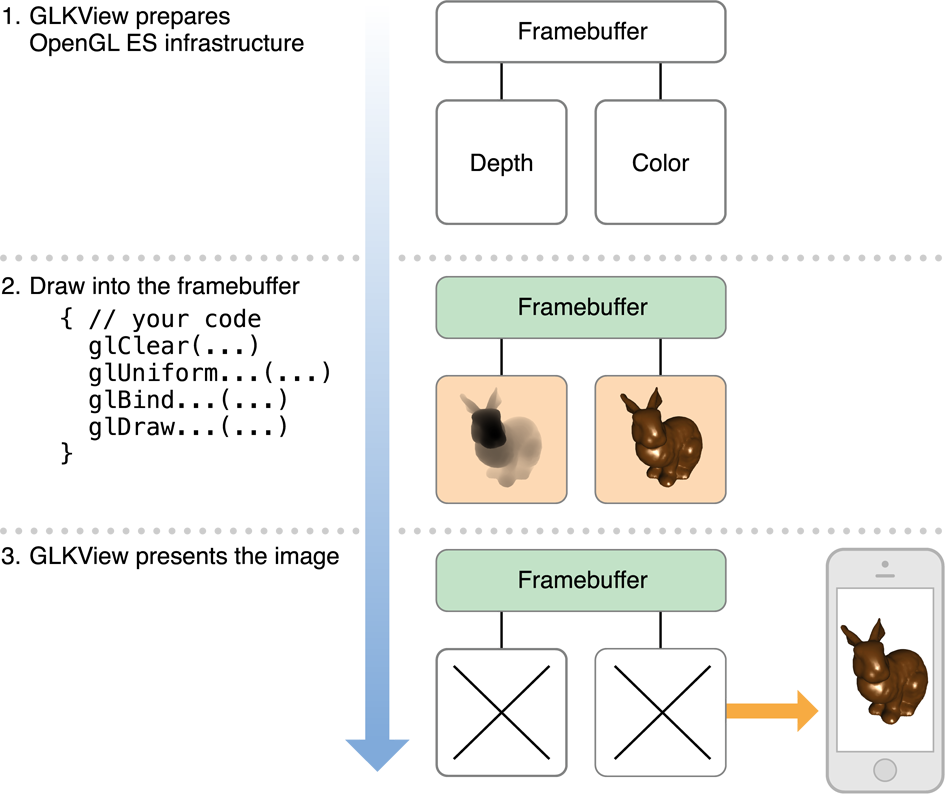

#  OpenGL ES Programming Guide - OpenGL ES 编程指引

翻译自英文完整版 https://developer.apple.com/library/archive/documentation/3DDrawing/Conceptual/OpenGLES_ProgrammingGuide/Introduction/Introduction.html#//apple_ref/doc/uid/TP40008793-CH1-SW1

## About OpenGL ES - OpenGL ES 概述

> The Open Graphics Library (OpenGL) is used for visualizing 2D and 3D data. It is a multipurpose open-standard graphics library that supports applications for 2D and 3D digital content creation, mechanical and architectural design, virtual prototyping, flight simulation, video games, and more. You use OpenGL to configure a 3D graphics pipeline and submit data to it. Vertices are transformed and lit, assembled into primitives, and rasterized to create a 2D image. OpenGL is designed to translate function calls into graphics commands that can be sent to underlying graphics hardware. Because this underlying hardware is dedicated to processing graphics commands, OpenGL drawing is typically very fast.
>
> OpenGL for Embedded Systems (OpenGL ES) is a simplified version of OpenGL that eliminates redundant functionality to provide a library that is both easier to learn and easier to implement in mobile graphics hardware.

Open Graphics Library (OpenGL) 用来可视化 2D 与 3D 数据。它是一个多用途的开放标准图形库，支持 2D 和 3D 数字内容创建、机械和建筑设计、虚拟原型设计、飞行模拟、视频游戏等应用。你可以使用 OpenGL 配置 3D 图形管线并向其提交数据。顶点数据经过变换组装成图元，经过光栅化创建出 2D 图像。OpenGL 旨在将函数调用转换为可以发送到底层图形硬件的图形命令。因为此底层硬件专用于处理图形命令，因此 OpenGL 绘制通常非常快。

OpenGL for Embedded Systems (OpenGL ES) 是 OpenGL 的简化版本，它消除了冗余功能，提供了一个既易于学习更易于在移动图形硬件上实现的库。


### At a Glance - 摘要

> OpenGL ES allows an app to harness the power of the underlying graphics processor. The GPU on iOS devices can perform sophisticated 2D and 3D drawing, as well as complex shading calculations on every pixel in the final image. You should use OpenGL ES if the design requirements of your app call for the most direct and comprehensive access possible to GPU hardware. Typical clients for OpenGL ES include video games and simulations that present 3D graphics.
>
> OpenGL ES is a low-level, hardware-focused API. Though it provides the most powerful and flexible graphics processing tools, it also has a steep learning curve and a significant effect on the overall design of your app. For apps that require high-performance graphics for more specialized uses, iOS provides several higher-level frameworks:
>
> - The Sprite Kit framework provides a hardware-accelerated animation system optimized for creating 2D games. (See [SpriteKit Programming Guide](https://developer.apple.com/library/archive/documentation/GraphicsAnimation/Conceptual/SpriteKit_PG/Introduction/Introduction.html#//apple_ref/doc/uid/TP40013043).)
> - The Core Image framework provides real-time filtering and analysis for still and video images. (See [Core Image Programming Guide](https://developer.apple.com/library/archive/documentation/GraphicsImaging/Conceptual/CoreImaging/ci_intro/ci_intro.html#//apple_ref/doc/uid/TP30001185).)
> - Core Animation provides the hardware-accelerated graphics rendering and animation infrastructure for all iOS apps, as well as a simple declarative programming model that makes it simple to implement sophisticated user interface animations. (See [Core Animation Programming Guide](https://developer.apple.com/library/archive/documentation/Cocoa/Conceptual/CoreAnimation_guide/Introduction/Introduction.html#//apple_ref/doc/uid/TP40004514).)
> - You can add animation, physics-based dynamics, and other special effects to Cocoa Touch user interfaces using features in the UIKit framework.

OpenGL 允许应用程序利用底层图形处理器的强大功能。iOS 设备上的 GPU 可以执行复杂的 2D 和 3D 绘图，以及最终图像中每个像素的复杂着色计算。如果你的应用程序的设计要求需要最直接和全面的 GPU 硬件访问，你应该使用 OpenGL ES 。OpenGL ES 的典型客户包括呈现 3D 图形的视频游戏和模拟。

OpenGL ES 是一种底层，以硬件为重点的 API 。虽然它提供了最强大和最灵活的图形处理工具，但它也具有陡峭的学习曲线，并对应用程序的整体设计产生重大影响。对于需要高性能图形以用于更专业用途的应用程序，iOS 提供了几个更高级别的框架：

- Sprite Kit 框架提供了一个硬件加速动画系统，该系统针对创建 2D 游戏进行了优化。（见 [SpriteKit Programming Guide](https://developer.apple.com/library/archive/documentation/GraphicsAnimation/Conceptual/SpriteKit_PG/Introduction/Introduction.html#//apple_ref/doc/uid/TP40013043) ）
- Core Image 框架为静态和视频图像提供实时滤镜和分析。（见 [Core Image Programming Guide](https://developer.apple.com/library/archive/documentation/GraphicsImaging/Conceptual/CoreImaging/ci_intro/ci_intro.html#//apple_ref/doc/uid/TP30001185) ）
- Core Animation 为所有 iOS 应用程序提供硬件加速的图形渲染和动画基础架构，以及简单的声明性编程模型，使得实现复杂的用户界面动画变得简单。（见 [Core Animation Programming Guide](https://developer.apple.com/library/archive/documentation/Cocoa/Conceptual/CoreAnimation_guide/Introduction/Introduction.html#//apple_ref/doc/uid/TP40004514) ）
- 你可以使用 UIKit 框架中的功能向 Cocoa Touch 用户界面添加动画，基于物理的动态和其他特殊效果。

#### OpenGL ES Is a Platform-Neutral API Implemented in iOS

> Because OpenGL ES is a C-based API, it is extremely portable and widely supported. As a C API, it integrates seamlessly with Objective-C Cocoa Touch apps. The OpenGL ES specification does not define a windowing layer; instead, the hosting operating system must provide functions to create an OpenGL ES rendering context, which accepts commands, and a framebuffer, where the results of any drawing commands are written to. Working with OpenGL ES on iOS requires using iOS classes to set up and present a drawing surface and using platform-neutral API to render its contents.
>
> Relevant Chapters: [Checklist for Building OpenGL ES Apps for iOS](https://developer.apple.com/library/archive/documentation/3DDrawing/Conceptual/OpenGLES_ProgrammingGuide/OpenGLESontheiPhone/OpenGLESontheiPhone.html#//apple_ref/doc/uid/TP40008793-CH101-SW1), [Configuring OpenGL ES Contexts](https://developer.apple.com/library/archive/documentation/3DDrawing/Conceptual/OpenGLES_ProgrammingGuide/WorkingwithOpenGLESContexts/WorkingwithOpenGLESContexts.html#//apple_ref/doc/uid/TP40008793-CH2-SW1)

由于 OpenGL ES 是基于 C 的 API ，因此它是可移植且受到广泛支持的。作为 C API ，它与 Objective-C Cocoa Touch 应用程序无缝集成。OpenGL ES 规范没有定义窗口层；相反，托管操作系统必须提供函数来创建一个接收命令的 OpenGL ES 渲染上下文和一个 framebuffer ，其中任何绘图命令的结果写入该缓冲区。在 iOS 上使用 OpenGL ES 需要使用 iOS 类来设置和呈现绘图表面，并使用与平台无关的 API 来渲染其内容。

相关章节：[Checklist for Building OpenGL ES Apps for iOS](https://developer.apple.com/library/archive/documentation/3DDrawing/Conceptual/OpenGLES_ProgrammingGuide/OpenGLESontheiPhone/OpenGLESontheiPhone.html#//apple_ref/doc/uid/TP40008793-CH101-SW1)，[Configuring OpenGL ES Contexts](https://developer.apple.com/library/archive/documentation/3DDrawing/Conceptual/OpenGLES_ProgrammingGuide/WorkingwithOpenGLESContexts/WorkingwithOpenGLESContexts.html#//apple_ref/doc/uid/TP40008793-CH2-SW1)

#### GLKit Provides a Drawing Surface and Animation Support

> Views and view controllers, defined by the UIKit framework, control the presentation of visual content on iOS. The GLKit framework provides OpenGL ES–aware versions of these classes. When you develop an OpenGL ES app, you use a [GLKView](https://developer.apple.com/documentation/glkit/glkview) object to render your OpenGL ES content. You can also use a [GLKViewController](https://developer.apple.com/documentation/glkit/glkviewcontroller) object to manage your view and support animating its contents.
>
> Relevant Chapters: [Drawing with OpenGL ES and GLKit](https://developer.apple.com/library/archive/documentation/3DDrawing/Conceptual/OpenGLES_ProgrammingGuide/DrawingWithOpenGLES/DrawingWithOpenGLES.html#//apple_ref/doc/uid/TP40008793-CH503-SW1)

由 UIKit 框架定义的视图和视图控制器控制 iOS 上可视内容的呈现。GLKit 框架提供这些类的 OpenGL ES 感知版本。在开发 OpenGL ES 应用程序时，可以使用 [GLKView](https://developer.apple.com/documentation/glkit/glkview) 对象来呈现 OpenGL ES 内容。还可以使用 [GLKViewController](https://developer.apple.com/documentation/glkit/glkviewcontroller) 对象来管理视图并支持在其内容上做动画。

相关章节：[Drawing with OpenGL ES and GLKit](https://developer.apple.com/library/archive/documentation/3DDrawing/Conceptual/OpenGLES_ProgrammingGuide/DrawingWithOpenGLES/DrawingWithOpenGLES.html#//apple_ref/doc/uid/TP40008793-CH503-SW1)

#### iOS Supports Alternative Rendering Targets

> Besides drawing content to fill an entire screen or part of a view hierarchy, you can also use OpenGL ES framebuffer objects for other rendering strategies. iOS implements standard OpenGL ES framebuffer objects, which you can use for rendering to an offscreen buffer or to a texture for use elsewhere in an OpenGL ES scene. In addition, OpenGL ES on iOS supports rendering to a Core Animation layer (the [CAEAGLLayer](https://developer.apple.com/documentation/quartzcore/caeagllayer) class), which you can then combine with other layers to build your app’s user interface or other visual displays.
>
> Relevant Chapters: [Drawing to Other Rendering Destinations](https://developer.apple.com/library/archive/documentation/3DDrawing/Conceptual/OpenGLES_ProgrammingGuide/WorkingwithEAGLContexts/WorkingwithEAGLContexts.html#//apple_ref/doc/uid/TP40008793-CH103-SW1)

除了绘制内容以填充整个屏幕或视图层次结构的一部分之外，还可以将 OpenGL ES 帧缓冲区对象用于其他渲染策略。iOS 实现了标准的 OpenGL ES 帧缓冲对象，你可以将其用于渲染到离屏缓冲区或纹理以供 OpenGL ES 场景中的其他地方使用。 此外，iOS 上的 OpenGL ES 支持渲染到 Core Animation layer（ [CAEAGLLayer](https://developer.apple.com/documentation/quartzcore/caeagllayer) 类），然后你可以将其与其他图层组合以构建应用程序的用户界面或其他可视化显示。

相关章节：[Drawing to Other Rendering Destinations](https://developer.apple.com/library/archive/documentation/3DDrawing/Conceptual/OpenGLES_ProgrammingGuide/WorkingwithEAGLContexts/WorkingwithEAGLContexts.html#//apple_ref/doc/uid/TP40008793-CH103-SW1)

#### Apps Require Additional Performance Tuning

> Graphics processors are parallelized devices optimized for graphics operations. To get great performance in your app, you must carefully design your app to feed data and commands to OpenGL ES so that the graphics hardware runs in parallel with your app. A poorly tuned app forces either the CPU or the GPU to wait for the other to finish processing commands.
>
> You should design your app to efficiently use the OpenGL ES API. Once you have finished building your app, use Instruments to fine tune your app’s performance. If your app is bottlenecked inside OpenGL ES, use the information provided in this guide to optimize your app’s performance.
>
> Xcode provides tools to help you improve the performance of your OpenGL ES apps.
>
> Relevant Chapters: [OpenGL ES Design Guidelines](https://developer.apple.com/library/archive/documentation/3DDrawing/Conceptual/OpenGLES_ProgrammingGuide/OpenGLESApplicationDesign/OpenGLESApplicationDesign.html#//apple_ref/doc/uid/TP40008793-CH6-SW1), [Best Practices for Working with Vertex Data](https://developer.apple.com/library/archive/documentation/3DDrawing/Conceptual/OpenGLES_ProgrammingGuide/TechniquesforWorkingwithVertexData/TechniquesforWorkingwithVertexData.html#//apple_ref/doc/uid/TP40008793-CH107-SW1), [Best Practices for Working with Texture Data](https://developer.apple.com/library/archive/documentation/3DDrawing/Conceptual/OpenGLES_ProgrammingGuide/TechniquesForWorkingWithTextureData/TechniquesForWorkingWithTextureData.html#//apple_ref/doc/uid/TP40008793-CH104-SW1), [Best Practices for Shaders](https://developer.apple.com/library/archive/documentation/3DDrawing/Conceptual/OpenGLES_ProgrammingGuide/BestPracticesforShaders/BestPracticesforShaders.html#//apple_ref/doc/uid/TP40008793-CH7-SW3), [Tuning Your OpenGL ES App](https://developer.apple.com/library/archive/documentation/3DDrawing/Conceptual/OpenGLES_ProgrammingGuide/Performance/Performance.html#//apple_ref/doc/uid/TP40008793-CH105-SW1)

图形处理器是针对图形操作优化的并行设备。要在你的应用中获得出色的性能，你必须仔细设计你的应用以向 OpenGL ES 提供数据和命令，以便图形硬件与你的应用并行运行。调整不佳的应用程序会强制 CPU 或 GPU 等待另一个完成处理命令。

你应该设计你的应用程序以有效地使用 OpenGL ES API 。完成应用程序构建后，使用 Instruments 调整应用程序的性能。如果你的应用程序在 OpenGL ES 中存在瓶颈，请使用本指南中提供的信息来优化应用程序的性能。

Xcode 提供的工具可以帮助你提高 OpenGL ES 应用程序的性能。

相关章节：[OpenGL ES Design Guidelines](https://developer.apple.com/library/archive/documentation/3DDrawing/Conceptual/OpenGLES_ProgrammingGuide/OpenGLESApplicationDesign/OpenGLESApplicationDesign.html#//apple_ref/doc/uid/TP40008793-CH6-SW1)，[Best Practices for Working with Vertex Data](https://developer.apple.com/library/archive/documentation/3DDrawing/Conceptual/OpenGLES_ProgrammingGuide/TechniquesforWorkingwithVertexData/TechniquesforWorkingwithVertexData.html#//apple_ref/doc/uid/TP40008793-CH107-SW1)，[Best Practices for Working with Texture Data](https://developer.apple.com/library/archive/documentation/3DDrawing/Conceptual/OpenGLES_ProgrammingGuide/TechniquesForWorkingWithTextureData/TechniquesForWorkingWithTextureData.html#//apple_ref/doc/uid/TP40008793-CH104-SW1)，[Best Practices for Shaders](https://developer.apple.com/library/archive/documentation/3DDrawing/Conceptual/OpenGLES_ProgrammingGuide/BestPracticesforShaders/BestPracticesforShaders.html#//apple_ref/doc/uid/TP40008793-CH7-SW3)，[Tuning Your OpenGL ES App](https://developer.apple.com/library/archive/documentation/3DDrawing/Conceptual/OpenGLES_ProgrammingGuide/Performance/Performance.html#//apple_ref/doc/uid/TP40008793-CH105-SW1)

#### OpenGL ES May Not Be Used in Background Apps

> Apps that are running in the background may not call OpenGL ES functions. If your app accesses the graphics processor while it is in the background, it is automatically terminated by iOS. To avoid this, your app should flush any pending commands previously submitted to OpenGL ES prior to being moved into the background and avoid calling OpenGL ES until it is moved back to the foreground.
>
> Relevant Chapters: [Multitasking, High Resolution, and Other iOS Features](https://developer.apple.com/library/archive/documentation/3DDrawing/Conceptual/OpenGLES_ProgrammingGuide/ImplementingaMultitasking-awareOpenGLESApplication/ImplementingaMultitasking-awareOpenGLESApplication.html#//apple_ref/doc/uid/TP40008793-CH5-SW1)

在后台运行的应用程序可能无法调用 OpenGL ES 函数。如果你的应用程序在后台运行时访问图形处理器，它将自动由 iOS 终止。为了避免这种情况，你的应用程序应该在移动到后台之前 flush 先前提交给 OpenGL ES 的任何待处理命令，并避免在将其移回前台之前调用 OpenGL ES 。

相关章节：[Multitasking, High Resolution, and Other iOS Features](https://developer.apple.com/library/archive/documentation/3DDrawing/Conceptual/OpenGLES_ProgrammingGuide/ImplementingaMultitasking-awareOpenGLESApplication/ImplementingaMultitasking-awareOpenGLESApplication.html#//apple_ref/doc/uid/TP40008793-CH5-SW1)

#### OpenGL ES Places Additional Restrictions on Multithreaded Apps

> Designing apps to take advantage of concurrency can be useful to help improve your app’s performance. If you intend to add concurrency to an OpenGL ES app, you must ensure that it does not access the same context from two different threads at the same time.
>
> Relevant Chapters: [Concurrency and OpenGL ES](https://developer.apple.com/library/archive/documentation/3DDrawing/Conceptual/OpenGLES_ProgrammingGuide/ConcurrencyandOpenGLES/ConcurrencyandOpenGLES.html#//apple_ref/doc/uid/TP40008793-CH409-SW2)

利用并发性设计应用程序可以帮助提高应用程序的性能。如果你打算为 OpenGL ES 应用程序添加并发性，则必须确保它不会同时从两个不同的线程访问相同的上下文。

相关章节：[Concurrency and OpenGL ES](https://developer.apple.com/library/archive/documentation/3DDrawing/Conceptual/OpenGLES_ProgrammingGuide/ConcurrencyandOpenGLES/ConcurrencyandOpenGLES.html#//apple_ref/doc/uid/TP40008793-CH409-SW2)

### How to Use This Document

> Begin by reading the first three chapters: [Checklist for Building OpenGL ES Apps for iOS](https://developer.apple.com/library/archive/documentation/3DDrawing/Conceptual/OpenGLES_ProgrammingGuide/OpenGLESontheiPhone/OpenGLESontheiPhone.html#//apple_ref/doc/uid/TP40008793-CH101-SW1), [Configuring OpenGL ES Contexts](https://developer.apple.com/library/archive/documentation/3DDrawing/Conceptual/OpenGLES_ProgrammingGuide/WorkingwithOpenGLESContexts/WorkingwithOpenGLESContexts.html#//apple_ref/doc/uid/TP40008793-CH2-SW1), [Drawing with OpenGL ES and GLKit](https://developer.apple.com/library/archive/documentation/3DDrawing/Conceptual/OpenGLES_ProgrammingGuide/DrawingWithOpenGLES/DrawingWithOpenGLES.html#//apple_ref/doc/uid/TP40008793-CH503-SW1). These chapters provide an overview of how OpenGL ES integrates into iOS and all the details necessary to get your first OpenGL ES apps up and running on an iOS device.
>
> If you’re familiar with the basics of using OpenGL ES in iOS, read [Drawing to Other Rendering Destinations](https://developer.apple.com/library/archive/documentation/3DDrawing/Conceptual/OpenGLES_ProgrammingGuide/WorkingwithEAGLContexts/WorkingwithEAGLContexts.html#//apple_ref/doc/uid/TP40008793-CH103-SW1) and [Multitasking, High Resolution, and Other iOS Features](https://developer.apple.com/library/archive/documentation/3DDrawing/Conceptual/OpenGLES_ProgrammingGuide/ImplementingaMultitasking-awareOpenGLESApplication/ImplementingaMultitasking-awareOpenGLESApplication.html#//apple_ref/doc/uid/TP40008793-CH5-SW1) for important platform-specific guidelines. Developers familiar with using OpenGL ES in iOS versions before 5.0 should study [Drawing with OpenGL ES and GLKit](https://developer.apple.com/library/archive/documentation/3DDrawing/Conceptual/OpenGLES_ProgrammingGuide/DrawingWithOpenGLES/DrawingWithOpenGLES.html#//apple_ref/doc/uid/TP40008793-CH503-SW1) for details on new features for streamlining OpenGL ES development.
>
> Finally, read [OpenGL ES Design Guidelines](https://developer.apple.com/library/archive/documentation/3DDrawing/Conceptual/OpenGLES_ProgrammingGuide/OpenGLESApplicationDesign/OpenGLESApplicationDesign.html#//apple_ref/doc/uid/TP40008793-CH6-SW1), [Tuning Your OpenGL ES App](https://developer.apple.com/library/archive/documentation/3DDrawing/Conceptual/OpenGLES_ProgrammingGuide/Performance/Performance.html#//apple_ref/doc/uid/TP40008793-CH105-SW1), and the following chapters to dig deeper into how to design efficient OpenGL ES apps.
>
> Unless otherwise noted, OpenGL ES code examples in this book target OpenGL ES 3.0. You may need to make changes to use these code examples with other OpenGL ES versions.

首先阅读前三章：[Checklist for Building OpenGL ES Apps for iOS](https://developer.apple.com/library/archive/documentation/3DDrawing/Conceptual/OpenGLES_ProgrammingGuide/OpenGLESontheiPhone/OpenGLESontheiPhone.html#//apple_ref/doc/uid/TP40008793-CH101-SW1)，[Configuring OpenGL ES Contexts](https://developer.apple.com/library/archive/documentation/3DDrawing/Conceptual/OpenGLES_ProgrammingGuide/WorkingwithOpenGLESContexts/WorkingwithOpenGLESContexts.html#//apple_ref/doc/uid/TP40008793-CH2-SW1)， [Drawing with OpenGL ES and GLKit](https://developer.apple.com/library/archive/documentation/3DDrawing/Conceptual/OpenGLES_ProgrammingGuide/DrawingWithOpenGLES/DrawingWithOpenGLES.html#//apple_ref/doc/uid/TP40008793-CH503-SW1) 。这些章节概述了 OpenGL ES 如何集成到 iOS 中，以及在 iOS 设备上启动和运行首个 OpenGL ES 应用程序所需的所有详细信息。

如果你熟悉在 iOS 中使用 OpenGL ES 的基础知识，请阅读 [Drawing to Other Rendering Destinations](https://developer.apple.com/library/archive/documentation/3DDrawing/Conceptual/OpenGLES_ProgrammingGuide/WorkingwithEAGLContexts/WorkingwithEAGLContexts.html#//apple_ref/doc/uid/TP40008793-CH103-SW1) 和[Multitasking, High Resolution, and Other iOS Features](https://developer.apple.com/library/archive/documentation/3DDrawing/Conceptual/OpenGLES_ProgrammingGuide/ImplementingaMultitasking-awareOpenGLESApplication/ImplementingaMultitasking-awareOpenGLESApplication.html#//apple_ref/doc/uid/TP40008793-CH5-SW1) ，以获取重要的平台特定指南。熟悉在 5.0 之前的 iOS 版本中使用 OpenGL ES 的开发人员应该学习 [Drawing with OpenGL ES and GLKit](https://developer.apple.com/library/archive/documentation/3DDrawing/Conceptual/OpenGLES_ProgrammingGuide/DrawingWithOpenGLES/DrawingWithOpenGLES.html#//apple_ref/doc/uid/TP40008793-CH503-SW1) ，以获得有关简化 OpenGL ES 开发的新功能的详细信息。

最后，阅读 [OpenGL ES Design Guidelines](https://developer.apple.com/library/archive/documentation/3DDrawing/Conceptual/OpenGLES_ProgrammingGuide/OpenGLESApplicationDesign/OpenGLESApplicationDesign.html#//apple_ref/doc/uid/TP40008793-CH6-SW1)，[Tuning Your OpenGL ES App](https://developer.apple.com/library/archive/documentation/3DDrawing/Conceptual/OpenGLES_ProgrammingGuide/Performance/Performance.html#//apple_ref/doc/uid/TP40008793-CH105-SW1) 以及以下章节，深入探讨如何设计高效的 OpenGL ES 应用程序。

除非另有说明，否则本书中的 OpenGL ES 代码示例将以 OpenGL ES 3.0 为目标。如果结合其他 OpenGL ES 版本来使用这些代码示例的话，你可能需要对代码进行一定的更改。

### Prerequisites

> Before attempting use OpenGL ES, you should already be familiar with general iOS app architecture. See [Start Developing iOS Apps Today (Retired)](https://developer.apple.com/library/archive/referencelibrary/GettingStarted/RoadMapiOS-Legacy/index.html#//apple_ref/doc/uid/TP40011343).
>
> This document is not a complete tutorial or a reference for the cross-platform OpenGL ES API. To learn more about OpenGL ES, consult the references below.

在尝试使用 OpenGL ES 之前，你应该已经熟悉一般的 iOS 应用程序架构。见 [Start Developing iOS Apps Today (Retired)](https://developer.apple.com/library/archive/referencelibrary/GettingStarted/RoadMapiOS-Legacy/index.html#//apple_ref/doc/uid/TP40011343)。

本文档不是跨平台 OpenGL ES API 的完整教程或参考。要了解有关 OpenGL ES 的更多信息，请参阅以下参考资料。

### See Also

> OpenGL ES is an open standard defined by the Khronos Group. For more information about the OpenGL ES standard, please consult their web page at [http://www.khronos.org/opengles/](http://www.khronos.org/opengles/).
>
> - *OpenGL® ES 3.0 Programming Guide*, published by Addison-Wesley, provides a comprehensive introduction to OpenGL ES concepts.
> - *OpenGL® Shading Language, Third Edition*, also published by Addison-Wesley, provides many shading algorithms useable in your OpenGL ES app. You may need to modify some of these algorithms to run efficiently on mobile graphics processors.
> - [OpenGL ES API Registry](http://www.khronos.org/registry/gles/) is the official repository for the OpenGL ES specifications, the OpenGL ES shading language specifications, and documentation for OpenGL ES extensions.
> - [OpenGL ES Framework Reference](https://developer.apple.com/documentation/opengles) describes the platform-specific functions and classes provided by Apple to integrate OpenGL ES into iOS.
> - [iOS Device Compatibility Reference](https://developer.apple.com/library/archive/documentation/DeviceInformation/Reference/iOSDeviceCompatibility/Introduction/Introduction.html#//apple_ref/doc/uid/TP40013599) provides more detailed information on the hardware and software features available to your app.
> - [GLKit Framework Reference](https://developer.apple.com/documentation/glkit) describes a framework provided by Apple to make it easier to develop OpenGL ES 2.0 and 3.0 apps.

OpenGL ES 是 Khronos Group 定义的开放标准。有关 OpenGL ES 标准的更多信息，请访问他们的网页 [http://www.khronos.org/opengles/](http://www.khronos.org/opengles/) 。

- 由 Addison-Wesley 出版的 *OpenGL® ES 3.0 Programming Guide* 提供了对 OpenGL ES 概念的全面介绍。
- 由 Addison-Wesley 出版的 *OpenGL® Shading Language, Third Edition* ，提供了许多可用于 OpenGL ES 应用程序的着色算法。你可能需要修改其中一些算法才能在移动图形处理器上高效运行。
- [OpenGL ES API Registry](http://www.khronos.org/registry/gles/) 是 OpenGL ES 规范、OpenGL ES 着色语言规范以及 OpenGL ES 扩展文档的官方知识库。
- [OpenGL ES Framework Reference](https://developer.apple.com/documentation/opengles) 描述了 Apple 提供的用于将 OpenGL ES 集成到 iOS 中的特定于平台的功能和类。
- [iOS Device Compatibility Reference](https://developer.apple.com/library/archive/documentation/DeviceInformation/Reference/iOSDeviceCompatibility/Introduction/Introduction.html#//apple_ref/doc/uid/TP40013599) 提供有关应用程序可用的硬件和软件功能的更多详细信息。
- [GLKit Framework Reference](https://developer.apple.com/documentation/glkit) 描述了 Apple 提供的框架，使用该框架可以更容易地开发 OpenGL ES 2.0 和 3.0 应用程序。

## Checklist for Building OpenGL ES Apps for iOS

> The OpenGL ES specification defines a platform-neutral API for using GPU hardware to render graphics. Platforms implementing OpenGL ES provide a rendering context for executing OpenGL ES commands, framebuffers to hold rendering results, and one or more rendering destinations that present the contents of a framebuffer for display. In iOS, the [EAGLContext](https://developer.apple.com/documentation/opengles/eaglcontext) class implements a rendering context. iOS provides only one type of framebuffer, the OpenGL ES framebuffer object, and the [GLKView](https://developer.apple.com/documentation/glkit/glkview) and [CAEAGLLayer](https://developer.apple.com/documentation/quartzcore/caeagllayer) classes implement rendering destinations.
>
> Building an OpenGL ES app in iOS requires several considerations, some of which are generic to OpenGL ES programming and some of which are specific to iOS. Follow this checklist and the detailed sections below to get started:
>
> 1. Determine which version(s) of OpenGL ES have the right feature set for your app, and create an OpenGL ES context.
> 2. Verify at runtime that the device supports the OpenGL ES capabilities you want to use.
> 3. Choose where to render your OpenGL ES content.
> 4. Make sure your app runs correctly in iOS.
> 5. Implement your rendering engine.
> 6. Use Xcode and Instruments to debug your OpenGL ES app and tune it for optimal performance .

OpenGL ES 规范定义了一个平台无关的 API ，用于使用 GPU 硬件渲染图形。实现 OpenGL ES 的平台提供用于执行 OpenGL ES 命令的渲染上下文，用于保存渲染结果的帧缓冲区，以及用于显示帧缓冲区内容的一个或多个渲染目的地。在 iOS 中，[EAGLContext](https://developer.apple.com/documentation/opengles/eaglcontext) 类实现了渲染上下文。iOS 仅提供一种类型的帧缓冲，OpenGL ES 帧缓冲对象，[GLKView](https://developer.apple.com/documentation/glkit/glkview) 和 [CAEAGLLayer](https://developer.apple.com/documentation/quartzcore/caeagllayer) 类实现渲染目标。

在 iOS 中构建 OpenGL ES 应用程序需要考虑几个因素，其中一些是 OpenGL ES 编程的通用代码，其中一些特定于 iOS 。按照此清单和下面的详细部分开始：

1. 确定哪个版本的 OpenGL ES 具有适合应用的功能集，并创建 OpenGL ES 上下文。
2. 在运行时验证设备是否支持你要使用的 OpenGL ES 功能。
3. 选择 OpenGL ES 内容渲染的位置。
4. 确保你的应用在 iOS 中正常运行。
5. 实现渲染引擎。
6. 使用 Xcode 和 Instruments 调试 OpenGL ES 应用程序并对其进行调整以获得最佳性能。

### Choosing Which OpenGL ES Versions to Support

> Decide whether your app should support OpenGL ES 3.0, OpenGL ES 2.0, OpenGL ES 1.1, or multiple versions.
>
> - OpenGL ES 3.0 is new in iOS 7. It adds a number of new features that enable higher performance, general-purpose GPU computing techniques, and more complex visual effects previously only possible on desktop-class hardware and game consoles.
> - OpenGL ES 2.0 is the baseline profile for iOS devices, featuring a configurable graphics pipeline based on programmable shaders.
> - OpenGL ES 1.1 provides only a basic fixed-function graphics pipeline and is available in iOS primarily for backward compatibility.
> You should target the version or versions of OpenGL ES that support the features and devices most relevant to your app. To learn more about the OpenGL ES capabilities of iOS devices, read [iOS Device Compatibility Reference](https://developer.apple.com/library/archive/documentation/DeviceInformation/Reference/iOSDeviceCompatibility/Introduction/Introduction.html#//apple_ref/doc/uid/TP40013599).

> To create contexts for the versions of OpenGL ES you plan to support, read [Configuring OpenGL ES Contexts](https://developer.apple.com/library/archive/documentation/3DDrawing/Conceptual/OpenGLES_ProgrammingGuide/WorkingwithOpenGLESContexts/WorkingwithOpenGLESContexts.html#//apple_ref/doc/uid/TP40008793-CH2-SW1). To learn how your choice of OpenGL ES version relates to the rendering algorithms you might use in your app, read [OpenGL ES Versions and Renderer Architecture](https://developer.apple.com/library/archive/documentation/3DDrawing/Conceptual/OpenGLES_ProgrammingGuide/OpenGLESApplicationDesign/OpenGLESApplicationDesign.html#//apple_ref/doc/uid/TP40008793-CH6-SW2).

确定你的应用程序是否应支持 OpenGL ES 3.0 ，OpenGL ES 2.0 ，OpenGL ES 1.1 或多个版本。

- OpenGL ES 3.0 是 iOS 7 中的新功能。它增加了许多新功能，支持更高性能，通用 GPU 计算技术，以及以前只能在桌面级硬件和游戏机上实现的更复杂的视觉效果。
- OpenGL ES 2.0 是 iOS 设备的基线配置，具有基于可编程着色器的可配置图形管道。
- OpenGL ES 1.1 仅提供基本的固定功能图形管道，主要用于向后兼容。
您应该选择支持与你的应用最相关的功能和设备的 OpenGL ES 版本。要了解有关 iOS 设备的 OpenGL ES 功能的更多信息，阅读 [iOS Device Compatibility Reference](https://developer.apple.com/library/archive/documentation/DeviceInformation/Reference/iOSDeviceCompatibility/Introduction/Introduction.html#//apple_ref/doc/uid/TP40013599) 。

要为计划支持的 OpenGL ES 版本创建上下文，阅读 [Configuring OpenGL ES Contexts](https://developer.apple.com/library/archive/documentation/3DDrawing/Conceptual/OpenGLES_ProgrammingGuide/WorkingwithOpenGLESContexts/WorkingwithOpenGLESContexts.html#//apple_ref/doc/uid/TP40008793-CH2-SW1) 。要了解你选择的 OpenGL ES 版本如何与你可能在应用程序中使用的渲染算法相关，阅读 [OpenGL ES Versions and Renderer Architecture](https://developer.apple.com/library/archive/documentation/3DDrawing/Conceptual/OpenGLES_ProgrammingGuide/OpenGLESApplicationDesign/OpenGLESApplicationDesign.html#//apple_ref/doc/uid/TP40008793-CH6-SW2) 。

### Verifying OpenGL ES Capabilities

> The [iOS Device Compatibility Reference](https://developer.apple.com/library/archive/documentation/DeviceInformation/Reference/iOSDeviceCompatibility/Introduction/Introduction.html#//apple_ref/doc/uid/TP40013599) summarizes the capabilities and extensions available on shipping iOS devices. However, to allow your app to run on as many devices and iOS versions as possible, your app should always query the OpenGL ES implementation for its capabilities at runtime.
>
> To determine implementation specific limits such as the maximum texture size or maximum number of vertex attributes, look up the value for the corresponding token (such as MAX_TEXTURE_SIZE or MAX_VERTEX_ATTRIBS, as found in the gl.h header) using the appropriate glGet function for its data type.
>
> To check for OpenGL ES 3.0 extensions, use the glGetIntegerv and glGetStringi functions as in the following code example:

[iOS Device Compatibility Reference](https://developer.apple.com/library/archive/documentation/DeviceInformation/Reference/iOSDeviceCompatibility/Introduction/Introduction.html#//apple_ref/doc/uid/TP40013599) 总结了 iOS 设备上可用的功能和扩展。但是，要允许你的应用程序在尽可能多的设备和 iOS 版本上运行，你的应用程序应始终在运行时查询 OpenGL ES 实现的功能。

要确定特定于实现的限制（例如最大纹理大小或顶点属性的最大数量），使用与其数据类型适合的 glGet 函数查询相应 token （例如，在 gl.h 头文件中声明的 MAX_TEXTURE_SIZE 或 MAX_VERTEX_ATTRIBS ）的值。

要检查 OpenGL ES 3.0 扩展，使用 glGetIntegerv 和 glGetStringi 函数，如以下代码示例所示：

```objc
BOOL CheckForExtension(NSString *searchName)
{
    // Create a set containing all extension names.
    // (For better performance, create the set only once and cache it for future use.)
    int max = 0;
    glGetIntegerv(GL_NUM_EXTENSIONS, &max);
    NSMutableSet *extensions = [NSMutableSet set];
    for (int i = 0; i < max; i++) {
        [extensions addObject: @( (char *)glGetStringi(GL_EXTENSIONS, i) )];
    }
    return [extensions containsObject: searchName];
}
```

> To check for OpenGL ES 1.1 and 2.0 extensions, call glGetString(GL_EXTENSIONS) to get a space-delimited list of all extension names.

要检查 OpenGL ES 1.1 和 2.0 扩展，调用 glGetString（GL_EXTENSIONS）以获取所有扩展名的以空格分隔的列表。

### Choosing a Rendering Destination

> In iOS, a framebuffer object stores the results of drawing commands. (iOS does not implement window-system-provided framebuffers.) You can use the contents of a framebuffer object in multiple ways:
>
> - The GLKit framework provides a view that draws OpenGL ES content and manages its own framebuffer object, and a view controller that supports animating OpenGL ES content. Use these classes to create full screen views or to fit your OpenGL ES content into a UIKit view hierarchy. To learn about these classes, read [Drawing with OpenGL ES and GLKit](https://developer.apple.com/library/archive/documentation/3DDrawing/Conceptual/OpenGLES_ProgrammingGuide/DrawingWithOpenGLES/DrawingWithOpenGLES.html#//apple_ref/doc/uid/TP40008793-CH503-SW1).
> - The [CAEAGLLayer](https://developer.apple.com/documentation/quartzcore/caeagllayer) class provides a way to draw OpenGL ES content as part of a Core Animation layer composition. You must create your own framebuffer object when using this class.
> - As with any OpenGL ES implementation, you can also use framebuffers for offscreen graphics processing or rendering to a texture for use elsewhere in the graphics pipeline. With OpenGL ES 3.0, offscreen buffers can be used in rendering algorithms that utilize multiple render targets.

> To learn about rendering to an offscreen buffer, a texture, or a Core Animation layer, read [Drawing to Other Rendering Destinations](https://developer.apple.com/library/archive/documentation/3DDrawing/Conceptual/OpenGLES_ProgrammingGuide/WorkingwithEAGLContexts/WorkingwithEAGLContexts.html#//apple_ref/doc/uid/TP40008793-CH103-SW1).

在 iOS 中，帧缓冲对象存储绘图命令的结果。（ iOS 不实现窗口系统提供的帧缓冲区。）可以通过多种方式使用帧缓冲区对象的内容：

- GLKit 框架提供了一个视图，用于绘制 OpenGL ES 内容并管理自己的帧缓冲对象，以及一个支持动画 OpenGL ES 内容的视图控制器。使用这些类可以创建全屏视图或使 OpenGL ES 内容融入 UIKit 视图层次结构。要了解这些类，见 [Drawing with OpenGL ES and GLKit](https://developer.apple.com/library/archive/documentation/3DDrawing/Conceptual/OpenGLES_ProgrammingGuide/DrawingWithOpenGLES/DrawingWithOpenGLES.html#//apple_ref/doc/uid/TP40008793-CH503-SW1) 。
- [CAEAGLLayer](https://developer.apple.com/documentation/quartzcore/caeagllayer) 类提供了一种将 OpenGL ES 内容作为 Core Animation layer 组件渲染的方式。使用此类时，必须创建自己的 framebuffer 对象。
- 与任何 OpenGL ES 实现一样，你也可以使用 framebuffers 进行离屏图形处理或渲染到纹理，以便在图形管道中的其他位置使用。使用 OpenGL ES 3.0 ，可以在使用多个渲染目标的渲染算法中使用离屏缓冲区。

要了解有关渲染到屏幕外缓冲区，纹理或核心动画层的信息，见 [Drawing to Other Rendering Destinations](https://developer.apple.com/library/archive/documentation/3DDrawing/Conceptual/OpenGLES_ProgrammingGuide/WorkingwithEAGLContexts/WorkingwithEAGLContexts.html#//apple_ref/doc/uid/TP40008793-CH103-SW1) 。

### Integrating with iOS

> iOS apps support multitasking by default, but handling this feature correctly in an OpenGL ES app requires additional consideration. Improper use of OpenGL ES can result in your app being killed by the system when in the background.
>
> Many iOS devices include high-resolution displays, so your app should support multiple display sizes and resolutions.
>
> To learn about supporting these and other iOS features, read [Multitasking, High Resolution, and Other iOS Features](https://developer.apple.com/library/archive/documentation/3DDrawing/Conceptual/OpenGLES_ProgrammingGuide/ImplementingaMultitasking-awareOpenGLESApplication/ImplementingaMultitasking-awareOpenGLESApplication.html#//apple_ref/doc/uid/TP40008793-CH5-SW1).

iOS 应用程序默认支持多任务处理，但在 OpenGL ES 应用程序中正确处理此功能需要额外考虑。不正确地使用 OpenGL ES 会导致你的应用在后台时被系统杀死。

许多 iOS 设备都包含高分辨率显示器，因此你的应用应支持多种显示尺寸和分辨率。

要了解有关支持这些和其他 iOS 功能的信息，见 [Multitasking, High Resolution, and Other iOS Features](https://developer.apple.com/library/archive/documentation/3DDrawing/Conceptual/OpenGLES_ProgrammingGuide/ImplementingaMultitasking-awareOpenGLESApplication/ImplementingaMultitasking-awareOpenGLESApplication.html#//apple_ref/doc/uid/TP40008793-CH5-SW1) 。

### Implementing a Rendering Engine

> There are many possible strategies for designing your OpenGL ES drawing code, the full details of which are beyond the scope of this document. Many aspects of rendering engine design are generic to all implementations of OpenGL and OpenGL ES.
>
> To learn about design considerations important for iOS devices, read [OpenGL ES Design Guidelines](https://developer.apple.com/library/archive/documentation/3DDrawing/Conceptual/OpenGLES_ProgrammingGuide/OpenGLESApplicationDesign/OpenGLESApplicationDesign.html#//apple_ref/doc/uid/TP40008793-CH6-SW1) and [Concurrency and OpenGL ES](https://developer.apple.com/library/archive/documentation/3DDrawing/Conceptual/OpenGLES_ProgrammingGuide/ConcurrencyandOpenGLES/ConcurrencyandOpenGLES.html#//apple_ref/doc/uid/TP40008793-CH409-SW2).

设计 OpenGL ES 绘图代码有许多可能的策略，其全部细节超出了本文档的范围。渲染引擎设计的许多方面对于 OpenGL 和 OpenGL ES 的所有实现都是通用的。

要了解对 iOS 设备很重要的设计注意事项，阅读 [OpenGL ES Design Guidelines](https://developer.apple.com/library/archive/documentation/3DDrawing/Conceptual/OpenGLES_ProgrammingGuide/OpenGLESApplicationDesign/OpenGLESApplicationDesign.html#//apple_ref/doc/uid/TP40008793-CH6-SW1) 和 [Concurrency and OpenGL ES](https://developer.apple.com/library/archive/documentation/3DDrawing/Conceptual/OpenGLES_ProgrammingGuide/ConcurrencyandOpenGLES/ConcurrencyandOpenGLES.html#//apple_ref/doc/uid/TP40008793-CH409-SW2) 。

## Debugging and Profiling

> Xcode and Instruments provide a number of tools for tracking down rendering problems and analyzing OpenGL ES performance in your app.
>
> To learn more about solving problems and improving performance in your OpenGL ES app, read [Tuning Your OpenGL ES App](https://developer.apple.com/library/archive/documentation/3DDrawing/Conceptual/OpenGLES_ProgrammingGuide/Performance/Performance.html#//apple_ref/doc/uid/TP40008793-CH105-SW1).

Xcode 和 Instruments 提供了许多工具，用于跟踪渲染问题并分析应用程序中 OpenGL ES 的性能。

要了解有关解决问题和提高 OpenGL ES 应用程序性能的更多信息，请阅读 [Tuning Your OpenGL ES App](https://developer.apple.com/library/archive/documentation/3DDrawing/Conceptual/OpenGLES_ProgrammingGuide/Performance/Performance.html#//apple_ref/doc/uid/TP40008793-CH105-SW1) 。

## Configuring OpenGL ES Contexts

> Every implementation of OpenGL ES provides a way to create rendering contexts to manage the state required by the OpenGL ES specification. By placing this state in a context, multiple apps can easily share the graphics hardware without interfering with the other’s state.
>
> This chapter details how to create and configure contexts on iOS.

OpenGL ES 的每个实现都提供了一种创建渲染上下文的方法来管理 OpenGL ES 规范所需的状态。通过将此状态置于上下文中，多个应用程序可以轻松共享图形硬件而不会干扰对方的状态。

本章详细介绍了如何在 iOS 上创建和配置上下文。

### EAGL Is the iOS Implementation of an OpenGL ES Rendering Context

> Before your app can call any OpenGL ES functions, it must initialize an [EAGLContext](https://developer.apple.com/documentation/opengles/eaglcontext) object. The EAGLContext class also provides methods used to integrate OpenGL ES content with Core Animation.

在你的应用程序可以调用任何 OpenGL ES 函数之前，必须初始化一个 [EAGLContext](https://developer.apple.com/documentation/opengles/eaglcontext) 对象。EAGLContext 类还提供了用于将 OpenGL ES 内容与 Core Animation 集成的方法。

### The Current Context Is the Target for OpenGL ES Function Calls

> Every thread in an iOS app has a current context; when you call an OpenGL ES function, this is the context whose state is changed by the call.
>
> To set a thread’s current context, call the EAGLContext class method [setCurrentContext:](https://developer.apple.com/documentation/opengles/eaglcontext/1624882-setcurrentcontext) when executing on that thread.

iOS 应用中的每个线程都有一个当前上下文；当你调用 OpenGL ES 函数时，对应上下文的状态被该调用所改变。

要设置线程的当前上下文，在该线程上调用 EAGLContext 类的方法 [setCurrentContext:](https://developer.apple.com/documentation/opengles/eaglcontext/1624882-setcurrentcontext) 。

```objc
[EAGLContext setCurrentContext: myContext];
```

> Call the EAGLContext class method [currentContext](https://developer.apple.com/documentation/opengles/eaglcontext/1624880-currentcontext) to retrieve a thread’s current context.
>
> Note: If your app actively switches between two or more contexts on the same thread, call the glFlush function before setting a new context as the current context. This ensures that previously submitted commands are delivered to the graphics hardware in a timely fashion.
>
> OpenGL ES holds a strong reference to the EAGLContext object corresponding to the current context. (If you are using manual reference counting, OpenGL ES retains this object.) When you call the [setCurrentContext:](https://developer.apple.com/documentation/opengles/eaglcontext/1624882-setcurrentcontext) method to change the current context, OpenGL ES no longer references the previous context. (If you are using manual reference counting, OpenGL ES releases the EAGLContext object.) To prevent EAGLContext objects from being deallocated when not the current context, your app must keep strong references to (or retain) these objects.

调用 EAGLContext 类方法 [currentContext](https://developer.apple.com/documentation/opengles/eaglcontext/1624880-currentcontext) 来检索线程的当前上下文。

注意：如果你的应用程序在同一个线程上经常在两个或多个上下文之间进行切换，在将新上下文设置为当前上下文之前调用 glFlush 函数。这确保了先前提交的命令以及时的方式传递到图形硬件。

OpenGL ES 拥有与当前上下文对应的 EAGLContext 对象的强引用。（如果使用手动引用计数，OpenGL ES 会保留此对象。）当调用 [setCurrentContext:](https://developer.apple.com/documentation/opengles/eaglcontext/1624882-setcurrentcontext) 方法来更改当前的上下文，OpenGL ES 不再引用先前的上下文。（如果使用手动引用计数，OpenGL ES 将释放 EAGLContext 对象。）为防止 EAGLContext 对象在不是当前上下文时被释放，你的应用必须保留对这些对象的强引用（或保留）。

### Every Context Targets a Specific Version of OpenGL ES

> An [EAGLContext](https://developer.apple.com/documentation/opengles/eaglcontext) object supports only one version of OpenGL ES. For example, code written for OpenGL ES 1.1 is not compatible with an OpenGL ES 2.0 or 3.0 context. Code using core OpenGL ES 2.0 features is compatible with a OpenGL ES 3.0 context, and code designed for OpenGL ES 2.0 extensions can often be used in an OpenGL ES 3.0 context with minor changes. Many new OpenGL ES 3.0 features and increased hardware capabilities require an OpenGL ES 3.0 context.
>
> Your app decides which version of OpenGL ES to support when it creates and initializes the [EAGLContext](https://developer.apple.com/documentation/opengles/eaglcontext) object. If the device does not support the requested version of OpenGL ES, the [initWithAPI:](https://developer.apple.com/documentation/opengles/eaglcontext/1624895-initwithapi) method returns nil. Your app must test to ensure that a context was initialized successfully before using it.
>
> To support multiple versions of OpenGL ES as rendering options in your app, you should first attempt to initialize a rendering context of the newest version you want to target. If the returned object is nil, initialize a context of an older version instead. Listing 2-1 demonstrates how to do this.
>
> Listing 2-1  Supporting multiple versions of OpenGL ES in the same app

 一个 [EAGLContext](https://developer.apple.com/documentation/opengles/eaglcontext) 对象仅支持一个版本的 OpenGL ES 。例如，为 OpenGL ES 1.1 编写的代码与 OpenGL ES 2.0 或 3.0 上下文不兼容。使用核心 OpenGL ES 2.0 功能的代码与 OpenGL ES 3.0 上下文兼容，为 OpenGL ES 2.0 扩展而设计的代码通常可以在 OpenGL ES 3.0 上下文中使用，只需稍作修改即可。许多新的 OpenGL ES 3.0 功能和增强的硬件功能需要 OpenGL ES 3.0 上下文。

你的应用在创建和初始化 [EAGLContext](https://developer.apple.com/documentation/opengles/eaglcontext) 对象时决定支持哪个版本的 OpenGL ES 。如果设备不支持所请求的 OpenGL ES 版本，则 [initWithAPI:](https://developer.apple.com/documentation/opengles/eaglcontext/1624895-initwithapi) 方法返回 nil 。你的应用必须对返回值进行测试，以确保在使用之前上下文被成功初始化。

要在应用程序中支持多个版本的 OpenGL ES 作为渲染选项，你应首先尝试初始化你所面向的最新版本的渲染上下文。如果返回的对象为 nil ，则初始化旧版本的上下文。清单 2-1 演示了如何执行此操作。

清单 2-1 在同一个应用程序中支持 OpenGL ES 的多个版本

```objc
EAGLContext* CreateBestEAGLContext()
{
    EAGLContext *context = [[EAGLContext alloc] initWithAPI:kEAGLRenderingAPIOpenGLES3];
    if (context == nil) {
        context = [[EAGLContext alloc] initWithAPI:kEAGLRenderingAPIOpenGLES2];
    }
    return context;
}
```

> A context’s [API](https://developer.apple.com/documentation/opengles/eaglcontext/1624885-api) property states which version of OpenGL ES the context supports. Your app should test the context’s [API](https://developer.apple.com/documentation/opengles/eaglcontext/1624885-api) property and use it to choose the correct rendering path. A common pattern for implementing this behavior is to create a class for each rendering path. Your app tests the context and creates a renderer once, on initialization.

上下文的 [API](https://developer.apple.com/documentation/opengles/eaglcontext/1624885-api) 属性说明了上下文支持的 OpenGL ES 版本。你的应用应测试上下文的 [API](https://developer.apple.com/documentation/opengles/eaglcontext/1624885-api) 属性，并使用它来选择正确的渲染路径。实现此行为的常见模式是为每个渲染路径创建一个类。你的应用程序在初始化时测试上下文并一次性创建渲染器。

### An EAGL Sharegroup Manages OpenGL ES Objects for the Context

> Although the context holds the OpenGL ES state, it does not directly manage OpenGL ES objects. Instead, OpenGL ES objects are created and maintained by an [EAGLSharegroup](https://developer.apple.com/documentation/opengles/eaglsharegroup) object. Every context contains an [EAGLSharegroup](https://developer.apple.com/documentation/opengles/eaglsharegroup) object that it delegates object creation to.
>
> The advantage of a sharegroup becomes obvious when two or more contexts refer to the same sharegroup, as shown in Figure 2-1. When multiple contexts are connected to a common sharegroup, OpenGL ES objects created by any context are available on all contexts; if you bind to the same object identifier on another context than the one that created it, you reference the same OpenGL ES object. Resources are often scarce on mobile devices; creating multiple copies of the same content on multiple contexts is wasteful. Sharing common resources makes better use of the available graphics resources on the device.
>
> A sharegroup is an opaque object; it has no methods or properties that your app can call. Contexts that use the sharegroup object keep a strong reference to it.
>
> Figure 2-1  Two contexts sharing OpenGL ES objects

虽然上下文保持 OpenGL ES 状态，但它不直接管理 OpenGL ES 对象。相反，OpenGL ES 对象由 [EAGLSharegroup](https://developer.apple.com/documentation/opengles/eaglsharegroup) 对象创建和维护。每个上下文都包含一个 [EAGLSharegroup](https://developer.apple.com/documentation/opengles/eaglsharegroup) 对象，上下文将对象的创建委托给该 EAGLSharegroup 对象。

当两个或多个上下文引用同一个 sharegroup 时，sharegroup 的优势变得明显，如图 2-1 所示。当多个上下文连接到公共 sharegroup 时，任何上下文创建的 OpenGL ES 对象都可在所有上下文中使用；如果在另一个上下文而不是创建对象的上下文中绑定相同的对象标识符，则会引用相同的 OpenGL ES 对象。移动设备上的资源往往很受限；在多个上下文中创建相同内容的多个副本是浪费的。共享公共资源可以更好地利用设备上可用的图形资源。

sharegroup 是一个不透明的对象；它没有应用可以调用的方法或属性。使用 sharegroup 对象的上下文保留了对它的强引用。

图 2-1 共享 OpenGL ES 对象的两个上下文


> Sharegroups are most useful under two specific scenarios:
>
> - When most of the resources shared between the contexts are unchanging.
> - When you want your app to be able to create new OpenGL ES objects on a thread other than the main thread for the renderer. In this case, a second context runs on a separate thread and is devoted to fetching data and creating resources. After the resource is loaded, the first context can bind to the object and use it immediately. The [GLKTextureLoader](https://developer.apple.com/documentation/glkit/glktextureloader) class uses this pattern to provide asynchronous texture loading.
>
> To create multiple contexts that reference the same sharegroup, the first context is initialized by calling [initWithAPI:](https://developer.apple.com/documentation/opengles/eaglcontext/1624895-initwithapi); a sharegroup is automatically created for the context. The second and later contexts are initialized to use the first context’s sharegroup by calling the [initWithAPI:sharegroup:](https://developer.apple.com/documentation/opengles/eaglcontext/1624877-initwithapi) method instead. Listing 2-2 shows how this would work. The first context is created using the convenience function defined in [Listing 2-1](https://developer.apple.com/library/archive/documentation/3DDrawing/Conceptual/OpenGLES_ProgrammingGuide/WorkingwithOpenGLESContexts/WorkingwithOpenGLESContexts.html#//apple_ref/doc/uid/TP40008793-CH2-SW2). The second context is created by extracting the API version and sharegroup from the first context.
>
> Important: All contexts associated with the same sharegroup must use the same version of the OpenGL ES API as the initial context.
>
> Listing 2-2  Creating two contexts with a common sharegroup

Sharegroups 在两种特定情况下最有用：

- 当上下文之间共享的大多数资源保持不变时。
- 当你希望应用程序能够在除渲染主线程之外的线程上创建新的 OpenGL ES 对象时。在这种情况下，第二个上下文在单独的线程上运行，专门用于获取数据和创建资源。加载资源后，第一个上下文可以立即绑定并使用该资源。[GLKTextureLoader](https://developer.apple.com/documentation/glkit/glktextureloader) 类使用此模式提供异步纹理加载。

要创建引用同一个 sharegroup 的多个上下文，首先通过调用 [initWithAPI:](https://developer.apple.com/documentation/opengles/eaglcontext/1624895-initwithapi) 来初始化第一个上下文：将自动为该上下文创建一个 sharegroup 。通过调用 [initWithAPI:sharegroup:](https://developer.apple.com/documentation/opengles/eaglcontext/1624877-initwithapi) 方法使用第一个上下文的 sharegroup 来初始化第二个及后续的上下文。清单 2-2 显示了该项工作。第一个上下文是使用 [Listing 2-1](https://developer.apple.com/library/archive/documentation/3DDrawing/Conceptual/OpenGLES_ProgrammingGuide/WorkingwithOpenGLESContexts/WorkingwithOpenGLESContexts.html#//apple_ref/doc/uid/TP40008793-CH2-SW2) 中定义的便捷函数创建的。通过从第一个上下文中提取 API 版本和 sharegroup 来创建第二个上下文。

要点：与同一个 sharegroup 关联的所有上下文必须使用与初始上下文相同的 OpenGL ES API 版本。

清单 2-2 使用公共 sharegroup 创建两个上下文

```objc
EAGLContext* firstContext = CreateBestEAGLContext();
EAGLContext* secondContext = [[EAGLContext alloc] initWithAPI:[firstContext API] sharegroup: [firstContext sharegroup]];
```

> It is your app’s responsibility to manage state changes to OpenGL ES objects when the sharegroup is shared by multiple contexts. Here are the rules:
>
> - Your app may access the object across multiple contexts simultaneously provided the object is not being modified.
> - While the object is being modified by commands sent to a context, the object must not be read or modified on any other context.
> - After an object has been modified, all contexts must rebind the object to see the changes. The contents of the object are undefined if a context references it before binding it.
>
> Here are the steps your app should follow to update an OpenGL ES object:
>
> 1. Call glFlush on every context that may be using the object.
> 2. On the context that wants to modify the object, call one or more OpenGL ES functions to change the object.
> 3. Call glFlush on the context that received the state-modifying commands.
> 4. On every other context, rebind the object identifier.
>
> Note: Another way to share objects is to use a single rendering context, but multiple destination framebuffers. At rendering time, your app binds the appropriate framebuffer and renders its frames as needed. Because all of the OpenGL ES objects are referenced from a single context, they see the same OpenGL ES data. This pattern uses less resources, but is only useful for single-threaded apps where you can carefully control the state of the context.

当多个上下文共享 sharegroup 时，你的应用程序负责管理 OpenGL ES 对象的状态更改。以下是规则：

- 如果对象没有变更，你的应用可以同时跨多个上下文访问该对象。
- 当发送到上下文的命令正在修改对象时，不得在任何其他上下文中读取或修改该对象。
- 修改对象后，所有上下文必须重新绑定对象才能查看更改。如果上下文在绑定对象之前引用它，则该对象的内容是未定义的。

以下是应用程序更新 OpenGL ES 对象时应遵循的步骤：

1. 在可能正在使用该对象的每个上下文上调用 glFlush 。
2. 在要修改对象的上下文中，调用一个或多个 OpenGL ES 函数来更改对象。
3. 在接收状态修改命令的上下文中调用 glFlush 。
4. 在每个其他上下文中，重新绑定对象标识符。

注意：共享对象的另一种方法是使用单个渲染上下文，但使用多个目标帧缓冲区。在渲染时，应用程序绑定相应的帧缓冲区并根据需要渲染其帧。由于单个上下文引用所有的 OpenGL ES 对象，所以它们使用相同的 OpenGL ES 数据。此模式使用较少的资源，但仅适用于可以仔细控制上下文状态的单线程应用程序。

## Drawing with OpenGL ES and GLKit

> The GLKit framework provides view and view controller classes that eliminate the setup and maintenance code that would otherwise be required for drawing and animating OpenGL ES content. The [GLKView](https://developer.apple.com/documentation/glkit/glkview) class manages OpenGL ES infrastructure to provide a place for your drawing code, and the [GLKViewController](https://developer.apple.com/documentation/glkit/glkviewcontroller) class provides a rendering loop for smooth animation of OpenGL ES content in a GLKit view. These classes extend the standard UIKit design patterns for drawing view content and managing view presentation. As a result, you can focus your efforts primarily on your OpenGL ES rendering code and get your app up and running quickly. The GLKit framework also provides other features to ease OpenGL ES 2.0 and 3.0 development.

GLKit 框架提供视图和视图控制器类，消除了绘制和动画 OpenGL ES 内容所需的设置和维护代码。[GLKView](https://developer.apple.com/documentation/glkit/glkview) 类管理 OpenGL ES 基础结构，绘制代码应该在这里提供，[GLKViewController](https://developer.apple.com/documentation/glkit/glkviewcontroller) 类提供一个渲染循环，用于在 GLKit 视图中平滑地动画 OpenGL ES 内容。这些类扩展了标准的 UIKit 设计模式，用于绘制视图内容和管理视图呈现。因此，你可以将你的工作主要集中在 OpenGL ES 渲染代码上，并获得应用程序更快的启动和运行效率。GLKit 框架还提供其他功能，以简化 OpenGL ES 2.0 和 3.0 开发。

### A GLKit View Draws OpenGL ES Content on Demand

> The [GLKView](https://developer.apple.com/documentation/glkit/glkview) class provides an OpenGL ES–based equivalent of the standard UIView drawing cycle. A [UIView](https://developer.apple.com/documentation/uikit/uiview) instance automatically configures its graphics context so that your [drawRect:](https://developer.apple.com/documentation/uikit/uiview/1622529-draw) implementation need only perform Quartz 2D drawing commands, and a [GLKView](https://developer.apple.com/documentation/glkit/glkview) instance automatically configures itself so that your drawing method need only perform OpenGL ES drawing commands. The [GLKView](https://developer.apple.com/documentation/glkit/glkview) class provides this functionality by maintaining a framebuffer object that holds the results of your OpenGL ES drawing commands, and then automatically presents them to Core Animation once your drawing method returns.
>
> Like a standard UIKit view, a GLKit view renders its content on demand. When your view is first displayed, it calls your drawing method—Core Animation caches the rendered output and displays it whenever your view is shown. When you want to change the contents of your view, call its [setNeedsDisplay](https://developer.apple.com/documentation/uikit/uiview/1622437-setneedsdisplay) method and the view again calls your drawing method, caches the resulting image, and presents it on screen. This approach is useful when the data used to render an image changes infrequently or only in response to user action. By rendering new view contents only when you need to, you conserve battery power on the device and leave more time for the device to perform other actions.
>
> Figure 3-1  Rendering OpenGL ES content with a GLKit view

[GLKView](https://developer.apple.com/documentation/glkit/glkview) 类提供了基于 OpenGL ES 的标准 UIView 绘图周期。 [UIView](https://developer.apple.com/documentation/uikit/uiview) 实例自动配置其图形上下文，以便 [drawRect:](https://developer.apple.com/documentation/uikit/uiview/1622529-draw) 实现只需要执行 Quartz 2D 绘图命令，同时 [GLKView](https://developer.apple.com/documentation/glkit/glkview) 实例自动配置自身，以便你的绘图方法只需要执行 OpenGL ES 绘图命令。[GLKView](https://developer.apple.com/documentation/glkit/glkview) 类通过维护一个保存 OpenGL ES 绘图命令结果的 framebuffer 对象来提供此功能，然后在绘制方法返回后自动将它们呈现给 Core Animation 。

与标准的 UIKit 视图一样，GLKit 视图按需呈现其内容。首次显示视图时，它会调用绘图方法 -  Core Animation 会缓存渲染的输出，并在显示视图时显示它。如果要更改视图的内容，调用其 [setNeedsDisplay](https://developer.apple.com/documentation/uikit/uiview/1622437-setneedsdisplay) 方法，然后视图再次调用绘图方法，缓存生成的图像，并将其显示在屏幕上。当用于渲染图像的数据不经常更改或仅响应用户操作时，此方法很有用。通过仅在需要时渲染新视图内容，可以节省设备上的电池电量并为设备留出更多时间来执行其他操作。

图 3-1 使用 GLKit 视图渲染 OpenGL ES 内容



#### Creating and Configuring a GLKit View

> You can create and configure a GLKView object either programmatically or using Interface Builder. Before you can use it for drawing, you must associate it with an [EAGLContext](https://developer.apple.com/documentation/opengles/eaglcontext) object (see [Configuring OpenGL ES Contexts](https://developer.apple.com/library/archive/documentation/3DDrawing/Conceptual/OpenGLES_ProgrammingGuide/WorkingwithOpenGLESContexts/WorkingwithOpenGLESContexts.html#//apple_ref/doc/uid/TP40008793-CH2-SW1)).
>
> - When creating a view programmatically, first create a context and then pass it to the view’s [initWithFrame:context:](https://developer.apple.com/documentation/glkit/glkview/1615609-initwithframe) method.
> - After loading a view from a storyboard, create a context and set it as the value of the view’s [context](https://developer.apple.com/documentation/glkit/glkview/1615597-context) property.
>
> A GLKit view automatically creates and configures its own OpenGL ES framebuffer object and renderbuffers. You control the attributes of these objects using the view’s drawable properties, as illustrated in Listing 3-1. If you change the size, scale factor, or drawable properties of a GLKit view, it automatically deletes and re-creates the appropriate framebuffer objects and renderbuffers the next time its contents are drawn.
>
> Listing 3-1  Configuring a GLKit view

你可以通过编程方式或使用 Interface Builder 创建和配置 GLKView 对象。在将其用于绘图之前，必须将其与 [EAGLContext](https://developer.apple.com/documentation/opengles/eaglcontext) 对象关联（见 [Configuring OpenGL ES Contexts](https://developer.apple.com/library/archive/documentation/3DDrawing/Conceptual/OpenGLES_ProgrammingGuide/WorkingwithOpenGLESContexts/WorkingwithOpenGLESContexts.html#//apple_ref/doc/uid/TP40008793-CH2-SW1) ）。

- 以编程方式创建视图时，首先创建一个上下文，然后将其传递给视图的 [initWithFrame:context:](https://developer.apple.com/documentation/glkit/glkview/1615609-initwithframe) 方法。
- 从 storyboard 加载视图后，创建上下文并将其设置为视图的 [context](https://developer.apple.com/documentation/glkit/glkview/1615597-context) 属性的值。

GLKit 视图自动创建和配置自己的 OpenGL ES 帧缓冲对象和渲染缓冲区。你可以使用视图的 drawable 属性控制这些对象的属性，如清单 3-1 所示。 如果更改 GLKit 视图的大小，比例因子或可绘制属性，它会在下次绘制其内容时自动销毁并重新创建相应的帧缓冲区对象和渲染缓冲区。

清单 3-1 配置 GLKit 视图

```objc
- (void)viewDidLoad
{
    [super viewDidLoad];

    // Create an OpenGL ES context and assign it to the view loaded from storyboard
    GLKView *view = (GLKView *)self.view;
    view.context = [[EAGLContext alloc] initWithAPI:kEAGLRenderingAPIOpenGLES2];

    // Configure renderbuffers created by the view
    view.drawableColorFormat = GLKViewDrawableColorFormatRGBA8888;
    view.drawableDepthFormat = GLKViewDrawableDepthFormat24;
    view.drawableStencilFormat = GLKViewDrawableStencilFormat8;

    // Enable multisampling
    view.drawableMultisample = GLKViewDrawableMultisample4X;
}
```

> You can enable multisampling for a [GLKView](https://developer.apple.com/documentation/glkit/glkview) instance using its [drawableMultisample](https://developer.apple.com/documentation/glkit/glkview/1615601-drawablemultisample) property. Multisampling is a form of antialiasing that smooths jagged edges, improving image quality in most 3D apps at the cost of using more memory and fragment processing time—if you enable multisampling, always test your app’s performance to ensure that it remains acceptable.

你可以使用其[drawableMultisample](https://developer.apple.com/documentation/glkit/glkview/1615601-drawablemultisample) 属性为 [GLKView](https://developer.apple.com/documentation/glkit/glkview) 实例启用多重采样。多重采样是一种抗锯齿形式，可以平滑锯齿状边缘，提高大多数 3D 应用程序的图像质量，但代价是使用更多内存和片段处理时间 - 如果启用多重采样，应该始终测试应用程序的性能以确保性能处于可接受的状态。

#### Drawing With a GLKit View

> [Figure 3-1](https://developer.apple.com/library/archive/documentation/3DDrawing/Conceptual/OpenGLES_ProgrammingGuide/DrawingWithOpenGLES/DrawingWithOpenGLES.html#//apple_ref/doc/uid/TP40008793-CH503-SW4) outlines the three steps for drawing OpenGL ES content: preparing OpenGL ES infrastructure, issuing drawing commands, and presenting the rendered content to Core Animation for display. The [GLKView](https://developer.apple.com/documentation/glkit/glkview) class implements the first and third steps. For the second step, you implement a drawing method like the example in Listing 3-2.
>
> Listing 3-2  Example drawing method for a GLKit view

[Figure 3-1](https://developer.apple.com/library/archive/documentation/3DDrawing/Conceptual/OpenGLES_ProgrammingGuide/DrawingWithOpenGLES/DrawingWithOpenGLES.html#//apple_ref/doc/uid/TP40008793-CH503-SW4) 概述了绘制 OpenGL ES 内容的三个步骤：准备 OpenGL ES 基础结构，发布绘图命令，以及将渲染的内容呈现给 Core Animation 以供显示。[GLKView](https://developer.apple.com/documentation/glkit/glkview) 类实现第一步和第三步。对于第二步，实现一个类似于 清单 3-2 中示例的绘图方法。

清单 3-2 GLKit 视图的绘图方法示例

```objc
- (void)drawRect:(CGRect)rect
{
    // Clear the framebuffer
    glClearColor(0.0f, 0.0f, 0.1f, 1.0f);
    glClear(GL_COLOR_BUFFER_BIT | GL_DEPTH_BUFFER_BIT);

    // Draw using previously configured texture, shader, uniforms, and vertex array
    glBindTexture(GL_TEXTURE_2D, _planetTexture);
    glUseProgram(_diffuseShading);
    glUniformMatrix4fv(_uniformModelViewProjectionMatrix, 1, 0, _modelViewProjectionMatrix.m);
    glBindVertexArrayOES(_planetMesh);
    glDrawElements(GL_TRIANGLE_STRIP, 256, GL_UNSIGNED_SHORT);
}
```

> Note: The glClear function hints to OpenGL ES that any existing framebuffer contents can be discarded, avoiding costly memory operations to load the previous contents into memory. To ensure optimal performance, you should always call this function before drawing.
>
> The GLKView class is able to provide a simple interface for OpenGL ES drawing because it manages the standard parts of the OpenGL ES rendering process:
>
> - Before invoking your drawing method, the view:
    - Makes its [EAGLContext](https://developer.apple.com/documentation/opengles/eaglcontext) object the current context
    - Creates a framebuffer object and renderbuffers based on its current size, scale factor, and drawable properties (if needed)
    - Binds the framebuffer object as the current destination for drawing commands
    - Sets the OpenGL ES viewport to match the framebuffer size
>
> - After your drawing method returns, the view:
    - Resolves multisampling buffers (if multisampling is enabled)
    - Discards renderbuffers whose contents are no longer needed
    - Presents renderbuffer contents to Core Animation for caching and display

注意：glClear 函数暗示 OpenGL ES 可以丢弃任何现有的帧缓冲内容，避免了将先前的内容加载到内存所需内存操作的开销。为确保最佳性能，应始终在绘制前调用此函数。

GLKView 类能够为 OpenGL ES 绘图提供简单的接口，因为它管理 OpenGL ES 渲染过程的标准部分：

- 在调用绘图方法之前，视图进行以下操作：
    - 设置其 [EAGLContext](https://developer.apple.com/documentation/opengles/eaglcontext) 对象为当前上下文
    - 根据当前大小，比例因子和可绘制属性，按需创建帧缓冲对象和渲染缓冲区
    - 将 framebuffer 对象绑定为绘图命令的当前目标
    - 设置 OpenGL ES 视口以匹配帧缓冲区大小
- 绘图方法返回后，视图进行以下操作：
    - 解决多重采样缓冲区（如果启用了多重采样）
    - 丢弃不再需要其内容的渲染缓冲区
    - 将渲染缓冲区内容呈现给 Core Animation 以进行缓存和显示

### Rendering Using a Delegate Object

> Many OpenGL ES apps implement rendering code in a custom class. An advantage of this approach is that it allows you to easily support multiple rendering algorithms by defining a different renderer class for each. Rendering algorithms that share common functionality can inherit it from a superclass. For example, you might use different renderer classes to support both OpenGL ES 2.0 and 3.0 (see [Configuring OpenGL ES Contexts](https://developer.apple.com/library/archive/documentation/3DDrawing/Conceptual/OpenGLES_ProgrammingGuide/WorkingwithOpenGLESContexts/WorkingwithOpenGLESContexts.html#//apple_ref/doc/uid/TP40008793-CH2-SW1)). Or you might use them to customize rendering for better image quality on devices with more powerful hardware.
>
> GLKit is well suited to this approach—you can make your renderer object the delegate of a standard [GLKView](https://developer.apple.com/documentation/glkit/glkview) instance. Instead of subclassing [GLKView](https://developer.apple.com/documentation/glkit/glkview) and implementing the [drawRect:](https://developer.apple.com/documentation/uikit/uiview/1622529-draw) method, your renderer class adopts the [GLKViewDelegate](https://developer.apple.com/documentation/glkit/glkviewdelegate) protocol and implements the [glkView:drawInRect:](https://developer.apple.com/documentation/glkit/glkviewdelegate/1615595-glkview) method. Listing 3-3 demonstrates choosing a renderer class based on hardware features at app launch time.
>
> Listing 3-3  Choosing a renderer class based on hardware features

许多 OpenGL ES 应用程序在自定义类中实现呈现代码。这种方法的一个优点是，它允许你通过为每个算法定义不同的渲染器类来轻松支持多种渲染算法。共享通用功能的渲染算法可以从超类继承共享函数。例如，你可以使用不同的渲染器类来支持 OpenGL ES 2.0 和 3.0（见 [Configuring OpenGL ES Contexts](https://developer.apple.com/library/archive/documentation/3DDrawing/Conceptual/OpenGLES_ProgrammingGuide/WorkingwithOpenGLESContexts/WorkingwithOpenGLESContexts.html#//apple_ref/doc/uid/TP40008793-CH2-SW1) ）。或者你可以使用它们自定义渲染，以便在具有更强大硬件的设备上获得更好的图像质量。

GLKit 非常适合这种方法 - 你可以使渲染器对象成为标准 [GLKView](https://developer.apple.com/documentation/glkit/glkview) 实例的委托。渲染器类遵循 [GLKViewDelegate](https://developer.apple.com/documentation/glkit/glkviewdelegate) 协议并实现 [glkView:drawInRect:](https://developer.apple.com/documentation/glkit/glkviewdelegate/1615595-glkview) 方法，而不是继承 [GLKView](https://developer.apple.com/documentation/glkit/glkview) 并实现 [drawRect:](https://developer.apple.com/documentation/uikit/uiview/1622529-draw) 方法。清单 3-3 演示了如何在应用程序启动时根据硬件特性选择渲染器类。

清单 3-3 根据硬件特性选择渲染器类

```objc
- (BOOL)application:(UIApplication *)application didFinishLaunchingWithOptions:(NSDictionary *)launchOptions
{
    // Create a context so we can test for features
    EAGLContext *context = [[EAGLContext alloc] initWithAPI:kEAGLRenderingAPIOpenGLES2];
    [EAGLContext setCurrentContext:context];

    // Choose a rendering class based on device features
    GLint maxTextureSize;
    glGetIntegerv(GL_MAX_TEXTURE_SIZE, &maxTextureSize);
    if (maxTextureSize > 2048)
        self.renderer = [[MyBigTextureRenderer alloc] initWithContext:context];
    else
        self.renderer = [[MyRenderer alloc] initWithContext:context];

    // Make the renderer the delegate for the view loaded from the main storyboard
    GLKView *view = (GLKView *)self.window.rootViewController.view;
    view.delegate = self.renderer;

    // Give the OpenGL ES context to the view so it can draw
    view.context = context;

    return YES;
}
```

### A GLKit View Controller Animates OpenGL ES Content

> By default, a [GLKView](https://developer.apple.com/documentation/glkit/glkview) object renders its contents on demand. That said, a key advantage to drawing with OpenGL ES is its ability to use graphics processing hardware for continuous animation of complex scenes—apps such as games and simulations rarely present static images. For these cases, the GLKit framework provides a view controller class that maintains an animation loop for the [GLKView](https://developer.apple.com/documentation/glkit/glkview) object it manages. This loop follows a design pattern common in games and simulations, with two phases: update and display. Figure 3-2 shows a simplified example of an animation loop.
>
> Figure 3-2  The animation loop

默认情况下，[GLKView](https://developer.apple.com/documentation/glkit/glkview) 对象按需呈现其内容。也就是说，使用 OpenGL ES 绘制的一个关键优势是其使用图形处理硬件处理复杂场景的连续动画的能力 - 诸如游戏和模拟之类很少呈现静态图像的应用。对于这些情况，GLKit 框架提供了一个视图控制器类，为其管理的 [GLKView](https://developer.apple.com/documentation/glkit/glkview) 对象维护动画循环。此循环遵循游戏和模拟应用中常见的设计模式，包括两个阶段：更新和显示。图 3-2 显示了动画循环的简化示例。

图 3-2 动画循环


#### Understanding the Animation Loop

> For the update phase, the view controller calls its own update method (or its delegate’s [glkViewControllerUpdate:](https://developer.apple.com/documentation/glkit/glkviewcontrollerdelegate/1620710-glkviewcontrollerupdate) method). In this method, you should prepare for drawing the next frame. For example, a game might use this method to determine the positions of player and enemy characters based on input events received since the last frame, and a scientific visualization might use this method to run a step of its simulation. If you need timing information to determine your app’s state for the next frame, use one of the view controller’s timing properties such as the [timeSinceLastUpdate](https://developer.apple.com/documentation/glkit/glkviewcontroller/1620726-timesincelastupdate) property. In Figure 3-2, the update phase increments an angle variable and uses it to calculate a transformation matrix.
>
> For the display phase, the view controller calls its view’s [display](https://developer.apple.com/documentation/glkit/glkview/1615571-display) method, which in turn calls your drawing method. In your drawing method, you submit OpenGL ES drawing commands to the GPU to render your content. For optimal performance, your app should modify OpenGL ES objects at the start of rendering a new frame, and submit drawing commands afterward. In Figure 3-2, the display phase sets a uniform variable in a shader program to the matrix calculated in the update phase, and then submits a drawing command to render new content.
>
> The animation loop alternates between these two phases at the rate indicated by the view controller’s [framesPerSecond](https://developer.apple.com/documentation/glkit/glkviewcontroller/1620723-framespersecond) property. You can use the [preferredFramesPerSecond](https://developer.apple.com/documentation/glkit/glkviewcontroller/1620702-preferredframespersecond) property to set a desired frame rate—to optimize performance for the current display hardware, the view controller automatically chooses an optimal frame rate close to your preferred value.
>
> Important: For best results, choose a frame rate your app can consistently achieve. A smooth, consistent frame rate produces a more pleasant user experience than a frame rate that varies erratically.

对于更新阶段，视图控制器调用自己的更新方法（或其委托的 [glkViewControllerUpdate:](https://developer.apple.com/documentation/glkit/glkviewcontrollerdelegate/1620710-glkviewcontrollerupdate) 方法）。在此方法中，应该为下一帧的绘制做准备。例如，游戏可以使用此方法基于自上一帧以来接收的输入事件来确定玩家和敌人角色的位置，科学可视化可以使用该方法来运行其模拟步骤。如果你需要时序信息来确定应用程序的下一帧状态，使用视图控制器的时序属性之一，例如 [timeSinceLastUpdate](https://developer.apple.com/documentation/glkit/glkviewcontroller/1620726-timesincelastupdate) 属性。在图 3-2 中，更新阶段递增角度变量并使用它来计算变换矩阵。

对于显示阶段，视图控制器调用其视图的 [display](https://developer.apple.com/documentation/glkit/glkview/1615571-display) 方法，该方法又调用你的绘图方法。在绘图方法中，向 GPU 提交 OpenGL ES 绘图命令以渲染内容。为获得最佳性能，你的应用应在渲染新帧的开始时修改 OpenGL ES 对象，然后提交绘图命令。在图 3-2 中，显示阶段设置着色器程序中的统一变量为在更新阶段计算的矩阵，然后提交绘图命令以渲染新内容。

动画循环以视图控制器的 [framesPerSecond](https://developer.apple.com/documentation/glkit/glkviewcontroller/1620723-framespersecond) 属性指示的速率在这两个阶段之间交替。你可以使用 [preferredFramesPerSecond](https://developer.apple.com/documentation/glkit/glkviewcontroller/1620702-preferredframespersecond) 属性设置所需的帧率 - 为了优化当前显示硬件的性能，视图控制器会自动选择接近设置的首选值的最佳帧速率。

重要提示：为获得最佳效果，请选择应用可以始终保持的帧速率。平滑，一致的帧速率比非正常变化的帧率产生更愉快的用户体验。

#### Using a GLKit View Controller

> Listing 3-4 demonstrates a typical strategy for rendering animated OpenGL ES content using a [GLKViewController](https://developer.apple.com/documentation/glkit/glkviewcontroller) subclass and [GLKView](https://developer.apple.com/documentation/glkit/glkview) instance.
>
> Listing 3-4  Using a GLKit view and view controller to draw and animate OpenGL ES content

清单 3-4 演示了使用 [GLKViewController](https://developer.apple.com/documentation/glkit/glkviewcontroller) 子类和 [GLKView](https://developer.apple.com/documentation/glkit/glkview) 实例渲染动画 OpenGL ES 内容的典型策略。

清单 3-4 使用 GLKi t视图和视图控制器来绘制和动画 OpenGL ES 内容

```objc
@implementation PlanetViewController // subclass of GLKViewController

- (void)viewDidLoad
{
    [super viewDidLoad];

    // Create an OpenGL ES context and assign it to the view loaded from storyboard
    GLKView *view = (GLKView *)self.view;
    view.context = [[EAGLContext alloc] initWithAPI:kEAGLRenderingAPIOpenGLES2];

    // Set animation frame rate
    self.preferredFramesPerSecond = 60;

    // Not shown: load shaders, textures and vertex arrays, set up projection matrix
    [self setupGL];
}

- (void)update
{
    _rotation += self.timeSinceLastUpdate * M_PI_2; // one quarter rotation per second

    // Set up transform matrices for the rotating planet
    GLKMatrix4 modelViewMatrix = GLKMatrix4MakeRotation(_rotation, 0.0f, 1.0f, 0.0f);
    _normalMatrix = GLKMatrix3InvertAndTranspose(GLKMatrix4GetMatrix3(modelViewMatrix), NULL);
    _modelViewProjectionMatrix = GLKMatrix4Multiply(_projectionMatrix, modelViewMatrix);
}

- (void)glkView:(GLKView *)view drawInRect:(CGRect)rect
{
    // Clear the framebuffer
    glClearColor(0.0f, 0.0f, 0.1f, 1.0f);
    glClear(GL_COLOR_BUFFER_BIT | GL_DEPTH_BUFFER_BIT);

    // Set shader uniforms to values calculated in -update
    glUseProgram(_diffuseShading);
    glUniformMatrix4fv(_uniformModelViewProjectionMatrix, 1, 0, _modelViewProjectionMatrix.m);
    glUniformMatrix3fv(_uniformNormalMatrix, 1, 0, _normalMatrix.m);

    // Draw using previously configured texture and vertex array
    glBindTexture(GL_TEXTURE_2D, _planetTexture);
    glBindVertexArrayOES(_planetMesh);
    glDrawElements(GL_TRIANGLE_STRIP, 256, GL_UNSIGNED_SHORT, 0);
}

@end
```

> In this example, an instance of the PlanetViewController class (a custom [GLKViewController](https://developer.apple.com/documentation/glkit/glkviewcontroller) subclass) is loaded from a storyboard, along with a standard [GLKView](https://developer.apple.com/documentation/glkit/glkview) instance and its drawable properties. The viewDidLoad method creates an OpenGL ES context and provides it to the view, and also sets the frame rate for the animation loop.

The view controller is automatically the delegate of its view, so it implements both the update and display phases of the animation loop. In the update method, it calculates the transformation matrices needed to display a rotating planet. In the glkView:drawInRect: method, it provides those matrices to a shader program and submits drawing commands to render the planet geometry.

在此示例中，从故事板加载 PlanetViewController 类（自定义 [GLKViewController](https://developer.apple.com/documentation/glkit/glkviewcontroller) 子类）的实例，以及标准[GLKView](https://developer.apple.com/documentation/glkit/glkview) 实例及其可绘制属性。viewDidLoad 方法创建 OpenGL ES 上下文并将其提供给视图，设置动画循环的帧速率。

视图控制器自动成为其视图的代理，因此它实现了动画循环的更新和显示阶段。在更新方法中，它计算显示旋转行星所需的变换矩阵。在 glkView:drawInRect: 方法中，它将这些矩阵提供给着色器程序并提交绘图命令以渲染行星几何体。

### Using GLKit to Develop Your Renderer

> In addition to view and view controller infrastructure, the GLKit framework provides several other features to ease OpenGL ES development on iOS.

除了视图和视图控制器基础结构外，GLKit 框架还提供了其他一些功能，可以简化 iOS 上的 OpenGL ES 开发。

#### Handling Vector and Matrix Math

> OpenGL ES 2.0 and later doesn’t provide built-in functions for creating or specifying transformation matrices. Instead, programmable shaders provide vertex transformation, and you specify shader inputs using generic uniform variables. The GLKit framework includes a comprehensive library of vector and matrix types and functions, optimized for high performance on iOS hardware. (See [GLKit Framework Reference](https://developer.apple.com/documentation/glkit).)

OpenGL ES 2.0 及更高版本不提供用于创建或指定转换矩阵的内置函数。相反，可编程着色器提供顶点变换，可以使用通用统一变量指定着色器输入。GLKit 框架包含一个全面的矢量和矩阵类型和函数库，针对 iOS 硬件进行了高性能的优化。（参见 [GLKit Framework Reference](https://developer.apple.com/documentation/glkit) 。）

#### Migrating from the OpenGL ES 1.1 Fixed-Function Pipeline

> OpenGL ES 2.0 and later removes all functionality associated with the OpenGL ES 1.1 fixed-function graphics pipeline. The [GLKBaseEffect](https://developer.apple.com/documentation/glkit/glkbaseeffect) class provides an Objective-C analog to the transformation, lighting and shading stages of the OpenGL ES 1.1 pipeline, and the [GLKSkyboxEffect](https://developer.apple.com/documentation/glkit/glkskyboxeffect) and [GLKReflectionMapEffect](https://developer.apple.com/documentation/glkit/glkreflectionmapeffect) classes add support for common visual effects. See the reference documentation for these classes for details.

OpenGL ES 2.0 及更高版本移除了与 OpenGL ES 1.1 固定功能图形管道相关的所有功能。[GLKBaseEffect](https://developer.apple.com/documentation/glkit/glkbaseeffect) 类为 OpenGL ES 1.1 管线的转换，光照和着色阶段提供了 Objective-C 的模拟，[GLKSkyboxEffect](https://developer.apple.com/documentation/glkit/glkskyboxeffect) 和 [GLKReflectionMapEffect](https://developer.apple.com/documentation/glkit/glkreflectionmapeffect) 类添加对常见视觉效果的支持。有关详细信息，请参阅这些类的参考文档。

#### Loading Texture Data

> The [GLKTextureLoader](https://developer.apple.com/documentation/glkit/glktextureloader) class provides a simple way to load texture data from any image format supported by iOS into an OpenGL ES context, synchronously or asynchronously. (See [Use the GLKit Framework to Load Texture Data](https://developer.apple.com/library/archive/documentation/3DDrawing/Conceptual/OpenGLES_ProgrammingGuide/TechniquesForWorkingWithTextureData/TechniquesForWorkingWithTextureData.html#//apple_ref/doc/uid/TP40008793-CH104-SW10).)

[GLKTextureLoader](https://developer.apple.com/documentation/glkit/glktextureloader) 类提供了一种简单的方法，将 iOS 支持的任何图像格式中的纹理数据同步或异步地加载到 OpenGL ES 上下文中。（见 [Use the GLKit Framework to Load Texture Data](https://developer.apple.com/library/archive/documentation/3DDrawing/Conceptual/OpenGLES_ProgrammingGuide/TechniquesForWorkingWithTextureData/TechniquesForWorkingWithTextureData.html#//apple_ref/doc/uid/TP40008793-CH104-SW10) 。）

## Drawing to Other Rendering Destinations

> Framebuffer objects are the destination for rendering commands. When you create a framebuffer object, you have precise control over its storage for color, depth, and stencil data. You provide this storage by attaching images to the framebuffer, as shown in Figure 4-1. The most common image attachment is a renderbuffer object. You can also attach an OpenGL ES texture to the color attachment point of a framebuffer, which means that any drawing commands are rendered into the texture. Later, the texture can act as an input to future rendering commands. You can also create multiple framebuffer objects in an single rendering context. You might do this so that you can share the same rendering pipeline and OpenGL ES resources between multiple framebuffers.
>
> Figure 4-1  Framebuffer with color and depth renderbuffers

Framebuffer 对象是渲染命令的目标。创建帧缓冲对象时，可以精确控制其用于颜色，深度和模板数据的存储。可以通过将图像附加到帧缓冲区来提供此存储，如图 4-1 所示。最常见的图像附件是渲染缓冲对象。你还可以将 OpenGL ES 纹理附加到帧缓冲区的颜色附加点，这意味着任何绘图命令都会渲染到纹理中。之后，纹理可以作为未来渲染命令的输入。还可以在单个渲染上下文中创建多个帧缓冲对象。你可以这样做，以便可以在多个帧缓冲区之间共享相同的渲染管道和 OpenGL ES 资源。

图 4-1 具有颜色和深度渲染缓冲区的帧缓冲区


> All of these approaches require manually creating framebuffer and renderbuffer objects to store the rendering results from your OpenGL ES context, as well as writing additional code to present their contents to the screen and (if needed) run an animation loop.

所有这些方法都需要手动创建 framebuffer 和 renderbuffer 对象来存储来自 OpenGL ES 上下文的渲染结果，以及编写其他代码以将其内容呈现给屏幕并（如果需要）运行动画循环。

### Creating a Framebuffer Object

> Depending on what task your app intends to perform, your app configures different objects to attach to the framebuffer object. In most cases, the difference in configuring the framebuffer is in what object is attached to the framebuffer object’s color attachment point:
>
> - To use the framebuffer for offscreen image processing, attach a renderbuffer. See [Creating Offscreen Framebuffer Objects](https://developer.apple.com/library/archive/documentation/3DDrawing/Conceptual/OpenGLES_ProgrammingGuide/WorkingwithEAGLContexts/WorkingwithEAGLContexts.html#//apple_ref/doc/uid/TP40008793-CH103-SW6).
> - To use the framebuffer image as an input to a later rendering step, attach a texture. See [Using Framebuffer Objects to Render to a Texture](https://developer.apple.com/library/archive/documentation/3DDrawing/Conceptual/OpenGLES_ProgrammingGuide/WorkingwithEAGLContexts/WorkingwithEAGLContexts.html#//apple_ref/doc/uid/TP40008793-CH103-SW7).
> - To use the framebuffer in a Core Animation layer composition, use a special Core Animation–aware renderbuffer. See [Rendering to a Core Animation Layer](https://developer.apple.com/library/archive/documentation/3DDrawing/Conceptual/OpenGLES_ProgrammingGuide/WorkingwithEAGLContexts/WorkingwithEAGLContexts.html#//apple_ref/doc/uid/TP40008793-CH103-SW8).

根据应用程序要执行的任务，你的应用程序配置不同的对象附加到帧缓冲区对象。在大多数情况下，配置帧缓冲区的不同之处在于附加到帧缓冲区对象的颜色附加点上对象的不同：

- 要使用帧缓冲区进行离屏图像处理，附加渲染缓冲区。见 [Creating Offscreen Framebuffer Objects](https://developer.apple.com/library/archive/documentation/3DDrawing/Conceptual/OpenGLES_ProgrammingGuide/WorkingwithEAGLContexts/WorkingwithEAGLContexts.html#//apple_ref/doc/uid/TP40008793-CH103-SW6) 。
- 要将帧缓冲区图像用作后续渲染步骤的输入，附加纹理。见 [Using Framebuffer Objects to Render to a Texture](https://developer.apple.com/library/archive/documentation/3DDrawing/Conceptual/OpenGLES_ProgrammingGuide/WorkingwithEAGLContexts/WorkingwithEAGLContexts.html#//apple_ref/doc/uid/TP40008793-CH103-SW7) 。
- 要在 Core Animation 图层合成中使用帧缓冲区，使用特殊的 Core Animation-aware 渲染缓冲区。见 [Rendering to a Core Animation Layer](https://developer.apple.com/library/archive/documentation/3DDrawing/Conceptual/OpenGLES_ProgrammingGuide/WorkingwithEAGLContexts/WorkingwithEAGLContexts.html#//apple_ref/doc/uid/TP40008793-CH103-SW8) 。

#### Creating Offscreen Framebuffer Objects

> A framebuffer intended for offscreen rendering allocates all of its attachments as OpenGL ES renderbuffers. The following code allocates a framebuffer object with color and depth attachments.
>
> 1. Create the framebuffer and bind it.

用于离屏渲染的帧缓冲区分配其所有附件为 OpenGL ES 渲染缓冲区。以下代码分配带有颜色和深度附件的帧缓冲对象。

1. 创建帧缓冲并绑定它。

```objc
GLuint framebuffer;
glGenFramebuffers(1, &framebuffer);
glBindFramebuffer(GL_FRAMEBUFFER, framebuffer);
```

2. Create a color renderbuffer, allocate storage for it, and attach it to the framebuffer’s color attachment point.

创建颜色渲染缓冲区，为其分配存储空间，并将其附加到帧缓冲区的颜色附加点。

```objc
GLuint colorRenderbuffer;
glGenRenderbuffers(1, &colorRenderbuffer);
glBindRenderbuffer(GL_RENDERBUFFER, colorRenderbuffer);
glRenderbufferStorage(GL_RENDERBUFFER, GL_RGBA8, width, height);
glFramebufferRenderbuffer(GL_FRAMEBUFFER, GL_COLOR_ATTACHMENT0, GL_RENDERBUFFER, colorRenderbuffer);
```

3. Create a depth or depth/stencil renderbuffer, allocate storage for it, and attach it to the framebuffer’s depth attachment point.

创建深度或深度/模板渲染缓冲区，为其分配存储空间，并将其附加到帧缓冲区的深度附加点。

```objc
GLuint depthRenderbuffer;
glGenRenderbuffers(1, &depthRenderbuffer);
glBindRenderbuffer(GL_RENDERBUFFER, depthRenderbuffer);
glRenderbufferStorage(GL_RENDERBUFFER, GL_DEPTH_COMPONENT16, width, height);
glFramebufferRenderbuffer(GL_FRAMEBUFFER, GL_DEPTH_ATTACHMENT, GL_RENDERBUFFER, depthRenderbuffer);
```

4. Test the framebuffer for completeness. This test only needs to be performed when the framebuffer’s configuration changes.

测试帧缓冲的完整性。只有在帧缓冲区配置发生变化时才需要执行此测试。

```objc
GLenum status = glCheckFramebufferStatus(GL_FRAMEBUFFER) ;
if(status != GL_FRAMEBUFFER_COMPLETE) {
    NSLog(@"failed to make complete framebuffer object %x", status);
}
```

> After drawing to an offscreen renderbuffer, you can return its contents to the CPU for further processing using the glReadPixels function.

绘制到屏幕外渲染缓冲区后，可以使用 glReadPixels 函数将其内容返回到 CPU 进行进一步处理。


